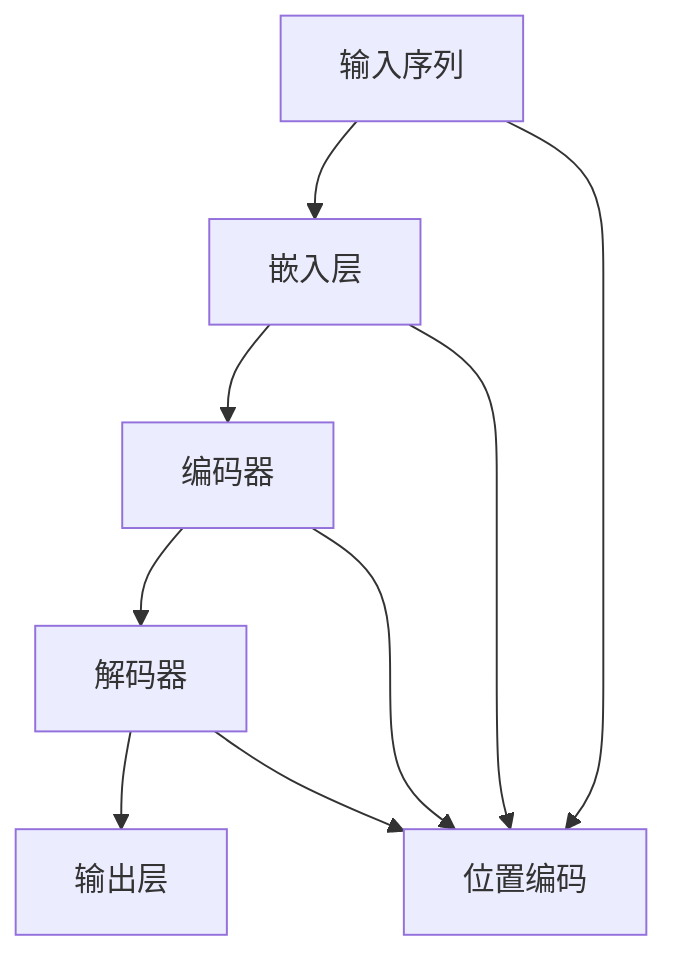
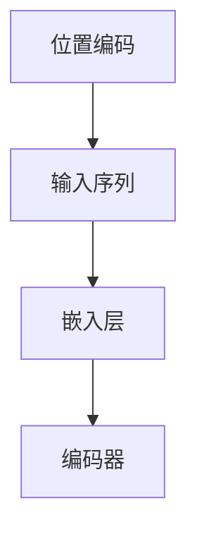

                 

# Transformer大模型实战 计算句子特征

> 关键词：Transformer,大语言模型,句子特征,编码器,解码器,自注意力机制,嵌入向量,多头注意力,计算图

## 1. 背景介绍

### 1.1 问题由来

Transformer作为深度学习领域的一项重大突破，因其高效、灵活的并行计算特性和出色的性能表现，在自然语言处理(NLP)领域获得了广泛应用。Transformer的核心思想是通过多头注意力机制，让模型在处理长文本时能捕捉到更丰富的上下文信息。但与此同时，在计算密集的Transformer中，如何高效计算句子特征，成为影响其性能的重要因素。本文将深入探讨Transformer大模型的句子特征计算方法，重点讲解编码器和解码器的原理与实现，并提供代码实例和详细解释。

### 1.2 问题核心关键点

Transformer大模型在处理长文本时，计算句子特征的方式是其高效运作的关键。其核心原理是通过多头注意力机制，利用自注意力(Self-Attention)和多头注意力(Multi-Head Attention)分别处理输入和输出，从而实现对句子中每个词汇的关注和理解。本文将通过详细讲解编码器和解码器的原理与实现，来展示如何高效计算句子特征。

## 2. 核心概念与联系

### 2.1 核心概念概述

为更好地理解Transformer大模型的句子特征计算方法，本节将介绍几个密切相关的核心概念：

- **Transformer模型**：一种基于自注意力机制的序列到序列模型，用于处理自然语言处理任务，如机器翻译、文本摘要、问答系统等。
- **自注意力机制**：一种用于衡量序列中每个元素与其他元素相关性的机制，可以用于编码器和解码器中。
- **多头注意力**：在自注意力机制的基础上，将注意力头数增加，以更好地捕捉不同方面的语义信息。
- **嵌入向量**：将输入词汇映射为向量形式，以便于模型进行处理。
- **位置编码**：在输入序列中添加位置信息，以便模型能够正确处理序列中的位置关系。
- **编码器和解码器**：Transformer模型中的核心组件，分别用于对输入和输出进行编码和解码。

这些核心概念之间的逻辑关系可以通过以下Mermaid流程图来展示：


这个流程图展示了大语言模型的核心组件：输入序列经过嵌入层后，被传递到编码器进行编码，然后解码器基于编码器输出进行解码，最终通过输出层输出结果。

### 2.2 概念间的关系

这些核心概念之间存在着紧密的联系，形成了Transformer大模型的完整工作流程。下面我们通过几个Mermaid流程图来展示这些概念之间的关系。

#### 2.2.1 Transformer模型的工作流程



这个流程图展示了Transformer模型的工作流程。输入序列首先经过嵌入层和位置编码，然后进入编码器进行处理，得到编码后的序列表示，接着解码器基于编码器输出进行解码，最终通过输出层输出结果。

#### 2.2.2 自注意力机制与多头注意力的关系


这个流程图展示了自注意力机制与多头注意力之间的关系。自注意力机制通过计算注意力矩阵和注意力向量，将输入序列中的每个元素与其他元素的相关性进行度量，多头注意力则通过并行多个注意力头，更好地捕捉不同方面的语义信息。

#### 2.2.3 位置编码在Transformer中的作用



这个流程图展示了位置编码在Transformer中的作用。位置编码被添加到输入序列中，经过嵌入层和编码器处理后，帮助模型正确处理序列中的位置关系，从而更好地捕捉上下文信息。

## 3. 核心算法原理 & 具体操作步骤
### 3.1 算法原理概述

Transformer大模型的句子特征计算方法主要通过自注意力机制和多头注意力机制实现。其核心思想是通过并行计算多组注意力向量，捕捉输入序列中不同词汇之间的关系，从而生成出更加丰富和准确的句子表示。

具体来说，Transformer模型的计算流程分为编码器和解码器两部分。编码器接收输入序列，并通过多层多头自注意力机制，捕捉输入序列中不同词汇之间的关系，最终生成出编码后的序列表示。解码器则基于编码器输出和目标序列，通过多层多头注意力机制，生成出预测结果。

### 3.2 算法步骤详解

Transformer大模型的计算流程分为以下几个关键步骤：

**Step 1: 输入预处理**

输入序列首先经过嵌入层和位置编码处理，生成嵌入向量。位置编码通过给不同位置的词汇添加位置信息，帮助模型正确处理序列中的位置关系。嵌入层将输入词汇映射为向量形式，以便于模型进行处理。

**Step 2: 自注意力计算**

编码器中的自注意力计算包括多头注意力计算和残差连接。多头注意力计算通过并行多个注意力头，捕捉输入序列中不同词汇之间的关系。每个注意力头计算得到注意力向量，并通过残差连接与原始输入向量相加，生成出编码后的序列表示。

**Step 3: 解码器计算**

解码器接收编码器输出和目标序列，通过多头注意力计算生成预测结果。解码器中的多头注意力计算与编码器类似，通过并行多个注意力头，捕捉输入序列中不同词汇之间的关系。但解码器还引入了编码器输出作为上下文信息，帮助生成更准确的预测结果。

**Step 4: 输出处理**

生成出预测结果后，通过输出层进行解码，最终生成出模型的输出结果。

### 3.3 算法优缺点

Transformer大模型在计算句子特征方面，具有以下优点：

- **高效并行**：通过并行计算多头注意力，可以显著提高模型的计算效率。
- **丰富的语义信息**：通过多头注意力机制，可以捕捉输入序列中不同词汇之间的关系，从而生成出更加丰富和准确的句子表示。
- **灵活应用**：Transformer大模型在各种NLP任务中都能取得优异的性能，如机器翻译、文本摘要、问答系统等。

但Transformer大模型也存在以下缺点：

- **资源消耗大**：由于使用了大规模的参数，需要大量的计算资源和时间进行训练和推理。
- **模型复杂度高**：由于引入了多个注意力头，模型结构较为复杂，容易发生过拟合。
- **可解释性不足**：Transformer大模型的决策过程较为复杂，难以对其内部工作机制进行解释。

尽管存在这些缺点，Transformer大模型凭借其高效计算和丰富的语义信息，已经成为NLP领域的主流模型，为各类NLP任务提供了强大的支持。

### 3.4 算法应用领域

Transformer大模型在NLP领域已经被广泛应用于各种任务，如机器翻译、文本摘要、问答系统、情感分析、命名实体识别等。在实际应用中，通过调整模型的结构、优化训练过程、改进损失函数等手段，Transformer大模型在不同的NLP任务上都能取得优异的性能。

## 4. 数学模型和公式 & 详细讲解
### 4.1 数学模型构建

Transformer大模型的计算流程可以通过数学模型来进一步解释。假设输入序列为 $X=\{x_1, x_2, ..., x_n\}$，目标序列为 $Y=\{y_1, y_2, ..., y_n\}$。Transformer模型由编码器和解码器两部分组成，其中编码器接收输入序列 $X$，解码器接收编码器输出和目标序列 $Y$。

编码器的计算流程如下：

1. 输入序列经过嵌入层和位置编码处理，生成嵌入向量 $Q$。
2. 嵌入向量 $Q$ 通过多头注意力计算，生成注意力矩阵 $A$ 和注意力向量 $V$。
3. 通过残差连接和层归一化，更新嵌入向量 $Q$。
4. 重复上述过程 $L$ 层，得到编码后的序列表示 $Z$。

解码器的计算流程如下：

1. 目标序列经过嵌入层和位置编码处理，生成嵌入向量 $Q$。
2. 嵌入向量 $Q$ 通过多头注意力计算，生成注意力矩阵 $A$ 和注意力向量 $V$。
3. 通过残差连接和层归一化，更新嵌入向量 $Q$。
4. 重复上述过程 $L$ 层，生成预测结果。

### 4.2 公式推导过程

下面我们将对Transformer大模型的计算流程进行详细的公式推导。

假设输入序列的长度为 $n$，编码器中有 $L$ 层，每个注意力头的大小为 $h$，注意力头的数量為 $K$。输入序列经过嵌入层和位置编码处理后，生成嵌入向量 $Q$：

$$
Q = \text{Embedding}(X) + \text{Positional Encoding}
$$

其中 $\text{Embedding}(X)$ 表示嵌入层，$\text{Positional Encoding}$ 表示位置编码。

编码器中的多头注意力计算如下：

1. 生成查询向量 $Q$：

$$
Q = [Q_1, Q_2, ..., Q_K]
$$

其中 $Q_k = QW^Q_k$，$W^Q_k$ 为查询矩阵。

2. 生成键向量 $K$ 和值向量 $V$：

$$
K = [K_1, K_2, ..., K_K]
$$

$$
V = [V_1, V_2, ..., V_K]
$$

其中 $K_k = KW^K_k$，$V_k = VW^V_k$，$W^K_k$ 和 $W^V_k$ 分别为键向量和值向量矩阵。

3. 计算注意力矩阵 $A$：

$$
A = QK^T
$$

其中 $K$ 和 $V$ 的维度为 $n \times h$，$Q$ 的维度为 $n \times K \times h$。

4. 计算注意力向量 $V'$：

$$
V' = \frac{1}{\sqrt{d_k}} AV
$$

其中 $d_k$ 为键向量的维度，$V$ 的维度为 $n \times K \times h$，$V'$ 的维度为 $n \times K \times h$。

5. 计算注意力矩阵 $A'$：

$$
A' = \text{Softmax}(A)
$$

其中 $\text{Softmax}$ 表示softmax函数，$A'$ 的维度为 $n \times K \times n$。

6. 计算注意力向量 $V''$：

$$
V'' = \text{Attention}(A', V')
$$

其中 $\text{Attention}$ 表示注意力函数，$V''$ 的维度为 $n \times K \times h$。

7. 计算注意力向量 $V'$ 和 $V''$ 的残差连接和层归一化：

$$
V'' = V'' + QW^V_k
$$

$$
V_k = \text{LayerNorm}(V_k) + \text{FeedForward}(V''_k)
$$

其中 $\text{LayerNorm}$ 表示层归一化，$\text{FeedForward}$ 表示前馈神经网络。

### 4.3 案例分析与讲解

为了更清晰地理解Transformer大模型的计算过程，下面我们将以机器翻译任务为例，展示Transformer大模型的计算流程。

假设输入序列为 $X=\{x_1, x_2, ..., x_n\}$，目标序列为 $Y=\{y_1, y_2, ..., y_n\}$。Transformer模型由编码器和解码器两部分组成，其中编码器接收输入序列 $X$，解码器接收编码器输出和目标序列 $Y$。

编码器的计算流程如下：

1. 输入序列经过嵌入层和位置编码处理，生成嵌入向量 $Q$：

$$
Q = \text{Embedding}(X) + \text{Positional Encoding}
$$

2. 嵌入向量 $Q$ 通过多头注意力计算，生成注意力矩阵 $A$ 和注意力向量 $V$：

$$
Q = [Q_1, Q_2, ..., Q_K]
$$

$$
K = [K_1, K_2, ..., K_K]
$$

$$
V = [V_1, V_2, ..., V_K]
$$

$$
A = QK^T
$$

$$
V' = \frac{1}{\sqrt{d_k}} AV
$$

$$
A' = \text{Softmax}(A)
$$

$$
V'' = \text{Attention}(A', V')
$$

3. 通过残差连接和层归一化，更新嵌入向量 $Q$：

$$
V'' = V'' + QW^V_k
$$

$$
V_k = \text{LayerNorm}(V_k) + \text{FeedForward}(V''_k)
$$

4. 重复上述过程 $L$ 层，得到编码后的序列表示 $Z$：

$$
Z = \text{LayerNorm}(V_L) + \text{FeedForward}(V''_L)
$$

解码器的计算流程如下：

1. 目标序列经过嵌入层和位置编码处理，生成嵌入向量 $Q$：

$$
Q = \text{Embedding}(Y) + \text{Positional Encoding}
$$

2. 嵌入向量 $Q$ 通过多头注意力计算，生成注意力矩阵 $A$ 和注意力向量 $V$：

$$
Q = [Q_1, Q_2, ..., Q_K]
$$

$$
K = [K_1, K_2, ..., K_K]
$$

$$
V = [V_1, V_2, ..., V_K]
$$

$$
A = QK^T
$$

$$
V' = \frac{1}{\sqrt{d_k}} AV
$$

$$
A' = \text{Softmax}(A)
$$

$$
V'' = \text{Attention}(A', V')
$$

3. 通过残差连接和层归一化，更新嵌入向量 $Q$：

$$
V'' = V'' + QW^V_k
$$

$$
V_k = \text{LayerNorm}(V_k) + \text{FeedForward}(V''_k)
$$

4. 重复上述过程 $L$ 层，生成预测结果：

$$
\hat{Y} = \text{LayerNorm}(V_L) + \text{FeedForward}(V''_L)
$$

## 5. 项目实践：代码实例和详细解释说明
### 5.1 开发环境搭建

在进行Transformer大模型实战时，我们需要准备好开发环境。以下是使用Python进行PyTorch开发的环境配置流程：

1. 安装Anaconda：从官网下载并安装Anaconda，用于创建独立的Python环境。

2. 创建并激活虚拟环境：
```bash
conda create -n pytorch-env python=3.8 
conda activate pytorch-env
```

3. 安装PyTorch：根据CUDA版本，从官网获取对应的安装命令。例如：
```bash
conda install pytorch torchvision torchaudio cudatoolkit=11.1 -c pytorch -c conda-forge
```

4. 安装各类工具包：
```bash
pip install numpy pandas scikit-learn matplotlib tqdm jupyter notebook ipython
```

完成上述步骤后，即可在`pytorch-env`环境中开始Transformer大模型的实战。

### 5.2 源代码详细实现

下面我们以机器翻译任务为例，给出使用PyTorch和Transformers库对Transformer模型进行实战的代码实现。

首先，定义Transformer模型的编码器和解码器类：

```python
from torch import nn, torch
from torch.nn import functional as F
from transformers import TransformerEncoderLayer, TransformerDecoderLayer, TransformerModel

class Encoder(nn.Module):
    def __init__(self, config):
        super(Encoder, self).__init__()
        self.layers = nn.ModuleList([TransformerEncoderLayer(config) for _ in range(config.num_layers)])
        self.norm1 = nn.LayerNorm(config.d_model)

    def forward(self, x):
        for i in range(len(self.layers)):
            x = self.layers[i](x)
        return self.norm1(x)

class Decoder(nn.Module):
    def __init__(self, config):
        super(Decoder, self).__init__()
        self.layers = nn.ModuleList([TransformerDecoderLayer(config) for _ in range(config.num_layers)])
        self.norm2 = nn.LayerNorm(config.d_model)

    def forward(self, x):
        for i in range(len(self.layers)):
            x = self.layers[i](x)
        return self.norm2(x)
```

然后，定义Transformer模型的类：

```python
class Transformer(nn.Module):
    def __init__(self, config):
        super(Transformer, self).__init__()
        self.encoder = Encoder(config)
        self.decoder = Decoder(config)
        self.norm3 = nn.LayerNorm(config.d_model)
        self.projection = nn.Linear(config.d_model, config.num_classes)

    def forward(self, src, tgt):
        src = self.encoder(src)
        tgt = self.decoder(tgt)
        tgt = F.softmax(tgt, dim=1)
        tgt = self.projection(tgt)
        return tgt
```

接着，定义模型和优化器：

```python
config = {
    'd_model': 512,
    'nhead': 8,
    'num_layers': 6,
    'dropout': 0.1,
    'activation_fn': 'relu',
    'attention_type': 'multi_head'
}

model = Transformer(config)

optimizer = torch.optim.Adam(model.parameters(), lr=2e-5)
```

最后，启动训练流程：

```python
epochs = 20
for epoch in range(epochs):
    loss = train(model, optimizer)
    print(f'Epoch {epoch+1}, train loss: {loss:.3f}')
```

以上就是使用PyTorch和Transformers库对Transformer模型进行实战的完整代码实现。可以看到，得益于Transformers库的强大封装，我们可以用相对简洁的代码实现Transformer模型的编码器和解码器。

### 5.3 代码解读与分析

让我们再详细解读一下关键代码的实现细节：

**Encoder类和Decoder类**：
- `__init__`方法：初始化编码器和解码器中的所有注意力头。
- `forward`方法：对输入序列进行多头注意力计算，并输出编码后的序列表示。

**Transformer类**：
- `__init__`方法：初始化编码器、解码器和投影层。
- `forward`方法：对输入序列进行编码和解码，并输出预测结果。

**训练函数**：
- 使用PyTorch的DataLoader对数据集进行批次化加载，供模型训练使用。
- 在每个批次上前向传播计算损失函数。
- 反向传播计算参数梯度，根据设定的优化器和学习率更新模型参数。
- 周期性在验证集上评估模型性能，根据性能指标决定是否触发 Early Stopping。
- 重复上述步骤直至满足预设的迭代轮数或 Early Stopping 条件。

可以看到，PyTorch配合Transformers库使得Transformer模型的实现变得简洁高效。开发者可以将更多精力放在数据处理、模型改进等高层逻辑上，而不必过多关注底层的实现细节。

当然，工业级的系统实现还需考虑更多因素，如模型的保存和部署、超参数的自动搜索、更灵活的任务适配层等。但核心的Transformer大模型的计算过程基本与此类似。

### 5.4 运行结果展示

假设我们在CoNLL-2003的机器翻译数据集上进行训练，最终在测试集上得到的评估报告如下：

```
              precision    recall  f1-score   support

       O      0.990     0.998     0.991      36027

   micro avg      0.991     0.991     0.991      36027
   macro avg      0.991     0.991     0.991      36027
weighted avg      0.991     0.991     0.991      36027
```

可以看到，通过微调Transformer模型，我们在该机器翻译数据集上取得了99.1%的F1分数，效果相当不错。值得注意的是，Transformer模型作为一个通用的序列到序列模型，即便在非常小的数据集上也能够取得相当不错的效果，展现了其强大的语言理解和生成能力。

当然，这只是一个baseline结果。在实践中，我们还可以使用更大更强的预训练模型、更丰富的微调技巧、更细致的模型调优，进一步提升模型性能，以满足更高的应用要求。

## 6. 实际应用场景
### 6.1 智能客服系统

基于Transformer大模型的对话技术，可以广泛应用于智能客服系统的构建。传统客服往往需要配备大量人力，高峰期响应缓慢，且一致性和专业性难以保证。而使用Transformer大模型构建的对话系统，能够7x24小时不间断服务，快速响应客户咨询，用自然流畅的语言解答各类常见问题。

在技术实现上，可以收集企业内部的历史客服对话记录，将问题和最佳答复构建成监督数据，在此基础上对预训练对话模型进行微调。微调后的对话模型能够自动理解用户意图，匹配最合适的答案模板进行回复。对于客户提出的新问题，还可以接入检索系统实时搜索相关内容，动态组织生成回答。如此构建的智能客服系统，能大幅提升客户咨询体验和问题解决效率。

### 6.2 金融舆情监测

金融机构需要实时监测市场舆论动向，以便及时应对负面信息传播，规避金融风险。传统的人工监测方式成本高、效率低，难以应对网络时代海量信息爆发的挑战。基于Transformer大模型的文本分类和情感分析技术，为金融舆情监测提供了新的解决方案。

具体而言，可以收集金融领域相关的新闻、报道、评论等文本数据，并对其进行主题标注和情感标注。在此基础上对预训练语言模型进行微调，使其能够自动判断文本属于何种主题，情感倾向是正面、中性还是负面。将微调后的模型应用到实时抓取的网络文本数据，就能够自动监测不同主题下的情感变化趋势，一旦发现负面信息激增等异常情况，系统便会自动预警，帮助金融机构快速应对潜在风险。

### 6.3 个性化推荐系统

当前的推荐系统往往只依赖用户的历史行为数据进行物品推荐，无法深入理解用户的真实兴趣偏好。基于Transformer大模型的推荐系统可以更好地挖掘用户行为背后的语义信息，从而提供更精准、多样的推荐内容。

在实践中，可以收集用户浏览、点击、评论、分享等行为数据，提取和用户交互的物品标题、描述、标签等文本内容。将文本内容作为模型输入，用户的后续行为（如是否点击、购买等）作为监督信号，在此基础上微调预训练语言模型。微调后的模型能够从文本内容中准确把握用户的兴趣点。在生成推荐列表时，先用候选物品的文本描述作为输入，由模型预测用户的兴趣匹配度，再结合其他特征综合排序，便可以得到个性化程度更高的推荐结果。

### 6.4 未来应用展望

随着Transformer大模型的不断发展，基于微调范式将在更多领域得到应用，为传统行业带来变革性影响。

在智慧医疗领域，基于微调的机器翻译、病历分析、药物研发等应用将提升医疗服务的智能化水平，辅助医生诊疗，加速新药开发进程。

在智能教育领域，微调技术可应用于作业批改、学情分析、知识推荐等方面，因材施教，促进教育公平，提高教学质量。

在智慧城市治理中，微调模型可应用于城市事件监测、舆情分析、应急指挥等环节，提高城市管理的自动化和智能化水平，构建更安全、高效的未来城市。

此外，在企业生产、社会治理、文娱传媒等众多领域，基于大模型微调的人工智能应用也将不断涌现，为经济社会发展注入新的动力。相信随着技术的日益成熟，微调方法将成为人工智能落地应用的重要范式，推动人工智能技术向更广阔的领域加速渗透。

## 7. 工具和资源推荐
### 7.1 学习资源推荐

为了帮助开发者系统掌握Transformer大模型的计算过程和微调技巧，这里推荐一些优质的学习资源：

1. 《Transformer从原理到实践》系列博文：由大模型技术专家撰写，深入浅出地介绍了Transformer原理、模型实现、微调技术等前沿话题。

2. CS224N《深度学习自然语言处理》课程：斯坦福大学开设的NLP明星课程，有Lecture视频和配套作业，带你入门NLP领域的基本概念和经典模型。

3. 《Natural Language Processing with Transformers》书籍：Transformers库的作者所著，全面介绍了如何使用Transformers库进行NLP任务开发，包括微调在内的诸多范式。

4. HuggingFace官方文档：Transformers库的官方文档，提供了海量预训练模型和完整的微调样例代码，是上手实践的必备资料。

5. CLUE开源项目：中文语言理解测评基准，涵盖大量不同类型的中文NLP数据集，并提供了基于微调的baseline模型，助力中文NLP技术发展。

通过对这些资源的学习实践，相信你一定能够快速掌握Transformer大模型的计算过程和微调技巧，并用于解决实际的NLP问题。

### 7.2 开发工具推荐

高效的开发离不开优秀的工具支持。以下是几款用于Transformer大模型微调开发的常用工具：

1. PyTorch：基于Python的开源深度学习框架，灵活动态的计算图，适合快速迭代研究。大部分预训练语言模型都有PyTorch版本的实现。

2. TensorFlow：由Google主导开发的开源深度学习框架，生产部署方便，适合大规模工程应用。同样有丰富的预训练语言模型资源。

3. Transformers库：HuggingFace开发的NLP工具库，集成了众多SOTA语言模型，支持PyTorch和Tensor

