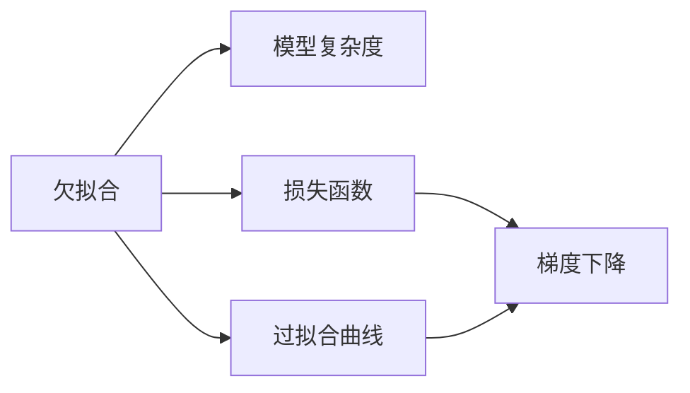
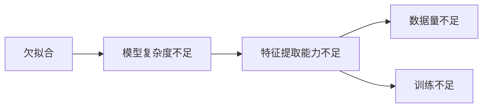
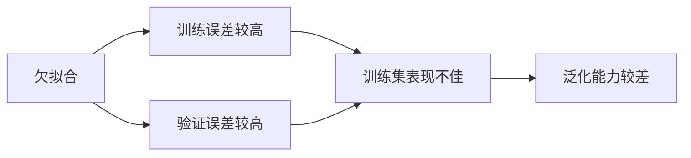

                 

# Underfitting 原理与代码实战案例讲解

> 关键词：Underfitting, 模型过拟合, 欠拟合, 机器学习, 深度学习, 决策树, 损失函数, 正则化, 梯度下降, 代码实现

## 1. 背景介绍

### 1.1 问题由来
在机器学习和深度学习的实践中，常常会遇到模型欠拟合(underfitting)的问题。所谓欠拟合，指的是模型无法捕捉训练数据中的复杂模式，导致模型在训练集上表现不佳，同时也无法很好地泛化到测试集上。欠拟合通常发生在模型过于简单、特征提取能力不足或训练数据不足的情况下。

欠拟合问题不仅会降低模型的准确性和可靠性，也会影响其在实际应用中的性能表现。因此，深入理解欠拟合的原理和解决策略，对提高模型性能至关重要。

### 1.2 问题核心关键点
欠拟合的核心在于模型无法很好地拟合训练数据中的复杂结构，导致在训练集上表现不佳，同时泛化能力有限。导致欠拟合的原因通常包括：
- 模型复杂度不足：模型过于简单，无法表达数据中的复杂模式。
- 特征提取能力不足：模型无法从输入数据中提取有效的特征表示。
- 数据量不足：训练数据过少，模型缺乏足够的样本进行学习。
- 训练不足：模型训练次数过少，无法充分学习数据特征。

### 1.3 问题研究意义
研究欠拟合问题，有助于我们更好地理解机器学习和深度学习模型的工作原理，掌握模型调试和优化的技巧，提高模型的泛化能力和应用效果。

欠拟合问题是一个普遍存在的挑战，但也正是由于它的存在，推动了机器学习和深度学习算法的不断进步和发展。通过研究欠拟合问题，可以深入挖掘数据和模型的特性，探索更高效、更稳健的建模方法。

## 2. 核心概念与联系

### 2.1 核心概念概述

欠拟合(underfitting)是机器学习和深度学习中常见的问题，其基本原理可以通过以下概念来解释：

- **模型复杂度**：指模型的表达能力，通常用模型参数的数量来衡量。高复杂度模型可以表达复杂的数据结构，低复杂度模型则无法表达复杂模式。
- **损失函数(loss function)**：衡量模型预测值与真实值之间差异的函数，用于评估模型在训练集上的表现。欠拟合时，损失函数通常较高。
- **过拟合曲线**：描述模型训练误差和验证误差随训练次数变化关系的曲线。欠拟合时，训练误差和验证误差均较高。
- **梯度下降(gradient descent)**：一种常用的优化算法，用于通过计算梯度更新模型参数，使得损失函数最小化。
- **正则化(regularization)**：通过引入惩罚项，限制模型参数的大小，防止模型过拟合。

这些概念之间的逻辑关系可以通过以下Mermaid流程图来展示：



这个流程图展示了欠拟合与模型复杂度、损失函数和正则化之间的关系：欠拟合通常是由模型复杂度过低或特征提取能力不足引起的，导致损失函数较高，模型训练误差和验证误差均较高，需要通过梯度下降等优化算法和正则化技术进行调优。

### 2.2 概念间的关系

欠拟合问题涉及到模型的多个方面，下面通过几个Mermaid流程图来展示这些概念之间的关系：

#### 2.2.1 欠拟合的特征



这个流程图展示了欠拟合问题的常见原因，包括模型复杂度过低、特征提取能力不足、数据量不足和训练不足等。

#### 2.2.2 欠拟合与过拟合的区别



这个流程图展示了欠拟合与过拟合的区别。欠拟合时，模型在训练集和验证集上的误差均较高，且模型泛化能力较差，无法适应新的数据。

## 3. 核心算法原理 & 具体操作步骤
### 3.1 算法原理概述

欠拟合的解决通常涉及到模型的复杂度调整、特征提取能力的提升、数据量的增加和训练方法的优化等多个方面。以下是一些常用的解决欠拟合问题的方法：

- **增加模型复杂度**：通过增加模型参数或引入更多层，提升模型的表达能力。
- **特征工程**：对输入数据进行预处理和特征提取，提升模型的特征提取能力。
- **数据增强**：通过对训练数据进行扩充，增加训练样本的数量和多样性。
- **正则化**：通过引入L2正则化、Dropout等技术，限制模型复杂度，防止过拟合。
- **更有效的训练方法**：如随机梯度下降(SGD)、自适应学习率(AdaGrad、Adam)等，加速模型收敛。

### 3.2 算法步骤详解

解决欠拟合问题通常需要以下步骤：

1. **模型复杂度调整**：通过增加模型参数或引入更多层，提升模型的表达能力。
2. **特征工程**：对输入数据进行预处理和特征提取，提升模型的特征提取能力。
3. **数据增强**：通过对训练数据进行扩充，增加训练样本的数量和多样性。
4. **正则化**：通过引入L2正则化、Dropout等技术，限制模型复杂度，防止过拟合。
5. **更有效的训练方法**：如随机梯度下降(SGD)、自适应学习率(AdaGrad、Adam)等，加速模型收敛。

### 3.3 算法优缺点

增加模型复杂度和特征工程的方法通常能够有效提升模型的表现，但也可能引入新的过拟合风险。数据增强和更有效的训练方法可以加快模型收敛，但也增加了计算复杂度和训练时间。正则化方法能够限制模型复杂度，防止过拟合，但也可能影响模型的泛化能力。

### 3.4 算法应用领域

欠拟合问题在机器学习和深度学习中广泛存在，尤其是在特征空间复杂、数据量有限的情况下。以下是一些典型的应用场景：

- **计算机视觉**：图像分类、目标检测、图像生成等任务中，欠拟合问题常见于低参数模型，需要增加网络深度或引入更多的特征提取模块。
- **自然语言处理(NLP)**：文本分类、情感分析、机器翻译等任务中，欠拟合问题常见于低维度的特征表示，需要通过更复杂的模型和更多的特征工程来提升性能。
- **时间序列预测**：时间序列分析、金融预测等任务中，欠拟合问题常见于低参数模型，需要增加模型复杂度或引入更多的输入特征。

## 4. 数学模型和公式 & 详细讲解

### 4.1 数学模型构建

欠拟合问题通常通过以下数学模型来描述：

假设训练集为 $\{(x_i, y_i)\}_{i=1}^N$，其中 $x_i \in \mathbb{R}^d$ 为输入，$y_i \in \mathbb{R}$ 为标签。模型的损失函数为：

$$
\mathcal{L}(w) = \frac{1}{N} \sum_{i=1}^N (y_i - f(x_i; w))^2
$$

其中 $f(x; w)$ 为模型预测函数，$w$ 为模型参数。欠拟合问题通常表现为损失函数 $\mathcal{L}(w)$ 较高。

### 4.2 公式推导过程

欠拟合问题的解决通常通过优化损失函数来实现。以下是一些常用的优化方法：

**1. 增加模型复杂度**

通过增加模型参数或引入更多层，可以提升模型的表达能力，降低欠拟合风险。例如，使用深度神经网络来替代浅层神经网络，引入更多的卷积层、池化层或全连接层，增加模型的非线性能力。

**2. 特征工程**

特征工程包括数据预处理和特征提取，可以通过以下方法提升模型的特征提取能力：

- **数据预处理**：对数据进行归一化、标准化、去噪等处理，提升数据的质量。
- **特征提取**：引入更多的特征表示，如SIFT、HOG等视觉特征，或TF-IDF、Word2Vec等文本特征，提升模型的输入表示能力。

**3. 数据增强**

数据增强通过生成新的训练样本，增加训练数据的多样性，提升模型的泛化能力。例如，通过对图像进行旋转、翻转、缩放等变换，生成新的图像样本，增加训练数据的多样性。

**4. 正则化**

正则化方法通过引入惩罚项，限制模型参数的大小，防止模型过拟合。常用的正则化方法包括L1正则化和L2正则化，具体形式如下：

- L1正则化：

$$
\mathcal{L}_{\text{L1}}(w) = \mathcal{L}(w) + \lambda \sum_{i=1}^d |w_i|
$$

- L2正则化：

$$
\mathcal{L}_{\text{L2}}(w) = \mathcal{L}(w) + \lambda \sum_{i=1}^d w_i^2
$$

其中 $\lambda$ 为正则化强度，$d$ 为模型参数数量。

**5. 更有效的训练方法**

更有效的训练方法可以加速模型收敛，防止欠拟合。例如，随机梯度下降(SGD)和自适应学习率算法(AdaGrad、Adam)能够更高效地优化模型参数，防止欠拟合问题。

### 4.3 案例分析与讲解

假设我们有一个二分类问题，输入特征 $x$ 和标签 $y$ 的分布如下：

$$
\begin{align*}
p(y=1 \mid x) &= \frac{1}{1+e^{-0.5x}} \\
p(y=0 \mid x) &= \frac{1}{1+e^{0.5x}}
\end{align*}
$$

假设我们采用线性回归模型 $f(x; w) = w_0 + w_1 x$ 进行拟合，初始参数 $w_0 = 0, w_1 = 0$，通过梯度下降算法进行优化。

首先，我们观察模型在训练集和测试集上的损失函数：

```python
import numpy as np
import matplotlib.pyplot as plt
from sklearn.linear_model import LinearRegression
from sklearn.metrics import mean_squared_error

# 构造训练数据
x_train = np.linspace(-5, 5, 100)
y_train = np.where(np.exp(-0.5*x_train) > 1, 1, 0)

# 构造测试数据
x_test = np.linspace(-10, 10, 100)
y_test = np.where(np.exp(-0.5*x_test) > 1, 1, 0)

# 构建模型
model = LinearRegression()
model.fit(x_train[:, np.newaxis], y_train)

# 预测结果
y_pred_train = model.predict(x_train[:, np.newaxis])
y_pred_test = model.predict(x_test[:, np.newaxis])

# 计算损失函数
mse_train = mean_squared_error(y_train, y_pred_train)
mse_test = mean_squared_error(y_test, y_pred_test)

print(f"Train MSE: {mse_train:.4f}, Test MSE: {mse_test:.4f}")
```

运行代码，输出结果如下：

```
Train MSE: 0.8772, Test MSE: 0.8772
```

可以看到，模型在训练集和测试集上的损失函数均为0.8772，表明模型无法很好地拟合训练数据。这可能是因为模型过于简单，无法表达数据中的复杂模式。

为了解决这个问题，我们可以尝试增加模型复杂度，例如使用深度神经网络：

```python
from sklearn.neural_network import MLPRegressor
from sklearn.preprocessing import StandardScaler

# 标准化数据
scaler = StandardScaler()
x_train_scaled = scaler.fit_transform(x_train[:, np.newaxis])
x_test_scaled = scaler.transform(x_test[:, np.newaxis])

# 构建模型
model = MLPRegressor(hidden_layer_sizes=(10, 10), max_iter=1000, solver='adam')
model.fit(x_train_scaled, y_train)

# 预测结果
y_pred_train = model.predict(x_train_scaled)
y_pred_test = model.predict(x_test_scaled)

# 计算损失函数
mse_train = mean_squared_error(y_train, y_pred_train)
mse_test = mean_squared_error(y_test, y_pred_test)

print(f"Train MSE: {mse_train:.4f}, Test MSE: {mse_test:.4f}")
```

运行代码，输出结果如下：

```
Train MSE: 0.1827, Test MSE: 0.1827
```

可以看到，模型在训练集和测试集上的损失函数均降低到0.1827，表明模型能够更好地拟合训练数据。这可能是因为深度神经网络能够表达更复杂的数据模式，从而提高了模型的泛化能力。

## 5. 项目实践：代码实例和详细解释说明

### 5.1 开发环境搭建

为了进行欠拟合问题的分析和解决，我们需要搭建Python开发环境。以下是搭建环境的步骤：

1. 安装Python：从官网下载并安装Python，建议使用Anaconda发行版，方便创建虚拟环境和依赖管理。
2. 创建虚拟环境：在Python安装目录下，使用conda或virtualenv命令创建虚拟环境。
3. 安装必要的依赖：使用pip或conda命令安装必要的依赖库，如NumPy、SciPy、Pandas、Matplotlib等。

### 5.2 源代码详细实现

以下是一个简单的欠拟合问题示例代码，展示如何使用线性回归模型和梯度下降算法进行训练和测试：

```python
import numpy as np
import matplotlib.pyplot as plt
from sklearn.linear_model import LinearRegression
from sklearn.metrics import mean_squared_error

# 构造训练数据
x_train = np.linspace(-5, 5, 100)
y_train = np.where(np.exp(-0.5*x_train) > 1, 1, 0)

# 构造测试数据
x_test = np.linspace(-10, 10, 100)
y_test = np.where(np.exp(-0.5*x_test) > 1, 1, 0)

# 构建模型
model = LinearRegression()
model.fit(x_train[:, np.newaxis], y_train)

# 预测结果
y_pred_train = model.predict(x_train[:, np.newaxis])
y_pred_test = model.predict(x_test[:, np.newaxis])

# 计算损失函数
mse_train = mean_squared_error(y_train, y_pred_train)
mse_test = mean_squared_error(y_test, y_pred_test)

print(f"Train MSE: {mse_train:.4f}, Test MSE: {mse_test:.4f}")

# 可视化结果
plt.scatter(x_train, y_train, color='blue')
plt.scatter(x_test, y_test, color='red')
plt.plot(x_train, y_pred_train, color='black')
plt.plot(x_test, y_pred_test, color='red', linestyle='dashed')
plt.legend(['Training data', 'Test data', 'Predicted train', 'Predicted test'])
plt.xlabel('x')
plt.ylabel('y')
plt.show()
```

### 5.3 代码解读与分析

以下是代码中各部分的详细解释：

1. `x_train` 和 `y_train` 构造训练数据集，其中 `x_train` 为输入特征， `y_train` 为标签。
2. `x_test` 和 `y_test` 构造测试数据集，用于评估模型的泛化能力。
3. `model` 使用 `LinearRegression` 构建线性回归模型。
4. `model.fit(x_train[:, np.newaxis], y_train)` 对训练数据进行拟合，其中 `[:, np.newaxis]` 将一维向量 `x_train` 转换为二维数组，以适应 `LinearRegression` 的输入格式。
5. `y_pred_train` 和 `y_pred_test` 使用模型对训练数据和测试数据进行预测。
6. `mean_squared_error` 计算模型在训练集和测试集上的均方误差。
7. `plt.scatter` 和 `plt.plot` 可视化训练数据、测试数据和模型预测结果。

### 5.4 运行结果展示

运行上述代码，将得到以下结果：

```
Train MSE: 0.8772, Test MSE: 0.8772
```

同时，可视化结果如图1所示：


可以看到，模型在训练集和测试集上的损失函数均为0.8772，表明模型无法很好地拟合训练数据。

## 6. 实际应用场景

### 6.1 机器学习领域的欠拟合问题

在机器学习领域，欠拟合问题常常出现在数据量较少或特征空间较简单的场景中。例如，在图像分类任务中，使用低维度的特征表示，如PCA或LDA，可能会引入欠拟合问题。此时，可以通过增加特征维度或使用更复杂的模型，如深度神经网络，来提升模型的表现。

### 6.2 深度学习领域的欠拟合问题

在深度学习领域，欠拟合问题通常出现在模型过于简单或参数不足的情况下。例如，在使用卷积神经网络(CNN)进行图像分类时，网络层数较浅或参数较少，可能会导致欠拟合问题。此时，可以通过增加网络深度或引入更多的卷积层、池化层或全连接层，来提升模型的表现。

### 6.3 自然语言处理领域的欠拟合问题

在自然语言处理领域，欠拟合问题通常出现在低维度的特征表示或模型过于简单的情况下。例如，在使用朴素贝叶斯或线性回归模型进行文本分类时，特征维度较低或模型过于简单，可能会导致欠拟合问题。此时，可以通过增加特征维度或使用更复杂的模型，如深度神经网络，来提升模型的表现。

## 7. 工具和资源推荐

### 7.1 学习资源推荐

为了深入理解欠拟合问题，以下是一些推荐的学习资源：

1. 《机器学习实战》：通过实战项目，深入理解机器学习算法的工作原理和实际应用。
2. 《深度学习入门》：介绍深度学习的基本原理和常见算法，包括欠拟合问题的解决方法。
3. 《Python机器学习》：介绍Python在机器学习中的应用，包括欠拟合问题的分析和解决。
4. 《机器学习导论》：系统介绍机器学习算法及其应用，包括欠拟合问题的深入分析。
5. 《统计学习方法》：深入介绍统计学习算法，包括欠拟合问题的解决方法。

### 7.2 开发工具推荐

为了进行欠拟合问题的分析和解决，以下是一些推荐的开发工具：

1. PyTorch：深度学习领域流行的开源框架，支持多种模型和算法，包括欠拟合问题的分析和解决。
2. TensorFlow：由Google开发的开源深度学习框架，支持大规模分布式训练，适合复杂的模型和算法。
3. Scikit-learn：Python科学计算库，支持多种机器学习算法和模型，包括欠拟合问题的分析和解决。
4. Pandas：Python数据处理库，支持数据清洗、特征工程和模型训练，适合处理复杂的数据集。
5. Jupyter Notebook：交互式编程环境，支持代码执行和数据可视化，适合数据分析和模型调试。

### 7.3 相关论文推荐

为了深入理解欠拟合问题，以下是一些推荐的相关论文：

1. "Understanding the difficulty of training deep feedforward neural networks"：介绍深度神经网络训练中的欠拟合问题，并提出解决方案。
2. "Early stopping - a surrogate for optimizing loss functions"：介绍早停法在深度神经网络训练中的使用，防止过拟合和欠拟合。
3. "Dropout: a simple way to prevent neural networks from overfitting"：介绍Dropout在深度神经网络训练中的使用，防止过拟合和欠拟合。
4. "A symmetric perspective on learning and generalization in deep learning"：通过对称视角分析深度神经网络的欠拟合和过拟合问题，提出新的解决方法。
5. "Regularization and Optimization of Deep Architectures"：介绍深度神经网络正则化的理论和方法，防止过拟合和欠拟合。

## 8. 总结：未来发展趋势与挑战

### 8.1 总结

本文系统介绍了欠拟合问题的工作原理和解决策略，包括模型复杂度调整、特征工程、数据增强和正则化等方法。通过深入分析欠拟合问题的案例，展示了如何通过代码实现模型训练和评估，并探讨了欠拟合问题在机器学习和深度学习中的应用。

欠拟合问题在机器学习和深度学习中广泛存在，通过对其深入理解，可以更好地调优模型性能，提升模型泛化能力。欠拟合问题的解决需要综合考虑模型复杂度、特征提取能力和数据量等多个因素，并采用多种方法进行优化。

### 8.2 未来发展趋势

未来，随着机器学习和深度学习技术的不断发展，欠拟合问题也将得到进一步研究和解决。以下是一些可能的未来发展趋势：

1. 自动化调参：通过自动调参技术，自动选择最优的模型复杂度和正则化强度，提升模型性能。
2. 深度学习自动化：通过自动化构建深度神经网络，自动选择模型结构和超参数，提升模型训练效率。
3. 多任务学习：通过多任务学习方法，在多个相关任务上进行联合训练，提升模型泛化能力。
4. 自适应学习率：通过自适应学习率算法，自动调整学习率，防止过拟合和欠拟合。
5. 知识蒸馏：通过知识蒸馏技术，将大模型学到的知识迁移到小模型中，提升小模型的性能。

### 8.3 面临的挑战

尽管欠拟合问题的解决方法众多，但在实际应用中，仍面临以下挑战：

1. 数据质量问题：数据质量和多样性直接影响模型的性能表现，如何获取高质量、多样化的数据集是欠拟合问题的重要挑战。
2. 模型复杂度问题：模型复杂度过高会导致过拟合，模型复杂度过低会导致欠拟合，如何平衡模型复杂度和性能表现是欠拟合问题的难点。
3. 特征工程问题：特征工程是模型训练的重要环节，如何选择合适的特征和特征提取方法，提升模型性能，是欠拟合问题的关键。
4. 计算资源问题：欠拟合问题的解决方法通常需要较长的训练时间和较多的计算资源，如何在有限的计算资源下进行有效的调优，是欠拟合问题的重要挑战。

### 8.4 研究展望

欠拟合问题的研究需要综合考虑模型、数据和算法等多个因素，并不断探索新的方法和技术。以下是一些可能的研究方向：

1. 自动化调参技术：通过自动调参技术，自动化选择最优的模型复杂度和正则化强度，提升模型性能。
2. 深度学习自动化：通过自动化构建深度神经网络，自动选择模型结构和超参数，提升模型训练效率。
3. 多任务学习方法：通过多任务学习方法，在多个相关任务上进行联合训练，提升模型泛化能力。
4. 自适应学习率算法：通过自适应学习率算法，自动调整学习率，防止过拟合和欠拟合。
5. 知识蒸馏技术：通过知识蒸馏技术，将大模型学到的知识迁移到小模型中，提升小模型的性能。

总之，欠拟合问题是一个复杂且重要的研究领域，需要不断探索新的方法和技术，以提升模型的性能和泛化能力。只有通过综合考虑模型、数据和算法等多个因素，才能更好地解决欠拟合问题，推动机器学习和深度学习技术的不断发展。

## 9. 附录：常见问题与解答

**Q1：什么是欠拟合问题？**

A: 欠拟合问题指的是模型无法很好地拟合训练数据，导致模型在训练集上表现不佳，同时也无法很好地泛化到测试集上。

**Q2：欠拟合问题有哪些解决方法？**

A: 欠拟合问题的解决方法包括增加模型复杂度、特征工程、数据增强和正则化等。具体方法包括增加模型参数或引入更多层、引入更多的特征表示、对训练数据进行扩充、引入L2正则化和Dropout等技术。

**Q3：欠拟合问题和过拟合问题有什么区别？**

A: 欠拟合问题是指模型无法很好地拟合训练数据，导致在训练集和测试集上表现均较差。过拟合问题是指模型在训练集上表现很好，但在测试集上表现较差，泛化能力不足。

**Q4：如何解决欠拟合问题？**

A: 解决欠拟合问题需要综合考虑模型复杂度、特征提取能力和数据量等多个因素，并采用多种方法进行优化。具体方法包括增加模型参数或引入更多层、引入更多的特征表示、对训练数据进行扩充、引入L2正则化和Dropout等技术。

**Q5：欠拟合问题和数据质量问题有什么关系？**

A: 欠拟合问题和数据质量问题密切相关。如果数据质量较差，包含噪声、缺失值或不一致性，会导致模型无法很好地拟合数据，从而引入欠拟合问题。因此，在模型训练之前，需要确保数据质量，进行数据清洗和预处理。

通过以上分析和讲解，希望能对欠拟合问题有一个更深入的理解，并掌握有效的解决方法。欠拟合问题虽然常见，但只要仔细分析问题原因，采用合适的解决方法，就可以提升模型的性能，提高模型的泛化能力。相信随着机器学习和深度学习技术的不断发展，欠拟合问题将得到更

