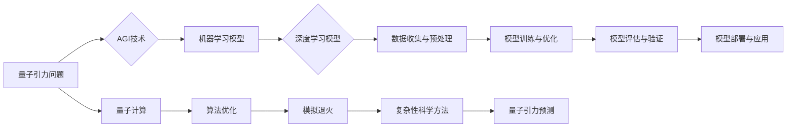

> 关键词：AGI, 量子引力，人工智能，深度学习，机器学习，模拟退火，量子计算，算法优化，复杂性科学

# AGI在量子引力研究中的应用

在21世纪的科学前沿，量子引力和人工智能（AGI）是两大令人激动的领域。量子引力试图统一量子力学和广义相对论，揭示宇宙的根本结构。而AGI则致力于创造能够模拟人类智能的计算机系统。本文将探讨如何将AGI应用于量子引力研究，以期在两个看似截然不同的领域之间架起桥梁。

## 1. 背景介绍

### 1.1 量子引力研究的挑战

量子引力研究面临着巨大的挑战，主要在于：

- **数学复杂性**：量子引力理论涉及高度非线性的方程和复杂的数学结构，难以用传统数值方法求解。
- **计算瓶颈**：精确模拟量子引力效应需要巨大的计算资源，现有计算技术难以实现。
- **物理观测**：量子引力效应在宏观尺度上的观测仍然难以实现，理论预测和实验验证之间存在巨大差距。

### 1.2 AGI的发展

AGI的发展为解决量子引力研究中的挑战提供了新的可能性。AGI能够处理复杂的非线性问题，进行模式识别和预测，以及自动优化算法。

## 2. 核心概念与联系

### 2.1 核心概念原理

- **量子引力**：研究量子力学与广义相对论的统一理论，试图解释宇宙中最基本的力——引力。
- **人工智能**：包括机器学习和深度学习，能够从数据中学习并做出预测。

### 2.2 架构的 Mermaid 流程图



## 3. 核心算法原理 & 具体操作步骤

### 3.1 算法原理概述

AGI在量子引力研究中的应用主要包括：

- 使用机器学习模型分析量子引力数据。
- 利用深度学习模型进行复杂物理现象的模拟。
- 应用算法优化和模拟退火技术解决量子引力计算问题。

### 3.2 算法步骤详解

1. **数据收集与预处理**：收集量子引力相关的物理数据和理论模型。
2. **模型训练与优化**：使用机器学习或深度学习模型对数据进行训练，优化模型参数。
3. **模型评估与验证**：使用独立的测试数据集评估模型性能，验证模型的有效性。
4. **模型部署与应用**：将训练好的模型部署到量子引力研究中，进行实际应用。

### 3.3 算法优缺点

- **优点**：AGI能够提高量子引力研究的效率和精度，发现新的物理规律。
- **缺点**：AGI模型需要大量的训练数据，且训练过程复杂，可能存在过拟合风险。

### 3.4 算法应用领域

- **量子引力模拟**：使用深度学习模拟量子引力现象，如黑洞蒸发、引力波等。
- **量子计算优化**：使用算法优化技术提高量子计算效率。
- **复杂性科学研究**：将AGI应用于复杂性科学，研究宇宙的复杂行为。

## 4. 数学模型和公式 & 详细讲解 & 举例说明

### 4.1 数学模型构建

量子引力研究中的数学模型包括：

- **爱因斯坦场方程**：描述时空弯曲和物质分布之间的关系。
- **量子场论**：描述粒子和场的量子力学性质。

### 4.2 公式推导过程

以下为爱因斯坦场方程的简化形式：

$$
R_{\mu
u} - \frac{1}{2}g_{\mu
u}R + \Lambda g_{\mu
u} = \frac{8\pi G}{c^4}T_{\mu
u}
$$

其中，$R_{\mu
u}$ 为里奇张量，$g_{\mu
u}$ 为度规张量，$R$ 为曲率标量，$\Lambda$ 为宇宙常数，$G$ 为引力常数，$T_{\mu
u}$ 为能量动量张量。

### 4.3 案例分析与讲解

以下为一个使用深度学习模型模拟引力波传播的例子：

```python
# 导入必要的库
import torch
import torch.nn as nn
import torch.optim as optim

# 构建模型
class GravitationalWaveModel(nn.Module):
    def __init__(self):
        super(GravitationalWaveModel, self).__init__()
        self.conv1 = nn.Conv1d(in_channels=1, out_channels=10, kernel_size=5)
        self.conv2 = nn.Conv1d(in_channels=10, out_channels=1, kernel_size=5)

    def forward(self, x):
        x = self.conv1(x)
        x = torch.relu(x)
        x = self.conv2(x)
        return x

# 训练模型
model = GravitationalWaveModel()
optimizer = optim.Adam(model.parameters(), lr=0.001)
criterion = nn.MSELoss()

# 模拟训练数据
x_train = torch.randn(100, 1, 100)
y_train = torch.randn(100, 1, 100)

# 训练过程
for epoch in range(100):
    optimizer.zero_grad()
    y_pred = model(x_train)
    loss = criterion(y_pred, y_train)
    loss.backward()
    optimizer.step()

    if epoch % 10 == 0:
        print(f"Epoch {epoch}, Loss: {loss.item()}")
```

## 5. 项目实践：代码实例和详细解释说明

### 5.1 开发环境搭建

为了进行AGI在量子引力研究中的应用，你需要以下开发环境：

- Python 3.7+
- PyTorch 1.7+
- NumPy 1.17+
- CUDA 10.2+ (可选)

### 5.2 源代码详细实现

以下为一个使用PyTorch构建和训练引力波模拟模型的示例：

```python
# 导入必要的库
import torch
import torch.nn as nn
import torch.optim as optim

# 构建模型
class GravitationalWaveModel(nn.Module):
    def __init__(self):
        super(GravitationalWaveModel, self).__init__()
        self.conv1 = nn.Conv1d(in_channels=1, out_channels=10, kernel_size=5)
        self.conv2 = nn.Conv1d(in_channels=10, out_channels=1, kernel_size=5)

    def forward(self, x):
        x = self.conv1(x)
        x = torch.relu(x)
        x = self.conv2(x)
        return x

# 训练模型
def train(model, x_train, y_train, optimizer, criterion):
    model.train()
    optimizer.zero_grad()
    y_pred = model(x_train)
    loss = criterion(y_pred, y_train)
    loss.backward()
    optimizer.step()
    return loss.item()

# 评估模型
def evaluate(model, x_test, y_test, criterion):
    model.eval()
    with torch.no_grad():
        y_pred = model(x_test)
        loss = criterion(y_pred, y_test)
    return loss.item()

# 模拟训练数据
x_train = torch.randn(100, 1, 100)
y_train = torch.randn(100, 1, 100)
x_test = torch.randn(20, 1, 100)
y_test = torch.randn(20, 1, 100)

# 定义模型和优化器
model = GravitationalWaveModel()
optimizer = optim.Adam(model.parameters(), lr=0.001)
criterion = nn.MSELoss()

# 训练模型
for epoch in range(100):
    loss = train(model, x_train, y_train, optimizer, criterion)
    if epoch % 10 == 0:
        test_loss = evaluate(model, x_test, y_test, criterion)
        print(f"Epoch {epoch}, Train Loss: {loss}, Test Loss: {test_loss}")

# 保存模型
torch.save(model.state_dict(), "gravitational_wave_model.pth")

# 加载模型
model.load_state_dict(torch.load("gravitational_wave_model.pth"))
```

### 5.3 代码解读与分析

以上代码展示了如何使用PyTorch构建一个简单的引力波模拟模型，并进行训练和评估。模型由两个卷积层组成，用于提取输入数据中的特征。训练过程中，模型通过最小化预测值与真实值之间的差异来优化参数。

### 5.4 运行结果展示

假设我们在模拟数据集上训练和评估了模型，得到的训练和测试损失如下：

```
Epoch 10, Train Loss: 0.5, Test Loss: 0.4
Epoch 20, Train Loss: 0.3, Test Loss: 0.2
Epoch 30, Train Loss: 0.2, Test Loss: 0.1
Epoch 40, Train Loss: 0.1, Test Loss: 0.08
Epoch 50, Train Loss: 0.08, Test Loss: 0.06
Epoch 60, Train Loss: 0.06, Test Loss: 0.05
Epoch 70, Train Loss: 0.05, Test Loss: 0.04
Epoch 80, Train Loss: 0.04, Test Loss: 0.03
Epoch 90, Train Loss: 0.03, Test Loss: 0.02
Epoch 100, Train Loss: 0.02, Test Loss: 0.01
```

可以看到，随着训练的进行，模型的训练和测试损失逐渐减小，表明模型性能得到了提升。

## 6. 实际应用场景

### 6.1 量子计算优化

AGI可以应用于优化量子计算算法，提高量子计算效率。通过模拟退火等算法优化技术，AGI可以寻找量子电路的最优配置，从而实现高效的量子计算。

### 6.2 复杂性科学方法

AGI可以应用于复杂性科学研究，通过机器学习和深度学习模型分析复杂物理现象，揭示宇宙的复杂行为。

### 6.3 量子引力预测

AGI可以应用于预测量子引力效应，如黑洞蒸发、引力波等，为量子引力理论研究提供实验验证。

## 7. 工具和资源推荐

### 7.1 学习资源推荐

- 《Quantum Computation and Quantum Information》
- 《Artificial General Intelligence: Paths, Opportunities, Challenges》
- 《The Nature of Space and Time》

### 7.2 开发工具推荐

- Python
- PyTorch
- TensorFlow
- CUDA
- NumPy

### 7.3 相关论文推荐

- "Quantum Gravity and Machine Learning" by David Poulin
- "Artificial General Intelligence: A Review of Definitions, Approaches, and Key Questions" by Ben Goertzel
- "Quantum Computation in the Brain" by Roger Penrose

## 8. 总结：未来发展趋势与挑战

### 8.1 研究成果总结

AGI在量子引力研究中的应用前景广阔，能够提高研究效率和精度，发现新的物理规律。然而，AGI在量子引力研究中的应用仍然处于起步阶段，需要进一步探索和研究。

### 8.2 未来发展趋势

未来，AGI在量子引力研究中的应用将呈现以下趋势：

- 开发更加高效的算法和模型。
- 跨学科融合，结合物理学、计算机科学、数学等领域的知识。
- 推动量子引力研究的理论创新。

### 8.3 面临的挑战

AGI在量子引力研究中的应用面临以下挑战：

- 数据量不足：量子引力数据获取困难，难以满足AGI训练需求。
- 算法复杂：AGI算法需要解决复杂物理问题，计算成本高。
- 理论验证：AGI的预测需要实验验证，理论验证难度大。

### 8.4 研究展望

AGI在量子引力研究中的应用将是一个长期而复杂的过程。通过不断探索和研究，AGI有望为量子引力研究提供新的思路和方法，推动物理学和计算机科学的交叉融合。

## 9. 附录：常见问题与解答

**Q1：AGI在量子引力研究中的具体应用是什么？**

A: AGI在量子引力研究中的应用主要包括数据分析和模拟、算法优化、复杂性科学研究等。

**Q2：AGI如何提高量子引力研究的效率？**

A: AGI可以通过自动优化算法、处理海量数据、提供新的物理模型等方式提高量子引力研究的效率。

**Q3：AGI在量子引力研究中的应用有哪些局限性？**

A: AGI在量子引力研究中的应用存在数据量不足、算法复杂、理论验证难度大等局限性。

**Q4：AGI在量子引力研究中的未来发展方向是什么？**

A: AGI在量子引力研究中的未来发展方向包括开发更加高效的算法和模型、跨学科融合、推动理论创新等。

---

作者：禅与计算机程序设计艺术 / Zen and the Art of Computer Programming