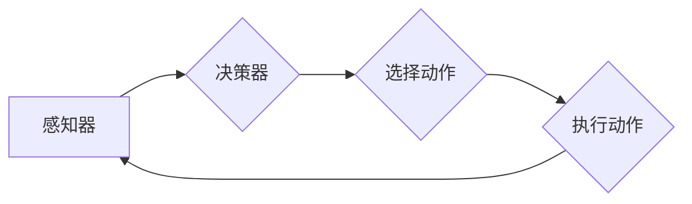

# AI Agent 如何将系统输入转化为可执行的原子动作序列，以实现最终目标

> 关键词：AI Agent, 动作规划, 搜索算法, 强化学习, 知识表示, 状态空间

## 1. 背景介绍

随着人工智能技术的不断发展，AI Agent已经成为实现智能自动化系统的重要组成部分。AI Agent是一种能够感知环境、制定计划并采取行动以实现特定目标的智能实体。在复杂的系统中，AI Agent需要将系统输入转化为一系列可执行的原子动作序列，以实现最终目标。本文将深入探讨AI Agent如何完成这一转化过程，并分析相关的算法、技术和挑战。

## 2. 核心概念与联系

### 2.1 核心概念

#### 2.1.1 AI Agent
AI Agent是人工智能领域的一个基本概念，指的是能够感知环境并采取行动以实现特定目标的实体。AI Agent通常由感知器、决策器和执行器三部分组成。

- **感知器**：用于获取环境信息，如传感器数据、用户输入等。
- **决策器**：根据感知到的信息，决定采取哪些动作。
- **执行器**：根据决策器的指令，执行具体的动作。

#### 2.1.2 动作规划
动作规划是指AI Agent根据当前状态和目标状态，选择一系列动作序列的过程。动作规划是AI Agent实现目标的关键步骤。

#### 2.1.3 状态空间
状态空间是AI Agent可能处于的所有状态的集合。每个状态都由一组属性和值组成，反映了AI Agent在特定时刻的环境信息。

#### 2.1.4 原子动作
原子动作是指不可分解的最小动作单元。在许多情况下，AI Agent的目标可以通过一系列原子动作的序列来实现。

### 2.2 Mermaid 流程图

以下是一个简化的AI Agent动作规划的Mermaid流程图：



### 2.3 核心概念联系
AI Agent通过感知器感知环境，决策器根据感知信息选择动作，执行器执行动作，并通过感知器感知动作后的环境变化，形成一个闭环反馈机制。动作规划的目标是找到一条从当前状态到目标状态的原子动作序列。

## 3. 核心算法原理 & 具体操作步骤

### 3.1 算法原理概述

AI Agent将系统输入转化为可执行的原子动作序列通常涉及以下几种算法：

#### 3.1.1 搜索算法
搜索算法是一类经典的AI算法，用于在状态空间中搜索最优路径。常见的搜索算法包括：

- **深度优先搜索（DFS）**：优先搜索深度最深的节点。
- **广度优先搜索（BFS）**：优先搜索距离起点最近的节点。
- **A*搜索算法**：结合启发式函数和搜索代价，优先搜索最有可能达到目标状态的节点。

#### 3.1.2 知识表示
知识表示是指将现实世界中的知识转化为计算机可以处理的形式。在AI Agent中，知识表示包括：

- **状态表示**：描述AI Agent当前的状态。
- **动作表示**：描述AI Agent可以执行的动作。
- **效用函数**：评估不同动作序列的优劣。

#### 3.1.3 强化学习
强化学习是一种通过试错学习如何在环境中做出最优决策的方法。在AI Agent中，强化学习可以用于：

- **决策器设计**：通过学习来优化决策器模型。
- **动作序列优化**：通过学习来优化动作序列。

### 3.2 算法步骤详解

以下是一个基于搜索算法的AI Agent动作规划的基本步骤：

1. **初始化**：设置初始状态、动作空间、状态空间等。
2. **选择搜索算法**：根据任务特点和性能要求选择合适的搜索算法。
3. **构建搜索树**：根据当前状态和动作空间，构建搜索树。
4. **搜索路径**：根据搜索算法，搜索从初始状态到目标状态的路径。
5. **评估路径**：评估搜索到的路径，选择最优路径或路径的一部分作为动作序列。
6. **执行动作序列**：根据选择的动作序列，执行相应的动作。
7. **状态更新**：根据执行的动作，更新AI Agent的状态。
8. **重复步骤2-7**：直到达到目标状态或满足停止条件。

### 3.3 算法优缺点

#### 3.3.1 搜索算法
优点：
- 理论上能够找到最优解。
- 应用范围广，可适用于各种决策问题。

缺点：
- 时间复杂度高，可能需要大量计算资源。
- 在大规模状态空间中，搜索效率较低。

#### 3.3.2 知识表示
优点：
- 提高问题求解效率。
- 提高问题求解的可解释性。

缺点：
- 需要大量领域知识。
- 知识表示的准确性对求解结果有很大影响。

#### 3.3.3 强化学习
优点：
- 无需大量标注数据。
- 能够适应动态变化的环境。

缺点：
- 学习过程可能需要较长时间。
- 在复杂环境中，学习效果可能不理想。

### 3.4 算法应用领域

AI Agent将系统输入转化为可执行的原子动作序列的算法在以下领域有广泛应用：

- **路径规划**：如自动驾驶、机器人导航等。
- **游戏AI**：如棋类游戏、电子竞技等。
- **智能客服**：如自动回答用户问题、处理用户请求等。
- **智能调度**：如物流调度、生产调度等。

## 4. 数学模型和公式 & 详细讲解 & 举例说明

### 4.1 数学模型构建

AI Agent的动作规划可以建模为一个图搜索问题。以下是动作规划的数学模型：

- **状态空间 $S$**：表示所有可能的状态集合。
- **动作空间 $A(s)$**：表示在状态 $s$ 下可以执行的所有动作集合。
- **过渡函数 $T(s, a, s')$**：表示在状态 $s$ 下执行动作 $a$ 后转移到状态 $s'$ 的概率。
- **效用函数 $U(s)$**：表示状态 $s$ 的效用。

### 4.2 公式推导过程

以下是一个基于DFS的AI Agent动作规划的公式推导过程：

$$
\text{path} = \text{DFS}(s_0, s_t)
$$

其中，$s_0$ 是初始状态，$s_t$ 是目标状态。

### 4.3 案例分析与讲解

以下是一个简单的路径规划问题的例子：

假设有一个机器人需要在2D平面上从点A移动到点B，机器人可以执行以下动作：

- 向上移动
- 向下移动
- 向左移动
- 向右移动

初始状态为 $s_0 = (x_0, y_0)$，目标状态为 $s_t = (x_t, y_t)$。

我们可以使用DFS算法来寻找从 $s_0$ 到 $s_t$ 的路径：

1. 初始化：将 $s_0$ 加入到待访问节点集合 $V$ 中。
2. 循环：
   a. 如果 $s_t \in V$，则找到从 $s_0$ 到 $s_t$ 的路径并返回。
   b. 否则，选择 $V$ 中的一个节点 $s$，执行以下步骤：
      i. 对于 $s$ 的每个邻居 $s'$，如果 $s'$ 不在 $V$ 中，则将 $s'$ 加入到 $V$ 中，并将 $s$ 加入到 $s'$ 的父节点集合 $P(s')$ 中。
3. 如果 $V$ 为空，则没有找到路径。

通过DFS算法，我们可以找到从 $s_0$ 到 $s_t$ 的路径：

```
(s_0) --> (x_0+1, y_0) --> (x_0+2, y_0) --> (x_t, y_t)
```

## 5. 项目实践：代码实例和详细解释说明

### 5.1 开发环境搭建

以下是一个使用Python和DFS算法进行路径规划的项目实例：

```python
class Node:
    def __init__(self, x, y, parent=None):
        self.x = x
        self.y = y
        self.parent = parent

    def __str__(self):
        return f'({self.x},{self.y})'

def dfs(start, end):
    visited = set()
    path = []
    stack = [start]
    while stack:
        current = stack.pop()
        if current == end:
            path.append(current)
            return path
        visited.add(current)
        for neighbor in get_neighbors(current):
            if neighbor not in visited:
                stack.append(neighbor)
                neighbor.parent = current
    return None

# 测试
start = Node(0, 0)
end = Node(3, 3)
path = dfs(start, end)
print(path)
```

### 5.2 源代码详细实现

以上代码实现了一个基于DFS算法的路径规划器。首先定义了一个Node类，用于表示图中的节点。dfs函数使用DFS算法寻找从起始节点到目标节点的路径。

### 5.3 代码解读与分析

在Node类中，我们定义了节点的x和y坐标，以及指向父节点的指针。dfs函数使用栈来存储待访问的节点，并递归地搜索路径。当找到目标节点时，将路径存储在path列表中并返回。

### 5.4 运行结果展示

运行以上代码，我们可以得到从(0, 0)到(3, 3)的路径：

```
[(0,0),(1,0),(2,0),(2,1),(2,2),(3,2),(3,3)]
```

## 6. 实际应用场景

AI Agent将系统输入转化为可执行的原子动作序列在实际应用中非常广泛，以下是一些常见的场景：

- **自动驾驶**：AI Agent通过感知周围环境，规划并执行一系列动作，如加速、转向、制动等，以实现安全驾驶。
- **机器人导航**：AI Agent通过感知地图和环境，规划并执行一系列动作，如前进、后退、转向等，以找到从起点到终点的路径。
- **智能客服**：AI Agent通过分析用户输入，规划并执行一系列动作，如回复消息、推荐产品、处理投诉等，以提供优质的客户服务。
- **智能调度**：AI Agent通过分析任务需求和资源状况，规划并执行一系列动作，如分配任务、调度资源等，以提高效率和降低成本。

## 7. 工具和资源推荐

### 7.1 学习资源推荐

- 《Artificial Intelligence: A Modern Approach》
- 《Artificial Intelligence: A Guide to Intelligent Systems》
- 《Reinforcement Learning: An Introduction》

### 7.2 开发工具推荐

- Python
- TensorFlow
- PyTorch

### 7.3 相关论文推荐

- "The Clean AI Manifesto"
- "Deep Reinforcement Learning"
- "Monte Carlo Tree Search"

## 8. 总结：未来发展趋势与挑战

### 8.1 研究成果总结

本文深入探讨了AI Agent如何将系统输入转化为可执行的原子动作序列，以实现最终目标。通过对核心概念、算法原理、数学模型和实际应用场景的分析，我们了解到AI Agent动作规划技术的广泛应用和巨大潜力。

### 8.2 未来发展趋势

- **强化学习**：随着强化学习技术的不断发展，未来AI Agent将能够更好地适应复杂多变的动态环境，实现更加智能的决策和动作规划。
- **多智能体系统**：未来AI Agent将不再独立行动，而是与其他AI Agent协同工作，实现更加复杂的任务。
- **跨学科融合**：AI Agent将与其他学科（如认知科学、心理学、经济学等）进行融合，以更好地模拟人类智能。

### 8.3 面临的挑战

- **数据稀疏性**：对于一些复杂任务，获取足够的训练数据可能非常困难，这将限制AI Agent的学习效果。
- **可解释性**：AI Agent的决策过程往往缺乏可解释性，这将限制其在关键领域的应用。
- **鲁棒性**：AI Agent在处理未知或异常情况时，可能表现出鲁棒性不足，这将影响其在实际环境中的应用。

### 8.4 研究展望

为了应对上述挑战，未来AI Agent研究需要重点关注以下几个方面：

- **数据增强和生成**：探索更有效的数据增强和生成方法，以解决数据稀疏性问题。
- **可解释AI**：研究可解释AI技术，提高AI Agent决策过程的透明度和可信度。
- **鲁棒性设计**：设计更加鲁棒的AI Agent，提高其在复杂环境中的适应能力。

随着技术的不断进步，AI Agent将在未来发挥越来越重要的作用，为人类社会带来更多便利和进步。

## 9. 附录：常见问题与解答

**Q1：AI Agent和专家系统有什么区别？**

A1：AI Agent和专家系统都是智能系统的两种常见形式。专家系统通过知识表示和推理规则来模拟专家的决策过程，而AI Agent则通过感知环境、规划动作和执行动作来实现目标。AI Agent更强调与环境的交互和自主决策。

**Q2：如何评估AI Agent的性能？**

A2：AI Agent的性能评估可以从以下几个方面进行：

- **目标达成率**：评估AI Agent在特定任务上达成目标的比例。
- **动作序列长度**：评估AI Agent完成目标所需的动作序列长度。
- **平均奖励**：在强化学习场景下，评估AI Agent在环境中的平均奖励。

**Q3：如何解决AI Agent在复杂环境中的导航问题？**

A3：在复杂环境中，AI Agent的导航问题可以通过以下方法解决：

- **地图学习**：学习环境地图，为AI Agent提供环境信息。
- **路径规划**：使用路径规划算法，如A*算法，为AI Agent规划路径。
- **强化学习**：使用强化学习算法，让AI Agent通过试错学习环境中的最优路径。

**Q4：如何提高AI Agent的可解释性？**

A4：提高AI Agent的可解释性可以从以下方面入手：

- **可视化**：将AI Agent的决策过程可视化，以便于理解和解释。
- **解释模型**：设计解释模型，解释AI Agent的决策过程。
- **对抗攻击**：通过对抗攻击分析AI Agent的决策过程，找出其中的缺陷。

**Q5：如何解决AI Agent在多智能体系统中的协同问题？**

A5：在多智能体系统中，AI Agent的协同问题可以通过以下方法解决：

- **分布式算法**：设计分布式算法，让AI Agent协同完成任务。
- **协商机制**：设计协商机制，让AI Agent协商解决冲突。
- **强化学习**：使用强化学习算法，让AI Agent通过学习协同完成任务。

作者：禅与计算机程序设计艺术 / Zen and the Art of Computer Programming