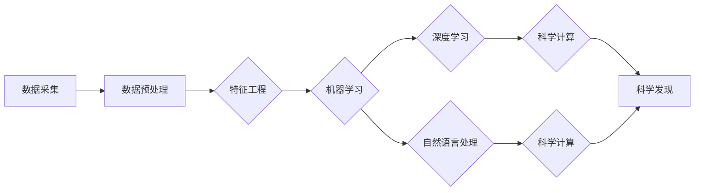

# AI for Science的跨学科应用

> 关键词：人工智能，跨学科，科学计算，数据分析，机器学习，深度学习，应用场景，未来展望

## 1. 背景介绍

随着人工智能技术的飞速发展，AI已经渗透到各个领域，从工业自动化到医疗健康，从金融服务到教育娱乐，都展现出了巨大的潜力。在科学领域，AI的应用同样日益广泛，不仅能够加速科学研究进程，还能够推动跨学科研究的融合与创新。本文将探讨AI在科学领域的跨学科应用，分析其核心概念、算法原理、实践案例以及未来发展趋势。

## 2. 核心概念与联系

### 2.1 核心概念

**人工智能（AI）**：模拟、延伸和扩展人的智能的理论、方法、技术及应用系统。AI包括机器学习（ML）、深度学习（DL）、自然语言处理（NLP）等多个子领域。

**科学计算**：利用计算机技术对科学问题进行数值求解的方法，包括数值模拟、数据分析、优化计算等。

**跨学科**：指不同学科之间的交叉和融合，旨在解决复杂问题，推动创新。

**数据分析**：通过对数据的收集、处理、分析，提取有价值信息的过程。

**机器学习**：使计算机系统能够从数据中学习，并根据学习到的知识进行决策或预测。

**深度学习**：机器学习的一个分支，通过构建多层神经网络来学习数据的深层特征。

### 2.2 核心概念原理和架构的 Mermaid 流程图



### 2.3 核心概念联系

AI作为推动科学发展的关键技术，其核心概念与科学计算、数据分析、机器学习、深度学习、自然语言处理等领域紧密相连。这些领域相互促进，共同构成了AI在科学领域的应用生态。

## 3. 核心算法原理 & 具体操作步骤

### 3.1 算法原理概述

AI在科学领域的应用，主要依赖于机器学习、深度学习、自然语言处理等算法。以下将分别介绍这些算法的基本原理。

#### 机器学习

机器学习是一种使计算机能够从数据中学习的方法。其基本原理是利用统计方法，根据已有数据进行学习，并在此基础上做出预测或决策。

#### 深度学习

深度学习是机器学习的一个分支，通过构建多层神经网络来学习数据的深层特征。其基本原理是模拟人脑神经网络的结构和功能，通过逐层提取特征，实现对复杂模式的学习。

#### 自然语言处理

自然语言处理是AI的一个子领域，旨在让计算机能够理解、生成和处理人类语言。其基本原理是利用语言模型和句法分析等技术，实现语言信息的提取和转换。

### 3.2 算法步骤详解

以下是AI在科学领域应用的通用步骤：

1. **数据采集**：收集相关科学数据，如实验数据、观测数据、文献数据等。

2. **数据预处理**：对采集到的数据进行清洗、归一化、去噪等处理。

3. **特征工程**：根据研究目标，从原始数据中提取特征，构建特征向量。

4. **模型选择**：根据任务类型选择合适的机器学习、深度学习或自然语言处理模型。

5. **模型训练**：使用训练数据对模型进行训练，优化模型参数。

6. **模型评估**：使用验证数据评估模型性能，调整模型参数。

7. **模型应用**：将训练好的模型应用于实际问题，如预测、决策、优化等。

### 3.3 算法优缺点

#### 优点

1. 自动化：AI算法可以自动从数据中学习，减轻科学家的工作负担。

2. 高效：AI算法可以快速处理大量数据，提高科学研究的效率。

3. 创新性：AI算法可以帮助科学家发现新的规律，推动科学创新。

#### 缺点

1. 数据依赖：AI算法对数据质量要求较高，数据不足或质量差可能导致模型性能下降。

2. 可解释性：AI算法的决策过程往往缺乏可解释性，难以理解其背后的原理。

3. 资源消耗：训练复杂的AI模型需要大量的计算资源和时间。

### 3.4 算法应用领域

AI在科学领域的应用领域非常广泛，以下列举一些典型的应用场景：

1. **生物医学**：利用AI进行基因测序、药物研发、疾病诊断等。

2. **物理学**：利用AI进行材料设计、天体物理观测、量子计算等。

3. **化学**：利用AI进行分子动力学模拟、化学合成反应预测等。

4. **环境科学**：利用AI进行气候变化预测、自然灾害预警等。

5. **地球科学**：利用AI进行地震预测、油气勘探等。

## 4. 数学模型和公式 & 详细讲解 & 举例说明

### 4.1 数学模型构建

AI在科学领域的应用往往涉及到复杂的数学模型，以下列举一些常见的数学模型：

#### 机器学习

1. 线性回归：$$y = \beta_0 + \beta_1x_1 + \beta_2x_2 + ... + \beta_nx_n + \epsilon$$

2. 逻辑回归：$$\sigma(z) = \frac{1}{1+e^{-z}}$$

#### 深度学习

1. 神经网络：$$y = f(WL(x) + b)$$

2. 卷积神经网络（CNN）：用于图像识别、图像分类等任务。

3. 循环神经网络（RNN）：用于序列数据处理，如语言模型、语音识别等。

#### 自然语言处理

1. 隐马尔可夫模型（HMM）：用于语音识别、语音合成等任务。

2. 递归神经网络（RNN）：用于文本分类、机器翻译等任务。

### 4.2 公式推导过程

以下以线性回归为例，简要介绍公式推导过程：

假设我们有一个线性回归模型：

$$y = \beta_0 + \beta_1x_1 + \beta_2x_2 + ... + \beta_nx_n + \epsilon$$

其中 $\epsilon$ 为误差项。

为了最小化预测值与真实值之间的差异，我们需要求解以下最优化问题：

$$\min_{\beta} \sum_{i=1}^N (y_i - (\beta_0 + \beta_1x_{i1} + \beta_2x_{i2} + ... + \beta_nx_{in})^2$$

通过求导和求解方程，可以得到：

$$\beta = (X^TX)^{-1}X^Ty$$

其中 $X$ 为特征矩阵，$y$ 为标签向量。

### 4.3 案例分析与讲解

以下以基于深度学习的蛋白质结构预测为例，介绍AI在科学领域的应用。

**问题**：如何利用AI技术预测蛋白质的三维结构？

**方法**：使用深度学习中的卷积神经网络（CNN）对蛋白质序列进行特征提取，并预测其三维结构。

**步骤**：

1. 数据采集：收集大量的蛋白质序列和对应的三维结构数据。

2. 数据预处理：对蛋白质序列进行编码，生成特征向量。

3. 模型构建：使用CNN构建模型，进行特征提取。

4. 模型训练：使用训练数据对模型进行训练，优化模型参数。

5. 模型评估：使用验证数据评估模型性能。

6. 模型应用：将训练好的模型应用于新的蛋白质序列，预测其三维结构。

**结果**：经过训练，模型能够以较高的准确率预测蛋白质的三维结构，为蛋白质功能研究提供了有力工具。

## 5. 项目实践：代码实例和详细解释说明

### 5.1 开发环境搭建

以下以使用Python进行深度学习为例，介绍开发环境搭建：

1. 安装Anaconda：从官网下载并安装Anaconda。

2. 创建虚拟环境：`conda create -n deep_env python=3.8`

3. 激活虚拟环境：`conda activate deep_env`

4. 安装深度学习库：`pip install tensorflow`

### 5.2 源代码详细实现

以下以使用TensorFlow构建简单的线性回归模型为例，介绍代码实现：

```python
import tensorflow as tf
import numpy as np

# 定义数据集
x_train = np.random.random([100, 1])
y_train = 3 * x_train + 4 + np.random.random([100, 1])

# 构建模型
model = tf.keras.Sequential([
    tf.keras.layers.Dense(1, input_shape=[1])
])

# 编译模型
model.compile(optimizer='sgd', loss='mean_squared_error')

# 训练模型
model.fit(x_train, y_train, epochs=1000)

# 预测
x_predict = np.random.random([1, 1])
y_predict = model.predict(x_predict)
```

### 5.3 代码解读与分析

以上代码实现了线性回归模型的训练和预测。首先，我们导入所需的库，并定义数据集。接着，使用TensorFlow构建模型，这里是一个单层神经网络，只有一个节点。然后，编译模型，设置优化器和损失函数。接下来，使用训练数据训练模型，最后使用模型对新的数据进行预测。

### 5.4 运行结果展示

运行上述代码后，可以看到模型在训练过程中的损失函数值逐渐减小，最终收敛。同时，使用模型预测得到的结果与真实值之间的误差也逐渐减小，说明模型具有较好的预测能力。

## 6. 实际应用场景

### 6.1 生物学研究

AI在生物学研究中的应用已经取得了显著成果，以下列举一些典型应用：

- **基因测序**：利用AI技术对基因序列进行分析，发现基因突变和基因表达模式，为疾病诊断和治疗提供依据。
- **药物研发**：利用AI技术预测药物活性，加速药物研发进程，降低研发成本。
- **蛋白质结构预测**：利用AI技术预测蛋白质的三维结构，为蛋白质功能研究和药物设计提供基础。

### 6.2 环境科学

AI在环境科学研究中的应用也逐渐兴起，以下列举一些典型应用：

- **气候变化预测**：利用AI技术分析历史气候变化数据，预测未来气候变化趋势，为环境治理提供依据。
- **自然灾害预警**：利用AI技术分析地震、洪水、台风等自然灾害数据，提前预警，减少灾害损失。
- **环境监测**：利用AI技术分析环境数据，如水质、空气质量等，为环境保护提供数据支持。

### 6.3 材料科学

AI在材料科学研究中的应用也逐渐显现，以下列举一些典型应用：

- **材料设计**：利用AI技术预测材料的物理、化学性质，指导新材料设计。
- **材料加工**：利用AI技术优化材料加工工艺，提高材料性能。
- **材料性能预测**：利用AI技术预测材料的力学性能、电学性能等，为材料选择和应用提供依据。

## 7. 工具和资源推荐

### 7.1 学习资源推荐

- 《深度学习》（Goodfellow等著）：介绍了深度学习的基本概念、技术方法和应用案例。
- 《自然语言处理综论》（Jurafsky等著）：介绍了自然语言处理的基本概念、技术方法和应用案例。
- 《机器学习实战》（周志华著）：介绍了机器学习的基本概念、技术方法和实践案例。

### 7.2 开发工具推荐

- TensorFlow：Google开源的深度学习框架，功能强大，应用广泛。
- PyTorch：Facebook开源的深度学习框架，易于上手，灵活性高。
- Keras：基于TensorFlow和Theano的深度学习库，简单易用。

### 7.3 相关论文推荐

- 《Denoising Autoencoders for Representation Learning》（Vincent等，2010）
- 《Deep Learning for Speech Recognition：A Review》（Hinton等，2012）
- 《Generative Adversarial Nets》（Goodfellow等，2014）
- 《Sequence to Sequence Learning with Neural Networks》（Sutskever等，2014）

## 8. 总结：未来发展趋势与挑战

### 8.1 研究成果总结

AI在科学领域的跨学科应用取得了显著成果，推动了科学研究的发展。AI技术可以帮助科学家快速处理大量数据，发现新的规律，推动科学创新。

### 8.2 未来发展趋势

- AI技术将更加深入地应用于科学领域，解决更多复杂问题。
- 跨学科研究将更加紧密地与AI技术结合，推动科学研究的突破。
- AI技术将与其他技术（如大数据、云计算等）深度融合，构建更加完善的科研基础设施。

### 8.3 面临的挑战

- 数据获取和标注：科学数据往往难以获取和标注，需要建立更加完善的数据采集和标注机制。
- 模型可解释性：AI模型的决策过程往往缺乏可解释性，需要提高模型的可解释性。
- 伦理和社会影响：AI技术可能对人类社会产生负面影响，需要建立相应的伦理和社会规范。

### 8.4 研究展望

未来，AI在科学领域的应用将更加广泛和深入，推动科学研究的创新和发展。同时，也需要关注AI技术的伦理和社会影响，确保AI技术为人类社会带来福祉。

## 9. 附录：常见问题与解答

**Q1：AI在科学领域的应用前景如何？**

A：AI在科学领域的应用前景广阔，可以帮助科学家解决更多复杂问题，推动科学研究的创新和发展。

**Q2：AI技术如何应用于生物学研究？**

A：AI技术可以用于基因测序、药物研发、蛋白质结构预测等生物学研究。

**Q3：AI技术如何应用于环境科学研究？**

A：AI技术可以用于气候变化预测、自然灾害预警、环境监测等环境科学研究。

**Q4：AI技术在材料科学研究中的应用有哪些？**

A：AI技术可以用于材料设计、材料加工、材料性能预测等材料科学研究。

**Q5：如何解决AI模型的可解释性问题？**

A：可以通过解释性AI、可解释性研究等方法来解决AI模型的可解释性问题。

---

作者：禅与计算机程序设计艺术 / Zen and the Art of Computer Programming