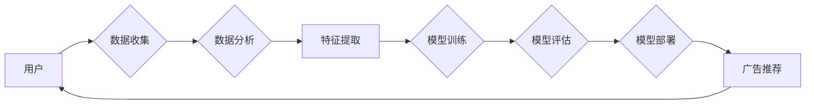

> 关键词：AI大模型，广告平台，商业模式，机器学习，推荐系统，用户行为分析，数据驱动，精准营销

# AI 大模型原理与应用：广告平台的商业模式

随着人工智能技术的飞速发展，AI大模型在广告平台的商业模式中扮演着越来越重要的角色。本文将深入探讨AI大模型的原理、应用，以及其在广告平台商业模式中的价值和创新。

## 1. 背景介绍

广告平台是数字营销的核心，其商业模式依赖于精准、高效的广告投放，以实现广告主和平台的双重收益。然而，传统的广告投放方式往往依赖于人工经验，难以满足个性化、实时性和高效率的需求。AI大模型的出现，为广告平台提供了新的解决方案，通过深度学习、自然语言处理等技术，实现对用户行为的精准分析和广告内容的智能推荐。

### 1.1 问题的由来

传统广告投放面临以下问题：

- **用户洞察不足**：难以准确了解用户需求和偏好，导致广告投放效果不佳。
- **广告内容同质化**：缺乏个性化内容，无法吸引用户关注。
- **投放效率低**：人工审核和投放效率低下，难以应对海量广告需求。

### 1.2 研究现状

近年来，AI大模型在广告领域得到广泛应用，主要技术包括：

- **用户行为分析**：通过分析用户在平台上的行为数据，挖掘用户兴趣和偏好。
- **推荐系统**：基于用户行为数据和广告内容，为用户推荐个性化广告。
- **自然语言处理**：理解广告内容，提升广告投放的精准性和效果。

### 1.3 研究意义

AI大模型在广告平台中的应用，有助于：

- 提升广告投放效果，实现广告主和平台的收益最大化。
- 增强用户体验，提升用户满意度和平台粘性。
- 推动广告行业向智能化、精准化方向发展。

### 1.4 本文结构

本文将围绕以下内容展开：

- AI大模型的基本原理和核心概念。
- AI大模型在广告平台中的应用方法和步骤。
- AI大模型在广告平台商业模式中的价值和创新。
- AI大模型应用的实际案例和未来发展趋势。

## 2. 核心概念与联系

### 2.1 核心概念原理

AI大模型的核心概念包括：

- **深度学习**：一种通过神经网络模拟人脑处理信息的方式，能够自动从数据中学习特征和模式。
- **自然语言处理（NLP）**：使计算机能够理解、解释和生成人类语言的技术。
- **推荐系统**：根据用户行为和偏好，推荐用户可能感兴趣的内容或物品。

### 2.2 架构的 Mermaid 流程图



### 2.3 核心概念联系

用户行为数据经过收集、分析和特征提取后，用于训练深度学习模型。训练好的模型用于评估和部署，最终实现个性化广告推荐，形成一个闭环的系统。

## 3. 核心算法原理 & 具体操作步骤

### 3.1 算法原理概述

AI大模型在广告平台中的应用主要基于以下算法原理：

- **协同过滤**：根据用户相似度推荐相似广告。
- **内容推荐**：根据广告内容和用户兴趣推荐相似广告。
- **上下文感知推荐**：根据用户当前上下文推荐相关广告。

### 3.2 算法步骤详解

1. **数据收集**：收集用户行为数据、广告内容数据、广告投放数据等。
2. **数据分析**：对收集到的数据进行分析，提取用户兴趣、广告特征等。
3. **特征提取**：将提取的特征转换为机器学习模型可处理的格式。
4. **模型训练**：使用深度学习模型对用户兴趣和广告特征进行建模。
5. **模型评估**：评估模型的准确性和泛化能力。
6. **模型部署**：将训练好的模型部署到广告平台，实现广告推荐。
7. **广告推荐**：根据模型推荐结果，为用户展示个性化广告。

### 3.3 算法优缺点

**优点**：

- 提高广告投放的精准性和效果。
- 增强用户体验，提升用户满意度和平台粘性。
- 降低广告成本，提高广告主投资回报率。

**缺点**：

- 需要大量的训练数据和计算资源。
- 模型可能存在偏差，导致推荐结果不公平。
- 模型可解释性差，难以解释推荐结果的原因。

### 3.4 算法应用领域

AI大模型在广告平台中的应用领域包括：

- **精准营销**：根据用户兴趣和行为，精准投放广告。
- **广告投放优化**：优化广告投放策略，提高广告效果。
- **广告内容生成**：根据用户需求，生成个性化广告内容。

## 4. 数学模型和公式 & 详细讲解 & 举例说明

### 4.1 数学模型构建

AI大模型在广告平台中的应用，主要基于以下数学模型：

- **矩阵分解**：用于协同过滤推荐系统。
- **神经网络**：用于构建深度学习模型，提取用户兴趣和广告特征。

### 4.2 公式推导过程

以矩阵分解为例，其基本公式如下：

$$
U = UV^T
$$

其中，$U$ 和 $V$ 分别是用户和物品的潜在因素矩阵，$V^T$ 是其转置。

### 4.3 案例分析与讲解

以Netflix推荐系统为例，其使用矩阵分解技术进行电影推荐。用户-电影评分数据可以表示为一个矩阵，通过矩阵分解，可以将用户和电影分解为潜在因素矩阵，从而实现个性化推荐。

## 5. 项目实践：代码实例和详细解释说明

### 5.1 开发环境搭建

- 安装Python、TensorFlow或PyTorch等深度学习框架。
- 安装NumPy、Pandas等数据操作库。

### 5.2 源代码详细实现

以下是一个基于协同过滤的推荐系统示例代码：

```python
import pandas as pd
from surprise import SVD

# 加载数据
data = pd.read_csv('ratings.csv')

# 创建SVD算法实例
model = SVD()

# 训练模型
model.fit(data)

# 推荐电影
user_id = 1
movies = model.get_neighbors(user_id, k=10)
print(movies)
```

### 5.3 代码解读与分析

上述代码使用Surprise库实现了一个简单的协同过滤推荐系统。首先，加载数据并创建SVD算法实例。然后，使用训练数据训练模型。最后，根据用户ID获取推荐电影列表。

### 5.4 运行结果展示

假设用户1喜欢以下电影：

- 电影A
- 电影B
- 电影C

运行上述代码后，推荐系统可能会推荐以下电影：

- 电影D
- 电影E
- 电影F

这些推荐电影与用户1的兴趣较为相似，反映了协同过滤推荐系统的有效性。

## 6. 实际应用场景

AI大模型在广告平台中的应用场景包括：

- **个性化广告推荐**：根据用户兴趣和偏好，为用户推荐个性化广告。
- **广告投放优化**：根据广告投放效果，优化广告投放策略，提高广告效果。
- **广告内容生成**：根据用户需求，生成个性化广告内容。
- **广告效果评估**：评估广告投放效果，为广告主提供决策依据。

## 7. 工具和资源推荐

### 7.1 学习资源推荐

- 《深度学习》 - Ian Goodfellow、Yoshua Bengio、Aaron Courville
- 《机器学习》 - 周志华
- 《推荐系统实践》 - 张敏灵

### 7.2 开发工具推荐

- TensorFlow
- PyTorch
- Scikit-learn

### 7.3 相关论文推荐

- Collaborative Filtering for the Web - Jure Leskovec, Lars Backstrom, C. Lee McInerney
- Matrix Factorization Techniques for Recommender Systems - Yehuda Koren
- Neural Collaborative Filtering - Yucheng Low, Dengyong Zhou, Lihong Li

## 8. 总结：未来发展趋势与挑战

### 8.1 研究成果总结

AI大模型在广告平台中的应用取得了显著成果，为广告投放提供了新的解决方案。通过深度学习、自然语言处理等技术，实现了对用户行为的精准分析和广告内容的智能推荐。

### 8.2 未来发展趋势

- **多模态数据融合**：结合文本、图像、视频等多模态数据，提升推荐效果。
- **强化学习**：利用强化学习技术，实现自适应的广告投放策略。
- **可解释性AI**：提高AI模型的可解释性，增强用户信任。

### 8.3 面临的挑战

- **数据隐私**：如何保护用户隐私，避免数据泄露。
- **模型偏见**：如何减少模型偏见，避免歧视性广告。
- **技术更新**：如何跟上技术发展的步伐，保持模型竞争力。

### 8.4 研究展望

未来，AI大模型在广告平台中的应用将更加广泛和深入。通过不断探索和创新，AI大模型将为广告行业带来更多变革，推动广告行业向智能化、精准化方向发展。

## 9. 附录：常见问题与解答

**Q1：AI大模型在广告平台中的作用是什么？**

A1：AI大模型在广告平台中的作用包括用户行为分析、广告内容推荐、广告投放优化等，旨在提升广告投放效果和用户体验。

**Q2：如何评估AI大模型在广告平台中的应用效果？**

A2：可以通过广告点击率、转化率、ROI等指标来评估AI大模型在广告平台中的应用效果。

**Q3：AI大模型在广告平台中面临哪些挑战？**

A3：AI大模型在广告平台中面临的挑战包括数据隐私、模型偏见和技术更新等。

**Q4：AI大模型在广告平台中的未来发展趋势是什么？**

A4：AI大模型的未来发展趋势包括多模态数据融合、强化学习和可解释性AI等。

---

作者：禅与计算机程序设计艺术 / Zen and the Art of Computer Programming