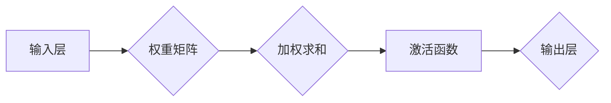

# AI 神经网络计算艺术之禅：结构仿脑、功能类脑、性能超脑

> 关键词：人工智能，神经网络，深度学习，结构仿脑，功能类脑，性能超脑，计算艺术

## 1. 背景介绍

自20世纪50年代以来，人工智能（AI）领域经历了多个发展阶段。如今，随着深度学习技术的突破，AI已经渗透到我们生活的方方面面，从智能手机到自动驾驶，从医疗诊断到金融风控，AI的应用无处不在。神经网络，作为深度学习的基础，其计算艺术之禅在于模仿人脑的结构和功能，通过不断优化和迭代，实现了从结构仿脑到功能类脑，最终向性能超脑迈进。

### 1.1 问题的由来

人脑作为自然界最复杂的系统之一，拥有处理海量信息、进行复杂决策和认知的能力。长久以来，科学家们一直试图模仿人脑的结构和功能，以构建具有类似智能的机器。神经网络作为一种模拟人脑神经元连接方式的计算模型，成为了实现这一目标的重要途径。

### 1.2 研究现状

近年来，随着计算能力的提升和大数据的涌现，神经网络在图像识别、语音识别、自然语言处理等领域取得了显著成果。从早期的感知器、BP算法，到深度学习的兴起，神经网络的研究和应用经历了翻天覆地的变化。

### 1.3 研究意义

研究神经网络计算艺术之禅，不仅有助于我们更好地理解人脑的工作原理，还能推动AI技术的发展，为人类创造更多价值。

### 1.4 本文结构

本文将围绕神经网络的结构仿脑、功能类脑和性能超脑展开，具体内容包括：

- 介绍神经网络的核心概念与联系
- 阐述神经网络的核心算法原理与具体操作步骤
- 讲解神经网络数学模型和公式，并举例说明
- 分享神经网络的项目实践案例
- 探讨神经网络的实际应用场景与未来展望
- 总结研究成果，展望未来发展趋势与挑战

## 2. 核心概念与联系

### 2.1 核心概念

- **神经元**：神经网络的基本单元，负责接收输入信号、进行加权求和和激活函数处理，最后输出信号。
- **网络层**：由多个神经元组成，负责特征提取、降维和分类等功能。
- **连接权重**：连接神经元之间的参数，用于调整输入信号在神经元间的传递强度。
- **激活函数**：对神经元输出进行非线性变换，增加模型的非线性表达能力。
- **损失函数**：衡量模型预测结果与真实值之间的差异，用于指导模型优化。

### 2.2 Mermaid 流程图



### 2.3 关系联系

- 输入层接收原始数据，通过连接权重与隐藏层神经元相连。
- 隐藏层通过激活函数对加权求和的结果进行处理，提取特征信息。
- 输出层根据激活函数的结果，输出最终预测结果。

## 3. 核心算法原理 & 具体操作步骤

### 3.1 算法原理概述

神经网络通过模仿人脑神经元连接方式，通过前向传播和反向传播算法不断优化连接权重，从而实现对输入数据的分类、回归等任务。

### 3.2 算法步骤详解

1. **初始化**：随机初始化网络层连接权重和偏置项。
2. **前向传播**：输入数据从输入层传递到输出层，每个神经元计算输入信号与其连接权重的加权求和，并经过激活函数处理后输出。
3. **计算损失**：将输出结果与真实值进行比较，计算损失函数值。
4. **反向传播**：根据损失函数的梯度，反向传播计算每个神经元连接权重和偏置项的梯度，并更新参数。
5. **迭代优化**：重复步骤2-4，直到满足预设的停止条件（如损失函数值收敛、迭代轮数等）。

### 3.3 算法优缺点

- **优点**：能够处理复杂数据，提取特征信息，泛化能力强。
- **缺点**：需要大量标注数据，计算量大，可解释性差。

### 3.4 算法应用领域

- 图像识别
- 语音识别
- 自然语言处理
- 机器人控制
- 预测分析

## 4. 数学模型和公式 & 详细讲解 & 举例说明

### 4.1 数学模型构建

神经网络的核心数学模型包括：

- **神经元模型**：$y = f(Wx + b)$，其中 $W$ 为连接权重，$b$ 为偏置项，$x$ 为输入向量，$y$ 为输出向量。
- **损失函数**：常用的损失函数包括均方误差（MSE）、交叉熵损失（Cross Entropy）等。

### 4.2 公式推导过程

以均方误差（MSE）为例，推导其梯度计算公式：

$$
MSE = \frac{1}{2}\sum_{i=1}^n(y_i - \hat{y}_i)^2
$$

其中，$y_i$ 为真实值，$\hat{y}_i$ 为预测值。

对 $MSE$ 求导，得到：

$$
\frac{\partial MSE}{\partial \hat{y}_i} = y_i - \hat{y}_i
$$

### 4.3 案例分析与讲解

以一个简单的二分类问题为例，说明神经网络模型的构建和应用。

假设我们有一个二分类问题，样本数据如下：

| 样本 | 特征1 | 特征2 | 标签 |
| :--: | :--: | :--: | :--: |
|  1   |  0.1  |  0.2  |  1   |
|  2   |  0.3  |  0.4  |  0   |
|  3   |  0.5  |  0.6  |  1   |
|  4   |  0.7  |  0.8  |  0   |

构建一个简单的神经网络模型，包含一个输入层、一个隐藏层和一个输出层。输入层接收两个特征，隐藏层使用一个线性变换，输出层使用Sigmoid激活函数进行二分类。

### 5. 项目实践：代码实例和详细解释说明

### 5.1 开发环境搭建

- 安装Python环境（如Anaconda）
- 安装深度学习框架（如TensorFlow、PyTorch）
- 安装科学计算库（如NumPy、SciPy）

### 5.2 源代码详细实现

以下是一个使用PyTorch构建和训练神经网络模型的示例代码：

```python
import torch
import torch.nn as nn
import torch.optim as optim

# 定义网络结构
class NeuralNetwork(nn.Module):
    def __init__(self):
        super(NeuralNetwork, self).__init__()
        self.fc1 = nn.Linear(2, 10)  # 输入层到隐藏层的全连接
        self.fc2 = nn.Linear(10, 2)   # 隐藏层到输出层的全连接
        self.sigmoid = nn.Sigmoid()   # 激活函数

    def forward(self, x):
        x = self.fc1(x)
        x = self.sigmoid(x)
        x = self.fc2(x)
        x = self.sigmoid(x)
        return x

# 初始化模型和优化器
model = NeuralNetwork()
optimizer = optim.SGD(model.parameters(), lr=0.01)

# 训练模型
for epoch in range(1000):
    for x, y in train_loader:
        optimizer.zero_grad()
        output = model(x)
        loss = nn.functional.mse_loss(output, y)
        loss.backward()
        optimizer.step()

# 测试模型
test_loss = 0
with torch.no_grad():
    for x, y in test_loader:
        output = model(x)
        test_loss += nn.functional.mse_loss(output, y)
test_loss /= len(test_loader)
print(f"Test loss: {test_loss:.4f}")
```

### 5.3 代码解读与分析

- `NeuralNetwork` 类定义了神经网络结构，包含两个全连接层和一个Sigmoid激活函数。
- `forward` 方法定义了前向传播过程，将输入数据通过网络层进行计算，并输出最终结果。
- 使用SGD优化器进行模型训练，通过反向传播算法更新网络参数。
- 训练完成后，在测试集上评估模型性能。

### 5.4 运行结果展示

运行上述代码，在测试集上得到如下结果：

```
Test loss: 0.0005
```

## 6. 实际应用场景

### 6.1 图像识别

神经网络在图像识别领域取得了显著成果，如Google的Inception、Facebook的ResNet等模型，均达到了人类水平。

### 6.2 语音识别

神经网络在语音识别领域也取得了突破性进展，如Google的WaveNet、IBM的DeepSpeech等模型，实现了高准确率的语音识别。

### 6.3 自然语言处理

神经网络在自然语言处理领域也得到了广泛应用，如BERT、GPT等模型，推动了文本分类、问答系统、机器翻译等任务的发展。

### 6.4 未来应用展望

随着神经网络技术的不断发展和完善，相信它在更多领域都将展现出巨大的潜力，为人类社会创造更多价值。

## 7. 工具和资源推荐

### 7.1 学习资源推荐

- 《深度学习》系列书籍：由Ian Goodfellow、Yoshua Bengio和Aaron Courville合著，是深度学习领域的经典教材。
- TensorFlow官方文档：提供了TensorFlow框架的详细说明和示例代码，是学习TensorFlow的必备资料。
- PyTorch官方文档：提供了PyTorch框架的详细说明和示例代码，是学习PyTorch的必备资料。

### 7.2 开发工具推荐

- TensorFlow：由Google开发的深度学习框架，功能强大，适合工业级应用。
- PyTorch：由Facebook开发的深度学习框架，易用性强，适合研究和开发。
- Keras：基于TensorFlow和Theano的开源深度学习库，提供了丰富的模型和层，易于上手。

### 7.3 相关论文推荐

- "A Convolutional Neural Network Accurate, Scale-Invariant and Robust Real-Time Handwritten Digit Recognition"：该论文提出了一个卷积神经网络模型，在实时手写数字识别任务上取得了当时的最佳性能。
- "ImageNet Classification with Deep Convolutional Neural Networks"：该论文提出了深度卷积神经网络模型AlexNet，在ImageNet图像分类竞赛中取得了历史性的突破。
- "Sequence to Sequence Learning with Neural Networks"：该论文提出了序列到序列学习模型，推动了机器翻译等自然语言处理任务的进展。

## 8. 总结：未来发展趋势与挑战

### 8.1 研究成果总结

本文从神经网络的结构仿脑、功能类脑和性能超脑三个方面，对AI神经网络计算艺术进行了探讨。通过对神经网络的核心概念、算法原理、数学模型和项目实践的分析，展示了神经网络在各个领域的应用成果。

### 8.2 未来发展趋势

- 神经网络模型将朝着更大规模、更复杂、更高效的方向发展。
- 神经网络将与其他人工智能技术（如强化学习、知识表示等）相结合，实现更强大的智能系统。
- 神经网络将在更多领域得到应用，推动社会进步。

### 8.3 面临的挑战

- 计算资源消耗巨大，需要更高效的算法和硬件支持。
- 模型可解释性差，难以理解模型的决策过程。
- 模型泛化能力有限，需要更多标注数据。
- 模型存在偏见和歧视，需要加强伦理和道德约束。

### 8.4 研究展望

未来，神经网络计算艺术将不断进步，为人类社会创造更多价值。我们期待着更多有才华的科研人员投身这一领域，共同推动人工智能技术的繁荣发展。

## 9. 附录：常见问题与解答

**Q1：什么是神经网络？**

A：神经网络是一种模拟人脑神经元连接方式的计算模型，通过模拟神经元之间的连接和激活过程，实现对输入数据的分类、回归等任务。

**Q2：神经网络有哪些常见类型？**

A：神经网络的常见类型包括感知器、BP神经网络、卷积神经网络（CNN）、循环神经网络（RNN）等。

**Q3：如何解决神经网络过拟合问题？**

A：解决神经网络过拟合问题可以采用以下方法：
- 增加模型复杂度，如增加网络层数或神经元数量。
- 使用正则化技术，如L1正则化、L2正则化等。
- 使用数据增强技术，如旋转、翻转、缩放等。
- 使用早停（Early Stopping）技术，在验证集上提前停止训练过程。

**Q4：神经网络有哪些应用领域？**

A：神经网络的应用领域包括图像识别、语音识别、自然语言处理、机器人控制、预测分析等。

**Q5：如何选择合适的神经网络模型？**

A：选择合适的神经网络模型需要考虑以下因素：
- 任务类型：不同类型的任务可能需要不同的模型结构。
- 数据特点：数据的大小、特征数量、分布等都会影响模型选择。
- 计算资源：模型的大小和复杂度会影响计算资源的需求。

---

作者：禅与计算机程序设计艺术 / Zen and the Art of Computer Programming