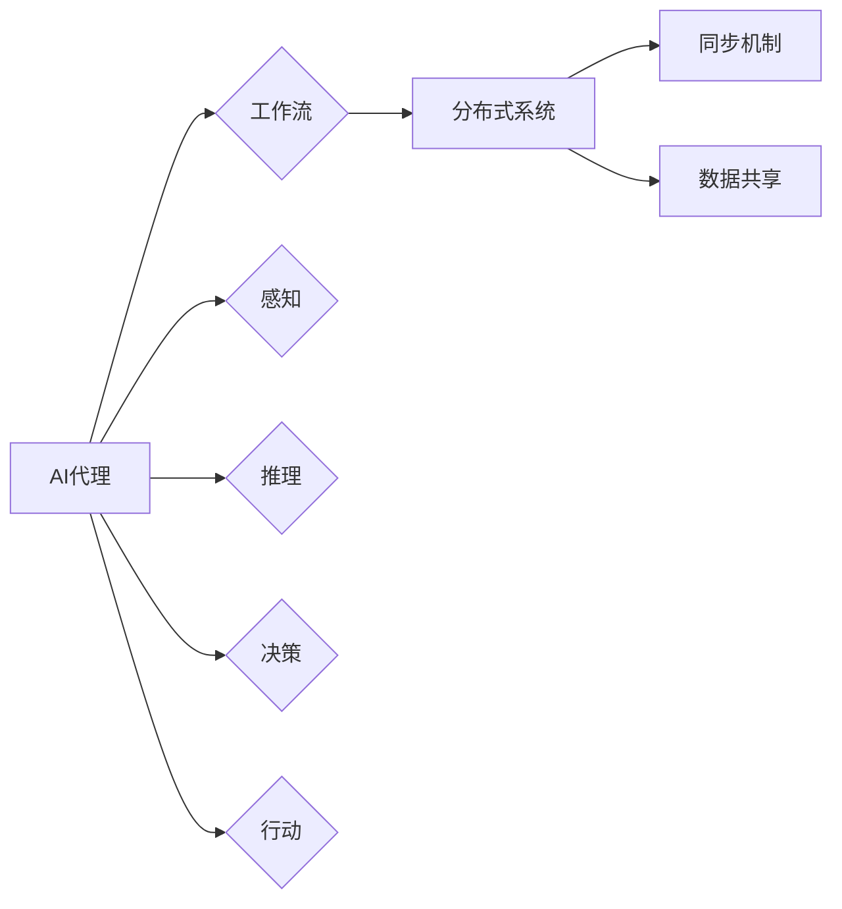

> AI代理, 人工智能工作流, 分布式系统, 同步机制, 数据共享, 资源协调, 智能决策

# AI人工智能代理工作流AI Agent WorkFlow：分布式·AI代理的同步与数据共享

在数字化时代，人工智能（AI）技术正以前所未有的速度发展，其中，AI代理作为智能体的代表，在自动化、智能化处理任务方面发挥着越来越重要的作用。AI代理工作流（AI Agent WorkFlow）是AI代理系统中的核心概念，它通过分布式架构和同步与数据共享机制，实现了高效的智能决策和任务执行。本文将深入探讨AI人工智能代理工作流的理论基础、架构设计、算法原理以及实际应用，并展望其未来发展趋势与挑战。

## 1. 背景介绍

### 1.1 AI代理的兴起

随着AI技术的不断进步，AI代理作为一种智能实体，能够在没有人类干预的情况下执行复杂任务。AI代理具备感知、推理、决策和行动的能力，能够适应动态环境，实现自主学习和进化。AI代理的兴起，为自动化、智能化处理任务提供了新的可能性。

### 1.2 AI代理工作流的需求

在分布式系统中，多个AI代理之间需要协同工作，以完成复杂的任务。AI代理工作流提供了这样一个框架，使得AI代理能够有序地执行任务，并实现高效的数据共享和同步。

### 1.3 研究意义

研究AI人工智能代理工作流，对于提升AI代理系统的智能化水平、提高系统效率和可靠性具有重要意义。本文旨在深入探讨AI代理工作流的理论和实践，为相关领域的研究者和开发者提供参考。

## 2. 核心概念与联系

### 2.1 核心概念

#### 2.1.1 AI代理

AI代理（Artificial Intelligence Agent）是一种具有智能的软件或硬件实体，能够感知环境、接收信息、进行推理和决策，并采取行动以实现目标。

#### 2.1.2 工作流

工作流（Workflow）是一系列相互关联的任务或活动，按照一定的顺序执行，以实现特定的目标。

#### 2.1.3 分布式系统

分布式系统（Distributed System）是由多个独立计算机组成的系统，通过通信网络连接，协同完成计算任务。

#### 2.1.4 同步机制

同步机制（Synchronization Mechanism）是一种确保分布式系统中各个组件协同工作的机制。

#### 2.1.5 数据共享

数据共享（Data Sharing）是指多个组件在分布式系统中共享数据和资源。

### 2.2 Mermaid 流程图



### 2.3 核心概念联系

AI代理通过感知环境、进行推理和决策，并在分布式系统中执行工作流任务。工作流在分布式系统中通过同步机制和数据共享实现高效执行。

## 3. 核心算法原理 & 具体操作步骤

### 3.1 算法原理概述

AI代理工作流的核心算法包括任务调度、同步机制、数据共享和资源协调。

#### 3.1.1 任务调度

任务调度算法负责将工作流中的任务分配给合适的AI代理执行。

#### 3.1.2 同步机制

同步机制确保AI代理在执行任务时保持一致性，如锁机制、事件监听等。

#### 3.1.3 数据共享

数据共享机制允许AI代理之间共享数据，如分布式缓存、共享数据库等。

#### 3.1.4 资源协调

资源协调算法负责分配和管理系统资源，如计算资源、存储资源等。

### 3.2 算法步骤详解

#### 3.2.1 任务调度

1. 解析工作流，将任务分解为子任务。
2. 根据任务特性，选择合适的AI代理进行执行。
3. 将任务分配给AI代理，并设置任务执行优先级。
4. 监控任务执行状态，并根据需要调整任务分配。

#### 3.2.2 同步机制

1. 定义同步点，如任务开始、任务完成等。
2. 使用锁机制确保在同步点时，只有一个AI代理能够访问共享资源。
3. 使用事件监听机制，实现AI代理之间的消息传递和状态同步。

#### 3.2.3 数据共享

1. 使用分布式缓存或共享数据库存储共享数据。
2. 定义数据访问接口，实现AI代理之间的数据共享。
3. 确保数据的一致性和安全性。

#### 3.2.4 资源协调

1. 监控系统资源使用情况。
2. 根据任务需求，分配计算资源、存储资源等。
3. 优化资源分配策略，提高系统资源利用率。

### 3.3 算法优缺点

#### 3.3.1 优点

1. 高效：通过任务调度、同步机制和数据共享，提高系统执行效率。
2. 可靠：确保AI代理之间的一致性和数据安全性。
3. 扩展性：适应不同规模和应用场景。

#### 3.3.2 缺点

1. 复杂：算法设计和实现较为复杂，需要一定的专业知识。
2. 成本：资源协调和同步机制可能增加系统成本。

### 3.4 算法应用领域

AI代理工作流适用于以下领域：

1. 智能制造
2. 智能交通
3. 金融风控
4. 健康医疗
5. 供应链管理

## 4. 数学模型和公式 & 详细讲解 & 举例说明

### 4.1 数学模型构建

#### 4.1.1 任务调度模型

任务调度模型可以用以下数学公式表示：

$$
\text{TaskSchedule}(T, A, R) = \{t_1, t_2, \ldots, t_n\}
$$

其中，$T$ 为任务集合，$A$ 为AI代理集合，$R$ 为资源集合，$t_i$ 为任务 $T_i$ 在AI代理 $A_j$ 上执行的时间。

#### 4.1.2 同步机制模型

同步机制模型可以用以下数学公式表示：

$$
\text{Synchronization}(S, T) = \{s_1, s_2, \ldots, s_m\}
$$

其中，$S$ 为同步点集合，$T$ 为任务集合，$s_i$ 为任务 $T_i$ 在同步点 $S_j$ 上的状态。

### 4.2 公式推导过程

#### 4.2.1 任务调度模型推导

任务调度模型基于最短执行时间优先（SPT）算法，即选择执行时间最短的AI代理执行任务。

#### 4.2.2 同步机制模型推导

同步机制模型基于事件监听机制，即AI代理在执行任务时，监听同步点事件，并根据事件进行状态同步。

### 4.3 案例分析与讲解

#### 4.3.1 案例一：智能交通系统

在智能交通系统中，AI代理负责实时监控道路状况、车辆行驶状态等数据，并根据数据调整交通信号灯、发布交通管制措施等。

#### 4.3.2 案例二：智能制造

在智能制造中，AI代理负责监控生产线设备状态、优化生产流程等。

## 5. 项目实践：代码实例和详细解释说明

### 5.1 开发环境搭建

1. 安装Python 3.8及以上版本。
2. 安装PyTorch、Distributed PyTorch、Docker等工具。

### 5.2 源代码详细实现

以下是一个简单的AI代理工作流示例代码：

```python
# 代理类
class Agent:
    def __init__(self, id, resource):
        self.id = id
        self.resource = resource

# 工作流类
class Workflow:
    def __init__(self, tasks, agents):
        self.tasks = tasks
        self.agents = agents

    def run(self):
        for task in self.tasks:
            agent = self.select_agent(task)
            agent.execute(task)

    def select_agent(self, task):
        # 根据任务特性选择合适的代理
        pass

    def execute(self, task):
        # 执行任务
        pass

# 创建代理和任务
agent1 = Agent(id=1, resource=100)
agent2 = Agent(id=2, resource=200)
task1 = Task(name="任务1")
task2 = Task(name="任务2")

# 创建工作流
workflow = Workflow(tasks=[task1, task2], agents=[agent1, agent2])

# 运行工作流
workflow.run()
```

### 5.3 代码解读与分析

上述代码展示了AI代理工作流的基本结构和执行流程。`Agent` 类代表AI代理，包含代理ID和资源信息。`Workflow` 类代表工作流，包含任务列表和代理列表。`run` 方法负责执行工作流，`select_agent` 方法负责选择合适的代理执行任务，`execute` 方法负责执行任务。

### 5.4 运行结果展示

在运行上述代码后，工作流将按照任务列表的顺序，选择合适的代理执行任务。

## 6. 实际应用场景

### 6.1 智能制造

在智能制造领域，AI代理工作流可以用于优化生产流程、提高生产效率、减少生产成本。

### 6.2 智能交通

在智能交通领域，AI代理工作流可以用于实时监控交通状况、优化交通信号灯控制、提高道路通行效率。

### 6.3 健康医疗

在健康医疗领域，AI代理工作流可以用于辅助医生进行诊断、制定治疗方案、监控患者病情。

## 7. 工具和资源推荐

### 7.1 学习资源推荐

1. 《Distributed Systems: Principles and Paradigms》
2. 《Introduction to Parallel Computing》
3. 《Artificial Intelligence: A Modern Approach》

### 7.2 开发工具推荐

1. PyTorch
2. Distributed PyTorch
3. Docker

### 7.3 相关论文推荐

1. "A Framework for Distributed Workflow Management"
2. "Parallel and Distributed Computing: An Introduction"
3. "Distributed Systems: Concepts and Design"

## 8. 总结：未来发展趋势与挑战

### 8.1 研究成果总结

本文深入探讨了AI人工智能代理工作流的理论基础、架构设计、算法原理以及实际应用。通过对任务调度、同步机制、数据共享和资源协调等方面的研究，为AI代理工作流的发展提供了新的思路。

### 8.2 未来发展趋势

1. 人工智能代理工作流将更加智能化，能够根据环境变化自动调整任务分配和资源分配策略。
2. AI代理工作流将与其他人工智能技术（如强化学习、深度学习等）结合，实现更加复杂和智能的任务执行。
3. AI代理工作流将应用于更多领域，如金融、医疗、教育等。

### 8.3 面临的挑战

1. AI代理工作流的算法设计和实现较为复杂，需要跨学科的知识和技能。
2. AI代理工作流需要面对不同环境和应用场景，需要设计通用性强、可扩展性高的解决方案。
3. AI代理工作流的安全性和可靠性问题需要得到充分重视。

### 8.4 研究展望

1. 开发更加高效、智能的AI代理工作流算法，提高系统性能和可靠性。
2. 探索AI代理工作流与其他人工智能技术的融合，实现更加复杂的任务执行。
3. 推广AI代理工作流在更多领域的应用，为社会发展带来更多价值。

## 9. 附录：常见问题与解答

**Q1：什么是AI代理工作流？**

A：AI代理工作流是一种基于AI代理的分布式系统框架，通过任务调度、同步机制、数据共享和资源协调，实现高效的智能决策和任务执行。

**Q2：AI代理工作流适用于哪些领域？**

A：AI代理工作流适用于智能制造、智能交通、健康医疗、供应链管理等多个领域。

**Q3：如何设计AI代理工作流？**

A：设计AI代理工作流需要考虑任务调度、同步机制、数据共享和资源协调等方面，并结合具体应用场景进行优化。

**Q4：AI代理工作流的安全性和可靠性如何保证？**

A：保证AI代理工作流的安全性和可靠性需要从算法设计、系统架构和运行监控等方面进行综合考虑。

**Q5：未来AI代理工作流的发展趋势是什么？**

A：未来AI代理工作流将更加智能化、通用化、融合化，并应用于更多领域。

---

作者：禅与计算机程序设计艺术 / Zen and the Art of Computer Programming