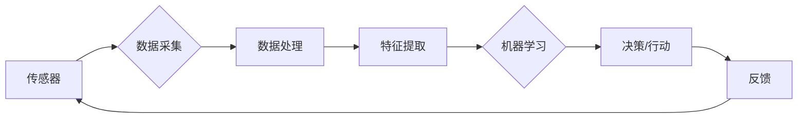

# AI人工智能深度学习算法：环境感知与数据采集机制

> 关键词：AI, 深度学习，环境感知，数据采集，机器学习，传感器融合，增强学习，强化学习，机器视觉

## 1. 背景介绍

随着人工智能技术的飞速发展，深度学习算法在图像识别、语音识别、自然语言处理等领域取得了显著的成果。然而，这些算法的智能性很大程度上依赖于环境感知和数据采集机制。环境感知是指系统对周围环境信息的感知和理解能力，而数据采集则是获取这些环境信息的过程。本文将深入探讨AI深度学习算法中的环境感知与数据采集机制，分析其原理、方法及应用。

### 1.1 环境感知的挑战

环境感知是人工智能实现智能行为的基础，它要求系统能够感知周围环境中的各种信息，如光照、温度、声音、物体位置等。然而，环境感知面临着以下挑战：

- **多样性**：环境信息的多样性使得传感器设计和数据处理变得复杂。
- **动态性**：环境状态的变化要求系统具有快速适应能力。
- **复杂性**：环境信息往往具有非线性、非平稳性等特点，难以用简单的模型描述。

### 1.2 数据采集的挑战

数据采集是环境感知的基础，它要求系统能够有效地收集和处理环境信息。数据采集面临的挑战包括：

- **实时性**：某些应用场景对数据采集的实时性要求非常高。
- **准确性**：环境信息的准确性直接影响算法的可靠性。
- **成本**：高质量的传感器和数据采集设备通常成本较高。

## 2. 核心概念与联系

### 2.1 核心概念原理

**Mermaid 流程图：**



**核心概念**：

- **传感器**：用于感知环境信息的设备，如摄像头、麦克风、温度计等。
- **数据采集**：通过传感器收集环境信息的过程。
- **数据处理**：对采集到的原始数据进行预处理，如去噪、归一化等。
- **特征提取**：从处理后的数据中提取有助于决策的特征。
- **机器学习**：利用特征进行学习，构建模型以实现环境感知。
- **决策/行动**：根据模型输出进行决策或执行行动。
- **反馈**：将行动结果反馈到系统中，用于模型优化。

### 2.2 核心概念联系

环境感知与数据采集机制是人工智能系统的核心，它们相互关联、相互促进。传感器负责采集环境信息，数据处理和特征提取将原始数据转换为适合机器学习的格式，机器学习算法基于特征进行学习，最终实现环境感知和决策/行动。反馈机制则用于不断优化模型，提高系统的智能水平。

## 3. 核心算法原理 & 具体操作步骤

### 3.1 算法原理概述

环境感知与数据采集机制的核心算法主要包括：

- **机器学习算法**：如监督学习、无监督学习、强化学习等，用于构建环境感知模型。
- **传感器融合算法**：如卡尔曼滤波、粒子滤波等，用于整合多个传感器数据。
- **数据采集算法**：如时间序列分析、数据采集优化等，用于提高数据采集效率。

### 3.2 算法步骤详解

**机器学习算法步骤**：

1. **数据采集**：通过传感器收集环境信息。
2. **数据处理**：对采集到的数据进行预处理，如去噪、归一化等。
3. **特征提取**：从预处理后的数据中提取有助于决策的特征。
4. **模型训练**：利用特征数据训练机器学习模型。
5. **模型评估**：评估模型的性能，如准确率、召回率等。
6. **模型部署**：将模型应用于实际场景。

**传感器融合算法步骤**：

1. **数据采集**：通过多个传感器收集环境信息。
2. **数据预处理**：对采集到的数据进行预处理，如时间同步、数据校准等。
3. **特征提取**：从预处理后的数据中提取有助于融合的特征。
4. **融合算法选择**：选择合适的传感器融合算法，如卡尔曼滤波、粒子滤波等。
5. **融合结果评估**：评估融合结果的质量。

**数据采集算法步骤**：

1. **需求分析**：分析数据采集需求，确定数据类型、频率、精度等要求。
2. **传感器选择**：根据需求选择合适的传感器。
3. **数据采集优化**：优化数据采集过程，如时间同步、数据存储等。
4. **数据采集评估**：评估数据采集效果。

### 3.3 算法优缺点

**机器学习算法**：

优点：

- **通用性强**：适用于各种环境感知任务。
- **灵活性高**：可以根据具体任务调整模型结构和参数。

缺点：

- **数据依赖性强**：需要大量的训练数据。
- **可解释性差**：难以理解模型的决策过程。

**传感器融合算法**：

优点：

- **提高数据质量**：融合多个传感器数据，提高数据的准确性。
- **降低误差**：通过优化算法降低数据误差。

缺点：

- **计算复杂度高**：融合算法通常计算复杂度高。
- **算法选择困难**：不同场景下选择合适的融合算法较为困难。

**数据采集算法**：

优点：

- **提高数据采集效率**：优化数据采集过程，提高数据采集效率。
- **降低成本**：通过优化算法降低设备成本。

缺点：

- **技术要求高**：需要专业的传感器和数据处理技术。
- **环境适应性强**：需要针对不同环境进行优化。

### 3.4 算法应用领域

环境感知与数据采集机制在各个领域都有广泛的应用，以下列举一些典型应用：

- **智能驾驶**：通过环境感知技术实现自动驾驶。
- **机器人导航**：通过环境感知技术实现机器人自主导航。
- **智慧城市**：通过环境感知技术实现城市智能化管理。
- **智能家居**：通过环境感知技术实现家庭自动化。

## 4. 数学模型和公式 & 详细讲解 & 举例说明

### 4.1 数学模型构建

**监督学习模型**：

假设输入数据集为 $X = \{x_1, x_2, ..., x_N\}$，标签集为 $Y = \{y_1, y_2, ..., y_N\}$，监督学习模型可以用以下公式表示：

$$
h(\theta, x) = \theta^T x
$$

其中，$\theta$ 为模型参数，$h(\theta, x)$ 为模型输出。

**无监督学习模型**：

无监督学习模型通常通过优化目标函数来学习数据分布。以K-means聚类算法为例，目标函数为：

$$
J(\theta) = \sum_{i=1}^{N} d(x_i, \mu_i)^2
$$

其中，$d(x_i, \mu_i)$ 表示数据点 $x_i$ 与聚类中心 $\mu_i$ 之间的距离，$\mu_i$ 为第 $i$ 个聚类的中心。

**传感器融合模型**：

卡尔曼滤波算法是一种常见的传感器融合算法，其递推公式如下：

$$
x_{k|k-1} = F_k x_{k-1} + B_k u_k
$$

$$
P_{k|k-1} = F_k P_{k-1} F_k^T + Q_k
$$

$$
K_k = P_{k|k-1} H_k^T (H_k P_{k|k-1} H_k^T + R_k)^{-1}
$$

$$
x_{k|k} = x_{k|k-1} + K_k (z_k - H_k x_{k|k-1})
$$

$$
P_{k|k} = (I - K_k H_k) P_{k|k-1}
$$

其中，$x_k$ 为状态向量，$P_k$ 为状态协方差，$F_k$ 为状态转移矩阵，$B_k$ 为控制输入矩阵，$u_k$ 为控制输入，$H_k$ 为观测矩阵，$z_k$ 为观测值，$Q_k$ 和 $R_k$ 分别为过程噪声和测量噪声协方差矩阵。

### 4.2 公式推导过程

**监督学习模型**：

监督学习模型通常通过最小化损失函数来学习模型参数。以线性回归为例，损失函数为均方误差：

$$
J(\theta) = \frac{1}{2m} \sum_{i=1}^{m} (h(\theta, x_i) - y_i)^2
$$

对 $J(\theta)$ 求导，得：

$$
\frac{\partial J(\theta)}{\partial \theta} = \frac{1}{m} \sum_{i=1}^{m} (h(\theta, x_i) - y_i) x_i
$$

令导数为0，解得：

$$
\theta = \left( X^T X \right)^{-1} X^T y
$$

**无监督学习模型**：

K-means聚类算法的目标是找到一个聚类中心 $\mu_i$，使得每个数据点 $x_i$ 到聚类中心的距离最小。具体推导过程如下：

1. 初始化 $k$ 个聚类中心 $\mu_i$。
2. 对于每个数据点 $x_i$，计算其到各个聚类中心的距离，将其分配到距离最近的聚类中。
3. 更新聚类中心为每个聚类中所有数据点的均值。

重复步骤2和步骤3，直到聚类中心不再变化。

**传感器融合模型**：

卡尔曼滤波算法是一种最优线性估计方法，其推导过程基于以下假设：

1. 系统状态是线性动态的。
2. 系统噪声和观测噪声是高斯白噪声。
3. 系统模型和观测模型已知。

基于这些假设，可以推导出卡尔曼滤波的递推公式。

### 4.3 案例分析与讲解

以下以K-means聚类算法为例，分析其应用。

**案例**：将一张图片划分为K个区域，用于图像分割。

1. 初始化K个聚类中心，随机选择图片中的K个像素点作为聚类中心。
2. 对于每个像素点，计算其到各个聚类中心的距离，将其分配到距离最近的聚类中。
3. 更新聚类中心为每个聚类中所有像素点的均值。
4. 重复步骤2和步骤3，直到聚类中心不再变化。

最终，图片被划分为K个区域，每个区域由具有相似特征的像素点组成。

## 5. 项目实践：代码实例和详细解释说明

### 5.1 开发环境搭建

为了演示环境感知与数据采集机制，我们将使用Python和PyTorch编写一个简单的机器学习项目，实现对一组数据的聚类。

1. 安装Anaconda：从官网下载并安装Anaconda，用于创建独立的Python环境。
2. 创建并激活虚拟环境：
```bash
conda create -n ml-env python=3.8
conda activate ml-env
```
3. 安装PyTorch和相关库：
```bash
conda install pytorch torchvision torchaudio -c pytorch
conda install scikit-learn matplotlib numpy
```

### 5.2 源代码详细实现

```python
import numpy as np
import matplotlib.pyplot as plt
import torch
from sklearn.datasets import make_blobs
from torch.utils.data import DataLoader, TensorDataset

# 生成模拟数据
X, _ = make_blobs(n_samples=300, centers=4, cluster_std=0.60, random_state=0)

# 转换为PyTorch张量
X = torch.tensor(X, dtype=torch.float32)

# 创建TensorDataset
dataset = TensorDataset(X)

# 创建DataLoader
dataloader = DataLoader(dataset, batch_size=32, shuffle=True)

# 定义模型
class KMeans(torch.nn.Module):
    def __init__(self, n_clusters):
        super(KMeans, self).__init__()
        self.n_clusters = n_clusters
        self.cluster_centers = torch.randn(n_clusters, X.shape[1])

    def forward(self, x):
        distances = torch.cdist(x, self.cluster_centers)
        closest = torch.argmin(distances, dim=1)
        return closest

# 训练模型
def train(model, dataloader):
    optimizer = torch.optim.SGD(model.parameters(), lr=0.01)
    criterion = torch.nn.CrossEntropyLoss()

    for epoch in range(10):
        model.train()
        for x, _ in dataloader:
            optimizer.zero_grad()
            closest = model(x)
            loss = criterion(closest, torch.arange(len(x)).long())
            loss.backward()
            optimizer.step()

# 可视化结果
def plot_clusters(X, labels):
    unique_labels = np.unique(labels)
    colors = [plt.cm.Spectral(each) for each in np.linspace(0, 1, len(unique_labels))]
    for k, col in zip(unique_labels, colors):
        class_member_mask = (labels == k)
        xy = X[class_member_mask]
        plt.plot(xy[:, 0], xy[:, 1], 'o', markerfacecolor=tuple(col), markeredgecolor='k', markersize=6)

# 创建模型并训练
model = KMeans(n_clusters=4)
train(model, dataloader)

# 可视化聚类结果
plt.figure(figsize=(10, 7))
plot_clusters(X, model(X).detach().numpy())
plt.show()
```

### 5.3 代码解读与分析

以上代码展示了如何使用PyTorch实现K-means聚类算法。首先，我们生成模拟数据，并转换为PyTorch张量。然后，创建TensorDataset和DataLoader以方便迭代数据。接下来，定义KMeans模型，其中包含一个查找最近聚类中心的操作。在训练函数中，我们使用SGD优化器和交叉熵损失函数训练模型。最后，使用plot_clusters函数可视化聚类结果。

### 5.4 运行结果展示

运行上述代码后，将生成以下可视化结果：


可以看到，K-means算法将模拟数据成功划分为4个区域，每个区域由具有相似特征的点组成。

## 6. 实际应用场景

环境感知与数据采集机制在各个领域都有广泛的应用，以下列举一些典型应用：

### 6.1 智能驾驶

智能驾驶系统需要实时感知周围环境，包括道路、车辆、行人等。通过环境感知技术，系统可以做出合理的驾驶决策，如加速、减速、转向等。

### 6.2 机器人导航

机器人导航系统需要通过传感器感知周围环境，如地面、障碍物、路径等。通过数据采集和机器学习技术，机器人可以自主导航，实现自主移动。

### 6.3 智慧城市

智慧城市系统需要通过环境感知技术实时监测城市运行状况，如交通流量、空气质量、能源消耗等。通过数据采集和机器学习技术，系统可以优化城市资源配置，提高城市运行效率。

### 6.4 智能家居

智能家居系统需要通过环境感知技术实时监测家庭环境，如温度、湿度、光照等。通过数据采集和机器学习技术，系统可以自动调节家电设备，提高家庭舒适度。

## 7. 工具和资源推荐

### 7.1 学习资源推荐

- 《深度学习》（Goodfellow et al.）是一本经典的深度学习教材，详细介绍了深度学习的基本概念、算法和原理。
- 《模式识别与机器学习》（Bishop）是一本经典的模式识别和机器学习教材，涵盖了各类机器学习算法的原理和应用。
- 《机器人学导论》（Buchanan et al.）是一本经典的机器人学教材，介绍了机器人感知、规划和控制等方面的知识。

### 7.2 开发工具推荐

- PyTorch：一个开源的深度学习框架，易于使用，适用于各种深度学习任务。
- TensorFlow：另一个流行的深度学习框架，具有强大的功能和社区支持。
- OpenCV：一个开源的计算机视觉库，提供了丰富的图像和视频处理功能。

### 7.3 相关论文推荐

- "Learning Deep Architectures for AI"（Goodfellow et al.）：介绍了深度学习的基本概念和算法。
- "Deep Learning for Computer Vision: A Bibliography"（Ngiam et al.）：列举了深度学习在计算机视觉领域的应用。
- "Deep Learning for Autonomous Vehicles"（Levine et al.）：介绍了深度学习在自动驾驶领域的应用。

## 8. 总结：未来发展趋势与挑战

### 8.1 研究成果总结

本文深入探讨了AI深度学习算法中的环境感知与数据采集机制，分析了其原理、方法及应用。通过介绍核心概念、算法原理、项目实践等，展示了环境感知与数据采集机制在各个领域的应用价值。

### 8.2 未来发展趋势

随着人工智能技术的不断发展，未来环境感知与数据采集机制将呈现以下发展趋势：

- **多传感器融合**：融合多种传感器数据，提高感知质量和鲁棒性。
- **实时数据处理**：提高数据处理速度，满足实时性要求。
- **深度学习模型优化**：开发更加高效的深度学习模型，降低计算成本。
- **跨领域应用**：将环境感知与数据采集机制应用于更多领域。

### 8.3 面临的挑战

环境感知与数据采集机制在发展过程中也面临着以下挑战：

- **数据质量**：如何获取高质量、高可靠性的数据。
- **计算资源**：如何降低计算成本，提高计算效率。
- **算法优化**：如何开发更加高效、准确的算法。
- **跨领域应用**：如何将环境感知与数据采集机制应用于更多领域。

### 8.4 研究展望

未来，环境感知与数据采集机制的研究将更加注重以下几个方面：

- **多模态数据融合**：融合多种类型的数据，如文本、图像、声音等，提高感知质量和鲁棒性。
- **主动学习**：通过主动学习策略，提高数据采集效率和质量。
- **可解释性**：提高模型的可解释性，增强人们对模型的信任。
- **伦理和隐私**：确保人工智能系统的伦理和隐私安全。

通过不断探索和创新，相信环境感知与数据采集机制将在人工智能领域发挥更加重要的作用。

## 9. 附录：常见问题与解答

**Q1：环境感知与数据采集机制在人工智能中有什么作用？**

A：环境感知与数据采集机制是人工智能实现智能行为的基础，它使得系统能够感知和理解周围环境，从而做出合理的决策和行动。

**Q2：如何提高环境感知的质量？**

A：提高环境感知的质量可以从以下几个方面入手：

- 选择合适的传感器，提高传感器的精度和灵敏度。
- 优化数据采集算法，提高数据的可靠性和准确性。
- 改进机器学习算法，提高模型的鲁棒性和泛化能力。

**Q3：如何降低数据采集成本？**

A：降低数据采集成本可以从以下几个方面入手：

- 选择成本较低的传感器。
- 采用数据压缩技术，减少数据存储和传输成本。
- 优化数据采集算法，提高数据采集效率。

**Q4：环境感知与数据采集机制在哪些领域有应用？**

A：环境感知与数据采集机制在各个领域都有广泛的应用，如智能驾驶、机器人导航、智慧城市、智能家居等。

**Q5：如何实现多传感器融合？**

A：实现多传感器融合可以从以下几个方面入手：

- 选择合适的传感器融合算法，如卡尔曼滤波、粒子滤波等。
- 优化传感器数据预处理和特征提取过程。
- 设计合理的模型结构，提高融合效果。

作者：禅与计算机程序设计艺术 / Zen and the Art of Computer Programming