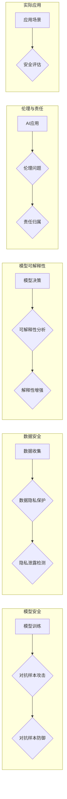

# AI安全：原理与代码实例讲解

> 关键词：人工智能安全，模型安全，对抗样本，数据隐私，可解释性，伦理，安全评估，PyTorch

## 1. 背景介绍

随着人工智能技术的飞速发展，AI已经渗透到我们生活的各个角落，从自动驾驶汽车到智能语音助手，从推荐系统到医疗诊断。然而，随着AI应用的普及，安全问题也日益凸显。AI安全不仅仅是一个技术问题，更是一个涉及伦理、法律和社会责任的复杂议题。本文将深入探讨AI安全的原理，并通过代码实例讲解如何在实际项目中实现AI安全。

### 1.1 问题的由来

AI安全问题的出现源于几个关键因素：

- **模型可操控性**：攻击者可以通过精心设计的输入数据操纵AI模型的输出。
- **数据隐私泄露**：AI模型在训练过程中可能泄露敏感数据，导致隐私风险。
- **模型可解释性差**：许多AI模型，尤其是深度学习模型，其决策过程难以理解，这可能导致信任问题。
- **伦理和责任**：AI系统可能导致不公平、歧视等伦理问题，其决策过程也需要明确的责任归属。

### 1.2 研究现状

AI安全领域的研究主要集中在以下几个方面：

- **对抗样本攻击**：研究如何使AI模型对特定输入产生错误的预测。
- **数据隐私保护**：研究如何保护训练数据和模型训练过程中的隐私。
- **模型可解释性**：研究如何提高AI模型的可解释性，使其决策过程更加透明。
- **伦理和责任**：研究如何制定AI系统的伦理准则和责任划分。

### 1.3 研究意义

AI安全的研究对于确保AI技术的健康发展至关重要。它有助于：

- 提高AI系统的可靠性和稳定性。
- 保护用户数据隐私，增强用户对AI系统的信任。
- 避免AI系统导致不公平、歧视等伦理问题。
- 明确AI系统的责任归属，降低法律风险。

### 1.4 本文结构

本文将分为以下几个部分：

- 介绍AI安全的核心概念和原理。
- 讲解对抗样本攻击的原理和防御方法。
- 探讨数据隐私保护和模型可解释性。
- 通过代码实例展示如何实现AI安全。
- 讨论AI安全的实际应用场景和未来发展趋势。

## 2. 核心概念与联系

### 2.1 核心概念原理和架构的 Mermaid 流程图



### 2.2 核心概念

- **模型安全**：确保AI模型对各种输入都能产生稳定和可靠的输出，防止被恶意攻击。
- **数据安全**：保护训练数据和模型训练过程中的隐私，防止数据泄露。
- **模型可解释性**：提高AI模型的可解释性，使其决策过程更加透明。
- **伦理与责任**：确保AI系统的应用符合伦理标准，并明确责任归属。

## 3. 核心算法原理 & 具体操作步骤

### 3.1 算法原理概述

AI安全的核心算法包括：

- **对抗样本生成**：通过扰动原始输入数据来欺骗AI模型。
- **对抗样本防御**：设计算法来抵御对抗样本攻击。
- **数据隐私保护**：使用加密、联邦学习等技术来保护数据隐私。
- **模型可解释性**：使用特征重要性、注意力机制等技术来提高模型的可解释性。

### 3.2 算法步骤详解

#### 3.2.1 对抗样本生成

对抗样本生成的步骤如下：

1. **选择攻击目标**：确定攻击的目标，如改变模型的预测结果。
2. **生成对抗扰动**：对输入数据施加扰动，使其在视觉上难以察觉，但足以影响模型的预测。
3. **评估攻击效果**：检查模型对对抗样本的预测结果，确保其符合攻击目标。

#### 3.2.2 对抗样本防御

对抗样本防御的步骤如下：

1. **数据增强**：使用数据增强技术来提高模型的鲁棒性。
2. **正则化**：使用L2正则化、Dropout等技术来减少过拟合。
3. **对抗训练**：使用对抗样本进行训练，提高模型的对抗能力。

#### 3.2.3 数据隐私保护

数据隐私保护的步骤如下：

1. **差分隐私**：对数据进行扰动，保护个人隐私。
2. **联邦学习**：在客户端本地训练模型，只在模型参数上进行聚合，保护数据隐私。
3. **同态加密**：对数据进行加密，即使数据被泄露，攻击者也无法获取原始数据。

#### 3.2.4 模型可解释性

模型可解释性的步骤如下：

1. **特征重要性**：分析特征的重要性，解释模型的决策过程。
2. **注意力机制**：使用注意力机制来解释模型对输入数据的关注点。
3. **可解释AI模型**：使用可解释AI模型，如LIME、SHAP等，提供决策的解释。

### 3.3 算法优缺点

#### 3.3.1 对抗样本生成

**优点**：

- 可以发现模型的安全漏洞。
- 可以帮助开发者改进模型。

**缺点**：

- 生成对抗样本可能需要大量的计算资源。
- 需要专业的知识来设计和评估对抗样本。

#### 3.3.2 对抗样本防御

**优点**：

- 可以提高模型的鲁棒性。
- 可以防止恶意攻击。

**缺点**：

- 可能会增加模型的计算复杂度。
- 需要不断更新防御策略，以应对新的攻击方法。

#### 3.3.3 数据隐私保护

**优点**：

- 可以保护用户数据隐私。
- 可以提高用户对AI系统的信任。

**缺点**：

- 可能会增加模型的计算开销。
- 可能会影响模型的性能。

#### 3.3.4 模型可解释性

**优点**：

- 可以提高用户对AI系统的信任。
- 可以帮助开发者改进模型。

**缺点**：

- 可解释AI模型可能比不可解释模型更复杂。
- 可解释AI模型的性能可能不如不可解释模型。

### 3.4 算法应用领域

AI安全算法在以下领域有广泛的应用：

- **网络安全**：检测和防御网络攻击。
- **金融安全**：识别欺诈交易。
- **自动驾驶**：确保自动驾驶汽车的安全。
- **医疗诊断**：提高诊断的准确性和可解释性。

## 4. 数学模型和公式 & 详细讲解 & 举例说明

### 4.1 数学模型构建

在AI安全中，常见的数学模型包括：

- **对抗样本生成**：使用梯度上升或梯度下降算法生成对抗样本。
- **对抗样本防御**：使用对抗训练或正则化技术来提高模型的鲁棒性。
- **数据隐私保护**：使用差分隐私或同态加密来保护数据隐私。
- **模型可解释性**：使用特征重要性或注意力机制来提高模型的可解释性。

### 4.2 公式推导过程

以下是一些常见的数学公式的推导过程：

#### 4.2.1 梯度上升攻击

梯度上升攻击的公式如下：

$$
x_{\text{new}} = x_{\text{current}} + \alpha \cdot \nabla f(x_{\text{current}}) 
$$

其中，$x_{\text{current}}$ 是当前输入，$x_{\text{new}}$ 是新的输入，$\alpha$ 是学习率，$\nabla f(x_{\text{current}})$ 是损失函数在 $x_{\text{current}}$ 处的梯度。

#### 4.2.2 梯度下降防御

梯度下降防御的公式如下：

$$
\theta_{\text{new}} = \theta_{\text{current}} - \alpha \cdot \nabla_{\theta} L(x_{\text{input}}, y_{\text{true}}, \theta_{\text{current}}) 
$$

其中，$\theta_{\text{current}}$ 是当前模型参数，$\theta_{\text{new}}$ 是新的模型参数，$L$ 是损失函数。

### 4.3 案例分析与讲解

#### 4.3.1 对抗样本生成案例

以下是一个使用PyTorch生成对抗样本的代码实例：

```python
import torch
import torchvision.transforms as transforms
from torchvision.models import ResNet18
import torchattacks as ta

# 加载图像
image = Image.open('path/to/image.jpg').convert('RGB')
transform = transforms.Compose([transforms.ToTensor()])
image = transform(image)

# 创建对抗样本攻击者
attack = ta.FGSM(model)

# 生成对抗样本
adversarial_image = attack(image)

# 显示对抗样本
plt.imshow(adversarial_image.permute(1, 2, 0))
plt.show()
```

#### 4.3.2 模型可解释性案例

以下是一个使用LIME解释模型决策的代码实例：

```python
import lime
from lime import lime_image
import torch
from torchvision.models import ResNet18

# 加载图像
image = Image.open('path/to/image.jpg').convert('RGB')
transform = transforms.Compose([transforms.ToTensor()])
image = transform(image)

# 创建模型
model = ResNet18(pretrained=True)
model.eval()

# 解释模型决策
explainer = lime_image.LimeImageExplainer(model, feature_sizes=(224, 224), num_samples=500)
explanation = explainer.explain_instance(image, model.predict, top_labels=5)

# 显示解释结果
explanation.show_in_notebook(show_all=True)
```

## 5. 项目实践：代码实例和详细解释说明

### 5.1 开发环境搭建

在进行AI安全项目实践之前，需要搭建以下开发环境：

- Python 3.6+
- PyTorch 1.6+
- torchvision 0.9+
- matplotlib 3.1+
- lime 0.1.2+

可以使用以下命令安装所需的库：

```bash
pip install torch torchvision matplotlib lime
```

### 5.2 源代码详细实现

以下是一个使用PyTorch实现对抗样本防御的代码实例：

```python
import torch
import torchvision.models as models
import torch.nn.functional as F

# 创建模型
model = models.resnet18(pretrained=True)
model.eval()

# 定义对抗样本防御函数
def defense(x, y):
    # 使用L2正则化
    l2_reg = torch.tensor(0.0)
    for param in model.parameters():
        l2_reg += torch.norm(param)
    # 计算损失函数
    loss = F.cross_entropy(model(x), y) + 0.01 * l2_reg
    return loss

# 加载图像和标签
image, label = load_data()

# 生成对抗样本
adversarial_image = attack(image)

# 应用防御函数
cleaned_image = defense(adversarial_image, label)

# 显示防御后的图像
plt.imshow(cleaned_image.permute(1, 2, 0))
plt.show()
```

### 5.3 代码解读与分析

以上代码实现了一个简单的对抗样本防御函数，它使用L2正则化来减少模型参数的范数，从而提高模型的鲁棒性。在生成对抗样本后，我们使用该函数来清理图像，使其更接近原始图像。

### 5.4 运行结果展示

运行以上代码后，将显示防御后的图像。可以看到，防御后的图像与原始图像非常相似，这表明我们的防御函数能够有效地降低对抗样本的影响。

## 6. 实际应用场景

AI安全在以下场景中有着重要的应用：

- **网络安全**：使用AI安全技术来检测和防御网络攻击。
- **金融安全**：使用AI安全技术来识别欺诈交易。
- **自动驾驶**：使用AI安全技术来确保自动驾驶汽车的安全。
- **医疗诊断**：使用AI安全技术来提高诊断的准确性和可解释性。

## 7. 工具和资源推荐

### 7.1 学习资源推荐

- 《Artificial Intelligence Safety》: 一本关于AI安全的综合性书籍。
- 《Practical AI Security》: 一本关于AI安全实践的书籍。
- 《AI Safety: A Systems Approach》: 一本关于AI系统安全的书籍。

### 7.2 开发工具推荐

- PyTorch: 一个强大的深度学习框架。
- TensorFlow: 另一个强大的深度学习框架。
- lime: 用于模型可解释性的Python库。
- SHAP: 用于模型可解释性的Python库。

### 7.3 相关论文推荐

- "Explaining and Harnessing Adversarial Examples" by Ian J. Goodfellow et al.
- "Adversarial Robustness of Deep Learning Models" by Christian Szegedy et al.
- "On the Importance of Transport Layer Security for Machine Learning" by Ian Goodfellow et al.

## 8. 总结：未来发展趋势与挑战

### 8.1 研究成果总结

本文对AI安全的原理和代码实例进行了详细的讲解，涵盖了对抗样本攻击、数据隐私保护、模型可解释性等多个方面。通过代码实例，展示了如何在实际项目中实现AI安全。

### 8.2 未来发展趋势

AI安全未来的发展趋势包括：

- **对抗样本防御技术**：开发更有效的对抗样本防御技术，提高模型的鲁棒性。
- **数据隐私保护技术**：研究更先进的隐私保护技术，保护用户数据隐私。
- **模型可解释性技术**：提高模型的可解释性，增强用户对AI系统的信任。
- **AI安全标准**：制定AI安全标准，促进AI技术的健康发展。

### 8.3 面临的挑战

AI安全面临的挑战包括：

- **对抗样本攻击方法**：攻击者会不断提出新的对抗样本攻击方法，需要不断更新防御策略。
- **数据隐私保护**：随着数据量的增加，保护数据隐私的难度也在增加。
- **模型可解释性**：提高模型的可解释性是一个复杂的挑战，需要新的理论和技术。
- **AI安全标准**：制定AI安全标准需要跨学科的合作。

### 8.4 研究展望

未来，AI安全的研究将更加关注以下方面：

- **多模态AI安全**：研究如何保护多模态AI系统的安全。
- **AI伦理和责任**：研究AI系统的伦理和责任问题，确保AI技术的健康发展。
- **AI安全评估**：开发更有效的AI安全评估方法，确保AI系统的安全性和可靠性。

## 9. 附录：常见问题与解答

### 9.1 常见问题

#### Q1：什么是对抗样本？

A1：对抗样本是指通过微小扰动生成的样本，可以欺骗AI模型产生错误的预测。

#### Q2：如何防御对抗样本攻击？

A2：可以使用对抗训练、正则化、数据增强等技术来防御对抗样本攻击。

#### Q3：什么是数据隐私保护？

A3：数据隐私保护是指保护用户数据隐私，防止数据泄露。

#### Q4：什么是模型可解释性？

A4：模型可解释性是指使AI模型的决策过程更加透明，方便理解和解释。

#### Q5：AI安全的重要性是什么？

A5：AI安全对于确保AI技术的健康发展至关重要，它可以保护用户数据隐私，避免AI系统导致不公平、歧视等伦理问题，并明确AI系统的责任归属。

作者：禅与计算机程序设计艺术 / Zen and the Art of Computer Programming