# AI应用的新趋势与实践

> 关键词：人工智能，应用趋势，深度学习，机器学习，数据科学，技术实践，案例研究

## 1. 背景介绍

随着技术的不断进步，人工智能（AI）已经从理论走向实践，深入到我们生活的方方面面。从智能语音助手到自动驾驶汽车，从个性化推荐系统到医疗诊断辅助工具，AI的应用正变得越来越广泛。本文将探讨AI应用的新趋势，分析其背后的核心技术和实践方法，并展望未来发展的可能方向。

### 1.1 问题的由来

人工智能技术的发展，尤其是深度学习在近年来的突破，使得AI应用成为可能。然而，如何将AI技术有效地应用于实际问题，仍然是许多企业和研究机构面临的挑战。这涉及到对AI技术的深入理解，以及对实际应用场景的精准把握。

### 1.2 研究现状

目前，AI应用的研究现状主要体现在以下几个方面：

- **深度学习框架的普及**：TensorFlow、PyTorch等深度学习框架的普及，极大地降低了AI应用的门槛，使得更多开发者能够参与到AI应用的开发中。
- **跨领域技术的融合**：AI与其他技术的融合，如云计算、大数据、物联网等，正在推动AI应用向更广泛的领域扩展。
- **行业应用的深入**：AI技术在金融、医疗、教育、零售等行业中的应用越来越深入，为企业带来了新的增长点。

### 1.3 研究意义

研究AI应用的新趋势和实践，对于以下方面具有重要意义：

- **推动技术发展**：通过对新趋势的跟踪和实践，可以推动AI技术的创新和发展。
- **提升行业竞争力**：将AI技术应用于企业运营，可以提高效率、降低成本、创造新的业务模式。
- **改善生活质量**：AI应用可以改善人们的生活质量，提供更加便捷、智能的服务。

### 1.4 本文结构

本文将分为以下几个部分：

- **核心概念与联系**：介绍AI应用中的核心概念，并使用Mermaid流程图展示它们之间的关系。
- **核心算法原理 & 具体操作步骤**：讲解AI应用中的核心算法原理，并详细描述操作步骤。
- **数学模型和公式 & 详细讲解 & 举例说明**：介绍AI应用中的数学模型和公式，并结合案例进行讲解。
- **项目实践：代码实例和详细解释说明**：通过代码实例展示AI应用的实际操作。
- **实际应用场景**：探讨AI在各个行业的应用场景。
- **工具和资源推荐**：推荐学习和实践AI应用的资源。
- **总结：未来发展趋势与挑战**：总结AI应用的发展趋势和面临的挑战。
- **附录：常见问题与解答**：解答关于AI应用的常见问题。

## 2. 核心概念与联系

AI应用涉及到许多核心概念，以下是一些关键概念及其之间的关系：

```mermaid
graph LR
    A[数据科学] --> B{机器学习}
    B --> C{深度学习}
    B --> D{强化学习}
    B --> E{无监督学习}
    B --> F{半监督学习}
    C --> G{卷积神经网络}
    C --> H{循环神经网络}
    C --> I{生成对抗网络}
    D --> J{Q-learning}
    D --> K{深度Q网络}
    E --> L{聚类分析}
    E --> M{异常检测}
    F --> N[标注数据]
    N --> O{自动标注}
    O --> P{弱监督学习}
```



以上Mermaid流程图展示了AI应用中的核心概念及其之间的关系。数据科学是AI应用的基础，它包括数据收集、处理、分析和可视化。机器学习是AI应用的核心，它分为监督学习、无监督学习和半监督学习。深度学习是机器学习的一个分支，它通过神经网络模拟人脑进行学习。强化学习、聚类分析和异常检测等概念也是AI应用中的重要组成部分。

## 3. 核心算法原理 & 具体操作步骤

### 3.1 算法原理概述

AI应用中的核心算法包括：

- **监督学习**：通过标记的数据进行训练，学习输入和输出之间的关系。
- **无监督学习**：通过未标记的数据进行训练，发现数据中的模式和结构。
- **半监督学习**：结合标记和未标记的数据进行训练，提高模型的泛化能力。
- **深度学习**：使用多层神经网络进行学习，能够处理复杂的非线性关系。

### 3.2 算法步骤详解

以下是监督学习算法的步骤：

1. **数据收集**：收集相关领域的样本数据。
2. **数据预处理**：对数据进行清洗、去噪和特征提取。
3. **模型选择**：选择合适的模型进行训练。
4. **模型训练**：使用训练数据对模型进行训练。
5. **模型评估**：使用测试数据评估模型性能。
6. **模型优化**：根据评估结果对模型进行优化。

### 3.3 算法优缺点

- **监督学习**：优点是能够学习到明确的输入输出关系，但缺点是需要大量标记数据。
- **无监督学习**：优点是不需要标记数据，但缺点是难以直接应用于实际任务。
- **半监督学习**：优点是减少了对标记数据的依赖，但缺点是模型性能可能不如监督学习。
- **深度学习**：优点是能够处理复杂的非线性关系，但缺点是计算资源消耗大，对数据质量要求高。

### 3.4 算法应用领域

AI算法广泛应用于以下领域：

- **图像识别**：如人脸识别、物体检测等。
- **语音识别**：如语音转文字、语音合成等。
- **自然语言处理**：如机器翻译、情感分析等。
- **推荐系统**：如商品推荐、电影推荐等。
- **医疗诊断**：如疾病检测、药物研发等。

## 4. 数学模型和公式 & 详细讲解 & 举例说明

### 4.1 数学模型构建

以下是监督学习中的线性回归模型：

$$
y = \beta_0 + \beta_1x_1 + \beta_2x_2 + \ldots + \beta_nx_n + \epsilon
$$

其中，$y$ 是输出变量，$x_1, x_2, \ldots, x_n$ 是输入变量，$\beta_0, \beta_1, \ldots, \beta_n$ 是模型参数，$\epsilon$ 是误差项。

### 4.2 公式推导过程

线性回归模型的推导过程如下：

1. **损失函数**：选择均方误差作为损失函数：

$$
L(\theta) = \frac{1}{2m}\sum_{i=1}^{m}(y_i - \theta_0x_{i,0} - \theta_1x_{i,1} - \ldots - \theta_nx_{i,n})^2
$$

2. **梯度下降**：使用梯度下降法最小化损失函数：

$$
\theta_j := \theta_j - \alpha \frac{\partial L}{\partial \theta_j}
$$

3. **迭代优化**：重复上述步骤，直到损失函数收敛。

### 4.3 案例分析与讲解

以下是一个使用线性回归进行房价预测的案例：

- **数据集**：包含房屋的面积、房间数和价格等特征。
- **目标**：预测房屋的价格。
- **模型**：线性回归模型。
- **结果**：根据模型的预测，可以评估不同房屋的性价比。

## 5. 项目实践：代码实例和详细解释说明

### 5.1 开发环境搭建

使用Python进行AI应用开发，需要以下环境：

- Python 3.7及以上版本
- NumPy、Pandas、Matplotlib等库
- Scikit-learn库

### 5.2 源代码详细实现

以下是一个使用Scikit-learn库进行线性回归的Python代码示例：

```python
from sklearn.linear_model import LinearRegression
import numpy as np

# 创建数据集
X = np.array([[1, 2], [2, 3], [3, 4], [4, 5]])
y = np.array([1, 2, 3, 4])

# 创建线性回归模型
model = LinearRegression()

# 训练模型
model.fit(X, y)

# 预测新数据
new_data = np.array([[5, 6]])
prediction = model.predict(new_data)

print(prediction)
```

### 5.3 代码解读与分析

上述代码首先创建了一个简单的线性回归模型，然后使用一组数据对其进行训练。最后，使用模型对新数据进行预测，并打印预测结果。

### 5.4 运行结果展示

运行上述代码，可以得到预测结果：

```
[7.]
```

这表示当输入特征为(5, 6)时，模型的预测值为7。

## 6. 实际应用场景

AI技术在各个行业都有广泛的应用，以下是一些典型的应用场景：

### 6.1 金融行业

- **风险管理**：使用AI技术进行风险评估，预测潜在的金融风险。
- **欺诈检测**：使用AI技术检测和预防金融欺诈行为。
- **信用评分**：使用AI技术评估客户的信用等级。

### 6.2 医疗行业

- **疾病诊断**：使用AI技术辅助医生进行疾病诊断。
- **药物研发**：使用AI技术加速药物研发过程。
- **患者管理**：使用AI技术帮助医院进行患者管理。

### 6.3 教育行业

- **个性化学习**：使用AI技术为每个学生提供个性化的学习方案。
- **智能辅导**：使用AI技术为学生提供智能辅导。
- **教育评估**：使用AI技术进行教育评估。

### 6.4 未来应用展望

随着AI技术的不断发展，未来AI应用将在以下方面取得更大的突破：

- **更强大的模型**：开发更强大的AI模型，以处理更复杂的任务。
- **更高效的数据处理**：开发更高效的数据处理技术，以处理大规模数据。
- **更广泛的应用场景**：AI应用将扩展到更多领域，如制造业、能源、交通等。

## 7. 工具和资源推荐

### 7.1 学习资源推荐

- **书籍**：
  - 《深度学习》
  - 《Python机器学习》
  - 《统计学习方法》
- **在线课程**：
  - Coursera
  - edX
  - Udemy
- **博客和论坛**：
  - Medium
  - Stack Overflow
  - GitHub

### 7.2 开发工具推荐

- **编程语言**：Python
- **库**：
  - NumPy
  - Pandas
  - Matplotlib
  - Scikit-learn
  - TensorFlow
  - PyTorch

### 7.3 相关论文推荐

- **《深度学习》**：Goodfellow, I., Bengio, Y., & Courville, A. (2016). Deep learning. MIT press.
- **《深度学习自然语言处理》**：Graves, A., & Mohamed, A. R. (2014). Speech recognition with deep recurrent neural networks. In 2014 IEEE International Conference on Acoustics, Speech and Signal Processing (ICASSP) (pp. 6645-6649). IEEE.
- **《机器学习》**：Bishop, C. M. (2006). Pattern recognition and machine learning. springer.

## 8. 总结：未来发展趋势与挑战

### 8.1 研究成果总结

本文对AI应用的新趋势和实践进行了探讨，介绍了AI应用的核心概念、算法原理、实践方法、应用场景和未来发展趋势。

### 8.2 未来发展趋势

未来AI应用将呈现以下发展趋势：

- **更强大的模型**：开发更强大的AI模型，以处理更复杂的任务。
- **更高效的数据处理**：开发更高效的数据处理技术，以处理大规模数据。
- **更广泛的应用场景**：AI应用将扩展到更多领域，如制造业、能源、交通等。

### 8.3 面临的挑战

AI应用面临的挑战包括：

- **数据隐私**：如何保护用户数据隐私，是一个重要的问题。
- **算法偏见**：如何避免算法偏见，确保公平性，是一个挑战。
- **可解释性**：如何提高算法的可解释性，是一个重要的问题。

### 8.4 研究展望

未来，AI应用的研究将重点解决以下问题：

- **数据隐私保护**：开发新的数据隐私保护技术，保护用户数据。
- **算法公平性**：开发公平的算法，避免算法偏见。
- **算法可解释性**：提高算法的可解释性，增强用户信任。

## 9. 附录：常见问题与解答

**Q1：什么是机器学习？**

A：机器学习是一种让计算机从数据中学习并做出决策或预测的方法。它分为监督学习、无监督学习和半监督学习。

**Q2：什么是深度学习？**

A：深度学习是机器学习的一个分支，它使用多层神经网络来学习数据的复杂模式。

**Q3：什么是AI应用？**

A：AI应用是指将AI技术应用于实际问题，如图像识别、语音识别、自然语言处理等。

**Q4：如何将AI应用于实际问题？**

A：将AI应用于实际问题需要以下步骤：
1. 收集相关数据。
2. 数据预处理。
3. 选择合适的模型。
4. 训练模型。
5. 评估模型。
6. 部署模型。

**Q5：AI应用有哪些挑战？**

A：AI应用面临的挑战包括数据隐私、算法偏见、可解释性等。

作者：禅与计算机程序设计艺术 / Zen and the Art of Computer Programming