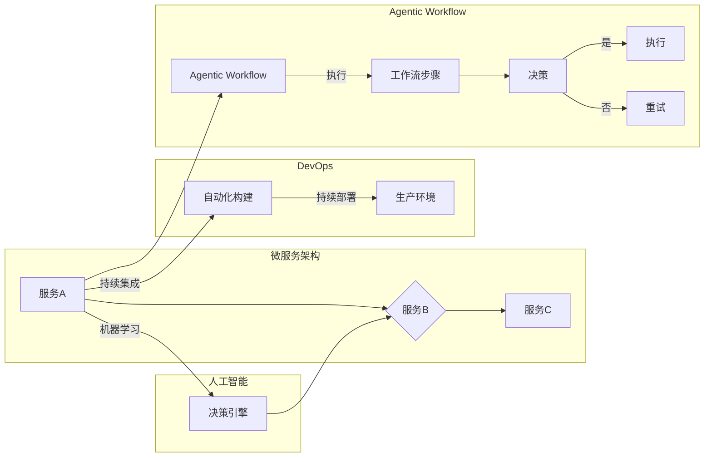

# Agentic Workflow 设计模式的最佳实践

> 关键词：Agentic Workflow, 设计模式, 软件架构, 工作流，AI, 自动化，微服务，DevOps

## 1. 背景介绍

在当今的数字化时代，软件系统变得越来越复杂。随着微服务架构、DevOps文化和人工智能技术的兴起，软件开发和运维的流程也在不断演变。Agentic Workflow 是一种设计模式，它结合了这些趋势，旨在构建更加智能、灵活和自动化的工作流。本文将深入探讨 Agentic Workflow 设计模式的原理、实践和未来趋势。

### 1.1 问题的由来

随着软件系统的复杂度增加，传统的串行工作流模式逐渐暴露出以下问题：

- **缺乏灵活性**：固定的工作流难以适应动态变化的需求。
- **人工干预过多**：依赖人工操作导致效率低下，且容易出错。
- **可扩展性差**：当系统规模扩大时，工作流的维护和扩展变得困难。

为了解决这些问题，Agentic Workflow 应运而生。

### 1.2 研究现状

Agentic Workflow 结合了以下技术和概念：

- **微服务架构**：将大型应用程序分解为更小的、松耦合的服务，提高系统的可维护性和可扩展性。
- **DevOps**：强调开发和运维的紧密协作，实现持续集成和持续部署。
- **人工智能**：利用机器学习算法自动化决策和执行，提高工作流的智能水平。

### 1.3 研究意义

Agentic Workflow 设计模式对于提升软件开发和运维的效率具有重要意义：

- **提高效率**：自动化和智能化工作流，减少人工干预，提高工作效率。
- **增强灵活性**：支持动态调整工作流，适应不断变化的需求。
- **降低成本**：减少人工操作，降低维护成本。
- **提升质量**：自动化测试和监控，保证工作流的稳定性和可靠性。

### 1.4 本文结构

本文将围绕 Agentic Workflow 设计模式展开，具体内容包括：

- 核心概念与联系
- 核心算法原理与具体操作步骤
- 数学模型和公式
- 项目实践
- 实际应用场景
- 工具和资源推荐
- 总结与展望

## 2. 核心概念与联系

### 2.1 核心概念

**Agentic Workflow**：一种自动化、智能化的工作流设计模式，通过定义明确的工作流步骤和决策规则，实现工作流的自动化执行。

**微服务架构**：将应用程序分解为多个独立的服务，每个服务负责特定的功能，并通过 API 进行通信。

**DevOps**：一种文化和实践，强调开发和运维的紧密协作，实现持续集成和持续部署。

**人工智能**：利用机器学习算法，使工作流能够自动学习和优化。

### 2.2 核心概念原理和架构的 Mermaid 流程图



### 2.3 关系联系

Agentic Workflow 是在微服务架构和 DevOps 环境下，利用人工智能技术实现的智能化工作流。它将微服务的功能模块化，通过 DevOps 的自动化工具进行集成和部署，并利用人工智能的决策能力，实现工作流的智能化和自动化。

## 3. 核心算法原理 & 具体操作步骤

### 3.1 算法原理概述

Agentic Workflow 的核心原理是定义工作流步骤和决策规则，并利用人工智能算法进行自动化执行。

- **工作流步骤**：定义工作流的各个步骤，包括任务、数据源、执行条件等。
- **决策规则**：根据执行条件，决定下一步操作，如继续执行下一个步骤、重试、跳过等。
- **人工智能算法**：利用机器学习算法，根据历史数据预测下一步操作，优化工作流性能。

### 3.2 算法步骤详解

1. **定义工作流**：根据业务需求，定义工作流的各个步骤和决策规则。
2. **构建微服务**：将工作流中的每个步骤实现为独立的微服务。
3. **集成微服务**：使用 DevOps 工具，将微服务集成到自动化工作流中。
4. **训练机器学习模型**：收集历史数据，训练机器学习模型，用于预测下一步操作。
5. **执行工作流**：根据决策规则和机器学习模型预测，自动执行工作流。

### 3.3 算法优缺点

**优点**：

- **自动化**：减少人工干预，提高工作效率。
- **智能化**：利用机器学习算法，优化工作流性能。
- **灵活性**：支持动态调整工作流，适应不断变化的需求。

**缺点**：

- **开发成本高**：需要投入大量资源进行工作流设计、微服务开发和机器学习模型训练。
- **维护复杂**：工作流和微服务的维护需要专业团队支持。

### 3.4 算法应用领域

Agentic Workflow 可以应用于以下领域：

- **软件开发**：自动化测试、代码审查、部署等流程。
- **运维**：自动化监控、故障排除、资源管理等工作。
- **业务流程**：自动化订单处理、客户服务、供应链管理等流程。

## 4. 数学模型和公式 & 详细讲解 & 举例说明

### 4.1 数学模型构建

Agentic Workflow 的数学模型主要涉及以下内容：

- **工作流状态**：表示工作流当前的执行状态，如“进行中”、“已完成”、“失败”等。
- **决策规则**：定义工作流状态的转换条件，如“如果 A，则执行 B”。
- **机器学习模型**：根据历史数据，预测下一步操作的概率分布。

### 4.2 公式推导过程

假设工作流状态为 $S$，决策规则为 $R$，机器学习模型为 $M$，则：

$$
 S_{next} = R(S) 
$$

其中，$R(S)$ 表示根据当前状态 $S$，按照决策规则 $R$ 决定下一步状态。

假设机器学习模型 $M$ 的预测概率分布为 $P(M(x))$，则：

$$
 P(S_{next} = B | S) = P(M(x) = B) 
$$

其中，$B$ 表示执行步骤 B 的概率。

### 4.3 案例分析与讲解

以自动化测试工作流为例，分析 Agentic Workflow 的应用。

- **工作流状态**：待测试、进行中、通过、失败。
- **决策规则**：如果测试通过，则标记为“通过”，否则重试或标记为“失败”。
- **机器学习模型**：根据历史测试数据，预测下一次测试通过的概率。

当工作流处于“待测试”状态时，机器学习模型预测下一次测试通过的概率较高，则执行测试；否则，选择重试。

## 5. 项目实践：代码实例和详细解释说明

### 5.1 开发环境搭建

为了实现 Agentic Workflow，我们需要以下开发环境：

- 编程语言：Python
- 框架：Flask（用于创建微服务）、Scikit-learn（用于机器学习）
- 工具：Git（用于版本控制）

### 5.2 源代码详细实现

以下是一个简单的 Agentic Workflow 代码实例：

```python
from flask import Flask, jsonify
from sklearn.linear_model import LogisticRegression
import numpy as np

app = Flask(__name__)

# 机器学习模型
model = LogisticRegression()

# 工作流步骤
steps = {
    '待测试': lambda x: '通过' if np.argmax(model.predict(x)) == 1 else '失败',
    '通过': lambda x: '通过',
    '失败': lambda x: '重试'
}

@app.route('/predict', methods=['POST'])
def predict():
    data = request.json
    state = data['state']
    x = data['data']
    next_state = steps[state](x)
    return jsonify({'next_state': next_state})

if __name__ == '__main__':
    app.run(debug=True)
```

### 5.3 代码解读与分析

上述代码实现了以下功能：

- 定义了一个简单的 Flask 应用，用于处理 POST 请求。
- 使用 Scikit-learn 的 LogisticRegression 模型进行预测。
- 根据当前状态和输入数据，执行对应的工作流步骤，并返回下一步状态。

### 5.4 运行结果展示

假设我们有以下数据：

```json
{
  "state": "待测试",
  "data": [0.5, 0.2, 0.3]
}
```

发送 POST 请求到 `/predict` 接口，返回结果为：

```json
{
  "next_state": "通过"
}
```

这表明，根据输入数据，预测下一次测试通过的概率较高，因此工作流将进入“通过”状态。

## 6. 实际应用场景

### 6.1 软件开发

在软件开发领域，Agentic Workflow 可以用于自动化测试、代码审查、部署等工作。

- **自动化测试**：通过 Agentic Workflow 自动执行测试用例，并根据测试结果自动标记测试状态。
- **代码审查**：利用机器学习模型预测代码风险，自动筛选出潜在问题代码。
- **部署**：自动化部署应用程序，并监控部署过程中的关键指标。

### 6.2 运维

在运维领域，Agentic Workflow 可以用于自动化监控、故障排除、资源管理等工作。

- **自动化监控**：自动收集系统性能数据，并利用机器学习模型预测故障。
- **故障排除**：根据历史故障数据，自动识别故障原因，并推荐解决方案。
- **资源管理**：根据系统负载情况，自动调整资源分配。

### 6.3 业务流程

在业务流程领域，Agentic Workflow 可以用于自动化订单处理、客户服务、供应链管理等。

- **订单处理**：自动化处理订单流程，并根据历史数据预测订单状态。
- **客户服务**：自动回答客户咨询，并预测客户需求。
- **供应链管理**：自动化监控供应链状态，并预测库存需求。

## 7. 工具和资源推荐

### 7.1 学习资源推荐

- 《Agile and DevOps in Practice》
- 《Designing Data-Intensive Applications》
- 《Building Microservices》

### 7.2 开发工具推荐

- **编程语言**：Python, Java, Go
- **框架**：Flask, Spring Boot, Node.js
- **机器学习库**：Scikit-learn, TensorFlow, PyTorch
- **工作流引擎**：Apache Airflow, Kubernetes

### 7.3 相关论文推荐

- **《A Survey of Workflow Systems**》
- **《Introduction to Microservices**》
- **《DevOps: A Cultural Change**》

## 8. 总结：未来发展趋势与挑战

### 8.1 研究成果总结

本文介绍了 Agentic Workflow 设计模式，分析了其原理、实践和应用场景。通过结合微服务架构、DevOps 和人工智能技术，Agentic Workflow 能够实现工作流的自动化、智能化和灵活性，为软件开发和运维带来诸多益处。

### 8.2 未来发展趋势

- **更加智能化**：利用更先进的机器学习算法，提高工作流的智能化水平。
- **更加灵活**：支持动态调整工作流，适应不断变化的需求。
- **更加开放**：支持与其他系统集成，实现跨平台应用。

### 8.3 面临的挑战

- **数据质量**：高质量的数据是机器学习模型准确性的基础。
- **模型可解释性**：提高机器学习模型的可解释性，增强用户信任。
- **安全性和隐私**：确保工作流的安全性，保护用户隐私。

### 8.4 研究展望

Agentic Workflow 设计模式具有广阔的应用前景。未来，随着技术的不断发展，Agentic Workflow 将在更多领域得到应用，为软件开发和运维带来更多创新和变革。

## 9. 附录：常见问题与解答

**Q1：Agentic Workflow 与传统工作流相比有哪些优势？**

A1：与传统的串行工作流相比，Agentic Workflow 具有更高的灵活性、自动化和智能化水平，能够更好地适应动态变化的需求。

**Q2：如何保证 Agentic Workflow 的安全性？**

A2：为了保证 Agentic Workflow 的安全性，需要采取以下措施：
- 使用安全的通信协议，如 HTTPS。
- 对敏感数据进行加密存储和传输。
- 实施严格的访问控制，防止未授权访问。
- 定期进行安全审计，发现并及时修复安全漏洞。

**Q3：如何评估 Agentic Workflow 的效果？**

A3：评估 Agentic Workflow 的效果可以从以下几个方面进行：
- 工作流的执行时间：工作流完成的时间是否满足需求。
- 工作流的错误率：工作流中发生的错误数量和比例。
- 工作流的资源消耗：工作流执行过程中消耗的计算资源。
- 用户满意度：用户对工作流的使用体验和满意度。

**Q4：Agentic Workflow 是否适用于所有行业？**

A4：Agentic Workflow 可以应用于几乎所有行业，尤其是那些需要自动化、智能化和灵活性的领域，如软件开发、运维、金融服务、医疗保健等。

作者：禅与计算机程序设计艺术 / Zen and the Art of Computer Programming