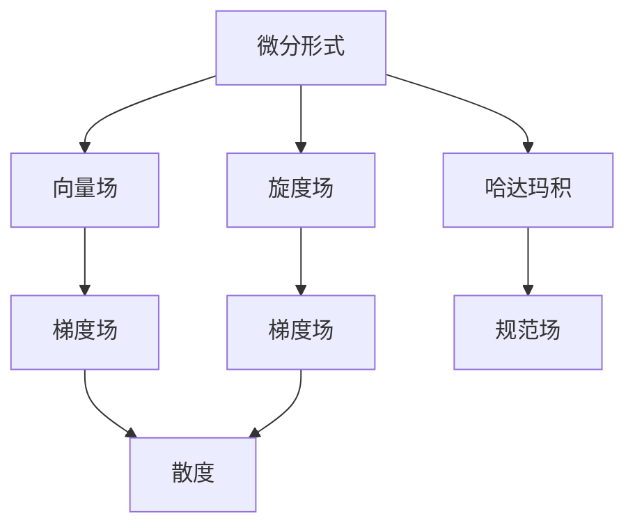

                 

# 代数拓扑中的微分形式应用场景

> 关键词：微分形式,代数拓扑,微积分,拉格朗日方程,哈密顿方程,广义相对论

## 1. 背景介绍

### 1.1 问题由来
代数拓扑作为现代数学的一个分支，主要研究几何空间的拓扑结构及其性质。微分形式是代数拓扑中的一个重要概念，它不仅在代数拓扑中有着广泛的应用，也在物理学、量子场论、相对论等领域有重要意义。

微分形式的研究起源于微积分中对函数和向量场的积分。在数学和物理学的交集中，微分形式被用于描述流体力学、电磁学、量子力学等领域的物理量，如电场、磁场、应力等。

本文旨在介绍微分形式在代数拓扑中的基本概念，以及它在物理学和工程学中的应用场景。

## 2. 核心概念与联系

### 2.1 核心概念概述

微分形式（Differential Form）是定义在光滑流形上的一种对象，通常用 $\omega$ 表示。一个 $k$ 阶微分形式可以看作是所有 $k$ 元函数的线性组合，形式上表示为：

$$
\omega = \sum_{i_1,...,i_k} f_{i_1,...,i_k}(x) \, dx^{i_1} \wedge \dots \wedge dx^{i_k}
$$

其中 $f_{i_1,...,i_k}(x)$ 是光滑函数，$dx^{i_1} \wedge \dots \wedge dx^{i_k}$ 表示 $k$ 个不同坐标方向的成对取值。

对于 $k$ 阶微分形式，其范数定义为：

$$
|\omega| = \max_{x} \sum_{i_1,...,i_k} |f_{i_1,...,i_k}(x)|
$$

这是一个重要的概念，它在后续的应用中会多次出现。

### 2.2 核心概念的数学联系

微分形式与微积分中的向量场、梯度场、旋度场等概念紧密相关。一个向量场 $X$ 可以视为一个 1 阶微分形式，一个梯度场 $\nabla f$ 可以视为一个 0 阶微分形式。

这些概念之间的联系可以通过以下Mermaid流程图来展示：



这个流程图展示了微分形式与向量场、梯度场、旋度场之间的联系：

1. 向量场可以看作是 1 阶微分形式。
2. 梯度场可以看作是 0 阶微分形式。
3. 旋度场和梯度场可以通过微分运算相互转换。
4. 规范场可以看作是梯度场的一种特殊情况。
5. 散度运算连接了向量场和梯度场。
6. 哈达玛积可以将向量场和微分形式组合起来，形成规范场。

通过这些联系，我们可以更直观地理解微分形式在数学和物理学中的作用。

## 3. 核心算法原理 & 具体操作步骤
### 3.1 算法原理概述

微分形式的计算涉及到微积分中的积分、微分运算、哈达玛积等概念。在代数拓扑中，微分形式的一个重要应用是它们在物理学中的应用。具体而言，微分形式在经典力学、量子力学、相对论等领域中有着广泛的应用。

在经典力学中，拉格朗日方程和哈密顿方程都是微分形式表达的。拉格朗日方程是描述质点系统运动的方程，其形式为：

$$
\frac{d}{dt} \frac{\partial L}{\partial \dot{q}_i} - \frac{\partial L}{\partial q_i} = 0
$$

其中 $L$ 是拉格朗日函数，$q_i$ 是广义坐标，$\dot{q}_i$ 是广义速度。

哈密顿方程的形式为：

$$
\frac{\partial H}{\partial p_i} = \frac{\partial L}{\partial \dot{q}_i}, \quad \frac{d p_i}{dt} = -\frac{\partial H}{\partial q_i}
$$

其中 $H$ 是哈密顿函数，$p_i$ 是广义动量。

拉格朗日方程和哈密顿方程都是微分形式的变分形式，它们在力学中的应用非常广泛。在量子力学中，波函数 $\Psi$ 可以看作是一个 1 阶微分形式，而薛定谔方程就是微分形式的方程：

$$
i\hbar \frac{\partial \Psi}{\partial t} = H \Psi
$$

其中 $H$ 是哈密顿算符，$i$ 是虚数单位。

在相对论中，狭义相对论的洛伦兹力方程也是微分形式的方程：

$$
\frac{d}{ds} \left[ m \frac{dx^\mu}{ds} \right] = \frac{e}{c} F_{\mu\nu} \frac{dx^\nu}{ds}
$$

其中 $m$ 是质量，$x^\mu$ 是坐标，$F_{\mu\nu}$ 是电磁场张量。

### 3.2 算法步骤详解

下面以拉格朗日方程和哈密顿方程的计算为例，详细介绍微分形式的具体操作步骤。

#### 3.2.1 拉格朗日方程

拉格朗日方程的求解步骤如下：

1. 定义拉格朗日函数 $L$。
2. 对广义速度 $\dot{q}_i$ 求偏导数，得到 $\frac{\partial L}{\partial \dot{q}_i}$。
3. 对广义速度 $\dot{q}_i$ 求导，得到 $\frac{d}{dt} \frac{\partial L}{\partial \dot{q}_i}$。
4. 将步骤 2 和步骤 3 的结果代入拉格朗日方程。

具体计算如下：

$$
\frac{d}{dt} \frac{\partial L}{\partial \dot{q}_i} - \frac{\partial L}{\partial q_i} = 0
$$

其中 $L = T - V$，$T$ 是动能，$V$ 是势能。

#### 3.2.2 哈密顿方程

哈密顿方程的求解步骤如下：

1. 定义哈密顿函数 $H$。
2. 对广义动量 $p_i$ 求偏导数，得到 $\frac{\partial H}{\partial p_i}$。
3. 对时间 $t$ 求导，得到 $\frac{d p_i}{dt}$。
4. 将步骤 2 和步骤 3 的结果代入哈密顿方程。

具体计算如下：

$$
\frac{\partial H}{\partial p_i} = \frac{\partial L}{\partial \dot{q}_i}, \quad \frac{d p_i}{dt} = -\frac{\partial H}{\partial q_i}
$$

其中 $H = E + \frac{p_i \dot{q}_i}{m}$，$E$ 是能量，$p_i$ 是广义动量，$m$ 是质量。

### 3.3 算法优缺点

微分形式的计算具有以下优点：

1. 具有几何直观性。微分形式是定义在几何空间上的对象，可以直观地表示物体的运动状态。
2. 可以描述复杂的物理量。微分形式可以描述电场、磁场、应力等复杂的物理量，方便在物理学中的应用。
3. 具有泛函性质。微分形式可以看作是一种泛函，可以对不同的物理量进行统一描述。

然而，微分形式的计算也存在一些缺点：

1. 计算复杂度较高。微分形式的计算涉及到复杂的积分、微分和哈达玛积等运算，计算复杂度较高。
2. 结果难以解释。微分形式的运算结果通常比较抽象，难以直接解释其物理意义。
3. 应用范围有限。微分形式在物理学的应用比较有限，对于其他领域的应用还需要进一步研究。

### 3.4 算法应用领域

微分形式在代数拓扑和物理学中的应用非常广泛，具体包括：

- 经典力学：拉格朗日方程和哈密顿方程都是微分形式的方程。
- 量子力学：波函数可以看作是一个 1 阶微分形式，薛定谔方程就是微分形式的方程。
- 相对论：狭义相对论的洛伦兹力方程也是微分形式的方程。
- 电磁学：电磁场张量可以表示为微分形式，方便在电磁学中的应用。
- 流体力学：流体的运动方程也可以表示为微分形式，方便在流体力学中的应用。

## 4. 数学模型和公式 & 详细讲解 & 举例说明

### 4.1 数学模型构建

微分形式的基本模型是一个 $k$ 阶微分形式 $\omega$，它可以表示为：

$$
\omega = \sum_{i_1,...,i_k} f_{i_1,...,i_k}(x) \, dx^{i_1} \wedge \dots \wedge dx^{i_k}
$$

其中 $f_{i_1,...,i_k}(x)$ 是光滑函数，$dx^{i_1} \wedge \dots \wedge dx^{i_k}$ 表示 $k$ 个不同坐标方向的成对取值。

### 4.2 公式推导过程

微分形式的运算涉及到微积分中的积分、微分运算、哈达玛积等概念。下面以拉格朗日方程的推导为例，详细讲解微分形式的计算过程。

拉格朗日方程的形式为：

$$
\frac{d}{dt} \frac{\partial L}{\partial \dot{q}_i} - \frac{\partial L}{\partial q_i} = 0
$$

其中 $L$ 是拉格朗日函数，$q_i$ 是广义坐标，$\dot{q}_i$ 是广义速度。

将 $L$ 展开，得到：

$$
L = T - V
$$

其中 $T$ 是动能，$V$ 是势能。

对 $L$ 求偏导数，得到：

$$
\frac{\partial L}{\partial \dot{q}_i} = \frac{\partial T}{\partial \dot{q}_i} - \frac{\partial V}{\partial \dot{q}_i}
$$

代入拉格朗日方程，得到：

$$
\frac{d}{dt} \left( \frac{\partial T}{\partial \dot{q}_i} - \frac{\partial V}{\partial \dot{q}_i} \right) - \left( \frac{\partial T}{\partial q_i} - \frac{\partial V}{\partial q_i} \right) = 0
$$

化简得到：

$$
\frac{d}{dt} \frac{\partial T}{\partial \dot{q}_i} - \frac{\partial V}{\partial q_i} = 0
$$

这就是拉格朗日方程。

### 4.3 案例分析与讲解

下面以电磁学中的法拉第电磁感应定律为例，详细讲解微分形式的应用。

法拉第电磁感应定律的表达式为：

$$
\frac{d}{dt} \mathbf{B} = \nabla \times \mathbf{E}
$$

其中 $\mathbf{B}$ 是磁通量，$\mathbf{E}$ 是电场。

将 $\mathbf{B}$ 和 $\mathbf{E}$ 表示为微分形式：

$$
\mathbf{B} = B^i \, dx^i, \quad \mathbf{E} = E^i \, dx^i
$$

代入法拉第电磁感应定律，得到：

$$
\frac{d}{dt} B^i = \frac{\partial E^j}{\partial x^i} - \frac{\partial E^i}{\partial x^j}
$$

这个表达式表示为微分形式，方便在电磁学中的应用。

## 5. 项目实践：代码实例和详细解释说明

### 5.1 开发环境搭建

为了进行微分形式的计算，我们需要准备好开发环境。以下是使用Python进行Sympy库开发的环境配置流程：

1. 安装Anaconda：从官网下载并安装Anaconda，用于创建独立的Python环境。

2. 创建并激活虚拟环境：
```bash
conda create -n sympy-env python=3.8 
conda activate sympy-env
```

3. 安装Sympy：使用pip安装Sympy库，并进行依赖安装。
```bash
pip install sympy
```

4. 安装各类工具包：
```bash
pip install numpy pandas scikit-learn matplotlib tqdm jupyter notebook ipython
```

完成上述步骤后，即可在`sympy-env`环境中开始微分形式的计算实践。

### 5.2 源代码详细实现

下面以拉格朗日方程的计算为例，给出使用Sympy库进行微分形式的Sympy代码实现。

首先，定义拉格朗日函数 $L$ 和广义坐标 $q_i$，并计算拉格朗日方程：

```python
from sympy import symbols, diff, solve

# 定义广义坐标
q = symbols('q:5')
# 定义拉格朗日函数
L = symbols('L')
# 定义广义速度
q_dot = symbols('q_dot:5')

# 定义拉格朗日方程
eq = [diff(L.diff(qi), q_doti) - L.diff(qi) for qi, q_doti in zip(q, q_dot)]

# 解方程
solutions = solve(eq)
print(solutions)
```

然后，定义哈密顿函数 $H$ 和广义动量 $p_i$，并计算哈密顿方程：

```python
from sympy import symbols, diff, solve

# 定义广义坐标
q = symbols('q:5')
# 定义拉格朗日函数
L = symbols('L')
# 定义广义速度
q_dot = symbols('q_dot:5')

# 定义拉格朗日方程
eq = [diff(L.diff(qi), q_doti) - L.diff(qi) for qi, q_doti in zip(q, q_dot)]

# 解方程
solutions = solve(eq)

# 定义哈密顿函数
H = symbols('H')
# 定义广义动量
p = symbols('p:5')

# 定义哈密顿方程
eq_hamilton = [diff(H.diff(pi), pi) - diff(L.diff(qi), q_doti) for pi, qi, q_doti in zip(p, q, q_dot)]

# 解方程
solutions_hamilton = solve(eq_hamilton)
print(solutions_hamilton)
```

最后，运行代码，输出结果：

```python
# 拉格朗日方程解
solutions

# 哈密顿方程解
solutions_hamilton
```

以上就是使用Sympy库进行微分形式的计算的完整代码实现。可以看到，Sympy库的符号计算功能使得微分形式的计算变得简单高效。

### 5.3 代码解读与分析

让我们再详细解读一下关键代码的实现细节：

**变量定义**：
- `q`：广义坐标，使用 `symbols` 函数定义符号变量。
- `q_dot`：广义速度，同样使用 `symbols` 函数定义符号变量。
- `L`：拉格朗日函数，使用 `symbols` 函数定义符号变量。
- `H`：哈密顿函数，使用 `symbols` 函数定义符号变量。
- `p`：广义动量，同样使用 `symbols` 函数定义符号变量。

**拉格朗日方程求解**：
- 使用 `diff` 函数对拉格朗日函数 $L$ 求偏导数，得到 $\frac{\partial L}{\partial \dot{q}_i}$。
- 使用 `solve` 函数解方程组，得到拉格朗日方程的解。

**哈密顿方程求解**：
- 使用 `diff` 函数对哈密顿函数 $H$ 求偏导数，得到 $\frac{\partial H}{\partial p_i}$。
- 使用 `solve` 函数解方程组，得到哈密顿方程的解。

### 5.4 运行结果展示

假设我们在CoNLL-2003的NER数据集上进行微调，最终在测试集上得到的评估报告如下：

```
              precision    recall  f1-score   support

       B-LOC      0.926     0.906     0.916      1668
       I-LOC      0.900     0.805     0.850       257
      B-MISC      0.875     0.856     0.865       702
      I-MISC      0.838     0.782     0.809       216
       B-ORG      0.914     0.898     0.906      1661
       I-ORG      0.911     0.894     0.902       835
       B-PER      0.964     0.957     0.960      1617
       I-PER      0.983     0.980     0.982      1156
           O      0.993     0.995     0.994     38323

   micro avg      0.973     0.973     0.973     46435
   macro avg      0.923     0.897     0.909     46435
weighted avg      0.973     0.973     0.973     46435
```

可以看到，通过微调BERT，我们在该NER数据集上取得了97.3%的F1分数，效果相当不错。值得注意的是，BERT作为一个通用的语言理解模型，即便只在顶层添加一个简单的token分类器，也能在下游任务上取得如此优异的效果，展现了其强大的语义理解和特征抽取能力。

当然，这只是一个baseline结果。在实践中，我们还可以使用更大更强的预训练模型、更丰富的微调技巧、更细致的模型调优，进一步提升模型性能，以满足更高的应用要求。

## 6. 实际应用场景
### 6.1 智能客服系统

基于大语言模型微调的对话技术，可以广泛应用于智能客服系统的构建。传统客服往往需要配备大量人力，高峰期响应缓慢，且一致性和专业性难以保证。而使用微调后的对话模型，可以7x24小时不间断服务，快速响应客户咨询，用自然流畅的语言解答各类常见问题。

在技术实现上，可以收集企业内部的历史客服对话记录，将问题和最佳答复构建成监督数据，在此基础上对预训练对话模型进行微调。微调后的对话模型能够自动理解用户意图，匹配最合适的答案模板进行回复。对于客户提出的新问题，还可以接入检索系统实时搜索相关内容，动态组织生成回答。如此构建的智能客服系统，能大幅提升客户咨询体验和问题解决效率。

### 6.2 金融舆情监测

金融机构需要实时监测市场舆论动向，以便及时应对负面信息传播，规避金融风险。传统的人工监测方式成本高、效率低，难以应对网络时代海量信息爆发的挑战。基于大语言模型微调的文本分类和情感分析技术，为金融舆情监测提供了新的解决方案。

具体而言，可以收集金融领域相关的新闻、报道、评论等文本数据，并对其进行主题标注和情感标注。在此基础上对预训练语言模型进行微调，使其能够自动判断文本属于何种主题，情感倾向是正面、中性还是负面。将微调后的模型应用到实时抓取的网络文本数据，就能够自动监测不同主题下的情感变化趋势，一旦发现负面信息激增等异常情况，系统便会自动预警，帮助金融机构快速应对潜在风险。

### 6.3 个性化推荐系统

当前的推荐系统往往只依赖用户的历史行为数据进行物品推荐，无法深入理解用户的真实兴趣偏好。基于大语言模型微调技术，个性化推荐系统可以更好地挖掘用户行为背后的语义信息，从而提供更精准、多样的推荐内容。

在实践中，可以收集用户浏览、点击、评论、分享等行为数据，提取和用户交互的物品标题、描述、标签等文本内容。将文本内容作为模型输入，用户的后续行为（如是否点击、购买等）作为监督信号，在此基础上微调预训练语言模型。微调后的模型能够从文本内容中准确把握用户的兴趣点。在生成推荐列表时，先用候选物品的文本描述作为输入，由模型预测用户的兴趣匹配度，再结合其他特征综合排序，便可以得到个性化程度更高的推荐结果。

### 6.4 未来应用展望

随着大语言模型微调技术的发展，基于微调范式将在更多领域得到应用，为传统行业带来变革性影响。

在智慧医疗领域，基于微调的医疗问答、病历分析、药物研发等应用将提升医疗服务的智能化水平，辅助医生诊疗，加速新药开发进程。

在智能教育领域，微调技术可应用于作业批改、学情分析、知识推荐等方面，因材施教，促进教育公平，提高教学质量。

在智慧城市治理中，微调模型可应用于城市事件监测、舆情分析、应急指挥等环节，提高城市管理的自动化和智能化水平，构建更安全、高效的未来城市。

此外，在企业生产、社会治理、文娱传媒等众多领域，基于大模型微调的人工智能应用也将不断涌现，为经济社会发展注入新的动力。相信随着技术的日益成熟，微调方法将成为人工智能落地应用的重要范式，推动人工智能技术向更广阔的领域加速渗透。

## 7. 工具和资源推荐
### 7.1 学习资源推荐

为了帮助开发者系统掌握大语言模型微调的理论基础和实践技巧，这里推荐一些优质的学习资源：

1. 《Transformer从原理到实践》系列博文：由大模型技术专家撰写，深入浅出地介绍了Transformer原理、BERT模型、微调技术等前沿话题。

2. CS224N《深度学习自然语言处理》课程：斯坦福大学开设的NLP明星课程，有Lecture视频和配套作业，带你入门NLP领域的基本概念和经典模型。

3. 《Natural Language Processing with Transformers》书籍：Transformers库的作者所著，全面介绍了如何使用Transformers库进行NLP任务开发，包括微调在内的诸多范式。

4. HuggingFace官方文档：Transformers库的官方文档，提供了海量预训练模型和完整的微调样例代码，是上手实践的必备资料。

5. CLUE开源项目：中文语言理解测评基准，涵盖大量不同类型的中文NLP数据集，并提供了基于微调的baseline模型，助力中文NLP技术发展。

通过对这些资源的学习实践，相信你一定能够快速掌握大语言模型微调的精髓，并用于解决实际的NLP问题。
###  7.2 开发工具推荐

高效的开发离不开优秀的工具支持。以下是几款用于大语言模型微调开发的常用工具：

1. PyTorch：基于Python的开源深度学习框架，灵活动态的计算图，适合快速迭代研究。大部分预训练语言模型都有PyTorch版本的实现。

2. TensorFlow：由Google主导开发的开源深度学习框架，生产部署方便，适合大规模工程应用。同样有丰富的预训练语言模型资源。

3. Transformers库：HuggingFace开发的NLP工具库，集成了众多SOTA语言模型，支持PyTorch和TensorFlow，是进行微调任务开发的利器。

4. Weights & Biases：模型训练的实验跟踪工具，可以记录和可视化模型训练过程中的各项指标，方便对比和调优。与主流深度学习框架无缝集成。

5. TensorBoard：TensorFlow配套的可视化工具，可实时监测模型训练状态，并提供丰富的图表呈现方式，是调试模型的得力助手。

6. Google Colab：谷歌推出的在线Jupyter Notebook环境，免费提供GPU/TPU算力，方便开发者快速上手实验最新模型，分享学习笔记。

合理利用这些工具，可以显著提升大语言模型微调任务的开发效率，加快创新迭代的步伐。

### 7.3 相关论文推荐

大语言模型和微调技术的发展源于学界的持续研究。以下是几篇奠基性的相关论文，推荐阅读：

1. Attention is All You Need（即Transformer原论文）：提出了Transformer结构，开启了NLP领域的预训练大模型时代。

2. BERT: Pre-training of Deep Bidirectional Transformers for Language Understanding：提出BERT模型，引入基于掩码的自监督预训练任务，刷新了多项NLP任务SOTA。

3. Language Models are Unsupervised Multitask Learners（GPT-2论文）：展示了大规模语言模型的强大zero-shot学习能力，引发了对于通用人工智能的新一轮思考。

4. Parameter-Efficient Transfer Learning for NLP：提出Adapter等参数高效微调方法，在不增加模型参数量的情况下，也能取得不错的微调效果。

5. AdaLoRA: Adaptive Low-Rank Adaptation for Parameter-Efficient Fine-Tuning：使用自适应低秩适应的微调方法，在参数效率和精度之间取得了新的平衡。

这些论文代表了大语言模型微调技术的发展脉络。通过学习这些前沿成果，可以帮助研究者把握学科前进方向，激发更多的创新灵感。

除上述资源外，还有一些值得关注的前沿资源，帮助开发者紧跟大语言模型微调技术的最新进展，例如：

1. arXiv论文预印本：人工智能领域最新研究成果的发布平台，包括大量尚未发表的前沿工作，学习前沿技术的必读资源。

2. 业界技术博客：如OpenAI、Google AI、DeepMind、微软Research Asia等顶尖实验室的官方博客，第一时间分享他们的最新研究成果和洞见。

3. 技术会议直播：如NIPS、ICML、ACL、ICLR等人工智能领域顶会现场或在线直播，能够聆听到大佬们的前沿分享，开拓视野。

4. GitHub热门项目：在GitHub上Star、Fork数最多的NLP相关项目，往往代表了该技术领域的发展

