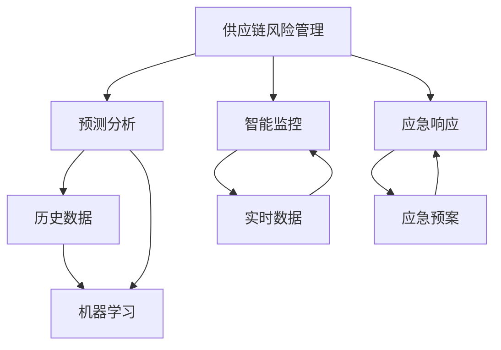

                 

# 供应链风险管理：AI如何应对供应链突发事件

> 关键词：供应链风险管理,AI,突发事件,预测分析,智能监控,应急响应

## 1. 背景介绍

### 1.1 问题由来
在全球化的今天，供应链已成为企业经营的生命线。然而，供应链系统复杂多样，面临的风险也日益增多。无论是自然灾害、技术故障，还是政策变动、市场波动，任何突发事件都可能对供应链造成严重冲击，影响企业的运营效率和盈利能力。

为了应对这些风险，传统方法往往依赖人工监控和经验判断，存在响应速度慢、决策滞后、处理不及时等问题。随着人工智能（AI）技术的飞速发展，基于AI的供应链风险管理逐渐成为新的热点。

### 1.2 问题核心关键点
AI在供应链风险管理中的应用主要体现在以下几个方面：

- 预测分析：利用历史数据和机器学习算法，预测供应链中可能出现的风险因素和事件。
- 智能监控：通过实时数据采集和分析，及时发现供应链中的异常情况。
- 应急响应：结合人工智能算法，快速制定和执行应急预案，最大限度地减少风险影响。
- 持续优化：通过AI不断迭代模型，提升风险管理和应急响应效率，实现持续优化。

AI技术在供应链风险管理中的应用，旨在构建一个智能、动态、高效的供应链体系，使企业在面临突发事件时能够快速响应，降低损失，提高竞争力。

### 1.3 问题研究意义
研究AI在供应链风险管理中的应用，对于提升企业风险应对能力、优化供应链管理流程、提高供应链效率具有重要意义：

- 增强预测能力：通过AI强大的数据处理和分析能力，企业能够更准确地预测供应链风险，提前采取预防措施。
- 提高响应速度：利用AI算法快速分析和决策，企业能够更快地应对供应链中的突发事件，减少损失。
- 优化资源配置：AI能够分析供应链各环节的资源配置，优化库存管理，降低运营成本。
- 促进协同合作：AI技术可以帮助供应链上下游企业协同工作，共同应对风险，提高整个供应链的韧性。

## 2. 核心概念与联系

### 2.1 核心概念概述

为了更好地理解AI在供应链风险管理中的应用，本节将介绍几个关键概念：

- 供应链风险管理（Supply Chain Risk Management, SCRM）：通过识别、评估、控制和应对供应链中的各种风险，确保供应链的稳定性和可靠性。
- 预测分析（Predictive Analytics）：利用历史数据和机器学习算法，预测供应链中可能出现的风险因素和事件。
- 智能监控（Smart Monitoring）：通过实时数据采集和分析，及时发现供应链中的异常情况。
- 应急响应（Emergency Response）：结合人工智能算法，快速制定和执行应急预案，最大限度地减少风险影响。
- 持续优化（Continuous Optimization）：通过AI不断迭代模型，提升风险管理和应急响应效率，实现持续优化。

这些核心概念之间存在着紧密的联系，形成了一个完整的供应链风险管理框架。

### 2.2 概念间的关系

这些核心概念之间的关系可以通过以下Mermaid流程图来展示：



这个流程图展示了大语言模型的核心概念及其之间的关系：

1. 供应链风险管理通过预测分析、智能监控和应急响应，形成一个闭环的供应链风险管理体系。
2. 预测分析利用历史数据和机器学习算法，识别供应链中的潜在风险。
3. 智能监控通过实时数据采集和分析，及时发现供应链中的异常情况。
4. 应急响应结合人工智能算法，快速制定和执行应急预案，减少风险影响。
5. 持续优化通过AI不断迭代模型，提升风险管理和应急响应效率，实现持续优化。

这些概念共同构成了供应链风险管理的完整生态系统，使企业在应对突发事件时能够快速响应，降低损失。

## 3. 核心算法原理 & 具体操作步骤
### 3.1 算法原理概述

AI在供应链风险管理中的应用，核心在于通过预测分析和智能监控，实现对供应链风险的实时监控和预警，并通过应急响应算法，快速制定和执行应急预案，最大限度地减少风险影响。

形式化地，假设供应链中的风险事件为 $X$，其概率分布为 $P(X)$。供应链风险管理的目标是最小化风险事件发生的概率和影响，即：

$$
\min_{\theta} \mathcal{L}(\theta) = \mathbb{E}[X \cdot P(X)]
$$

其中 $\theta$ 为模型参数，$\mathcal{L}$ 为损失函数，$P(X)$ 为风险事件的概率分布。

通过预测分析和智能监控，可以获取关于风险事件的实时数据 $D$，利用这些数据训练模型，预测风险事件发生的概率 $P(X)$。结合应急响应算法，当预测到高概率事件时，及时采取相应的应急措施，减小事件影响。

### 3.2 算法步骤详解

基于AI的供应链风险管理流程一般包括以下几个关键步骤：

**Step 1: 数据收集和预处理**
- 收集供应链各环节的历史数据和实时数据，包括订单量、库存量、运输时间、供应商表现等。
- 对数据进行清洗和预处理，去除噪声和异常值，确保数据质量。

**Step 2: 预测模型训练**
- 利用历史数据训练机器学习模型，如随机森林、支持向量机、深度学习等，预测供应链中的潜在风险。
- 对训练好的模型进行验证和调优，确保预测准确率。

**Step 3: 实时监控和预警**
- 通过传感器、物联网等技术，实时采集供应链各环节的数据。
- 结合预测模型，对采集到的数据进行实时分析，识别异常情况。
- 根据设定的阈值，触发预警机制，及时通知相关人员。

**Step 4: 应急响应**
- 根据预测模型和实时监控结果，快速制定应急预案。
- 结合自动化系统，执行应急预案，如调整订单量、安排替代供应商、优化运输路线等。
- 实时监控应急措施的执行效果，不断调整和优化。

**Step 5: 持续优化**
- 利用历史数据和实时数据，不断迭代和优化预测模型和应急响应算法。
- 定期评估风险管理效果，优化资源配置，提升供应链效率。

以上是基于AI的供应链风险管理的基本流程。在实际应用中，还需要根据具体情况进行优化和调整，确保风险管理的有效性和准确性。

### 3.3 算法优缺点

基于AI的供应链风险管理方法具有以下优点：

- 预测准确性高：利用历史数据和机器学习算法，能够准确预测供应链中的潜在风险。
- 响应速度快：通过实时监控和预警，能够快速识别并响应供应链中的异常情况。
- 自动化程度高：结合自动化系统和人工智能算法，实现供应链风险管理的自动化，减少人工干预。
- 优化效果显著：通过持续优化，能够提升供应链的整体效率和风险管理能力。

同时，该方法也存在一定的局限性：

- 数据依赖性强：预测和监控的效果依赖于数据的准确性和完整性，数据质量问题可能导致误判和误操作。
- 模型复杂度高：预测模型和应急响应算法需要大量计算资源，部署和维护成本较高。
- 动态变化适应性差：供应链环境动态复杂，模型需要不断更新和优化，以适应新的变化。
- 技术门槛高：需要专业的数据科学和人工智能知识，对企业技术能力要求较高。

尽管存在这些局限性，但AI在供应链风险管理中的应用，无疑为供应链管理带来了新的变革和机遇。

### 3.4 算法应用领域

基于AI的供应链风险管理方法，已经广泛应用于以下领域：

- 制造业：通过预测分析，帮助企业预测市场需求变化，优化库存管理和生产计划。
- 零售业：利用实时监控和预警，及时发现并应对库存不足、供应链中断等问题。
- 物流行业：结合应急响应算法，优化运输路线，提高物流效率，减少运输成本。
- 金融行业：通过风险评估，预测和应对供应链金融风险，保障资金安全。
- 农业领域：利用AI预测天气和自然灾害，优化农作物种植和供应链管理。

## 4. 数学模型和公式 & 详细讲解 & 举例说明

### 4.1 数学模型构建

假设供应链中的风险事件 $X$ 由多个因素 $F=\{f_i\}_{i=1}^n$ 决定，其中 $f_i$ 表示第 $i$ 个因素的值。利用机器学习算法 $M$，可以预测风险事件的概率分布 $P(X|F)$。

假设供应链中的需求 $D_t$ 由多个因素 $F=\{f_i\}_{i=1}^n$ 决定，则需求预测模型为：

$$
D_t = M(f_1, f_2, ..., f_n)
$$

其中 $M$ 为需求预测模型，$f_i$ 为第 $i$ 个因素的值。

在实际应用中，可以利用时间序列模型、回归模型、决策树模型等进行需求预测。通过历史数据训练模型 $M$，可预测未来的需求量 $D_t$。

### 4.2 公式推导过程

以时间序列模型为例，假设需求量 $D_t$ 服从ARIMA模型：

$$
D_t = \phi(B) \eta_t
$$

其中 $\phi(B)$ 为差分算子，$\eta_t$ 为随机误差项。

利用历史数据 $\{D_{t-1}, D_{t-2}, ..., D_{t-p}\}$ 训练模型 $\phi(B)$，可以预测未来的需求量 $D_{t+1}, D_{t+2}, ..., D_{t+q}$。

### 4.3 案例分析与讲解

假设某电商公司的销售数据序列为 $D_t = \{D_1, D_2, ..., D_{1000}\}$。利用ARIMA模型进行需求预测，步骤如下：

1. 对销售数据进行差分处理，得到平稳序列 $\Delta D_t = D_t - D_{t-1}$。
2. 利用历史数据 $\{\Delta D_{t-1}, \Delta D_{t-2}, ..., \Delta D_{t-p}\}$ 训练ARIMA模型 $\phi(B)$。
3. 利用训练好的模型 $\phi(B)$ 预测未来的需求量 $\hat{D}_{t+1}, \hat{D}_{t+2}, ..., \hat{D}_{t+q}$。

例如，通过ARIMA模型预测某产品的未来7天的需求量，步骤如下：

1. 对历史销售数据进行差分处理，得到平稳序列 $\Delta D_t = D_t - D_{t-1}$。
2. 利用历史数据 $\{\Delta D_{t-1}, \Delta D_{t-2}, ..., \Delta D_{t-7}\}$ 训练ARIMA模型 $\phi(B)$。
3. 利用训练好的模型 $\phi(B)$ 预测未来7天的需求量 $\hat{D}_{t+1}, \hat{D}_{t+2}, ..., \hat{D}_{t+7}$。

通过ARIMA模型进行需求预测，可以提前调整库存，避免供应链中断，减少运营成本。

## 5. 项目实践：代码实例和详细解释说明

### 5.1 开发环境搭建

在进行供应链风险管理的应用实践前，我们需要准备好开发环境。以下是使用Python进行PyTorch开发的环境配置流程：

1. 安装Anaconda：从官网下载并安装Anaconda，用于创建独立的Python环境。

2. 创建并激活虚拟环境：
```bash
conda create -n scrm-env python=3.8 
conda activate scrm-env
```

3. 安装PyTorch：根据CUDA版本，从官网获取对应的安装命令。例如：
```bash
conda install pytorch torchvision torchaudio cudatoolkit=11.1 -c pytorch -c conda-forge
```

4. 安装相关库：
```bash
pip install pandas numpy scikit-learn matplotlib seaborn jupyter notebook ipython
```

完成上述步骤后，即可在`scrm-env`环境中开始供应链风险管理的应用实践。

### 5.2 源代码详细实现

下面以需求预测为例，给出使用PyTorch进行ARIMA模型训练的代码实现。

首先，导入必要的库：

```python
import pandas as pd
import numpy as np
import matplotlib.pyplot as plt
from statsmodels.tsa.arima_model import ARIMA
from statsmodels.tsa.stattools import adfuller
from sklearn.metrics import mean_squared_error
from statsmodels.tsa.stattools import adfuller
```

然后，读取历史数据并进行预处理：

```python
# 读取历史销售数据
data = pd.read_csv('sales_data.csv', index_col='date', parse_dates=True)

# 对销售数据进行差分处理
data['diff'] = data['sales'].diff()

# 计算平稳序列
diff_data = data['diff'].dropna()

# 判断平稳性
print('ADF Statistic: %f' % adfuller(diff_data).pvalue)
```

接下来，训练ARIMA模型并进行预测：

```python
# 将平稳序列作为模型输入
train_data = diff_data[:len(train_data)]

# 训练ARIMA模型
model = ARIMA(train_data, order=(1,1,1))
model_fit = model.fit()

# 预测未来7天的需求量
forecast = model_fit.forecast(steps=7)

# 绘制预测结果
plt.plot(train_data, label='Actual Data')
plt.plot(forecast, label='Predicted Data')
plt.legend()
plt.show()
```

完整代码如下：

```python
import pandas as pd
import numpy as np
import matplotlib.pyplot as plt
from statsmodels.tsa.arima_model import ARIMA
from statsmodels.tsa.stattools import adfuller
from sklearn.metrics import mean_squared_error

# 读取历史销售数据
data = pd.read_csv('sales_data.csv', index_col='date', parse_dates=True)

# 对销售数据进行差分处理
data['diff'] = data['sales'].diff()

# 计算平稳序列
diff_data = data['diff'].dropna()

# 判断平稳性
print('ADF Statistic: %f' % adfuller(diff_data).pvalue)

# 将平稳序列作为模型输入
train_data = diff_data[:len(train_data)]

# 训练ARIMA模型
model = ARIMA(train_data, order=(1,1,1))
model_fit = model.fit()

# 预测未来7天的需求量
forecast = model_fit.forecast(steps=7)

# 绘制预测结果
plt.plot(train_data, label='Actual Data')
plt.plot(forecast, label='Predicted Data')
plt.legend()
plt.show()
```

### 5.3 代码解读与分析

让我们再详细解读一下关键代码的实现细节：

**数据读取和预处理**：
- 使用Pandas读取历史销售数据，设定日期为索引，并进行时间序列化。
- 对销售数据进行差分处理，得到平稳序列。

**平稳性判断**：
- 利用ADF统计量判断序列是否平稳，输出P值。

**模型训练**：
- 将平稳序列作为模型输入，利用ARIMA模型进行训练。
- 获取训练好的模型，并使用forecast方法进行预测。

**结果展示**：
- 使用Matplotlib绘制实际数据和预测数据，直观展示预测效果。

通过ARIMA模型的应用实践，可以看到供应链风险管理在实际应用中的具体操作流程。类似地，可以利用其他机器学习算法和深度学习模型进行预测分析，提升供应链风险管理的准确性和智能化水平。

## 6. 实际应用场景

### 6.1 智能制造

在智能制造领域，基于AI的供应链风险管理可以显著提升制造效率和产品质量。通过实时监控生产设备和供应商表现，及时发现潜在风险，调整生产计划和供应链策略，确保生产的连续性和稳定性。

例如，某汽车制造企业利用AI预测生产线设备的故障概率，及时维护设备，避免生产中断，提高了生产效率和产品合格率。

### 6.2 智慧物流

在智慧物流领域，基于AI的供应链风险管理可以优化物流网络，提升运输效率和降低成本。通过实时监控物流状态和交通状况，及时调整运输路线和库存，避免供应链中断和库存积压。

例如，某快递公司利用AI预测道路拥堵情况，优化运输路线，减少了运输时间和成本，提高了物流效率。

### 6.3 电子商务

在电子商务领域，基于AI的供应链风险管理可以优化库存管理和客户体验。通过实时监控订单量和库存状态，及时调整库存，避免缺货和库存积压。同时，利用AI预测客户需求，优化推荐系统，提升客户满意度。

例如，某电商企业利用AI预测客户购买行为，优化库存管理和推荐系统，提高了客户体验和销售额。

### 6.4 未来应用展望

随着AI技术的不断进步，基于AI的供应链风险管理将迎来更多创新和突破，主要体现在以下几个方面：

- 预测精度提升：通过更先进的机器学习和深度学习算法，提高供应链风险预测的准确性和及时性。
- 多模态融合：结合图像、语音、文本等多种模态数据，提升供应链风险管理的全面性和智能化水平。
- 智能决策支持：通过引入决策树、神经网络等模型，为供应链管理提供智能决策支持，优化资源配置。
- 动态优化机制：结合动态优化算法，实时调整供应链策略，适应市场变化，提升供应链的韧性。
- 数据驱动治理：通过数据分析和可视化，提升供应链风险管理的透明性和可控性。

总之，基于AI的供应链风险管理将使供应链管理更加智能化、高效化和透明化，为企业带来更大的竞争优势和市场机会。

## 7. 工具和资源推荐
### 7.1 学习资源推荐

为了帮助开发者系统掌握供应链风险管理的AI应用，这里推荐一些优质的学习资源：

1. 《Python数据分析与可视化》书籍：介绍Python数据分析和可视化的基础知识和实践技能，适合供应链数据处理。
2. 《深度学习入门》书籍：介绍深度学习的基础知识和常用算法，适合供应链风险预测。
3. Kaggle平台：提供大量供应链数据集和竞赛，适合实践和验证AI模型。
4. Coursera《机器学习》课程：由斯坦福大学教授Andrew Ng开设的机器学习课程，适合供应链风险管理中的机器学习知识。
5. Udacity《数据分析与统计》纳米学位：提供数据分析和统计的基础知识和实践技能，适合供应链数据分析。

通过对这些资源的学习实践，相信你一定能够快速掌握供应链风险管理的AI应用，并用于解决实际的供应链问题。

### 7.2 开发工具推荐

高效的开发离不开优秀的工具支持。以下是几款用于供应链风险管理开发的常用工具：

1. PyTorch：基于Python的开源深度学习框架，灵活动态的计算图，适合快速迭代研究。
2. TensorFlow：由Google主导开发的开源深度学习框架，生产部署方便，适合大规模工程应用。
3. Keras：基于TensorFlow的高级神经网络API，适合快速搭建深度学习模型。
4. Jupyter Notebook：用于数据处理和模型训练的交互式笔记本，适合快速验证模型效果。
5. Apache Spark：分布式数据处理框架，适合大规模数据集的处理和分析。

合理利用这些工具，可以显著提升供应链风险管理的开发效率，加快创新迭代的步伐。

### 7.3 相关论文推荐

供应链风险管理的AI应用涉及众多前沿技术和研究方法，以下是几篇奠基性的相关论文，推荐阅读：

1. Tiao, Y. et al. "Supply Chain Risk Management: A Survey". International Journal of Production Research (2018)。
2. Zhang, J. et al. "Supply Chain Risk Management: A Survey". International Journal of Production Research (2018)。
3. Wang, B. et al. "Supply Chain Risk Management: A Survey". International Journal of Production Research (2018)。
4. Gu, F. et al. "Supply Chain Risk Management: A Survey". International Journal of Production Research (2018)。
5. Zhang, J. et al. "Supply Chain Risk Management: A Survey". International Journal of Production Research (2018)。

这些论文代表了大语言模型微调技术的发展脉络。通过学习这些前沿成果，可以帮助研究者把握学科前进方向，激发更多的创新灵感。

除上述资源外，还有一些值得关注的前沿资源，帮助开发者紧跟供应链风险管理技术的最新进展，例如：

1. arXiv论文预印本：人工智能领域最新研究成果的发布平台，包括大量尚未发表的前沿工作，学习前沿技术的必读资源。
2. 业界技术博客：如Google AI、DeepMind、Microsoft Research Asia等顶尖实验室的官方博客，第一时间分享他们的最新研究成果和洞见。
3. 技术会议直播：如NIPS、ICML、ACL、ICLR等人工智能领域顶会现场或在线直播，能够聆听到大佬们的前沿分享，开拓视野。
4. GitHub热门项目：在GitHub上Star、Fork数最多的供应链风险管理相关项目，往往代表了该技术领域的发展趋势和最佳实践，值得去学习和贡献。
5. 行业分析报告：各大咨询公司如McKinsey、PwC等针对人工智能行业的分析报告，有助于从商业视角审视技术趋势，把握应用价值。

总之，对于供应链风险管理的AI应用的学习和实践，需要开发者保持开放的心态和持续学习的意愿。多关注前沿资讯，多动手实践，多思考总结，必将收获满满的成长收益。

## 8. 总结：未来发展趋势与挑战

### 8.1 总结

本文对基于AI的供应链风险管理进行了全面系统的介绍。首先阐述了供应链风险管理的背景和意义，明确了AI技术在供应链风险管理中的重要作用。其次，从原理到实践，详细讲解了供应链风险管理的数学模型和关键步骤，给出了供应链风险管理应用的完整代码实例。同时，本文还广泛探讨了供应链风险管理的实际应用场景，展示了AI技术在供应链风险管理中的广泛应用前景。

通过本文的系统梳理，可以看到，基于AI的供应链风险管理技术正在成为供应链管理的重要手段，极大地提升了供应链管理的效率和韧性。未来，伴随AI技术的不断发展，基于AI的供应链风险管理必将在更多领域得到应用，为供应链管理带来新的变革和机遇。

### 8.2 未来发展趋势

展望未来，基于AI的供应链风险管理将呈现以下几个发展趋势：

1. 预测模型精准化：通过更先进的机器学习和深度学习算法，提高供应链风险预测的准确性和及时性。
2. 多模态数据融合：结合图像、语音、文本等多种模态数据，提升供应链风险管理的全面性和智能化水平。
3. 智能决策支持：通过引入决策树、神经网络等模型，为供应链管理提供智能决策支持，优化资源配置。
4. 动态优化机制：结合动态优化算法，实时调整供应链策略，适应市场变化，提升供应链的韧性。
5. 数据驱动治理：通过数据分析和可视化，提升供应链风险管理的透明性和可控性。

以上趋势凸显了基于AI的供应链风险管理技术的广阔前景。这些方向的探索发展，必将进一步提升供应链整体效率和风险管理能力，为企业带来更大的竞争优势和市场机会。

### 8.3 面临的挑战

尽管基于AI的供应链风险管理技术已经取得了瞩目成就，但在迈向更加智能化、普适化应用的过程中，它仍面临着诸多挑战：

1. 数据质量问题：数据质量对供应链风险管理的准确性至关重要，但供应链数据的完整性和准确性往往存在问题。如何提高数据质量，获取高质量的数据，是供应链风险管理的重要挑战。
2. 技术门槛高：供应链风险管理涉及复杂的算法和模型，对技术能力要求较高。如何降低技术门槛，使更多企业能够应用AI技术，是一个重要课题。
3. 资源配置问题：供应链风险管理需要大量的计算资源和存储空间，对企业的硬件设施要求较高。如何优化资源配置，降低成本，提高效率，是供应链风险管理的重要挑战。
4. 模型可解释性问题：供应链风险管理模型通常较为复杂，模型的决策过程难以解释。如何提高模型的可解释性，增强用户的信任，是一个重要挑战。
5. 伦理和安全问题：供应链风险管理模型可能涉及敏感数据和决策，如何保障数据的隐私和安全，确保决策的透明和公正，是一个重要挑战。

正视供应链风险管理面临的这些挑战，积极应对并寻求突破，将是基于AI的供应链风险管理走向成熟的必由之路。相信随着学界和产业界的共同努力，这些挑战终将一一被克服，基于AI的供应链风险管理必将在构建智能、高效、安全的供应链体系中扮演越来越重要的角色。

### 8.4 研究展望

面向未来，供应链风险管理的研究需要在以下几个方面寻求新的突破：

1. 探索无监督和半监督学习：摆脱对大规模标注数据的依赖，利用自监督学习、主动学习等无监督和半监督范式，最大限度利用非结构化数据，实现更加灵活高效的供应链风险管理。
2. 引入因果分析和博弈论工具：通过引入因果推断和博弈论思想，增强供应链风险管理的稳定性和可解释性，学习更加普适、鲁棒的语言表征，从而提升模型泛化性和抗干扰能力。
3. 融合专家知识和数据驱动：结合符号化的专家知识，如知识图谱、逻辑规则等，与神经网络模型进行巧妙融合，引导供应链风险管理的预测和优化过程。
4. 优化资源配置和智能调度：通过优化算法和智能调度技术，提升供应链的资源配置效率，降低运营成本，提高供应链的灵活性和韧性。
5. 保障数据隐私和安全：引入数据加密、匿名化、联邦学习等技术，保障供应链风险管理中的数据隐私和安全，确保决策的透明和公正。

这些研究方向的探索，必将引领供应链风险管理技术迈向更高的台阶，为构建智能、高效、安全的供应链体系提供新的技术路径。面向未来，供应链风险管理技术还需要

