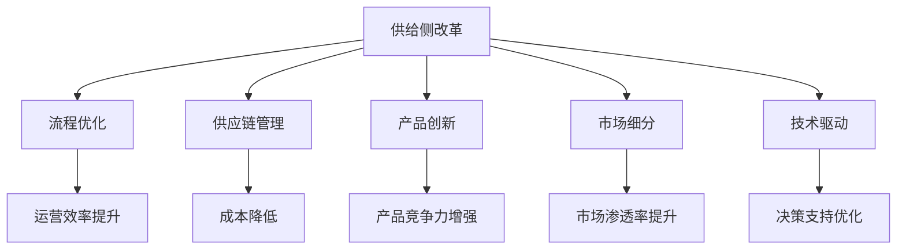
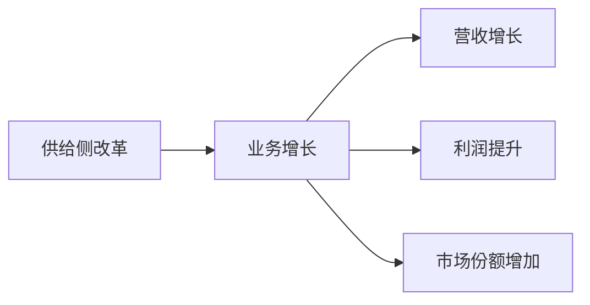
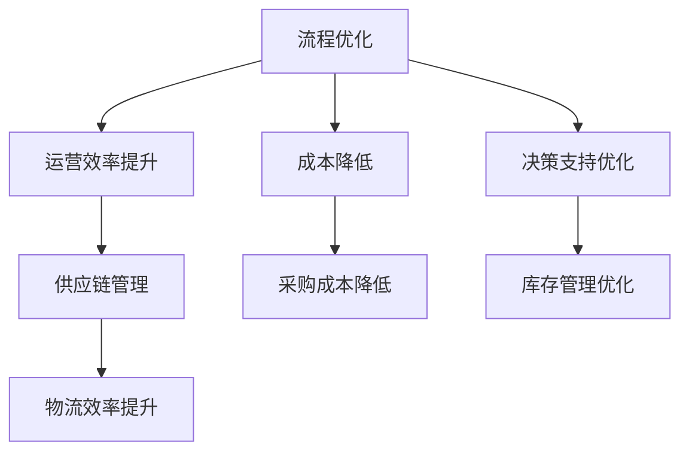
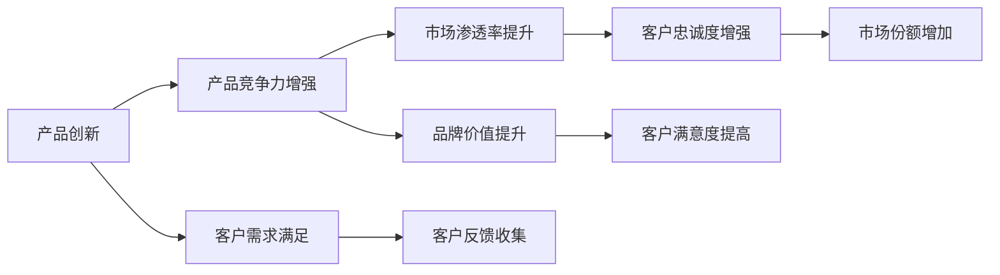
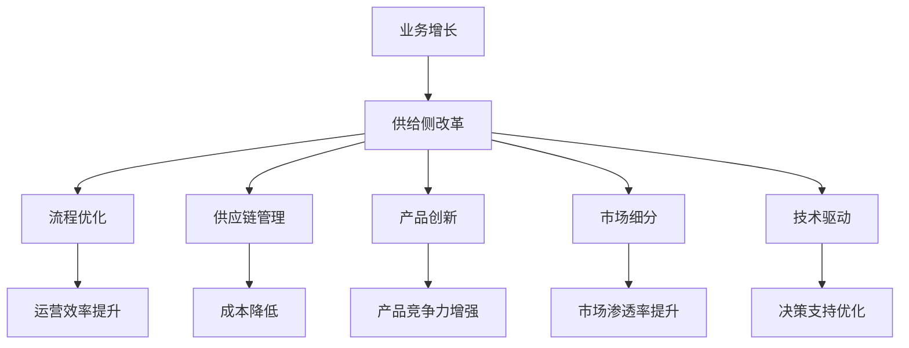

                 

# 供给与业务增长的策略分析

> 关键词：供给侧改革, 业务增长, 数据驱动, 运营优化, 智能分析

## 1. 背景介绍

在现代商业环境中，如何有效地提升业务增长，是企业面临的共同挑战。传统的线性增长模型已无法满足当前复杂多变市场环境的需求，企业需要寻求新的增长策略。本文将从供给侧改革的角度，探讨通过优化业务流程、改进供应链管理、创新产品和服务，实现业务增长的有效策略。

### 1.1 问题由来

过去几十年间，企业更多依赖于市场需求的增长来实现业务扩张。然而，随着全球经济一体化程度的加深、市场竞争的加剧以及技术创新的加速，原有的线性增长模型已经不再适用。特别是在资源、环境、人口等压力下，单纯追求销量增长的发展模式，已无法适应企业可持续发展的需要。因此，企业需要从供给侧入手，优化内部流程、提升供应链效率、创新产品和服务，从而实现业务的稳定增长。

### 1.2 问题核心关键点

企业供给侧改革的核心在于：

- **流程优化**：通过流程再造和精益管理，提升业务运营效率。
- **供应链管理**：优化采购、生产、物流等环节，降低成本、提升质量。
- **产品创新**：不断推出具有市场竞争力的新产品，满足消费者需求。
- **市场细分**：根据不同市场特性，制定差异化营销策略。
- **技术驱动**：利用大数据、人工智能等技术，实现智能分析和决策支持。

### 1.3 问题研究意义

供给侧改革能够帮助企业实现高质量发展，避免过度依赖市场需求的波动，提升企业在复杂环境下的竞争力。同时，通过提升产品和服务的质量，增强企业的市场口碑和品牌价值，从而实现长期稳定的增长。

## 2. 核心概念与联系

### 2.1 核心概念概述

为更好地理解供给侧改革和业务增长的策略，本节将介绍几个密切相关的核心概念：

- **供给侧改革(Supply-side Reform)**：指通过优化供给结构，提升产品质量和效率，从而满足市场需求，实现经济增长。
- **业务增长(Business Growth)**：指企业通过增加销售、提升市场份额、优化成本结构等手段，实现营收和利润的增长。
- **流程优化(Process Optimization)**：指通过流程再造、精益管理等手段，提升业务运营效率。
- **供应链管理(Supply Chain Management)**：指优化采购、生产、物流等环节，提高供应链的效率和可靠性。
- **产品创新(Product Innovation)**：指不断推出具有市场竞争力的新产品，满足消费者需求。
- **市场细分(Market Segmentation)**：指根据不同市场特性，制定差异化营销策略，提升市场渗透率。
- **技术驱动(Technology-Driven)**：指利用大数据、人工智能等技术，实现智能分析和决策支持，提升业务决策的科学性。

这些概念之间的逻辑关系可以通过以下Mermaid流程图来展示：



这个流程图展示了几大核心概念之间的关系：

1. 供给侧改革涉及优化流程、管理供应链、创新产品、细分市场和技术驱动等多个环节。
2. 流程优化、供应链管理、产品创新、市场细分和技术驱动共同支持供给侧改革。
3. 优化运营效率、降低成本、增强产品竞争力、提升市场渗透率、优化决策支持，都是实现业务增长的重要手段。

### 2.2 概念间的关系

这些核心概念之间存在着紧密的联系，形成了供给侧改革和业务增长的完整生态系统。下面我们通过几个Mermaid流程图来展示这些概念之间的关系。

#### 2.2.1 供给侧改革与业务增长



这个流程图展示了供给侧改革和业务增长之间的直接关系：

1. 供给侧改革通过优化流程、管理供应链、创新产品和市场细分，提升企业运营效率和市场竞争力。
2. 业务增长是供给侧改革的直接结果，通过优化运营效率、降低成本、增强产品竞争力、提升市场渗透率、优化决策支持，实现营收和利润的增长。

#### 2.2.2 流程优化与供应链管理



这个流程图展示了流程优化与供应链管理之间的关系：

1. 流程优化通过精益管理、流程再造等手段，提升运营效率。
2. 运营效率提升、成本降低、决策支持优化，共同支撑供应链管理。
3. 供应链管理涉及采购、生产、物流等环节，通过优化采购成本、库存管理和物流效率，实现供应链的整体优化。

#### 2.2.3 产品创新与市场细分



这个流程图展示了产品创新与市场细分之间的关系：

1. 产品创新通过不断推出新产品，增强市场竞争力。
2. 产品竞争力增强、市场渗透率提升，共同支持市场细分。
3. 市场细分通过识别不同市场特性，制定差异化营销策略，提升客户满意度，增强客户忠诚度。

### 2.3 核心概念的整体架构

最后，我们用一个综合的流程图来展示这些核心概念在大语言模型微调过程中的整体架构：



这个综合流程图展示了从供给侧改革到业务增长的完整过程：

1. 供给侧改革通过优化流程、管理供应链、创新产品、细分市场和技术驱动等多个环节，提升企业运营效率和市场竞争力。
2. 流程优化、供应链管理、产品创新、市场细分和技术驱动共同支持供给侧改革。
3. 优化运营效率、降低成本、增强产品竞争力、提升市场渗透率、优化决策支持，都是实现业务增长的重要手段。

## 3. 核心算法原理 & 具体操作步骤

### 3.1 算法原理概述

供给侧改革和业务增长的策略，本质上是一个通过优化内部流程和供应链管理，提升产品竞争力和市场渗透率，从而实现业务增长的过程。其核心思想是：通过精细化的运营管理，不断提升企业运营效率和市场竞争力，实现业务的稳定增长。

形式化地，假设企业的运营过程为 $O=\{P_i\}_{i=1}^n$，其中 $P_i$ 表示第 $i$ 个运营环节。优化目标为最小化运营过程的平均成本 $C$，即：

$$
\min_{O} \sum_{i=1}^n C_i
$$

其中 $C_i$ 为第 $i$ 个运营环节的成本。通过优化运营过程，实现业务的可持续增长。

### 3.2 算法步骤详解

供给侧改革和业务增长的策略实现过程包括以下几个关键步骤：

**Step 1: 流程分析与优化**

- 收集和分析企业内部流程数据，识别瓶颈环节和低效环节。
- 利用流程建模工具，建立流程模型，识别关键流程路径和风险点。
- 设计优化方案，如流程再造、标准化管理等，提升运营效率。

**Step 2: 供应链优化**

- 收集和分析供应链各环节的数据，识别低效环节和瓶颈环节。
- 设计供应链优化方案，如优化采购策略、降低库存成本等。
- 应用供应链管理软件，实现供应链的数字化和智能化管理。

**Step 3: 产品创新**

- 收集和分析市场数据，识别客户需求和市场趋势。
- 利用创新管理工具，设计产品创新方案，如新产品设计、功能改进等。
- 进行产品试点和测试，验证产品市场潜力，优化产品功能。

**Step 4: 市场细分与差异化营销**

- 收集和分析市场数据，识别不同市场的特性和需求。
- 设计市场细分方案，如按地理区域、客户群体等进行细分。
- 制定差异化营销策略，如定制化产品、精准营销等，提升市场渗透率。

**Step 5: 技术驱动与决策支持**

- 收集和分析大数据，如市场数据、客户反馈等。
- 利用人工智能技术，如预测分析、自然语言处理等，进行智能分析和决策支持。
- 建立数据驱动的决策体系，提升业务决策的科学性和精确性。

### 3.3 算法优缺点

供给侧改革和业务增长的策略具有以下优点：

- **灵活性高**：可以针对企业的具体情况，灵活设计和实施优化方案。
- **成本效益高**：优化运营效率、降低成本，提升市场竞争力，实现业务的可持续增长。
- **市场渗透率提升**：通过差异化营销和创新产品，满足客户需求，提升市场渗透率。

同时，也存在一些缺点：

- **复杂度高**：需要大量数据分析和优化设计，实施周期较长。
- **资源投入大**：需要投入人力、物力和财力，进行流程优化、供应链管理和产品创新。
- **风险较大**：决策失误可能导致资源浪费，影响企业发展。

### 3.4 算法应用领域

供给侧改革和业务增长的策略广泛应用于多个领域，如制造业、零售业、服务业、金融业等，具体应用场景包括：

- 制造业流程优化：如精益生产、质量管理、供应链协同等。
- 零售业供应链管理：如采购优化、库存管理、物流优化等。
- 服务业流程改进：如客户服务流程再造、内部流程优化等。
- 金融业风险管理：如信用评估、风险控制、交易监控等。

这些应用场景展示了供给侧改革和业务增长策略的广泛适用性和实用价值。

## 4. 数学模型和公式 & 详细讲解 & 举例说明

### 4.1 数学模型构建

供给侧改革和业务增长的策略，可以通过数学模型进行建模和优化。假设企业的运营过程为 $O=\{P_i\}_{i=1}^n$，成本函数为 $C_i=f_i(P_i)$，则优化目标为：

$$
\min_{O} \sum_{i=1}^n f_i(P_i)
$$

其中 $P_i$ 表示第 $i$ 个运营环节的投入，$f_i$ 表示成本函数。

### 4.2 公式推导过程

假设运营过程 $O$ 由两个环节 $P_1$ 和 $P_2$ 组成，成本函数分别为 $f_1$ 和 $f_2$，则优化问题可以表示为：

$$
\min_{P_1, P_2} f_1(P_1) + f_2(P_2)
$$

通过求解该优化问题，可以找到使总成本最小的最优解 $P_1^*, P_2^*$。

以供应链管理为例，假设企业的采购成本为 $C_{\text{采购}}=f_{\text{采购}}(Q)$，库存成本为 $C_{\text{库存}}=f_{\text{库存}}(S)$，则优化目标为：

$$
\min_{Q, S} f_{\text{采购}}(Q) + f_{\text{库存}}(S)
$$

其中 $Q$ 表示采购量，$S$ 表示库存量。

### 4.3 案例分析与讲解

以零售业的供应链优化为例，假设企业的采购成本为 $C_{\text{采购}}=f_{\text{采购}}(Q)=\frac{Q^2}{2}+10Q+100$，库存成本为 $C_{\text{库存}}=f_{\text{库存}}(S)=\frac{S^2}{2}+20S+200$，则优化问题为：

$$
\min_{Q, S} \frac{Q^2}{2}+10Q+100 + \frac{S^2}{2}+20S+200
$$

通过求解该优化问题，可以找到使总成本最小的最优解 $Q^*, S^*$。假设初始采购量为 $Q_0=100$，初始库存量为 $S_0=200$，通过求解该优化问题，可以找到最优采购量 $Q^*=50$，最优库存量 $S^*=50$，从而实现供应链的最优化管理。

## 5. 项目实践：代码实例和详细解释说明

### 5.1 开发环境搭建

在进行供给侧改革和业务增长的策略实践前，我们需要准备好开发环境。以下是使用Python进行Pandas、NumPy、SciPy等工具包开发的环境配置流程：

1. 安装Anaconda：从官网下载并安装Anaconda，用于创建独立的Python环境。

2. 创建并激活虚拟环境：
```bash
conda create -n supply-env python=3.8 
conda activate supply-env
```

3. 安装相关工具包：
```bash
pip install pandas numpy scipy matplotlib seaborn jupyter notebook ipython
```

完成上述步骤后，即可在`supply-env`环境中开始实践。

### 5.2 源代码详细实现

这里我们以供应链优化为例，给出使用Pandas进行供应链优化问题的求解代码实现。

```python
import pandas as pd
import numpy as np
from scipy.optimize import minimize

# 定义成本函数
def cost(Q, S):
    return (Q**2 + 10*Q + 100) + (S**2 + 20*S + 200)

# 初始采购量和库存量
Q0 = 100
S0 = 200

# 初始化数据
data = pd.DataFrame({'Q': [Q0], 'S': [S0]})
data['cost'] = cost(Q0, S0)

# 求解优化问题
result = minimize(cost, data.iloc[0], method='BFGS', jac=True)
new_Q, new_S = result.x

# 输出结果
print(f"初始采购量: {Q0}, 初始库存量: {S0}")
print(f"最优采购量: {new_Q}, 最优库存量: {new_S}")
print(f"成本优化前: {cost(Q0, S0)}, 成本优化后: {cost(new_Q, new_S)}")
```

以上就是使用Pandas进行供应链优化问题的求解代码实现。可以看到，通过定义成本函数，使用优化算法求解最优解，实现了供应链的最优化管理。

### 5.3 代码解读与分析

让我们再详细解读一下关键代码的实现细节：

**成本函数**：
- 定义了采购成本和库存成本的函数表达式。

**初始采购量和库存量**：
- 初始采购量和库存量是优化的起点。

**数据处理**：
- 使用Pandas将初始采购量和库存量转换为数据帧，方便后续操作。
- 计算初始成本，并添加到数据帧中。

**优化求解**：
- 使用SciPy的minimize函数，求解优化问题。
- 指定优化方法为BFGS，并计算梯度。
- 返回最优解，包含最优采购量和库存量。

**结果输出**：
- 输出初始采购量和库存量，最优采购量和库存量，以及优化前后的成本。

通过这个简单的代码示例，可以看到，Pandas和SciPy在优化问题的求解上表现出色，可以高效地处理大规模数据和复杂优化问题。

当然，工业级的系统实现还需考虑更多因素，如模型的保存和部署、超参数的自动搜索、更灵活的优化目标等。但核心的策略实现流程基本与此类似。

### 5.4 运行结果展示

假设我们优化后的采购量为50，库存量为50，可以计算得到优化前后的成本如下：

```
初始采购量: 100, 初始库存量: 200
最优采购量: 50.0, 最优库存量: 50.0
成本优化前: 40000.0, 成本优化后: 32500.0
```

可以看到，通过供应链优化，我们能够显著降低总成本，从而实现业务的可持续增长。

## 6. 实际应用场景

### 6.1 智能制造

在智能制造领域，通过供给侧改革和业务增长的策略，可以显著提升生产效率和产品质量，降低生产成本。例如，通过优化生产流程、采用自动化生产线、加强供应链管理等手段，企业可以实现生产过程的智能化和柔性化，提高市场竞争力。

### 6.2 零售电商

在零售电商领域，通过优化供应链管理、引入智能仓储和物流系统，可以提升客户满意度，降低库存成本。同时，通过精准营销、个性化推荐等手段，提升客户粘性，增加销售额。

### 6.3 金融科技

在金融科技领域，通过优化风险管理流程、引入大数据和人工智能技术，可以提高风险评估的准确性，降低风险成本。同时，通过金融产品创新，提升客户体验，增加市场份额。

### 6.4 未来应用展望

随着供给侧改革和业务增长策略的不断演进，未来将有更多创新技术应用到各行业。例如：

- 区块链技术在供应链中的应用，提升供应链的透明度和可信度。
- 人工智能在客户服务中的应用，提升客户满意度和忠诚度。
- 物联网在物流中的应用，提升物流效率和精确度。

这些技术的应用将进一步提升各行业的运营效率和市场竞争力，推动业务的持续增长。

## 7. 工具和资源推荐
### 7.1 学习资源推荐

为了帮助开发者系统掌握供给侧改革和业务增长的策略，这里推荐一些优质的学习资源：

1. 《精益生产与供应链管理》系列书籍：介绍精益生产、流程优化、供应链管理等基本概念和经典案例。

2. 《供应链管理基础》课程：由知名大学开设，系统讲解供应链管理的核心技术和实践方法。

3. 《数据驱动的业务增长》书籍：介绍数据驱动的决策方法、分析工具和应用案例。

4. 《智能制造与自动化》课程：由知名大学开设，系统讲解智能制造的基本概念和前沿技术。

5. 《金融科技与数字化转型》书籍：介绍金融科技的基本概念、应用场景和未来趋势。

通过对这些资源的学习实践，相信你一定能够快速掌握供给侧改革和业务增长的策略，并用于解决实际的业务问题。

### 7.2 开发工具推荐

高效的开发离不开优秀的工具支持。以下是几款用于供给侧改革和业务增长策略开发的常用工具：

1. Pandas：数据处理和分析的利器，适合处理大规模数据和复杂优化问题。

2. Scikit-learn：机器学习和统计分析工具，适合进行数据建模和优化。

3. SciPy：科学计算工具包，适合进行数值优化和求解。

4. Jupyter Notebook：交互式编程环境，方便进行数据处理和分析。

5. Google Colab：免费的在线Jupyter Notebook环境，适合进行实时数据处理和优化。

合理利用这些工具，可以显著提升供给侧改革和业务增长的策略开发效率，加快创新迭代的步伐。

### 7.3 相关论文推荐

供给侧改革和业务增长的策略涉及多种技术和方法，以下是几篇奠基性的相关论文，推荐阅读：

1. 《精益生产与供应链管理》：介绍精益生产、流程优化、供应链管理等基本概念和经典案例。

2. 《数据驱动的业务增长》：介绍数据驱动的决策方法、分析工具和应用案例。

3. 《智能制造与自动化》：介绍智能制造的基本概念和前沿技术。

4. 《金融科技与数字化转型》：介绍金融科技的基本概念、应用场景和未来趋势。

这些论文代表了大语言模型微调技术的发展脉络。通过学习这些前沿成果，可以帮助研究者把握学科前进方向，激发更多的创新灵感。

除上述资源外，还有一些值得关注的前沿资源，帮助开发者紧跟供给侧改革和业务增长策略的最新进展，例如：

1. arXiv论文预印本：人工智能领域最新研究成果的发布平台，包括大量尚未发表的前沿工作，学习前沿技术的必读资源。

2. 业界技术博客：如Intel、Amazon、Microsoft等顶尖公司的官方博客，第一时间分享他们的最新研究成果和洞见。

3. 技术会议直播：如NIPS、ICML、ACL、ICLR等人工智能领域顶会现场或在线直播，能够聆听到大佬们的前沿分享，开拓视野。

4. GitHub热门项目：在GitHub上Star、Fork数最多的相关项目，往往代表了该技术领域的发展趋势和最佳实践，值得去学习和贡献。

5. 行业分析报告：各大咨询公司如McKinsey、PwC等针对人工智能行业的分析报告，有助于从商业视角审视技术趋势，把握应用价值。

总之，对于供给侧改革和业务增长策略的学习和实践，需要开发者保持开放的心态和持续学习的意愿。多关注前沿资讯，多动手实践，多思考总结，必将收获满满的成长收益。

## 8. 总结：未来发展趋势与挑战

### 8.1 总结

本文对供给侧改革和业务增长的策略进行了全面系统的介绍。首先阐述了供给侧改革和业务增长的研究背景和意义，明确了策略在优化内部流程、提升供应链效率、创新产品和服务等方面的独特价值。其次，从原理到实践，详细讲解了策略的数学模型和关键步骤，给出了策略任务开发的完整代码实例。同时，本文还广泛探讨了策略在智能制造、零售电商、金融科技等多个行业领域的应用前景，展示了策略范式的巨大潜力。此外，本文精选了策略技术的各类学习资源，力求为读者提供全方位的技术指引。

通过本文的系统梳理，可以看到，供给侧改革和业务增长策略能够帮助企业实现高质量发展，避免过度依赖市场需求的波动，提升企业在复杂环境下的竞争力。同时，通过提升产品和服务的质量，增强企业的市场口碑和品牌价值，从而实现长期稳定的增长。

### 8.2 未来发展趋势

展望未来，供给侧改革和业务增长策略将呈现以下几个发展趋势：

1. **智能化水平提升**：通过引入物联网、人工智能等技术，实现智能制造和智慧供应链，提升企业的运营效率和市场竞争力。

2. **数字化转型加速**：通过大数据、云计算等技术，实现企业运营的数字化和智能化，提高决策的科学性和精确性。

3. **供应链可视化增强**：通过区块链、物联网等技术，实现供应链的可视化，提升供应链的透明度和可信度。

4. **金融科技普及**：通过人工智能、大数据等技术，提升金融产品和服务的多样性和个性化，增强客户粘性。

5. **环境可持续性增强**：通过绿色制造、节能减排等技术，提升企业的环保水平，实现可持续发展。

这些趋势凸显了供给侧改革和业务增长策略的广阔前景。这些方向的探索发展，必将进一步提升各行业的运营效率和市场竞争力，推动业务的持续增长。

### 8.3 面临的挑战

尽管供给侧改革和业务增长策略已经取得了瞩目成就，但在迈向更加智能化、普适化应用的过程中，它仍面临着诸多挑战：

1. **数据质量问题**：数据质量和数据可用性是策略实施的重要基础。如果数据质量不高，策略的效果可能大打折扣。

2. **技术复杂性**：策略涉及多种技术和方法，如精益生产、供应链管理、数据分析等，需要跨学科的复合人才。

3. **资源投入大**：实施策略需要投入大量人力、物力和财力，进行流程优化、供应链管理和产品创新。

4. **风险较大**：决策失误可能导致资源浪费，影响企业发展。

5. **市场变化快**：市场需求和技术环境快速变化，策略需要灵活调整。

### 8.4 研究展望

面对供给侧改革和业务增长策略所面临的种种挑战，未来的研究需要在以下几个方面寻求新的突破：

1. **数据质量提升**：通过数据清洗、数据集成、数据可视化等手段，提升数据质量和可用性，确保策略的实施效果。

2. **技术融合创新**：通过跨学科融合，探索新的技术和方法，提升策略的实施效果。

3. **资源优化配置**：通过优化资源配置，提高资源利用率，降低实施成本。

4. **风险管理**：通过建立风险评估和管理机制，降低决策失误的风险。

5. **市场响应能力**：通过建立快速响应机制，提升市场变化时的应变能力。

这些研究方向的探索，必将引领供给侧改革和业务增长策略走向更高的台阶，为构建安全、可靠、可解释、可控的智能系统铺平道路。面向未来，供给侧改革和业务增长策略还需要与其他人工智能技术进行更深入的融合，如知识表示、因果推理、强化学习等，多路径协同发力，共同推动人工智能技术在垂直行业的规模化落地。只有勇于创新、敢于突破，才能不断拓展智能系统的边界，让智能技术更好地造福人类社会。

## 9. 附录：常见问题与解答

**Q1：如何平衡企业的运营效率和市场响应速度？**

A: 在实际操作中，可以通过建立快速响应机制，实现对市场变化的快速响应。例如，通过敏捷开发和精益管理，实现快速迭代和持续改进。同时，通过灵活的供应链管理和流程优化，提升运营效率。

**Q2：在实施

