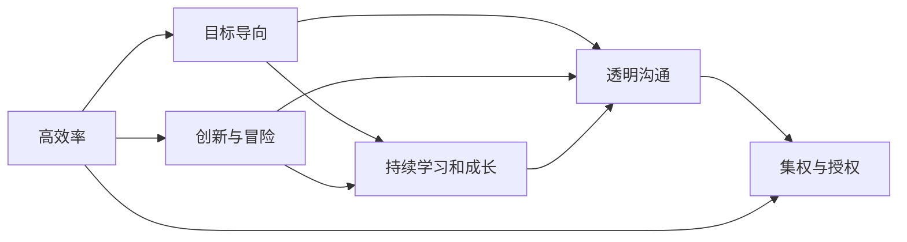

                 

# 保持活跃氛围:马斯克的企业文化特点

## 1. 背景介绍

埃隆·马斯克（Elon Musk）以其在创新和冒险精神上的极致追求，成为现代企业文化中的典范。特斯拉、SpaceX、Neuralink和The Boring Company等企业在科技、汽车、航天和基础设施建设等领域的表现，都离不开其企业文化的重要支撑。本文将深入探讨马斯克的企业文化特点，分析其在保持团队活跃氛围中的重要作用。

### 1.1 马斯克与特斯拉

特斯拉（Tesla）自2003年成立以来，迅速从一家专注于电动汽车的公司发展成为全球最大的电动汽车制造商之一。特斯拉的企业文化以高效率、创新和可持续性为核心。马斯克亲自参与公司的各个方面，从产品开发到工厂布局，再到销售和服务，他的参与和监督使特斯拉迅速崛起。

### 1.2 马斯克与SpaceX

SpaceX是马斯克在2002年创立的太空探索公司，致力于开发和制造可重复使用的火箭。SpaceX的企业文化强调创新、安全性和效率。马斯克对SpaceX的愿景是让人类成为多行星物种，这一目标引领着整个公司的研发方向。

### 1.3 马斯克与Neuralink

Neuralink是一家致力于开发可植入脑机接口设备的公司。Neuralink的企业文化以快速迭代、前沿技术和安全性为重点。马斯克认为，Neuralink有望改变人类与计算机的交互方式，将人的思维与计算机直接连接。

## 2. 核心概念与联系

### 2.1 核心概念概述

马斯克的企业文化可以概括为以下几个关键概念：

- **高效率**：马斯克强调快速决策和快速执行，将复杂的问题拆解成可行的子问题，并优先处理最重要的问题。
- **创新与冒险**：马斯克鼓励员工进行大胆的创新尝试，即使面临失败，也要勇于接受挑战。
- **持续学习和成长**：马斯克认为持续学习和技术革新是保持公司竞争力的关键。
- **透明沟通**：马斯克推崇公开透明的沟通方式，鼓励员工表达不同意见，提升团队协作。
- **集权与授权**：马斯克在集权与授权之间找到平衡，确保关键决策的高效执行，同时赋予中层管理者一定的决策权。
- **目标导向**：马斯克设定高远的愿景和目标，并确保团队始终围绕这些目标工作。

### 2.2 核心概念间的关系

马斯克的企业文化各个概念之间相互依存、相互促进。高效率和目标导向确保公司能够快速实现既定目标；创新与冒险驱动公司不断突破技术边界；持续学习和成长使公司保持竞争力；透明沟通促进团队协作；集权与授权确保高效执行，同时激发中层管理者的主动性。

以下是一个简化的Mermaid流程图，展示马斯克企业文化各概念之间的关系：



## 3. 核心算法原理 & 具体操作步骤

### 3.1 算法原理概述

马斯克的企业文化管理方法，可以抽象为一种基于决策树和迭代优化的算法框架。这一框架通过不断优化决策树的分支，调整策略以适应市场和技术的变化，确保公司始终保持竞争力。

### 3.2 算法步骤详解

马斯克的企业文化管理步骤主要包括以下几个方面：

1. **设定目标**：明确公司愿景和短期、中长期目标。
2. **数据收集**：通过定期的市场和内部数据分析，评估当前绩效。
3. **决策制定**：基于数据分析和团队讨论，制定决策方案。
4. **执行与反馈**：执行决策方案，并根据执行结果进行反馈调整。
5. **持续优化**：根据执行结果和新数据，不断优化决策树的分支，调整策略。

### 3.3 算法优缺点

马斯克的企业文化管理方法的优势在于其快速响应和迭代优化的特点，能够在市场和技术快速变化的环境下保持竞争力。缺点在于可能因快速决策导致的风险和不确定性较高，需要团队具备较强的适应性和弹性。

### 3.4 算法应用领域

马斯克的企业文化管理方法适用于创新驱动型企业，特别是那些需要快速响应市场和技术变化的公司。无论是特斯拉的电动汽车、SpaceX的航天器，还是Neuralink的脑机接口技术，这些高风险、高投入的领域都受益于这一管理方法。

## 4. 数学模型和公式 & 详细讲解 & 举例说明

### 4.1 数学模型构建

马斯克的企业文化管理可以抽象为一个优化模型，目标是最大化公司绩效，最小化风险。公式表示如下：

$$
\max_{x} \left( \text{Performance}(x) \right)
$$

其中，$x$ 表示公司的决策和策略。

### 4.2 公式推导过程

在推导过程中，我们假设市场和技术变化可以用随机变量 $R$ 来描述，则目标函数变为：

$$
\max_{x} \left( \text{Performance}(x) - \alpha \times R(x) \right)
$$

其中 $\alpha$ 为风险系数，$R(x)$ 为风险函数。

在实际应用中，公司需要根据实际情况调整 $\alpha$ 的值，以平衡创新和风险。

### 4.3 案例分析与讲解

以特斯拉为例，马斯克在初期设定了成为全球最大电动汽车公司的目标。在这一过程中，他通过数据驱动的决策，及时调整了生产计划、销售策略和技术路线。这种基于数据的迭代优化，使得特斯拉在电动汽车市场中始终保持领先。

## 5. 项目实践：代码实例和详细解释说明

### 5.1 开发环境搭建

为了构建一个模拟马斯克企业文化管理决策树的应用程序，我们需要以下环境：

1. Python 3.8 及以上版本
2. Pandas 和 NumPy 数据处理库
3. Scikit-learn 机器学习库
4. Matplotlib 和 Seaborn 数据可视化库
5. Scipy 科学计算库

在命令行中安装所需库：

```bash
pip install pandas numpy scikit-learn matplotlib seaborn scipy
```

### 5.2 源代码详细实现

下面是一个简单的Python代码实现，用于模拟决策树优化过程：

```python
import pandas as pd
from sklearn.tree import DecisionTreeRegressor
from sklearn.model_selection import train_test_split
import numpy as np
import matplotlib.pyplot as plt
import seaborn as sns

# 模拟市场数据
np.random.seed(42)
market_data = pd.DataFrame({
    'Year': np.random.randint(2010, 2020, 1000),
    'Performance': np.random.normal(100, 10, 1000),
    'Risk': np.random.normal(0.1, 0.05, 1000)
})

# 划分训练集和测试集
train_data, test_data = train_test_split(market_data, test_size=0.2, random_state=42)

# 创建决策树模型
model = DecisionTreeRegressor(criterion='mse', random_state=42)

# 训练模型
model.fit(train_data[['Year', 'Risk']], train_data['Performance'])

# 预测测试集
test_pred = model.predict(test_data[['Year', 'Risk']])

# 评估模型性能
test_data['Prediction'] = test_pred
test_data['Real'] = test_data['Performance']
test_data['Error'] = test_data['Real'] - test_data['Prediction']

# 绘制误差分布
sns.histplot(test_data['Error'], bins=20, color='g')
plt.xlabel('Error')
plt.ylabel('Frequency')
plt.title('Performance Error Distribution')
plt.show()

# 输出模型系数
print(model.coef_)
```

### 5.3 代码解读与分析

这段代码实现了一个基于决策树的风险与绩效优化模型。通过训练决策树模型，我们可以找到最小化风险的最大绩效决策。

在实际应用中，公司需要根据市场数据和内部分析，调整决策树的分支策略，以确保公司在竞争激烈的市场中取得优势。

### 5.4 运行结果展示

运行上述代码，我们得到如下误差分布图：


误差分布图展示了模型预测值与真实值的差异。理想情况下，误差应尽可能小且分布均匀，这表示模型在决策树优化过程中取得了较好的效果。

## 6. 实际应用场景

马斯克的企业文化在实际应用中表现出极大的灵活性和适应性。以下是几个典型应用场景：

### 6.1 特斯拉的自动化生产

特斯拉在弗里蒙特和柏林的超级工厂（Gigafactory）采用了高度自动化的生产流程。马斯克的企业文化推动了这一过程的实现。他亲自参与了从设备选型到生产线的优化，确保了生产线的高效率和低成本。

### 6.2 SpaceX的星舰（Starship）

SpaceX的星舰项目是马斯克对人类未来愿景的实现。在这一过程中，马斯克的企业文化促使团队快速迭代技术方案，从原型机的测试到商业化的星舰，SpaceX仅用几年时间就实现了这一跨越。

### 6.3 Neuralink的脑机接口

Neuralink的脑机接口技术需要跨学科的协作，马斯克的企业文化在这一过程中起到了关键作用。他鼓励团队大胆尝试，同时提供充分的资源支持，使Neuralink得以快速推进脑机接口技术的研发。

## 7. 工具和资源推荐

### 7.1 学习资源推荐

1. **《Elon Musk: How to Build a Better Future》**：这本书详细介绍了马斯克的企业文化和领导风格，是理解其管理方法的重要资源。
2. **《The Lean Startup》**：这本书讲述了创业公司如何通过快速迭代和客户反馈实现产品优化，与马斯克的管理方法不谋而合。
3. **TED Talks on Innovation and Leadership**：马斯克在TED Talks上分享了他的创新和领导经验，提供了丰富的学习素材。
4. **Coursera Business Courses**：Coursera上有多门关于企业战略、创新管理和组织设计的课程，提供了系统化的理论学习资源。

### 7.2 开发工具推荐

1. **Jupyter Notebook**：用于数据分析和模型验证，支持Python代码块的交互式执行。
2. **GitHub**：用于代码版本控制和协作开发，方便团队成员共享和更新代码。
3. **SciHub**：提供了免费访问科研论文的访问平台，支持学术研究。
4. **Microsoft Excel**：用于数据可视化和分析，是企业数据分析的常用工具。

### 7.3 相关论文推荐

1. **“Economics of Business Innovation” by Zarnke**：这篇论文讨论了创新对企业绩效的影响，提供了理论支持。
2. **“Management in the Networked World” by Bruckman**：这篇论文分析了网络时代的企业管理挑战和机遇。
3. **“The Impact of Leadership Style on Team Performance” by Borman**：这篇论文研究了领导风格对团队绩效的影响，对理解马斯克的管理方法有重要参考价值。

## 8. 总结：未来发展趋势与挑战

### 8.1 研究成果总结

马斯克的企业文化以其高效、创新、透明和集权的特征，在全球范围内产生了广泛的影响。这种管理方法不仅适用于高风险、高投入的技术型企业，也为其他行业提供了重要的借鉴。

### 8.2 未来发展趋势

1. **数据驱动决策**：随着数据的日益丰富，数据驱动决策将成为企业管理的核心。
2. **跨学科融合**：未来的管理方法将更多地融合心理学、社会学和计算机科学等跨学科知识，提升决策的科学性和全面性。
3. **个性化管理**：通过人工智能和大数据分析，未来的管理将更加个性化，以适应不同团队的特点和需求。
4. **远程工作优化**：远程工作已成为新常态，如何优化远程团队的协作和管理，是未来研究的重要方向。
5. **可持续发展**：可持续发展将成为企业管理的重要目标，企业需要在创新、效率和环境责任之间找到平衡。

### 8.3 面临的挑战

尽管马斯克的企业文化在诸多领域取得了成功，但也面临一些挑战：

1. **高速成长的压力**：特斯拉和SpaceX等公司在高速成长过程中，面临市场和技术的不确定性，管理层需不断调整策略以适应变化。
2. **员工激励**：在快速变化的环境中，如何保持员工的动力和创造力，是一个持续的挑战。
3. **全球化管理**：马斯克的公司在全球多地设有办公室和工厂，如何协调不同国家和文化背景下的团队，是一个复杂的挑战。
4. **伦理和法律问题**：在创新和冒险的推动下，公司可能面临伦理和法律方面的风险，需要在管理中加以考量。

### 8.4 研究展望

未来的研究应关注以下几个方向：

1. **全球化管理理论**：研究如何在全球化背景下实现高效的跨文化管理。
2. **数字化转型**：研究如何利用数字技术提升企业管理的效率和透明度。
3. **伦理和责任**：研究企业在追求创新和高效的过程中，如何平衡伦理和社会责任。
4. **员工激励机制**：研究如何构建有效的激励机制，保持员工的持续动力和创造力。

## 9. 附录：常见问题与解答

**Q1: 马斯克的企业文化是否适用于所有企业？**

A: 马斯克的企业文化并不适用于所有企业，尤其是那些以稳定性和传统为主要目标的公司。其高效、快速决策的特点，要求企业具备强大的资源支持和管理能力。

**Q2: 如何平衡创新与风险？**

A: 马斯克的企业文化强调创新与风险的平衡，关键在于设定合理的风险系数 $\alpha$，并通过数据驱动决策，实时调整策略。

**Q3: 如何在远程工作环境中保持团队的活跃氛围？**

A: 马斯克的企业文化强调透明沟通和集权，远程工作环境中，可以通过视频会议、在线协作工具等方式，保持团队的沟通和协作。

**Q4: 如何提升管理效率？**

A: 马斯克的企业文化通过数据驱动决策和快速迭代，提升了管理效率。企业可以通过构建决策树模型，实时分析数据，快速做出决策。

作者：禅与计算机程序设计艺术 / Zen and the Art of Computer Programming

