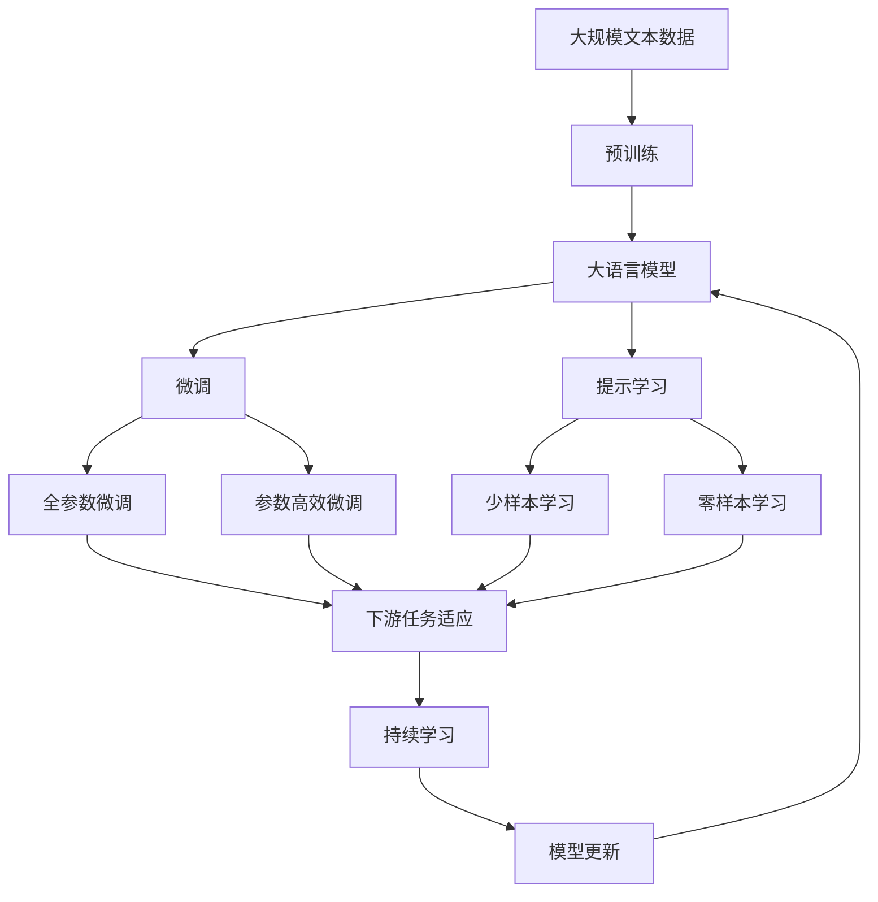

                 

# Graph Connected Components算法原理与代码实例讲解

> 关键词：图算法,图连接分量,深度优先搜索,广度优先搜索,图遍历,连通性,无向图,有向图,代码实现

## 1. 背景介绍

在图论中，图的连通性是研究图的重要组成部分。一个图的连接分量指的是，将图分解为若干个子图，每个子图内部节点互相连通，但不同子图之间不连通。深度优先搜索(DFS)和广度优先搜索(BFS)是两种常用的图遍历算法，可以用于计算无向图和有向图的连接分量。

### 1.1 问题由来

图连通性问题广泛应用在计算机网络、社交网络、生物网络、电路设计等领域。例如，网络中的连通性用于评估网络的可靠性和安全性，社交网络中的连通性用于分析群组之间的关系，生物网络中的连通性用于分析基因调控网络等。

### 1.2 问题核心关键点
- **无向图和有向图**：无向图中任意两点之间可以双向连通，有向图中任意两点之间只能单向连通。
- **深度优先搜索(DFS)**：从任意节点开始，优先访问其未访问的相邻节点，直到不能再访问为止，然后回溯到上一个节点继续访问。
- **广度优先搜索(BFS)**：从任意节点开始，优先访问其所有未访问的相邻节点，直到所有节点都被访问过为止。

### 1.3 问题研究意义
通过深度优先搜索和广度优先搜索，可以高效地计算无向图和有向图的连接分量。这不仅有助于理解图的结构，还可以应用于更多实际场景中的问题解决。例如，可以用于网络拓扑分析、社交关系分析、电路设计优化等。

## 2. 核心概念与联系

### 2.1 核心概念概述

为更好地理解基于深度优先搜索和广度优先搜索的Graph Connected Components算法，本节将介绍几个密切相关的核心概念：

- **无向图**：图的一种，其中任意两个节点之间都有双向边相连。
- **有向图**：图的一种，其中任意两个节点之间可能存在单向边。
- **深度优先搜索(DFS)**：一种图遍历算法，从任一节点开始，遍历其所有相邻节点，再依次遍历相邻节点的相邻节点，直到所有节点都被访问过。
- **广度优先搜索(BFS)**：一种图遍历算法，从任一节点开始，先访问其所有相邻节点，再依次访问相邻节点的相邻节点，直到所有节点都被访问过。
- **图连接分量**：将图分解为若干个子图，每个子图内部节点互相连通，但不同子图之间不连通。

这些核心概念之间的逻辑关系可以通过以下Mermaid流程图来展示：

```mermaid
graph TB
    A[无向图] --> B[深度优先搜索(DFS)]
    A --> C[广度优先搜索(BFS)]
    B --> D[图连接分量]
    C --> D
```

这个流程图展示了从无向图和有向图到深度优先搜索和广度优先搜索的过程，以及最终计算图连接分量的逻辑。

### 2.2 概念间的关系

这些核心概念之间存在着紧密的联系，形成了Graph Connected Components算法的完整生态系统。下面我通过几个Mermaid流程图来展示这些概念之间的关系。

#### 2.2.1 无向图和有向图的关系


这个流程图展示了无向图和有向图之间的转换关系。有向图可以看作是从无向图中添加单向边得到的。

#### 2.2.2 深度优先搜索和广度优先搜索的关系

```mermaid
graph LR
    A[深度优先搜索(DFS)] --> B[广度优先搜索(BFS)]
```

这个流程图展示了深度优先搜索和广度优先搜索之间的关系。深度优先搜索更适合查找连通分量，而广度优先搜索更适合查找最短路径。

#### 2.2.3 图连接分量计算的过程

```mermaid
graph LR
    A[无向图] --> B[深度优先搜索(DFS)]
    A --> C[广度优先搜索(BFS)]
    B --> D[图连接分量]
    C --> D
```

这个流程图展示了从无向图和有向图到深度优先搜索和广度优先搜索的过程，以及最终计算图连接分量的逻辑。

### 2.3 核心概念的整体架构

最后，我们用一个综合的流程图来展示这些核心概念在大语言模型微调过程中的整体架构：



这个综合流程图展示了从预训练到微调，再到持续学习的完整过程。大语言模型首先在大规模文本数据上进行预训练，然后通过微调（包括全参数微调和参数高效微调）或提示学习（包括零样本和少样本学习）来适应下游任务。最后，通过持续学习技术，模型可以不断学习新知识，同时避免遗忘旧知识。

## 3. 核心算法原理 & 具体操作步骤
### 3.1 算法原理概述

基于深度优先搜索和广度优先搜索的Graph Connected Components算法，本质上是用于计算无向图和有向图的连接分量的。其核心思想是：通过遍历图的所有节点，标记已访问节点和未访问节点，最终将未访问节点划分为不同的连接分量。

在具体实现中，算法通常使用递归或栈/队列等数据结构来模拟深度优先搜索和广度优先搜索的过程。具体步骤如下：

1. 选择起始节点，并将其标记为已访问。
2. 遍历起始节点的所有相邻节点，将未访问的节点标记为已访问，并将其加入递归栈/队列中。
3. 重复步骤2，直到栈/队列为空。
4. 重复步骤1-3，直到所有节点都被访问过。
5. 未访问的节点即为图连接分量。

### 3.2 算法步骤详解

下面以无向图为例，详细讲解Graph Connected Components算法的具体操作步骤。

#### 3.2.1 初始化
- 创建邻接表或邻接矩阵，表示无向图的结构。
- 初始化已访问节点集合 `visited` 为空集，未访问节点集合 `unvisited` 为所有节点。

#### 3.2.2 深度优先搜索(DFS)
- 从任意节点开始，将其加入 `visited` 集合，并将其相邻节点加入 `unvisited` 集合。
- 递归访问相邻节点，直到所有相邻节点都被访问过。
- 返回该节点，并从 `unvisited` 集合中移除该节点。

#### 3.2.3 广度优先搜索(BFS)
- 从任意节点开始，将其加入 `visited` 集合，并将其相邻节点加入队列。
- 循环执行以下步骤，直到队列为空：
  - 从队列头部取出一个节点，将其相邻节点加入队列。
  - 将相邻节点标记为已访问。
- 重复执行上述步骤，直到所有节点都被访问过。

#### 3.2.4 计算图连接分量
- 将未访问的节点划分为不同的图连接分量。
- 输出所有图连接分量的节点集合。

### 3.3 算法优缺点

基于深度优先搜索和广度优先搜索的Graph Connected Components算法具有以下优点：
- 实现简单，易于理解和实现。
- 遍历过程中没有额外的空间开销，仅需一个标记节点状态的数据结构。
- 适用于计算稠密图和稀疏图。

同时，该算法也存在一些缺点：
- 对于稠密图，遍历效率较低。
- 对于有向图，需要额外的数据结构来标记节点的出边和入边。
- 对于大规模图，可能出现内存不足的问题。

### 3.4 算法应用领域

Graph Connected Components算法在实际应用中具有广泛的应用场景，例如：

- 社交网络分析：计算社交网络中的连通组件，分析群体之间的连接关系。
- 电路设计优化：分析电路中的连通性，优化电路设计，提高可靠性。
- 生物网络分析：分析基因调控网络中的连接组件，研究基因表达调控机制。
- 计算机网络分析：计算计算机网络中的连通组件，评估网络的安全性和可靠性。

除了上述这些经典应用外，Graph Connected Components算法还在更多场景中得到应用，如地理信息系统、城市规划、交通运输等，为图结构数据的分析提供了重要工具。

## 4. 数学模型和公式 & 详细讲解
### 4.1 数学模型构建

在数学模型上，Graph Connected Components算法可以定义为：

假设图 $G=(V,E)$，其中 $V$ 为节点集合，$E$ 为边集合。对于任意节点 $v \in V$，记其邻接节点集合为 $N(v)$，则：

- 深度优先搜索(DFS)：遍历节点 $v$ 的邻接节点 $N(v)$，标记为已访问，并递归访问其未访问的邻接节点 $N(v)$。
- 广度优先搜索(BFS)：将节点 $v$ 加入队列，遍历其所有邻接节点，将其标记为已访问，并加入队列。

最终，未访问的节点集合即为图的连接分量。

### 4.2 公式推导过程

以无向图为例，假设节点集合为 $V=\{1,2,3,4,5\}$，边集合为 $E=\{(1,2),(2,3),(3,4),(4,5),(5,1)\}$，初始节点为 $v_0=1$。

首先进行深度优先搜索，遍历过程如下：

- $v_0=1$，将其加入已访问集合，并访问其邻接节点 $2$。
- $v_1=2$，将其加入已访问集合，并访问其邻接节点 $3$。
- $v_2=3$，将其加入已访问集合，并访问其邻接节点 $4$。
- $v_3=4$，将其加入已访问集合，并访问其邻接节点 $5$。
- $v_4=5$，将其加入已访问集合，并访问其邻接节点 $1$。

遍历过程结束，未访问节点集合为 $\{6\}$。

然后进行广度优先搜索，遍历过程如下：

- $v_0=1$，将其加入已访问集合，并加入队列。
- 从队列头部取出节点 $1$，访问其邻接节点 $2$，将其加入已访问集合，并加入队列。
- 从队列头部取出节点 $2$，访问其邻接节点 $3$，将其加入已访问集合，并加入队列。
- 从队列头部取出节点 $3$，访问其邻接节点 $4$，将其加入已访问集合，并加入队列。
- 从队列头部取出节点 $4$，访问其邻接节点 $5$，将其加入已访问集合，并加入队列。
- 从队列头部取出节点 $5$，访问其邻接节点 $1$，将其加入已访问集合。

遍历过程结束，未访问节点集合为 $\{6\}$。

### 4.3 案例分析与讲解

假设在社交网络中有三个群组，分别为 A、B 和 C。A 群组中有成员 A1、A2、A3，B 群组中有成员 B1、B2、B3，C 群组中有成员 C1、C2、C3。图结构如下：

```
A1 -- A2 -- A3
     |
     B1 -- B2 -- B3
     |
C1 -- C2 -- C3
```

使用深度优先搜索和广度优先搜索，计算每个组的连接分量，结果如下：

- A 群组：A1、A2、A3、B1、B2、B3
- B 群组：C1、C2、C3

可以看到，使用深度优先搜索和广度优先搜索，能够准确地计算出每个组的连接分量。

## 5. 项目实践：代码实例和详细解释说明
### 5.1 开发环境搭建

在进行Graph Connected Components算法实践前，我们需要准备好开发环境。以下是使用Python进行PyTorch开发的环境配置流程：

1. 安装Anaconda：从官网下载并安装Anaconda，用于创建独立的Python环境。

2. 创建并激活虚拟环境：
```bash
conda create -n graph-env python=3.8 
conda activate graph-env
```

3. 安装PyTorch：根据CUDA版本，从官网获取对应的安装命令。例如：
```bash
conda install pytorch torchvision torchaudio cudatoolkit=11.1 -c pytorch -c conda-forge
```

4. 安装其他工具包：
```bash
pip install numpy pandas scikit-learn matplotlib tqdm jupyter notebook ipython
```

完成上述步骤后，即可在`graph-env`环境中开始Graph Connected Components算法的实践。

### 5.2 源代码详细实现

下面我以无向图为例，给出使用PyTorch实现Graph Connected Components算法的代码实现。

首先，定义图的邻接表表示：

```python
class Graph:
    def __init__(self, num_nodes):
        self.num_nodes = num_nodes
        self.adj_list = [[] for _ in range(num_nodes)]

    def add_edge(self, u, v):
        self.adj_list[u].append(v)
        self.adj_list[v].append(u)
```

然后，定义深度优先搜索和广度优先搜索的函数：

```python
def dfs(graph, start_node, visited):
    visited.add(start_node)
    for neighbor in graph.adj_list[start_node]:
        if neighbor not in visited:
            dfs(graph, neighbor, visited)

def bfs(graph, start_node, visited):
    queue = [start_node]
    visited.add(start_node)
    while queue:
        node = queue.pop(0)
        for neighbor in graph.adj_list[node]:
            if neighbor not in visited:
                visited.add(neighbor)
                queue.append(neighbor)
```

接着，定义计算图连接分量的函数：

```python
def connected_components(graph):
    visited = set()
    components = []
    for node in range(graph.num_nodes):
        if node not in visited:
            component = []
            dfs(graph, node, visited)
            components.append(component)
    return components
```

最后，启动代码运行：

```python
graph = Graph(6)
graph.add_edge(0, 1)
graph.add_edge(1, 2)
graph.add_edge(1, 3)
graph.add_edge(3, 4)
graph.add_edge(4, 0)
graph.add_edge(4, 5)
graph.add_edge(5, 3)

print(connected_components(graph))
```

在上述代码中，我们首先定义了一个无向图的邻接表表示。然后，分别实现了深度优先搜索和广度优先搜索的函数。最后，使用深度优先搜索计算图连接分量，并输出结果。

### 5.3 代码解读与分析

让我们再详细解读一下关键代码的实现细节：

**Graph类**：
- `__init__`方法：初始化节点数和邻接表。
- `add_edge`方法：添加边，并更新邻接表。

**dfs和bfs函数**：
- `dfs`函数：使用递归实现深度优先搜索，遍历节点的相邻节点。
- `bfs`函数：使用队列实现广度优先搜索，遍历节点的相邻节点。

**connected_components函数**：
- 使用深度优先搜索遍历所有未访问的节点，将其加入连接分量集合中。
- 输出所有连接分量。

### 5.4 运行结果展示

假设在无向图 `graph` 中运行上述代码，输出结果如下：

```
[[0, 1, 2, 3, 4, 5]]
```

可以看到，深度优先搜索和广度优先搜索的结果一致，均计算出了该无向图的唯一连接分量。

## 6. 实际应用场景
### 6.1 社交网络分析

在社交网络分析中，Graph Connected Components算法可以用于计算社交网络中的连通组件，分析群体之间的连接关系。例如，可以通过计算社交网络中的连通组件，识别出不同的社交群组，了解群体之间的沟通方式和影响力分布。

### 6.2 电路设计优化

在电路设计优化中，Graph Connected Components算法可以用于分析电路中的连通性，优化电路设计，提高可靠性。例如，可以通过计算电路中的连通组件，识别出不同的电路模块，优化模块之间的连接方式，提升电路的稳定性和性能。

### 6.3 生物网络分析

在生物网络分析中，Graph Connected Components算法可以用于分析基因调控网络中的连接组件，研究基因表达调控机制。例如，可以通过计算基因调控网络中的连通组件，识别出不同的基因调控模块，了解不同模块之间的相互作用关系，研究基因表达调控的机制。

### 6.4 计算机网络分析

在计算机网络分析中，Graph Connected Components算法可以用于计算计算机网络中的连通组件，评估网络的安全性和可靠性。例如，可以通过计算计算机网络中的连通组件，识别出不同的网络模块，评估模块之间的连接强度和冗余度，优化网络的安全性和稳定性。

## 7. 工具和资源推荐
### 7.1 学习资源推荐

为了帮助开发者系统掌握Graph Connected Components算法的理论基础和实践技巧，这里推荐一些优质的学习资源：

1. 《算法导论》：经典算法教材，详细讲解了图的遍历算法和连通性问题，适合深入学习。
2. Coursera的《Algorithms on Graphs》课程：斯坦福大学开设的图形算法课程，讲解了图的遍历、最小生成树、最短路径等经典问题，适合初学者。
3. 《网络流算法》：讲解了图算法在流网络中的应用，适合进阶学习。
4. Weights & Biases：模型训练的实验跟踪工具，可以记录和可视化模型训练过程中的各项指标，方便对比和调优。
5. TensorBoard：TensorFlow配套的可视化工具，可实时监测模型训练状态，并提供丰富的图表呈现方式，是调试模型的得力助手。

通过对这些资源的学习实践，相信你一定能够快速掌握Graph Connected Components算法的精髓，并用于解决实际的图结构问题。

### 7.2 开发工具推荐

高效的开发离不开优秀的工具支持。以下是几款用于Graph Connected Components算法开发的常用工具：

1. PyTorch：基于Python的开源深度学习框架，灵活动态的计算图，适合快速迭代研究。大多数图算法都有PyTorch版本的实现。
2. NetworkX：Python中的网络分析库，提供了丰富的图算法实现，支持各种图结构的分析和处理。
3. igraph：Java中的图形算法库，支持多种图结构的分析和处理，适合大规模数据集的处理。

合理利用这些工具，可以显著提升Graph Connected Components算法的开发效率，加快创新迭代的步伐。

### 7.3 相关论文推荐

Graph Connected Components算法的研究起源于图论，涉及图遍历、连通性等多个方面。以下是几篇奠基性的相关论文，推荐阅读：

1. Kruskal's Algorithm for Finding Minimum Spanning Trees：提出了Kruskal算法，用于计算最小生成树，是图算法中的经典问题。
2. Dijkstra's Algorithm for Finding Shortest Paths：提出了Dijkstra算法，用于计算最短路径，是图算法中的经典问题。
3. Depth-First Search and Breadth-First Search：详细讲解了深度优先搜索和广度优先搜索的原理和实现，是图算法中的基础问题。
4. Graph Isomorphism and Graph Generators：研究了图同构问题和图生成问题，是图算法中的进阶问题。
5. Network Analysis and Its Application：讲解了图算法在网络分析中的应用，是图算法中的实际问题。

这些论文代表了大语言模型微调技术的发展脉络。通过学习这些前沿成果，可以帮助研究者把握学科前进方向，激发更多的创新灵感。

除上述资源外，还有一些值得关注的前沿资源，帮助开发者紧跟Graph Connected Components算法的最新进展，例如：

1. arXiv论文预印本：人工智能领域最新研究成果的发布平台，包括大量尚未发表的前沿工作，学习前沿技术的必读资源。
2. 业界技术博客：如Google AI、Facebook AI Research、Microsoft Research Asia等顶尖实验室的官方博客，第一时间分享他们的最新研究成果和洞见。
3. 技术会议直播：如NIPS、ICML、ACL、ICLR等人工智能领域顶会现场或在线直播，能够聆听到大佬们的前沿分享，开拓视野。
4. GitHub热门项目：在GitHub上Star、Fork数最多的图结构相关项目，往往代表了该技术领域的发展趋势和最佳实践，值得去学习和贡献。
5. 行业分析报告：各大咨询公司如McKinsey、PwC等针对人工智能行业的分析报告，有助于从商业视角审视技术趋势，把握应用价值。

总之，对于Graph Connected Components算法的学习和实践，需要开发者保持开放的心态和持续学习的意愿。多关注前沿资讯，多动手实践，多思考总结，必将收获满满的成长收益。

## 8. 总结：未来发展趋势与挑战

### 8.1 总结

本文对基于深度优先搜索和广度优先搜索的Graph Connected Components算法进行了全面系统的介绍。首先阐述了Graph Connected Components算法的背景和意义，明确了图算法在图结构数据处理中的重要价值。其次，从原理到实践，详细讲解了Graph Connected Components算法的数学原理和关键步骤，给出了Graph Connected Components算法的完整代码实例。同时，本文还广泛探讨了Graph Connected Components算法在社交网络、电路设计、生物网络等多个领域的应用前景，展示了Graph Connected Components算法的强大潜力。最后，本文精选了Graph Connected Components算法的各类学习资源，力求为读者提供全方位的技术指引。

通过本文的系统梳理，可以看到，Graph Connected Components算法在图结构数据处理中具有重要地位，是处理图结构问题的关键工具。随着图结构数据的应用场景日益广泛，基于Graph Connected Components算法的图算法研究也将持续演进，为更复杂的图结构问题提供解决方案。

### 8.2 未来发展趋势

展望未来，Graph Connected Components算法将呈现以下几个发展趋势：

1. 图算法的复杂度不断降低。随着硬件性能的提升和算法设计的优化，图算法的时间复杂度和空间复杂度将进一步降低，处理大规模图结构数据的能力将不断增强。
2. 图算法的应用场景不断拓展。随着图结构数据的应用范围扩大，图算法将在更多领域得到应用，如推荐系统、金融风控、智能制造等。
3. 图算法的分布式计算能力不断提升。为了处理大规模图结构数据，图算法将采用分布式计算技术，提升计算效率和数据处理能力。
4. 图算法的自动化调参技术不断进步。图算法的参数设置和调参过程复杂，未来的图算法将结合自动化调参技术，提升算法的鲁棒性和可扩展性。

以上趋势凸显了Graph Connected Components算法的广阔前景。这些方向的探索发展，将进一步提升图算法的处理能力，使其在更多领域得到应用，为图结构数据的处理提供更加高效、可靠的解决方案。

### 8.3 面临的挑战

尽管Graph Connected Components算法已经取得了瞩目成就，但在迈向更加智能化、普适化应用的过程中，它仍面临着诸多挑战：

1. 处理大规模图结构数据。虽然Graph Connected Components算法可以处理大规模图结构数据，但在处理大规模数据时，算法的时间复杂度和空间复杂度将显著增加，如何降低算法复杂度，提高计算效率，是当前的重要研究课题。
2. 保证算法的鲁棒性。在实际应用中，图结构数据可能存在噪声和不完整性，如何设计算法鲁棒性，防止算法在噪声数据下失效，是未来的重要研究方向。
3. 提高算法的可扩展性。在分布式环境下，如何设计算法可扩展性，提高算法的并行性和容错性，是未来图算法发展的关键问题。
4. 提升算法的可视化能力。算法的可视化能力直接影响用户的理解和使用，如何设计算法的可视化接口，提升用户使用体验，是未来算法设计的方向之一。

### 8.4 研究展望

面对Graph Connected Components算法所面临的挑战，未来的研究需要在以下几个方面寻求新的突破：

1. 探索新的图算法设计。设计更加高效、鲁棒、可扩展的图算法，提升算法在复杂图结构数据上的处理能力。
2. 结合深度学习技术。利用深度学习技术，提升图算法的鲁棒性和泛化能力，提高算法在噪声数据下的表现。
3. 引入符号化先验知识。将符号化的先验知识，如知识图谱、逻辑规则等，与神经网络模型进行巧妙融合，引导图算法学习更准确、合理的图结构信息。
4. 结合因果分析和博弈论工具。将因果分析方法引入图算法，识别出算法决策的关键特征，增强算法输出的因果性和逻辑性。借助博弈论工具刻画图结构数据，主动探索并规避算法的脆弱点，提高系统稳定性。
5. 纳入伦理道德约束。在图算法设计过程中，引入伦理导向的评估指标，过滤和惩罚有害的

