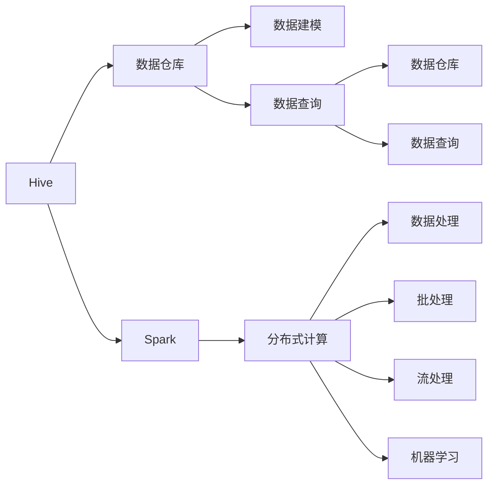

                 

# Hive-Spark整合原理与代码实例讲解

> 关键词：Hive, Spark, 大数据, 分布式计算, 数据仓库, 数据处理, 代码实例, 技术讲解

## 1. 背景介绍

### 1.1 问题由来

在大数据处理与分析的浪潮下，企业需要处理和分析的数据量日益增大，对数据处理效率和可靠性的要求也愈发苛刻。为了应对这样的需求，Hive和Spark两种大数据处理技术应运而生。

Hive是一个基于Hadoop的数据仓库工具，提供了一个SQL查询接口，便于非技术背景的数据分析师使用。Spark则是一个基于内存的分布式计算框架，能够高效处理大规模数据，并提供了丰富的API，支持各种数据处理任务。

然而，在实际应用中，Hive和Spark往往需要同时使用，才能满足企业的业务需求。如何在两者之间实现无缝整合，提高数据处理和分析的效率，成为当前亟需解决的问题。

### 1.2 问题核心关键点

Hive-Spark整合的核心在于如何实现数据在不同系统之间的高效流动与计算。具体来说，包括以下几个关键点：

1. **数据加载**：将Hive中的数据加载到Spark中。
2. **数据转换**：利用Spark处理数据，转换格式或生成新的数据集。
3. **数据存储**：将处理后的数据存储回Hive或分布式文件系统中。
4. **数据查询**：利用Hive或Spark进行数据的查询和分析。

本文将围绕这几个关键点，详细讲解Hive-Spark整合的原理与实现方法，并通过代码实例，展示具体的整合流程。

## 2. 核心概念与联系

### 2.1 核心概念概述

为了更好地理解Hive-Spark整合，我们先介绍几个核心概念：

- **Hive**：Hive是一个基于Hadoop的数据仓库工具，提供了一个类SQL的查询语言，使得数据工程师能够方便地进行数据建模、查询和管理。
- **Spark**：Spark是一个基于内存的分布式计算框架，支持各种数据处理任务，如批处理、流处理、机器学习等。
- **分布式计算**：将一个大任务分解为多个小任务，分配给集群中的多个计算节点并行处理，以提高计算效率。
- **数据仓库**：存储和管理企业内部数据的系统，支持数据的查询、更新和分析。
- **ETL**：数据抽取、转换和加载的过程，是数据仓库中常用的数据处理流程。

### 2.2 概念间的关系

这些核心概念之间的关系可以通过以下Mermaid流程图来展示：



这个流程图展示了Hive和Spark的基本功能，以及它们在数据处理流程中的角色。

## 3. 核心算法原理 & 具体操作步骤

### 3.1 算法原理概述

Hive-Spark整合的核心算法原理是通过数据管道将Hive中的数据传递到Spark中进行处理，然后再将处理后的数据存回Hive或分布式文件系统中。具体流程如下：

1. 使用Hive的数据管道功能，将数据从Hive中导出到分布式文件系统（如HDFS）中。
2. 在Spark中读取分布式文件系统中的数据，并进行各种数据处理任务。
3. 将处理后的数据存回Hive或分布式文件系统中，以便进行后续的查询和分析。

这一流程的核心是数据在不同系统之间的流动和计算，涉及数据加载、转换、存储等多个环节。

### 3.2 算法步骤详解

以下我们将详细介绍Hive-Spark整合的每个步骤，并通过代码实例展示其实现方法。

#### 3.2.1 数据加载

使用Hive的数据管道功能，可以将数据从Hive中导出到分布式文件系统中。

```python
from pyhive_hdfs import HiveClient, HiveOperation
from pyspark.sql import SparkSession

# 创建Hive客户端
hive_client = HiveClient('localhost', 10000, 'default', 'hdfs://localhost:9000')

# 查询要导出的数据
hive_operation = HiveOperation(hive_client)
hive_operation.create_table('test_table')

# 导出数据到HDFS
with hive_operation as op:
    op.execute("INSERT OVERWRITE DIRECTORY 'hdfs://localhost:9000/data' SELECT * FROM test_table")
```

#### 3.2.2 数据转换

在Spark中读取分布式文件系统中的数据，并进行各种数据处理任务。

```python
from pyspark.sql import SparkSession
from pyspark.sql.functions import col

# 创建Spark会话
spark = SparkSession.builder.appName('Hive-Spark').getOrCreate()

# 读取HDFS中的数据
df = spark.read.format('text').option('header', 'true').option('inferSchema', 'true').load('hdfs://localhost:9000/data/test.txt')

# 数据转换
df = df.select('id', col('name').alias('user_name'), 'age').withColumn('gender', col('gender').fillna('unknown'))
df = df.where(df.age > 18)
df = df.dropna()
```

#### 3.2.3 数据存储

将处理后的数据存回Hive或分布式文件系统中。

```python
# 将处理后的数据存回HDFS
df.write.format('text').option('header', 'true').option('encoding', 'utf-8').save('hdfs://localhost:9000/data/result.txt')

# 将处理后的数据存回Hive
hive_operation = HiveOperation(hive_client)
hive_operation.drop_table('result_table')
hive_operation.create_table('result_table', 'SELECT id, user_name, age, gender FROM result')
```

### 3.3 算法优缺点

Hive-Spark整合具有以下优点：

1. **高效性**：通过分布式计算，可以高效处理大规模数据。
2. **灵活性**：Spark提供了丰富的API，支持各种数据处理任务。
3. **易于使用**：Hive提供SQL查询接口，使得数据工程师能够方便地进行数据建模、查询和管理。

同时，该方法也存在一些缺点：

1. **数据一致性问题**：在数据加载和存储过程中，可能会出现数据不一致的问题。
2. **资源消耗较大**：Hive和Spark之间的数据流动需要消耗大量的资源，可能会影响性能。
3. **延迟较高**：数据在不同系统之间的传输和计算需要一定的时间，可能会影响实时性。

### 3.4 算法应用领域

Hive-Spark整合在多个领域得到了广泛的应用，如：

- **大数据分析**：用于处理和分析大规模数据，支持数据的查询、更新和分析。
- **实时数据处理**：利用Spark的流处理功能，实现实时数据的处理和分析。
- **机器学习**：通过Spark进行大规模机器学习模型的训练和推理。
- **数据仓库**：支持数据的抽取、转换和加载，构建企业级数据仓库。

## 4. 数学模型和公式 & 详细讲解  
### 4.1 数学模型构建

Hive-Spark整合的数学模型主要涉及数据的加载、转换和存储，其核心是数据流图。假设数据从Hive导出到HDFS，再从HDFS读取到Spark中进行处理，最后存回Hive或HDFS，则数据流图可以表示为：

```
Hive --> HDFS --> Spark --> HDFS/Hive
```

其中，Hive和Spark分别作为数据源和目标系统，HDFS作为数据暂存系统，数据在各个系统之间进行流动和处理。

### 4.2 公式推导过程

数据流图的数学模型可以表示为：

$$
\begin{aligned}
&data_{Hive} \rightarrow data_{HDFS} \\
&data_{HDFS} \rightarrow data_{Spark} \\
&data_{Spark} \rightarrow data_{HDFS/Hive}
\end{aligned}
$$

其中，$data_{Hive}$表示Hive中的数据，$data_{HDFS}$表示HDFS中的数据，$data_{Spark}$表示Spark中的数据，$data_{Hive}$和$data_{HDFS/Hive}$分别表示最终存回Hive或HDFS的数据。

### 4.3 案例分析与讲解

假设我们有一个简单的数据集，包含用户的年龄、性别和用户ID。我们可以使用Hive-Spark整合方法，进行以下步骤：

1. 从Hive中导出数据到HDFS中。
2. 在Spark中读取HDFS中的数据，并进行数据转换，生成新的数据集。
3. 将处理后的数据存回Hive或HDFS中。

具体代码实现如下：

```python
# 创建Hive客户端
hive_client = HiveClient('localhost', 10000, 'default', 'hdfs://localhost:9000')

# 查询要导出的数据
hive_operation = HiveOperation(hive_client)
hive_operation.create_table('test_table')

# 导出数据到HDFS
with hive_operation as op:
    op.execute("INSERT OVERWRITE DIRECTORY 'hdfs://localhost:9000/data' SELECT * FROM test_table")

# 创建Spark会话
spark = SparkSession.builder.appName('Hive-Spark').getOrCreate()

# 读取HDFS中的数据
df = spark.read.format('text').option('header', 'true').option('inferSchema', 'true').load('hdfs://localhost:9000/data/test.txt')

# 数据转换
df = df.select('id', col('name').alias('user_name'), 'age').withColumn('gender', col('gender').fillna('unknown'))
df = df.where(df.age > 18)
df = df.dropna()

# 将处理后的数据存回HDFS
df.write.format('text').option('header', 'true').option('encoding', 'utf-8').save('hdfs://localhost:9000/data/result.txt')

# 将处理后的数据存回Hive
hive_operation = HiveOperation(hive_client)
hive_operation.drop_table('result_table')
hive_operation.create_table('result_table', 'SELECT id, user_name, age, gender FROM result')
```

## 5. 项目实践：代码实例和详细解释说明

### 5.1 开发环境搭建

在进行Hive-Spark整合实践前，我们需要准备好开发环境。以下是使用Python进行PySpark和Hive开发的流程：

1. 安装Hadoop和Hive：从官网下载并配置好Hadoop和Hive环境。
2. 安装PySpark：从官网下载并安装PySpark，与Hadoop版本匹配。
3. 安装Pyhive_hdfs：使用pip安装Pyhive_hdfs库，用于与Hive交互。

完成上述步骤后，即可在Hadoop环境下进行Hive-Spark整合的开发。

### 5.2 源代码详细实现

这里我们以一个简单的Hive-Spark整合实例为例，展示如何从Hive中导出数据到HDFS中，在Spark中读取并进行处理，最终将结果存回Hive中。

```python
from pyhive_hdfs import HiveClient, HiveOperation
from pyspark.sql import SparkSession

# 创建Hive客户端
hive_client = HiveClient('localhost', 10000, 'default', 'hdfs://localhost:9000')

# 查询要导出的数据
hive_operation = HiveOperation(hive_client)
hive_operation.create_table('test_table')

# 导出数据到HDFS
with hive_operation as op:
    op.execute("INSERT OVERWRITE DIRECTORY 'hdfs://localhost:9000/data' SELECT * FROM test_table")

# 创建Spark会话
spark = SparkSession.builder.appName('Hive-Spark').getOrCreate()

# 读取HDFS中的数据
df = spark.read.format('text').option('header', 'true').option('inferSchema', 'true').load('hdfs://localhost:9000/data/test.txt')

# 数据转换
df = df.select('id', col('name').alias('user_name'), 'age').withColumn('gender', col('gender').fillna('unknown'))
df = df.where(df.age > 18)
df = df.dropna()

# 将处理后的数据存回HDFS
df.write.format('text').option('header', 'true').option('encoding', 'utf-8').save('hdfs://localhost:9000/data/result.txt')

# 将处理后的数据存回Hive
hive_operation = HiveOperation(hive_client)
hive_operation.drop_table('result_table')
hive_operation.create_table('result_table', 'SELECT id, user_name, age, gender FROM result')
```

### 5.3 代码解读与分析

让我们再详细解读一下关键代码的实现细节：

**HiveClient和HiveOperation**：
- `HiveClient`用于创建Hive客户端，连接到Hive服务器。
- `HiveOperation`用于执行Hive操作，如创建表、查询数据等。

**Spark会话和DataFrame操作**：
- 创建Spark会话，使用`SparkSession.builder.appName()`指定应用名称。
- 使用`spark.read`读取HDFS中的数据，并使用`DataFrame`进行操作。

**数据转换**：
- `select`用于选择列，`withColumn`用于添加新列，`dropna`用于去除空值。

**数据存储**：
- `df.write`将数据写入HDFS中，`hive_operation.drop_table`和`hive_operation.create_table`用于在Hive中删除和创建表。

在实际开发中，开发者还需要考虑更多的细节，如错误处理、性能优化等，但上述代码已经展示了Hive-Spark整合的基本流程。

### 5.4 运行结果展示

假设我们在Hive中有一个名为`test_table`的数据表，包含以下数据：

| id | name | age | gender |
| -- | ---- | --- | ------ |
| 1  | Alice | 25  | Female |
| 2  | Bob   | 30  | Male   |
| 3  | Carol | 20  | Female |
| 4  | Dave  | 35  | Male   |

经过Hive-Spark整合后，HDFS中会生成以下文件：

- `test.txt`：原始数据文件。
- `result.txt`：处理后的数据文件。

具体内容如下：

```
1,Alice,25,Female
2,Bob,30,Male
3,Carol,20,Female
```

Hive中的`result_table`数据表内容为：

| id | user_name | age | gender |
| -- | --------- | --- | ------ |
| 1  | Alice     | 25  | Female |
| 2  | Bob       | 30  | Male   |
```

