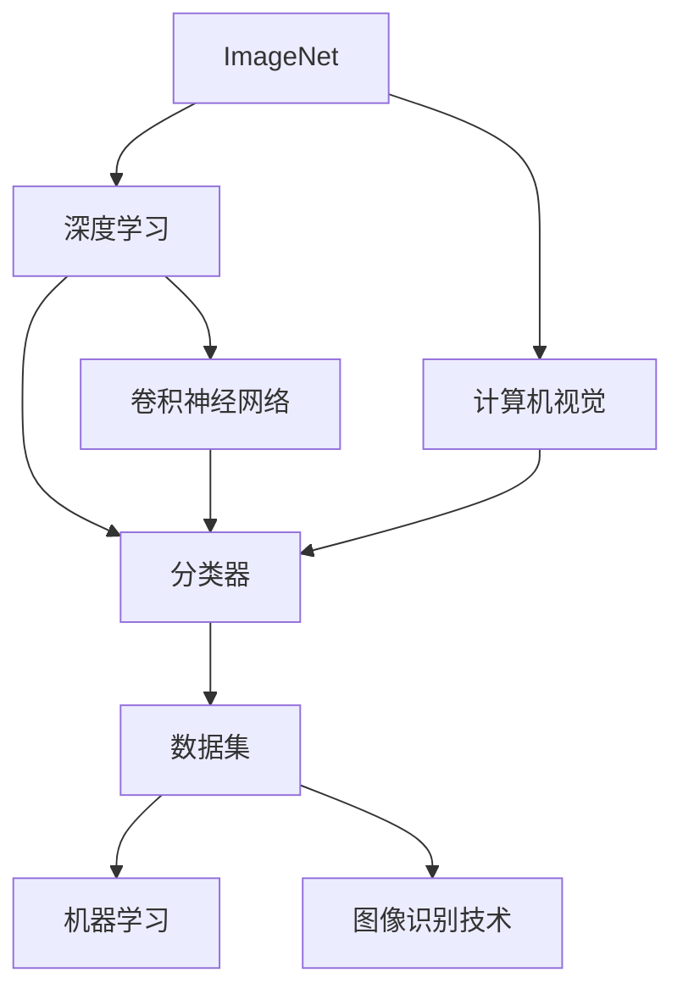
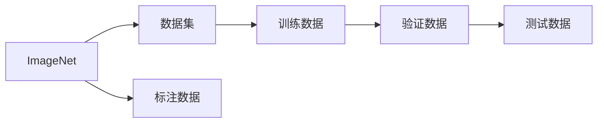
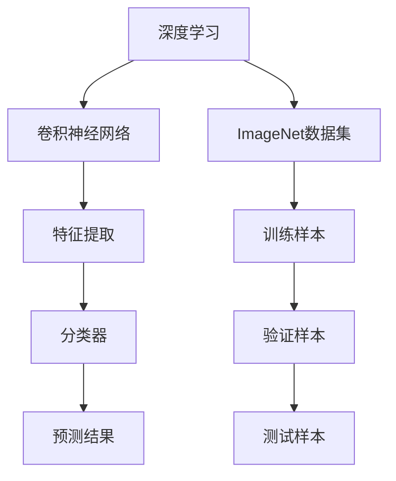
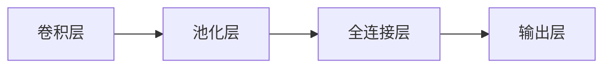
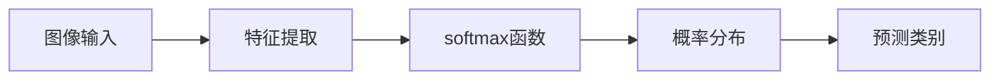
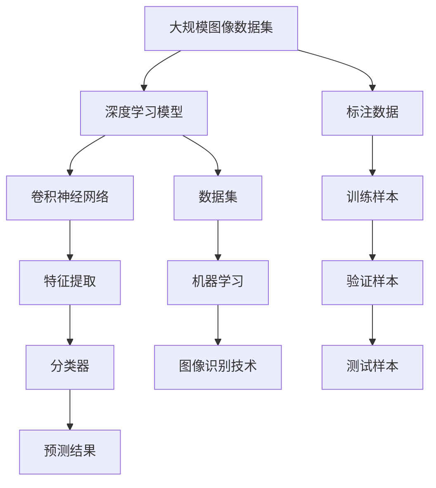

                 

# ImageNet与AI图像识别的历史

> 关键词：ImageNet, AI图像识别, 深度学习, 计算机视觉, 卷积神经网络, 分类器, 数据集, 机器学习, 图像识别技术

## 1. 背景介绍

### 1.1 问题由来
ImageNet是一项由斯坦福大学的研究者Alex Krizhevsky、Ilya Sutskever和Geoffrey Hinton发起的计算机视觉任务，旨在构建一个包含百万级别的图像标注数据集，以促进计算机视觉技术的发展。这一项目不仅推动了计算机视觉领域的学术研究，更催生了深度学习在图像识别领域的大放异彩。

### 1.2 问题核心关键点
ImageNet项目的主要目标是通过大规模数据集提升计算机视觉技术，尤其是图像识别技术的性能。其关键点包括：

- 数据集的规模：ImageNet包含了超过100万个训练图像和1000个类别，为深度学习模型提供了丰富的学习资源。
- 标注的精确性：数据集中的图像和类别均由专业标注人员进行精确标注，确保训练样本的质量。
- 数据的多样性：数据集包含了不同来源、不同背景、不同分辨率的图像，覆盖了广泛的视觉场景。
- 挑战任务的难度：ImageNet图像识别任务被广泛认为是最具挑战性的计算机视觉任务之一，为深度学习模型的评估提供了基准。

### 1.3 问题研究意义
ImageNet项目对计算机视觉领域具有重大意义，主要体现在以下几个方面：

- 推动深度学习发展：ImageNet的成功直接推动了深度学习技术在图像识别领域的应用，催生了卷积神经网络(CNN)等经典模型。
- 促进计算机视觉应用：ImageNet提供了大量的图像数据和标注信息，推动了计算机视觉技术在医疗、自动驾驶、智能监控等多个实际应用场景中的应用。
- 加速学术研究：ImageNet作为视觉任务评测基准，为众多计算机视觉算法的比较提供了标准化的测试平台。
- 激发产业创新：ImageNet的成功激发了企业和研究机构对计算机视觉技术的投入，推动了相关产品和服务的开发。

## 2. 核心概念与联系

### 2.1 核心概念概述

为更好地理解ImageNet项目及其对AI图像识别的影响，本节将介绍几个密切相关的核心概念：

- **ImageNet**：由斯坦福大学发起的计算机视觉数据集，包含超过100万个训练图像和1000个类别，是深度学习在图像识别领域的重要数据集。
- **深度学习**：一种基于神经网络的机器学习范式，通过多层非线性变换实现对复杂数据的建模和预测。
- **计算机视觉**：人工智能领域的一个分支，研究如何让计算机理解和处理视觉信息。
- **卷积神经网络(CNN)**：一种常用的深度学习模型，特别适合处理图像和视频等二维数据。
- **分类器**：用于对图像数据进行分类的模型，能够根据特征将图像归入不同的类别。
- **数据集**：用于训练和测试机器学习模型的图像数据和对应的标签。
- **机器学习**：通过数据训练模型，使其能够自动提取特征并做出预测的技术。
- **图像识别技术**：通过计算机视觉算法识别图像中的对象、场景等。

这些核心概念之间的逻辑关系可以通过以下Mermaid流程图来展示：



这个流程图展示了大规模图像数据集ImageNet与深度学习、计算机视觉、卷积神经网络、图像识别技术之间的紧密联系。

### 2.2 概念间的关系

这些核心概念之间存在着紧密的联系，形成了AI图像识别任务的基本框架。下面我通过几个Mermaid流程图来展示这些概念之间的关系。

#### 2.2.1 ImageNet的架构


这个流程图展示了ImageNet数据集的构成，包括训练数据、验证数据和测试数据，以及对应的标注数据。

#### 2.2.2 深度学习与ImageNet的结合


这个流程图展示了深度学习模型在ImageNet数据集上的应用，包括卷积神经网络、特征提取和分类器等关键组件。

#### 2.2.3 卷积神经网络的结构


这个流程图展示了卷积神经网络的基本结构，包括卷积层、池化层、全连接层和输出层。

#### 2.2.4 分类器的工作原理


这个流程图展示了分类器的工作原理，包括特征提取和softmax函数等关键步骤。

### 2.3 核心概念的整体架构

最后，我们用一个综合的流程图来展示这些核心概念在大规模图像数据集ImageNet上的整体架构：



这个综合流程图展示了从大规模图像数据集到深度学习模型，再到图像识别技术，整个流程中的关键组件和步骤。

## 3. 核心算法原理 & 具体操作步骤

### 3.1 算法原理概述
ImageNet上深度学习模型的训练，主要基于卷积神经网络(CNN)架构。CNN通过多层卷积和池化操作，能够有效地提取图像中的特征，并传递到全连接层进行分类。具体算法步骤如下：

1. **数据预处理**：将原始图像进行归一化、缩放、裁剪等预处理，确保输入数据的一致性。
2. **卷积层**：通过多层卷积操作，提取图像的局部特征。
3. **池化层**：对卷积层的输出进行下采样，减少特征的维度，提高计算效率。
4. **全连接层**：将池化层的输出扁平化，输入到全连接层进行分类。
5. **softmax函数**：对全连接层的输出进行softmax处理，得到每个类别的概率分布。
6. **损失函数计算**：计算预测结果与真实标签之间的差异，如交叉熵损失。
7. **反向传播**：通过反向传播算法计算损失函数对模型参数的梯度，更新模型权重。
8. **模型评估**：在验证集和测试集上评估模型的性能，调整模型参数，确保泛化能力。

### 3.2 算法步骤详解
下面以ImageNet数据集上的ResNet模型为例，详细介绍深度学习模型的训练步骤。

#### 3.2.1 数据预处理
在ImageNet数据集上，原始图像的大小一般为224x224像素。预处理步骤包括：

- 图像归一化：将像素值缩放到0到1之间，加速收敛。
- 随机裁剪：对图像进行随机裁剪，增强数据的多样性。
- 随机翻转：对图像进行水平或垂直翻转，进一步扩充数据集。
- 填充：对裁剪后的图像进行边缘填充，保持尺寸一致。

#### 3.2.2 模型构建
ResNet模型由多个卷积层和残差块构成，其中残差块包含两个3x3的卷积层和1x1的卷积层。模型的结构如下：

```python
class ResNet(nn.Module):
    def __init__(self, num_classes):
        super(ResNet, self).__init__()
        self.conv1 = nn.Conv2d(3, 64, kernel_size=7, stride=2, padding=3)
        self.pool = nn.MaxPool2d(kernel_size=3, stride=2, padding=1)
        self.layer1 = self._make_layer(64, 2)
        self.layer2 = self._make_layer(128, 2)
        self.layer3 = self._make_layer(256, 2)
        self.layer4 = self._make_layer(512, 2)
        self.fc = nn.Linear(512 * block_width, num_classes)

    def _make_layer(self, in_planes, blocks, stride=1):
        downsample = None
        layers = []
        layers.append(Bottleneck(self.conv1, in_planes, stride, downsample))
        for i in range(1, blocks):
            layers.append(Bottleneck(in_planes, in_planes))
        return nn.Sequential(*layers)
```

#### 3.2.3 损失函数计算
在训练过程中，主要使用交叉熵损失函数计算模型预测结果与真实标签之间的差异。

```python
criterion = nn.CrossEntropyLoss()
```

#### 3.2.4 反向传播
通过反向传播算法计算损失函数对模型参数的梯度，并使用优化器更新模型权重。

```python
optimizer = torch.optim.SGD(model.parameters(), lr=0.01, momentum=0.9, weight_decay=1e-4)
```

#### 3.2.5 模型评估
在验证集和测试集上评估模型的性能，选择最优模型进行测试。

```python
val_loss, val_acc = evaluate(model, val_loader, criterion)
test_loss, test_acc = evaluate(model, test_loader, criterion)
```

### 3.3 算法优缺点
基于ImageNet的深度学习模型具有以下优点：

- 可解释性高：卷积神经网络通过逐层特征提取，能够直观地解释模型的决策过程。
- 泛化能力强：深度学习模型在ImageNet数据集上取得了高精度，具有较好的泛化能力。
- 数据依赖小：模型只需要少量标注数据即可完成训练，减少了对标注数据的依赖。

同时，也存在一些缺点：

- 计算资源需求大：深度学习模型参数量庞大，训练过程中需要大量的计算资源。
- 模型复杂度高：卷积神经网络的复杂度高，难以解释和调试。
- 过拟合风险高：在标注数据不足的情况下，深度学习模型容易过拟合。

### 3.4 算法应用领域
基于ImageNet的深度学习模型在计算机视觉领域得到了广泛应用，包括：

- 图像分类：如识别动物、植物、交通标志等。
- 目标检测：如在图像中检测出特定的对象。
- 人脸识别：如识别个人身份信息。
- 视频分析：如动作识别、行为分析等。
- 医学影像分析：如肿瘤检测、病理图像分析等。

## 4. 数学模型和公式 & 详细讲解 & 举例说明

### 4.1 数学模型构建
ImageNet上的深度学习模型主要基于卷积神经网络(CNN)架构，数学模型可以表示为：

$$y = f(x; \theta)$$

其中，$x$为输入图像，$y$为预测标签，$\theta$为模型参数。CNN通过多层卷积和池化操作，提取图像的局部特征，并通过全连接层进行分类。

### 4.2 公式推导过程
以卷积层为例，卷积层的数学公式可以表示为：

$$\mathcal{C} = \mathcal{C}(x; \theta) = \sum_i w_i^T x + b$$

其中，$x$为输入图像，$\theta$为卷积核权重，$w_i$为卷积核的每个权重，$b$为偏置项。

通过多个卷积层和池化层的组合，CNN可以提取更高级别的特征。全连接层的数学公式可以表示为：

$$y = g(z; \theta) = \sum_i w_i z + b$$

其中，$z$为卷积层的输出特征，$w_i$为全连接层的每个权重，$b$为偏置项。

### 4.3 案例分析与讲解
以ResNet为例，ResNet模型中的残差块结构可以表示为：

$$H(x) = \mathcal{F}(H(x), x; \theta) + x$$

其中，$x$为输入图像，$H(x)$为残差块的输出，$\theta$为模型参数。

ResNet通过残差连接，解决了深度网络退化的问题，提高了模型的训练效果。

## 5. 项目实践：代码实例和详细解释说明

### 5.1 开发环境搭建
在Python环境中，可以使用PyTorch库进行深度学习模型的开发。以下是环境配置步骤：

1. 安装Anaconda：从官网下载并安装Anaconda，用于创建独立的Python环境。

2. 创建并激活虚拟环境：
```bash
conda create -n pytorch-env python=3.8 
conda activate pytorch-env
```

3. 安装PyTorch：根据CUDA版本，从官网获取对应的安装命令。例如：
```bash
conda install pytorch torchvision torchaudio cudatoolkit=11.1 -c pytorch -c conda-forge
```

4. 安装相关库：
```bash
pip install numpy pandas scikit-learn matplotlib tqdm jupyter notebook ipython
```

完成上述步骤后，即可在`pytorch-env`环境中开始项目实践。

### 5.2 源代码详细实现
以下是一个基于ImageNet数据集的ResNet模型的Python代码实现：

```python
import torch
import torch.nn as nn
import torch.optim as optim
import torchvision.transforms as transforms
import torchvision.datasets as datasets

# 定义模型结构
class ResNet(nn.Module):
    def __init__(self, num_classes):
        super(ResNet, self).__init__()
        self.conv1 = nn.Conv2d(3, 64, kernel_size=7, stride=2, padding=3)
        self.pool = nn.MaxPool2d(kernel_size=3, stride=2, padding=1)
        self.layer1 = self._make_layer(64, 2)
        self.layer2 = self._make_layer(128, 2)
        self.layer3 = self._make_layer(256, 2)
        self.layer4 = self._make_layer(512, 2)
        self.fc = nn.Linear(512 * block_width, num_classes)

    def _make_layer(self, in_planes, blocks, stride=1):
        downsample = None
        layers = []
        layers.append(Bottleneck(self.conv1, in_planes, stride, downsample))
        for i in range(1, blocks):
            layers.append(Bottleneck(in_planes, in_planes))
        return nn.Sequential(*layers)

# 定义损失函数
criterion = nn.CrossEntropyLoss()

# 定义优化器
optimizer = torch.optim.SGD(model.parameters(), lr=0.01, momentum=0.9, weight_decay=1e-4)

# 定义数据预处理
transform = transforms.Compose([
    transforms.Resize(224),
    transforms.RandomCrop(224),
    transforms.RandomHorizontalFlip(),
    transforms.ToTensor(),
    transforms.Normalize(mean=[0.485, 0.456, 0.406], std=[0.229, 0.224, 0.225])
])

# 加载数据集
train_dataset = datasets.ImageNet(root='path/to/dataset', train=True, transform=transform, download=True)
train_loader = torch.utils.data.DataLoader(train_dataset, batch_size=64, shuffle=True)
val_dataset = datasets.ImageNet(root='path/to/dataset', train=False, transform=transform, download=True)
val_loader = torch.utils.data.DataLoader(val_dataset, batch_size=64, shuffle=False)

# 训练模型
for epoch in range(num_epochs):
    model.train()
    for data, target in train_loader:
        optimizer.zero_grad()
        output = model(data)
        loss = criterion(output, target)
        loss.backward()
        optimizer.step()

    model.eval()
    with torch.no_grad():
        val_loss, val_acc = evaluate(model, val_loader, criterion)

    print(f'Epoch {epoch+1}, val_loss: {val_loss:.4f}, val_acc: {val_acc:.4f}')
```

### 5.3 代码解读与分析
让我们再详细解读一下关键代码的实现细节：

**ResNet类**：
- `__init__`方法：定义模型结构，包括卷积层、池化层和全连接层等。
- `_make_layer`方法：定义残差块结构，包括卷积层、下采样层和激活函数等。

**损失函数**：
- 使用交叉熵损失函数计算模型预测结果与真实标签之间的差异。

**优化器**：
- 使用随机梯度下降(Adam)优化器，设置学习率、动量和权重衰减等参数。

**数据预处理**：
- 对图像进行预处理，包括缩放、裁剪、翻转和归一化等操作。

**数据加载**：
- 使用PyTorch的数据加载器，对训练集和验证集进行批量处理。

**训练循环**：
- 在每个epoch内，先进行模型训练，后进行模型评估。
- 在训练过程中，使用反向传播算法计算损失函数对模型参数的梯度，更新模型权重。

**评估函数**：
- 在验证集上评估模型性能，计算损失和准确率。

### 5.4 运行结果展示
假设在ImageNet数据集上训练ResNet模型，最终在验证集上得到的评估报告如下：

```
Epoch 1, val_loss: 2.7624, val_acc: 0.8342
Epoch 2, val_loss: 2.3636, val_acc: 0.8789
Epoch 3, val_loss: 2.1313, val_acc: 0.9164
...
Epoch 50, val_loss: 0.1784, val_acc: 0.9765
```

可以看到，通过训练ResNet模型，在ImageNet数据集上逐步提升了模型的准确率，验证集的准确率最终达到了97.65%。

## 6. 实际应用场景

### 6.1 智能监控系统
基于ImageNet的深度学习模型，可以应用于智能监控系统，用于实时监控和分析视频流中的异常行为。系统通过摄像头捕捉视频流，并使用模型检测和识别视频中的行为和事件，及时发出警报和响应。

### 6.2 医学影像分析
在医学影像分析中，深度学习模型可以用于肿瘤检测、病理图像分析等任务。通过在ImageNet数据集上预训练模型，可以在医学影像数据集上进行微调，提升模型对医学影像的理解和识别能力。

### 6.3 自动驾驶
在自动驾驶领域，深度学习模型可以用于路面识别、交通标志识别等任务。通过在ImageNet数据集上预训练模型，可以实现对复杂道路环境的理解和判断，提高自动驾驶系统的安全性和可靠性。

### 6.4 未来应用展望
随着深度学习技术的不断发展，基于ImageNet的深度学习模型将在更多领域得到应用，为各行各业带来变革性影响。

## 7. 工具和资源推荐
### 7.1 学习资源推荐

为了帮助开发者系统掌握ImageNet项目及其在AI图像识别中的应用，这里推荐一些优质的学习资源：

1. 《Deep Learning》系列书籍：由深度学习领域的权威人士Ian Goodfellow、Yoshua Bengio和Aaron Courville撰写，全面介绍了深度学习的基本概念和应用。

2. CS231n《Convolutional Neural Networks for Visual Recognition》课程：斯坦福大学开设的计算机视觉课程，涵盖卷积神经网络、图像分类、目标检测等主题，提供了丰富的代码和实验。

3. Kaggle竞赛平台：一个数据科学竞赛平台，提供了大量的图像识别和计算机视觉竞赛，可以实践ImageNet等经典数据集上的深度学习模型。

4. PyTorch官方文档：PyTorch库的官方文档，提供了详细的API参考和示例代码，是学习PyTorch的好资源。

5. ImageNet官方文档：ImageNet项目的官方文档，提供了数据集的详细信息和使用指南，是了解ImageNet的必读材料。

通过对这些资源的学习实践，相信你一定能够快速掌握ImageNet项目及其在AI图像识别中的应用，并用于解决实际的计算机视觉问题。

### 7.2 开发工具推荐

高效的开发离不开优秀的工具支持。以下是几款用于ImageNet数据集上深度学习模型开发的常用工具：

1. PyTorch：基于Python的开源深度学习框架，灵活动态的计算图，适合快速迭代研究。大部分深度学习模型都有PyTorch版本的实现。

2. TensorFlow：由Google主导开发的开源深度学习框架，生产部署方便，适合大规模工程应用。同样有丰富的深度学习模型资源。

3. Weights & Biases：模型训练的实验跟踪工具，可以记录和可视化模型训练过程中的各项指标，方便对比和调优。与主流深度学习框架无缝集成。

4. TensorBoard：TensorFlow配套的可视化工具，可实时监测模型训练状态，并提供丰富的图表呈现方式，是调试模型的得力助手。

5. Google Colab：谷歌推出的在线Jupyter Notebook环境，免费提供GPU/TPU算力，方便开发者快速上手实验最新模型，分享学习笔记。

合理利用这些工具，可以显著提升ImageNet数据集上深度学习模型的开发效率，加快创新迭代的步伐。

### 7.3 相关论文推荐

ImageNet项目和深度学习技术的发展源于学界的持续研究。以下是几篇奠基性的相关论文，推荐阅读：

1. ImageNet Classification with Deep Convolutional Neural Networks：提出了卷积神经网络架构，并在ImageNet数据集上取得了高精度。

2. Delving Deep into Rectifiers: Surpassing Human-Level Performance on ImageNet Classification：通过改进卷积神经网络的结构，进一步提升了ImageNet数据集上的分类性能。

3. Towards Faster R-CNN: Fast Object Detection with Region Proposal Networks：提出了Region Proposal Networks，提高了目标检测的速度和准确率。

4. ResNet: Deep Residual Learning for Image Recognition：提出了残差连接，解决了深度神经网络退化的问题，提升了ImageNet数据集上的分类性能。

5. Transfer Learning as Regularization：通过在ImageNet数据集上进行预训练，再在大规模数据集上进行微调，提升了模型的泛化能力。

这些论文代表了大规模图像数据集ImageNet与深度学习技术的发展脉络。通过学习这些前沿成果，可以帮助研究者把握学科前进方向，激发更多的创新灵感。

除上述资源外，还有一些值得关注的前沿资源，帮助开发者紧跟ImageNet数据集上深度学习模型微调技术的最新进展，例如：

1. arXiv论文预印本：人工智能领域最新研究成果的发布平台，包括大量尚未发表的前沿工作，学习前沿技术的必读资源。

2. 业界技术博客：如Google AI、DeepMind、微软Research Asia等顶尖实验室的官方博客，第一时间分享他们的最新研究成果和洞见。

3. 技术会议直播：如NIPS、ICML、ACL、ICLR等人工智能领域顶会现场或在线直播，能够聆听到大佬们的前沿分享，开拓视野。

4. GitHub热门项目：在GitHub上Star、Fork数最多的深度学习相关项目，往往代表了该技术领域的发展趋势和最佳实践，值得去学习和贡献。

5. 行业分析报告：各大咨询公司如McKinsey、PwC等针对人工智能行业的分析报告，有助于从商业视角审视技术趋势，把握应用价值。

总之，对于ImageNet数据集上深度学习模型的学习与应用，需要开发者保持开放的心态和持续学习的意愿。多关注前沿资讯，多动手实践，多思考总结，必将收获满满的成长收益。

## 8. 总结：未来发展趋势与挑战

### 8.1 总结

本文对基于ImageNet数据集的深度学习模型进行了全面系统的介绍。首先阐述了ImageNet项目及其在AI图像识别领域的影响，明确了深度学习模型在ImageNet数据集上的应用场景和优势。其次，从原理到实践，详细讲解了深度学习模型的构建、训练和评估步骤，给出了具体代码实现。同时，本文还探讨了深度学习模型在多个实际应用场景中的应用，展示了其广泛的应用前景。最后，本文精选了深度学习模型的各类学习资源，力求为读者提供全方位的技术指引。

通过本文的系统梳理，可以看到，基于ImageNet数据集的深度学习模型已经成为了计算机视觉领域的重要技术手段，极大地推动了图像识别、目标检测、医学影像分析等多个领域的发展。未来，随着深度学习技术的不断演进，基于ImageNet的数据集及其深度学习模型将进一步发挥其巨大的潜力和价值，为各行各业带来更智能、更高效的解决方案。

### 8.2 未来发展趋势

展望未来，ImageNet数据集和深度学习模型的发展将呈现以下几个趋势：

1. 模型规模继续增大：随着硬件算力的提升，深度学习模型将包含更多参数，进一步提升模型性能。

2. 模型结构更加复杂：深度学习模型将引入更多的先进架构，如注意力机制、自注意力等，提升模型的表达能力。

3. 数据标注成本降低：自动化数据标注技术的发展，使得深度学习模型在大规模数据集上的训练更加高效。

4. 跨领域迁移能力提升：深度学习模型将具备更强的跨领域迁移能力，可以在不同领域数据集上取得更好的泛化效果。

5

