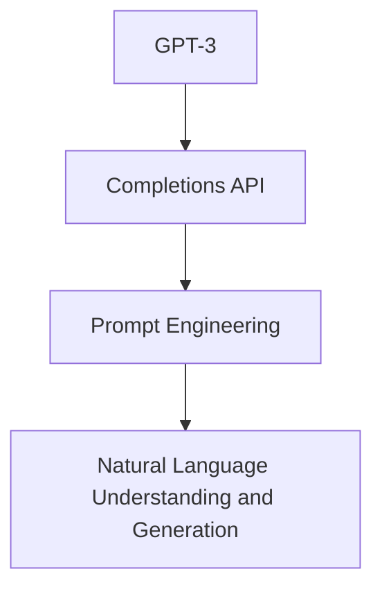

                 

# OpenAI Completions API

> 关键词：OpenAI, GPT-3, Completions API, Prompt Engineering, Natural Language Processing

## 1. 背景介绍

在人工智能领域，语言模型正迅速成为核心技术之一。OpenAI的GPT-3作为最先进的语言模型之一，已经在自然语言处理(NLP)和生成式模型上取得了显著的进步。其强大的语言理解和生成能力，使其在各种任务中表现出色。

然而，GPT-3等大型语言模型的直接使用，对于大多数用户来说，门槛较高，并且可能存在隐私和安全问题。为了使得这些模型更加易于使用和部署，OpenAI推出了Completions API，让开发者和研究人员可以轻松地将GPT-3集成到自己的应用中。

Completions API旨在提供一种便捷、安全、高效的方式来利用GPT-3的能力，同时保护用户隐私和模型版权。本文将详细探讨Completions API的核心概念、工作原理和应用场景，为开发者提供一个全面的指南。

## 2. 核心概念与联系

### 2.1 核心概念概述

为了更好地理解Completions API，我们先来梳理一下相关的核心概念：

- **GPT-3**：OpenAI开发的基于Transformer模型的语言模型，通过自监督学习和指令微调获得了卓越的语言生成能力。
- **Prompt Engineering**：设计有效的输入文本，引导GPT-3生成所需输出。
- **Completions API**：OpenAI提供的API，允许开发者通过HTTP请求的方式，使用GPT-3完成特定的自然语言处理任务。
- **Natural Language Understanding and Generation**：利用GPT-3进行文本理解、文本生成、对话生成、摘要生成等任务。

这些概念之间的联系和关系可以用以下Mermaid流程图来展示：



这个流程图展示了GPT-3如何通过Completions API和Prompt Engineering技术，实现自然语言理解和生成任务。

### 2.2 概念间的关系

- **GPT-3与Completions API**：GPT-3是大模型本身，而Completions API是使用GPT-3的一个接口，用于向模型输入指令并获取输出。
- **Completions API与Prompt Engineering**：Completions API提供的请求方式和API参数设计，需要依靠Prompt Engineering技术来设计有效的输入，从而得到期望的输出。
- **Prompt Engineering与Natural Language Understanding and Generation**：有效的Prompt设计可以引导模型生成高质量的文本，实现文本理解、文本生成等自然语言处理任务。

## 3. 核心算法原理 & 具体操作步骤

### 3.1 算法原理概述

Completions API的核心原理是通过HTTP请求，将用户的输入文本作为Prompt传递给GPT-3，GPT-3通过理解Prompt，自动生成相应的输出。该过程包括四个主要步骤：

1. **Prompt Design**：设计一个有效的Prompt，引导GPT-3生成所需输出。
2. **API Request**：向Completions API发送请求，传递Prompt。
3. **Response Processing**：接收API返回的输出，并进行后处理。
4. **Output Analysis**：对输出结果进行分析，应用到具体的任务中。

### 3.2 算法步骤详解

以下我们以生成文本摘要为例，详细介绍使用Completions API的详细步骤：

**Step 1: 设计Prompt**

Prompt的设计是Completions API成功的关键。一个好的Prompt应该能够清晰地表达任务需求，引导模型生成符合要求的输出。

```plaintext
Here is a news article about [topic]:
[Your article here]

What is a concise summary of the article?
```

在上面的Prompt中，"[topic]"和"[Your article here]"将被替换为具体的新闻主题和文章内容。

**Step 2: 发送API请求**

使用HTTP POST方法，向Completions API发送请求，指定API endpoint和请求参数。

```plaintext
POST /v1/completions
Content-Type: application/json
```

请求体包含以下参数：

- `model`：指定使用的GPT-3模型，可以是davinci或text-davinci-003。
- `prompt`：包含Prompt文本的JSON对象。
- `max_tokens`：指定输出最大token数，通常为50至150。

示例请求如下：

```json
{
    "prompt": "Here is a news article about climate change: Climate change is a long-term alteration of the planet's climate patterns. What is a concise summary of the article?",
    "max_tokens": 100
}
```

**Step 3: 处理API响应**

接收Completions API返回的输出，并进行后处理。

```json
{
    "choices": [
        {
            "text": "Climate change is the long-term alteration of the planet's climate patterns.",
            "logprobs": 0.014,
            "finish_reason": "finished"
        }
    ]
}
```

**Step 4: 应用输出结果**

根据API返回的输出结果，进行进一步的处理和应用。

例如，从API返回的摘要中提取关键信息，生成最终的文本摘要。

### 3.3 算法优缺点

**优点：**

- **易用性**：Completions API提供了简洁的HTTP接口，无需复杂的模型部署和训练。
- **广泛适用性**：适用于多种自然语言处理任务，如文本生成、对话生成、摘要生成等。
- **高质量输出**：GPT-3的强大语言生成能力，能够生成高质量、连贯的文本。

**缺点：**

- **资源消耗**：尽管Completions API可以处理大规模输入，但处理复杂Prompt时，仍可能面临高计算和内存消耗。
- **依赖提示设计**：Prompt设计质量直接影响模型输出，需要花费大量时间优化。
- **价格问题**：Completions API按使用量计费，大量使用可能带来高昂成本。

### 3.4 算法应用领域

Completions API在多个领域中都有广泛的应用，具体包括：

- **文本生成**：生成文章、报告、论文、博客等。
- **对话生成**：构建智能客服、虚拟助手、聊天机器人等。
- **摘要生成**：从长文本中自动生成摘要，如新闻、文档等。
- **翻译**：自动翻译文本，支持多种语言。
- **问答系统**：自动回答用户提问，如知识图谱驱动的问答系统。
- **推荐系统**：根据用户行为生成推荐内容。

## 4. 数学模型和公式 & 详细讲解 & 举例说明

### 4.1 数学模型构建

Completions API的数学模型基于Transformer模型，通过对大量文本进行自监督学习，学习语言的表示和生成能力。该模型可以表示为：

$$ y = f(x; \theta) $$

其中，$x$ 为输入文本，$y$ 为输出文本，$\theta$ 为模型参数。

### 4.2 公式推导过程

对于自然语言处理任务，Completions API使用了softmax函数作为输出层，以计算每个token为输出的概率。具体推导如下：

1. 计算模型在输入文本上的表示：

$$ h(x) = g(x; \theta) $$

2. 计算模型在输出文本上的表示：

$$ h(y) = g(y; \theta) $$

3. 计算输出文本的概率：

$$ p(y | x) = \frac{e^{h(y) \cdot w}}{\sum_{y'} e^{h(y') \cdot w}} $$

其中，$g(x; \theta)$ 为输入文本到模型输出的映射，$w$ 为模型参数，$e$ 为自然对数的底数。

### 4.3 案例分析与讲解

以下是一个简单的文本生成案例，用于说明Completions API的基本使用过程。

假设我们希望生成一个关于“气候变化”的文本摘要。首先，我们设计Prompt：

```plaintext
Here is a news article about climate change: Climate change is a long-term alteration of the planet's climate patterns. What is a concise summary of the article?
```

然后，我们将Prompt传递给Completions API：

```json
{
    "prompt": "Here is a news article about climate change: Climate change is a long-term alteration of the planet's climate patterns. What is a concise summary of the article?",
    "max_tokens": 100
}
```

最终，API返回的摘要为：

```plaintext
Climate change is the long-term alteration of the planet's climate patterns.
```

## 5. 项目实践：代码实例和详细解释说明

### 5.1 开发环境搭建

在使用Completions API前，需要搭建好开发环境。以下是使用Python和OpenAI官方SDK进行Completions API开发的流程：

1. 安装OpenAI Python SDK：

```bash
pip install openai
```

2. 创建OpenAI API密钥：

```python
import openai

openai.api_key = "your_api_key"
```

### 5.2 源代码详细实现

以下是一个使用Completions API生成文本摘要的Python代码示例：

```python
import openai

openai.api_key = "your_api_key"

prompt = "Here is a news article about climate change: Climate change is a long-term alteration of the planet's climate patterns. What is a concise summary of the article?"

response = openai.Completion.create(
    engine="davinci",
    prompt=prompt,
    max_tokens=100
)

print(response.choices[0].text)
```

### 5.3 代码解读与分析

在代码中，我们首先导入了OpenAI Python SDK，并设置了API密钥。然后，我们设计了一个Prompt，传递给Completions API的`create`方法，指定了使用的模型和最大输出token数。最后，我们输出了API返回的第一个choice的文本内容。

### 5.4 运行结果展示

假设API返回的摘要为：

```plaintext
Climate change is the long-term alteration of the planet's climate patterns.
```

我们可以看到，通过Completions API，我们成功生成了一个关于“气候变化”的文本摘要。

## 6. 实际应用场景

### 6.1 智能客服系统

Completions API可以用于构建智能客服系统，提升客户服务体验。通过API，系统可以根据用户输入的问题，自动生成合适的回复，减少人工客服的工作量。

### 6.2 虚拟助手

Completions API可以用于开发虚拟助手，帮助用户完成任务，如日程安排、信息检索等。通过Prompt设计，系统可以生成详细的步骤和建议。

### 6.3 内容生成

Completions API可以用于生成文章、报告、博客等文本内容。通过设计和优化Prompt，生成高质量、连贯的文本，降低内容创作的难度和成本。

### 6.4 未来应用展望

未来，Completions API有望在更多领域中得到应用，如医疗、教育、金融等。随着技术的发展和应用的深入，Completions API将变得更加强大和智能，成为开发者不可或缺的工具。

## 7. 工具和资源推荐

### 7.1 学习资源推荐

为了帮助开发者深入理解Completions API，以下是一些优质的学习资源：

1. OpenAI Completions API官方文档：提供了API的详细说明和使用示例，是学习Completions API的首选资源。
2. Hugging Face Transformers：介绍了如何使用Completions API进行自然语言处理任务，提供了丰富的样例代码。
3. Coursera和Udacity的NLP课程：提供了NLP领域的系统学习课程，包括Completions API的使用。
4. OpenAI GPT-3论文：详细介绍了GPT-3模型的原理和架构，是了解Completions API的底层基础的重要参考。

### 7.2 开发工具推荐

以下是几款用于Completions API开发的常用工具：

1. VS Code：微软推出的开源编辑器，支持多语言的开发，适合Completions API的Python开发。
2. GitHub：版本控制和协作平台，便于存储和共享代码。
3. Jupyter Notebook：交互式笔记本，适合编写和调试Completions API代码。
4. PyCharm：Google推出的IDE，支持Python开发，提供了丰富的调试和分析工具。

### 7.3 相关论文推荐

以下是几篇关于Completions API和GPT-3的著名论文，推荐阅读：

1. "Leveraging Pre-trained Models for Natural Language Processing"：介绍了使用预训练模型进行自然语言处理的基本方法和Completions API的使用。
2. "Explainable AI: A Guide"：介绍了如何提高模型可解释性的方法，包括Completions API的应用。
3. "Building Efficient Language Models"：介绍了如何构建高效的语言模型，包括参数高效的微调方法。

## 8. 总结：未来发展趋势与挑战

### 8.1 总结

本文详细介绍了Completions API的核心概念、工作原理和应用场景，为开发者提供了一个全面的指南。Completions API使得大语言模型GPT-3更加易于使用和集成，推动了自然语言处理技术的普及和发展。

### 8.2 未来发展趋势

未来，Completions API将继续发展，展现出以下趋势：

1. **参数高效的微调方法**：开发更多的参数高效微调方法，进一步提高模型的运行效率。
2. **多语言支持**：支持更多语言，提升Completions API的国际化和通用性。
3. **增强Prompt设计工具**：开发更智能的Prompt设计工具，帮助用户设计出更有效的Prompt。
4. **提升安全性**：增强API的安全性和隐私保护措施，确保用户数据安全。
5. **实时API支持**：支持实时API请求，降低API响应时间。

### 8.3 面临的挑战

尽管Completions API取得了显著进展，但仍面临一些挑战：

1. **Prompt设计复杂性**：设计和优化Prompt需要花费大量时间和精力，特别是对于复杂的任务。
2. **计算资源消耗**：大规模Prompt处理会消耗大量计算资源，需要优化API的计算效率。
3. **API成本问题**：Completions API按使用量计费，高量使用可能带来高昂成本。

### 8.4 研究展望

未来的研究需要在以下几个方面进行深入探索：

1. **Prompt自动设计**：开发自动化的Prompt设计工具，减少人工干预。
2. **模型压缩与优化**：开发模型压缩与优化技术，提高模型的计算效率和实时性。
3. **多模态融合**：探索将文本与图像、语音等模态信息结合，提升模型的多模态处理能力。
4. **数据隐私保护**：研究隐私保护技术，保护用户数据隐私和模型版权。

## 9. 附录：常见问题与解答

**Q1: Completions API的响应时间如何？**

A: Completions API的响应时间取决于API请求的复杂性和模型的计算资源。在处理大规模Prompt时，响应时间较长，需要优化API的计算效率。

**Q2: 如何优化Completions API的计算效率？**

A: 优化Completions API的计算效率可以通过以下方法实现：

1. **批量请求**：将多个API请求合并为一个请求，减少API调用次数。
2. **减少最大token数**：在处理大规模Prompt时，减少最大token数，降低计算资源消耗。
3. **模型微调**：使用参数高效的微调方法，减少模型参数量，提高计算效率。

**Q3: Completions API是否可以处理中文？**

A: 目前Completions API主要支持英文，对于中文用户，可以使用OpenAI提供的Prompt Engineering技术，设计适合的中文Prompt进行使用。

**Q4: 如何提升Completions API的安全性？**

A: 提升Completions API的安全性可以通过以下方法实现：

1. **API密钥管理**：使用API密钥管理工具，确保密钥的安全存储和传输。
2. **数据加密**：对用户数据进行加密，防止数据泄露。
3. **访问控制**：设置API访问权限，确保只有授权用户可以访问API。

**Q5: 如何设计有效的Prompt？**

A: 设计有效的Prompt需要考虑以下因素：

1. **任务明确性**：Prompt需要明确表达任务需求，引导模型生成正确的输出。
2. **上下文相关性**：Prompt需要包含足够的上下文信息，帮助模型理解任务背景。
3. **简洁性**：Prompt需要简洁明了，避免冗长和复杂的文本。

**Q6: 如何降低Completions API的使用成本？**

A: 降低Completions API的使用成本可以通过以下方法实现：

1. **批量请求**：将多个API请求合并为一个请求，减少API调用次数。
2. **优化Prompt设计**：设计简洁有效的Prompt，减少API响应时间和计算资源消耗。
3. **使用免费API**：OpenAI提供免费的API使用额度，合理使用这些免费额度，可以降低API使用成本。

总之，Completions API为开发者提供了一种便捷、高效、高质量的自然语言处理解决方案。通过了解其核心概念、工作原理和应用场景，开发者可以更好地利用Completions API，推动自然语言处理技术的普及和发展。

