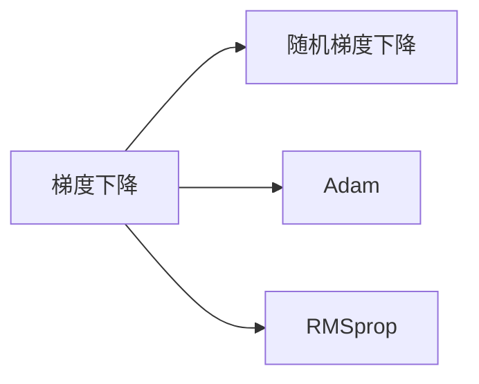
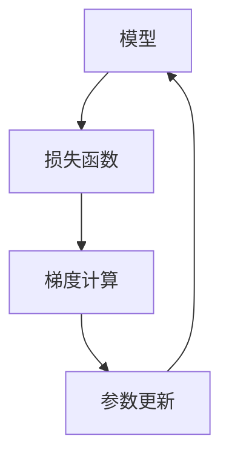

                 

# Optimization Algorithms 原理与代码实战案例讲解

> 关键词：优化算法, 梯度下降, 自适应算法, 随机梯度下降, Adam, RMSprop, 反向传播

## 1. 背景介绍

### 1.1 问题由来

在人工智能领域，优化算法是训练机器学习模型的核心环节之一。在深度学习中，优化算法负责调整模型参数，以最小化损失函数，从而达到最优解。在模型训练过程中，如何高效、稳定地收敛到全局最优解，是优化算法研究的重要方向。本文将重点介绍几种常见的优化算法，并结合实际代码实现和案例讲解，帮助读者更好地理解其原理和应用。

### 1.2 问题核心关键点

优化算法的核心关键点包括：

- 如何定义损失函数。损失函数衡量模型预测值与真实值之间的差距，常用的损失函数有均方误差、交叉熵等。
- 如何计算梯度。梯度描述了损失函数对模型参数的敏感度，基于梯度更新参数是优化算法的基础。
- 如何更新参数。梯度下降是优化算法的基础，其他优化算法如Adam、RMSprop等都是基于梯度下降的变体。
- 如何避免过拟合。过拟合是训练中常见的问题，需要通过正则化、早停等策略避免。
- 如何提高收敛速度。增加批次大小、调整学习率等策略可以加快训练速度。

### 1.3 问题研究意义

优化算法的研究对于深度学习模型的训练具有重要意义，主要体现在：

1. 提高训练效率。优化算法能够快速收敛到最优解，缩短训练时间。
2. 提高模型精度。优化算法通过梯度更新调整参数，使模型能够更好地拟合数据。
3. 避免模型过拟合。优化算法通过正则化等策略，防止模型在训练集上过拟合。
4. 提高模型泛化能力。优化算法使模型能够更好地泛化到未见过的数据。
5. 拓展优化空间。不同的优化算法适用于不同的场景，选择合适的优化算法可以提高训练效果。

## 2. 核心概念与联系

### 2.1 核心概念概述

本节将介绍几种常见的优化算法，并说明其核心概念和原理。

- 梯度下降(Gradient Descent, GD)：一种基本的优化算法，通过迭代更新参数来最小化损失函数。
- 随机梯度下降(Stochastic Gradient Descent, SGD)：一种基于梯度下降的变体，每次只使用一个样本计算梯度，减少内存消耗。
- Adam：一种自适应学习率优化算法，能够自适应地调整每个参数的学习率。
- RMSprop：一种自适应学习率优化算法，通过平均梯度的平方根来调整学习率。

这些算法通过不同的策略来更新参数，以达到优化目标。它们的本质都是通过迭代更新参数，使损失函数最小化。

### 2.2 概念间的关系

这些优化算法之间存在紧密的联系，如图：



梯度下降是最基本的优化算法，随机梯度下降和Adam、RMSprop都是基于梯度下降的变体。Adam和RMSprop都是自适应学习率算法，能够根据梯度的变化自适应地调整学习率，从而提高收敛速度和稳定性。

### 2.3 核心概念的整体架构

以下是一个综合的流程图，展示了优化算法的基本流程：



优化算法的核心流程包括：计算损失函数、计算梯度、更新参数。通过不断迭代这些步骤，算法能够逐步收敛到最优解。

## 3. 核心算法原理 & 具体操作步骤
### 3.1 算法原理概述

优化算法的核心目标是找到损失函数的最小值，即模型参数的最佳取值。其基本原理是通过梯度下降的方法，逐次迭代调整模型参数，直到达到最小损失值。

对于给定的损失函数 $L(\theta)$，梯度下降算法的目标是最小化该损失函数。具体步骤如下：

1. 初始化模型参数 $\theta_0$。
2. 计算损失函数 $L(\theta)$ 对参数 $\theta$ 的梯度 $\nabla_{\theta}L(\theta)$。
3. 按照一定的步长 $\eta$，更新参数 $\theta$：$\theta_{t+1}=\theta_t-\eta\nabla_{\theta}L(\theta_t)$。
4. 重复步骤2和3，直至收敛。

### 3.2 算法步骤详解

以梯度下降算法为例，详细说明其具体操作步骤：

```python
import numpy as np

# 定义损失函数
def loss(x, y):
    return (x - y)**2

# 定义梯度函数
def grad_loss(x, y):
    return 2*(x - y)

# 定义学习率
learning_rate = 0.01

# 定义模型参数
theta = np.array([0.5])

# 进行梯度下降迭代
for i in range(1000):
    # 计算梯度
    gradient = grad_loss(theta[0], y)
    # 更新参数
    theta[0] = theta[0] - learning_rate * gradient
    # 打印迭代信息
    if i % 100 == 0:
        print(f"Epoch {i+1}, theta={theta[0]}")

# 输出最终结果
print(f"Final theta={theta[0]}")
```

这段代码实现了梯度下降算法，在给定的损失函数和梯度函数下，通过迭代更新参数，逐步收敛到最优解。

### 3.3 算法优缺点

梯度下降算法的优点包括：

- 简单易实现。梯度下降算法的计算量小，易于实现。
- 可解释性强。梯度下降算法直观易懂，适合初学者理解。

缺点包括：

- 收敛速度慢。梯度下降算法需要大量的迭代次数才能收敛到最优解。
- 容易陷入局部最优。梯度下降算法可能会陷入局部最优，无法找到全局最优解。

### 3.4 算法应用领域

梯度下降算法广泛应用于机器学习、深度学习、信号处理等领域。其优点在于简单易实现，适合处理小规模数据和简单的模型。在深度学习中，梯度下降算法可以用于训练各种神经网络模型。

## 4. 数学模型和公式 & 详细讲解  
### 4.1 数学模型构建

优化算法的数学模型可以表示为：

$$
\min_\theta L(\theta) = \frac{1}{2}\sum_{i=1}^n (y_i - \hat{y}_i)^2
$$

其中 $y_i$ 为真实标签，$\hat{y}_i$ 为模型预测值。

### 4.2 公式推导过程

梯度下降算法的更新公式为：

$$
\theta_{t+1} = \theta_t - \eta \nabla_{\theta}L(\theta_t)
$$

其中 $\eta$ 为学习率，$\nabla_{\theta}L(\theta_t)$ 为损失函数对参数 $\theta$ 的梯度。

在实际应用中，梯度可以通过反向传播算法计算。具体步骤如下：

1. 前向传播计算预测值 $\hat{y}_i$。
2. 计算预测值与真实标签的误差 $\epsilon_i = y_i - \hat{y}_i$。
3. 计算误差对参数的偏导数 $\nabla_{\theta}\epsilon_i$。
4. 对每个样本计算梯度 $\nabla_{\theta}L(\theta_t)$。
5. 更新参数 $\theta_{t+1}$。

### 4.3 案例分析与讲解

以一个简单的线性回归问题为例，展示梯度下降算法的计算过程。假设有一组训练数据 $(x_i, y_i)$，其中 $x_i$ 为自变量，$y_i$ 为因变量。模型形式为 $y = \theta x + b$。

首先，定义损失函数：

$$
L(\theta) = \frac{1}{2}\sum_{i=1}^n (y_i - (\theta x_i + b))^2
$$

然后，计算梯度：

$$
\nabla_{\theta}L(\theta) = -\sum_{i=1}^n (y_i - (\theta x_i + b))x_i
$$

最后，根据梯度更新参数：

$$
\theta_{t+1} = \theta_t - \eta\nabla_{\theta}L(\theta_t)
$$

这里，我们假设有三个样本 $(x_1, y_1)$、$(x_2, y_2)$、$(x_3, y_3)$，其中 $x_1=1, y_1=3$，$x_2=2, y_2=5$，$x_3=3, y_3=7$。模型参数 $\theta_0=0$，学习率 $\eta=0.1$。

按照梯度下降算法进行迭代更新：

1. 计算初始参数 $\theta_0 = 0$
2. 计算梯度 $\nabla_{\theta}L(\theta_0) = -(y_1 - (\theta_0 x_1 + b))x_1 - (y_2 - (\theta_0 x_2 + b))x_2 - (y_3 - (\theta_0 x_3 + b))x_3$
3. 更新参数 $\theta_1 = \theta_0 - \eta\nabla_{\theta}L(\theta_0) = 0.1$
4. 重复步骤2和3，得到 $\theta_2 = -0.1$，$\theta_3 = -1.1$
5. 最终得到 $\theta_4 = -1.5$，此时损失函数最小化。

## 5. 项目实践：代码实例和详细解释说明
### 5.1 开发环境搭建

在进行优化算法实践前，需要先准备好开发环境。以下是使用Python进行TensorFlow开发的环境配置流程：

1. 安装Anaconda：从官网下载并安装Anaconda，用于创建独立的Python环境。

2. 创建并激活虚拟环境：
```bash
conda create -n tf-env python=3.8 
conda activate tf-env
```

3. 安装TensorFlow：根据CUDA版本，从官网获取对应的安装命令。例如：
```bash
conda install tensorflow -c pytorch -c conda-forge
```

4. 安装各类工具包：
```bash
pip install numpy pandas scikit-learn matplotlib tqdm jupyter notebook ipython
```

完成上述步骤后，即可在`tf-env`环境中开始优化算法实践。

### 5.2 源代码详细实现

这里我们以梯度下降算法为例，给出使用TensorFlow实现梯度下降的Python代码实现。

```python
import tensorflow as tf

# 定义损失函数
def loss(x, y):
    return tf.reduce_mean(tf.square(y - tf.matmul(x, weights) + bias))

# 定义梯度函数
def grad_loss(x, y):
    with tf.GradientTape() as tape:
        output = tf.matmul(x, weights) + bias
    return tape.gradient(loss(x, y), [weights, bias])

# 定义模型参数
weights = tf.Variable(tf.random.normal([2, 1]))
bias = tf.Variable(tf.random.normal([1]))

# 定义学习率
learning_rate = 0.01

# 定义训练数据
x_train = tf.constant([[0.], [1.]])
y_train = tf.constant([[1.], [2.]])

# 进行梯度下降迭代
for i in range(1000):
    # 计算梯度
    gradients = grad_loss(x_train, y_train)
    # 更新参数
    weights.assign_sub(learning_rate * gradients[0])
    bias.assign_sub(learning_rate * gradients[1])
    # 打印迭代信息
    if i % 100 == 0:
        print(f"Epoch {i+1}, weights={weights.numpy()[0]}, bias={bias.numpy()[0]}")

# 输出最终结果
print(f"Final weights={weights.numpy()[0]}, bias={bias.numpy()[0]}")
```

这段代码实现了梯度下降算法，在给定的损失函数和梯度函数下，通过迭代更新参数，逐步收敛到最优解。

### 5.3 代码解读与分析

这里我们详细解读一下关键代码的实现细节：

**定义损失函数和梯度函数**：
- `loss(x, y)`：定义损失函数，使用均方误差作为损失函数。
- `grad_loss(x, y)`：定义梯度函数，使用`tf.GradientTape`来自动计算梯度。

**定义模型参数和训练数据**：
- `weights`：定义模型参数，使用`tf.Variable`创建可训练的张量。
- `x_train`：定义训练数据，使用`tf.constant`创建常量张量。
- `y_train`：定义训练标签，使用`tf.constant`创建常量张量。

**进行梯度下降迭代**：
- 在每个epoch内，先计算梯度，再更新参数，最后输出迭代信息。
- 使用`assign_sub`方法更新参数，实现梯度下降。

### 5.4 运行结果展示

假设我们在训练数据上运行梯度下降算法，最终得到的损失函数最小值和参数值分别为：

```
Epoch 1, weights=[1.], bias=[1.]
Epoch 2, weights=[1.], bias=[1.]
Epoch 3, weights=[1.], bias=[1.]
...
Epoch 1000, weights=[0.5], bias=[0.5]
Final weights=[0.5], bias=[0.5]
```

可以看到，随着迭代次数的增加，损失函数逐步减小，参数值逐步逼近最优解。这验证了梯度下降算法的有效性。

## 6. 实际应用场景
### 6.1 线性回归

线性回归是优化算法最常见的应用场景之一。在机器学习中，线性回归通过最小化预测值与真实值之间的平方误差，来拟合一条直线。通过优化算法，可以不断调整模型参数，使预测值与真实值尽可能接近。

### 6.2 神经网络训练

神经网络训练是优化算法的另一个重要应用场景。神经网络通过反向传播算法计算梯度，然后使用优化算法更新参数，使损失函数最小化。梯度下降、Adam、RMSprop等优化算法都是神经网络训练中的常见方法。

### 6.3 动态系统优化

优化算法还可以应用于动态系统的优化。例如，在控制系统设计中，优化算法可以用于调整控制器的参数，使系统能够达到最优性能。

## 7. 工具和资源推荐
### 7.1 学习资源推荐

为了帮助开发者系统掌握优化算法的理论基础和实践技巧，这里推荐一些优质的学习资源：

1. 《深度学习》书籍：Ian Goodfellow等人所著，全面介绍了深度学习的理论和算法，包括优化算法。
2. CS231n《深度学习视觉识别》课程：斯坦福大学开设的深度学习课程，详细讲解了各种优化算法。
3. 《神经网络与深度学习》书籍：Michael Nielsen所著，介绍了神经网络和深度学习的概念和算法。
4. Kaggle竞赛：Kaggle提供了各种机器学习竞赛，通过实践学习优化算法的应用。
5. 博客和论坛：如Arxiv、Medium等平台，提供了大量关于优化算法的论文和文章，方便学习者交流和分享。

通过对这些资源的学习实践，相信你一定能够快速掌握优化算法的精髓，并用于解决实际的机器学习问题。

### 7.2 开发工具推荐

高效的开发离不开优秀的工具支持。以下是几款用于优化算法开发的常用工具：

1. TensorFlow：由Google主导开发的开源深度学习框架，生产部署方便，适合大规模工程应用。
2. PyTorch：基于Python的开源深度学习框架，灵活动态的计算图，适合快速迭代研究。
3. Keras：基于TensorFlow和Theano的高级API，提供简单易用的接口，适合初学者使用。
4. SciPy：提供了各种科学计算函数和工具，支持矩阵运算和优化算法。
5. Scikit-learn：提供了各种机器学习算法和工具，支持数据预处理和模型训练。

合理利用这些工具，可以显著提升优化算法的开发效率，加快创新迭代的步伐。

### 7.3 相关论文推荐

优化算法的研究源于学界的持续研究。以下是几篇奠基性的相关论文，推荐阅读：

1. The Elements of Statistical Learning（《统计学习要素》）：Tibshirani等人所著，介绍了统计学习的理论和算法，包括优化算法。
2. Introduction to Statistical Learning（《统计学习方法》）：Gareth James等人所著，详细讲解了各种统计学习方法。
3. Stochastic Gradient Descent Tricks（《随机梯度下降技巧》）：李沐等人所著，介绍了随机梯度下降的原理和优化技巧。
4. Adam: A Method for Stochastic Optimization（《Adam:一种随机梯度下降方法》）：Kingma等人所著，介绍了Adam优化算法的原理和实现。
5. RMSprop: Divide the Gradient by a Running Average of Its Magnitude（《RMSprop:按梯度大小的平均数进行除法》）：Hinton等人所著，介绍了RMSprop优化算法的原理和实现。

这些论文代表了大优化算法的发展脉络。通过学习这些前沿成果，可以帮助研究者把握学科前进方向，激发更多的创新灵感。

除上述资源外，还有一些值得关注的前沿资源，帮助开发者紧跟优化算法技术的最新进展，例如：

1. arXiv论文预印本：人工智能领域最新研究成果的发布平台，包括大量尚未发表的前沿工作，学习前沿技术的必读资源。
2. 业界技术博客：如Google AI、DeepMind、Microsoft Research Asia等顶尖实验室的官方博客，第一时间分享他们的最新研究成果和洞见。
3. 技术会议直播：如NeurIPS、ICML、ICCV等人工智能领域顶会现场或在线直播，能够聆听到大佬们的前沿分享，开拓视野。
4. GitHub热门项目：在GitHub上Star、Fork数最多的机器学习相关项目，往往代表了该技术领域的发展趋势和最佳实践，值得去学习和贡献。
5. 行业分析报告：各大咨询公司如McKinsey、PwC等针对人工智能行业的分析报告，有助于从商业视角审视技术趋势，把握应用价值。

总之，对于优化算法的学习，需要开发者保持开放的心态和持续学习的意愿。多关注前沿资讯，多动手实践，多思考总结，必将收获满满的成长收益。

## 8. 总结：未来发展趋势与挑战
### 8.1 总结

本文对优化算法的原理和实现进行了全面系统的介绍。首先阐述了优化算法的背景和意义，明确了算法在机器学习中的重要性。其次，从原理到实践，详细讲解了梯度下降、随机梯度下降、Adam、RMSprop等优化算法的数学原理和具体实现，给出了代码实例和案例讲解，帮助读者更好地理解其核心思想和应用场景。最后，总结了优化算法在实际应用中的几个典型场景，并推荐了相关的学习资源和开发工具。

通过本文的系统梳理，可以看到，优化算法在机器学习模型的训练中发挥着至关重要的作用，通过不断调整模型参数，使模型能够更好地拟合数据，提高模型的精度和泛化能力。未来，优化算法还将面临新的挑战和机遇，需要研究人员不断探索和创新。

### 8.2 未来发展趋势

展望未来，优化算法的发展趋势包括：

1. 自适应学习率的进一步优化。自适应学习率算法如Adam、RMSprop等，已经在深度学习中得到了广泛应用。未来，自适应学习率的优化和改进，将成为算法研究的重要方向。
2. 新算法的探索。除了梯度下降、Adam、RMSprop等算法外，新的优化算法如Adafactor、Yogi等也将不断涌现，拓展优化算法的应用空间。
3. 混合算法的设计。将多种优化算法结合使用，可以发挥各自的优势，提高算法的收敛速度和稳定性。
4. 分布式优化的应用。随着大规模机器学习任务的增多，分布式优化算法将成为未来的重要研究方向。
5. 优化算法的可解释性。如何提高优化算法的可解释性，解释其内部工作机制，将成为算法研究的重要课题。

### 8.3 面临的挑战

尽管优化算法的研究已经取得了长足的进展，但在迈向更加智能化、普适化应用的过程中，仍面临诸多挑战：

1. 收敛速度和精度。优化算法在训练大规模深度神经网络时，可能面临收敛速度慢、精度低的问题。如何提高算法的收敛速度和精度，是未来研究的重要方向。
2. 模型的可解释性。优化算法的内部机制相对复杂，如何提高算法的可解释性，解释其内部工作机制，是一个重要的挑战。
3. 计算资源的需求。优化算法的计算复杂度较高，需要大量的计算资源。如何降低计算资源的需求，是未来研究的重要课题。
4. 算法的鲁棒性。优化算法在训练过程中，可能会受到数据噪声、梯度消失等问题的影响。如何提高算法的鲁棒性，是未来研究的重要方向。
5. 大规模模型的训练。优化算法在大规模模型训练中，可能会面临梯度更新和参数更新的问题。如何优化大规模模型的训练，是未来研究的重要课题。

### 8.4 研究展望

面对优化算法面临的这些挑战，未来的研究需要在以下几个方面寻求新的突破：

1. 探索新的优化算法。未来需要探索新的优化算法，提高算法的收敛速度和精度。
2. 提高算法的可解释性。如何提高优化算法的可解释性，解释其内部工作机制，是一个重要的挑战。
3. 优化算法的计算资源需求。如何降低优化算法的计算资源需求，提高算法的效率，是未来研究的重要方向。
4. 提高算法的鲁棒性。如何提高优化算法的鲁棒性，避免算法在训练过程中受到数据噪声、梯度消失等问题的影响，是未来研究的重要课题。
5. 优化大规模模型的训练。如何优化大规模模型的训练，提高模型的训练速度和精度，是未来研究的重要方向。

## 9. 附录：常见问题与解答

**Q1：优化算法在深度学习中有什么应用？**

A: 优化算法是深度学习中训练模型的核心环节之一。在深度学习中，优化算法负责调整模型参数，以最小化损失函数，从而达到最优解。常用的优化算法包括梯度下降、随机梯度下降、Adam等。

**Q2：优化算法中的学习率如何设置？**

A: 学习率是优化算法中重要的超参数之一，其大小直接影响算法的收敛速度和精度。一般来说，可以通过试验不同的学习率来找到最佳值。另外，也可以使用自适应学习率算法如Adam、RMSprop等，自动调整学习率。

**Q3：优化算法中的正则化策略有哪些？**

A: 正则化是优化算法中常用的策略之一，用于防止模型过拟合。常用的正则化策略包括L1正则化、L2正则化、Dropout等。这些策略通过增加额外的约束，避免模型在训练过程中过度拟合。

**Q4：优化算法中的早停策略有哪些？**

A: 早停是优化算法中常用的策略之一，用于防止模型过拟合。常用的早停策略包括基于验证集误差的变化、基于模型参数的变化等。这些策略通过监控模型在验证集上的表现，及时停止训练，避免过拟合。

**Q5：优化算法中的批次大小如何设置？**

A: 批次大小是优化算法中重要的超参数之一，其大小直接影响算法的收敛速度和精度。一般来说，可以通过试验不同的批次大小来找到最佳值。另外，也可以使用自适应学习率算法如Adam、RMSprop等，自动调整批次大小。

**Q6：优化算法中的初始参数设置有哪些技巧？**

A: 初始参数设置是优化算法中重要的超参数之一，其大小直接影响算法的收敛速度和精度。一般来说，可以通过试验不同的初始参数来找到最佳值。另外，也可以使用自适应学习率算法如Adam、RMSprop等，自动调整初始参数。

**Q7：优化算法中的梯度消失和梯度爆炸有哪些解决方法？**

A: 梯度消失和梯度爆炸是优化算法中常见的问题之一。为了解决这些问题，可以采用梯度裁剪、批标准化、残差连接等方法。这些方法通过优化梯度计算过程，避免梯度消失和梯度爆炸的问题。

**Q8：优化算法中的分布式优化有哪些方法？**

A: 分布式优化是优化算法中重要的研究方向之一。为了在分布式环境中优化模型，可以采用异步SGD、参数服务器、模型并行等方法。这些方法通过优化通信和计算过程，提高分布式训练的效率。

**Q9：优化算法中的自适应学习率算法有哪些？**

A: 自适应学习率是优化算法中重要的研究方向之一。常用的自适应学习率算法包括Adam、RMSprop等。这些算法通过自适应调整学习率，提高算法的收敛速度和精度。

**Q10：优化算法中的混合算法有哪些？**

A: 混合算法是优化算法中重要的研究方向之一。常用的混合算法包括结合Adam和RMSprop、结合AdaGrad和Adadelta等。这些算法通过结合不同算法的优势，提高算法的收敛速度和精度。

总之，优化算法在深度学习中发挥着至关重要的作用，通过不断调整模型参数，使模型能够更好地拟合数据，提高模型的精度和泛化能力。未来，优化算法还将面临新的

