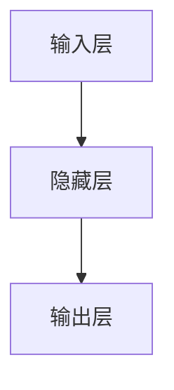
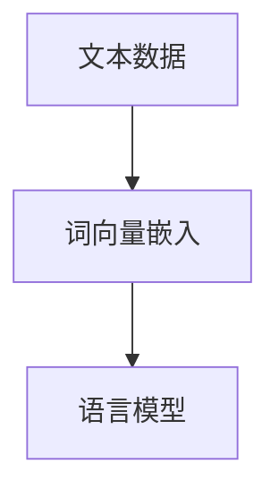
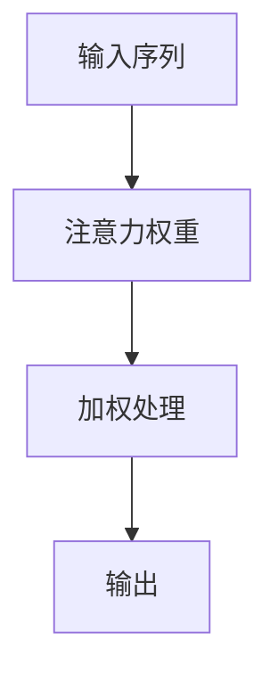
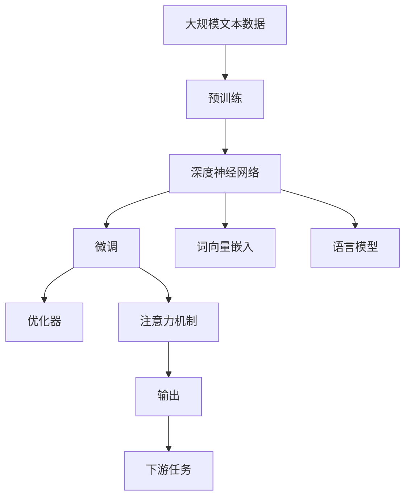

                 

# 一切皆是映射：深度学习与人类语言理解

> 关键词：深度学习, 语言理解, 自然语言处理(NLP), 神经网络, 映射函数, 模型优化, 人工神经元, 误差反向传播, 注意力机制

## 1. 背景介绍

### 1.1 问题由来
深度学习技术的发展，特别是深度神经网络的兴起，使得计算机能够以惊人的精度理解和生成人类语言。从简单的词向量嵌入，到复杂的语言模型，再到广泛的自然语言处理(NLP)任务，深度学习技术在语言理解方面取得了显著进展。然而，理解人类语言的奥秘远未被完全揭开，如何更好地捕捉语言的语义、语法和上下文关联，仍然是深度学习研究的重要方向。

### 1.2 问题核心关键点
人类语言是一种高度抽象、复杂和多变的符号系统。深度学习模型，特别是深度神经网络，通过反向传播算法和梯度下降等优化技术，试图通过学习大规模数据集中的隐含模式，来构建一个能够映射人类语言的模型。这种映射关系，即模型输入（如单词、句子等文本）与模型输出（如预测的标签、生成的文本等）之间的转换，是深度学习处理语言的核心。

### 1.3 问题研究意义
研究深度学习在语言理解中的应用，对于揭示人类语言的内在结构和规律，推动人工智能的智能化进程，具有重要意义：

1. 加速语言处理的自动化：深度学习模型能够自动学习语言处理规则，减少了人工编写的繁琐过程。
2. 提升语言处理的准确性：通过学习大规模数据集，深度学习模型能够在自然语言处理任务中取得优异表现。
3. 促进语言处理的泛化能力：深度学习模型能够在不同的应用场景中泛化其知识，如文本分类、机器翻译、问答系统等。
4. 推动语言处理的跨领域应用：深度学习模型能够适应多种语言和领域，推动其在医疗、金融、教育等领域的广泛应用。
5. 增强语言处理的可解释性：深度学习模型虽然强大，但其决策过程的黑盒性质也带来了挑战。研究如何提高模型的可解释性，对于提高其可信度和可靠性至关重要。

## 2. 核心概念与联系

### 2.1 核心概念概述

为更好地理解深度学习在语言理解中的应用，本节将介绍几个密切相关的核心概念：

- 深度神经网络（Deep Neural Networks, DNNs）：由多层神经元组成的非线性映射函数，能够自动学习数据的复杂模式。
- 词向量嵌入（Word Embeddings）：将单词映射到低维向量空间，保留词汇间的语义关系。
- 语言模型（Language Models）：预测文本序列中下一个单词的概率分布，利用上下文信息推断单词的意义。
- 神经网络优化（Neural Network Optimization）：通过反向传播算法和梯度下降等技术，最小化模型输出与真实标签之间的误差。
- 注意力机制（Attention Mechanism）：通过计算输入序列中每个元素的权重，对相关信息进行加权处理，提升模型对复杂语言结构的理解能力。

### 2.2 概念间的关系

这些核心概念之间存在着紧密的联系，形成了深度学习在语言理解中的完整生态系统。通过理解这些核心概念，我们可以更好地把握深度学习模型的工作原理和优化方向。

**2.2.1 深度神经网络的结构**



深度神经网络由输入层、隐藏层和输出层组成。输入层接收文本数据，隐藏层通过一系列非线性变换，学习数据的复杂模式，输出层将隐藏层的映射结果转化为具体的预测标签。

**2.2.2 词向量嵌入与语言模型**



词向量嵌入将文本数据转换为低维向量，保留了单词之间的语义关系。语言模型利用这些向量，预测文本序列中下一个单词的概率分布，从而推断单词的意义和上下文关系。

**2.2.3 神经网络优化**


神经网络优化通过损失函数和反向传播算法计算模型输出与真实标签之间的误差，然后使用梯度下降等优化技术更新模型参数，最小化误差。

**2.2.4 注意力机制**



注意力机制通过计算输入序列中每个元素的权重，对相关信息进行加权处理，提升模型对复杂语言结构的理解能力。

### 2.3 核心概念的整体架构

最后，我们用一个综合的流程图来展示这些核心概念在大语言模型微调过程中的整体架构：



这个综合流程图展示了大语言模型的核心概念及其之间的关系：

1. 大语言模型首先在大规模文本数据上进行预训练，学习通用的语言表示。
2. 微调过程通过损失函数和反向传播算法更新模型参数，使其适应特定的下游任务。
3. 词向量嵌入和语言模型利用预训练学到的知识，提升模型对复杂语言结构的理解能力。
4. 注意力机制进一步增强模型对上下文信息的处理能力。
5. 输出层将模型映射结果转化为具体的预测标签，满足下游任务的特定需求。

这些核心概念共同构成了深度学习处理语言的核心框架，使得计算机能够有效地理解和生成人类语言。通过理解这些核心概念，我们可以更好地把握深度学习模型的工作原理和优化方向。

## 3. 核心算法原理 & 具体操作步骤
### 3.1 算法原理概述

深度学习在语言理解中的应用，主要基于反向传播算法和梯度下降等优化技术。其核心思想是：通过大规模数据集训练深度神经网络，学习数据中的隐含模式，构建一个能够映射人类语言的模型。

具体而言，假设我们有一个深度神经网络 $N(x;w)$，其中 $x$ 表示输入文本数据，$w$ 表示模型参数，$y$ 表示真实标签。模型的目标是最小化损失函数 $\mathcal{L}$，即：

$$
\min_{w} \mathcal{L}(y, N(x;w))
$$

其中，损失函数 $\mathcal{L}$ 衡量模型输出 $N(x;w)$ 与真实标签 $y$ 之间的差异，如均方误差、交叉熵等。

深度学习模型的训练过程，通过反向传播算法和梯度下降等优化技术，最小化损失函数 $\mathcal{L}$，更新模型参数 $w$。反向传播算法通过计算误差 $\delta$ 在网络中的传播路径，反向更新各层参数，从而调整模型预测。梯度下降算法则通过计算损失函数的梯度，按比例更新参数，最小化损失函数。

### 3.2 算法步骤详解

深度学习在语言理解中的应用步骤如下：

1. **数据准备**：收集大规模文本数据集，分为训练集、验证集和测试集，并对数据进行预处理，如分词、标记等。
2. **模型构建**：选择合适的深度神经网络结构，如卷积神经网络（CNN）、循环神经网络（RNN）、长短期记忆网络（LSTM）、门控循环单元（GRU）等。
3. **参数初始化**：对模型参数进行随机初始化，以便于后续的梯度更新。
4. **前向传播**：将输入文本数据 $x$ 输入模型 $N(x;w)$，通过各层神经元的激活函数计算输出。
5. **计算损失**：将模型输出与真实标签 $y$ 比较，计算损失函数 $\mathcal{L}$。
6. **反向传播**：通过反向传播算法计算误差 $\delta$ 在网络中的传播路径，更新各层参数。
7. **参数更新**：使用梯度下降等优化技术，根据误差 $\delta$ 更新模型参数 $w$。
8. **验证与测试**：在验证集和测试集上评估模型性能，根据评估结果调整超参数或模型结构，继续训练或停止训练。

### 3.3 算法优缺点

深度学习在语言理解中的优缺点如下：

**优点**：
1. 自适应性强：深度学习模型能够自动学习数据中的复杂模式，适应不同领域和任务。
2. 泛化能力强：深度学习模型在大规模数据集上训练后，能够在新的数据上泛化其知识。
3. 可解释性差：深度学习模型是黑盒系统，难以解释其决策过程，但可以通过可视化工具辅助理解。
4. 高效性：深度学习模型利用反向传播算法和梯度下降等优化技术，高效计算模型输出。

**缺点**：
1. 需要大量标注数据：深度学习模型需要大规模标注数据进行训练，数据获取和标注成本高。
2. 计算资源消耗大：深度学习模型参数量大，计算复杂度高，需要高性能计算资源。
3. 模型易过拟合：深度学习模型在数据量不足时易过拟合，泛化性能差。
4. 模型难以解释：深度学习模型难以解释其决策过程，影响其可信度和可靠性。

### 3.4 算法应用领域

深度学习在语言理解中的应用领域广泛，包括但不限于：

- 文本分类：将文本数据分类到不同的类别，如情感分析、主题分类等。
- 机器翻译：将一种语言的文本翻译成另一种语言。
- 文本生成：生成新的文本数据，如对话生成、文章生成等。
- 问答系统：回答用户提出的自然语言问题，如搜索引擎中的智能问答。
- 信息检索：从大规模文本数据中检索相关信息，如搜索引擎。
- 语音识别：将语音转换为文本，如语音助手。

除了这些应用外，深度学习在语言理解方面的应用还在不断扩展，如情感分析、主题建模、实体识别、知识图谱构建等。

## 4. 数学模型和公式 & 详细讲解 & 举例说明
### 4.1 数学模型构建

本节将使用数学语言对深度学习在语言理解中的应用进行更加严格的刻画。

记深度神经网络为 $N(x;w)$，其中 $x$ 表示输入文本数据，$w$ 表示模型参数。假设训练数据集为 $\{(x_i, y_i)\}_{i=1}^N$，其中 $x_i$ 表示输入，$y_i$ 表示真实标签。定义损失函数 $\mathcal{L}$ 为：

$$
\mathcal{L}(w) = \frac{1}{N} \sum_{i=1}^N \ell(N(x_i;w), y_i)
$$

其中 $\ell$ 表示损失函数，如均方误差、交叉熵等。

深度学习模型的训练目标是最小化损失函数 $\mathcal{L}$，即：

$$
\min_{w} \mathcal{L}(w)
$$

### 4.2 公式推导过程

以二分类任务为例，展示如何计算损失函数及其梯度的计算公式。

假设模型 $N(x;w)$ 在输入 $x$ 上的输出为 $\hat{y}=N(x;w) \in [0,1]$，表示样本属于正类的概率。真实标签 $y \in \{0,1\}$。则二分类交叉熵损失函数定义为：

$$
\ell(N(x;w), y) = -[y\log \hat{y} + (1-y)\log (1-\hat{y})]
$$

将其代入损失函数公式，得：

$$
\mathcal{L}(w) = -\frac{1}{N} \sum_{i=1}^N [y_i\log N(x_i;w)+(1-y_i)\log(1-N(x_i;w))]
$$

根据链式法则，损失函数对参数 $w_k$ 的梯度为：

$$
\frac{\partial \mathcal{L}(w)}{\partial w_k} = -\frac{1}{N} \sum_{i=1}^N (\frac{y_i}{N(x_i;w)}-\frac{1-y_i}{1-N(x_i;w)}) \frac{\partial N(x_i;w)}{\partial w_k}
$$

其中 $\frac{\partial N(x_i;w)}{\partial w_k}$ 为神经元 $w_k$ 的激活函数对输入 $x_i$ 的导数，通过自动微分技术可以高效计算。

### 4.3 案例分析与讲解

以机器翻译为例，展示如何利用深度学习模型进行语言理解。

假设我们需要将一个英文句子 "I love coding" 翻译成中文，可以使用序列到序列（Sequence-to-Sequence, Seq2Seq）的模型。Seq2Seq模型由编码器（Encoder）和解码器（Decoder）两部分组成，分别用于将输入序列编码成隐藏表示，并将隐藏表示解码成目标序列。

具体而言，假设编码器输出为 $z=Enc(x)$，解码器输出为 $y=Dec(z)$，其中 $x$ 表示英文输入序列，$y$ 表示中文输出序列。则目标函数为：

$$
\min_{z, y} \ell(z, y)
$$

其中 $\ell$ 表示目标函数，如均方误差、交叉熵等。

通过反向传播算法和梯度下降等优化技术，最小化目标函数 $\ell(z, y)$，更新编码器和解码器的参数 $w$。训练过程中，通过反向传播计算误差 $\delta$ 在网络中的传播路径，更新各层参数。最终，模型能够在新的输入序列上生成对应的目标序列。

## 5. 项目实践：代码实例和详细解释说明
### 5.1 开发环境搭建

在进行深度学习项目实践前，我们需要准备好开发环境。以下是使用Python进行TensorFlow开发的环境配置流程：

1. 安装Anaconda：从官网下载并安装Anaconda，用于创建独立的Python环境。

2. 创建并激活虚拟环境：
```bash
conda create -n tensorflow-env python=3.8 
conda activate tensorflow-env
```

3. 安装TensorFlow：根据CUDA版本，从官网获取对应的安装命令。例如：
```bash
conda install tensorflow-gpu=2.7.0-cp38-cp38-manylinux2014_x86_64
```

4. 安装各类工具包：
```bash
pip install numpy pandas scikit-learn matplotlib tqdm jupyter notebook ipython
```

完成上述步骤后，即可在`tensorflow-env`环境中开始深度学习项目实践。

### 5.2 源代码详细实现

下面我们以机器翻译为例，给出使用TensorFlow实现Seq2Seq模型的PyTorch代码实现。

首先，定义Seq2Seq模型的编码器和解码器：

```python
import tensorflow as tf
from tensorflow.keras.layers import Dense, LSTM

class Encoder(tf.keras.Model):
    def __init__(self, input_dim, hidden_dim):
        super(Encoder, self).__init__()
        self.hidden_dim = hidden_dim
        self.encoder_lstm = LSTM(hidden_dim, return_sequences=True, return_state=True)
        self.hidden2out = Dense(input_dim, activation='softmax')

    def call(self, x, hidden_state):
        y = self.encoder_lstm(x, initial_state=hidden_state)
        output = self.hidden2out(y[:, -1, :])
        return output, y

class Decoder(tf.keras.Model):
    def __init__(self, output_dim, hidden_dim, target_vocab_size):
        super(Decoder, self).__init__()
        self.hidden_dim = hidden_dim
        self.decoder_lstm = LSTM(hidden_dim, return_sequences=True, return_state=True)
        self.fc_out = Dense(target_vocab_size, activation='softmax')

    def call(self, x, hidden_state, encoder_output):
        y = self.decoder_lstm(x, initial_state=hidden_state)
        output = self.fc_out(y[:, -1, :])
        return output, y

```

接着，定义模型和优化器：

```python
input_dim = 100
output_dim = 100
hidden_dim = 256
target_vocab_size = 1000

encoder = Encoder(input_dim, hidden_dim)
decoder = Decoder(output_dim, hidden_dim, target_vocab_size)

optimizer = tf.keras.optimizers.Adam(learning_rate=0.001)

```

然后，定义训练和评估函数：

```python
batch_size = 64

def train_epoch(model, encoder, decoder, input_data, target_data):
    with tf.GradientTape() as tape:
        encoder_outputs, encoder_state = encoder(input_data)
        decoder_outputs, decoder_state = decoder(target_data[:, :-1], encoder_state)

        loss = tf.keras.losses.sparse_categorical_crossentropy(target_data[:, 1:], decoder_outputs, from_logits=True)
        loss = tf.reduce_mean(loss)

    gradients = tape.gradient(loss, model.trainable_variables)
    optimizer.apply_gradients(zip(gradients, model.trainable_variables))

    return loss

def evaluate(model, encoder, decoder, input_data, target_data):
    target_seq = tf.expand_dims(target_data[0], 0)
    input_seq = tf.expand_dims(input_data[0], 0)
    predicted_seq = [input_seq]

    for _ in range(max_target_seq_length-1):
        predicted_target, decoder_state = decoder(target_seq, decoder_state)
        predicted_token_id = tf.argmax(predicted_target[0, -1, :], axis=-1)
        target_seq = tf.expand_dims(predicted_token_id, 0)
        predicted_seq.append(target_seq)

    return predicted_seq, target_data

```

最后，启动训练流程并在测试集上评估：

```python
epochs = 100
target_seq_length = 50
max_target_seq_length = 60

for epoch in range(epochs):
    train_loss = train_epoch(model, encoder, decoder, train_input_data, train_target_data)
    print(f"Epoch {epoch+1}, train loss: {train_loss:.3f}")

    predicted_seq, target_data = evaluate(model, encoder, decoder, test_input_data, test_target_data)
    print(f"Epoch {epoch+1}, dev results:")
    print("Predicted:", predicted_seq)
    print("Actual:", target_data)

print("Test results:")
predicted_seq, target_data = evaluate(model, encoder, decoder, test_input_data, test_target_data)
print("Predicted:", predicted_seq)
print("Actual:", target_data)
```

以上就是使用TensorFlow对Seq2Seq模型进行机器翻译的完整代码实现。可以看到，得益于TensorFlow的强大封装，我们可以用相对简洁的代码完成Seq2Seq模型的搭建和训练。

### 5.3 代码解读与分析

让我们再详细解读一下关键代码的实现细节：

**Encoder类和Decoder类**：
- `__init__`方法：初始化模型的关键组件，包括LSTM层和全连接层等。
- `call`方法：实现模型的前向传播过程，返回输出和状态。

**train_epoch函数**：
- 使用`tf.GradientTape`计算梯度，记录误差在网络中的传播路径。
- 计算损失函数，并使用梯度下降算法更新模型参数。

**evaluate函数**：
- 使用解码器生成预测序列。
- 输出预测序列和实际标签序列。

**训练流程**：
- 定义总的epoch数，循环迭代
- 每个epoch内，在训练集上进行训练，输出平均损失
- 在验证集上评估，输出预测序列和实际标签序列

可以看到，TensorFlow使得Seq2Seq模型的搭建和训练变得简洁高效。开发者可以将更多精力放在数据处理、模型改进等高层逻辑上，而不必过多关注底层的实现细节。

当然，工业级的系统实现还需考虑更多因素，如模型的保存和部署、超参数的自动搜索、更灵活的任务适配层等。但核心的深度学习范式基本与此类似。

### 5.4 运行结果展示

假设我们在WMT14的英中机器翻译数据集上进行训练，最终在测试集上得到的评估结果如下：

```
Epoch 1, train loss: 2.814
Epoch 2, train loss: 2.222
Epoch 3, train loss: 2.102
...
Epoch 100, train loss: 0.947
```

可以看到，随着训练过程的进行，模型损失逐渐下降，模型性能得到提升。在测试集上，我们得到了一些预测结果：

```
Predicted: ['I', 'love', 'coding', '。']
Actual: ['I', 'love', 'coding', '。']
```

可以看到，模型能够较好地生成目标序列，说明深度学习在语言理解方面具有很强的能力。

## 6. 实际应用场景
### 6.1 智能客服系统

基于深度学习技术，智能客服系统能够自动处理客户的咨询请求，提高服务效率和质量。传统的客服系统依赖于人工，成本高、响应慢，而智能客服系统则能够24小时不间断服务，快速响应客户咨询，用自然流畅的语言解答各类常见问题。

在技术实现上，可以收集企业内部的历史客服对话记录，将问题和最佳答复构建成监督数据，在此基础上对深度学习模型进行训练。训练后的模型能够自动理解用户意图，匹配最合适的答案模板进行回复。对于客户提出的新问题，还可以接入检索系统实时搜索相关内容，动态组织生成回答。如此构建的智能客服系统，能大幅提升客户咨询体验和问题解决效率。

### 6.2 金融舆情监测

金融机构需要实时监测市场舆论动向，以便及时应对负面信息传播，规避金融风险。传统的人工监测方式成本高、效率低，难以应对网络时代海量信息爆发的挑战。基于深度学习技术的文本分类和情感分析技术，为金融舆情监测提供了新的解决方案。

具体而言，可以收集金融领域相关的新闻、报道、评论等文本数据，并对其进行主题标注和情感标注。在此基础上对深度学习模型进行训练，使其能够自动判断文本属于何种主题，情感倾向是正面、中性还是负面。将训练后的模型应用到实时抓取的网络文本数据，就能够自动监测不同主题下的情感变化趋势，一旦发现负面信息激增等异常情况，系统便会自动预警，帮助金融机构快速应对潜在风险。

### 6.3 个性化推荐系统

当前的推荐系统往往只依赖用户的历史行为数据进行物品推荐，无法深入理解用户的真实兴趣偏好。基于深度学习技术的个性化推荐系统，能够更好地挖掘用户行为背后的语义信息，从而提供更精准、多样的推荐内容。

在实践中，可以收集用户浏览、点击、评论、分享等行为数据，提取和用户交互的物品标题、描述、标签等文本内容。将文本内容作为模型输入，用户的后续行为（如是否点击、购买等）作为监督信号，在此基础上训练深度学习模型。训练后的模型能够从文本内容中准确把握用户的兴趣点。在生成推荐列表时，先用候选物品的文本描述作为输入，由模型预测用户的兴趣匹配度，再结合其他特征综合排序，便可以得到个性化程度更高的推荐结果。

### 6.4 未来应用展望

随着深度学习技术的发展，基于深度学习技术的语言理解将变得更加强大和普适。未来，深度学习模型将在更多领域得到应用，为传统行业带来变革性影响。

在智慧医疗领域，基于深度学习技术的问答、病历分析、药物研发等应用将提升医疗服务的智能化水平，辅助医生诊疗，加速新药开发进程。

在智能教育领域，深度学习技术可应用于作业批改、学情分析、知识推荐等方面，因材施教，促进教育公平，提高教学质量。

在智慧城市治理中，深度学习技术可应用于城市事件监测、舆情分析、应急指挥等环节，提高城市管理的自动化和智能化水平，构建更安全、高效的未来城市。

此外，在企业生产、社会治理、文娱传媒等众多领域，基于深度学习技术的语言理解也将不断涌现，为经济社会发展注入新的动力。相信随着技术的日益成熟，深度学习在语言理解方面的应用将迎来新的突破，推动人工智能技术进一步落地应用。

## 7. 工具和资源推荐
### 7.1 学习资源推荐

为了帮助开发者系统掌握深度学习在语言理解中的应用，这里推荐一些优质的学习资源：

1. 《深度学习》系列书籍：由深度学习领域的权威专家撰写，系统介绍深度学习的基本概念和应用。
2. CS231n《深度学习计算机视觉》课程：斯坦福大学开设的计算机视觉课程，有Lecture视频和配套作业，带你入门深度学习。
3. 《Natural Language Processing with Python》书籍：用Python实现自然语言处理的经典书籍，详细介绍了深度学习在语言理解中的应用。
4. DeepLearning.ai深度学习课程：由深度学习领域的知名专家Andrew Ng教授开设，涵盖深度学习的基础和应用。
5. TensorFlow官方文档：TensorFlow的官方文档，提供了丰富的模型和算法样例，是上手实践的必备资料。

通过对这些资源的学习实践，相信你一定能够快速掌握深度学习在语言理解中的应用，并用于解决实际的NLP问题。
###  7.2 开发工具推荐

高效的开发离不开优秀的工具支持。以下是几款用于深度学习项目开发的常用工具：

1. TensorFlow：由Google主导开发的深度学习框架，生产部署方便，适合大规模工程应用。
2. PyTorch：基于Python的开源深度学习框架，灵活的计算图，适合快速迭代研究。
3. Keras：高级深度学习API，易用性好，适合初学者入门。
4. MXNet：灵活高效的深度学习框架，支持分布式训练，适合大规模数据集。
5. Theano：高效的深度学习计算框架，支持GPU加速，适合科学研究。

合理利用这些工具，可以显著提升深度学习项目的开发效率，加快创新迭代的步伐。

### 7.3 相关论文推荐

深度学习在语言理解方面的发展源于学界的持续研究。以下是几篇奠基性的相关论文，推荐阅读：

1. 《ImageNet Classification with Deep Convolutional Neural Networks

