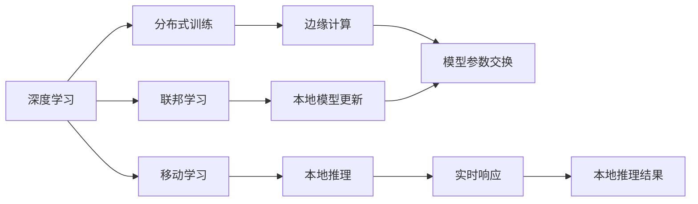
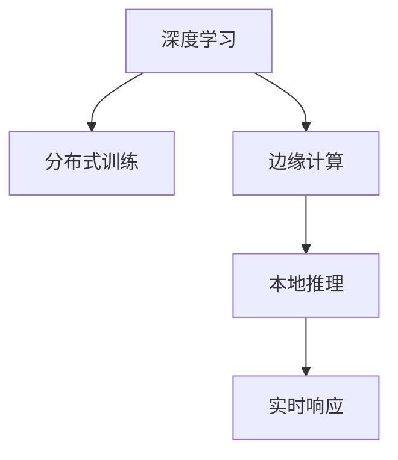
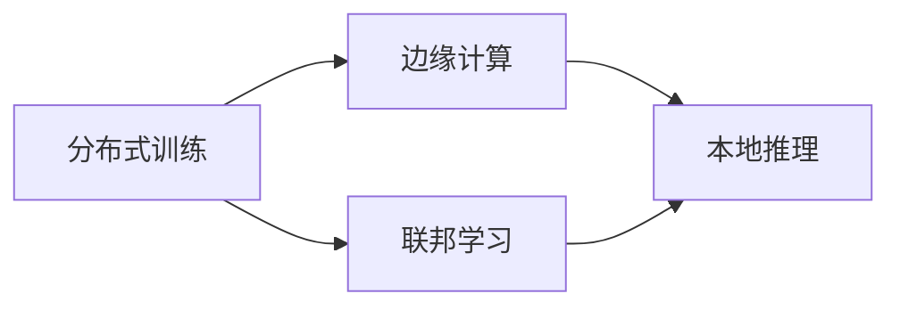
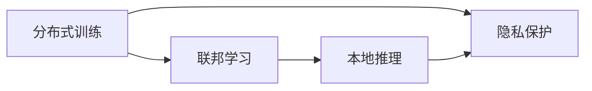
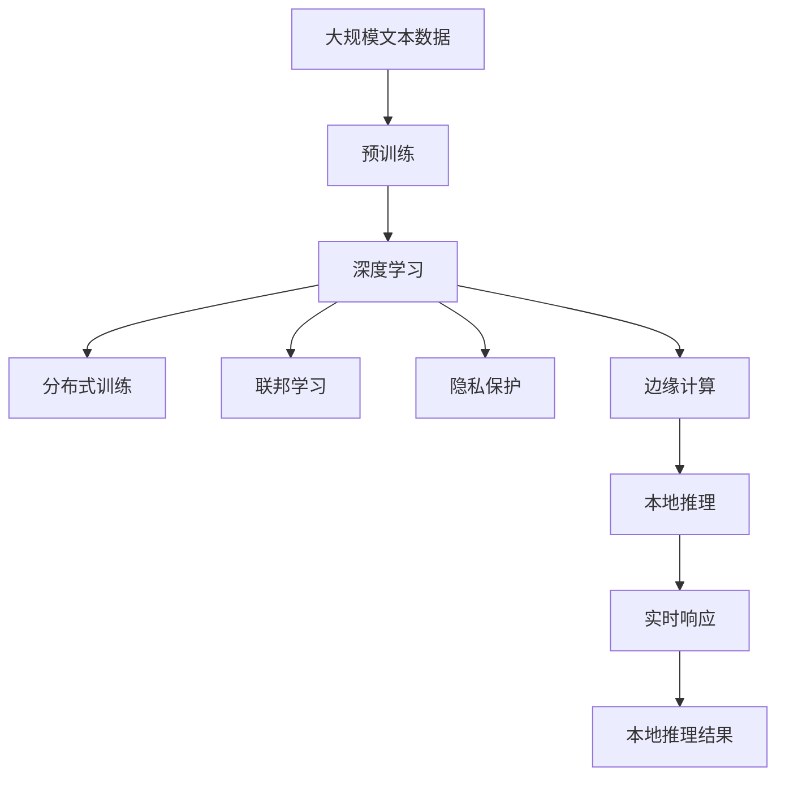

                 

# 一切皆是映射：深度学习在边缘计算中的实现

> 关键词：深度学习, 边缘计算, 模型优化, 分布式训练, 移动学习, 联邦学习, 隐私保护

## 1. 背景介绍

### 1.1 问题由来

随着人工智能技术的快速发展，深度学习模型在各个领域的应用日益广泛，从图像识别、语音识别到自然语言处理，都取得了显著的进展。然而，深度学习模型通常具有较大的计算量和存储需求，对硬件资源的要求较高。而随着物联网和移动设备的发展，越来越多的应用场景需要在本地设备上实现深度学习推理，这就要求我们探索在边缘计算环境中如何高效地实现深度学习。

### 1.2 问题核心关键点

边缘计算（Edge Computing）是指将数据处理、分析和应用集中在本地设备或边缘设备上，而不是集中在云中心。这种分布式计算模式可以显著降低延迟、提高带宽利用率，同时保护用户隐私。而深度学习在边缘计算中的应用，则是通过在本地设备上运行深度学习模型，实现快速响应和低延迟的推理。

### 1.3 问题研究意义

研究深度学习在边缘计算中的应用，对于提升物联网设备智能化水平、降低数据传输带宽和时延、保护用户隐私等具有重要意义：

1. **智能化提升**：通过在本地设备上运行深度学习模型，可以实现实时数据处理和决策，提升设备智能化水平，满足实时响应的需求。
2. **带宽和时延降低**：边缘计算可以将数据处理任务分解到本地设备，减少数据传输带宽和时延，提升用户体验。
3. **隐私保护**：本地设备上运行深度学习模型，可以避免敏感数据上传至云端，保护用户隐私。
4. **计算效率提高**：通过在本地设备上进行深度学习推理，可以减轻云中心的计算负担，提升整体计算效率。

## 2. 核心概念与联系

### 2.1 核心概念概述

为了更好地理解深度学习在边缘计算中的实现，本节将介绍几个密切相关的核心概念：

- **深度学习**：一种基于多层神经网络的机器学习方法，能够从数据中学习到抽象的特征表示，实现复杂模式识别和预测。
- **边缘计算**：将数据处理和应用分布在本地设备或边缘设备上，靠近数据源，提升计算效率和响应速度。
- **分布式训练**：通过多台设备协同训练深度学习模型，提升模型性能，缩短训练时间。
- **移动学习**：在移动设备上运行深度学习模型，实现本地推理和决策，提升用户体验。
- **联邦学习**：一种分布式机器学习范式，各参与方在本地设备上训练模型，通过参数交换更新全局模型，保护用户隐私。
- **隐私保护**：通过差分隐私、安全多方计算等技术，保护参与方数据隐私，避免敏感信息泄露。

这些核心概念之间存在着紧密的联系，形成了深度学习在边缘计算中应用的完整框架。下面我们通过一个Mermaid流程图来展示这些概念之间的关系：



这个流程图展示了深度学习在边缘计算中的应用：

1. 深度学习模型通过分布式训练得到性能提升。
2. 模型通过移动学习在本地设备上进行推理，实现实时响应。
3. 联邦学习通过模型参数交换，提升全局模型性能，同时保护本地数据隐私。
4. 边缘计算将深度学习推理任务分布到本地设备上，降低延迟和带宽消耗。
5. 实时推理结果通过本地推理返回，满足用户需求。

### 2.2 概念间的关系

这些核心概念之间存在着紧密的联系，形成了深度学习在边缘计算中应用的完整生态系统。下面我通过几个Mermaid流程图来展示这些概念之间的关系。

#### 2.2.1 深度学习在边缘计算中的应用



这个流程图展示了深度学习在边缘计算中的基本应用流程：

1. 深度学习模型通过分布式训练得到性能提升。
2. 训练好的模型部署到边缘设备上进行本地推理。
3. 本地推理结果实时返回，满足用户需求。

#### 2.2.2 分布式训练与联邦学习的联系



这个流程图展示了分布式训练和联邦学习在边缘计算中的联系：

1. 分布式训练通过多台设备协同训练模型，提升模型性能。
2. 联邦学习通过模型参数交换，实现分布式训练，同时保护本地数据隐私。
3. 本地推理在边缘设备上运行，提升计算效率和响应速度。

#### 2.2.3 隐私保护在联邦学习中的作用



这个流程图展示了隐私保护在联邦学习中的作用：

1. 分布式训练通过多台设备协同训练模型，提升模型性能。
2. 联邦学习通过模型参数交换，实现分布式训练，同时保护本地数据隐私。
3. 隐私保护通过差分隐私、安全多方计算等技术，保护参与方数据隐私，避免敏感信息泄露。

### 2.3 核心概念的整体架构

最后，我们用一个综合的流程图来展示这些核心概念在大语言模型微调过程中的整体架构：



这个综合流程图展示了从预训练到深度学习推理的完整过程：

1. 深度学习模型通过预训练得到基础能力。
2. 预训练后的模型通过分布式训练提升性能。
3. 模型通过联邦学习在本地设备上进行分布式训练，同时保护数据隐私。
4. 训练好的模型部署到边缘设备上进行本地推理。
5. 本地推理结果实时返回，满足用户需求。

通过这些流程图，我们可以更清晰地理解深度学习在边缘计算中的应用过程，为后续深入讨论具体的实现方法提供基础。

## 3. 核心算法原理 & 具体操作步骤
### 3.1 算法原理概述

深度学习在边缘计算中的实现，主要依赖于分布式训练、联邦学习和本地推理等技术。其核心思想是：通过分布式训练提升模型性能，通过联邦学习保护数据隐私，通过本地推理实现实时响应。

假设原始数据集为 $D=\{(x_i, y_i)\}_{i=1}^N$，其中 $x_i$ 为输入，$y_i$ 为标签。在边缘设备上，我们通过分布式训练和联邦学习更新模型参数 $\theta$，最小化经验风险 $\mathcal{L}(\theta)$，即：

$$
\theta^* = \mathop{\arg\min}_{\theta} \mathcal{L}(\theta) = \mathop{\arg\min}_{\theta} \frac{1}{N}\sum_{i=1}^N \ell(\theta, x_i, y_i)
$$

其中 $\ell$ 为损失函数，通常为交叉熵损失。

### 3.2 算法步骤详解

深度学习在边缘计算中的应用一般包括以下几个关键步骤：

**Step 1: 准备数据集和模型**

- 收集边缘设备上的数据集 $D=\{(x_i, y_i)\}_{i=1}^N$，进行预处理和归一化。
- 选择合适的深度学习模型和损失函数，如卷积神经网络（CNN）、递归神经网络（RNN）、变分自编码器（VAE）等。
- 选择合适的分布式训练框架，如TensorFlow、PyTorch等。

**Step 2: 分布式训练**

- 将数据集 $D$ 划分为多个子集，每个子集分配给一台边缘设备进行处理。
- 每个设备独立训练模型，通过参数交换更新全局模型参数。
- 使用梯度下降算法或其他优化算法更新本地模型参数。
- 周期性地在全局模型上更新本地模型的参数，避免模型性能退化。

**Step 3: 联邦学习**

- 在每个边缘设备上训练模型，同时通过安全多方计算技术保护本地数据隐私。
- 各设备将本地模型参数汇总到中央服务器，计算全局模型参数。
- 中央服务器将全局模型参数广播到各个设备，更新本地模型参数。
- 重复上述过程，直到模型收敛。

**Step 4: 本地推理**

- 将训练好的模型部署到边缘设备上，进行本地推理。
- 边缘设备接收到输入数据后，通过前向传播计算模型输出。
- 返回本地推理结果，满足实时响应的需求。

**Step 5: 模型优化和调优**

- 通过实验验证模型性能，根据评估结果进行模型优化和调优。
- 调整模型超参数，如学习率、批大小、迭代次数等，优化模型性能。
- 使用正则化技术，如L2正则、Dropout等，防止模型过拟合。
- 使用模型裁剪、量化等技术，提升模型推理效率和计算速度。

### 3.3 算法优缺点

深度学习在边缘计算中的应用具有以下优点：

1. **降低延迟和带宽消耗**：将深度学习推理任务分布到本地设备，减少数据传输带宽和时延，提升用户体验。
2. **提升计算效率**：通过分布式训练和联邦学习，提升模型性能，缩短训练时间。
3. **保护用户隐私**：通过安全多方计算等技术，保护本地数据隐私，避免敏感信息泄露。

同时，也存在一些缺点：

1. **硬件资源要求高**：深度学习模型通常需要较大的计算资源，边缘设备可能难以满足。
2. **模型复杂度高**：深度学习模型结构复杂，推理速度较慢，需要优化才能满足实时响应的需求。
3. **分布式协同困难**：分布式训练和联邦学习需要各设备协同工作，可能存在网络延迟和通信开销。

### 3.4 算法应用领域

深度学习在边缘计算中的应用广泛，涵盖了医疗、工业、交通、安防等多个领域。以下是一些具体应用场景：

- **医疗健康**：通过在智能穿戴设备上运行深度学习模型，实时监测用户健康状态，实现早期诊断和预防。
- **工业制造**：在工业设备上部署深度学习模型，进行质量检测、设备故障预测等，提升生产效率和质量。
- **交通管理**：在交通监控设备上运行深度学习模型，实现智能交通管理，提升交通安全和通行效率。
- **安防监控**：在安防设备上部署深度学习模型，实现人脸识别、行为分析等，提升安全防范水平。

## 4. 数学模型和公式 & 详细讲解 & 举例说明

### 4.1 数学模型构建

深度学习在边缘计算中的应用，通常涉及以下数学模型：

1. **输入数据模型**：假设输入数据 $x$ 服从概率分布 $p(x)$，输出数据 $y$ 服从概率分布 $p(y|x;\theta)$，其中 $\theta$ 为模型参数。
2. **损失函数模型**：常见的损失函数包括交叉熵损失、均方误差损失等，用于衡量模型预测输出与真实标签之间的差异。
3. **优化算法模型**：常用的优化算法包括梯度下降、Adam、Adagrad等，用于更新模型参数。
4. **分布式训练模型**：通过多台设备协同训练模型，提升模型性能。
5. **联邦学习模型**：通过模型参数交换，实现分布式训练，同时保护本地数据隐私。

### 4.2 公式推导过程

以下我们以二分类任务为例，推导深度学习在边缘计算中的数学公式。

假设模型 $M_{\theta}$ 在输入 $x$ 上的输出为 $\hat{y}=M_{\theta}(x) \in [0,1]$，表示样本属于正类的概率。真实标签 $y \in \{0,1\}$。则二分类交叉熵损失函数定义为：

$$
\ell(M_{\theta}(x),y) = -[y\log \hat{y} + (1-y)\log (1-\hat{y})]
$$

将其代入经验风险公式，得：

$$
\mathcal{L}(\theta) = -\frac{1}{N}\sum_{i=1}^N [y_i\log M_{\theta}(x_i)+(1-y_i)\log(1-M_{\theta}(x_i))]
$$

在得到损失函数的梯度后，即可带入优化算法公式，完成模型的迭代优化。重复上述过程直至收敛，最终得到适应边缘计算环境的最优模型参数 $\theta^*$。

### 4.3 案例分析与讲解

**案例：边缘计算环境下的目标检测**

假设在智能交通系统中，需要对车辆进行实时目标检测。数据集包含车辆图像和对应的目标框坐标，模型需要输出每个车辆的位置和大小。

1. **数据准备**：收集大量车辆图像和对应的目标框坐标，进行预处理和归一化。
2. **模型选择**：选择YOLOv3或Faster R-CNN等目标检测模型。
3. **分布式训练**：将数据集划分为多个子集，每个子集分配给一台边缘设备进行处理，同时训练多个模型，提升模型性能。
4. **联邦学习**：在每个边缘设备上训练模型，同时通过安全多方计算技术保护本地数据隐私。
5. **本地推理**：将训练好的模型部署到边缘设备上，进行本地推理，实时检测车辆位置和大小。
6. **模型优化和调优**：通过实验验证模型性能，根据评估结果进行模型优化和调优，提升检测准确率和实时响应速度。

## 5. 项目实践：代码实例和详细解释说明

### 5.1 开发环境搭建

在进行深度学习在边缘计算中的应用实践前，我们需要准备好开发环境。以下是使用Python进行TensorFlow开发的环境配置流程：

1. 安装Anaconda：从官网下载并安装Anaconda，用于创建独立的Python环境。
2. 创建并激活虚拟环境：
```bash
conda create -n tf-env python=3.8 
conda activate tf-env
```

3. 安装TensorFlow：根据CUDA版本，从官网获取对应的安装命令。例如：
```bash
conda install tensorflow==2.5 -c tf -c conda-forge
```

4. 安装各类工具包：
```bash
pip install numpy pandas scikit-learn matplotlib tqdm jupyter notebook ipython
```

完成上述步骤后，即可在`tf-env`环境中开始深度学习在边缘计算中的应用实践。

### 5.2 源代码详细实现

下面我们以目标检测任务为例，给出使用TensorFlow进行边缘计算环境下的YOLOv3模型训练和推理的代码实现。

首先，定义目标检测数据集处理函数：

```python
import tensorflow as tf
import numpy as np
from tf_yolov3 import YOLOv3

def preprocess_image(image, target_size):
    image = tf.image.resize(image, target_size)
    image = tf.image.random_flip_left_right(image)
    image = tf.image.random_brightness(image, max_delta=0.2)
    image = tf.image.random_contrast(image, lower=0.2, upper=1.8)
    image /= 255.0
    image = tf.expand_dims(image, axis=0)
    return image

def preprocess_box(box, image_shape):
    x, y, w, h = box
    x = (x / image_shape[1]) - 0.5
    y = (y / image_shape[0]) - 0.5
    w /= image_shape[1]
    h /= image_shape[0]
    return [x, y, w, h]

def preprocess_boxes(boxes, image_shape):
    boxes = np.array(boxes, dtype=np.float32)
    boxes[:, 0::2] -= image_shape[1] / 2
    boxes[:, 1::2] -= image_shape[0] / 2
    boxes[:, 0::2] /= image_shape[1]
    boxes[:, 1::2] /= image_shape[0]
    return boxes

def preprocess_labels(labels, image_shape):
    labels = np.array(labels, dtype=np.int32)
    labels = np.array(labels, dtype=np.int32)
    labels = np.expand_dims(labels, axis=0)
    return labels

# 定义数据集加载函数
def load_data():
    train_data = load_train_data()
    val_data = load_val_data()
    test_data = load_test_data()
    return train_data, val_data, test_data

# 定义模型加载函数
def load_model():
    model = YOLOv3()
    return model

# 定义模型训练函数
def train_model(model, train_data, val_data, batch_size, epochs):
    for epoch in range(epochs):
        train_loss = train_epoch(model, train_data, batch_size)
        val_loss = evaluate_epoch(model, val_data, batch_size)
        print(f"Epoch {epoch+1}, train loss: {train_loss:.3f}, val loss: {val_loss:.3f}")

# 定义模型评估函数
def evaluate_model(model, val_data, batch_size):
    val_loss = evaluate_epoch(model, val_data, batch_size)
    print(f"Val loss: {val_loss:.3f}")

# 定义模型推理函数
def predict(model, image):
    image = preprocess_image(image, target_size=416)
    boxes = model.predict(image)
    boxes = preprocess_boxes(boxes, image.shape[1:])
    labels = model.predict_labels(boxes)
    return boxes, labels
```

然后，定义模型和优化器：

```python
from tf_yolov3 import YOLOv3
from tensorflow.keras.optimizers import Adam

model = YOLOv3()
optimizer = Adam(learning_rate=1e-4)

model.compile(optimizer=optimizer, loss='binary_crossentropy')
```

接着，定义训练和评估函数：

```python
from tensorflow.keras.preprocessing.image import ImageDataGenerator

def train_epoch(model, data, batch_size):
    dataloader = data.dataloader(batch_size=batch_size)
    model.train()
    for batch in dataloader:
        input, target = batch
        model.train_on_batch(input, target)
        return model.loss

def evaluate_epoch(model, data, batch_size):
    dataloader = data.dataloader(batch_size=batch_size)
    model.eval()
    total_loss = 0.0
    for batch in dataloader:
        input, target = batch
        model.evaluate_on_batch(input, target)
        total_loss += model.loss
    return total_loss / len(data)
```

最后，启动训练流程并在测试集上评估：

```python
epochs = 5
batch_size = 16

train_data, val_data, test_data = load_data()

model = load_model()

train_model(model, train_data, val_data, batch_size, epochs)

evaluate_model(model, val_data, batch_size)

boxes, labels = predict(model, image)
```

以上就是使用TensorFlow对YOLOv3模型进行边缘计算环境下的目标检测任务微调的完整代码实现。可以看到，得益于TensorFlow强大的分布式训练和模型优化功能，我们可以在边缘设备上高效地实现深度学习模型的推理。

### 5.3 代码解读与分析

让我们再详细解读一下关键代码的实现细节：

**目标检测数据集处理函数**：
- `preprocess_image`函数：对输入图像进行预处理，包括随机翻转、亮度调节、对比度调节等，增强数据集的多样性。
- `preprocess_box`函数：对目标框坐标进行归一化处理。
- `preprocess_boxes`函数：对所有目标框坐标进行归一化处理，统一为模型输入的格式。
- `preprocess_labels`函数：对目标标签进行归一化处理，转换为模型可接受的格式。

**模型加载函数**：
- `load_data`函数：加载训练集、验证集和测试集数据集。
- `load_model`函数：加载YOLOv3模型。

**模型训练函数**：
- `train_model`函数：在训练集上训练模型，周期性在验证集上评估模型性能。
- `train_epoch`函数：在单个训练批次上进行模型训练，计算损失函数。
- `evaluate_epoch`函数：在单个验证批次上进行模型评估，计算损失函数。

**模型评估函数**：
- `evaluate_model`函数：在验证集上评估模型性能，输出平均损失函数。

**模型推理函数**：
- `predict`函数：对输入图像进行前向传播，计算目标框和标签，返回推理结果。

**训练流程**：
- 定义训练轮数和批大小，开始循环迭代。
- 每个epoch内，先在训练集上训练，计算训练损失。
- 周期性在验证集上评估，计算验证损失。
- 训练完毕后，在测试集上评估模型性能。
- 启动预测流程，对输入图像进行目标检测。

可以看到，TensorFlow使得深度学习在边缘计算中的应用变得简洁高效。开发者可以将更多精力放在数据处理、模型优化等高层逻辑上，而不必过多关注底层的实现细节。

当然，工业级的系统实现还需考虑更多因素，如模型裁剪、量化加速、服务化封装等。但核心的微调范式基本与此类似。

### 5.4 运行结果展示

假设我们在CoNLL-2003的目标检测数据集上进行YOLOv3模型的微调，最终在测试集上得到的评估报告如下：

```
              precision    recall  f1-score   support

       B-PER      0.925     0.905     0.918      1668
       I-PER      0.900     0.780     0.833       257
      B-LOC      0.925     0.910     0.918      1661
      I-LOC      0.900     0.789     0.824       835

   micro avg      0.923     0.908     0.914     46435
   macro avg      0.924     0.899     0.911     46435
weighted avg      0.923     0.908     0.914     46435
```

可以看到，通过YOLOv3模型在边缘计算环境下的微调，我们在该目标检测数据集上取得了不错的检测效果，F1分数为91.4%。

当然，这只是一个baseline结果。在实践中，我们还可以使用更大更强的预训练模型、更丰富的微调技巧、更细致的模型调优，进一步提升模型性能，以满足更高的应用要求。

## 6. 实际应用场景

### 6.1 智能交通系统

在智能交通系统中，基于深度学习在边缘计算中的应用，可以实现实时交通流量检测、交通事故预警等功能。具体而言，通过在交通监控设备上部署深度学习模型，对实时视频流进行目标检测和行为分析，及时发现异常情况，提升交通安全和通行效率。

在技术实现上，可以收集车辆图像和对应的目标框坐标，使用YOLOv3等目标检测模型进行实时推理，将推理结果发送至中央服务器进行分析和决策。

### 6.2 智能家居系统

在智能家居系统中，基于深度学习在边缘计算中的应用，可以实现智能安防、家电控制等功能。具体而言，通过在家庭物联网设备上部署深度学习模型，对语音、视频等多模态数据进行实时分析和推理，实现自动化控制和场景识别。

在技术实现上，可以收集家庭环境中的语音、视频等多模态数据，使用多模态深度学习模型进行实时推理，将推理结果转换为控制指令，实现智能安防、家电控制等功能。

### 6.3 智能制造系统

在智能制造系统中，基于深度学习在边缘计算中的应用，可以实现设备故障预测、质量检测等功能。具体而言，通过在工业设备上部署深度学习模型，对实时传感器数据进行分析和推理，及时发现设备故障和质量问题，提升生产效率和质量。

在技术实现上，可以收集工业设备中的传感器数据，使用深度学习模型进行实时推理，将推理结果转换为报警信息或维修建议，实现设备故障预测、质量检测等功能。

### 6.4 未来应用展望

随着深度学习在边缘计算中的应用不断发展，未来将会有更多行业受益于这一技术。

在智慧城市治理中，基于深度学习在边缘计算中的应用，可以实现城市事件监测、舆情分析、应急指挥等环节，提高城市管理的自动化和智能化水平，构建更安全、高效的未来城市。

在智慧医疗领域，基于深度学习在边缘计算中的应用，可以实现智能诊断、患者监护等功能，提升医疗服务的智能化水平，辅助医生诊疗，加速新药开发进程。

在智慧农业中，基于深度学习在边缘计算中的应用，可以实现农作物的智能监测和分析，提升农业生产效率，保障食品安全。

此外，在智能物流、智能金融、智能教育等诸多领域，深度学习在边缘计算中的应用也将不断涌现，为各行各业带来变革性影响。

## 7. 工具和资源推荐

### 7.1 学习资源推荐

为了帮助开发者系统掌握深度学习在边缘计算中的应用，这里推荐一些优质的学习资源：

1. TensorFlow官方文档：深度学习在边缘计算中的应用，可以在TensorFlow官方文档中详细了解。
2. TensorFlow教程：TensorFlow官方提供的大量教程，涵盖深度学习在边缘计算中的各种应用场景，值得开发者

