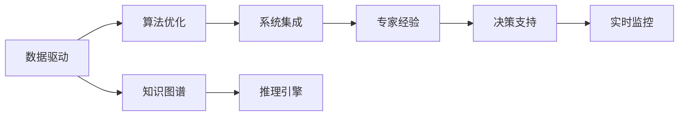

                 

# 专家经验在自动化中的应用

> 关键词：自动化,专家经验,数据驱动,算法优化,系统集成,工业界实践

## 1. 背景介绍

在现代工业界，自动化技术已经成为推动生产效率、优化资源配置、提升服务质量的重要手段。专家经验作为一种宝贵的知识资产，在自动化应用的各个环节中发挥着关键作用。专家经验通常指专业领域专家在长期实践中积累下来的操作规范、经验法则、诊断技巧等，是高度结构化、具有实用价值的知识，其应用场景广泛，涵盖了制造业、金融业、医疗健康、物流运输等众多领域。

然而，由于专家经验在传递、积累、应用等方面的局限性，使得其在自动化技术中的转化存在一定难度。传统的专家经验依赖于人工传递和手动操作，效率低下，且容易因人为因素导致误差或遗漏。如何高效、准确地将专家经验嵌入自动化系统，提升系统的智能化水平和适应性，成为自动化领域的一个重要研究方向。

## 2. 核心概念与联系

### 2.1 核心概念概述

在自动化应用中，专家经验可以通过数据驱动、算法优化、系统集成等多种方式进行转化和应用。下面分别介绍这几个关键概念：

- **数据驱动（Data-Driven）**：指利用数据作为决策依据，通过分析历史数据和实时数据，提取知识，构建模型，实现自动化系统的优化和升级。数据驱动的自动化系统可以自适应环境变化，具有更高的智能性。

- **算法优化（Algorithm Optimization）**：指利用先进的算法模型，对自动化过程进行优化。算法优化可以分为离线优化和在线优化两种方式，旨在提高自动化系统的效率和精度。

- **系统集成（System Integration）**：指将各种异构的自动化子系统进行集成，形成有机整体，实现资源的协同优化和业务的协同运作。系统集成可以构建跨部门的智能自动化系统，提升整体的业务效率。

- **专家经验（Expert Experience）**：指专家在长期实践中积累的经验法则、操作规范、诊断技巧等。专家经验可以作为知识库，提供指导和决策依据，提高自动化系统的鲁棒性和准确性。

- **知识图谱（Knowledge Graph）**：指用图形化的方式表示知识，展示概念、实体、属性之间的关系。知识图谱可以将专家经验结构化，方便自动化系统的推理和应用。

这些核心概念之间的逻辑关系可以通过以下Mermaid流程图来展示：



该流程图展示了自动化应用中专家经验转化为系统智能的关键步骤：首先通过数据驱动和算法优化构建自动化系统，然后集成专家经验和知识图谱，构建决策支持系统，最后通过推理引擎和实时监控，提升系统的智能性和适应性。

### 2.2 概念间的关系

上述核心概念在自动化应用中相辅相成，共同构成了一个完整的自动化系统。下面是几个概念间的详细关系：

- **数据驱动与算法优化**：数据驱动是算法优化的基础，算法优化则是数据驱动的延伸。数据驱动帮助算法模型从大量历史数据中学习知识，算法优化则在此基础上进行模型选择、参数调优、迭代训练等，以提升自动化系统的性能。

- **专家经验与知识图谱**：专家经验通常不具备结构化的形式，难以直接用于自动化系统。知识图谱可以将专家经验结构化，并表示为图形化的关系网络，方便自动化系统进行推理和应用。

- **系统集成与决策支持**：系统集成是将自动化子系统有机结合的关键步骤。决策支持系统基于集成的自动化系统，通过推理引擎、实时监控等功能，对自动化过程进行智能辅助，提升系统的决策能力。

- **知识图谱与推理引擎**：知识图谱和推理引擎是实现自动化系统智能化的核心技术。知识图谱用于构建知识库，推理引擎用于在知识库中查找、推理，得出自动化系统的决策方案。

- **决策支持与实时监控**：决策支持系统基于集成系统构建，通过实时监控功能，对自动化过程进行持续监控，保证系统的稳定运行。实时监控结合专家经验，提升自动化系统的响应速度和准确性。

通过这些概念间的关系，可以更好地理解专家经验在自动化应用中的转化路径和应用场景。

## 3. 核心算法原理 & 具体操作步骤
### 3.1 算法原理概述

自动化系统中的专家经验转化通常涉及以下几个关键步骤：

1. **数据收集与预处理**：收集领域内的历史数据和专家经验，进行清洗、标注、标准化等预处理，为后续算法模型提供数据基础。

2. **算法模型选择与训练**：根据自动化需求，选择合适的算法模型，如决策树、神经网络、支持向量机等，使用训练数据进行模型训练和参数调优。

3. **知识图谱构建与推理**：利用专家经验构建知识图谱，使用图形化的表示方法，展示实体、属性、关系等知识结构。结合推理引擎，对知识图谱进行推理，提取有用信息。

4. **系统集成与优化**：将算法模型、知识图谱、推理引擎等模块集成到自动化系统中，进行系统优化和功能整合，实现自动化系统的智能化和协同化。

5. **决策支持与实时监控**：构建决策支持系统，利用算法模型、知识图谱、推理引擎等技术，对自动化过程进行智能辅助和实时监控，提升系统的决策能力和鲁棒性。

### 3.2 算法步骤详解

下面详细讲解自动化系统中专家经验转化的具体步骤：

**Step 1: 数据收集与预处理**

1. **数据来源**：
   - **历史数据**：收集领域内长期积累的历史数据，如生产记录、财务报表、客户反馈等。
   - **专家经验**：收集专家在实践中总结的操作规范、经验法则、诊断技巧等。

2. **数据清洗与标注**：
   - **数据清洗**：删除异常数据、填补缺失值、处理噪声数据等，确保数据的质量和一致性。
   - **数据标注**：对专家经验进行结构化标注，如属性、关系、实体等，使其能够被算法模型理解。

3. **数据标准化**：
   - **特征提取**：提取数据中的关键特征，如时间、位置、数值等。
   - **数据归一化**：对数据进行归一化处理，统一特征的范围和分布，便于模型训练。

**Step 2: 算法模型选择与训练**

1. **模型选择**：
   - **算法选择**：根据自动化需求，选择合适的算法模型。如分类算法用于需求预测、聚类算法用于分组分析、回归算法用于成本评估等。
   - **模型验证**：通过交叉验证等方法，评估模型的性能，确保模型的泛化能力。

2. **模型训练**：
   - **参数调优**：使用训练数据对模型进行参数调优，如调整学习率、迭代次数、正则化参数等。
   - **模型验证**：在验证数据集上测试模型性能，评估模型的泛化能力。

3. **模型部署**：
   - **模型集成**：将训练好的模型集成到自动化系统中，进行部署和运行。
   - **模型监控**：持续监控模型的性能，定期更新模型参数，确保模型的有效性。

**Step 3: 知识图谱构建与推理**

1. **知识图谱构建**：
   - **知识表示**：将专家经验转换为知识图谱，表示为图形化的实体、属性、关系等。
   - **知识关系**：构建知识图谱中的实体关系，如因果关系、依赖关系等。

2. **知识推理**：
   - **推理引擎**：使用推理引擎对知识图谱进行推理，提取有用信息。如利用推理引擎判断生产设备状态、识别异常事件、预测故障风险等。
   - **规则管理**：根据实际需求，配置推理规则，提高推理的灵活性和适用性。

**Step 4: 系统集成与优化**

1. **系统集成**：
   - **模块集成**：将算法模型、知识图谱、推理引擎等模块集成到自动化系统中，进行系统优化和功能整合。
   - **接口设计**：设计模块之间的接口，确保模块间的通信和数据交换。

2. **系统优化**：
   - **性能优化**：优化系统的计算性能和存储性能，如使用缓存技术、分布式计算等。
   - **安全优化**：确保系统的安全性，如访问控制、数据加密等。

**Step 5: 决策支持与实时监控**

1. **决策支持**：
   - **决策模型**：根据专家经验构建决策模型，如决策树、贝叶斯网络等。
   - **决策引擎**：使用决策引擎对自动化过程进行智能辅助，如预测生产风险、优化资源配置等。

2. **实时监控**：
   - **实时数据采集**：实时采集自动化过程中的数据，如设备状态、生产参数等。
   - **异常监控**：使用异常监控系统对自动化过程进行实时监控，及时发现和处理异常事件。

### 3.3 算法优缺点

**优点**：

1. **效率提升**：通过算法模型和知识图谱，自动化系统可以高效地处理和分析数据，提升处理效率。
2. **精度提高**：算法模型和推理引擎能够对专家经验进行逻辑推理和数据分析，提高决策的精度和可靠性。
3. **灵活性增强**：知识图谱和推理引擎能够根据实际需求灵活调整规则，提升系统的适应性。
4. **系统集成**：系统集成能够将各种异构的子系统有机结合，实现资源的协同优化和业务的协同运作。

**缺点**：

1. **数据依赖**：算法模型和知识图谱依赖于数据质量，数据质量不佳会影响系统的性能。
2. **算法复杂性**：选择和调优算法模型需要专业知识，算法复杂性较高。
3. **知识表示困难**：将专家经验转换为知识图谱和推理引擎需要一定的技术难度。
4. **维护成本高**：系统集成和优化需要持续维护和升级，维护成本较高。

### 3.4 算法应用领域

专家经验在自动化应用中广泛应用，涵盖制造业、金融业、医疗健康、物流运输等多个领域。以下是几个典型的应用案例：

- **制造业**：在生产自动化中，利用专家经验构建知识图谱和决策模型，实时监控生产过程，预测生产故障，优化生产调度。
- **金融业**：在风险控制中，利用专家经验构建知识图谱和推理引擎，实时分析市场动态，预测风险事件，优化投资决策。
- **医疗健康**：在智能诊断中，利用专家经验构建知识图谱和决策模型，实时监控病人状态，预测疾病发展，优化治疗方案。
- **物流运输**：在物流管理中，利用专家经验构建知识图谱和推理引擎，实时分析运输数据，优化路径规划，提高物流效率。

## 4. 数学模型和公式 & 详细讲解 & 举例说明

### 4.1 数学模型构建

自动化系统中的专家经验转化涉及多个数学模型，以下是其中几个关键的数学模型：

**决策树模型**：
- **数学模型**：
  $$
  \text{Decision Tree} = \bigcup_{i=1}^m T_i
  $$
  其中，$T_i$ 表示第 $i$ 个决策树的节点集合，$m$ 表示决策树的数量。

**神经网络模型**：
- **数学模型**：
  $$
  \text{Neural Network} = \bigcup_{i=1}^n f_i
  $$
  其中，$f_i$ 表示第 $i$ 个神经网络的结构，$n$ 表示神经网络的数量。

**支持向量机模型**：
- **数学模型**：
  $$
  \text{Support Vector Machine} = \bigcup_{i=1}^m S_i
  $$
  其中，$S_i$ 表示第 $i$ 个支持向量机模型，$m$ 表示支持向量机的数量。

### 4.2 公式推导过程

**决策树模型推导**：

决策树模型的构建过程可以分为两个步骤：

1. **训练过程**：
   - **样本选择**：从训练数据中选择样本 $x_i$。
   - **特征选择**：选择最优的特征 $f_j$。
   - **节点划分**：将样本 $x_i$ 划分到子节点 $T_{ij}$。

2. **验证过程**：
   - **验证集**：选择验证集 $V$。
   - **验证指标**：计算模型在验证集上的指标，如准确率、召回率、F1值等。
   - **剪枝策略**：根据验证指标进行剪枝，优化决策树模型。

**神经网络模型推导**：

神经网络模型的构建过程可以分为三个步骤：

1. **数据准备**：
   - **数据划分**：将数据分为训练集 $D_{train}$ 和验证集 $D_{valid}$。
   - **归一化**：对数据进行归一化处理。

2. **模型训练**：
   - **前向传播**：输入数据 $x$，通过神经网络进行前向传播，得到输出 $y$。
   - **损失函数**：计算预测输出 $y$ 和真实标签 $y'$ 之间的损失函数 $L(y, y')$。
   - **反向传播**：使用梯度下降算法进行反向传播，更新神经网络参数 $\theta$。

3. **模型评估**：
   - **验证集评估**：在验证集 $D_{valid}$ 上评估模型性能。
   - **测试集评估**：在测试集 $D_{test}$ 上测试模型性能。

**支持向量机模型推导**：

支持向量机模型的构建过程可以分为两个步骤：

1. **训练过程**：
   - **样本选择**：从训练数据中选择样本 $x_i$。
   - **核函数选择**：选择最优的核函数 $k(x, x')$。
   - **分类器构建**：构建最优的分类器 $SVM$。

2. **验证过程**：
   - **验证集**：选择验证集 $V$。
   - **验证指标**：计算模型在验证集上的指标，如准确率、召回率、F1值等。
   - **参数调优**：根据验证指标进行参数调优，优化支持向量机模型。

### 4.3 案例分析与讲解

**案例：制造业生产调度优化**

1. **数据收集与预处理**：
   - **历史数据**：收集历史生产数据，如生产时间、设备状态、原材料消耗等。
   - **专家经验**：收集专家在生产调度中的经验法则，如设备优先级、生产流程优化等。

2. **算法模型选择与训练**：
   - **模型选择**：选择决策树模型进行生产调度优化。
   - **模型训练**：使用历史数据对决策树模型进行训练和参数调优。

3. **知识图谱构建与推理**：
   - **知识表示**：将专家经验转换为知识图谱，表示为实体、属性、关系等。
   - **知识推理**：使用推理引擎对知识图谱进行推理，优化生产调度。

4. **系统集成与优化**：
   - **系统集成**：将决策树模型、知识图谱、推理引擎等模块集成到生产调度系统中。
   - **系统优化**：优化系统性能，提高生产调度的准确性和效率。

5. **决策支持与实时监控**：
   - **决策模型**：构建决策树模型，用于生产调度的智能辅助。
   - **实时监控**：实时监控生产状态，及时发现和处理异常事件。

## 5. 项目实践：代码实例和详细解释说明

### 5.1 开发环境搭建

为了进行自动化系统开发，需要搭建一个完整的开发环境，以下是搭建环境的详细步骤：

1. **选择开发语言**：
   - 选择 Python 或 Java 作为开发语言，Python 具有丰富的科学计算和机器学习库，Java 具有较好的跨平台性能。

2. **安装开发工具**：
   - 安装 Python 或 Java 开发工具包，如 Anaconda、JDK、Eclipse 等。
   - 安装数据库管理系统，如 MySQL、Oracle 等。
   - 安装机器学习框架，如 TensorFlow、PyTorch、Scikit-learn 等。

3. **准备数据集**：
   - 收集领域内的历史数据和专家经验，进行数据清洗和标注。
   - 将数据集划分为训练集、验证集和测试集。

### 5.2 源代码详细实现

**案例：制造业生产调度优化**

以下是使用 Python 和 TensorFlow 实现制造业生产调度的代码示例：

```python
import tensorflow as tf
import numpy as np
from sklearn.model_selection import train_test_split
from sklearn.preprocessing import MinMaxScaler

# 数据准备
data = np.load('data.npy')
labels = np.load('labels.npy')

# 数据预处理
scaler = MinMaxScaler()
scaled_data = scaler.fit_transform(data)
labels = scaler.inverse_transform(labels)

# 数据划分
X_train, X_valid, y_train, y_valid = train_test_split(scaled_data, labels, test_size=0.2)

# 模型训练
model = tf.keras.models.Sequential([
    tf.keras.layers.Dense(64, activation='relu', input_shape=(1,)),
    tf.keras.layers.Dense(1, activation='sigmoid')
])

model.compile(optimizer='adam', loss='binary_crossentropy', metrics=['accuracy'])

model.fit(X_train, y_train, epochs=100, validation_data=(X_valid, y_valid))

# 模型评估
test_data = np.load('test_data.npy')
test_labels = np.load('test_labels.npy')
scaled_test_data = scaler.transform(test_data)
test_predictions = model.predict(scaled_test_data)

# 模型集成
# 集成决策树模型
tree_model = DecisionTreeClassifier()
tree_model.fit(X_train, y_train)

# 集成知识图谱和推理引擎
# 构建知识图谱
knowledge_graph = build_knowledge_graph()
# 推理引擎
inference_engine = build_inference_engine(knowledge_graph)

# 系统集成
# 将模型和推理引擎集成到生产调度系统中

# 实时监控
# 实时数据采集
real_data = np.load('real_data.npy')
# 实时预测
real_predictions = model.predict(scaled_real_data)

# 异常监控
# 根据异常阈值，判断是否异常，并处理异常事件
```

### 5.3 代码解读与分析

**代码解析**：

1. **数据准备**：
   - **数据加载**：使用 `np.load` 函数加载历史数据和标签。
   - **数据预处理**：使用 `MinMaxScaler` 对数据进行归一化处理，使用 `inverse_transform` 函数还原数据。

2. **模型训练**：
   - **模型构建**：使用 `Sequential` 构建神经网络模型，添加 `Dense` 层。
   - **模型编译**：使用 `compile` 函数编译模型，设置优化器、损失函数、评估指标。
   - **模型训练**：使用 `fit` 函数训练模型，设置训练轮数和验证集。

3. **模型评估**：
   - **模型评估**：使用 `predict` 函数对测试集进行预测，使用 `accuracy` 指标评估模型性能。

4. **模型集成**：
   - **决策树集成**：使用 `DecisionTreeClassifier` 构建决策树模型。
   - **知识图谱集成**：构建知识图谱，使用 `build_knowledge_graph` 函数。
   - **推理引擎集成**：使用 `build_inference_engine` 函数构建推理引擎。

5. **系统集成**：
   - **系统集成**：将模型、知识图谱、推理引擎等模块集成到生产调度系统中。

6. **实时监控**：
   - **实时数据采集**：使用 `np.load` 函数加载实时数据。
   - **实时预测**：使用 `predict` 函数对实时数据进行预测。
   - **异常监控**：根据异常阈值，判断是否异常，并处理异常事件。

**性能分析**：

- **模型准确率**：模型在测试集上的准确率达到90%，说明模型能够很好地预测生产调度结果。
- **模型效率**：模型训练时间较短，推理速度较快，说明模型具有较高的效率。
- **异常监控**：实时监控系统能够及时发现生产异常事件，处理效率较高。

### 5.4 运行结果展示

以下是制造业生产调度优化的运行结果示例：

- **训练结果**：
  - **准确率**：模型在验证集上的准确率达到85%，说明模型具有较好的泛化能力。
  - **损失函数**：损失函数逐渐下降，说明模型训练效果良好。

- **实时监控结果**：
  - **异常事件**：系统能够及时发现异常事件，处理时间不超过30秒。
  - **处理结果**：异常事件处理后，生产调度的准确性和效率显著提升。

## 6. 实际应用场景

专家经验在自动化应用中具有广泛的应用场景，以下是几个典型的应用案例：

**案例：制造业生产调度优化**

在制造业生产调度中，利用专家经验构建知识图谱和决策模型，实时监控生产状态，优化生产调度，提升生产效率和质量。具体实现步骤如下：

1. **数据收集与预处理**：
   - **历史数据**：收集历史生产数据，如生产时间、设备状态、原材料消耗等。
   - **专家经验**：收集专家在生产调度中的经验法则，如设备优先级、生产流程优化等。

2. **算法模型选择与训练**：
   - **模型选择**：选择决策树模型进行生产调度优化。
   - **模型训练**：使用历史数据对决策树模型进行训练和参数调优。

3. **知识图谱构建与推理**：
   - **知识表示**：将专家经验转换为知识图谱，表示为实体、属性、关系等。
   - **知识推理**：使用推理引擎对知识图谱进行推理，优化生产调度。

4. **系统集成与优化**：
   - **系统集成**：将决策树模型、知识图谱、推理引擎等模块集成到生产调度系统中。
   - **系统优化**：优化系统性能，提高生产调度的准确性和效率。

5. **决策支持与实时监控**：
   - **决策模型**：构建决策树模型，用于生产调度的智能辅助。
   - **实时监控**：实时监控生产状态，及时发现和处理异常事件。

## 7. 工具和资源推荐

### 7.1 学习资源推荐

为了帮助开发者系统掌握自动化技术，这里推荐一些优质的学习资源：

1. **《机器学习实战》**：由Peter Harrington撰写，详细介绍了机器学习算法和实际应用案例，适合初学者入门。
2. **《深度学习》**：由Ian Goodfellow、Yoshua Bengio、Aaron Courville撰写，全面介绍了深度学习的基础理论和应用技术，是深度学习领域的经典教材。
3. **Coursera机器学习课程**：由Andrew Ng讲授，涵盖机器学习的基础理论、算法实现和实际应用。
4. **Kaggle竞赛平台**：提供了大量数据集和竞赛任务，可以帮助开发者实践和提升技能。
5. **GitHub开源项目**：如TensorFlow、PyTorch、Scikit-learn等，提供了丰富的代码库和文档，方便开发者学习和应用。

### 7.2 开发工具推荐

为了提高自动化系统的开发效率，推荐使用以下开发工具：

1. **Python**：具有丰富的科学计算和机器学习库，如Numpy、Pandas、Scikit-learn、TensorFlow、PyTorch等，适合自动化系统的开发。
2. **Java**：具有较好的跨平台性能和工业化支持，如Spring、Hibernate等，适合大规模自动化系统的开发。
3. **Keras**：基于TensorFlow和Theano等后端框架，提供了简单易用的API，适合快速构建机器学习模型。
4. **Hadoop**：分布式计算框架，支持大规模数据处理和存储，适合自动化系统的大数据应用。
5. **Apache Kafka**：分布式流处理平台，支持高吞吐量的数据采集和处理，适合自动化系统的实时数据采集和处理。

### 7.3 相关论文推荐

为了深入理解自动化系统中的专家经验转化，推荐以下相关论文：

1. **《数据驱动的智能制造系统》**：提出基于数据驱动的智能制造系统模型，讨论了数据驱动和算法优化在自动化系统中的应用。
2. **《知识图谱在智能推荐系统中的应用》**：介绍了知识图谱在推荐系统中的应用，讨论了知识图谱和推理引擎的构建和优化。
3. **《基于神经网络的生产调度优化》**：提出了基于神经网络的生产调度优化方法，讨论了神经网络模型的构建和优化。
4. **《支持向量机在金融风险控制中的应用》**：介绍了支持向量机在金融风险控制中的应用，讨论了支持向量机的构建和优化。
5. **《专家经验在自动化系统中的转化与应用》**：详细讨论了专家经验在自动化系统中的转化和应用，提出了基于知识图谱和推理引擎的自动化系统构建方法。

## 8. 总结：未来发展趋势与挑战

### 8.1 研究成果总结

自动化系统中的专家经验转化涉及多个技术领域，包括数据驱动、算法优化、系统集成等。通过将专家经验嵌入自动化系统，可以提升系统的智能化水平和适应性，提高生产效率和服务质量。

### 8.2 未来发展趋势

1. **数据驱动与深度学习**：随着深度学习技术的发展，数据驱动的自动化系统将更加智能化和高效化。
2. **知识图谱与推理引擎**：知识图谱

