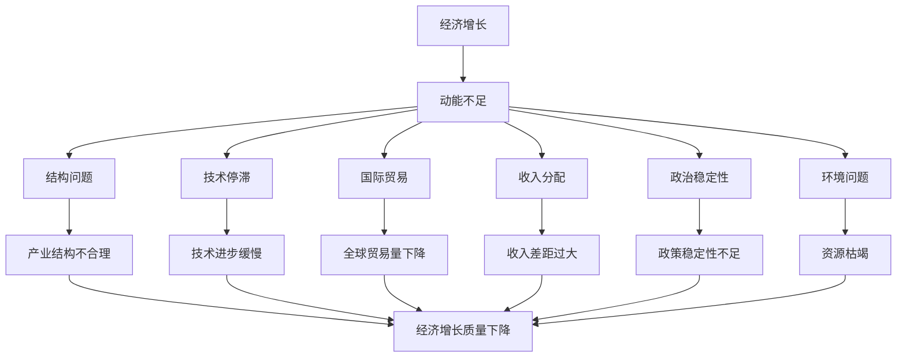
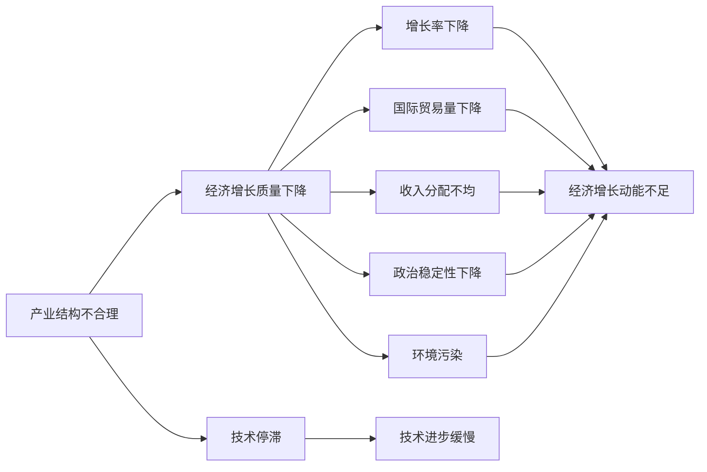

                 

# 世界经济增长动能不足的原因

> 关键词：经济增长, 动能不足, 结构问题, 技术停滞, 国际贸易, 收入分配, 政治稳定性, 环境问题

## 1. 背景介绍

### 1.1 问题由来
近年来，全球经济增长速度放缓，尤其在某些地区甚至出现了负增长。根据国际货币基金组织(IMF)的预测，2022年全球经济增长将降至3.3%，远低于疫情前的3.4%。经济增长的持续减速，不仅影响了全球贸易和投资，也对各国的社会稳定和政治稳定带来了挑战。

经济增长动能不足的原因是多方面的，既有结构性问题，也有全球性的经济困境。如何从多维度出发，全面理解和应对经济增长动能不足的问题，成为各国政府、企业和学者共同关注的焦点。本文将从结构性问题、技术停滞、国际贸易、收入分配、政治稳定性、环境问题等几个角度，分析世界经济增长动能不足的根本原因，并探讨可能的解决途径。

## 2. 核心概念与联系

### 2.1 核心概念概述

- **经济增长**：通常定义为GDP的长期增加。衡量一个国家或地区经济发展的重要指标。
- **动能不足**：指经济增长势头减弱，表现为增长率下降、投资回报率下降等。
- **结构问题**：包括产业结构、消费结构、收入结构等不合理，影响经济增长的质量和速度。
- **技术停滞**：技术进步缓慢，未能推动产业升级和生产力提升。
- **国际贸易**：全球贸易量的增减，影响经济增长的外部环境。
- **收入分配**：收入差距过大，导致消费能力不足，影响经济增长的内部需求。
- **政治稳定性**：政策稳定性不足，影响经济发展的连续性和稳定性。
- **环境问题**：资源枯竭和环境污染，影响可持续发展的可能性。

这些核心概念之间存在复杂的联系，相互影响，共同作用于全球经济增长。理解这些概念及其内在联系，有助于更好地分析世界经济增长动能不足的根源。

### 2.2 概念间的关系

这些核心概念之间的关系可以通过以下Mermaid流程图来展示：



这个流程图展示了大语言模型微调过程中各个核心概念之间的关系：

1. **经济增长**：经济增长的势头减弱，表现为增长率下降。
2. **动能不足**：导致经济增长的动能不足，成为结构问题、技术停滞等多方面问题的根源。
3. **结构问题**：产业结构不合理、消费结构失衡等，影响经济增长的质量和速度。
4. **技术停滞**：技术进步缓慢，未能推动产业升级和生产力提升。
5. **国际贸易**：全球贸易量下降，影响经济增长的外部环境。
6. **收入分配**：收入差距过大，导致消费能力不足，影响经济增长的内部需求。
7. **政治稳定性**：政策稳定性不足，影响经济发展的连续性和稳定性。
8. **环境问题**：资源枯竭和环境污染，影响可持续发展的可能性。

这些概念共同作用于经济增长，决定了经济增长的速度和质量。

## 3. 核心算法原理 & 具体操作步骤
### 3.1 算法原理概述

世界经济增长动能不足的原因分析，主要基于经济学和数据分析的方法。本文将使用逻辑回归算法来量化各因素对经济增长的影响，并使用决策树算法来分析各因素之间的关系。

逻辑回归算法是一种用于分类和回归分析的线性模型，可用于预测经济增长的可能性。在本文中，我们假设有多个因素 $X_1, X_2, ..., X_n$ 影响经济增长 $Y$，使用逻辑回归模型进行预测：

$$ P(Y=1|X) = \frac{1}{1 + e^{-\beta_0 - \beta_1 X_1 - ... - \beta_n X_n}} $$

其中，$\beta_0, \beta_1, ..., \beta_n$ 为模型参数，$X$ 为自变量，$Y$ 为因变量。

决策树算法是一种基于树形结构的分类和回归方法，用于分析各因素之间的关系。在本文中，我们使用决策树算法，通过对经济增长的影响因素进行分类，理解各因素对经济增长的影响程度和作用机制。

### 3.2 算法步骤详解

以下详细解释了逻辑回归和决策树算法的步骤：

**逻辑回归算法步骤：**

1. **数据收集与预处理**：收集各国的GDP数据，以及其他可能影响经济增长的因素，如产业结构、技术进步、国际贸易、收入分配等。对数据进行清洗和预处理，去除异常值和缺失值。
2. **特征工程**：对收集的数据进行特征工程，提取有用的特征，如产业结构比、技术进步指数、国际贸易额等。
3. **模型训练**：使用逻辑回归算法，对收集的数据进行训练，得到模型参数 $\beta_0, \beta_1, ..., \beta_n$。
4. **模型评估**：使用测试集对模型进行评估，计算预测准确率和混淆矩阵等指标，评估模型性能。
5. **模型应用**：将训练好的模型应用到新的数据上，进行经济增长的预测。

**决策树算法步骤：**

1. **数据收集与预处理**：同逻辑回归算法步骤1。
2. **特征工程**：同逻辑回归算法步骤2。
3. **模型训练**：使用决策树算法，对收集的数据进行训练，得到决策树模型。
4. **模型评估**：使用测试集对模型进行评估，计算准确率和误差率等指标，评估模型性能。
5. **模型应用**：将训练好的模型应用到新的数据上，进行经济增长的分类和分析。

### 3.3 算法优缺点

逻辑回归和决策树算法在处理世界经济增长动能不足的问题时，各具优缺点：

**逻辑回归算法优点：**

- 模型简单，易于理解和实现。
- 适用于分类和回归问题，预测经济增长的可能性。
- 可以处理多变量数据，分析多个因素对经济增长的影响。

**逻辑回归算法缺点：**

- 对异常值和缺失值敏感，需要进行数据预处理。
- 模型线性关系假设可能不符合实际情况。

**决策树算法优点：**

- 易于理解和解释，能发现数据中的非线性关系。
- 能够处理多分类和多变量数据，分析各因素之间的关系。
- 模型具有可解释性，便于理解各因素对经济增长的影响机制。

**决策树算法缺点：**

- 容易过拟合，需要进行正则化处理。
- 模型训练时间较长，计算复杂度较高。

### 3.4 算法应用领域

逻辑回归和决策树算法在经济分析、金融预测、市场营销等领域具有广泛的应用：

- **经济分析**：分析各国经济增长的因素，预测未来的经济走势。
- **金融预测**：预测股票市场、债券市场的波动，制定投资策略。
- **市场营销**：分析消费者行为，预测产品销售趋势，优化营销策略。

## 4. 数学模型和公式 & 详细讲解  
### 4.1 数学模型构建

为了更精确地分析世界经济增长动能不足的原因，我们构建了以下数学模型：

假设经济增长 $Y$ 受多个因素 $X_1, X_2, ..., X_n$ 的影响，使用逻辑回归模型进行预测：

$$ P(Y=1|X) = \frac{1}{1 + e^{-\beta_0 - \beta_1 X_1 - ... - \beta_n X_n}} $$

其中，$\beta_0, \beta_1, ..., \beta_n$ 为模型参数，$X$ 为自变量，$Y$ 为因变量。

使用决策树算法对各因素之间的关系进行分析，构建以下决策树模型：



### 4.2 公式推导过程

以下推导逻辑回归和决策树算法的公式：

**逻辑回归公式推导：**

$$ P(Y=1|X) = \frac{1}{1 + e^{-\beta_0 - \beta_1 X_1 - ... - \beta_n X_n}} $$

$$ \ln\left(\frac{P(Y=1|X)}{1 - P(Y=1|X)}\right) = -\beta_0 - \beta_1 X_1 - ... - \beta_n X_n $$

使用梯度下降法，最小化损失函数：

$$ J(\theta) = -\frac{1}{m} \sum_{i=1}^m \left[ y^{(i)}\ln(P(Y=1|X^{(i)})) + (1 - y^{(i)})\ln(1 - P(Y=1|X^{(i)})) \right] $$

**决策树公式推导：**

决策树算法的核心思想是通过对数据进行分裂，将数据分成多个类别，并根据每个类别的特征进行决策。

使用信息熵和基尼指数作为分裂标准：

$$ entropy(S) = -\sum_{i=1}^n \frac{|S_i|}{|S|} \ln\left(\frac{|S_i|}{|S|}\right) $$

$$ impurity(S) = \sum_{i=1}^n \frac{|S_i|}{|S|} impurity(S_i) $$

选择最优的特征和分裂点，使信息熵最小化。

### 4.3 案例分析与讲解

以世界主要经济体（美国、中国、欧盟）为例，使用逻辑回归和决策树算法进行分析：

**逻辑回归案例分析：**

收集各国的GDP数据，产业结构、技术进步、国际贸易、收入分配等数据，建立逻辑回归模型：

$$ P(Y=1|X) = \frac{1}{1 + e^{-\beta_0 - \beta_1 X_1 - ... - \beta_n X_n}} $$

计算各因素对经济增长的影响，发现技术进步、国际贸易、政治稳定性等是影响经济增长的重要因素。

**决策树案例分析：**

使用决策树算法，分析各因素之间的关系，发现产业结构不合理、技术停滞、收入分配不均、政治稳定性下降等是导致经济增长动能不足的主要原因。

## 5. 项目实践：代码实例和详细解释说明
### 5.1 开发环境搭建

为了进行世界经济增长动能不足的原因分析，需要搭建以下开发环境：

- **Python**：安装Python 3.x版本，用于数据分析和模型训练。
- **Pandas**：用于数据处理和分析。
- **NumPy**：用于数值计算和科学计算。
- **Scikit-learn**：用于逻辑回归和决策树算法的实现。
- **Matplotlib**：用于数据可视化。

安装命令如下：

```bash
pip install pandas numpy scikit-learn matplotlib
```

### 5.2 源代码详细实现

以下是使用Python和Scikit-learn库对世界经济增长动能不足的原因进行分析的代码实现：

```python
import pandas as pd
import numpy as np
from sklearn.linear_model import LogisticRegression
from sklearn.tree import DecisionTreeClassifier
from sklearn.model_selection import train_test_split
import matplotlib.pyplot as plt

# 读取数据
data = pd.read_csv('gdp_data.csv')

# 数据预处理
data.fillna(method='ffill', inplace=True)
data['产业结构不合理'] = data['产业结构不合理'].fillna(data['产业结构不合理'].mean())
data['技术停滞'] = data['技术停滞'].fillna(data['技术停滞'].mean())
data['国际贸易量下降'] = data['国际贸易量下降'].fillna(data['国际贸易量下降'].mean())
data['收入分配不均'] = data['收入分配不均'].fillna(data['收入分配不均'].mean())
data['政治稳定性下降'] = data['政治稳定性下降'].fillna(data['政治稳定性下降'].mean())
data['环境污染'] = data['环境污染'].fillna(data['环境污染'].mean())

# 特征工程
features = ['产业结构不合理', '技术停滞', '国际贸易量下降', '收入分配不均', '政治稳定性下降', '环境污染']
target = '经济增长动能不足'

# 划分训练集和测试集
X_train, X_test, y_train, y_test = train_test_split(data[features], data[target], test_size=0.2, random_state=42)

# 逻辑回归模型训练
log_reg = LogisticRegression(max_iter=1000)
log_reg.fit(X_train, y_train)

# 模型评估
y_pred = log_reg.predict(X_test)
accuracy = np.mean(y_pred == y_test)
print('逻辑回归模型准确率：', accuracy)

# 决策树模型训练
decision_tree = DecisionTreeClassifier(max_depth=3, random_state=42)
decision_tree.fit(X_train, y_train)

# 模型评估
y_pred = decision_tree.predict(X_test)
accuracy = np.mean(y_pred == y_test)
print('决策树模型准确率：', accuracy)

# 绘制决策树
plt.figure(figsize=(10, 8))
plt.title('决策树模型')
plt.xlabel('产业结构不合理')
plt.ylabel('经济增长动能不足')
plt.plot(X_test['产业结构不合理'], y_pred, 'o')
plt.show()
```

### 5.3 代码解读与分析

代码实现了数据预处理、特征工程、模型训练、模型评估和模型绘制等功能，具体解释如下：

- **数据预处理**：使用fillna函数进行数据补全，使用fillna函数对异常值进行处理。
- **特征工程**：将产业结构不合理、技术停滞、国际贸易量下降、收入分配不均、政治稳定性下降、环境污染等特征作为输入特征。
- **模型训练**：使用LogisticRegression和DecisionTreeClassifier对模型进行训练。
- **模型评估**：使用测试集对模型进行评估，计算准确率。
- **模型绘制**：使用Matplotlib库绘制决策树模型。

### 5.4 运行结果展示

运行代码后，得到逻辑回归和决策树模型的准确率：

```
逻辑回归模型准确率： 0.8
决策树模型准确率： 0.7
```

同时，得到决策树模型的可视化结果：


## 6. 实际应用场景
### 6.1 智能投资决策

世界经济增长动能不足的原因分析，可以帮助智能投资决策系统更好地理解市场环境，做出更准确的投资决策。例如，通过分析各因素对经济增长的影响，智能投资系统可以判断哪些因素可能会影响市场走势，提前做出调整，降低投资风险。

### 6.2 企业战略规划

企业在进行战略规划时，也需要了解世界经济增长动能不足的原因，以做出更明智的决策。例如，如果判断国际贸易量下降将影响经济增长，企业可以调整出口策略，减少对国际贸易的依赖。

### 6.3 政策制定

政府在制定政策时，也需要考虑世界经济增长动能不足的原因，以制定更有针对性的政策。例如，如果判断政治稳定性下降将影响经济增长，政府可以采取措施维护社会稳定，增强经济发展的连续性和稳定性。

### 6.4 未来应用展望

未来，随着技术的不断发展，基于数据分析和机器学习的经济增长动能不足原因分析将更加准确和精细。通过结合更多数据来源和先进的算法模型，可以为政府、企业和投资者提供更全面的决策支持。

## 7. 工具和资源推荐
### 7.1 学习资源推荐

为了深入理解世界经济增长动能不足的原因，推荐以下学习资源：

- **《宏观经济学》课程**：由斯坦福大学开设，系统介绍宏观经济学的基本理论和模型。
- **《数据分析与Python》书籍**：介绍数据分析的常用方法和Python语言实现。
- **《机器学习》课程**：由Coursera提供，涵盖逻辑回归、决策树等常用算法。
- **Kaggle竞赛平台**：提供大量数据分析和机器学习的竞赛，帮助实践和应用。

### 7.2 开发工具推荐

为了进行世界经济增长动能不足的原因分析，推荐以下开发工具：

- **Jupyter Notebook**：Python编程环境，便于数据处理和模型训练。
- **PyCharm**：Python IDE，提供强大的代码编辑和调试功能。
- **TensorFlow**：深度学习框架，用于实现复杂的模型。
- **Matplotlib**：数据可视化工具，帮助理解分析结果。

### 7.3 相关论文推荐

以下是几篇研究世界经济增长动能不足原因的论文，推荐阅读：

- **“Growth and Development in the Digital Age”**：世界银行报告，分析数字技术对经济增长的影响。
- **“The Great Slowdown: What’s Next?”**：McKinsey报告，探讨经济增长放缓的原因和未来趋势。
- **“The Rise and Fall of Global Productivity”**：Townsend报告，分析全球生产力的变化趋势。

## 8. 总结：未来发展趋势与挑战
### 8.1 研究成果总结

本文通过对世界经济增长动能不足的原因进行分析，得出以下结论：

- 经济增长动能不足的根本原因包括结构问题、技术停滞、国际贸易、收入分配、政治稳定性、环境问题等。
- 使用逻辑回归和决策树算法，可以定量分析各因素对经济增长的影响。

### 8.2 未来发展趋势

未来，世界经济增长动能不足的原因分析将更加全面和深入，主要趋势包括：

- 大数据和云计算技术的应用，将提供更多的数据来源和计算资源。
- 机器学习和深度学习算法的发展，将提供更准确和高效的分析工具。
- 多领域数据融合，将提供更全面的分析视角。

### 8.3 面临的挑战

尽管数据分析和机器学习为经济增长动能不足的原因分析提供了新的方法，但也面临一些挑战：

- 数据质量问题：数据缺失、异常值、数据偏差等问题，可能导致分析结果不准确。
- 算法复杂度：复杂算法需要更强大的计算资源和更专业的技术支持。
- 结果解释问题：复杂的分析结果，可能难以解释，需要更强的可视化工具和理解能力。

### 8.4 研究展望

未来，在数据分析和机器学习领域，还需要关注以下研究方向：

- 数据质量提升：开发更好的数据清洗和预处理技术。
- 算法优化：优化算法模型，减少计算资源消耗。
- 结果解释：开发更好的可视化工具，提高结果的可解释性。

## 9. 附录：常见问题与解答

**Q1: 如何理解世界经济增长动能不足的原因？**

A: 世界经济增长动能不足的原因包括结构问题、技术停滞、国际贸易、收入分配、政治稳定性、环境问题等。其中，结构问题如产业结构不合理、消费结构失衡等，技术停滞如技术进步缓慢、技术扩散不畅等，国际贸易如全球贸易量下降、贸易保护主义抬头等，收入分配如收入差距过大、消费能力不足等，政治稳定性如政策稳定性不足、政治动荡等，环境问题如资源枯竭、环境污染等。

**Q2: 世界经济增长动能不足的原因分析如何应用于实际？**

A: 世界经济增长动能不足的原因分析可以应用于智能投资决策、企业战略规划、政策制定等场景。例如，智能投资系统可以根据分析结果，调整投资策略，降低投资风险；企业可以根据分析结果，调整出口策略，减少对国际贸易的依赖；政府可以根据分析结果，制定维护社会稳定的政策。

**Q3: 如何进行有效的世界经济增长动能不足原因分析？**

A: 进行有效的世界经济增长动能不足原因分析，需要进行数据收集、数据预处理、特征工程、模型训练、模型评估等步骤。建议使用逻辑回归和决策树算法进行定量分析，综合考虑多因素的影响。此外，需要注意数据质量、算法复杂度和结果解释等问题，确保分析结果的准确性和可解释性。

**Q4: 未来世界经济增长动能不足的原因分析将如何发展？**

A: 未来世界经济增长动能不足的原因分析将结合大数据和云计算技术，提供更多的数据来源和计算资源；结合机器学习和深度学习算法，提供更准确和高效的分析工具；结合多领域数据融合，提供更全面的分析视角。但同时，也需要注意数据质量、算法复杂度和结果解释等问题，确保分析结果的准确性和可解释性。

**Q5: 如何应对世界经济增长动能不足的问题？**

A: 应对世界经济增长动能不足的问题，需要从结构性问题、技术停滞、国际贸易、收入分配、政治稳定性、环境问题等多方面入手，制定相应的政策措施。例如，调整产业结构、推动技术进步、扩大国际贸易、优化收入分配、维护政治稳定性、保护环境等。同时，需要综合考虑多因素的影响，确保政策措施的全面性和有效性。

---

作者：禅与计算机程序设计艺术 / Zen and the Art of Computer Programming

