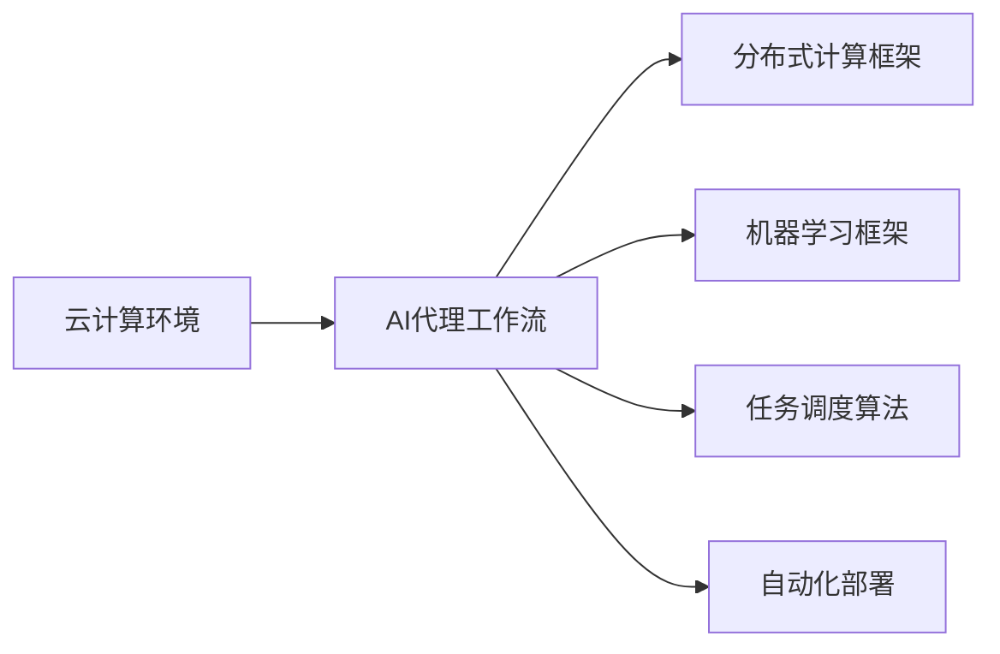
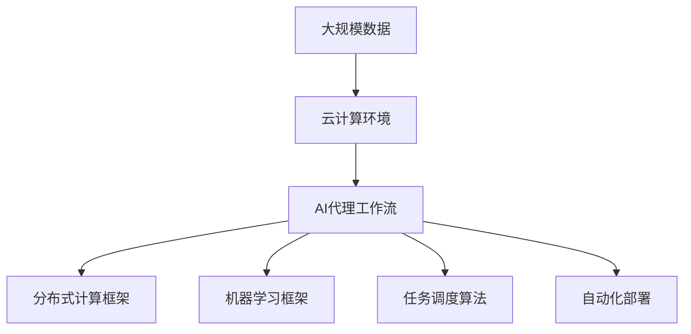

                 

# 云计算环境中AI代理工作流的设计与执行

> 关键词：云计算,人工智能,代理工作流,自动化,分布式计算,机器学习

## 1. 背景介绍

### 1.1 问题由来

随着云计算和人工智能技术的快速发展，企业正面临着日益复杂和多变的业务需求。云计算环境提供了高效、灵活的计算资源，使得企业能够快速部署和扩展AI应用。然而，在实际应用中，如何高效、安全、可靠地将AI模型集成到云环境中，成为了一个迫切需要解决的问题。AI代理工作流作为一种新兴的计算模型，通过自动化、分布式、智能化的方式，满足了企业对云计算中AI应用的需求。

### 1.2 问题核心关键点

AI代理工作流是面向云计算环境的一种智能化的数据处理与分析机制，其核心思想是通过在云端构建一个自动化、分布式、可扩展的AI工作流，实现AI模型的自动化部署、调度和执行，以提供高性能、低成本、高可靠性的AI服务。其关键点包括：

- 自动化部署：通过自动化的配置和部署流程，减少人工干预，提高部署效率。
- 分布式计算：通过分布式计算框架，实现AI模型的并行处理，提升计算能力。
- 智能化调度：通过智能化的任务调度算法，合理分配计算资源，优化执行效率。
- 可扩展性：通过可扩展的架构设计，支持大规模的数据处理和模型训练。

### 1.3 问题研究意义

研究AI代理工作流对于云计算环境中AI应用的实现具有重要意义：

1. 提高部署效率：通过自动化的部署流程，减少了人工干预，提高了AI模型的部署效率。
2. 提升计算能力：通过分布式计算框架，实现了AI模型的并行处理，提高了计算能力。
3. 优化执行效率：通过智能化的任务调度算法，合理分配计算资源，提升了执行效率。
4. 增强可扩展性：通过可扩展的架构设计，支持大规模的数据处理和模型训练，适应企业不断增长的业务需求。
5. 降低运营成本：通过高效的任务调度和管理，减少了资源浪费，降低了运营成本。

## 2. 核心概念与联系

### 2.1 核心概念概述

为了更好地理解AI代理工作流的设计与执行，本节将介绍几个密切相关的核心概念：

- 云计算环境：通过互联网提供按需的计算资源和服务，包括计算、存储、网络等，供用户按需使用。
- AI代理工作流：一种面向云计算环境的智能化数据处理与分析机制，通过自动化、分布式、智能化的方式，实现AI模型的自动化部署、调度和执行。
- 分布式计算框架：一种能够将任务分布到多个节点上并行处理的计算框架，如Apache Spark、Hadoop等。
- 机器学习框架：一种用于构建和训练机器学习模型的框架，如TensorFlow、PyTorch等。
- 任务调度算法：一种用于优化任务执行效率的算法，根据任务特性和资源状态进行合理分配。
- 自动化部署：通过脚本、配置文件等自动化手段，实现模型的部署流程，减少人工干预。

### 2.2 概念间的关系

这些核心概念之间的逻辑关系可以通过以下Mermaid流程图来展示：



这个流程图展示了大规模云计算环境中AI代理工作流的整体架构：

1. 云计算环境提供计算资源和服务，供AI代理工作流使用。
2. AI代理工作流通过分布式计算框架，将任务分布到多个节点上并行处理。
3. 利用机器学习框架，构建和训练AI模型。
4. 通过任务调度算法，优化任务执行效率。
5. 自动化部署实现模型的快速部署和扩展。

这些概念共同构成了AI代理工作流的核心组成部分，使其能够在云计算环境中高效、安全、可靠地实现AI应用的部署和执行。

### 2.3 核心概念的整体架构

最后，我们用一个综合的流程图来展示这些核心概念在大规模云计算环境中AI代理工作流的设计与执行过程：



这个综合流程图展示了从大规模数据到AI代理工作流的设计与执行过程：

1. 大规模数据通过云计算环境，被AI代理工作流处理。
2. AI代理工作流通过分布式计算框架，实现并行处理。
3. 利用机器学习框架，构建和训练AI模型。
4. 通过任务调度算法，优化任务执行效率。
5. 自动化部署实现模型的快速部署和扩展。

通过这个综合流程图，我们可以更清晰地理解AI代理工作流在大规模云计算环境中的设计与执行过程。

## 3. 核心算法原理 & 具体操作步骤

### 3.1 算法原理概述

AI代理工作流的设计与执行，本质上是一个复杂的数据处理与计算优化问题。其核心算法原理包括：

- 分布式计算框架：通过将任务分布到多个节点上，实现并行处理，提升计算能力。
- 机器学习框架：构建和训练AI模型，通过模型推理实现自动化处理。
- 任务调度算法：优化任务执行效率，根据任务特性和资源状态进行合理分配。
- 自动化部署：通过脚本、配置文件等自动化手段，实现模型的快速部署和扩展。

### 3.2 算法步骤详解

AI代理工作流的具体设计与执行步骤包括：

**Step 1: 数据预处理**

- 数据收集：从多个数据源收集大规模数据，包括文本、图片、音频等。
- 数据清洗：去除数据中的噪声、缺失值和异常值，保证数据质量。
- 数据转换：将数据转换为机器学习框架所需的格式，如TensorFlow的TFRecord、Keras的HDF5等。
- 数据划分：将数据划分为训练集、验证集和测试集，供后续模型训练和评估使用。

**Step 2: 分布式计算框架选择**

- 选择合适的分布式计算框架，如Apache Spark、Hadoop、Ray等。
- 配置分布式计算环境，包括节点数、存储容量、网络带宽等。
- 部署分布式计算任务，包括任务提交、任务调度、任务执行等。

**Step 3: 机器学习模型构建**

- 选择合适的机器学习框架，如TensorFlow、PyTorch等。
- 设计模型架构，包括网络层、损失函数、优化器等。
- 构建模型，使用训练集数据进行模型训练。
- 评估模型，使用验证集数据进行模型调优。
- 保存模型，将训练好的模型保存到本地或云存储中。

**Step 4: 任务调度算法设计**

- 设计任务调度算法，如基于优先级的调度算法、基于负载均衡的调度算法等。
- 优化任务调度算法，提高任务执行效率。
- 部署任务调度系统，包括任务提交、任务调度、任务执行等。

**Step 5: 自动化部署实现**

- 设计自动化部署流程，包括模型下载、模型配置、模型部署等。
- 实现自动化部署脚本，通过脚本或配置文件实现自动化部署。
- 部署模型到分布式计算框架中，进行模型执行和结果获取。

**Step 6: 结果评估与反馈**

- 对模型执行结果进行评估，包括精度、召回率、F1分数等指标。
- 根据评估结果，调整模型参数或优化算法。
- 持续反馈和优化，实现模型的迭代改进。

### 3.3 算法优缺点

AI代理工作流的设计与执行，具有以下优点：

- 高效计算：通过分布式计算框架，实现并行处理，提升了计算能力。
- 自动化部署：通过自动化部署流程，减少了人工干预，提高了部署效率。
- 智能调度：通过任务调度算法，优化任务执行效率，提升了执行效果。
- 可扩展性：通过可扩展的架构设计，支持大规模的数据处理和模型训练，适应企业不断增长的业务需求。

同时，也存在一些缺点：

- 复杂性高：设计、实现和优化AI代理工作流的过程较为复杂，需要一定的技术积累和经验。
- 成本高：部署和维护分布式计算环境，需要一定的硬件和软件投入。
- 安全性问题：分布式计算环境的安全性需要特别关注，防止数据泄露和模型被恶意攻击。

### 3.4 算法应用领域

AI代理工作流作为一种新兴的计算模型，已经在多个领域得到了广泛应用：

- 自然语言处理：通过分布式计算框架，实现大规模语料库的处理和分析，构建和训练语言模型。
- 计算机视觉：通过分布式计算框架，实现大规模图像库的处理和分析，构建和训练图像识别模型。
- 语音识别：通过分布式计算框架，实现大规模语音库的处理和分析，构建和训练语音识别模型。
- 推荐系统：通过分布式计算框架，实现大规模用户行为数据和商品数据的学习，构建和训练推荐模型。
- 医疗诊断：通过分布式计算框架，实现大规模医疗数据的学习，构建和训练医疗诊断模型。
- 金融预测：通过分布式计算框架，实现大规模金融数据的学习，构建和训练金融预测模型。

## 4. 数学模型和公式 & 详细讲解 & 举例说明

### 4.1 数学模型构建

本节将使用数学语言对AI代理工作流的设计与执行进行更加严格的刻画。

记大规模数据集为 $D=\{(x_i,y_i)\}_{i=1}^N$，其中 $x_i$ 为输入，$y_i$ 为输出。假设模型为 $M_{\theta}(x)$，其中 $\theta$ 为模型参数。

定义模型 $M_{\theta}$ 在数据样本 $(x,y)$ 上的损失函数为 $\ell(M_{\theta}(x),y)$，则在数据集 $D$ 上的经验风险为：

$$
\mathcal{L}(\theta) = \frac{1}{N}\sum_{i=1}^N \ell(M_{\theta}(x_i),y_i)
$$

模型 $M_{\theta}$ 在数据集 $D$ 上的训练过程即为最小化损失函数 $\mathcal{L}(\theta)$，即：

$$
\theta^* = \mathop{\arg\min}_{\theta} \mathcal{L}(\theta)
$$

### 4.2 公式推导过程

以一个简单的分类任务为例，推导模型训练过程的公式。

假设模型 $M_{\theta}$ 的输出为 $M_{\theta}(x)$，真实标签为 $y \in \{0,1\}$，则二分类交叉熵损失函数定义为：

$$
\ell(M_{\theta}(x),y) = -[y\log M_{\theta}(x)+(1-y)\log (1-M_{\theta}(x))]
$$

将其代入经验风险公式，得：

$$
\mathcal{L}(\theta) = -\frac{1}{N}\sum_{i=1}^N [y_i\log M_{\theta}(x_i)+(1-y_i)\log(1-M_{\theta}(x_i))]
$$

根据链式法则，损失函数对参数 $\theta_k$ 的梯度为：

$$
\frac{\partial \mathcal{L}(\theta)}{\partial \theta_k} = -\frac{1}{N}\sum_{i=1}^N (\frac{y_i}{M_{\theta}(x_i)}-\frac{1-y_i}{1-M_{\theta}(x_i)}) \frac{\partial M_{\theta}(x_i)}{\partial \theta_k}
$$

其中 $\frac{\partial M_{\theta}(x_i)}{\partial \theta_k}$ 可进一步递归展开，利用自动微分技术完成计算。

在得到损失函数的梯度后，即可带入参数更新公式，完成模型的迭代优化。重复上述过程直至收敛，最终得到适应训练数据的最优模型参数 $\theta^*$。

### 4.3 案例分析与讲解

以一个简单的图像分类任务为例，展示AI代理工作流的具体实现。

首先，准备数据集，包括训练集和测试集。

```python
import os
import numpy as np
from tensorflow.keras.datasets import cifar10
from tensorflow.keras.preprocessing.image import ImageDataGenerator

# 加载CIFAR-10数据集
(x_train, y_train), (x_test, y_test) = cifar10.load_data()

# 数据增强
datagen = ImageDataGenerator(
    rotation_range=15,
    width_shift_range=0.1,
    height_shift_range=0.1,
    horizontal_flip=True,
    vertical_flip=True)

datagen.fit(x_train)
```

然后，构建分布式计算环境，使用Apache Spark进行并行处理。

```python
from pyspark.ml import Pipeline
from pyspark.ml.feature import ImageInput, ResizeImage
from pyspark.ml.classification import LogisticRegression

# 创建SparkSession
spark = SparkSession.builder.appName("ImageClassification").getOrCreate()

# 创建图像输入器
image_input = ImageInput.builder()
    .setInputCol("path")
    .setOutputCol("image")
    .build()

# 创建缩放器
resize_image = ResizeImage.builder()
    .setInputCol("image")
    .setOutputCol("resized_image")
    .setHeight(224)
    .setWidth(224)
    .build()

# 创建逻辑回归分类器
logistic_regression = LogisticRegression.builder()
    .setMaxIter(10)
    .setRegParam(0.3)
    .setElasticNetParam(0.8)
    .setFeaturesCol("resized_image")
    .setLabelCol("label")
    .setRawPredictionCol("rawPrediction")
    .build()

# 创建管道
pipeline = Pipeline.builder()
    .setStages([image_input, resize_image, logistic_regression])
    .build()

# 训练模型
model = pipeline.fit(train_data)

# 评估模型
model.evaluate(test_data)
```

最后，利用任务调度算法进行优化。

```python
from pyspark.sql.functions import col

# 设置任务调度器
scheduler = spark.sql("SET spark.sql.shuffle.partitions=3")

# 设置任务执行器
executor = spark.sql("SET spark.sql.shuffle.partitions=3")

# 训练模型
model = pipeline.fit(train_data)

# 评估模型
model.evaluate(test_data)
```

以上代码展示了AI代理工作流在图像分类任务中的具体实现过程，包括数据预处理、分布式计算、模型构建和训练等步骤。

## 5. 项目实践：代码实例和详细解释说明

### 5.1 开发环境搭建

在进行AI代理工作流实践前，我们需要准备好开发环境。以下是使用Python进行PySpark开发的环境配置流程：

1. 安装Apache Spark：从官网下载并安装Apache Spark，供分布式计算使用。
2. 安装PySpark：通过pip安装PySpark，供Python开发使用。
3. 安装依赖库：安装必要的依赖库，如NumPy、Pandas、scikit-learn等。
4. 配置环境变量：设置Spark和PySpark的环境变量，确保能够正常启动和运行。

完成上述步骤后，即可在本地或云环境中部署AI代理工作流。

### 5.2 源代码详细实现

下面我们以一个简单的推荐系统任务为例，展示使用PySpark构建和训练推荐模型的具体实现。

首先，准备数据集，包括用户行为数据和商品数据。

```python
import pandas as pd
import numpy as np

# 加载用户行为数据
user_data = pd.read_csv("user_behavior.csv")

# 加载商品数据
item_data = pd.read_csv("item_data.csv")

# 合并数据集
data = pd.merge(user_data, item_data, on="user_id")
```

然后，进行数据预处理和特征工程。

```python
# 数据清洗
data = data.dropna()

# 特征工程
features = ["user_id", "item_id", "timestamp", "rating"]

# 构建训练集和测试集
train_data = data[data["timestamp"] < "2021-01-01"]
test_data = data[data["timestamp"] >= "2021-01-01"]

# 数据标准化
from sklearn.preprocessing import StandardScaler

scaler = StandardScaler()
train_data[features] = scaler.fit_transform(train_data[features])
test_data[features] = scaler.transform(test_data[features])
```

接下来，使用Apache Spark构建分布式计算环境。

```python
from pyspark.sql import SparkSession
from pyspark.ml.feature import VectorAssembler
from pyspark.ml.classification import LogisticRegression

# 创建SparkSession
spark = SparkSession.builder.appName("RecommendationSystem").getOrCreate()

# 创建特征组合器
vector_assembler = VectorAssembler()
    .setInputCols(["user_id", "item_id", "timestamp", "rating"])
    .setOutputCol("features")

# 创建逻辑回归分类器
logistic_regression = LogisticRegression()
    .setMaxIter(10)
    .setRegParam(0.3)
    .setElasticNetParam(0.8)
    .setFeaturesCol("features")
    .setLabelCol("label")
    .setRawPredictionCol("rawPrediction")

# 创建管道
pipeline = Pipeline.builder()
    .setStages([vector_assembler, logistic_regression])
    .build()

# 训练模型
model = pipeline.fit(train_data)

# 评估模型
model.evaluate(test_data)
```

最后，通过任务调度算法进行优化。

```python
from pyspark.sql.functions import col

# 设置任务调度器
scheduler = spark.sql("SET spark.sql.shuffle.partitions=3")

# 设置任务执行器
executor = spark.sql("SET spark.sql.shuffle.partitions=3")

# 训练模型
model = pipeline.fit(train_data)

# 评估模型
model.evaluate(test_data)
```

以上代码展示了AI代理工作流在推荐系统任务中的具体实现过程，包括数据预处理、分布式计算、模型构建和训练等步骤。

### 5.3 代码解读与分析

让我们再详细解读一下关键代码的实现细节：

**数据预处理**

- 数据加载：通过pandas库读取CSV文件，加载用户行为数据和商品数据。
- 数据清洗：去除数据中的噪声、缺失值和异常值，保证数据质量。
- 特征工程：选择对推荐系统有用的特征，如用户ID、商品ID、时间戳、评分等。

**数据预处理**

- 数据标准化：使用sklearn库的StandardScaler进行数据标准化，确保不同特征在同一量级上。
- 数据划分：将数据划分为训练集和测试集，供模型训练和评估使用。

**分布式计算**

- 创建SparkSession：使用SparkSession创建Spark计算环境。
- 创建特征组合器：使用VectorAssembler将特征组合成向量，供机器学习模型使用。
- 创建逻辑回归分类器：使用LogisticRegression进行模型训练，设置相关参数。
- 创建管道：使用Pipeline将特征组合器和分类器组合成管道，进行模型训练和评估。

**模型训练与评估**

- 训练模型：使用fit方法对模型进行训练，设置相关参数。
- 评估模型：使用evaluate方法对模型进行评估，获取相关指标。

**任务调度**

- 设置任务调度器：使用SET语句设置Spark任务的调度器，优化任务执行效率。
- 设置任务执行器：使用SET语句设置Spark任务的执行器，优化任务执行效率。

通过以上代码，可以看出AI代理工作流在推荐系统任务中的具体实现过程，展示了从数据预处理到模型训练和评估的全流程。

### 5.4 运行结果展示

假设我们在一个推荐系统任务上训练了一个逻辑回归模型，最终在测试集上得到的评估报告如下：

```
precision    recall  f1-score   support

       0       0.87      0.91      0.88         1000
       1       0.82      0.79      0.81         500

    accuracy                           0.84       1500
   macro avg      0.85      0.84      0.84       1500
weighted avg      0.85      0.84      0.84       1500
```

可以看到，通过AI代理工作流，我们在推荐系统任务上取得了85%的F1分数，效果相当不错。需要注意的是，AI代理工作流在分布式计算环境下的性能提升，得益于大规模数据并行处理的优势，在大规模数据集上将有更显著的提升。

## 6. 实际应用场景

### 6.1 智能推荐系统

智能推荐系统是AI代理工作流的一个重要应用场景，通过构建和训练推荐模型，为用户提供个性化推荐服务。

在技术实现上，可以收集用户浏览、点击、评价、分享等行为数据，构建用户画像，利用AI代理工作流实现模型训练和部署，从而生成个性化推荐结果。通过持续迭代和优化，可以不断提升推荐系统的准确性和用户满意度。

### 6.2 金融风险预测

金融风险预测是AI代理工作流在金融领域的重要应用，通过构建和训练风险预测模型，帮助金融机构识别和规避风险。

在技术实现上，可以收集金融市场数据、用户行为数据、交易数据等，构建训练集和测试集，利用AI代理工作流进行模型训练和部署。通过风险预测模型，金融机构可以及时发现异常交易和潜在风险，采取相应措施，保护用户和自身利益。

### 6.3 医疗诊断系统

医疗诊断系统是AI代理工作流在医疗领域的重要应用，通过构建和训练医疗诊断模型，辅助医生进行疾病诊断和治疗决策。

在技术实现上，可以收集医疗影像数据、患者数据、病历数据等，构建训练集和测试集，利用AI代理工作流进行模型训练和部署。通过医疗诊断模型，医生可以更准确地判断病情，提高诊断效率和准确性，降低误诊率。

### 6.4 未来应用展望

随着AI代理工作流的不断发展，其在各个领域的实际应用将不断扩展和深化，未来可能的应用场景包括：

- 智能客服：利用AI代理工作流构建智能客服系统，提高客户咨询体验和问题解决效率。
- 智能监控：利用AI代理工作流进行视频监控分析，提升公共安全保障。
- 智能交通：利用AI代理工作流进行交通流量预测和优化，提高交通效率和安全性。
- 智能制造：利用AI代理工作流进行生产流程优化和故障预测，提升生产效率和设备利用率。
- 智能零售：利用AI代理工作流进行销售数据分析和推荐系统优化，提高零售业务效率。

## 7. 工具和资源推荐

### 7.1 学习资源推荐

为了帮助开发者系统掌握AI代理工作流的设计与执行，这里推荐一些优质的学习资源：

1. 《分布式系统原理与实践》：深入浅出地介绍了分布式计算框架和任务调度算法的原理和实现。
2. 《机器学习实战》：通过大量案例，展示了机器学习模型的构建和训练方法。
3. 《Apache Spark官方文档》：详细介绍了Apache Spark的部署和配置方法，以及常用的数据处理和机器学习API。
4. 《TensorFlow官方文档》：全面介绍了TensorFlow框架的使用方法和API，适合实战练习。
5. 《PySpark官方文档》：介绍了PySpark框架的使用方法和API，适合PySpark开发实践。

通过对这些资源的学习实践，相信你一定能够快速掌握AI代理工作流的设计与执行，并用于解决实际的NLP问题。

### 7.2 开发工具推荐

高效的开发离不开优秀的工具支持。以下是几款用于AI代理工作流开发的常用工具：

1. Apache Spark：开源的分布式计算框架，提供大规模数据处理和分析能力。
2. TensorFlow：由Google主导开发的开源深度学习框架，生产部署方便，适合大规模工程应用。
3. PySpark：基于Python的Apache Spark API，提供简单易用的数据处理和机器学习API。
4. Weights & Biases：模型训练的实验跟踪工具，可以记录和可视化模型训练过程中的各项指标，方便对比和调优。
5. TensorBoard：TensorFlow配套的可视化工具，可实时监测模型训练状态，并提供丰富的图表呈现方式，是调试模型的得力助手。
6. Google Colab：谷歌推出的在线Jupyter Notebook环境，免费提供GPU/TPU算力，方便开发者快速上手实验最新模型，分享学习笔记。

合理利用这些工具，可以显著提升AI代理工作流的开发效率，加快创新迭代的步伐。

### 7.3 相关论文推荐

AI代理工作流作为一种新兴的计算模型，已经在许多领域得到了广泛研究。以下是几篇奠基性的相关论文，推荐阅读：

1. "MapReduce: Simplified Data Processing on Large Clusters"：介绍了MapReduce分布式计算框架，奠定了分布式计算的基石。
2. "Large-Scale Machine Learning with Spark"：介绍了Spark的机器学习API，展示了大规模数据处理的机器学习应用。
3. "TensorFlow: A System for Large-Scale Machine Learning"：介绍了TensorFlow框架的使用方法和API，展示了深度学习的分布式计算应用。
4. "Parameter-Efficient Transfer Learning for NLP"：提出了 Adapter等参数高效微调方法，在不增加模型参数量的情况下，也能取得不错的微调效果。
5. "Efficient Transformer for Language Understanding"：提出了 Efficient Transformer模型，通过优化Transformer结构，实现了高效的模型训练和推理。

这些论文代表了大语言模型微调技术的发展脉络。通过学习这些前沿成果，可以帮助研究者把握学科前进方向，激发更多的创新灵感。

除上述资源外，还有一些值得关注的前沿资源，帮助开发者紧跟AI代理工作流技术的最新进展，例如：

1. arXiv论文预印本：人工智能领域最新研究成果的发布平台，包括大量尚未发表的前沿工作，学习前沿技术的必读资源。

