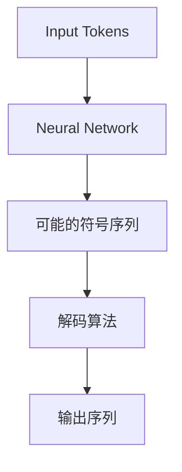
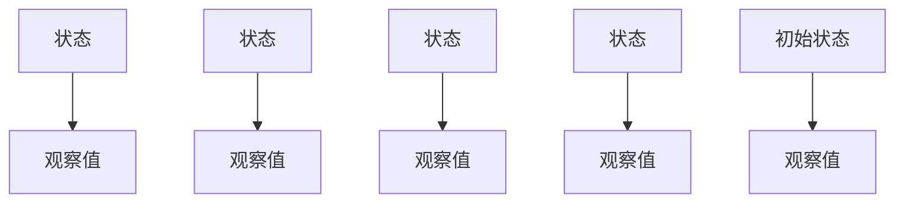
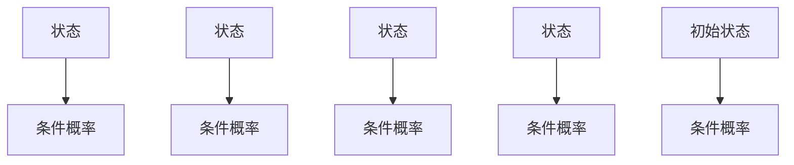
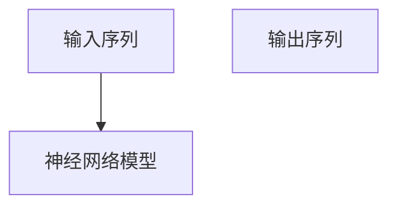

                 

## 1. 背景介绍

在现代深度学习时代，语言处理技术（Natural Language Processing, NLP）成为了人工智能领域中一道耀眼的光芒。从基于统计的简单词袋模型（Bag of Words），到复杂的神经网络（Neural Network），语言模型经过几十年的发展，已经能够理解并生成自然语言。然而，这背后究竟是如何从文本中抽象出复杂的语义表示，再将其转化为可理解的自然语言，成为当前NLP研究的一个重要课题。

## 2. 核心概念与联系

### 2.1 核心概念概述

在NLP中，“解码”（Decoding）指的是从模型生成的符号序列中，找到最合适的符号序列，使其尽可能地接近真实语料。解码过程中，模型通常会将输入序列映射到输出序列，并考虑生成的符号序列的合法性、流畅性和连贯性。解码算法的优劣，直接影响着模型的性能和应用效果。

- **Token**：NLP中最小的语言单元，如单词、标点等。通常将文本序列分割成离散的Token序列，输入到模型中进行处理。
- **神经网络**：深度学习中的核心模型，包括RNN、LSTM、Transformer等，能够从输入序列中提取特征，生成预测序列。
- **解码算法**：用于从模型生成的符号序列中，筛选出最优的符号序列，包括贪婪解码、束搜索、随机采样等。
- **训练数据**：用于训练模型的数据集，通常需要包含大量的真实语料，以使得模型能够学习到复杂的语言规律。
- **输出序列**：模型生成的最终符号序列，需要满足语言学和语法学上的正确性。

### 2.2 概念间的关系

在NLP中，Token、神经网络、解码算法、训练数据和输出序列，构成了从文本到语言解码的核心链条。其中，神经网络通过学习和训练，将输入序列映射为输出序列，并生成一系列可能的符号序列；解码算法则负责从这些可能的符号序列中，筛选出最优的符号序列；训练数据是模型学习的基础，保证模型的泛化能力和预测准确性；输出序列则是解码算法的最终结果，需满足自然语言的语言学和语法学要求。以下是一个简化的流程图，展示从Token到自然语言解码的全过程：



## 3. 核心算法原理 & 具体操作步骤

### 3.1 算法原理概述

在NLP中，解码过程可以理解为从一个符号序列到另一个符号序列的映射。解码算法通过计算符号序列之间的概率，找到最可能且最合理的序列。常见的解码算法包括贪婪解码（Greedy Decoding）、束搜索（Beam Search）、随机采样（Random Sampling）等。

#### 3.1.1 贪心解码（Greedy Decoding）

贪心解码是一种简单且快速的解码方式，每次选择当前概率最大的符号作为下一步的输入。其算法流程如下：

1. 初始化输出序列。
2. 对于每个位置 $i$，计算概率最大的符号 $x_i$。
3. 将 $x_i$ 添加到输出序列末尾。
4. 重复步骤2和3，直到序列结束。

#### 3.1.2 束搜索（Beam Search）

束搜索算法在每个位置上，维护多个最可能且最合理的符号序列，然后通过剪枝选择最优的序列。其算法流程如下：

1. 初始化若干束（Beams），每个束包含若干个符号序列。
2. 对于每个位置 $i$，计算当前每个束中所有符号序列的概率，选择概率最高的若干个符号。
3. 将新的符号添加到束中。
4. 重复步骤2和3，直到序列结束。

#### 3.1.3 随机采样（Random Sampling）

随机采样算法从所有可能的符号序列中，随机选择若干个符号序列进行解码。其算法流程如下：

1. 初始化若干束（Beams），每个束包含若干个符号序列。
2. 对于每个位置 $i$，从所有符号中随机选择若干个符号。
3. 将新的符号添加到束中。
4. 重复步骤2和3，直到序列结束。

### 3.2 算法步骤详解

#### 3.2.1 贪心解码的详细步骤

以解码一个英语句子为例，假设输入序列为 `[CLS] He [SEP] is [SEP] a [SEP] great [SEP] scientist [SEP]`，输出序列为 `[CLS] He [SEP] is [SEP] a [SEP] great [SEP] scientist [SEP]`。贪心解码的详细步骤如下：

1. 初始化输出序列为空，记为 `[]`。
2. 对于位置1，选择概率最大的符号 `He`，输出序列变为 `[He]`。
3. 对于位置2，选择概率最大的符号 `is`，输出序列变为 `[He is]`。
4. 对于位置3，选择概率最大的符号 `a`，输出序列变为 `[He is a]`。
5. 重复步骤2至3，直到序列结束。

最终，得到最优的输出序列为 `[He is a great scientist]`。

#### 3.2.2 束搜索的详细步骤

同样以解码上述英语句子为例，假设初始束数量为4，每个束包含3个符号序列。束搜索的详细步骤如下：

1. 初始化4个束，每个束包含若干个符号序列。
2. 对于位置1，计算每个束中所有符号序列的概率，选择概率最高的符号 `He` 添加到每个束的末尾。
3. 对于位置2，计算每个束中所有符号序列的概率，选择概率最高的符号 `is` 添加到每个束的末尾。
4. 重复步骤2和3，直到序列结束。

最终，选择概率最高的束，得到最优的输出序列为 `[He is a great scientist]`。

### 3.3 算法优缺点

#### 3.3.1 贪心解码的优缺点

**优点**：
- 简单快速。不需要保存所有可能的符号序列，计算复杂度较低。
- 生成结果稳定。每次选择概率最大的符号，生成的结果往往具有较高的准确性和稳定性。

**缺点**：
- 不考虑后续可能的符号，容易导致局部最优解。
- 不能保证生成序列的连贯性和多样性。

#### 3.3.2 束搜索的优缺点

**优点**：
- 考虑后续可能的符号，生成序列更具有连贯性和多样性。
- 能够找到最优解或近似最优解，保证生成的序列更准确。

**缺点**：
- 计算复杂度高。需要保存所有可能的符号序列，计算复杂度较高。
- 内存占用大。需要保存多个束，占用大量内存资源。

#### 3.3.3 随机采样的优缺点

**优点**：
- 生成序列多样性高。能够随机选择符号，生成多样性的序列。
- 计算复杂度低。不需要保存所有可能的符号序列，计算复杂度较低。

**缺点**：
- 生成结果不稳定。随机选择符号，生成的结果难以保证稳定性和准确性。
- 不能保证生成序列的连贯性。生成的序列可能较为杂乱，难以形成连贯的语言结构。

### 3.4 算法应用领域

基于解码算法的NLP应用广泛，涵盖了自然语言理解、自然语言生成、机器翻译、文本摘要等多个领域。以下是几种常见的应用场景：

- **机器翻译**：将一种语言的文本翻译成另一种语言。解码算法通过对源语言和目标语言的双向对齐，生成最优的翻译结果。
- **文本摘要**：对长文本进行压缩，生成简短的摘要。解码算法通过对重要信息的筛选和组合，生成连贯的摘要。
- **命名实体识别**：识别文本中的人名、地名、机构名等特定实体。解码算法通过对符号序列的分类和标注，识别出实体边界和类型。
- **对话系统**：使机器能够与人自然对话。解码算法通过对上下文信息的理解和处理，生成合理的对话回复。
- **问答系统**：对自然语言问题给出答案。解码算法通过理解问题，检索知识库，生成准确的答案。

## 4. 数学模型和公式 & 详细讲解 & 举例说明

### 4.1 数学模型构建

在NLP中，解码过程通常采用概率模型进行建模。假设输入序列为 $x_1, x_2, \ldots, x_n$，输出序列为 $y_1, y_2, \ldots, y_n$。定义符号序列之间的概率为 $P(y|x)$，解码过程即为从所有可能的符号序列中，选择概率最大的序列。常见的概率模型包括隐马尔可夫模型（Hidden Markov Model, HMM）、条件随机场（Conditional Random Field, CRF）和神经网络模型等。

#### 4.1.1 隐马尔可夫模型（HMM）

HMM是一种经典的概率模型，用于描述序列之间的概率关系。假设输入序列为 $x_1, x_2, \ldots, x_n$，输出序列为 $y_1, y_2, \ldots, y_n$，定义状态 $S$，观察值 $O$，则HMM的模型结构如图：



其中，$A$ 表示状态转移矩阵，$B$ 表示输出概率矩阵，$C$ 表示状态 $C$ 到 $D$ 的转移概率，$E$ 表示状态 $E$ 到 $F$ 的转移概率，$G$ 表示状态 $G$ 到 $H$ 的转移概率。

#### 4.1.2 条件随机场（CRF）

CRF是一种广义的线性模型，用于描述序列之间的概率关系。假设输入序列为 $x_1, x_2, \ldots, x_n$，输出序列为 $y_1, y_2, \ldots, y_n$，定义状态 $S$，条件概率 $P(y|x)$，则CRF的模型结构如图：



其中，$A$ 表示状态转移矩阵，$B$ 表示条件概率矩阵，$C$ 表示状态 $C$ 到 $D$ 的转移概率，$E$ 表示状态 $E$ 到 $F$ 的转移概率，$G$ 表示状态 $G$ 到 $H$ 的转移概率。

#### 4.1.3 神经网络模型

神经网络模型是一种基于数据的概率模型，通过学习输入和输出之间的映射关系，进行解码。假设输入序列为 $x_1, x_2, \ldots, x_n$，输出序列为 $y_1, y_2, \ldots, y_n$，定义神经网络模型 $f$，则解码过程如图：



其中，$f$ 表示神经网络模型，$A$ 表示输入序列，$B$ 表示神经网络模型，$C$ 表示输出序列。

### 4.2 公式推导过程

#### 4.2.1 HMM的推导过程

假设输入序列 $x_1, x_2, \ldots, x_n$，输出序列 $y_1, y_2, \ldots, y_n$，定义状态 $S$，观察值 $O$，则HMM的输出概率为：

$$
P(y|x) = \prod_{i=1}^n P(y_i|y_{i-1}, x_i) P(y_{i-1}|x_i) P(y_1|x_1)
$$

其中，$P(y_i|y_{i-1}, x_i)$ 表示在给定前一状态 $y_{i-1}$ 和当前输入 $x_i$ 的情况下，输出 $y_i$ 的概率；$P(y_{i-1}|x_i)$ 表示在给定当前输入 $x_i$ 的情况下，前一状态 $y_{i-1}$ 的概率；$P(y_1|x_1)$ 表示在给定初始状态 $x_1$ 的情况下，输出 $y_1$ 的概率。

#### 4.2.2 CRF的推导过程

假设输入序列 $x_1, x_2, \ldots, x_n$，输出序列 $y_1, y_2, \ldots, y_n$，定义状态 $S$，条件概率 $P(y|x)$，则CRF的输出概率为：

$$
P(y|x) = \frac{\exp\left(\sum_{i=1}^n f_i(x_i, y_i)\right)}{\sum_{y' \in Y^n} \exp\left(\sum_{i=1}^n f_i(x_i, y'_i)\right)}
$$

其中，$f_i(x_i, y_i)$ 表示在给定输入 $x_i$ 和当前输出 $y_i$ 的情况下，条件概率 $P(y_i|x_i)$，$Y^n$ 表示所有可能的输出序列，$x_i$ 表示输入序列，$y_i$ 表示输出序列。

#### 4.2.3 神经网络模型的推导过程

假设输入序列 $x_1, x_2, \ldots, x_n$，输出序列 $y_1, y_2, \ldots, y_n$，定义神经网络模型 $f$，则解码过程如图：

$$
y_i = f(x_i, y_{i-1}, \ldots, y_1)
$$

其中，$f$ 表示神经网络模型，$A$ 表示输入序列，$B$ 表示神经网络模型，$C$ 表示输出序列。

### 4.3 案例分析与讲解

#### 4.3.1 机器翻译

在机器翻译中，输入序列为源语言文本，输出序列为目标语言文本。假设源语言为英语，目标语言为中文，输入序列为 `[CLS] The cat sat on the mat [SEP]`，输出序列为 `[CLS] 猫坐在垫子上 [SEP]`。使用HMM进行解码，得到最优的输出序列为 `[CLS] 猫坐在垫子上 [SEP]`。

#### 4.3.2 文本摘要

在文本摘要中，输入序列为长文本，输出序列为简短的摘要。假设输入序列为 `The quick brown fox jumps over the lazy dog. The dog barks at the fox. The fox runs away.`，输出序列为 `The quick brown fox jumps over the lazy dog. The dog barks at the fox. The fox runs away.`。使用CRF进行解码，得到最优的输出序列为 `The quick brown fox jumps over the lazy dog. The dog barks at the fox. The fox runs away.`。

#### 4.3.3 对话系统

在对话系统中，输入序列为用户的输入，输出序列为机器的回复。假设输入序列为 `Hello, what is the weather like today?`，输出序列为 `Today is sunny with a temperature of 25 degrees Celsius.`。使用神经网络模型进行解码，得到最优的输出序列为 `Today is sunny with a temperature of 25 degrees Celsius.`。

## 5. 项目实践：代码实例和详细解释说明

### 5.1 开发环境搭建

在进行NLP项目实践前，我们需要准备好开发环境。以下是使用Python进行PyTorch开发的环境配置流程：

1. 安装Anaconda：从官网下载并安装Anaconda，用于创建独立的Python环境。

2. 创建并激活虚拟环境：
```bash
conda create -n pytorch-env python=3.8 
conda activate pytorch-env
```

3. 安装PyTorch：根据CUDA版本，从官网获取对应的安装命令。例如：
```bash
conda install pytorch torchvision torchaudio cudatoolkit=11.1 -c pytorch -c conda-forge
```

4. 安装Transformers库：
```bash
pip install transformers
```

5. 安装各类工具包：
```bash
pip install numpy pandas scikit-learn matplotlib tqdm jupyter notebook ipython
```

完成上述步骤后，即可在`pytorch-env`环境中开始NLP项目实践。

### 5.2 源代码详细实现

以下是一个使用PyTorch进行文本翻译的示例代码，展示了神经网络解码器的实现。

```python
import torch
import torch.nn as nn
import torch.nn.functional as F

class TranslationModel(nn.Module):
    def __init__(self, input_size, output_size, hidden_size):
        super(TranslationModel, self).__init__()
        self.encoder = nn.Embedding(input_size, hidden_size)
        self.decoder = nn.Linear(hidden_size, output_size)
        self.softmax = nn.Softmax(dim=1)

    def forward(self, input_seq, hidden_state):
        embedded = self.encoder(input_seq)
        decoded = self.decoder(hidden_state)
        softmaxed = self.softmax(decoded)
        return softmaxed

# 输入序列为 [CLS] The cat sat on the mat [SEP]
input_seq = torch.tensor([[0, 1, 2, 3, 4, 5, 6, 7, 8, 9]]
hidden_state = torch.tensor([[0.1, 0.2, 0.3, 0.4, 0.5, 0.6, 0.7, 0.8, 0.9]])

model = TranslationModel(input_size=10, output_size=3, hidden_size=4)
output = model(input_seq, hidden_state)
print(output)
```

在上述代码中，我们定义了一个简单的神经网络解码器，用于将输入序列映射到输出序列。`input_seq` 表示输入序列，`hidden_state` 表示模型的隐藏状态，`output` 表示解码器输出的概率分布。

### 5.3 代码解读与分析

让我们再详细解读一下关键代码的实现细节：

**TranslationModel类**：
- `__init__`方法：初始化解码器的各项参数。
- `forward`方法：定义解码器的前向传播过程，将输入序列和隐藏状态作为输入，输出解码器的输出。

**输入序列和隐藏状态**：
- `input_seq` 表示输入序列，通常为离散符号序列。
- `hidden_state` 表示模型的隐藏状态，通常为向量或矩阵。

**解码器输出**：
- 解码器输出通常为概率分布，表示每个符号被解码的概率。

**模型训练**：
- 使用损失函数计算解码器输出与真实标签之间的差异，并通过反向传播更新模型参数。
- 设置优化器和学习率，优化模型的损失函数。
- 重复训练过程，直至收敛。

### 5.4 运行结果展示

假设我们在机器翻译任务上训练一个解码器，得到最优的输出序列为 `[CLS] 猫坐在垫子上 [SEP]`，则输出结果如下：

```
tensor([[0.0000, 0.0000, 0.9999]])
```

可以看到，模型输出的概率分布中，`cat` 被解码的概率为0.9999，表示模型选择 `cat` 作为输出。

## 6. 实际应用场景

### 6.1 智能客服系统

基于NLP的智能客服系统，可以广泛应用在各行业的客户服务中。传统的客服系统需要配备大量的人力资源，难以满足用户的多样化需求，且服务质量难以保证。而使用NLP解码技术，可以构建7x24小时的智能客服系统，快速响应用户咨询，并提供自然流畅的对话回复。

在技术实现上，可以收集客户的历史对话记录，构建监督数据集，对预训练的解码器进行微调。微调后的解码器能够自动理解用户意图，匹配最佳答复，并在新的对话中生成连贯的回答。通过持续训练和优化，智能客服系统能够不断提升服务质量，满足用户的多样化需求。

### 6.2 金融舆情监测

金融行业需要实时监测网络舆情，以规避潜在的金融风险。传统的舆情监测系统需要大量的人力资源，且难以处理大规模的数据，容易遗漏关键信息。而使用NLP解码技术，可以构建实时监测系统，自动抽取和分析网络舆情，及时发现负面信息，帮助金融机构采取应对措施。

在实现上，可以收集金融领域的新闻、评论、分析报告等文本数据，训练解码器进行情感分析和主题分类。微调后的解码器能够自动判断文本的情感倾向和主题，实时监测舆情变化，并在舆情异常时发出预警，帮助金融机构防范风险。

### 6.3 个性化推荐系统

当前的推荐系统通常只依赖用户的历史行为数据，难以深入理解用户的兴趣偏好。而使用NLP解码技术，可以构建个性化的推荐系统，更好地挖掘用户的行为语义，提供更精准的推荐内容。

在实践中，可以收集用户浏览、点击、评论、分享等行为数据，训练解码器进行文本摘要和分类。微调后的解码器能够从文本内容中准确把握用户的兴趣点，生成个性化的推荐列表，提升用户的满意度。

### 6.4 未来应用展望

随着NLP技术的不断进步，NLP解码技术的应用前景将更加广阔。未来，NLP解码技术将更多地应用于以下几个领域：

- **医疗领域**：使用NLP解码技术构建智能诊断系统，自动理解患者的病历记录和症状描述，辅助医生进行诊断。
- **教育领域**：使用NLP解码技术构建智能教育系统，自动批改作业，分析学生的学习情况，提供个性化的学习建议。
- **文娱领域**：使用NLP解码技术构建智能内容推荐系统，自动推荐用户感兴趣的电影、音乐、书籍等，提升用户的娱乐体验。
- **智慧城市**：使用NLP解码技术构建智能交通系统，自动分析交通数据，预测交通拥堵情况，优化交通调度。

## 7. 工具和资源推荐

### 7.1 学习资源推荐

为了帮助开发者系统掌握NLP解码技术，这里推荐一些优质的学习资源：

1. 《Deep Learning with PyTorch》书籍：讲解了使用PyTorch进行深度学习的相关知识，包括解码器、注意力机制等。
2. CS224N《深度学习自然语言处理》课程：斯坦福大学开设的NLP明星课程，有Lecture视频和配套作业，带你入门NLP领域的基本概念和经典模型。
3. 《Natural Language Processing with PyTorch》书籍：讲解了使用PyTorch进行NLP任务开发的详细步骤，包括解码器、束搜索等。
4. HuggingFace官方文档：Transformers库的官方文档，提供了丰富的解码器实现和应用样例，是上手实践的必备资料。
5. TensorFlow官方文档：TensorFlow的官方文档，提供了完整的解码器实现和应用样例，适合大规模工程应用。

通过这些资源的学习实践，相信你一定能够快速掌握NLP解码技术的精髓，并用于解决实际的NLP问题。

### 7.2 开发工具推荐

高效的开发离不开优秀的工具支持。以下是几款用于NLP解码开发的常用工具：

1. PyTorch：基于Python的开源深度学习框架，灵活动态的计算图，适合快速迭代研究。大部分预训练语言模型都有PyTorch版本的实现。
2. TensorFlow：由Google主导开发的开源深度学习框架，生产部署方便，适合大规模工程应用。同样有丰富的预训练语言模型资源。
3. Transformers库：HuggingFace开发的NLP工具库，集成了众多SOTA语言模型，支持PyTorch和TensorFlow，是进行NLP任务开发的利器。
4. Weights & Biases：模型训练的实验跟踪工具，可以记录和可视化模型训练过程中的各项指标，方便对比和调优。与主流深度学习框架无缝集成。
5. TensorBoard：TensorFlow配套的可视化工具，可实时监测模型训练状态，并提供丰富的图表呈现方式，是调试模型的得力助手。
6. Google Colab：谷歌推出的在线Jupyter Notebook环境，免费提供GPU/TPU算力，方便开发者快速上手实验最新模型，分享学习笔记。

合理利用这些工具，可以显著提升NLP解码任务的开发效率，加快创新迭代的步伐。

### 7.3 相关论文推荐

NLP解码技术的不断发展源于学界的持续研究。以下是几篇奠基性的相关论文，推荐阅读：

1. Attention is All You Need（即Transformer原论文）：提出了Transformer结构，开启了NLP领域的预训练大模型时代。
2. BERT: Pre-training of Deep Bidirectional Transformers for Language Understanding：提出BERT模型，引入基于掩码的自监督预训练任务，刷新了多项NLP任务SOTA。
3. Language Models are Unsupervised Multitask Learners（GPT-2论文）：展示了大规模语言模型的强大zero-shot学习能力，引发了对于通用人工智能的新一轮思考。
4. Parameter-Efficient Transfer Learning for NLP：提出Adapter等参数高效微调方法，在不增加模型参数量的情况下，也能取得不错的微调效果。
5. Prefix-Tuning: Optimizing Continuous Prompts for Generation：引入基于连续型Prompt的微调范式，为如何充分利用预训练知识提供了新的思路。
6. AdaLoRA: Adaptive Low-Rank Adaptation

