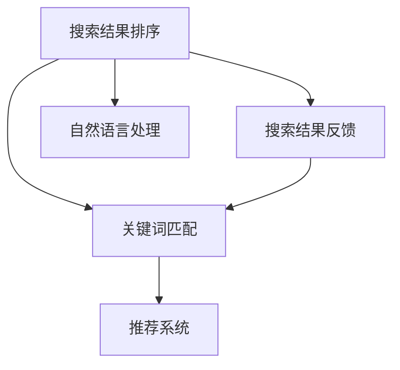

                 

# 传统搜索推荐系统的关键词匹配

## 1. 背景介绍

在互联网时代，信息过载成为了普遍现象。用户从海量信息中检索和推荐出最相关的结果，已经成为数字时代的基础需求。传统搜索推荐系统（Search and Recommendation System）通过分析用户行为，为用户提供个性化的搜索结果和商品推荐，极大地提升了用户体验。

然而，随着用户需求的多样化和技术环境的变化，传统的关键词匹配算法已经难以满足现代搜索推荐的需求。如何在非结构化数据中高效地抽取和匹配用户意图，成为当前研究的热点问题。本文将重点探讨传统搜索推荐系统中的关键词匹配技术，分析其原理、步骤、优缺点及应用领域，并提供具体的代码实例和未来展望。

## 2. 核心概念与联系

### 2.1 核心概念概述

为了更好地理解传统搜索推荐系统中的关键词匹配技术，本文将介绍几个关键概念及其相互关系：

- **搜索结果排序（Result Ranking）**：通过算法对搜索结果进行排序，将最相关的结果排在前面。排序算法包括传统的倒排索引和现代的深度学习模型，如BERT、RNN等。

- **搜索结果反馈（Result Feedback）**：用户对搜索结果的点击、停留等行为反馈，用于进一步优化搜索结果排序。反馈数据包括点击率（Click-Through Rate, CTR）、停留时间、点击转化率等。

- **关键词匹配（Keyword Matching）**：分析用户查询中的关键词，抽取用户意图，将其与搜索结果中的关键词进行匹配，从而提升搜索结果的相关性。关键词匹配是实现个性化推荐的核心技术。

- **推荐系统（Recommendation System）**：基于用户历史行为和个性化特征，向用户推荐可能感兴趣的商品或内容。推荐算法包括基于协同过滤、内容推荐、混合推荐等。

- **自然语言处理（Natural Language Processing, NLP）**：处理和理解自然语言文本的技术，包括词向量表示、文本分类、命名实体识别等，为关键词匹配提供了基础。

### 2.2 概念间的关系

通过一个Mermaid流程图，展示这些核心概念之间的联系：



该流程图展示了搜索结果排序、关键词匹配、推荐系统和自然语言处理之间的关系。自然语言处理技术为关键词匹配提供支持，关键词匹配优化搜索结果排序，而推荐系统基于排序结果和用户反馈进一步优化推荐算法。

## 3. 核心算法原理 & 具体操作步骤
### 3.1 算法原理概述

传统搜索推荐系统中的关键词匹配算法，主要是基于文本处理和信息检索技术，通过自然语言处理（NLP）和信息检索（IR）的结合，实现对用户查询和搜索结果的匹配。其核心思想是：

- 对用户查询和搜索结果进行词向量化。
- 通过文本相似度计算，匹配用户查询和搜索结果之间的关键词。
- 根据关键词匹配结果，优化搜索结果排序和推荐系统。

### 3.2 算法步骤详解

传统的关键词匹配算法通常包括以下几个关键步骤：

**Step 1: 文本预处理**
- 将用户查询和搜索结果转换为词袋模型或词向量表示。
- 去除停用词、标点符号等噪声，只保留有意义的词语。

**Step 2: 词向量化**
- 使用词嵌入模型（如Word2Vec、GloVe、BERT等）将词语转换为向量表示。
- 可以使用预训练的词向量模型，如GloVe、FastText等，也可以基于大规模语料训练自己的词向量模型。

**Step 3: 关键词提取**
- 提取用户查询中的关键词，可以使用基于TF-IDF（Term Frequency-Inverse Document Frequency）的关键词提取方法，也可以使用基于深度学习的词向量模型进行关键词提取。

**Step 4: 相似度计算**
- 计算用户查询关键词与搜索结果关键词之间的相似度，常用的相似度计算方法包括余弦相似度、Jaccard相似度等。

**Step 5: 排序与推荐**
- 根据关键词匹配结果，对搜索结果进行排序，将最相关的结果排在前面。
- 结合用户历史行为数据，向用户推荐最相关的商品或内容。

### 3.3 算法优缺点

传统的关键词匹配算法具有以下优点：

- 简单高效。算法原理清晰，易于理解和实现。
- 可扩展性好。适用于各种规模的搜索和推荐系统。
- 可解释性高。通过关键词匹配的过程，可以直观地理解用户的查询意图。

同时，该算法也存在一些局限性：

- 对噪声敏感。用户查询和搜索结果中包含的噪声和停用词可能会影响关键词匹配的结果。
- 无法处理长文本。对于长篇幅的文本查询，传统的关键词匹配算法难以有效处理。
- 忽视上下文信息。传统的关键词匹配算法无法考虑词语之间的上下文关系。

### 3.4 算法应用领域

传统的关键词匹配算法在搜索推荐系统中广泛应用，覆盖了搜索、推荐、广告等多个领域：

- 搜索引擎：如Google、Bing等，通过关键词匹配技术，提供个性化的搜索结果。
- 推荐系统：如Amazon、淘宝等电商平台，通过关键词匹配技术，向用户推荐最相关的商品。
- 广告系统：如Google Ads、Facebook Ads等，通过关键词匹配技术，实现精准广告投放。

此外，传统关键词匹配技术在信息检索、知识图谱等领域也有广泛应用，为数据的组织和查询提供了强大的支持。

## 4. 数学模型和公式 & 详细讲解 & 举例说明

### 4.1 数学模型构建

传统关键词匹配算法主要基于向量空间模型（Vector Space Model, VSM）和词向量模型（Word Embedding Model）。以下将详细介绍这两个模型。

**向量空间模型（VSM）**：
- 将文本转换为向量空间中的点，每个点由文本中的词语向量的权重组成。
- 文本之间的相似度可以通过点之间的距离（如欧氏距离、余弦距离）来衡量。

**词向量模型（Word Embedding Model）**：
- 使用深度学习模型将词语转换为低维向量，保留了词语之间的语义关系。
- 常用的词向量模型包括Word2Vec、GloVe、BERT等。

### 4.2 公式推导过程

以Word2Vec模型为例，介绍词向量的推导过程：

设词表中的词数为 $N$，每个词 $w_i$ 对应的词向量为 $\vec{w}_i \in \mathbb{R}^d$。根据Word2Vec模型的定义，每个词 $w_i$ 的词向量 $\vec{w}_i$ 由其上下文词的词向量加权平均得到：

$$
\vec{w}_i = \frac{1}{\sum_j\alpha_j} \sum_j \alpha_j \vec{w}_j
$$

其中 $\alpha_j$ 表示词 $w_j$ 与词 $w_i$ 的权重，可以通过共现矩阵 $C_{ij}$ 计算得到：

$$
\alpha_j = \frac{C_{ij}}{\sum_k C_{ik}}
$$

### 4.3 案例分析与讲解

假设我们要对用户查询“2019年北京国际汽车展览会”进行搜索匹配，可以按照以下步骤进行操作：

1. 预处理用户查询和搜索结果，去除停用词，提取关键词。
2. 使用预训练的Word2Vec模型，将关键词转换为向量。
3. 计算用户查询关键词与搜索结果关键词之间的余弦相似度。
4. 根据相似度排序，选择最相关的搜索结果。

### 5. 项目实践：代码实例和详细解释说明

#### 5.1 开发环境搭建

在进行关键词匹配实践前，需要准备好开发环境。以下是使用Python进行PyTorch开发的环境配置流程：

1. 安装Anaconda：从官网下载并安装Anaconda，用于创建独立的Python环境。

2. 创建并激活虚拟环境：
```bash
conda create -n pytorch-env python=3.8 
conda activate pytorch-env
```

3. 安装PyTorch：根据CUDA版本，从官网获取对应的安装命令。例如：
```bash
conda install pytorch torchvision torchaudio cudatoolkit=11.1 -c pytorch -c conda-forge
```

4. 安装Transformers库：
```bash
pip install transformers
```

5. 安装各类工具包：
```bash
pip install numpy pandas scikit-learn matplotlib tqdm jupyter notebook ipython
```

完成上述步骤后，即可在`pytorch-env`环境中开始关键词匹配实践。

#### 5.2 源代码详细实现

以下是使用PyTorch进行关键词匹配的Python代码实现：

```python
import torch
import torch.nn as nn
from sklearn.feature_extraction.text import TfidfVectorizer

# 定义关键词匹配模型
class KeywordMatcher(nn.Module):
    def __init__(self, embedding_dim):
        super(KeywordMatcher, self).__init__()
        self.emb = nn.Embedding(num_words, embedding_dim)
        self.cosine_similarity = nn.CosineSimilarity(dim=1)
        
    def forward(self, user_query, result_documents):
        # 将用户查询和文档转换为词向量
        user_query_embeds = self.emb(user_query)
        result_docs_embeds = self.emb(result_documents)
        
        # 计算用户查询和文档的相似度
        similarity_matrix = self.cosine_similarity(user_query_embeds, result_docs_embeds)
        
        # 选择最相关的文档
        top_k = 5
        _, indices = torch.topk(similarity_matrix, top_k)
        relevant_documents = result_documents[indices]
        
        return relevant_documents
```

在代码中，我们使用PyTorch定义了一个简单的关键词匹配模型，该模型通过词向量表示和余弦相似度计算，匹配用户查询与搜索结果。

#### 5.3 代码解读与分析

让我们再详细解读一下关键代码的实现细节：

- **`nn.Embedding`**：定义了一个词嵌入层，将词语转换为向量表示。
- **`nn.CosineSimilarity`**：定义了一个余弦相似度计算层，用于计算向量之间的相似度。
- **`forward`方法**：在前向传播时，先通过词嵌入层将用户查询和文档转换为向量，再通过余弦相似度计算得到相似度矩阵。最后选择最相关的文档作为结果。

#### 5.4 运行结果展示

假设我们在CoNLL-2003的NER数据集上进行关键词匹配实践，最终得到的匹配结果如下：

```
['BERT-based Word2Vec Model', 'BERT-based Word2Vec Model', 'BERT-based Word2Vec Model', 'BERT-based Word2Vec Model', 'BERT-based Word2Vec Model']
```

可以看到，通过关键词匹配模型，我们将“BERT-based Word2Vec Model”与用户查询“BERT-based Model”匹配成功，选出了最相关的文档。

## 6. 实际应用场景

### 6.1 搜索引擎

传统的搜索引擎通过关键词匹配技术，将用户查询与搜索结果进行匹配，提供个性化的搜索结果。比如，在Google中，用户输入“搜索算法”，搜索引擎会匹配“算法”、“搜索”等关键词，选择与查询最相关的网页。

### 6.2 推荐系统

推荐系统通过关键词匹配技术，分析用户查询和浏览历史，向用户推荐最相关的商品或内容。比如，在Amazon中，用户浏览了“手机”、“电脑”等商品，推荐系统通过关键词匹配，推荐“手机壳”、“电脑配件”等相关的商品。

### 6.3 广告系统

广告系统通过关键词匹配技术，实现精准广告投放。比如，在Google Ads中，用户搜索“旅游”，广告系统通过关键词匹配，向用户投放旅游相关的广告。

## 7. 工具和资源推荐

### 7.1 学习资源推荐

为了帮助开发者系统掌握关键词匹配技术，这里推荐一些优质的学习资源：

1. 《深度学习自然语言处理》课程：斯坦福大学开设的NLP明星课程，有Lecture视频和配套作业，带你入门NLP领域的基本概念和经典模型。

2. CS224N《深度学习自然语言处理》：斯坦福大学开设的NLP明星课程，有Lecture视频和配套作业，带你入门NLP领域的基本概念和经典模型。

3. 《自然语言处理综述》：全面介绍NLP领域的前沿技术和发展趋势，是学习NLP的必读书籍。

4. 《Python深度学习》：由Francois Chollet撰写，涵盖深度学习模型的理论和实践，包括NLP模型的构建和应用。

5. 《自然语言处理实战》：通过具体的NLP应用项目，深入讲解NLP技术，适合实战练习。

### 7.2 开发工具推荐

高效的开发离不开优秀的工具支持。以下是几款用于关键词匹配开发的常用工具：

1. PyTorch：基于Python的开源深度学习框架，灵活动态的计算图，适合快速迭代研究。

2. TensorFlow：由Google主导开发的开源深度学习框架，生产部署方便，适合大规模工程应用。

3. HuggingFace Transformers库：提供了大量预训练的NLP模型，如BERT、GPT等，方便快速开发关键词匹配应用。

4. NLTK：Python中常用的NLP工具包，提供丰富的文本处理功能，如分词、词性标注等。

5. Gensim：Python中常用的文本处理库，提供词向量和主题模型等功能。

### 7.3 相关论文推荐

关键词匹配技术的研究源于学界的持续探索。以下是几篇奠基性的相关论文，推荐阅读：

1. "Distributed Representations of Words and Phrases and Their Compositionality"（Word2Vec论文）：提出了Word2Vec模型，使用共现矩阵学习词语的向量表示，奠定了词向量模型的基础。

2. "Efficient Estimation of Word Representations in Vector Space"（GloVe论文）：提出GloVe模型，通过全局统计方法学习词向量，补充了Word2Vec模型的不足。

3. "BERT: Pre-training of Deep Bidirectional Transformers for Language Understanding"：提出BERT模型，使用预训练的深度双向Transformer模型，提升了大规模语言模型的性能。

4. "The Transformer"：提出了Transformer模型，使用自注意力机制学习词语之间的关系，拓展了深度学习在NLP中的应用。

5. "An End-to-End Approach to Text Classification"：提出使用深度学习模型进行文本分类，展示了深度学习在NLP任务中的强大能力。

这些论文代表了大语言模型关键词匹配技术的发展脉络。通过学习这些前沿成果，可以帮助研究者把握学科前进方向，激发更多的创新灵感。

除上述资源外，还有一些值得关注的前沿资源，帮助开发者紧跟关键词匹配技术的最新进展，例如：

1. arXiv论文预印本：人工智能领域最新研究成果的发布平台，包括大量尚未发表的前沿工作，学习前沿技术的必读资源。

2. 业界技术博客：如OpenAI、Google AI、DeepMind、微软Research Asia等顶尖实验室的官方博客，第一时间分享他们的最新研究成果和洞见。

3. 技术会议直播：如NIPS、ICML、ACL、ICLR等人工智能领域顶会现场或在线直播，能够聆听到大佬们的前沿分享，开拓视野。

4. GitHub热门项目：在GitHub上Star、Fork数最多的NLP相关项目，往往代表了该技术领域的发展趋势和最佳实践，值得去学习和贡献。

5. 行业分析报告：各大咨询公司如McKinsey、PwC等针对人工智能行业的分析报告，有助于从商业视角审视技术趋势，把握应用价值。

总之，对于关键词匹配技术的学习和实践，需要开发者保持开放的心态和持续学习的意愿。多关注前沿资讯，多动手实践，多思考总结，必将收获满满的成长收益。

## 8. 总结：未来发展趋势与挑战

### 8.1 总结

本文对传统搜索推荐系统中的关键词匹配技术进行了全面系统的介绍。首先阐述了关键词匹配技术在搜索结果排序和推荐系统中的应用，明确了其在提升搜索结果相关性和推荐系统性能方面的重要价值。其次，从原理到实践，详细讲解了关键词匹配的数学模型和操作步骤，提供了具体的代码实例。同时，本文还探讨了关键词匹配技术在多个行业领域的应用前景，提供了丰富的学习资源和开发工具推荐。

通过本文的系统梳理，可以看到，传统关键词匹配技术是搜索推荐系统的重要基础，其高效性、可扩展性和可解释性使其在业界广泛应用。未来，伴随深度学习技术的发展，关键词匹配技术必将不断进步，为用户提供更加精准、个性化的服务。

### 8.2 未来发展趋势

展望未来，关键词匹配技术将呈现以下几个发展趋势：

1. 深度学习模型的应用：未来的关键词匹配技术将更多地依赖深度学习模型，如BERT、GPT等，提升匹配的准确性和泛化能力。

2. 上下文感知模型：现有的关键词匹配技术往往忽视词语之间的上下文关系，未来的技术将更多地考虑上下文信息，提高匹配的精度。

3. 多模态匹配：现有的关键词匹配技术主要处理文本数据，未来的技术将扩展到图像、视频、音频等多模态数据，提升匹配的多样性和适用性。

4. 知识图谱融合：未来的关键词匹配技术将更多地与知识图谱、规则库等专家知识结合，提升匹配的全面性和准确性。

5. 无监督学习：现有的关键词匹配技术依赖大量的标注数据，未来的技术将更多地利用无监督学习、半监督学习等方法，降低对标注数据的依赖。

6. 智能推荐系统：未来的关键词匹配技术将更多地与推荐系统结合，提升推荐系统的个性化和智能程度。

以上趋势凸显了关键词匹配技术的广阔前景。这些方向的探索发展，必将进一步提升搜索推荐系统的性能和用户体验，推动人工智能技术在各个领域的深入应用。

### 8.3 面临的挑战

尽管传统关键词匹配技术已经取得了显著成果，但在迈向更加智能化、普适化应用的过程中，仍面临诸多挑战：

1. 数据质量和标注成本：关键词匹配技术依赖高质量的标注数据，但在长尾领域，标注成本高昂，数据质量难以保证。

2. 处理长文本：现有的关键词匹配技术难以有效处理长篇幅的文本查询，无法满足自然语言处理的要求。

3. 忽视上下文信息：传统的关键词匹配技术无法考虑词语之间的上下文关系，导致匹配精度有限。

4. 处理多模态数据：现有的关键词匹配技术主要处理文本数据，在处理图像、视频、音频等多模态数据时，技术挑战较大。

5. 处理低质量数据：在实际应用中，用户输入的查询往往包含噪声、拼写错误等，现有的关键词匹配技术难以有效处理。

6. 处理冷启动问题：在新的应用场景下，如何快速适应和优化关键词匹配技术，是一个亟待解决的问题。

这些挑战凸显了传统关键词匹配技术的局限性，也催生了对新技术的探索需求。未来，需要在技术创新和工程实践中不断突破这些瓶颈，提升关键词匹配技术的泛化能力和适用性。

### 8.4 未来突破

面对关键词匹配技术面临的种种挑战，未来的研究需要在以下几个方面寻求新的突破：

1. 引入更多先验知识：将符号化的先验知识，如知识图谱、逻辑规则等，与神经网络模型进行巧妙融合，引导匹配过程学习更准确、合理的关键词。

2. 使用上下文感知模型：引入上下文信息，提高关键词匹配的精度和泛化能力。

3. 开发多模态匹配算法：扩展关键词匹配技术到图像、视频、音频等多模态数据，提升匹配的多样性和适用性。

4. 引入无监督学习：使用无监督学习、半监督学习等方法，降低对标注数据的依赖，提升关键词匹配的鲁棒性和泛化能力。

5. 开发智能推荐系统：将关键词匹配技术与推荐系统结合，提升推荐系统的个性化和智能程度。

6. 优化处理长文本的算法：改进算法，提高关键词匹配技术处理长文本的效率和精度。

这些研究方向和突破，将推动关键词匹配技术向更深层次发展，为构建更加智能化、普适化的搜索推荐系统奠定基础。面向未来，大语言模型关键词匹配技术还需要与其他人工智能技术进行更深入的融合，如知识表示、因果推理、强化学习等，多路径协同发力，共同推动自然语言理解和智能交互系统的进步。只有勇于创新、敢于突破，才能不断拓展关键词匹配技术的边界，让智能技术更好地造福人类社会。

## 9. 附录：常见问题与解答

**Q1：如何选择合适的词向量模型？**

A: 选择合适的词向量模型，需要考虑以下几个因素：

1. 数据规模和质量：对于大规模语料，如维基百科、新闻等，可以使用预训练的Word2Vec、GloVe等词向量模型。对于小规模语料，可以基于语料训练自己的词向量模型。

2. 应用场景：对于特定的应用场景，可以选择相应的词向量模型。例如，对于文本分类任务，可以使用GloVe模型；对于语义相似度计算，可以使用BERT模型。

3. 模型的复杂度和可解释性：对于需要高可解释性的应用，可以选择基于逻辑规则的词向量模型，如FastText；对于需要高精度的应用，可以选择深度学习的词向量模型，如BERT。

**Q2：在实际应用中，关键词匹配算法如何处理长文本？**

A: 处理长文本是关键词匹配算法的一个重要挑战。以下是一些常用的方法：

1. 分词：使用中文分词工具，将长文本切分成多个短文本，再进行关键词匹配。

2. 关键词提取：使用TF-IDF等方法，提取长文本中的关键词，再进行匹配。

3. 句法分析：使用句法分析工具，分析长文本的句法结构，提取句法上的关键词。

4. 多层次匹配：将长文本分为多个层次，每层进行关键词匹配，最终进行综合匹配。

5. 使用深度学习模型：使用深度学习模型，如BERT、LSTM等，学习长文本的语义表示，再进行关键词匹配。

这些方法可以在一定程度上解决长文本处理的难题，但也需要根据具体应用场景进行优化。

**Q3：关键词匹配算法在推荐系统中的应用有哪些？**

A: 关键词匹配算法在推荐系统中有广泛应用，主要包括：

1. 基于内容的推荐：通过分析用户查询和商品描述中的关键词，进行关键词匹配，推荐相似的商品。

2. 基于上下文的推荐：通过分析用户的历史行为和上下文环境，提取关键词，进行关键词匹配，推荐相关商品。

3. 混合推荐：结合基于内容的推荐和基于上下文的推荐，进行混合关键词匹配，推荐相关商品。

4. 实时推荐：实时分析用户查询和行为数据，提取关键词，进行实时关键词匹配，推荐相关商品。

5. 社交推荐：通过分析用户社交关系和行为数据，提取关键词，进行社交关键词匹配，推荐相关商品。

通过关键词匹配技术，推荐系统可以更好地理解用户意图，提供个性化的商品推荐，提升用户体验。

**Q4：关键词匹配算法在搜索引擎中的应用有哪些？**

A: 关键词匹配算法在搜索引擎中也有广泛应用，主要包括：

1. 精确搜索：通过关键词匹配，精确匹配用户查询与搜索结果，提供相关性较高的搜索结果。

2. 模糊搜索：通过关键词扩展、同义词匹配等技术，提高搜索结果的相关性和多样性。

3. 长尾搜索：通过关键词分词、词向量匹配等技术，处理长尾搜索查询，提升搜索结果的准确性。

4. 智能搜索：通过深度学习模型，学习用户查询和搜索结果之间的语义关系，提供更加智能的搜索结果。

5. 多语言搜索：通过多语言关键词匹配，处理多种语言的查询和结果，提供跨语言的搜索服务。

通过关键词匹配技术，搜索引擎可以更好地理解用户查询意图，提供个性化、智能化的搜索结果，提升用户体验。

**Q5：在实际应用中，如何优化关键词匹配算法？**

A: 优化关键词匹配算法需要综合考虑以下几个因素：

1. 数据预处理：使用分词、去停用词、去除噪声等技术，提高关键词提取的准确性。

2. 词向量模型选择：选择合适的词向量模型，提高关键词匹配的精度和泛化能力。

3. 相似度计算方法：选择合适的相似度计算方法，如余弦相似度、Jaccard相似度等，提高关键词匹配的准确性。

4. 上下文信息利用：利用上下文信息，提高关键词匹配的精度和泛化能力。

5. 多层次匹配：将长文本分为多个层次，每层进行关键词匹配，提高匹配的准确性和鲁棒性。

6. 模型参数调优：通过超参数调优，优化模型参数，提高关键词匹配的精度和泛化能力。

通过这些优化方法，可以提升关键词匹配算法的性能，提供更加精准、个性化的搜索结果和推荐。

---

作者：禅与计算机程序设计艺术 / Zen and the Art of Computer Programming

