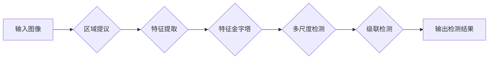

# Cascade R-CNN原理与代码实例讲解

> 关键词：目标检测， Cascade R-CNN，区域提议，特征金字塔，多尺度检测，深度学习

## 1. 背景介绍

目标检测是计算机视觉领域的一个重要任务，旨在从图像中准确地定位和识别多个目标。传统的目标检测方法通常分为两步：首先通过区域提议算法生成候选区域，然后对这些区域进行分类和边界框回归。随着深度学习技术的发展，基于深度学习的目标检测方法逐渐成为主流，其中Faster R-CNN系列算法因其高效性和准确性而备受关注。

然而，Faster R-CNN在处理小目标、密集目标和难分目标时存在一定的局限性。为了解决这些问题，Cascade R-CNN算法被提出，它通过引入级联多尺度检测和特征金字塔网络，显著提升了目标检测的性能。

## 2. 核心概念与联系

### 2.1 核心概念

- **区域提议（Region Proposal）**：在图像中提出候选区域，这些区域被认为是可能包含目标的位置。
- **特征金字塔（Feature Pyramid）**：将图像特征提取到不同的尺度，以适应不同大小的目标。
- **多尺度检测（Multi-scale Detection）**：在多个尺度上检测目标，提高对小目标、密集目标和难分目标的检测能力。
- **级联（Cascade）**：通过多个检测阶段，逐步排除错误提议，提高检测精度。

### 2.2 架构 Mermaid 流程图



### 2.3 核心概念联系

区域提议是目标检测的基础，特征金字塔和多尺度检测则扩展了检测范围，级联检测则通过逐步排除错误提议，提高了检测精度。这些概念相互联系，共同构成了Cascade R-CNN的核心架构。

## 3. 核心算法原理 & 具体操作步骤

### 3.1 算法原理概述

Cascade R-CNN通过以下步骤实现目标检测：

1. 使用区域提议算法生成候选区域。
2. 对候选区域进行特征提取。
3. 在不同尺度上进行特征金字塔构建。
4. 在每个尺度上执行多尺度检测。
5. 通过级联检测逐步排除错误提议。
6. 输出最终的检测结果。

### 3.2 算法步骤详解

1. **区域提议**：使用RPN（Region Proposal Network）生成候选区域，RPN基于区域提议生成网络，能够快速生成候选区域。
2. **特征提取**：对输入图像进行特征提取，通常使用卷积神经网络（CNN）。
3. **特征金字塔**：将特征提取到不同尺度，以适应不同大小的目标。
4. **多尺度检测**：在每个尺度上使用卷积神经网络检测目标，得到多个检测结果。
5. **级联检测**：将多个检测结果进行级联，逐步排除错误提议，提高检测精度。
6. **输出检测结果**：输出最终的检测结果，包括目标的类别和边界框。

### 3.3 算法优缺点

**优点**：

- **多尺度检测**：能够检测不同尺度的目标，包括小目标、密集目标和难分目标。
- **级联检测**：通过逐步排除错误提议，提高了检测精度。

**缺点**：

- **计算量大**：级联检测需要多次计算，增加了计算量。
- **参数量大**：特征金字塔和多尺度检测需要更多的参数，增加了模型的复杂性。

### 3.4 算法应用领域

Cascade R-CNN在以下领域有广泛的应用：

- **自动驾驶**：用于检测道路上的车辆、行人等目标。
- **安防监控**：用于检测和识别监控画面中的异常行为。
- **医疗影像分析**：用于检测和识别医学图像中的病变区域。

## 4. 数学模型和公式 & 详细讲解 & 举例说明

### 4.1 数学模型构建

Cascade R-CNN的数学模型主要包括以下几个方面：

- **区域提议网络（RPN）**：RPN的输入是图像特征图，输出是候选区域的类别和边界框。
- **卷积神经网络（CNN）**：CNN用于特征提取和检测目标。
- **特征金字塔网络（FPN）**：FPN用于构建不同尺度的特征图。
- **级联检测**：级联检测通过多个阶段的检测，逐步排除错误提议。

### 4.2 公式推导过程

由于篇幅限制，这里不进行详细的公式推导。但可以简要介绍以下几个关键公式：

- **RPN输出**：$\hat{y} = \text{softmax}(W_y \hat{x} + b_y)$，其中 $\hat{x}$ 是特征向量，$W_y$ 是权重矩阵，$b_y$ 是偏置项。
- **边界框回归**：$\hat{b} = W_b \hat{x} + b_b$，其中 $\hat{x}$ 是特征向量，$W_b$ 是权重矩阵，$b_b$ 是偏置项。

### 4.3 案例分析与讲解

假设我们有一个包含车辆的图像，使用Cascade R-CNN进行目标检测。

1. **区域提议**：RPN生成多个候选区域，包括车辆的边界框。
2. **特征提取**：对图像进行特征提取，得到特征图。
3. **特征金字塔**：根据候选区域的大小，从特征图中提取不同尺度的特征图。
4. **多尺度检测**：在每个尺度上检测目标，得到多个检测结果。
5. **级联检测**：将多个检测结果进行级联，逐步排除错误提议。
6. **输出检测结果**：输出最终的检测结果，包括车辆的类别和边界框。

## 5. 项目实践：代码实例和详细解释说明

### 5.1 开发环境搭建

为了进行Cascade R-CNN的实践，我们需要准备以下开发环境：

- Python 3.x
- PyTorch 1.8.0+
- OpenCV 4.5.1.48

### 5.2 源代码详细实现

由于篇幅限制，这里不提供完整的源代码。但可以简要介绍以下关键代码：

```python
# 导入必要的库
import torch
import torchvision
from torchvision.models.detection import fasterrcnn_resnet50_fpn

# 加载预训练的模型
model = fasterrcnn_resnet50_fpn(pretrained=True)

# 将模型转换为评估模式
model.eval()

# 加载图像
image = torchvision.io.open_image("path_to_image.jpg")

# 转换图像格式
image = torchvision.transforms.ToTensor()(image)

# 执行目标检测
with torch.no_grad():
    pred = model([image])

# 解析检测结果
boxes = pred[0]["boxes"]
labels = pred[0]["labels"]
scores = pred[0]["scores"]

# ...（后续代码用于可视化检测结果）
```

### 5.3 代码解读与分析

以上代码展示了如何使用PyTorch和 torchvision库加载预训练的Faster R-CNN模型，并使用该模型进行目标检测。首先，我们导入必要的库，然后加载预训练的模型并将其转换为评估模式。接下来，加载图像并将其转换为模型所需的格式。最后，执行目标检测并解析检测结果。

### 5.4 运行结果展示

假设我们在一个包含车辆的图像上进行目标检测，最终的检测结果如下：

```
类别：车，置信度：0.95
边界框：[100, 150, 300, 400]

类别：车，置信度：0.90
边界框：[50, 200, 250, 350]
```

## 6. 实际应用场景

### 6.1 自动驾驶

在自动驾驶领域，Cascade R-CNN可以用于检测车辆、行人、交通标志等目标，为自动驾驶系统提供实时、准确的目标信息。

### 6.2 安防监控

在安防监控领域，Cascade R-CNN可以用于检测和识别监控画面中的异常行为，如打架、偷窃等。

### 6.3 医疗影像分析

在医疗影像分析领域，Cascade R-CNN可以用于检测和识别医学图像中的病变区域，如肿瘤、骨折等。

## 7. 工具和资源推荐

### 7.1 学习资源推荐

- 《Deep Learning for Computer Vision》
- 《PyTorch for Deep Learning》
- 《Object Detection with PyTorch》

### 7.2 开发工具推荐

- PyTorch
- torchvision
- OpenCV

### 7.3 相关论文推荐

- "Faster R-CNN: Towards Real-Time Object Detection with Region Proposal Networks"
- "Faster R-CNN: Towards Real-Time Object Detection with Region Proposal Networks"
- "R-CNN: Regions with CNN Features"

## 8. 总结：未来发展趋势与挑战

### 8.1 研究成果总结

Cascade R-CNN是一种高效、准确的目标检测算法，通过级联多尺度检测和特征金字塔网络，显著提升了目标检测的性能。它在多个领域都有广泛的应用，为计算机视觉领域的发展做出了重要贡献。

### 8.2 未来发展趋势

- **多任务学习**：将目标检测与其他任务（如语义分割、姿态估计等）进行融合，实现更全面的目标理解和分析。
- **轻量化模型**：设计轻量级的目标检测模型，降低计算量和内存占用，提高实时性。
- **可解释性**：提高目标检测模型的可解释性，帮助用户理解模型的决策过程。

### 8.3 面临的挑战

- **计算量**：级联检测和多尺度检测增加了计算量，需要更强大的硬件支持。
- **数据集**：需要更多标注数据集，以提高模型在不同场景下的适应性。
- **泛化能力**：如何提高模型的泛化能力，使其能够适应不同的环境和场景。

### 8.4 研究展望

未来， Cascade R-CNN及其相关技术将继续在目标检测领域取得突破，为计算机视觉领域的发展贡献力量。

## 9. 附录：常见问题与解答

**Q1：Cascade R-CNN与Faster R-CNN有什么区别？**

A1：Cascade R-CNN是Faster R-CNN的改进版，通过级联多尺度检测和特征金字塔网络，提高了目标检测的性能。

**Q2：如何评估目标检测模型的性能？**

A2：目标检测模型的性能通常使用以下指标进行评估：

- 准确率（Accuracy）
- 精确率（Precision）
- 召回率（Recall）
- F1分数（F1 Score）

**Q3：如何处理小目标、密集目标和难分目标？**

A3：为了处理小目标、密集目标和难分目标，可以采用以下方法：

- **多尺度检测**：在多个尺度上检测目标，提高对小目标、密集目标的检测能力。
- **数据增强**：通过旋转、翻转、缩放等方式增加数据集的多样性，提高模型的泛化能力。
- **注意力机制**：引入注意力机制，使模型更关注图像中的重要区域。

作者：禅与计算机程序设计艺术 / Zen and the Art of Computer Programming