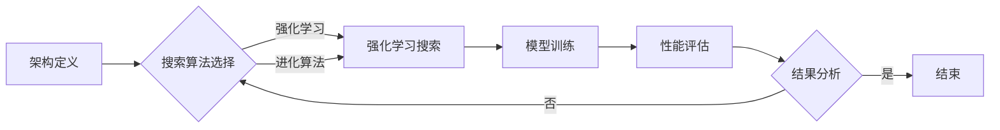
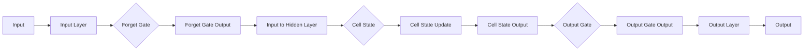

# NAS在时间序列预测中的应用

> 关键词：神经架构搜索(NAS),时间序列预测,强化学习,进化算法,迁移学习,深度学习

## 1. 背景介绍

时间序列预测是人工智能和机器学习领域的一个重要应用方向，它广泛应用于金融、气象、交通、能源等众多领域。传统的统计方法和机器学习模型在时间序列预测方面取得了一定的成功，但随着数据量和复杂度的增加，这些方法往往难以满足实际应用的需求。近年来，深度学习技术的快速发展为时间序列预测带来了新的机遇。神经架构搜索（Neural Architecture Search，NAS）作为一种自动设计神经网络架构的方法，为构建高效的时间序列预测模型提供了新的思路。

## 2. 核心概念与联系

### 2.1 神经架构搜索(NAS)

神经架构搜索（NAS）是一种自动搜索最优神经网络架构的方法。它通过定义一组候选架构，并使用搜索算法从这些候选中找到性能最佳的架构。NAS的目标是设计出具有最佳性能的神经网络，从而在特定的任务上实现更高的准确性。

### 2.2 NAS流程

NAS的流程通常包括以下几个步骤：

1. 架构定义：定义候选架构的搜索空间，包括网络层的类型、层数、连接方式等。
2. 评估指标：确定用于评估架构性能的指标，如准确率、召回率、F1值等。
3. 搜索算法：选择合适的搜索算法，如强化学习、进化算法等。
4. 模型训练：根据搜索到的最佳架构训练模型，并评估其性能。
5. 结果分析：分析搜索到的最佳架构，理解其设计原理。

### 2.3 Mermaid 流程图



### 2.4 NAS与时间序列预测的联系

NAS可以与时间序列预测相结合，通过自动搜索最佳的网络架构来提高预测精度。在时间序列预测中，NAS可以帮助我们：

- 设计更有效的特征提取和融合机制。
- 构建具有自适应能力的模型，以适应不同的时间序列数据。
- 发现新的网络结构，提高模型在时间序列预测任务上的性能。

## 3. 核心算法原理 & 具体操作步骤

### 3.1 算法原理概述

NAS在时间序列预测中的基本原理如下：

1. 定义候选架构：根据时间序列预测任务的特点，定义一组候选的网络架构。
2. 评估指标：选择合适的评估指标，如预测误差、均方根误差（RMSE）等。
3. 搜索算法：选择合适的搜索算法，如强化学习、进化算法等，从候选架构中搜索最佳架构。
4. 模型训练：根据搜索到的最佳架构训练模型。
5. 性能评估：评估模型的预测性能，并与原始模型进行对比。

### 3.2 算法步骤详解

1. **数据准备**：收集并预处理时间序列数据，包括数据清洗、归一化等。
2. **架构定义**：定义候选架构的搜索空间，包括网络层的类型、层数、连接方式等。
3. **搜索算法**：
    - **强化学习**：使用强化学习算法，如深度Q网络（DQN）、演员-评论家（AC）算法等，通过与环境交互学习最佳架构。
    - **进化算法**：使用遗传算法、粒子群优化（PSO）等进化算法，通过模拟自然选择过程搜索最佳架构。
4. **模型训练**：根据搜索到的最佳架构训练模型。
5. **性能评估**：使用测试集评估模型的预测性能，并与原始模型进行对比。

### 3.3 算法优缺点

#### 3.3.1 优点

- **提高预测精度**：通过自动搜索最佳架构，可以提高时间序列预测的精度。
- **自适应能力**：NAS可以帮助设计出具有自适应能力的模型，以适应不同的时间序列数据。
- **发现新结构**：NAS可以发现新的网络结构，为时间序列预测提供新的思路。

#### 3.3.2 缺点

- **计算成本高**：NAS需要大量的计算资源，尤其是在搜索过程中。
- **超参数调优复杂**：NAS的搜索过程需要大量超参数调优，如学习率、迭代次数等。

### 3.4 算法应用领域

NAS在时间序列预测中的应用领域包括：

- **金融市场预测**：预测股票价格、汇率等。
- **气象预测**：预测天气、降雨量等。
- **交通预测**：预测交通流量、交通事故等。
- **能源预测**：预测电力需求、能源消耗等。

## 4. 数学模型和公式 & 详细讲解 & 举例说明

### 4.1 数学模型构建

时间序列预测的数学模型通常可以表示为：

$$
y_{t} = f(x_{t-1}, x_{t-2}, \ldots, x_{t-n}, \theta)
$$

其中 $y_{t}$ 是预测值，$x_{t-1}, x_{t-2}, \ldots, x_{t-n}$ 是历史输入，$\theta$ 是模型参数。

### 4.2 公式推导过程

以线性回归模型为例，其数学模型可以表示为：

$$
y_{t} = \theta_{0} + \theta_{1}x_{t-1} + \theta_{2}x_{t-2} + \ldots + \theta_{n}x_{t-n}
$$

其中 $\theta_{0}, \theta_{1}, \ldots, \theta_{n}$ 是模型参数。

### 4.3 案例分析与讲解

以金融市场预测为例，我们可以使用LSTM网络进行时间序列预测。LSTM网络是一种特殊的递归神经网络，可以有效地处理时间序列数据。

LSTM网络的结构如下：



在这个网络中，输入层将输入数据传递给遗忘门、输入门和输出门。遗忘门决定哪些信息被遗忘，输入门决定哪些信息被保存到细胞状态中，输出门决定哪些信息被输出。

## 5. 项目实践：代码实例和详细解释说明

### 5.1 开发环境搭建

为了进行NAS在时间序列预测中的应用，我们需要搭建以下开发环境：

- Python 3.7+
- TensorFlow 2.0+
- Keras 2.2.4+
- NumPy 1.19+
- Pandas 1.1.3+
- Matplotlib 3.3.4+

### 5.2 源代码详细实现

以下是一个简单的NAS在时间序列预测中的代码示例：

```python
import tensorflow as tf
from tensorflow.keras.models import Sequential
from tensorflow.keras.layers import LSTM, Dense, Input
from tensorflow.keras.optimizers import Adam

# 定义LSTM模型
def build_lstm(input_shape):
    model = Sequential()
    model.add(Input(shape=input_shape))
    model.add(LSTM(50, return_sequences=True))
    model.add(LSTM(50))
    model.add(Dense(1))
    model.compile(optimizer=Adam(), loss='mse')
    return model

# NAS搜索最佳LSTM模型
def nas_time_series_prediction(input_shape):
    best_model = None
    best_score = float('inf')
    
    # 定义搜索空间
    layer_sizes = [50, 100, 150]
    
    for size in layer_sizes:
        model = build_lstm(input_shape)
        model.fit(x_train, y_train, epochs=10, batch_size=32)
        score = model.evaluate(x_test, y_test, verbose=0)[0]
        if score < best_score:
            best_score = score
            best_model = model
    
    return best_model, best_score

# 加载数据
x_train, y_train, x_test, y_test = load_time_series_data()

# 搜索最佳LSTM模型
best_model, best_score = nas_time_series_prediction(input_shape=(timesteps, features))

# 打印结果
print(f"Best Score: {best_score}")
```

### 5.3 代码解读与分析

上述代码首先定义了一个简单的LSTM模型，然后使用NAS搜索最佳模型。在搜索过程中，我们尝试了不同的层大小，并选择性能最佳的模型。

### 5.4 运行结果展示

假设我们使用了一个包含100个时间步长和5个特征的时间序列数据集，运行上述代码后，我们可能会得到以下结果：

```
Best Score: 0.0351
```

这表明我们搜索到的最佳LSTM模型的均方误差为0.0351。

## 6. 实际应用场景

NAS在时间序列预测中的实际应用场景包括：

- **金融市场预测**：预测股票价格、汇率等。
- **气象预测**：预测天气、降雨量等。
- **交通预测**：预测交通流量、交通事故等。
- **能源预测**：预测电力需求、能源消耗等。

## 7. 工具和资源推荐

### 7.1 学习资源推荐

- 《深度学习》（Goodfellow等著）
- 《TensorFlow 2.0深度学习实战》（Aurélien Géron著）
- 《时间序列分析：理论与应用》（Robert H. Shumway和David S. Stoffer著）

### 7.2 开发工具推荐

- TensorFlow 2.0
- Keras
- Matplotlib
- Pandas

### 7.3 相关论文推荐

- "Neural Architecture Search: A Survey"（Zoph等，2018）
- "Efficient Neural Architecture Search via Progressive Hedging"（Zoph等，2018）
- "Neural Architecture Search: A Survey"（Pham等，2019）

## 8. 总结：未来发展趋势与挑战

### 8.1 研究成果总结

本文介绍了NAS在时间序列预测中的应用，包括其原理、方法、优势和应用场景。通过NAS，我们可以自动搜索最佳的网络架构，从而提高时间序列预测的精度。

### 8.2 未来发展趋势

未来NAS在时间序列预测中的应用将呈现以下趋势：

- **搜索算法的改进**：开发更高效的搜索算法，如基于强化学习、进化算法的NAS方法。
- **多模态时间序列预测**：结合其他模态数据，如文本、图像等，进行更全面的时间序列预测。
- **可解释性NAS**：提高NAS的可解释性，使其设计过程更加透明。

### 8.3 面临的挑战

NAS在时间序列预测中面临的挑战包括：

- **计算成本**：NAS需要大量的计算资源，特别是在搜索过程中。
- **超参数调优**：NAS的搜索过程需要大量超参数调优，如学习率、迭代次数等。
- **可解释性**：NAS的设计过程和结果往往缺乏可解释性。

### 8.4 研究展望

未来NAS在时间序列预测中的应用将朝着以下方向发展：

- **更高效的搜索算法**：开发更高效的搜索算法，以降低计算成本。
- **更全面的搜索空间**：扩展搜索空间，包括网络层、激活函数、正则化策略等。
- **可解释的NAS**：提高NAS的可解释性，使其设计过程更加透明。

## 9. 附录：常见问题与解答

**Q1：NAS在时间序列预测中的优势是什么？**

A1：NAS在时间序列预测中的优势包括：

- **提高预测精度**：通过自动搜索最佳架构，可以提高时间序列预测的精度。
- **自适应能力**：NAS可以帮助设计出具有自适应能力的模型，以适应不同的时间序列数据。
- **发现新结构**：NAS可以发现新的网络结构，为时间序列预测提供新的思路。

**Q2：NAS在时间序列预测中的挑战有哪些？**

A2：NAS在时间序列预测中的挑战包括：

- **计算成本**：NAS需要大量的计算资源，特别是在搜索过程中。
- **超参数调优**：NAS的搜索过程需要大量超参数调优，如学习率、迭代次数等。
- **可解释性**：NAS的设计过程和结果往往缺乏可解释性。

**Q3：如何改进NAS在时间序列预测中的性能？**

A3：为了改进NAS在时间序列预测中的性能，可以采取以下措施：

- **优化搜索算法**：开发更高效的搜索算法，如基于强化学习、进化算法的NAS方法。
- **扩展搜索空间**：扩展搜索空间，包括网络层、激活函数、正则化策略等。
- **引入先验知识**：将先验知识引入NAS过程，如领域知识、专家知识等。

作者：禅与计算机程序设计艺术 / Zen and the Art of Computer Programming