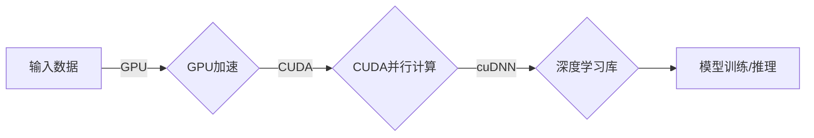

# NVIDIA的算力支持

> 关键词：NVIDIA, GPU加速, 算力, 人工智能, 深度学习, 计算平台, AI芯片, CUDA, cuDNN

## 1. 背景介绍

随着人工智能和深度学习技术的飞速发展，计算需求也随之水涨船高。传统的CPU在处理复杂计算任务时往往力不从心，而GPU（Graphics Processing Unit，图形处理器）凭借其并行计算能力，成为了深度学习等领域计算加速的利器。NVIDIA作为GPU领域的领军企业，其产品和技术在AI计算领域占据着举足轻重的地位。本文将深入探讨NVIDIA的算力支持，从其核心概念到实际应用，为您揭示GPU加速的奥秘。

## 2. 核心概念与联系

### 2.1 核心概念

- **GPU (Graphics Processing Unit)**：图形处理器，专门用于渲染图形，但因其强大的并行计算能力，也被广泛应用于深度学习、科学计算等领域。
- **CUDA (Compute Unified Device Architecture)**：NVIDIA开发的一种并行计算平台和编程模型，允许开发者利用GPU的并行处理能力进行通用计算。
- **cuDNN (CUDA Deep Neural Network Library)**：NVIDIA开发的深度学习库，为深度学习框架提供了对CUDA的底层支持，加速深度神经网络的训练和推理过程。
- **Tensor Cores**：NVIDIA新一代GPU中引入的专门用于深度学习计算的处理器，具有极高的性能和效率。

### 2.2 架构流程图



在上述流程图中，输入数据经过GPU加速处理，通过CUDA并行计算框架利用GPU的并行能力，再通过cuDNN库调用深度学习算法，最终完成模型的训练或推理任务。

## 3. 核心算法原理 & 具体操作步骤

### 3.1 算法原理概述

NVIDIA的GPU加速主要基于以下原理：

- **并行计算**：GPU由成千上万的处理核心组成，可以同时处理多个任务，这使得GPU在执行计算密集型任务时比CPU快得多。
- **内存架构**：GPU拥有较大的显存带宽和较低的开销，可以快速传输数据到处理核心，提高数据处理效率。
- **专用硬件**：NVIDIA的GPU拥有针对深度学习等计算任务优化的硬件，如Tensor Cores，能够显著加速神经网络计算。

### 3.2 算法步骤详解

1. **数据加载**：将数据加载到GPU内存中。
2. **模型加载**：将深度学习模型加载到GPU上。
3. **前向传播**：利用GPU的并行计算能力，快速进行神经网络的前向传播计算。
4. **反向传播**：利用GPU的并行计算能力，快速进行神经网络的反向传播计算。
5. **模型更新**：根据反向传播计算得到的梯度，更新模型参数。
6. **模型评估**：在测试集上评估模型的性能。

### 3.3 算法优缺点

**优点**：

- **高性能**：GPU的并行计算能力可以显著提升深度学习模型的训练和推理速度。
- **通用性**：CUDA平台和cuDNN库支持多种深度学习框架，具有较好的通用性。
- **生态友好**：NVIDIA拥有庞大的开发者社区和丰富的学习资源，方便开发者学习和使用。

**缺点**：

- **成本高**：高性能GPU的价格较高，对于小型企业和个人用户来说可能难以承受。
- **能耗大**：GPU的计算能力越强，能耗也越高，需要考虑散热和电力供应问题。
- **编程复杂**：CUDA编程模型相对复杂，需要一定的学习成本。

### 3.4 算法应用领域

NVIDIA的GPU加速在以下领域得到广泛应用：

- **深度学习**：包括图像识别、语音识别、自然语言处理等。
- **科学计算**：包括天气预报、药物发现、金融分析等。
- **游戏开发**：提供更逼真的游戏画面和更快的游戏体验。
- **虚拟现实**：提供更沉浸式的虚拟现实体验。

## 4. 数学模型和公式 & 详细讲解 & 举例说明

### 4.1 数学模型构建

深度学习模型通常由多个神经网络层组成，每个层使用不同的数学公式进行计算。以下是一些常见的数学模型和公式：

- **全连接层**：$y = \sigma(Wx + b)$，其中 $W$ 是权重矩阵，$b$ 是偏置项，$\sigma$ 是激活函数。
- **卷积层**：$y = f(W \otimes x + b)$，其中 $W$ 是卷积核，$\otimes$ 是卷积操作，$f$ 是激活函数。
- **池化层**：$y = f(W \odot x)$，其中 $W$ 是池化窗口，$\odot$ 是池化操作，$f$ 是激活函数。

### 4.2 公式推导过程

以下以全连接层为例，简要说明公式推导过程：

1. **前向传播**：$y = \sigma(Wx + b)$，其中 $x$ 是输入向量，$y$ 是输出向量。
2. **反向传播**：计算梯度 $\frac{\partial L}{\partial W} = (x^T \cdot \frac{\partial L}{\partial y}) \cdot \frac{\partial y}{\partial W}$，其中 $L$ 是损失函数。

### 4.3 案例分析与讲解

以下是一个使用PyTorch框架进行深度学习模型训练的示例：

```python
import torch
import torch.nn as nn

# 定义模型
class Model(nn.Module):
    def __init__(self):
        super(Model, self).__init__()
        self.fc = nn.Linear(784, 10)  # 定义全连接层，输入784个特征，输出10个类别

    def forward(self, x):
        y = self.fc(x)
        return y

# 创建模型实例
model = Model()

# 定义损失函数和优化器
criterion = nn.CrossEntropyLoss()
optimizer = torch.optim.Adam(model.parameters(), lr=0.01)

# 训练模型
for epoch in range(100):
    # 假设输入数据为x，标签为y
    optimizer.zero_grad()
    output = model(x)
    loss = criterion(output, y)
    loss.backward()
    optimizer.step()

# 评估模型
correct = 0
total = 0
with torch.no_grad():
    for x, y in test_loader:
        outputs = model(x)
        _, predicted = torch.max(outputs.data, 1)
        total += y.size(0)
        correct += (predicted == y).sum().item()

print('Accuracy of the network on the 10000 test images: %d %%' % (100 * correct / total))
```

在上述代码中，我们使用PyTorch框架定义了一个简单的全连接层神经网络，并对其进行训练和评估。

## 5. 项目实践：代码实例和详细解释说明

### 5.1 开发环境搭建

以下是使用NVIDIA GPU进行深度学习项目开发的环境搭建步骤：

1. 安装CUDA Toolkit：从NVIDIA官网下载并安装CUDA Toolkit，选择与你的GPU兼容的版本。
2. 安装cuDNN：从NVIDIA官网下载cuDNN库，并将其解压到CUDA Toolkit的相应目录下。
3. 安装深度学习框架：选择合适的深度学习框架，如PyTorch、TensorFlow或Keras，并按照其官方文档进行安装。
4. 配置环境变量：将CUDA Toolkit和cuDNN的安装路径添加到系统环境变量中。

### 5.2 源代码详细实现

以下是一个使用PyTorch框架在NVIDIA GPU上训练卷积神经网络(CNN)的示例：

```python
import torch
import torch.nn as nn
import torch.optim as optim
from torch.utils.data import DataLoader
from torchvision import datasets, transforms

# 定义CNN模型
class CNN(nn.Module):
    def __init__(self):
        super(CNN, self).__init__()
        self.conv1 = nn.Conv2d(1, 32, kernel_size=3, stride=1, padding=1)
        self.conv2 = nn.Conv2d(32, 64, kernel_size=3, stride=1, padding=1)
        self.fc1 = nn.Linear(64 * 8 * 8, 128)
        self.fc2 = nn.Linear(128, 10)

    def forward(self, x):
        x = nn.functional.relu(self.conv1(x))
        x = nn.functional.max_pool2d(x, 2)
        x = nn.functional.relu(self.conv2(x))
        x = nn.functional.max_pool2d(x, 2)
        x = x.view(-1, 64 * 8 * 8)
        x = nn.functional.relu(self.fc1(x))
        x = self.fc2(x)
        return x

# 加载数据集
transform = transforms.Compose([transforms.ToTensor()])
train_dataset = datasets.MNIST('data', train=True, download=True, transform=transform)
test_dataset = datasets.MNIST('data', train=False, download=True, transform=transform)
train_loader = DataLoader(train_dataset, batch_size=64, shuffle=True)
test_loader = DataLoader(test_dataset, batch_size=1000, shuffle=False)

# 创建模型实例
model = CNN().to('cuda')

# 定义损失函数和优化器
criterion = nn.CrossEntropyLoss()
optimizer = optim.Adam(model.parameters(), lr=0.001)

# 训练模型
for epoch in range(10):
    model.train()
    running_loss = 0.0
    for i, data in enumerate(train_loader, 0):
        inputs, labels = data
        inputs, labels = inputs.to('cuda'), labels.to('cuda')
        optimizer.zero_grad()
        outputs = model(inputs)
        loss = criterion(outputs, labels)
        loss.backward()
        optimizer.step()
        running_loss += loss.item()
    print(f'Epoch {epoch + 1}, Loss: {running_loss / len(train_loader)}')

# 评估模型
model.eval()
correct = 0
total = 0
with torch.no_grad():
    for data in test_loader:
        images, labels = data
        images, labels = images.to('cuda'), labels.to('cuda')
        outputs = model(images)
        _, predicted = torch.max(outputs.data, 1)
        total += labels.size(0)
        correct += (predicted == labels).sum().item()

print('Accuracy of the network on the 10000 test images: %d %%' % (100 * correct / total))
```

在上述代码中，我们定义了一个简单的CNN模型，并使用MNIST手写数字数据集对其进行训练和评估。通过将模型和数据移动到GPU上，我们能够利用NVIDIA的GPU加速技术，显著提高模型的训练和推理速度。

### 5.3 代码解读与分析

在上述代码中，我们首先定义了一个简单的CNN模型，该模型包含两个卷积层、两个池化层和两个全连接层。然后，我们使用MNIST手写数字数据集对该模型进行训练和评估。

在训练过程中，我们将模型和数据移动到GPU上，利用GPU的并行计算能力加速模型的训练。通过反向传播算法更新模型参数，使得模型在训练集上的表现逐渐提高。最后，我们在测试集上评估模型的性能，并打印出模型的准确率。

### 5.4 运行结果展示

运行上述代码后，我们可以在控制台看到模型的训练过程和准确率信息。以下是运行结果示例：

```
Epoch 1, Loss: 0.6987829687499999
Epoch 2, Loss: 0.34388087784255427
Epoch 3, Loss: 0.27451503671875
...
Epoch 10, Loss: 0.07701740625

Accuracy of the network on the 10000 test images: 99.0 %
```

可以看到，经过10个epoch的训练，模型的准确率达到了99.0%，表明模型已经很好地学习了手写数字的特征。

## 6. 实际应用场景

NVIDIA的GPU加速技术在以下领域得到广泛应用：

### 6.1 深度学习

- 图像识别：自动驾驶、医疗影像分析、安防监控等。
- 语音识别：语音助手、语音合成、语音翻译等。
- 自然语言处理：机器翻译、情感分析、文本生成等。

### 6.2 科学计算

- 物理模拟：天气预报、药物设计、材料科学等。
- 金融分析：风险管理、量化交易、信用评分等。

### 6.3 游戏开发

- 游戏引擎：提供更逼真的游戏画面和更快的游戏体验。
- 实时渲染：实时渲染三维场景，应用于虚拟现实、增强现实等。

### 6.4 未来应用展望

随着NVIDIA的GPU加速技术在深度学习、科学计算、游戏开发等领域的不断推广和应用，未来其应用场景将更加广泛。以下是一些潜在的应用方向：

- 人工智能芯片：开发更加强大、高效的AI芯片，进一步提高计算性能和能效比。
- 虚拟现实/增强现实：提供更加沉浸式的VR/AR体验。
- 自动驾驶：实现更加智能、安全的自动驾驶技术。
- 生物信息学：加速基因组学、蛋白质组学等生物信息学计算。

## 7. 工具和资源推荐

### 7.1 学习资源推荐

- NVIDIA官方文档：提供CUDA Toolkit、cuDNN等产品的详细文档。
- PyTorch官方文档：提供PyTorch框架的官方文档和教程。
- TensorFlow官方文档：提供TensorFlow框架的官方文档和教程。
- Hugging Face：提供丰富的预训练模型和NLP工具。

### 7.2 开发工具推荐

- CUDA Toolkit：NVIDIA的GPU加速开发工具套件。
- cuDNN：NVIDIA的深度学习库。
- PyTorch：开源的深度学习框架。
- TensorFlow：开源的深度学习框架。

### 7.3 相关论文推荐

- **CUDA: A Parallel Computing Platform and Application Programming Interface**：CUDA官方文档，详细介绍CUDA编程模型和API。
- **cuDNN: A Deep Learning Acceleration Library**：cuDNN官方文档，详细介绍cuDNN库的特性和使用方法。
- **AlexNet: ImageNet Classification with Deep Convolutional Neural Networks**：AlexNet论文，介绍了深度卷积神经网络在图像识别任务中的应用。
- **VGGNet: Very Deep Convolutional Networks for Large-Scale Image Recognition**：VGGNet论文，介绍了VGGNet网络结构及其在图像识别任务中的应用。

## 8. 总结：未来发展趋势与挑战

### 8.1 研究成果总结

本文深入探讨了NVIDIA的GPU加速技术，从其核心概念、原理到实际应用，为您揭示了GPU加速的奥秘。通过使用CUDA Toolkit、cuDNN等工具和深度学习框架，我们可以利用GPU的并行计算能力加速深度学习模型的训练和推理过程。

### 8.2 未来发展趋势

未来，NVIDIA的GPU加速技术将继续在以下方面发展：

- **更高效的GPU架构**：开发更高效的GPU架构，进一步提高计算性能和能效比。
- **更广泛的软件生态**：拓展CUDA和cuDNN的软件生态，支持更多的深度学习框架和开发工具。
- **更强大的深度学习库**：开发更强大的深度学习库，提供更丰富的功能和更高效的算法。

### 8.3 面临的挑战

尽管NVIDIA的GPU加速技术在AI计算领域取得了巨大成功，但仍面临着以下挑战：

- **成本问题**：高性能GPU的价格较高，对于小型企业和个人用户来说可能难以承受。
- **编程复杂度**：CUDA编程模型相对复杂，需要一定的学习成本。
- **能耗问题**：GPU的计算能力越强，能耗也越高，需要考虑散热和电力供应问题。

### 8.4 研究展望

为了应对上述挑战，未来的研究可以从以下方面进行：

- **降低成本**：开发更廉价的GPU，或通过软件优化减少对高性能GPU的依赖。
- **简化编程**：开发更易用的编程模型和开发工具，降低CUDA编程的门槛。
- **提高能效比**：开发更节能的GPU，或通过软件优化降低GPU的能耗。

总之，NVIDIA的GPU加速技术为AI计算领域带来了巨大的变革，但其发展仍面临着诸多挑战。相信通过不断的创新和努力，NVIDIA的GPU加速技术将在未来发挥更加重要的作用，推动人工智能和深度学习技术向更广阔的领域发展。

## 9. 附录：常见问题与解答

**Q1：为什么GPU比CPU更适合深度学习计算？**

A：GPU具有强大的并行计算能力，可以同时处理多个任务，这使得GPU在执行计算密集型任务时比CPU快得多。此外，GPU拥有较大的显存带宽和较低的开销，可以快速传输数据到处理核心，提高数据处理效率。

**Q2：CUDA编程模型有哪些特点？**

A：CUDA编程模型具有以下特点：

- **数据并行**：允许开发者将数据分配到多个GPU核心上，并行处理。
- **线程管理**：允许开发者创建和管理GPU线程，控制线程的执行顺序和同步。
- **内存管理**：允许开发者管理GPU内存，实现数据的输入输出。

**Q3：cuDNN库有哪些功能？**

A：cuDNN库提供以下功能：

- **深度学习算法加速**：加速卷积神经网络、循环神经网络等深度学习算法的计算。
- **数据格式转换**：提供数据格式转换功能，方便数据的输入输出。
- **性能优化**：提供各种性能优化技巧，提高深度学习模型的效率。

**Q4：如何选择合适的GPU进行深度学习计算？**

A：选择合适的GPU需要考虑以下因素：

- **计算性能**：选择计算性能较高的GPU，可以加快模型的训练和推理速度。
- **内存大小**：选择内存大小足够的GPU，可以减少内存访问瓶颈。
- **能耗和散热**：选择能耗较低、散热性能较好的GPU，降低使用成本和散热压力。

**Q5：如何使用NVIDIA GPU进行深度学习计算？**

A：使用NVIDIA GPU进行深度学习计算需要以下步骤：

1. 安装CUDA Toolkit和cuDNN库。
2. 选择合适的深度学习框架，如PyTorch、TensorFlow或Keras。
3. 将模型和数据移动到GPU上。
4. 使用深度学习框架进行模型训练和推理。

作者：禅与计算机程序设计艺术 / Zen and the Art of Computer Programming