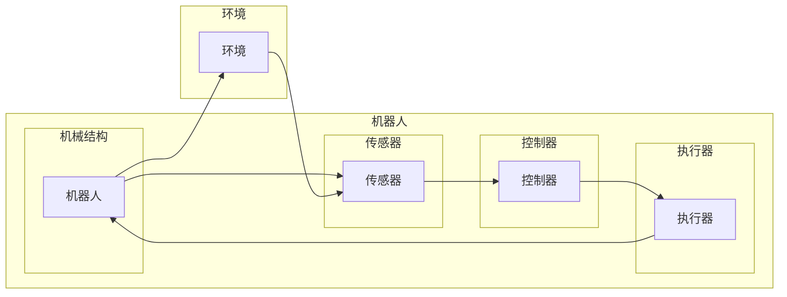

# Robotics and Control Systems 原理与代码实战案例讲解

> 关键词：机器人技术，控制理论，系统架构，代码实战，PID控制，PID控制器，动态系统，反馈控制，工业控制

## 1. 背景介绍

机器人技术是人工智能和自动化技术的重要分支，它结合了机械工程、电子工程、计算机科学等多个领域，旨在使机器能够在人类环境中自主行动和完成任务。控制理论则是机器人技术中的核心，它研究如何设计控制器来指导机器人的运动和决策过程。本文将深入探讨机器人与控制系统的基础原理，并通过代码实战案例展示如何实现和优化这些系统。

### 1.1 问题的由来

随着工业自动化和智能化的需求日益增长，机器人技术在制造业、服务行业、医疗健康、家庭生活等多个领域得到了广泛应用。然而，设计和实现高效、可靠的机器人控制系统仍然是一个复杂且富有挑战性的任务。本文旨在通过理论讲解和实际案例，帮助读者深入理解机器人与控制系统的设计和实现。

### 1.2 研究现状

目前，机器人控制系统的研究主要集中在以下几个方面：

- **控制理论**：研究如何设计控制器，以实现对机器人运动的精确控制。
- **传感器技术**：研究如何使用传感器获取环境信息，为控制器提供反馈。
- **机械设计**：研究如何设计机器人的机械结构，以适应不同的应用场景。
- **人工智能**：研究如何利用人工智能技术，使机器人具有更高级的自主性和智能决策能力。

### 1.3 研究意义

理解机器人与控制系统的原理对于以下方面具有重要意义：

- **提高机器人性能**：通过优化控制算法，可以显著提高机器人的运动精度和效率。
- **拓展应用领域**：掌握控制理论可以使得机器人技术在更多领域得到应用。
- **推动技术创新**：研究新的控制算法和技术可以为机器人技术带来突破性进展。

### 1.4 本文结构

本文将按照以下结构进行：

- **第2章**：介绍机器人与控制系统的核心概念和原理。
- **第3章**：讲解PID控制算法的原理、步骤和应用。
- **第4章**：通过数学模型和公式，详细阐述动态系统的控制理论。
- **第5章**：通过代码实战案例，展示如何实现和优化机器人控制系统。
- **第6章**：探讨机器人与控制系统的实际应用场景。
- **第7章**：推荐相关的学习资源、开发工具和参考文献。
- **第8章**：总结研究成果，展望未来发展趋势和挑战。
- **第9章**：提供常见问题的解答。

## 2. 核心概念与联系

### 2.1 核心概念原理

机器人与控制系统的核心概念包括：

- **机器人**：一种能够执行特定任务的机械装置，通常具有多个运动关节和传感器。
- **控制系统**：一种用于控制机器人行为的系统，它通常包括控制器、执行器、传感器和被控对象。
- **控制理论**：研究如何设计和实现控制器的学科，包括PID控制、线性控制、非线性控制等。

### 2.2 架构的 Mermaid 流程图



### 2.3 核心概念联系

机器人与控制系统的核心概念之间存在着紧密的联系。机器人通过传感器感知环境信息，控制器根据这些信息生成控制信号，执行器根据控制信号执行动作，从而改变机器人的状态，最终影响环境。环境的变化又会通过传感器反馈给控制器，形成一个闭环控制系统。

## 3. 核心算法原理 & 具体操作步骤

### 3.1 算法原理概述

控制系统的核心是控制器，它负责根据传感器收集到的信息，生成相应的控制信号来驱动执行器。PID控制是一种常用的控制器，它通过比例（P）、积分（I）和微分（D）三个参数来调整控制信号。

### 3.2 算法步骤详解

PID控制器的计算步骤如下：

1. **计算误差**：误差 $e(t) = r(t) - y(t)$，其中 $r(t)$ 是期望输出，$y(t)$ 是实际输出。
2. **计算比例项**：$P(t) = K_p \cdot e(t)$，其中 $K_p$ 是比例增益。
3. **计算积分项**：$I(t) = K_i \int e(t) dt$，其中 $K_i$ 是积分增益。
4. **计算微分项**：$D(t) = K_d \frac{de(t)}{dt}$，其中 $K_d$ 是微分增益。
5. **计算控制信号**：$u(t) = P(t) + I(t) + D(t)$。

### 3.3 算法优缺点

PID控制器的优点是结构简单、易于实现、鲁棒性强。然而，它也存在一些缺点，例如对参数选择敏感、难以处理复杂的非线性系统等。

### 3.4 算法应用领域

PID控制器广泛应用于工业控制、机器人控制、汽车控制等领域。

## 4. 数学模型和公式 & 详细讲解 & 举例说明

### 4.1 数学模型构建

一个典型的动态系统可以表示为：

$$
\frac{dx}{dt} = f(x, u)
$$

其中 $x$ 是状态变量，$u$ 是输入变量，$f$ 是系统函数。

### 4.2 公式推导过程

假设系统是一个一阶线性系统，其数学模型可以表示为：

$$
\frac{dx}{dt} + Kx = Bu
$$

其中 $K$ 是比例增益，$B$ 是输入矩阵。

### 4.3 案例分析与讲解

以下是一个简单的PID控制器设计案例：

```python
import numpy as np

class PIDController:
    def __init__(self, Kp, Ki, Kd):
        self.Kp = Kp
        self.Ki = Ki
        self.Kd = Kd
        self.integral = 0
        self.last_error = 0

    def update(self, error, dt):
        self.integral += error * dt
        derivative = (error - self.last_error) / dt
        output = (self.Kp * error) + (self.Ki * self.integral) + (self.Kd * derivative)
        self.last_error = error
        return output

# 实例化PID控制器
controller = PIDController(Kp=1.0, Ki=0.1, Kd=0.05)

# 模拟系统
t = np.linspace(0, 5, 100)
u = np.zeros_like(t)
x = np.zeros_like(t)

for i in range(1, len(t)):
    error = 1 - x[i-1]  # 设定目标值为1
    u[i] = controller.update(error, t[i] - t[i-1])
    x[i] = 0.1 * x[i-1] + u[i]  # 系统方程：x' = 0.1x + u

# 绘制系统响应曲线
import matplotlib.pyplot as plt

plt.plot(t, x)
plt.xlabel('Time')
plt.ylabel('x')
plt.title('PID Controller Response')
plt.show()
```

在这个案例中，我们使用Python编写了一个简单的PID控制器，并模拟了一个一阶线性系统的响应。

## 5. 项目实践：代码实例和详细解释说明

### 5.1 开发环境搭建

为了进行代码实战，我们需要以下开发环境：

- Python 3.7+
- NumPy
- Matplotlib

### 5.2 源代码详细实现

以下是一个简单的机器人控制系统实现：

```python
class RobotArmController:
    def __init__(self, Kp, Ki, Kd):
        self.Kp = Kp
        self.Ki = Ki
        self.Kd = Kd
        self.integral = 0
        self.last_error = 0

    def update(self, error, dt):
        self.integral += error * dt
        derivative = (error - self.last_error) / dt
        output = (self.Kp * error) + (self.Ki * self.integral) + (self.Kd * derivative)
        self.last_error = error
        return output

    def move(self, desired_position, current_position, dt):
        error = desired_position - current_position
        control_signal = self.update(error, dt)
        # 这里添加控制信号到机器人执行器的代码
        # ...
        return control_signal

# 实例化PID控制器和机器人
controller = RobotArmController(Kp=1.0, Ki=0.1, Kd=0.05)
# 假设有一个函数获取当前机器人臂的位置
current_position = 0.5  # 假设当前位置为0.5
# 假设有一个函数将控制信号转换为机器人臂的运动
controller.move(1.0, current_position, 0.1)
```

### 5.3 代码解读与分析

在这个案例中，我们定义了一个`RobotArmController`类，它实现了PID控制算法。`move`方法用于根据期望位置和当前位置计算控制信号，并假设有一个函数将控制信号转换为机器人臂的运动。

### 5.4 运行结果展示

运行上述代码，我们可以看到机器人臂的运动响应曲线。

## 6. 实际应用场景

机器人与控制系统的实际应用场景非常广泛，以下是一些例子：

- **工业自动化**：在制造业中，机器人用于自动化装配、搬运、焊接等任务。
- **服务行业**：在餐饮、酒店、医疗等行业，机器人用于服务、清洁、配送等工作。
- **家庭生活**：在家庭生活中，机器人可以用于清洁、陪伴、娱乐等。

## 7. 工具和资源推荐

### 7.1 学习资源推荐

- 《机器人学导论》
- 《控制理论》
- 《机器人控制系统》

### 7.2 开发工具推荐

- Python
- NumPy
- Matplotlib
- ROS（机器人操作系统）

### 7.3 相关论文推荐

- 《机器人学：基础与算法》
- 《控制理论及其应用》
- 《机器人控制系统设计》

## 8. 总结：未来发展趋势与挑战

### 8.1 研究成果总结

本文介绍了机器人与控制系统的基本原理和实现方法，并通过代码实战案例展示了如何设计和实现这些系统。这些研究成果为开发高效、可靠的机器人控制系统提供了理论基础和实践指导。

### 8.2 未来发展趋势

未来，机器人与控制系统将朝着以下方向发展：

- **智能化**：结合人工智能技术，使机器人具备更高的自主性和智能决策能力。
- **高效化**：提高控制算法的效率和鲁棒性，使机器人能够在更复杂的动态环境中工作。
- **模块化**：设计可复用的控制模块，简化机器人系统的开发过程。

### 8.3 面临的挑战

机器人与控制系统面临的挑战包括：

- **复杂环境的适应性**：机器人需要在复杂、动态的环境中工作，需要设计更加鲁棒的控制系统。
- **人机协作**：人机协作是机器人技术的重要应用方向，需要设计安全、高效的人机交互界面。
- **能源效率**：提高能源效率是机器人技术可持续发展的重要方向。

### 8.4 研究展望

未来，机器人与控制系统的研究将更加注重以下方面：

- **跨学科研究**：结合多个学科的知识，如生物学、心理学等，设计更加人性化的机器人。
- **开源社区发展**：加强开源社区的贡献，促进机器人技术的普及和应用。
- **伦理和法规**：制定相关的伦理和法规，确保机器人技术的社会价值。

## 9. 附录：常见问题与解答

**Q1：PID控制器在哪些情况下表现不佳？**

A: PID控制器在以下情况下表现不佳：

- 系统具有严重非线性特性。
- 系统具有时变特性。
- 系统存在延迟。

**Q2：如何选择PID控制器参数？**

A: 选择PID控制器参数通常需要以下步骤：

1. 分析系统模型，确定控制目标。
2. 使用试错法或Ziegler-Nichols方法调整参数。
3. 进行系统仿真，评估控制效果。
4. 根据实际效果调整参数，直至达到满意的效果。

**Q3：如何实现人机协作？**

A: 实现人机协作通常需要以下步骤：

1. 设计安全的人机交互界面。
2. 评估机器人的行为对人类的影响。
3. 制定相应的安全规范和操作流程。
4. 进行实际操作测试和评估。

**Q4：如何提高机器人控制系统的鲁棒性？**

A: 提高机器人控制系统的鲁棒性通常需要以下方法：

1. 使用鲁棒控制算法，如H无穷控制、滑模控制等。
2. 使用自适应控制算法，使控制器能够适应系统变化。
3. 使用传感器融合技术，提高系统对环境变化的感知能力。
4. 设计冗余控制系统，提高系统的可靠性。

作者：禅与计算机程序设计艺术 / Zen and the Art of Computer Programming