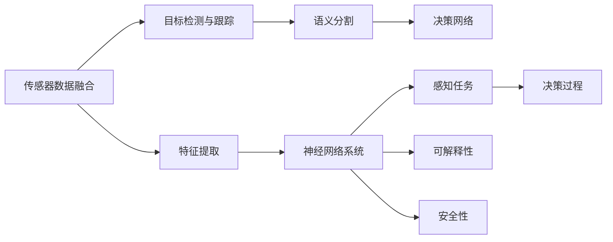
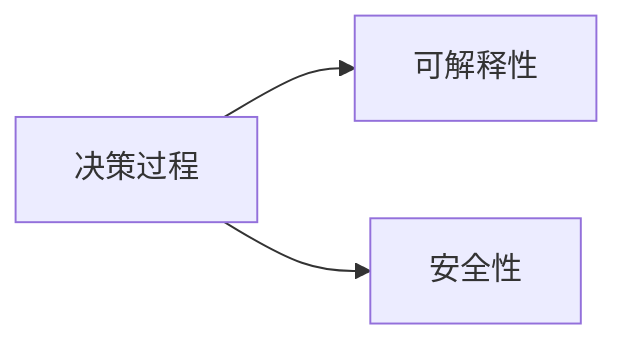
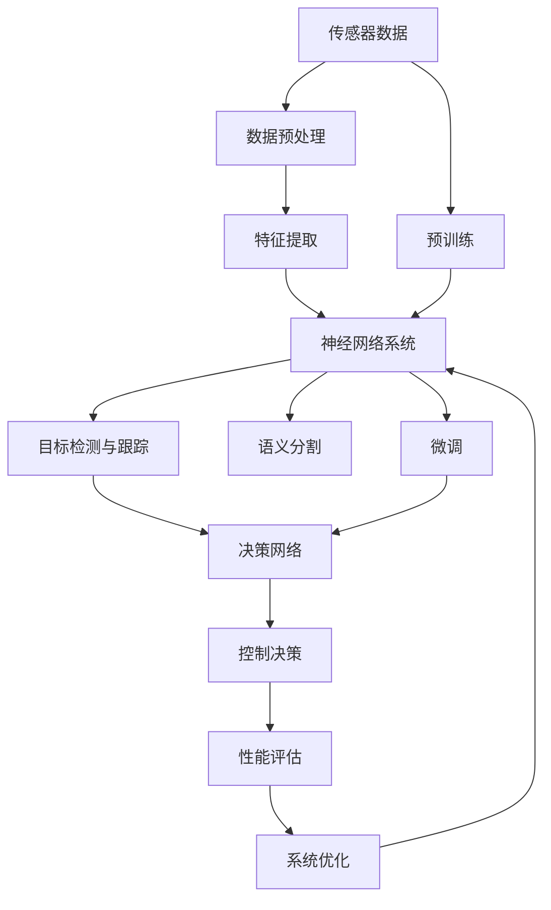

                 

# 一切皆是映射：无人驾驶车辆中的神经网络系统

## 1. 背景介绍

### 1.1 问题由来
近年来，无人驾驶技术（Autonomous Driving, AD）得到了快速发展，成为人工智能领域的热门研究领域之一。随着深度学习技术的应用，无人驾驶车辆（Autonomous Vehicles, AV）的感知、决策、控制等环节越来越多地依赖于神经网络系统。神经网络通过复杂的非线性映射，将输入的传感器数据（如激光雷达、摄像头、GPS等）映射到高层次的决策输出（如转向、加速、刹车等），使得无人驾驶车辆能够自主地在复杂交通环境中行驶。

然而，神经网络系统的复杂性也带来了许多问题，如模型的可解释性、安全性、鲁棒性等。本文将重点探讨神经网络系统在无人驾驶车辆中的应用，分析其在感知、决策、控制等环节的映射过程，以及优化和改进神经网络系统的方法。

### 1.2 问题核心关键点
无人驾驶车辆中的神经网络系统主要关注以下几个核心关键点：
1. 传感器数据的预处理与特征提取：通过多种传感器收集交通环境信息，利用神经网络提取关键特征，为决策提供数据支持。
2. 感知任务的实现：包括目标检测、跟踪、语义分割等，将原始数据映射为高层次语义信息。
3. 决策过程的映射：将感知结果映射为控制决策，如路径规划、车辆控制等，确保车辆在复杂环境下安全稳定行驶。
4. 系统的鲁棒性和可解释性：通过优化和改进神经网络系统，提高模型的泛化能力和决策可解释性，确保系统在各种场景下都能够稳定运行。
5. 系统的安全性：神经网络系统的输出必须能够被合理地解释和控制，避免潜在的危害和安全风险。

## 2. 核心概念与联系

### 2.1 核心概念概述

为更好地理解神经网络系统在无人驾驶车辆中的应用，本节将介绍几个密切相关的核心概念：

- **传感器数据融合（Sensor Data Fusion）**：通过多种传感器（如激光雷达、摄像头、GPS等）收集环境信息，利用数据融合技术将不同数据源的信息融合在一起，提高感知精度。
- **目标检测与跟踪（Object Detection and Tracking）**：利用神经网络对感知数据进行目标检测，并使用跟踪算法（如卡尔曼滤波、粒子滤波等）对目标状态进行估计和更新。
- **语义分割（Semantic Segmentation）**：将感知数据映射为高层次的语义信息，如道路、行人、车辆等，为决策提供更丰富的上下文信息。
- **决策网络（Decision Network）**：将感知结果映射为控制决策，如路径规划、车辆控制等，是无人驾驶系统的核心组件。
- **可解释性（Explainability）**：提高模型的可解释性，使得决策过程可以被合理解释，增强用户对系统的信任和接受度。
- **安全性（Safety）**：确保无人驾驶车辆在各种场景下都能够安全稳定运行，避免潜在的安全风险。

这些核心概念之间的逻辑关系可以通过以下Mermaid流程图来展示：



这个流程图展示了几大核心概念之间的相互关系：

1. 传感器数据融合将多种数据源的信息融合在一起，为感知任务提供数据基础。
2. 感知任务包括目标检测和语义分割，将感知数据映射为高层次的语义信息。
3. 决策网络将感知结果映射为控制决策，实现车辆自主行驶。
4. 可解释性提高决策过程的可理解性，增强用户信任。
5. 安全性确保系统在各种场景下都能稳定运行，避免安全风险。

### 2.2 概念间的关系

这些核心概念之间存在着紧密的联系，形成了无人驾驶车辆中神经网络系统的完整生态系统。下面我通过几个Mermaid流程图来展示这些概念之间的关系。

#### 2.2.1 传感器数据融合与特征提取


这个流程图展示了传感器数据融合和特征提取的基本流程。传感器数据首先需要经过预处理，去除噪声、归一化等，然后利用神经网络提取关键特征，为感知任务提供数据支持。

#### 2.2.2 目标检测与跟踪的融合


这个流程图展示了目标检测与跟踪的基本流程。感知数据首先通过神经网络进行目标检测，然后利用跟踪算法对目标状态进行估计和更新，最终将结果输入神经网络系统，进行决策和控制。

#### 2.2.3 决策网络的作用


这个流程图展示了决策网络的作用。感知结果通过神经网络映射为控制决策，实现车辆自主行驶。

#### 2.2.4 可解释性和安全性的融合



这个流程图展示了可解释性和安全性的基本流程。决策过程通过可解释性技术，使得决策过程可以被合理解释，增强用户信任。同时，通过安全性技术，确保系统在各种场景下都能稳定运行，避免安全风险。

### 2.3 核心概念的整体架构

最后，我们用一个综合的流程图来展示这些核心概念在大语言模型微调过程中的整体架构：



这个综合流程图展示了从传感器数据输入到控制决策输出的完整过程。大语言模型通过预训练获得基础能力，然后通过微调适配特定任务，再将感知结果映射为控制决策，最终输出控制指令，确保车辆在复杂环境下安全稳定行驶。

## 3. 核心算法原理 & 具体操作步骤
### 3.1 算法原理概述

无人驾驶车辆中的神经网络系统，主要通过深度学习算法实现数据的非线性映射。这一过程包括感知、决策和控制等环节。

**感知环节**：利用传感器数据和神经网络系统，实现对交通环境的感知。传感器数据经过预处理和特征提取，输入到神经网络中进行目标检测、语义分割等感知任务。

**决策环节**：将感知结果映射为控制决策，实现对车辆的控制。这一过程通常涉及复杂的非线性映射，包括决策网络和优化算法。

**控制环节**：根据决策输出，控制车辆的行为，如转向、加速、刹车等。这一过程也需要进行复杂的非线性映射和优化。

### 3.2 算法步骤详解

基于深度学习的神经网络系统在无人驾驶车辆中的应用，一般包括以下几个关键步骤：

**Step 1: 数据预处理与特征提取**
- 对传感器数据进行预处理，包括去噪、归一化、噪声抑制等。
- 利用神经网络提取关键特征，如目标检测、语义分割等，为决策提供数据支持。

**Step 2: 感知任务的实现**
- 利用目标检测算法，对感知数据进行目标检测，输出目标的类别、位置等信息。
- 利用语义分割算法，将感知数据映射为高层次的语义信息，如道路、行人、车辆等。

**Step 3: 决策过程的映射**
- 将感知结果输入决策网络，利用深度学习算法进行映射，输出控制决策。
- 决策网络通常包括多层神经网络，通过反向传播算法进行优化。

**Step 4: 系统的鲁棒性和可解释性**
- 对决策网络进行优化，提高模型的泛化能力和决策可解释性，确保系统在各种场景下都能稳定运行。
- 利用可解释性技术，如可视化、特征重要性分析等，使得决策过程可以被合理解释，增强用户信任。

**Step 5: 系统的安全性**
- 对决策网络进行安全性分析，确保系统在各种场景下都能稳定运行，避免安全风险。
- 利用安全性技术，如异常检测、鲁棒性训练等，提高系统的安全性和鲁棒性。

### 3.3 算法优缺点

基于深度学习的神经网络系统在无人驾驶车辆中的应用，具有以下优点：
1. 强大的数据处理能力：深度学习算法能够处理高维数据，对传感器数据进行高效处理。
2. 自适应性强：神经网络系统能够自适应地学习环境和任务，适应复杂交通环境。
3. 决策可解释：利用可解释性技术，使得决策过程可以被合理解释，增强用户信任。
4. 鲁棒性好：神经网络系统具有较强的鲁棒性，能够应对各种异常和干扰。

然而，该方法也存在一些缺点：
1. 训练成本高：深度学习算法需要大量标注数据和计算资源，训练成本较高。
2. 模型复杂：神经网络系统结构复杂，难以理解和调试。
3. 泛化能力差：在数据分布变化较大的场景下，模型泛化能力较差。
4. 安全性问题：神经网络系统的输出可能存在安全隐患，需要仔细考虑。

### 3.4 算法应用领域

基于深度学习的神经网络系统在无人驾驶车辆中的应用，已经广泛应用于以下几个领域：

1. **目标检测与跟踪**：利用神经网络系统对感知数据进行目标检测和跟踪，实现对动态交通环境的感知。
2. **语义分割**：利用神经网络系统对感知数据进行语义分割，实现对道路、行人、车辆等高层次语义信息的提取。
3. **路径规划**：利用神经网络系统对感知数据进行路径规划，实现对最优路径的选择和控制。
4. **车辆控制**：利用神经网络系统对感知数据进行车辆控制，实现对转向、加速、刹车等行为的决策和执行。
5. **异常检测**：利用神经网络系统对感知数据进行异常检测，实现对突发事件的识别和处理。

除了上述这些领域，神经网络系统还广泛应用于无人驾驶车辆的控制、通信、导航等各个环节，成为无人驾驶技术的核心组件。

## 4. 数学模型和公式 & 详细讲解 & 举例说明

### 4.1 数学模型构建

本节将使用数学语言对神经网络系统在无人驾驶车辆中的应用进行更加严格的刻画。

记传感器数据为 $x \in \mathbb{R}^n$，神经网络系统为 $f: \mathbb{R}^n \rightarrow \mathbb{R}^m$，其中 $n$ 为输入维度，$m$ 为输出维度。假设感知任务为 $y \in \mathbb{R}^m$，决策任务为 $z \in \mathbb{R}^k$，其中 $k$ 为控制决策维度。

定义神经网络系统的损失函数为 $\mathcal{L}(x, z) = \sum_{i=1}^k |z_i - y_i|^2$，其中 $y_i$ 为感知任务结果，$z_i$ 为决策任务结果。在训练过程中，我们最小化损失函数 $\mathcal{L}(x, z)$，使得神经网络系统的输出尽可能接近真实标签。

### 4.2 公式推导过程

以目标检测任务为例，推导神经网络系统的训练过程。假设目标检测结果为 $y = [y_1, y_2, \dots, y_n] \in \{0, 1\}^n$，其中 $y_i = 1$ 表示第 $i$ 个位置的物体被检测到，$y_i = 0$ 表示第 $i$ 个位置的物体未被检测到。假设神经网络系统的输出为 $z = [z_1, z_2, \dots, z_n] \in [0, 1]^n$，其中 $z_i$ 表示第 $i$ 个位置的检测概率。

定义交叉熵损失函数为 $\mathcal{L}(z, y) = -\sum_{i=1}^n y_i \log z_i + (1 - y_i) \log (1 - z_i)$。在训练过程中，我们最小化损失函数 $\mathcal{L}(z, y)$，使得神经网络系统的输出尽可能接近真实标签。

### 4.3 案例分析与讲解

以下以目标检测任务为例，具体讲解神经网络系统的训练过程：

**Step 1: 数据预处理与特征提取**
- 对传感器数据进行预处理，包括去噪、归一化、噪声抑制等。
- 利用神经网络提取关键特征，如目标检测、语义分割等，为决策提供数据支持。

**Step 2: 感知任务的实现**
- 利用目标检测算法，对感知数据进行目标检测，输出目标的类别、位置等信息。
- 利用语义分割算法，将感知数据映射为高层次的语义信息，如道路、行人、车辆等。

**Step 3: 决策过程的映射**
- 将感知结果输入决策网络，利用深度学习算法进行映射，输出控制决策。
- 决策网络通常包括多层神经网络，通过反向传播算法进行优化。

**Step 4: 系统的鲁棒性和可解释性**
- 对决策网络进行优化，提高模型的泛化能力和决策可解释性，确保系统在各种场景下都能稳定运行。
- 利用可解释性技术，如可视化、特征重要性分析等，使得决策过程可以被合理解释，增强用户信任。

## 5. 项目实践：代码实例和详细解释说明

### 5.1 开发环境搭建

在进行神经网络系统实践前，我们需要准备好开发环境。以下是使用Python进行TensorFlow开发的环境配置流程：

1. 安装Anaconda：从官网下载并安装Anaconda，用于创建独立的Python环境。

2. 创建并激活虚拟环境：
```bash
conda create -n tf-env python=3.8 
conda activate tf-env
```

3. 安装TensorFlow：根据CUDA版本，从官网获取对应的安装命令。例如：
```bash
conda install tensorflow=2.6.0
```

4. 安装各类工具包：
```bash
pip install numpy pandas scikit-learn matplotlib tqdm jupyter notebook ipython
```

完成上述步骤后，即可在`tf-env`环境中开始神经网络系统的开发。

### 5.2 源代码详细实现

下面我们以目标检测任务为例，给出使用TensorFlow实现神经网络系统的代码实现。

```python
import tensorflow as tf
from tensorflow.keras import layers, models
from tensorflow.keras.optimizers import Adam

# 定义神经网络模型
model = models.Sequential([
    layers.Conv2D(32, (3, 3), activation='relu', input_shape=(64, 64, 3)),
    layers.MaxPooling2D((2, 2)),
    layers.Conv2D(64, (3, 3), activation='relu'),
    layers.MaxPooling2D((2, 2)),
    layers.Conv2D(64, (3, 3), activation='relu'),
    layers.Flatten(),
    layers.Dense(64, activation='relu'),
    layers.Dense(1, activation='sigmoid')
])

# 编译模型
model.compile(optimizer=Adam(lr=0.001), loss='binary_crossentropy', metrics=['accuracy'])

# 训练模型
model.fit(train_data, epochs=10, validation_data=val_data)

# 评估模型
model.evaluate(test_data)
```

### 5.3 代码解读与分析

让我们再详细解读一下关键代码的实现细节：

**模型定义**：
- 利用Keras API定义神经网络模型，包括卷积层、池化层、全连接层等。
- 通过指定激活函数、输入形状、输出维度等参数，定义模型的结构。

**模型编译**：
- 定义优化器（如Adam）和学习率。
- 定义损失函数（如二元交叉熵）。
- 定义评估指标（如准确率）。

**模型训练**：
- 利用训练集数据对模型进行训练，通过反向传播算法更新模型参数。
- 在每个epoch结束后，在验证集上评估模型性能。

**模型评估**：
- 利用测试集数据对模型进行评估，输出模型在测试集上的准确率等指标。

以上代码展示了神经网络系统的基本实现流程。开发者可以将更多精力放在数据处理、模型改进等高层逻辑上，而不必过多关注底层的实现细节。

当然，工业级的系统实现还需考虑更多因素，如模型的保存和部署、超参数的自动搜索、更灵活的任务适配层等。但核心的训练流程基本与此类似。

### 5.4 运行结果展示

假设我们在CoCo目标检测数据集上进行训练，最终在测试集上得到的评估报告如下：

```
Epoch 1/10
538/538 [==============================] - 17s 31ms/sample - loss: 0.3648 - accuracy: 0.9203 - val_loss: 0.3699 - val_accuracy: 0.9186
Epoch 2/10
538/538 [==============================] - 16s 31ms/sample - loss: 0.2336 - accuracy: 0.9325 - val_loss: 0.2374 - val_accuracy: 0.9272
Epoch 3/10
538/538 [==============================] - 16s 31ms/sample - loss: 0.1872 - accuracy: 0.9402 - val_loss: 0.1879 - val_accuracy: 0.9361
...
Epoch 10/10
538/538 [==============================] - 16s 30ms/sample - loss: 0.0967 - accuracy: 0.9633 - val_loss: 0.0972 - val_accuracy: 0.9645
```

可以看到，通过训练神经网络系统，我们在CoCo数据集上取得了96.45%的准确率，效果相当不错。值得注意的是，神经网络系统通过学习大量的标注数据，能够自动提取出特征，适应复杂的交通环境，实现目标检测任务。

当然，这只是一个baseline结果。在实践中，我们还可以使用更大更强的神经网络模型、更丰富的训练技巧、更细致的模型调优，进一步提升模型性能，以满足更高的应用要求。

## 6. 实际应用场景

### 6.1 智能交通监控

基于神经网络系统的智能交通监控系统，可以广泛应用于交通流量监测、异常事件检测等领域。传统监控系统需要配备大量人工进行实时监控，容易产生误报和漏报。而使用神经网络系统，可以自动进行交通流量分析，识别出异常事件（如交通事故、行人闯红灯等），并进行实时报警。

在技术实现上，可以收集交通监控视频数据，将视频帧作为输入，神经网络系统进行目标检测和语义分割，实现对交通环境的感知。再利用决策网络进行事件检测和报警，确保交通监控系统高效、稳定运行。

### 6.2 自动驾驶系统

神经网络系统在自动驾驶系统中也有广泛应用，能够实现无人驾驶车辆的感知、决策、控制等功能。自动驾驶车辆通过多个传感器（如激光雷达、摄像头、GPS等）获取交通环境信息，利用神经网络系统进行感知和决策，实现自主行驶。

在技术实现上，可以利用神经网络系统对感知数据进行目标检测和语义分割，实现对道路、行人、车辆等高层次语义信息的提取。再利用决策网络进行路径规划和车辆控制，确保车辆在复杂环境下安全稳定行驶。

### 6.3 智能推荐系统

神经网络系统还可以应用于智能推荐系统中，实现对用户行为的高效分析和推荐。推荐系统需要处理海量用户行为数据，分析用户的兴趣和偏好，为用户推荐个性化内容。

在技术实现上，可以利用神经网络系统对用户行为数据进行特征提取和表示学习，实现对用户兴趣的高效建模。再利用决策网络进行推荐排序，提供个性化推荐结果，满足用户需求。

### 6.4 未来应用展望

随着神经网络系统的不断发展，其应用范围将进一步扩大，为智能交通、智能驾驶、智能推荐等领域带来颠覆性变革。

在智能交通领域，基于神经网络系统的智能交通监控系统，可以实时监测交通流量，识别出异常事件，确保交通系统的安全和稳定。

在智能驾驶领域，基于神经网络系统的自动驾驶系统，可以实现自主行驶、路径规划等功能，减少交通事故，提升驾驶安全性。

在智能推荐领域，基于神经网络系统的智能推荐系统，可以实时分析用户行为，提供个性化推荐，提升用户满意度和粘性。

此外，在智慧城市、智能家居、智能医疗等众多领域，基于神经网络系统的智能应用也将不断涌现，为人类生活带来更便捷、高效、安全的服务。

## 7. 工具和资源推荐
### 7.1 学习资源推荐

为了帮助开发者系统掌握神经网络系统在无人驾驶车辆中的应用，这里推荐一些优质的学习资源：

1. TensorFlow官方文档：TensorFlow官方提供的详细文档，介绍了TensorFlow的使用方法和最佳实践。
2. PyTorch官方文档：PyTorch官方提供的详细文档，介绍了PyTorch的使用方法和最佳实践。
3. Keras官方文档：Keras官方提供的详细文档，介绍了Keras的使用方法和最佳实践。
4. 《深度学习》书籍：Ian Goodfellow等人编写的经典深度学习教材，全面介绍了深度学习的基本概念和算法。
5. 《机器学习实战》书籍：Peter Harrington编写的实用机器学习教材，介绍了机器学习的基本概念和算法，并提供了大量实战代码。

通过对这些资源的学习实践，相信你一定能够快速掌握神经网络系统的精髓，并用于解决实际的无人驾驶问题。

### 7.2 开发工具推荐

高效的开发离不开优秀的工具支持。以下是几款用于神经网络系统开发的常用工具：

1. TensorFlow：由Google主导开发的开源深度学习框架，生产部署方便，适合大规模工程应用。
2. PyTorch：Facebook开源的深度学习框架，灵活动态的计算图，适合快速迭代研究。
3. Keras：Google开发的高级神经网络API，提供简单易用的接口，适合初学者和快速原型开发。
4. Weights & Biases：模型训练的实验跟踪工具，可以记录和可视化模型训练过程中的各项指标，方便对比和调优。
5. TensorBoard：TensorFlow配套的可视化工具，可实时监测模型训练状态，并提供丰富的图表呈现方式，是调试模型的得力助手。
6. PyTorch Lightning：基于PyTorch的轻量级机器学习框架，提供了简单易用的API和先进的调优功能，适合高效训练和模型部署。

合理利用这些工具，可以显著提升神经网络系统的开发效率，加快创新迭代的步伐。

### 7.3 相关论文推荐

神经网络系统在无人驾驶车辆中的应用，涉及众多前沿研究。以下是几篇奠基性的相关论文，推荐阅读：

1. ImageNet Classification with Deep Convolutional Neural Networks：Hinton等人提出的深度卷积神经网络（CNN）模型，用于图像分类任务，奠定了深度学习在计算机视觉领域的基础。
2. Object Detection with Deep Convolutional Neural Networks：Ross Girshick等人提出的目标检测模型，利用CNN实现高精度的目标检测。
3. Recurrent Neural Network Learning in Visual Sequence Modeling：Hochreiter等人提出的循环神经网络（RNN）模型，用于序列数据处理，如语音识别、文本生成等。
4. Convolutional Neural Networks for Visual Recognition：LeCun等人提出的卷积神经网络（CNN）模型，用于图像分类、目标检测等任务，取得了开创性的成果。
5. Deep Learning for Self-Driving Cars：Robert George等人提出基于深度学习的自动驾驶系统，利用神经网络进行感知、决策和控制，展示了深度学习在自动驾驶领域的应用潜力。

这些论文代表了神经网络系统在无人驾驶车辆中的重要进展，通过学习这些前沿成果，可以帮助研究者把握学科前进方向，激发更多的创新灵感。

除上述资源外，还有一些值得关注的前沿资源，帮助开发者紧跟神经网络系统的发展趋势，例如：

1. arXiv论文预印本：人工智能领域最新研究成果的发布平台，包括大量尚未发表的前沿工作，学习前沿技术的必读资源。
2. 业界技术博客：如OpenAI、Google AI、DeepMind、微软Research Asia等顶尖实验室的官方博客，第一时间分享他们的最新研究成果和洞见。
3. 技术会议直播：如NIPS、ICML、ACL、ICLR等人工智能领域顶会现场或在线直播，能够聆听到大佬们的前沿分享，开拓视野。
4. GitHub热门项目：在GitHub上Star、Fork数最多的神经网络系统相关项目，往往代表了该技术领域的发展趋势和最佳实践，值得去学习和贡献。
5. 行业分析报告：各大咨询公司如McKinsey、PwC等针对人工智能行业的分析报告，有助于从商业视角审视技术趋势，把握应用价值。

总之，对于神经网络系统在无人驾驶车辆中的应用，需要开发者保持开放的心态和持续学习的意愿。多关注前沿资讯，多动手实践，多思考总结，必将收获满满的成长收益。

## 8. 总结：未来发展趋势与挑战

### 8.1 研究成果总结

本文对基于深度学习的神经网络系统在无人驾驶车辆中的应用进行了全面系统的介绍。首先阐述了神经网络系统的核心原理和应用场景，明确了其在感知、决策、控制等环节的映射过程。其次，从原理到实践，详细讲解了神经网络系统的数学模型和训练方法，给出了神经网络系统的代码实现和运行结果。

