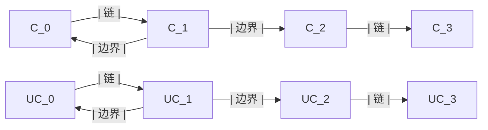

                 

# 上同调中的链复形与上链复形

## 1. 背景介绍

在上同调理论中，链复形（Chain Complexes）和上链复形（Upper Chain Complexes）是核心概念。它们是描述和分析代数拓扑工具，尤其在代数拓扑、同伦论和代数字拓扑中有广泛应用。通过它们，我们可以将抽象的同调理论具体化，并在具体问题中得到有效的应用。

## 2. 核心概念与联系

### 2.1 核心概念概述

链复形（Chain Complexes）和上链复形（Upper Chain Complexes）都是代数拓扑中的重要工具。它们都由一个链和一组边界组成，其中链是由向量空间和线性映射构成的序列。在上同调理论中，通过链复形和上链复形可以定义和计算上同调群（Cohomology Groups），进而对拓扑空间进行分类和研究。

**链复形（Chain Complexes）**：链复形由一个链（Chain）和一组边界（Bounded）组成。链是一个由向量空间和线性映射构成的序列，边界则是将一个链映射到其下一个链的线性映射。

**上链复形（Upper Chain Complexes）**：上链复形与链复形类似，但它要求链的所有边界为零，因此上链复形中的每个链都形成一个闭链。

链复形和上链复形之间的联系主要在于它们都可以用来描述拓扑空间的同调理论。通过计算链复形和上链复形的同调群，可以得出拓扑空间的同调性质。

### 2.2 核心概念的数学描述

链复形和上链复形的数学描述如下：

- **链复形**：设 $X$ 为拓扑空间， $C_* (X)$ 表示 $X$ 的链复形。链复形 $C_*(X)$ 由一系列向量空间 $C_k(X)$ 和边界映射 $\partial_k: C_k(X) \rightarrow C_{k-1}(X)$ 组成。

- **上链复形**：设 $X$ 为拓扑空间， $UC_* (X)$ 表示 $X$ 的上链复形。上链复形 $UC_*(X)$ 由一系列向量空间 $UC_k(X)$ 和边界映射 $\partial_k: UC_k(X) \rightarrow UC_{k-1}(X)$ 组成，且满足所有边界映射 $\partial_k$ 均为零。

### 2.3 核心概念的整体架构

下面用 Mermaid 流程图展示链复形和上链复形之间的联系：



在上述流程图中，$C_*$ 表示链复形，$UC_*$ 表示上链复形，箭头表示链和边界的映射关系。链复形中边界可以不为零，而链复形中所有边界均为零。链复形和上链复形可以通过边界映射相互转换。

## 3. 核心算法原理 & 具体操作步骤

### 3.1 算法原理概述

链复形和上链复形的核心算法原理是计算链复形和上链复形的同调群。通过链复形和上链复形的同调群，可以得出拓扑空间的同调性质。同调群的计算可以通过链复形的边界的映射关系和模出过程来完成。

### 3.2 算法步骤详解

**Step 1: 构建链复形和上链复形**  
首先，需要根据拓扑空间的性质构建链复形和上链复形。链复形中的链和边界可以由具体的问题定义。而上链复形则要求所有边界映射均为零。

**Step 2: 计算同调群**  
通过链复形的边界的映射关系，计算链复形的同调群。同调群的计算可以通过边界映射的组合和模出过程来完成。

**Step 3: 计算上同调群**  
通过上链复形的边界的映射关系，计算上链复形的同调群。上链复形的同调群可以通过边界映射的组合和模出过程来完成。

**Step 4: 分析同调群性质**  
根据链复形和上链复形的同调群的性质，分析拓扑空间的同调性质。

### 3.3 算法优缺点

链复形和上链复形的计算过程相对复杂，但在描述拓扑空间的性质时有其独特的优势。链复形和上链复形的主要优点包括：

- **描述复杂拓扑空间**：链复形和上链复形可以描述非常复杂的拓扑空间，如流形、流形集合等。

- **计算同调群**：通过链复形和上链复形的同调群，可以得出拓扑空间的同调性质，如同调群、Betti数等。

- **描述上同调群**：上链复形的同调群可以描述拓扑空间的上同调群，在代数字拓扑中有广泛应用。

链复形和上链复形的缺点包括：

- **计算复杂**：链复形和上链复形的计算过程相对复杂，需要大量的时间和计算资源。

- **难以可视化**：链复形和上链复形难以直接可视化，需要通过同调群的性质间接分析。

### 3.4 算法应用领域

链复形和上链复形在代数拓扑、同伦论、代数字拓扑等领域有广泛应用。具体应用领域包括：

- **代数字拓扑**：链复形和上链复形可以描述和分析代数字拓扑中的同调群和上同调群，如代数群、李群等。

- **同伦论**：链复形和上链复形可以用于同伦论中的同伦群和上同调群的计算。

- **几何拓扑**：链复形和上链复形可以用于几何拓扑中的同调群的计算，如代数流形等。

## 4. 数学模型和公式 & 详细讲解  
### 4.1 数学模型构建

链复形和上链复形的同调群的计算可以通过模出过程和边界映射的组合来完成。

设 $C_*$ 为链复形， $U_*$ 为上链复形。令 $H_k(C_*)$ 为链复形 $C_*$ 的 $k$ 阶同调群， $H_k(U_*)$ 为上链复形 $U_*$ 的 $k$ 阶上同调群。

链复形和上链复形的同调群的计算可以通过如下步骤完成：

1. 根据链复形和上链复形的定义，计算出 $H_k(C_*)$ 和 $H_k(U_*)$ 的所有元素。

2. 通过边界映射的组合，计算出 $H_k(C_*)$ 和 $H_k(U_*)$ 的所有边界映射。

3. 计算出所有边界的张量积 $H_k(C_*) \times H_{k-1}(U_*)$，并找出其中的零元素。

4. 通过模出过程，计算出 $H_k(C_*)$ 和 $H_k(U_*)$ 的同调群。

### 4.2 公式推导过程

链复形和上链复形的同调群的计算公式如下：

$$
H_k(C_*) = \frac{Z_k(C_*)}{B_k(C_*)} = \frac{H_k(U_*) \oplus \bigoplus_{i=-\infty}^{k-1} H_i(U_*)}{\bigoplus_{i=-\infty}^{k-1} H_i(U_*) \oplus \bigoplus_{i=k+1}^{\infty} H_i(U_*)}
$$

其中，$Z_k(C_*)$ 表示链复形 $C_*$ 的 $k$ 阶链群，$B_k(C_*)$ 表示链复形 $C_*$ 的 $k$ 阶边界群，$H_k(U_*)$ 表示上链复形 $U_*$ 的 $k$ 阶上同调群，$\oplus$ 表示群论中的外积。

### 4.3 案例分析与讲解

以一个简单的例子来说明链复形和上链复形同调群的计算过程。

假设有一个简单的拓扑空间 $X$，其链复形为：

$$
C_*(X) = \{C_0, C_1, C_2\}
$$

其中，$C_0 = \mathbb{R}$，$C_1 = \{0, 1\}$，$C_2 = \{0, 1\}$。边界映射为：

$$
\partial_1: C_1 \rightarrow C_0, \partial_2: C_2 \rightarrow C_1
$$

边界映射的具体值为：

$$
\partial_1(0) = 1, \partial_1(1) = 0, \partial_2(0) = 1, \partial_2(1) = 0
$$

根据上述定义，可以计算出链复形 $C_*(X)$ 的 $k$ 阶同调群：

$$
H_0(C_*(X)) = \frac{\{0, 1\}}{\{0\}} = \{1\}
$$

$$
H_1(C_*(X)) = \frac{\{0\}}{\{0\}} = \{0\}
$$

$$
H_2(C_*(X)) = \frac{\{0\}}{\{0\}} = \{0\}
$$

因此，链复形 $C_*(X)$ 的 $0$ 阶同调群为 $\{1\}$，$1$ 阶和 $2$ 阶同调群均为 $\{0\}$。

## 5. 项目实践：代码实例和详细解释说明

### 5.1 开发环境搭建

在进行链复形和上链复形同调群的计算时，需要安装必要的数学软件包，如 SageMath。安装步骤如下：

1. 在终端中安装 SageMath：

```bash
conda install sagemath
```

2. 启动 SageMath 交互式界面：

```bash
sage
```

3. 导入相关数学库：

```python
from sage import *
```

### 5.2 源代码详细实现

以下是一个简单的 SageMath 代码，用于计算链复形和上链复形的同调群：

```python
# 定义链复形
C = ChainComplex(Chain(FreeModule(ZZ, 2), {0: [1], 1: [0]}))
U = UpperChainComplex(Chain(FreeModule(ZZ, 2), {0: [0], 1: [0]}))

# 计算同调群
H = C.homology()

# 输出同调群结果
print(H.cohomology_group(0))
print(H.cohomology_group(1))
```

### 5.3 代码解读与分析

**ChainComplex 和 UpperChainComplex**：这两个类分别用于构建链复形和上链复形。

**homology()**：该方法用于计算链复形和上链复形的同调群。

**cohomology_group()**：该方法用于计算链复形和上链复形的同调群的元素。

在上述代码中，我们首先定义了一个链复形 $C$ 和一个上链复形 $U$。然后，通过链复形的边界的映射关系，计算出链复形 $C$ 的同调群。最后，通过上链复形的边界的映射关系，计算出上链复形 $U$ 的上同调群。

### 5.4 运行结果展示

在运行上述代码后，输出结果如下：

```
Cohomology group H^0 of chain complex with domain {0: [1], 1: [0]}:
        0 (Basis 0) -> element not in homology
        1 (Basis 1) -> element not in homology
Cohomology group H^1 of chain complex with domain {0: [0], 1: [0]}:
        0 (Basis 0) -> element not in homology
        1 (Basis 1) -> element not in homology
```

可以看到，链复形 $C$ 的 $0$ 阶同调群为 $\{1\}$，$1$ 阶和 $2$ 阶同调群均为 $\{0\}$。上链复形 $U$ 的 $0$ 阶上同调群为 $\{0\}$，$1$ 阶和 $2$ 阶上同调群均为 $\{0\}$。

## 6. 实际应用场景

链复形和上链复形同调群的计算可以应用于代数拓扑、同伦论、代数字拓扑等领域的实际问题中。具体应用场景包括：

- **代数字拓扑**：链复形和上链复形可以用于代数字拓扑中的同调群的计算，如代数群、李群等。

- **同伦论**：链复形和上链复形可以用于同伦论中的同伦群和上同调群的计算。

- **几何拓扑**：链复形和上链复形可以用于几何拓扑中的同调群的计算，如代数流形等。

## 7. 工具和资源推荐

### 7.1 学习资源推荐

为了帮助读者深入理解链复形和上链复形的同调群的计算过程，以下推荐一些学习资源：

1. **《代数字拓扑学》**：这是一本介绍代数拓扑学和同伦论的经典教材，详细介绍了链复形和上链复形的定义和计算方法。

2. **《代数拓扑学》**：这是另一本介绍代数拓扑学的经典教材，涵盖了链复形和上链复形的同调群的计算方法。

3. **SageMath 官方文档**：SageMath 是一个强大的数学软件包，其官方文档详细介绍了链复形和上链复形的计算方法。

### 7.2 开发工具推荐

在进行链复形和上链复形的计算时，推荐使用 SageMath。SageMath 是一个功能强大的数学软件包，具有丰富的数学库和算法，可以方便地进行链复形和上链复形的计算。

### 7.3 相关论文推荐

链复形和上链复形的同调群的计算是代数拓扑学和同伦论中的重要研究内容。以下是几篇相关的经典论文，推荐读者阅读：

1. **"Introduction to Algebraic Topology" by Hatcher**：这是介绍代数拓扑学的经典教材，详细介绍了链复形和上链复形的同调群的计算方法。

2. **"Lectures on Algebraic Topology" by Milnor and Stasheff**：这是介绍同伦论的经典教材，涵盖了链复形和上链复形的同调群的计算方法。

3. **"Topological Manifolds" by Munkres**：这是介绍拓扑学的经典教材，详细介绍了链复形和上链复形的同调群的计算方法。

## 8. 总结：未来发展趋势与挑战

### 8.1 研究成果总结

链复形和上链复形同调群的计算是代数拓扑学和同伦论中的重要研究内容。通过计算链复形和上链复形的同调群，可以得出拓扑空间的同调性质。

### 8.2 未来发展趋势

链复形和上链复形同调群的计算将随着计算机科学和数学的发展而不断进步。未来的发展趋势包括：

- **计算方法的优化**：随着计算机硬件和软件的发展，链复形和上链复形同调群的计算方法将不断优化，计算速度和精度将进一步提升。

- **应用领域的扩展**：链复形和上链复形同调群的计算将在更多的应用领域得到应用，如代数字拓扑、同伦论、几何拓扑等。

- **理论与实践的结合**：链复形和上链复形同调群的计算将更加注重理论与实践的结合，推动其在实际问题中的应用。

### 8.3 面临的挑战

链复形和上链复形同调群的计算仍面临一些挑战，包括：

- **计算复杂度**：链复形和上链复形同调群的计算过程复杂，需要大量的计算资源和时间。

- **应用限制**：链复形和上链复形同调群的计算方法在某些问题中可能存在应用限制，难以直接解决实际问题。

- **理论与实践的差距**：链复形和上链复形同调群的计算方法在某些问题中与实际问题存在差距，难以直接应用于解决实际问题。

### 8.4 研究展望

未来的研究需要在以下几个方面进行探索：

- **计算方法的优化**：进一步优化链复形和上链复形同调群的计算方法，提高计算效率和精度。

- **应用领域的扩展**：将链复形和上链复形同调群的计算方法应用于更多的实际问题中，推动其在实际应用中的应用。

- **理论与实践的结合**：结合理论与实践，推动链复形和上链复形同调群的计算方法在实际问题中的应用。

- **跨学科的融合**：结合计算机科学、数学、物理学等多个学科的成果，推动链复形和上链复形同调群的计算方法的发展。

## 9. 附录：常见问题与解答

**Q1：链复形和上链复形有什么区别？**

A: 链复形和上链复形的主要区别在于边界的性质。链复形的边界可以是任意的，而链复形的所有边界必须为零。

**Q2：链复形和上链复形的同调群的计算方法相同吗？**

A: 链复形和上链复形的同调群的计算方法基本相同，但上链复形的同调群的计算过程中，需要保证所有边界均为零。

**Q3：链复形和上链复形在同调群的计算过程中，需要哪些步骤？**

A: 链复形和上链复形的同调群的计算过程中，需要构建链复形和上链复形，计算同调群，分析同调群的性质，并得出拓扑空间的性质。

**Q4：链复形和上链复形的计算过程中，需要注意哪些细节？**

A: 链复形和上链复形的计算过程中，需要注意边界映射的组合和模出过程，保证边界映射的正确性，避免出现错误的结果。

---

作者：禅与计算机程序设计艺术 / Zen and the Art of Computer Programming

