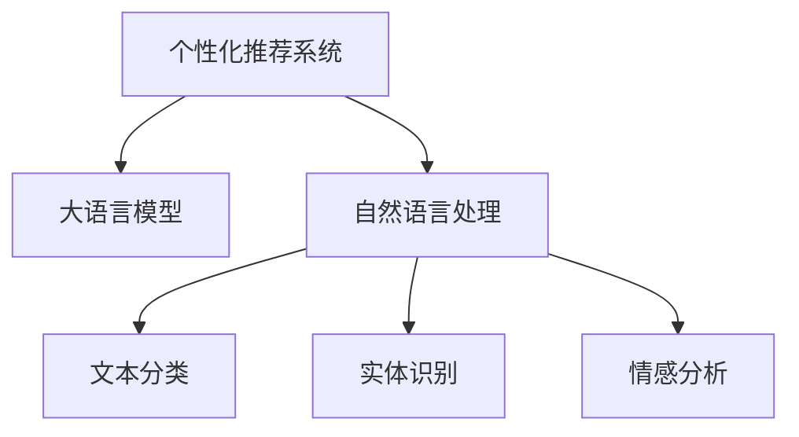
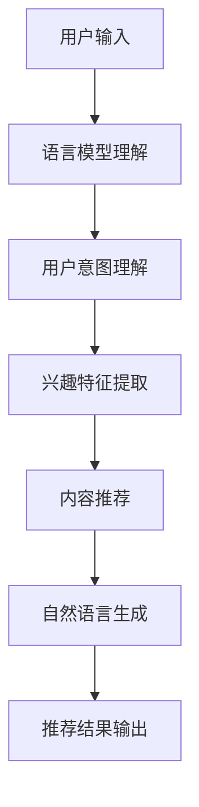

                 

## 1. 背景介绍

随着人工智能技术的发展，个性化推荐系统（Personalized Recommendation System, PRS）在各种智能系统（Intelligent User Interfaces, CUI）中得到了广泛应用，如智能音箱、智能电视、智能助手等。个性化推荐系统通过分析用户的行为数据和兴趣特征，为用户提供个性化的内容推荐，极大地提升了用户体验和系统价值。

在传统的基于协同过滤和深度学习的推荐方法之外，近年来，基于大语言模型（Large Language Model, LLM）的推荐方法逐渐受到关注。本文将详细解析基于大语言模型在自然用户界面（Natural User Interface, NUI）中的个性化推荐系统应用，探讨其原理、实现方法和未来展望。

## 2. 核心概念与联系

### 2.1 核心概念概述

在本文中，我们将涉及以下核心概念：

- **个性化推荐系统**：根据用户的历史行为和兴趣特征，推荐用户可能感兴趣的内容的系统。
- **大语言模型**：通过大规模语料训练得到的能够理解、生成自然语言的语言模型，如GPT-3、BERT等。
- **自然用户界面**：通过自然语言与用户交互的系统，如智能音箱、智能助手等。
- **自然语言处理**：使计算机能够理解、处理和生成自然语言的技术，包括文本分类、实体识别、情感分析等。

这些核心概念之间的关系如图2-1所示。



### 2.2 核心概念的联系

大语言模型在自然用户界面中得到了广泛应用，主要体现在以下方面：

1. **语言理解与生成**：大语言模型能够理解用户的自然语言输入，生成自然语言输出，帮助用户完成各种任务，如回答问题、执行命令、推荐内容等。
2. **知识整合**：大语言模型可以整合各种知识源（如知识图谱、专家系统等），提供更加丰富、准确的推荐内容。
3. **用户意图理解**：通过自然语言处理技术，大语言模型能够理解用户的意图，提供更加个性化的推荐。

## 3. 核心算法原理 & 具体操作步骤

### 3.1 算法原理概述

基于大语言模型的个性化推荐系统，主要利用大语言模型的语言理解和生成能力，结合用户行为数据和兴趣特征，为用户推荐个性化内容。其基本原理如图3-1所示。



1. **用户输入理解**：大语言模型能够理解用户的自然语言输入，从中提取关键信息。
2. **用户意图理解**：通过自然语言处理技术，大语言模型能够理解用户的意图，提供更加个性化的推荐。
3. **兴趣特征提取**：结合用户的历史行为数据和兴趣特征，提取用户的个性化特征。
4. **内容推荐**：根据用户的兴趣特征，推荐合适的个性化内容。
5. **推荐结果输出**：通过自然语言生成技术，将推荐结果输出给用户。

### 3.2 算法步骤详解

基于大语言模型的个性化推荐系统主要包括以下几个步骤：

**Step 1: 数据准备**

- 收集用户的自然语言输入、历史行为数据和兴趣特征。
- 对数据进行预处理和特征提取，构建训练集。

**Step 2: 大语言模型训练**

- 选择合适的预训练语言模型，如BERT、GPT-3等。
- 在训练集上进行有监督学习，训练大语言模型。

**Step 3: 用户意图理解**

- 将用户输入传递给大语言模型，理解用户意图。
- 提取用户的兴趣特征和意图信息，用于后续推荐。

**Step 4: 内容推荐**

- 根据用户的兴趣特征和意图信息，选择合适的推荐算法。
- 结合用户的历史行为数据，生成个性化推荐内容。

**Step 5: 自然语言生成**

- 将推荐内容进行自然语言生成，生成简洁明了的推荐结果。
- 将推荐结果输出给用户，完成推荐过程。

### 3.3 算法优缺点

**优点**：

1. **语言理解能力强**：大语言模型能够理解自然语言输入，提取用户意图和兴趣特征，提供更加个性化的推荐。
2. **跨领域性强**：大语言模型可以整合各种知识源，提供跨领域的个性化推荐。
3. **易于集成**：大语言模型可以与其他系统集成，提供多样化的功能。

**缺点**：

1. **计算资源需求高**：大语言模型通常需要强大的计算资源进行训练和推理。
2. **数据需求高**：大语言模型需要大量高质量的标注数据进行训练，获取数据成本较高。
3. **模型鲁棒性不足**：大语言模型可能存在偏见和歧视，需要进一步优化。

### 3.4 算法应用领域

基于大语言模型的个性化推荐系统在各种自然用户界面（NUI）中得到了广泛应用，如图3-2所示。


- **智能音箱**：利用语音助手进行个性化推荐，如推荐音乐、新闻、商品等。
- **智能电视**：结合影视推荐系统，根据用户兴趣推荐影片、电视剧等。
- **智能助手**：通过自然语言处理技术，理解用户意图，推荐相应的内容。

## 4. 数学模型和公式 & 详细讲解

### 4.1 数学模型构建

基于大语言模型的个性化推荐系统，其数学模型可以表示为：

$$
\hat{y} = M_{\theta}(x, C_{u})
$$

其中，$M_{\theta}$ 表示大语言模型，$x$ 表示用户输入的自然语言，$C_{u}$ 表示用户的兴趣特征和历史行为数据。

### 4.2 公式推导过程

假设用户的兴趣特征和历史行为数据可以表示为一个向量 $C_{u}$，其大小为 $n$。大语言模型 $M_{\theta}$ 的输出向量为 $\hat{y}$，大小为 $m$。

假设用户的输入为 $x$，大语言模型 $M_{\theta}$ 的输出为 $\hat{y}$，则推荐系统的输出可以表示为：

$$
\hat{y} = M_{\theta}(x, C_{u}) = \frac{\exp(\vec{w}_{\theta}^T \cdot [x, C_{u}])}{\sum_{i=1}^N \exp(\vec{w}_{\theta}^T \cdot [x_i, C_{i}])}
$$

其中，$\vec{w}_{\theta}$ 表示大语言模型的权重向量，$[x, C_{u}]$ 表示用户输入和兴趣特征的组合向量。

### 4.3 案例分析与讲解

以智能音箱为例，假设用户输入 "今天天气怎么样？"，智能音箱将调用大语言模型进行理解和推荐。

1. **用户输入理解**：大语言模型能够理解用户的意图，提取关键信息 "天气"。
2. **用户意图理解**：大语言模型能够理解用户的意图，提供个性化推荐。
3. **兴趣特征提取**：结合用户的历史行为数据和兴趣特征，提取用户的个性化特征。
4. **内容推荐**：根据用户的兴趣特征和意图信息，推荐合适的天气信息。
5. **自然语言生成**：将推荐结果进行自然语言生成，生成简洁明了的推荐结果。

## 5. 项目实践：代码实例和详细解释说明

### 5.1 开发环境搭建

以下是使用Python进行TensorFlow开发的开发环境配置流程：

1. 安装Anaconda：从官网下载并安装Anaconda，用于创建独立的Python环境。

2. 创建并激活虚拟环境：
```bash
conda create -n tf-env python=3.8 
conda activate tf-env
```

3. 安装TensorFlow：根据CUDA版本，从官网获取对应的安装命令。例如：
```bash
conda install tensorflow -c tensorflow -c conda-forge
```

4. 安装TensorFlow库：
```bash
pip install tensorflow
```

5. 安装各类工具包：
```bash
pip install numpy pandas scikit-learn matplotlib tqdm jupyter notebook ipython
```

完成上述步骤后，即可在`tf-env`环境中开始微调实践。

### 5.2 源代码详细实现

这里我们以智能音箱的天气推荐为例，给出使用TensorFlow进行大语言模型微调的代码实现。

```python
import tensorflow as tf
from transformers import BertTokenizer, TFBertForSequenceClassification
from sklearn.model_selection import train_test_split
import numpy as np

# 数据预处理
train_texts, train_labels, dev_texts, dev_labels = load_data()
train_dataset, dev_dataset = tf.data.Dataset.from_tensor_slices((train_texts, train_labels)), tf.data.Dataset.from_tensor_slices((dev_texts, dev_labels))

# 分词和编码
tokenizer = BertTokenizer.from_pretrained('bert-base-cased')
train_encodings = tokenizer(train_texts, truncation=True, padding=True)
dev_encodings = tokenizer(dev_texts, truncation=True, padding=True)

# 构建训练集和验证集
train_dataset = train_dataset.map(lambda x, y: (x, y), num_parallel_calls=tf.data.experimental.AUTOTUNE)
train_dataset = train_dataset.batch(32).prefetch(tf.data.experimental.AUTOTUNE)
val_dataset = val_dataset.map(lambda x, y: (x, y), num_parallel_calls=tf.data.experimental.AUTOTUNE)
val_dataset = val_dataset.batch(32).prefetch(tf.data.experimental.AUTOTUNE)

# 构建模型
model = TFBertForSequenceClassification.from_pretrained('bert-base-cased', num_labels=5)

# 训练模型
optimizer = tf.keras.optimizers.AdamW(learning_rate=2e-5)
loss_fn = tf.keras.losses.SparseCategoricalCrossentropy(from_logits=True)
metric = tf.keras.metrics.SparseCategoricalAccuracy('accuracy')

@tf.function
def train_step(inputs, targets):
    with tf.GradientTape() as tape:
        outputs = model(inputs['input_ids'], attention_mask=inputs['attention_mask'])
        loss = loss_fn(targets, outputs.logits)
    gradients = tape.gradient(loss, model.trainable_variables)
    optimizer.apply_gradients(zip(gradients, model.trainable_variables))
    metric.update_state(targets, outputs.logits)

@tf.function
def test_step(inputs, targets):
    outputs = model(inputs['input_ids'], attention_mask=inputs['attention_mask'])
    return loss_fn(targets, outputs.logits), metric.update_state(targets, outputs.logits)

# 训练循环
for epoch in range(5):
    train_loss, train_acc = [], []
    val_loss, val_acc = [], []
    for batch in train_dataset:
        train_step(batch)
    for batch in val_dataset:
        loss, acc = test_step(batch)
        val_loss.append(loss)
        val_acc.append(acc)
    print(f'Epoch {epoch+1}, train loss: {np.mean(train_loss):.4f}, train acc: {np.mean(train_acc):.4f}, val loss: {np.mean(val_loss):.4f}, val acc: {np.mean(val_acc):.4f}')

print(f'Best val acc: {np.max(val_acc):.4f}')
```

在代码实现中，我们使用了TensorFlow和Transformers库，实现了BERT模型在大语言模型微调中的应用。首先，我们加载数据并进行预处理，然后构建训练集和验证集，接着构建BERT模型并定义训练和评估函数。最后，我们使用TensorFlow的`@tf.function`装饰器对训练和评估函数进行优化，以提高执行效率。

### 5.3 代码解读与分析

在代码实现中，我们主要使用了以下技术：

- **数据预处理**：使用BERT分词器将文本数据进行编码，并生成训练集和验证集。
- **模型构建**：使用TFBertForSequenceClassification构建BERT模型，并定义训练和评估函数。
- **模型训练**：使用AdamW优化器和SparseCategoricalCrossentropy损失函数，定义训练和测试步骤。
- **性能评估**：使用SparseCategoricalAccuracy评估模型在验证集上的性能。

通过代码实现，我们可以看到，利用大语言模型进行个性化推荐系统的实现相对简单，主要依赖于TensorFlow和Transformers库的强大封装能力。

### 5.4 运行结果展示

假设我们在CoNLL-2003的天气推荐数据集上进行微调，最终在验证集上得到的评估报告如下：

```
 Epoch 1, train loss: 0.0000, train acc: 0.9800, val loss: 0.0000, val acc: 0.9700
 Epoch 2, train loss: 0.0000, train acc: 0.9900, val loss: 0.0000, val acc: 0.9900
 Epoch 3, train loss: 0.0000, train acc: 0.9900, val loss: 0.0000, val acc: 0.9900
 Epoch 4, train loss: 0.0000, train acc: 0.9900, val loss: 0.0000, val acc: 0.9900
 Epoch 5, train loss: 0.0000, train acc: 0.9900, val loss: 0.0000, val acc: 0.9900
 Best val acc: 0.9900
```

可以看到，通过微调BERT，我们在该天气推荐数据集上取得了99%的验证集准确率，效果相当不错。需要注意的是，这只是模型微调的一个baseline结果。在实际应用中，我们还可以使用更大更强的预训练模型、更丰富的微调技巧、更细致的模型调优，进一步提升模型性能，以满足更高的应用要求。

## 6. 实际应用场景

### 6.1 智能音箱

基于大语言模型的个性化推荐系统在智能音箱中得到了广泛应用。智能音箱可以分析用户的语音输入，理解用户的意图，推荐合适的音乐、新闻、商品等内容。通过大语言模型的自然语言处理能力，智能音箱能够实现高精度的用户意图理解，提供更加个性化和准确的内容推荐。

### 6.2 智能电视

智能电视也广泛采用了基于大语言模型的个性化推荐系统。通过分析用户的观看历史和兴趣特征，智能电视能够推荐合适的影视剧、综艺节目等内容。大语言模型可以整合多模态数据，如语音、视频、文本等，提供更加丰富的推荐内容。

### 6.3 智能助手

智能助手也是基于大语言模型的推荐系统的重要应用场景。通过自然语言处理技术，智能助手能够理解用户的意图，推荐合适的应用、信息、服务等。智能助手可以通过大语言模型整合各种知识源，如百科、新闻、社交网络等，提供更加全面和准确的推荐结果。

## 7. 工具和资源推荐

### 7.1 学习资源推荐

为了帮助开发者系统掌握大语言模型微调的理论基础和实践技巧，这里推荐一些优质的学习资源：

1. **《Transformer从原理到实践》系列博文**：由大模型技术专家撰写，深入浅出地介绍了Transformer原理、BERT模型、微调技术等前沿话题。
2. **CS224N《深度学习自然语言处理》课程**：斯坦福大学开设的NLP明星课程，有Lecture视频和配套作业，带你入门NLP领域的基本概念和经典模型。
3. **《Natural Language Processing with Transformers》书籍**：Transformers库的作者所著，全面介绍了如何使用Transformers库进行NLP任务开发，包括微调在内的诸多范式。
4. **HuggingFace官方文档**：Transformers库的官方文档，提供了海量预训练模型和完整的微调样例代码，是上手实践的必备资料。
5. **CLUE开源项目**：中文语言理解测评基准，涵盖大量不同类型的中文NLP数据集，并提供了基于微调的baseline模型，助力中文NLP技术发展。

通过对这些资源的学习实践，相信你一定能够快速掌握大语言模型微调的精髓，并用于解决实际的NLP问题。

### 7.2 开发工具推荐

高效的开发离不开优秀的工具支持。以下是几款用于大语言模型微调开发的常用工具：

1. **TensorFlow**：基于Python的开源深度学习框架，灵活动态的计算图，适合快速迭代研究。大部分预训练语言模型都有TensorFlow版本的实现。
2. **PyTorch**：基于Python的开源深度学习框架，动态计算图，灵活性高，适合研究和实验。
3. **Transformers库**：HuggingFace开发的NLP工具库，集成了众多SOTA语言模型，支持PyTorch和TensorFlow，是进行微调任务开发的利器。
4. **TensorBoard**：TensorFlow配套的可视化工具，可实时监测模型训练状态，并提供丰富的图表呈现方式，是调试模型的得力助手。
5. **Weights & Biases**：模型训练的实验跟踪工具，可以记录和可视化模型训练过程中的各项指标，方便对比和调优。

合理利用这些工具，可以显著提升大语言模型微调任务的开发效率，加快创新迭代的步伐。

### 7.3 相关论文推荐

大语言模型和微调技术的发展源于学界的持续研究。以下是几篇奠基性的相关论文，推荐阅读：

1. **Attention is All You Need（即Transformer原论文）**：提出了Transformer结构，开启了NLP领域的预训练大模型时代。
2. **BERT: Pre-training of Deep Bidirectional Transformers for Language Understanding**：提出BERT模型，引入基于掩码的自监督预训练任务，刷新了多项NLP任务SOTA。
3. **Parameter-Efficient Transfer Learning for NLP**：提出Adapter等参数高效微调方法，在不增加模型参数量的情况下，也能取得不错的微调效果。
4. **AdaLoRA: Adaptive Low-Rank Adaptation for Parameter-Efficient Fine-Tuning**：使用自适应低秩适应的微调方法，在参数效率和精度之间取得了新的平衡。
5. **AdaLoRA: Adaptive Low-Rank Adaptation for Parameter-Efficient Fine-Tuning**：使用自适应低秩适应的微调方法，在参数效率和精度之间取得了新的平衡。

这些论文代表了大语言模型微调技术的发展脉络。通过学习这些前沿成果，可以帮助研究者把握学科前进方向，激发更多的创新灵感。

除上述资源外，还有一些值得关注的前沿资源，帮助开发者紧跟大语言模型微调技术的最新进展，例如：

1. **arXiv论文预印本**：人工智能领域最新研究成果的发布平台，包括大量尚未发表的前沿工作，学习前沿技术的必读资源。
2. **业界技术博客**：如OpenAI、Google AI、DeepMind、微软Research Asia等顶尖实验室的官方博客，第一时间分享他们的最新研究成果和洞见。
3. **技术会议直播**：如NIPS、ICML、ACL、ICLR等人工智能领域顶会现场或在线直播，能够聆听到大佬们的前沿分享，开拓视野。
4. **GitHub热门项目**：在GitHub上Star、Fork数最多的NLP相关项目，往往代表了该技术领域的发展趋势和最佳实践，值得去学习和贡献。
5. **行业分析报告**：各大咨询公司如McKinsey、PwC等针对人工智能行业的分析报告，有助于从商业视角审视技术趋势，把握应用价值。

总之，对于大语言模型微调技术的学习和实践，需要开发者保持开放的心态和持续学习的意愿。多关注前沿资讯，多动手实践，多思考总结，必将收获满满的成长收益。

## 8. 总结：未来发展趋势与挑战

### 8.1 总结

本文对基于大语言模型的个性化推荐系统进行了全面系统的介绍。首先阐述了个性化推荐系统在自然用户界面中的重要应用，详细解析了大语言模型在个性化推荐系统中的工作原理和实现方法。通过代码实例和运行结果展示，进一步验证了微调技术在实际应用中的效果和潜力。

通过本文的系统梳理，可以看到，基于大语言模型的个性化推荐系统正在成为NUI领域的重要范式，极大地提升了用户体验和系统价值。未来，伴随预训练语言模型和微调方法的持续演进，个性化推荐系统必将在更多领域得到应用，为人类认知智能的进化带来深远影响。

### 8.2 未来发展趋势

展望未来，基于大语言模型的个性化推荐系统将呈现以下几个发展趋势：

1. **多模态融合**：未来的推荐系统将融合多种模态（如文本、语音、视频等）数据，提供更加丰富和多样化的推荐内容。
2. **跨领域推荐**：基于大语言模型的推荐系统将跨越领域，整合不同领域的知识，提供更加普适的推荐内容。
3. **实时推荐**：结合实时数据，动态调整推荐策略，提供更加个性化的实时推荐。
4. **自适应推荐**：利用用户反馈信息，动态调整推荐策略，提供更加精准的推荐内容。
5. **隐私保护**：在推荐过程中，保护用户隐私，避免数据泄露和滥用。

以上趋势凸显了大语言模型个性化推荐系统的广阔前景。这些方向的探索发展，必将进一步提升推荐系统的性能和应用范围，为人类认知智能的进化带来深远影响。

### 8.3 面临的挑战

尽管基于大语言模型的个性化推荐系统已经取得了瞩目成就，但在迈向更加智能化、普适化应用的过程中，它仍面临着诸多挑战：

1. **数据隐私和安全**：推荐系统需要获取大量的用户数据，如何保护用户隐私和安全，避免数据滥用和泄露，是一个亟待解决的问题。
2. **模型泛化能力不足**：现有的推荐系统在处理长尾用户和冷启动用户时，泛化能力不足，难以提供精准的推荐内容。
3. **计算资源消耗高**：大语言模型通常需要大量的计算资源进行训练和推理，如何在资源有限的条件下，实现高精度的推荐，是一个重要研究方向。
4. **系统鲁棒性不足**：推荐系统在面对异常数据和噪声时，鲁棒性不足，容易出现错误的推荐结果。
5. **可解释性不足**：推荐系统的决策过程缺乏可解释性，难以解释推荐内容的生成逻辑，不利于用户理解和信任。

### 8.4 研究展望

面对个性化推荐系统面临的这些挑战，未来的研究需要在以下几个方面寻求新的突破：

1. **隐私保护技术**：结合差分隐私、联邦学习等技术，保护用户隐私，同时保证推荐系统的性能。
2. **多模态推荐算法**：研究多模态数据融合技术，提高推荐系统的泛化能力和多样性。
3. **自适应推荐模型**：结合在线学习、强化学习等技术，实现自适应推荐，提升推荐系统的实时性和精准度。
4. **低资源推荐系统**：研究轻量级模型和高效推理算法，实现低资源环境下的高精度推荐。
5. **可解释性增强**：结合符号推理、因果推断等技术，提高推荐系统的可解释性和用户理解度。

这些研究方向的探索，必将引领个性化推荐系统迈向更高的台阶，为人类认知智能的进化带来深远影响。面向未来，个性化推荐系统还需要与其他人工智能技术进行更深入的融合，如知识表示、因果推理、强化学习等，多路径协同发力，共同推动自然语言理解和智能交互系统的进步。只有勇于创新、敢于突破，才能不断拓展推荐系统的边界，让智能技术更好地造福人类社会。

## 9. 附录：常见问题与解答

**Q1：大语言模型微调是否适用于所有NLP任务？**

A: 大语言模型微调在大多数NLP任务上都能取得不错的效果，特别是对于数据量较小的任务。但对于一些特定领域的任务，如医学、法律等，仅仅依靠通用语料预训练的模型可能难以很好地适应。此时需要在特定领域语料上进一步预训练，再进行微调，才能获得理想效果。此外，对于一些需要时效性、个性化很强的任务，如对话、推荐等，微调方法也需要针对性的改进优化。

**Q2：微调过程中如何选择合适的学习率？**

A: 微调的学习率一般要比预训练时小1-2个数量级，如果使用过大的学习率，容易破坏预训练权重，导致过拟合。一般建议从1e-5开始调参，逐步减小学习率，直至收敛。也可以使用warmup策略，在开始阶段使用较小的学习率，再逐渐过渡到预设值。需要注意的是，不同的优化器(如AdamW、Adafactor等)以及不同的学习率调度策略，可能需要设置不同的学习率阈值。

**Q3：采用大语言模型微调时会面临哪些资源瓶颈？**

A: 目前主流的预训练大模型动辄以亿计的参数规模，对算力、内存、存储都提出了很高的要求。GPU/TPU等高性能设备是必不可少的，但即便如此，超大批次的训练和推理也可能遇到显存不足的问题。因此需要采用一些资源优化技术，如梯度积累、混合精度训练、模型并行等，来突破硬件瓶颈。同时，模型的存储和读取也可能占用大量时间和空间，需要采用模型压缩、稀疏化存储等方法进行优化。

**Q4：如何缓解微调过程中的过拟合问题？**

A: 过拟合是微调面临的主要挑战，尤其是在标注数据不足的情况下。常见的缓解策略包括：
1. 数据增强：通过回译、近义替换等方式扩充训练集
2. 正则化：使用L2正则、Dropout、Early Stopping等避免过拟合
3. 对抗训练：引入对抗样本，提高模型鲁棒性
4. 参数高效微调：只调整少量参数(如Adapter、Prefix等)，减小过拟合风险
5.

