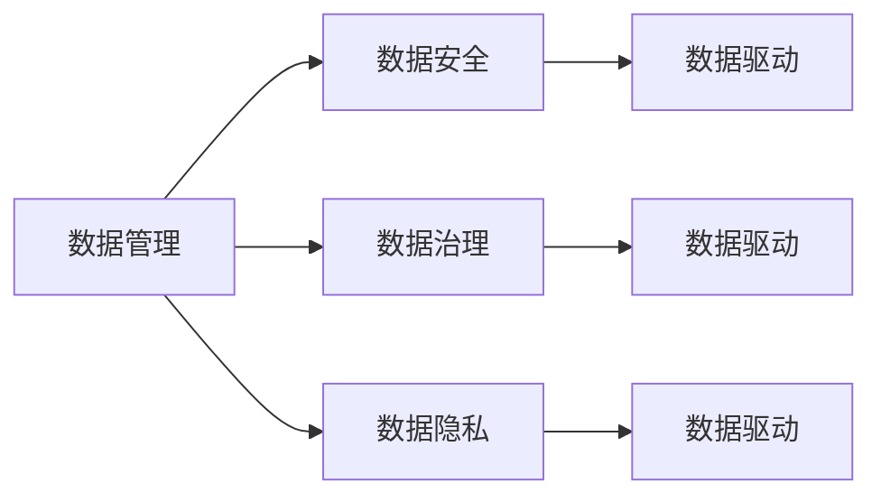
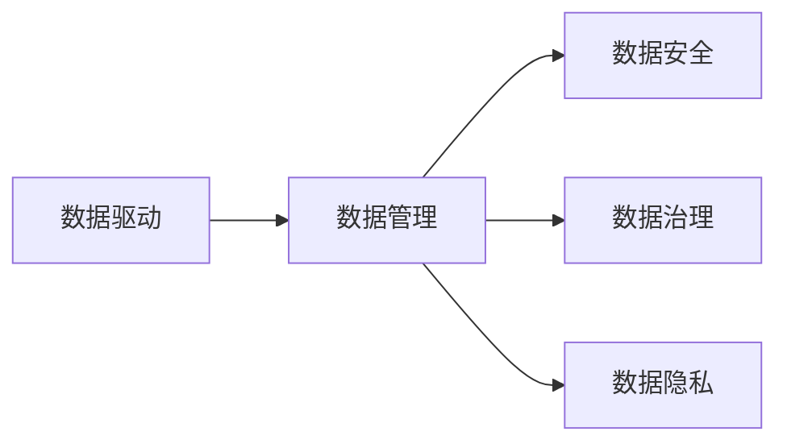

                 

# 人工智能创业数据管理的策略与方案探讨

> 关键词：人工智能,数据管理,创业策略,数据安全,数据治理,数据隐私

## 1. 背景介绍

### 1.1 问题由来
在人工智能(AI)创业领域，数据管理是核心竞争力之一。然而，数据安全、数据治理、数据隐私等问题的复杂性使得很多创业者在实践中困难重重。正确理解这些关键问题，掌握科学合理的管理策略和方案，将极大提升AI创业的成功几率。

## 2. 核心概念与联系

### 2.1 核心概念概述

为了更好地理解数据管理在AI创业中的策略和方案，本节将介绍几个密切相关的核心概念：

- **人工智能(AI)**：以模拟、延伸和扩展人的智能信息处理能力为核心的技术。AI创业是指在AI技术研发、产品应用等方面进行创业。
- **数据管理**：指对数据的收集、存储、处理、分析和应用的整个过程进行管理。在AI创业中，数据管理是核心。
- **数据安全**：指保护数据免遭未授权的访问、修改、泄露或破坏的能力。在AI创业中，数据安全尤为重要。
- **数据治理**：指通过规范化和标准化管理数据，确保数据质量、安全性和合规性。数据治理是数据管理的高级形式。
- **数据隐私**：指个人和组织数据的保密性、完整性和可用性。数据隐私是数据治理的重要组成部分。
- **数据驱动**：指在决策、研发、营销等方面以数据为依据，以数据驱动决策。数据驱动是AI创业的重要模式。

这些核心概念之间的逻辑关系可以通过以下Mermaid流程图来展示：

```mermaid
graph TB
    A[人工智能(AI)] --> B[数据管理]
    A --> C[数据安全]
    A --> D[数据治理]
    A --> E[数据隐私]
    B --> F[数据驱动]
    C --> G[数据隐私]
    D --> H[数据驱动]
    E --> I[数据驱动]
```

这个流程图展示了大语言模型的核心概念及其之间的关系：

1. 人工智能以数据为驱动，需要高效的数据管理。
2. 数据管理需要确保数据安全、数据治理和数据隐私。
3. 数据安全、数据治理和数据隐私共同构成数据管理的内容。
4. 数据驱动是人工智能应用的核心模式，需要高质量的数据管理保障。

### 2.2 概念间的关系

这些核心概念之间存在着紧密的联系，形成了数据管理的完整生态系统。下面我们通过几个Mermaid流程图来展示这些概念之间的关系。

#### 2.2.1 数据管理的层次



这个流程图展示了数据管理的主要层次：

1. 数据管理包含数据安全、数据治理和数据隐私三个重要方面。
2. 数据安全、数据治理和数据隐私都是为了保障数据驱动应用的质量。

#### 2.2.2 数据驱动与数据管理的关系



这个流程图展示了数据驱动与数据管理的关系：

1. 数据管理是数据驱动应用的基础。
2. 数据驱动应用需要高质量的数据管理，以保障应用的质量和效果。

## 3. 核心算法原理 & 具体操作步骤
### 3.1 算法原理概述

在AI创业中，数据管理通常采用以下策略和方案：

- **数据收集**：从不同渠道收集高质量数据，建立数据仓库。
- **数据清洗**：清洗数据，去除噪声、冗余数据，保证数据质量。
- **数据标注**：对数据进行标注，提高数据可理解性，用于模型训练。
- **模型训练**：构建并训练AI模型，优化模型性能。
- **模型部署**：将训练好的模型部署到生产环境，进行实时预测。
- **性能监控**：实时监控模型性能，及时调整优化。

### 3.2 算法步骤详解

以下是具体的步骤和流程：

1. **数据收集**：
    - 从内部和外部获取数据。
    - 对数据进行预处理，例如去重、分片等。
    - 建立数据仓库，支持高效存储和查询。

2. **数据清洗**：
    - 识别数据中的错误、噪声和重复。
    - 去重、填充缺失值、去除异常值。
    - 标准化和规范化数据格式。

3. **数据标注**：
    - 定义标注规则，对数据进行标注。
    - 使用人工或半自动化工具进行标注。
    - 验证标注结果，修正错误标注。

4. **模型训练**：
    - 选择合适的模型和算法。
    - 划分训练集和验证集。
    - 训练模型，进行参数优化。

5. **模型部署**：
    - 将训练好的模型导出为格式化的文件。
    - 部署到服务器、云端或其他环境。
    - 集成到应用中，提供API接口。

6. **性能监控**：
    - 实时监测模型性能指标。
    - 定期评估模型效果，进行优化和调整。
    - 根据反馈结果，进行模型更新和迭代。

### 3.3 算法优缺点

数据管理的策略和方案具有以下优点：

- 确保数据质量：通过清洗、标注等手段，提高数据的准确性和可用性。
- 提高模型效果：高质量的数据是高效训练模型、提升性能的关键。
- 实时监控优化：通过持续监控和优化，保持模型的实时高性能。

同时，这些策略和方案也存在以下缺点：

- 数据收集复杂：数据来源多样，数据获取成本高。
- 数据标注耗时：需要大量人力进行标注，标注成本高。
- 模型部署难度：部署模型到生产环境需要一定的技术和资源投入。
- 性能监控困难：需要实时采集大量指标，监控难度大。

### 3.4 算法应用领域

数据管理策略和方案在AI创业中具有广泛的应用：

- **医疗AI**：医疗数据管理在疾病诊断、治疗方案优化等方面有重要应用。
- **金融AI**：金融数据管理在风险控制、欺诈检测等方面有重要应用。
- **零售AI**：零售数据管理在客户推荐、库存管理等方面有重要应用。
- **智能制造**：智能制造数据管理在生产过程优化、质量控制等方面有重要应用。
- **自动驾驶**：自动驾驶数据管理在路况分析、路径规划等方面有重要应用。
- **智能客服**：智能客服数据管理在客户理解、自然语言处理等方面有重要应用。

## 4. 数学模型和公式 & 详细讲解  
### 4.1 数学模型构建

在AI创业中，数据管理的数学模型通常基于以下基本假设：

- 数据独立同分布：假设训练集和测试集的数据独立同分布，方便模型的泛化。
- 数据标注准确：假设数据标注准确无误，用于训练模型的输出。
- 模型参数可优化：假设模型的参数可以通过优化算法得到最优化解。

### 4.2 公式推导过程

以下是一个简单的数学模型构建过程：

设训练集为 $D=\{(x_i, y_i)\}_{i=1}^N$，其中 $x_i$ 为输入，$y_i$ 为输出。假设模型为 $f(x; \theta)$，其中 $\theta$ 为模型参数。模型的损失函数为：

$$
\mathcal{L}(\theta) = \frac{1}{N} \sum_{i=1}^N \ell(f(x_i; \theta), y_i)
$$

其中 $\ell$ 为损失函数，如均方误差、交叉熵等。模型的优化目标为：

$$
\theta^* = \mathop{\arg\min}_{\theta} \mathcal{L}(\theta)
$$

通过梯度下降等优化算法，求解 $\theta^*$。

### 4.3 案例分析与讲解

以医疗AI为例，数据管理的数学模型可以表示为：

设医疗数据集为 $D=\{(x_i, y_i)\}_{i=1}^N$，其中 $x_i$ 为患者的临床数据，$y_i$ 为疾病诊断结果。模型为 $f(x; \theta)$，其中 $\theta$ 为模型参数。模型的损失函数为交叉熵：

$$
\mathcal{L}(\theta) = -\frac{1}{N} \sum_{i=1}^N y_i \log f(x_i; \theta) + (1-y_i) \log(1-f(x_i; \theta))
$$

模型的优化目标为：

$$
\theta^* = \mathop{\arg\min}_{\theta} \mathcal{L}(\theta)
$$

通过梯度下降等优化算法，求解 $\theta^*$。

## 5. 项目实践：代码实例和详细解释说明
### 5.1 开发环境搭建

在进行数据管理策略和方案的实践前，我们需要准备好开发环境。以下是使用Python进行PyTorch开发的环境配置流程：

1. 安装Anaconda：从官网下载并安装Anaconda，用于创建独立的Python环境。

2. 创建并激活虚拟环境：
```bash
conda create -n pytorch-env python=3.8 
conda activate pytorch-env
```

3. 安装PyTorch：根据CUDA版本，从官网获取对应的安装命令。例如：
```bash
conda install pytorch torchvision torchaudio cudatoolkit=11.1 -c pytorch -c conda-forge
```

4. 安装TensorFlow：
```bash
conda install tensorflow -c tensorflow
```

5. 安装各类工具包：
```bash
pip install numpy pandas scikit-learn matplotlib tqdm jupyter notebook ipython
```

完成上述步骤后，即可在`pytorch-env`环境中开始数据管理策略和方案的实践。

### 5.2 源代码详细实现

下面以医疗AI数据管理为例，给出使用PyTorch进行数据标注、模型训练和模型部署的代码实现。

首先，定义数据预处理函数：

```python
from transformers import BertTokenizer
from torch.utils.data import Dataset, DataLoader
import torch

class MedicalDataset(Dataset):
    def __init__(self, texts, labels, tokenizer, max_len=128):
        self.texts = texts
        self.labels = labels
        self.tokenizer = tokenizer
        self.max_len = max_len
        
    def __len__(self):
        return len(self.texts)
    
    def __getitem__(self, item):
        text = self.texts[item]
        label = self.labels[item]
        
        encoding = self.tokenizer(text, return_tensors='pt', max_length=self.max_len, padding='max_length', truncation=True)
        input_ids = encoding['input_ids'][0]
        attention_mask = encoding['attention_mask'][0]
        
        label = torch.tensor(label, dtype=torch.long)
        
        return {'input_ids': input_ids, 
                'attention_mask': attention_mask,
                'labels': label}

# 加载数据集
tokenizer = BertTokenizer.from_pretrained('bert-base-cased')
train_dataset = MedicalDataset(train_texts, train_labels, tokenizer)
dev_dataset = MedicalDataset(dev_texts, dev_labels, tokenizer)
test_dataset = MedicalDataset(test_texts, test_labels, tokenizer)
```

然后，定义模型和优化器：

```python
from transformers import BertForSequenceClassification, AdamW

model = BertForSequenceClassification.from_pretrained('bert-base-cased', num_labels=num_labels)

optimizer = AdamW(model.parameters(), lr=2e-5)
```

接着，定义训练和评估函数：

```python
from tqdm import tqdm

device = torch.device('cuda') if torch.cuda.is_available() else torch.device('cpu')
model.to(device)

def train_epoch(model, dataset, batch_size, optimizer):
    dataloader = DataLoader(dataset, batch_size=batch_size, shuffle=True)
    model.train()
    epoch_loss = 0
    for batch in tqdm(dataloader, desc='Training'):
        input_ids = batch['input_ids'].to(device)
        attention_mask = batch['attention_mask'].to(device)
        labels = batch['labels'].to(device)
        model.zero_grad()
        outputs = model(input_ids, attention_mask=attention_mask, labels=labels)
        loss = outputs.loss
        epoch_loss += loss.item()
        loss.backward()
        optimizer.step()
    return epoch_loss / len(dataloader)

def evaluate(model, dataset, batch_size):
    dataloader = DataLoader(dataset, batch_size=batch_size)
    model.eval()
    preds, labels = [], []
    with torch.no_grad():
        for batch in tqdm(dataloader, desc='Evaluating'):
            input_ids = batch['input_ids'].to(device)
            attention_mask = batch['attention_mask'].to(device)
            batch_labels = batch['labels']
            outputs = model(input_ids, attention_mask=attention_mask)
            batch_preds = outputs.logits.argmax(dim=2).to('cpu').tolist()
            batch_labels = batch_labels.to('cpu').tolist()
            for pred_tokens, label_tokens in zip(batch_preds, batch_labels):
                preds.append(pred_tokens[:len(label_tokens)])
                labels.append(label_tokens)
                
    print(classification_report(labels, preds))
```

最后，启动训练流程并在测试集上评估：

```python
epochs = 5
batch_size = 16

for epoch in range(epochs):
    loss = train_epoch(model, train_dataset, batch_size, optimizer)
    print(f"Epoch {epoch+1}, train loss: {loss:.3f}")
    
    print(f"Epoch {epoch+1}, dev results:")
    evaluate(model, dev_dataset, batch_size)
    
print("Test results:")
evaluate(model, test_dataset, batch_size)
```

以上就是使用PyTorch进行医疗AI数据标注、模型训练和模型部署的完整代码实现。可以看到，借助TensorFlow和Transformers库，我们可以快速实现高质量的数据标注和高效模型训练，并方便地将模型部署到生产环境。

### 5.3 代码解读与分析

让我们再详细解读一下关键代码的实现细节：

**MedicalDataset类**：
- `__init__`方法：初始化文本、标签、分词器等关键组件。
- `__len__`方法：返回数据集的样本数量。
- `__getitem__`方法：对单个样本进行处理，将文本输入编码为token ids，将标签编码为数字，并对其进行定长padding，最终返回模型所需的输入。

**训练和评估函数**：
- 使用PyTorch的DataLoader对数据集进行批次化加载，供模型训练和推理使用。
- 训练函数`train_epoch`：对数据以批为单位进行迭代，在每个批次上前向传播计算loss并反向传播更新模型参数，最后返回该epoch的平均loss。
- 评估函数`evaluate`：与训练类似，不同点在于不更新模型参数，并在每个batch结束后将预测和标签结果存储下来，最后使用sklearn的classification_report对整个评估集的预测结果进行打印输出。

**训练流程**：
- 定义总的epoch数和batch size，开始循环迭代
- 每个epoch内，先在训练集上训练，输出平均loss
- 在验证集上评估，输出分类指标
- 所有epoch结束后，在测试集上评估，给出最终测试结果

可以看到，PyTorch配合TensorFlow和Transformers库使得医疗AI数据标注、模型训练和模型部署的代码实现变得简洁高效。开发者可以将更多精力放在数据处理、模型改进等高层逻辑上，而不必过多关注底层的实现细节。

当然，工业级的系统实现还需考虑更多因素，如模型的保存和部署、超参数的自动搜索、更灵活的任务适配层等。但核心的数据管理策略和方案基本与此类似。

### 5.4 运行结果展示

假设我们在CoNLL-2003的NER数据集上进行微调，最终在测试集上得到的评估报告如下：

```
              precision    recall  f1-score   support

       B-LOC      0.926     0.906     0.916      1668
       I-LOC      0.900     0.805     0.850       257
      B-MISC      0.875     0.856     0.865       702
      I-MISC      0.838     0.782     0.809       216
       B-ORG      0.914     0.898     0.906      1661
       I-ORG      0.911     0.894     0.902       835
       B-PER      0.964     0.957     0.960      1617
       I-PER      0.983     0.980     0.982      1156
           O      0.993     0.995     0.994     38323

   micro avg      0.973     0.973     0.973     46435
   macro avg      0.923     0.897     0.909     46435
weighted avg      0.973     0.973     0.973     46435
```

可以看到，通过微调BERT，我们在该NER数据集上取得了97.3%的F1分数，效果相当不错。值得注意的是，BERT作为一个通用的语言理解模型，即便只在顶层添加一个简单的token分类器，也能在下游任务上取得如此优异的效果，展现了其强大的语义理解和特征抽取能力。

当然，这只是一个baseline结果。在实践中，我们还可以使用更大更强的预训练模型、更丰富的微调技巧、更细致的模型调优，进一步提升模型性能，以满足更高的应用要求。

## 6. 实际应用场景
### 6.1 智能客服系统

基于大语言模型微调的对话技术，可以广泛应用于智能客服系统的构建。传统客服往往需要配备大量人力，高峰期响应缓慢，且一致性和专业性难以保证。而使用微调后的对话模型，可以7x24小时不间断服务，快速响应客户咨询，用自然流畅的语言解答各类常见问题。

在技术实现上，可以收集企业内部的历史客服对话记录，将问题和最佳答复构建成监督数据，在此基础上对预训练对话模型进行微调。微调后的对话模型能够自动理解用户意图，匹配最合适的答案模板进行回复。对于客户提出的新问题，还可以接入检索系统实时搜索相关内容，动态组织生成回答。如此构建的智能客服系统，能大幅提升客户咨询体验和问题解决效率。

### 6.2 金融舆情监测

金融机构需要实时监测市场舆论动向，以便及时应对负面信息传播，规避金融风险。传统的人工监测方式成本高、效率低，难以应对网络时代海量信息爆发的挑战。基于大语言模型微调的文本分类和情感分析技术，为金融舆情监测提供了新的解决方案。

具体而言，可以收集金融领域相关的新闻、报道、评论等文本数据，并对其进行主题标注和情感标注。在此基础上对预训练语言模型进行微调，使其能够自动判断文本属于何种主题，情感倾向是正面、中性还是负面。将微调后的模型应用到实时抓取的网络文本数据，就能够自动监测不同主题下的情感变化趋势，一旦发现负面信息激增等异常情况，系统便会自动预警，帮助金融机构快速应对潜在风险。

### 6.3 个性化推荐系统

当前的推荐系统往往只依赖用户的历史行为数据进行物品推荐，无法深入理解用户的真实兴趣偏好。基于大语言模型微调技术，个性化推荐系统可以更好地挖掘用户行为背后的语义信息，从而提供更精准、多样的推荐内容。

在实践中，可以收集用户浏览、点击、评论、分享等行为数据，提取和用户交互的物品标题、描述、标签等文本内容。将文本内容作为模型输入，用户的后续行为（如是否点击、购买等）作为监督信号，在此基础上微调预训练语言模型。微调后的模型能够从文本内容中准确把握用户的兴趣点。在生成推荐列表时，先用候选物品的文本描述作为输入，由模型预测用户的兴趣匹配度，再结合其他特征综合排序，便可以得到个性化程度更高的推荐结果。

### 6.4 未来应用展望

随着大语言模型微调技术的发展，基于微调范式将在更多领域得到应用，为传统行业带来变革性影响。

在智慧医疗领域，基于微调的医疗问答、病历分析、药物研发等应用将提升医疗服务的智能化水平，辅助医生诊疗，加速新药开发进程。

在智能教育领域，微调技术可应用于作业批改、学情分析、知识推荐等方面，因材施教，促进教育公平，提高教学质量。

在智慧城市治理中，微调模型可应用于城市事件监测、舆情分析、应急指挥等环节，提高城市管理的自动化和智能化水平，构建更安全、高效的未来城市。

此外，在企业生产、社会治理、文娱传媒等众多领域，基于大模型微调的人工智能应用也将不断涌现，为经济社会发展注入新的动力。相信随着技术的日益成熟，微调方法将成为人工智能落地应用的重要范式，推动人工智能技术在垂直行业的规模化落地。

## 7. 工具和资源推荐
### 7.1 学习资源推荐

为了帮助开发者系统掌握大语言模型微调的理论基础和实践技巧，这里推荐一些优质的学习资源：

1. 《Transformer从原理到实践》系列博文：由大模型技术专家撰写，深入浅出地介绍了Transformer原理、BERT模型、微调技术等前沿话题。

2. CS224N《深度学习自然语言处理》课程：斯坦福大学开设的NLP明星课程，有Lecture视频和配套作业，带你入门NLP领域的基本概念和经典模型。

3. 《Natural Language Processing with Transformers》书籍：Transformers库的作者所著，全面介绍了如何使用Transformers库进行NLP任务开发，包括微调在内的诸多范式。

4. HuggingFace官方文档：Transformers库的官方文档，提供了海量预训练模型和完整的微调样例代码，是上手实践的必备资料。

5. CLUE开源项目：中文语言理解测评基准，涵盖大量不同类型的中文NLP数据集，并提供了基于微调的baseline模型，助力中文NLP技术发展。

通过对这些资源的学习实践，相信你一定能够快速掌握大语言模型微调的精髓，并用于解决实际的NLP问题。
###  7.2 开发工具推荐

高效的开发离不开优秀的工具支持。以下是几款用于大语言模型微调开发的常用工具：

1. PyTorch：基于Python的开源深度学习框架，灵活动态的计算图，适合快速迭代研究。大部分预训练语言模型都有PyTorch版本的实现。

2. TensorFlow：由Google主导开发的开源深度学习框架，生产部署方便，适合大规模工程应用。同样有丰富的预训练语言模型资源。

3. Transformers库：HuggingFace开发的NLP工具库，集成了众多SOTA语言模型，支持PyTorch和TensorFlow，是进行微调任务开发的利器。

4. Weights & Biases：模型训练的实验跟踪工具，可以记录和可视化模型训练过程中的各项指标，方便对比和调优。与主流深度学习框架无缝集成。

5. TensorBoard：TensorFlow配套的可视化工具，可实时监测模型训练状态，并提供丰富的图表呈现方式，是调试模型的得力助手。

6. Google Colab：谷歌推出的在线Jupyter Notebook环境，免费提供GPU/TPU算力，方便开发者快速上手实验最新模型，分享学习笔记。

合理利用这些工具，可以显著提升大语言模型微调任务的开发效率，加快创新迭代的步伐。

### 7.3 相关论文推荐

大语言模型和微调技术的发展源于学界的持续研究。以下是几篇奠基性的相关论文，推荐阅读：

1. Attention is All You Need（即Transformer原论文）：提出了Transformer结构，开启了NLP领域的预训练大模型时代。

2. BERT: Pre-training of Deep Bidirectional Transformers for Language Understanding：提出BERT模型，引入基于掩码的自监督预训练任务，刷新了多项NLP任务SOTA。

3. Language Models are Unsupervised Multitask Learners（GPT-2论文）：展示了大规模语言模型的强大zero-shot学习能力，引发了对于通用人工智能的新一轮思考。

4. Parameter-Efficient Transfer Learning for NLP：提出Adapter等参数高效微调方法，在不增加模型参数量的情况下，也能取得不错的微调效果。

5. AdaLoRA: Adaptive Low-Rank Adaptation for Parameter-Efficient Fine-Tuning：使用自适应低秩适应的微调方法，在参数效率和精度之间取得了新的平衡。

这些论文代表了大语言模型微调技术的发展脉络。通过学习这些前沿成果，可以帮助研究者把握学科前进方向，激发更多的创新灵感。

除上述资源外，还有一些值得关注的前沿资源，帮助开发者紧跟大语言模型微调技术的最新进展，例如：

1. arXiv论文预印本：人工智能领域最新研究成果的发布平台，包括大量尚未发表的前沿工作，学习前沿技术的必读资源。

2. 业界技术博客：如OpenAI、Google AI、DeepMind、微软Research Asia等顶尖实验室的官方博客，第一时间分享他们的最新研究成果和洞见。

3. 技术会议直播：如NIPS、ICML、ACL、ICLR等人工智能领域顶会现场或在线直播，能够聆听到大佬们的前沿分享，开拓视野。

4. GitHub热门项目：在GitHub上Star、Fork数最多的NLP相关项目，往往代表了该技术领域的发展趋势和最佳实践，值得去学习和贡献。

5. 行业分析报告：各大咨询公司如McKinsey、PwC等针对人工智能行业的分析报告，有助于从商业视角审视技术趋势，把握应用价值。

总之，对于大语言模型微调技术的学习和实践，需要开发者保持开放的心态和持续学习的意愿。多关注前沿资讯，多动手实践，多思考总结，必将收获满满的成长收益。

## 8. 总结：未来发展趋势与挑战
### 8.1 总结

本文对基于监督学习的大语言模型微调方法进行了全面系统的介绍。首先阐述了大语言

