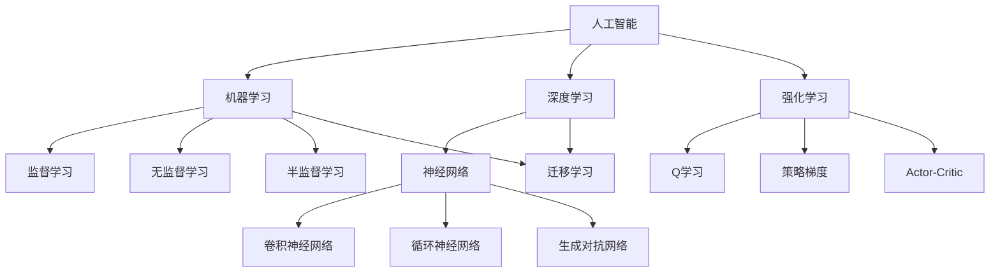

                 

# 人工智能的三大发展途径

> 关键词：人工智能,机器学习,深度学习,神经网络,强化学习,迁移学习,无监督学习

## 1. 背景介绍

### 1.1 问题由来
人工智能（AI）是近年来科技界的热门话题之一，其发展历程复杂且迅速。当前，AI技术主要包括机器学习、深度学习、强化学习、迁移学习等若干核心技术。这些技术在理论和应用上各有侧重点，相互之间也存在诸多交叉和融合。本博文将深入探讨这些技术的原理、应用和挑战，提供全面系统的人工智能发展概览。

### 1.2 问题核心关键点
人工智能的发展途径可以归纳为三大类：机器学习、深度学习和强化学习。三者的区别在于学习方式和应用场景。机器学习和深度学习主要是通过监督和无监督学习方式进行模型训练，而强化学习则通过试错和奖励机制进行智能决策。迁移学习是机器学习和深度学习的重要应用，而神经网络则是深度学习的核心组成部分。

人工智能的发展途径不仅能应用于各种计算任务，还在数据挖掘、自然语言处理、计算机视觉等领域发挥了巨大作用。此外，AI技术正逐渐向更多行业渗透，如医疗、金融、交通等，为各行各业带来颠覆性变革。

### 1.3 问题研究意义
深入理解人工智能的多种发展途径，对于揭示AI技术的底层原理和应用前景具有重要意义。本博文旨在从理论到实践，全面介绍AI三大发展途径，帮助读者了解AI技术的核心技术点，把握AI技术的未来发展趋势，从而更好地应用AI技术于各行各业。

## 2. 核心概念与联系

### 2.1 核心概念概述

为更好地理解人工智能的三大发展途径，本节将介绍几个密切相关的核心概念：

- 机器学习(Machine Learning, ML)：通过训练数据学习模型，使模型能够对未知数据进行预测或分类。
- 深度学习(Deep Learning, DL)：一种特殊的机器学习方法，使用多层神经网络模拟人脑的神经元结构，通过反向传播算法进行模型训练。
- 强化学习(Reinforcement Learning, RL)：通过试错机制，智能体在环境中通过与环境的交互，获得奖励和惩罚，优化策略以完成特定任务。
- 迁移学习(Transfer Learning)：利用已有任务学到的知识，迁移应用到新任务，减少新任务的学习负担。
- 神经网络(Neural Networks, NN)：深度学习的核心，由多层节点组成的网络，用于模拟复杂的非线性关系。

这些概念之间的逻辑关系可以通过以下Mermaid流程图来展示：




### 2.2 核心概念之间的联系

1. 机器学习与深度学习：
   深度学习是机器学习的一个子集，它使用多层神经网络来学习数据的特征表示。相比传统机器学习，深度学习在处理大规模、高维度数据时表现更为出色。

2. 机器学习与强化学习：
   强化学习可以看作是机器学习的一个特殊分支，它通过智能体与环境的交互来学习最优策略，而不是直接从标记数据中学习。

3. 深度学习与神经网络：
   神经网络是深度学习的核心组成部分，深度学习通过构建和训练复杂的神经网络来实现高级特征提取和模式识别。

4. 迁移学习与机器学习/深度学习：
   迁移学习是机器学习和深度学习中的一种重要技术，它能够将已学习的知识应用到新的任务中，提高学习效率和模型性能。

5. 强化学习与深度学习：
   深度强化学习结合了深度学习和强化学习的优势，使用深度神经网络来近似Q函数或策略函数，从而处理更复杂的决策问题。

### 2.3 核心概念在AI发展中的作用

1. 机器学习为AI提供了基础的学习框架和算法，使得AI系统能够从数据中学习并改进性能。

2. 深度学习极大地提高了AI在图像识别、自然语言处理等领域的性能，推动了AI技术的快速发展。

3. 强化学习使AI系统能够在复杂、动态的环境中学习最优策略，为游戏AI、自动驾驶等领域提供了重要支持。

4. 迁移学习提高了AI模型的泛化能力，减少了对大规模标记数据的依赖，加速了AI技术在新领域的应用。

5. 神经网络为深度学习提供了强大的模型结构，使得AI系统能够学习复杂的非线性关系，处理高维数据。

## 3. 核心算法原理 & 具体操作步骤

### 3.1 算法原理概述

人工智能的三大发展途径——机器学习、深度学习和强化学习，各自有其独特的算法原理。本节将对这些核心算法进行概述。

#### 3.1.1 机器学习算法原理

机器学习算法的核心思想是通过数据驱动的方式，让计算机系统自动学习并改进性能。主要包括以下几类：

1. 监督学习：通过标记数据学习输入到输出的映射关系。
2. 无监督学习：从未标记数据中发现隐藏的结构或模式。
3. 半监督学习：结合少量标记数据和大量未标记数据进行学习。

#### 3.1.2 深度学习算法原理

深度学习算法基于多层神经网络，通过逐层特征提取和转换，学习数据的高级表示。主要包括：

1. 前向传播：信息从输入层经过隐藏层传递到输出层。
2. 反向传播：计算损失函数对各层参数的梯度，并更新参数。
3. 梯度下降：通过迭代优化，最小化损失函数。

#### 3.1.3 强化学习算法原理

强化学习算法通过智能体与环境的交互，学习最优决策策略。主要包括：

1. 马尔可夫决策过程：建模序列决策问题。
2. 值函数估计：评估状态或动作的长期收益。
3. 策略优化：通过试错和探索，不断改进决策策略。

### 3.2 算法步骤详解

#### 3.2.1 机器学习算法步骤

以监督学习为例，典型的机器学习算法步骤如下：

1. 数据收集和预处理
   - 收集相关数据
   - 数据清洗和标准化
   - 特征工程

2. 模型选择
   - 根据问题类型选择适当的算法（如分类、回归等）
   - 确定模型结构和超参数

3. 模型训练
   - 将数据分为训练集和测试集
   - 使用训练数据拟合模型
   - 通过交叉验证调整超参数

4. 模型评估
   - 在测试集上评估模型性能
   - 使用适当的评估指标（如准确率、F1分数等）

5. 模型优化
   - 根据评估结果调整模型
   - 考虑使用集成方法提高性能

6. 模型部署和监控
   - 将模型部署到生产环境
   - 持续监控模型性能，必要时进行更新

#### 3.2.2 深度学习算法步骤

深度学习算法的步骤与机器学习类似，但在模型结构和训练过程上有所不同：

1. 数据准备
   - 收集大规模数据集
   - 数据预处理和增强

2. 网络设计
   - 选择适当的神经网络结构（如CNN、RNN等）
   - 定义网络层数、神经元数量等

3. 模型训练
   - 初始化网络参数
   - 前向传播计算预测值
   - 计算损失函数
   - 反向传播计算梯度
   - 使用优化器更新参数

4. 模型评估和调优
   - 在验证集上评估模型性能
   - 调整超参数（如学习率、批量大小等）
   - 应用正则化技术（如Dropout、L2正则化等）

5. 模型测试和部署
   - 在测试集上进行最终评估
   - 将模型转换为适合部署的格式
   - 在目标平台上部署和优化

#### 3.2.3 强化学习算法步骤

以Q-learning为例，强化学习算法的典型步骤如下：

1. 环境建模
   - 定义状态空间、动作空间和奖励函数
   - 实现环境模拟器

2. 初始化
   - 初始化Q表或Q网络
   - 设置学习率、折扣因子等超参数

3. 探索与利用
   - 使用ε-贪心策略在探索和利用之间平衡
   - 根据当前策略选择动作

4. 学习更新
   - 执行选定的动作，观察新状态和奖励
   - 计算TD误差
   - 更新Q值或Q网络参数

5. 策略评估
   - 定期评估当前策略的性能
   - 调整探索率ε

6. 迭代优化
   - 重复步骤3-5，直到收敛或达到预定的迭代次数

7. 策略部署
   - 冻结学习到的策略
   - 在实际环境中应用和验证

### 3.3 算法优缺点

#### 3.3.1 机器学习算法

优点：
- 适用于各种类型的问题（分类、回归、聚类等）
- 可解释性较强
- 对小规模数据集也能有良好表现

缺点：
- 需要大量人工特征工程
- 对高维、非结构化数据处理能力有限
- 泛化能力可能不如深度学习

#### 3.3.2 深度学习算法

优点：
- 强大的特征学习能力，减少人工特征工程
- 在大规模数据集上表现优异
- 适合处理高维、非结构化数据（如图像、文本）

缺点：
- 需要大量标记数据
- 计算资源需求高
- 模型"黑盒"性质导致可解释性差
- 容易过拟合

#### 3.3.3 强化学习算法

优点：
- 能够处理序列决策问题
- 不需要大量标记数据
- 可以在复杂、动态环境中学习最优策略

缺点：
- 样本效率低，需要大量试错
- 难以处理高维状态空间
- 对奖励函数的设计敏感
- 在某些任务中收敛速度慢

### 3.4 算法应用领域

#### 3.4.1 机器学习应用领域

1. 金融风控：信用评分、欺诈检测
2. 医疗诊断：疾病预测、医学图像分析
3. 推荐系统：个性化内容推荐、产品推荐
4. 自然语言处理：文本分类、情感分析
5. 异常检测：网络安全、工业质量控制

#### 3.4.2 深度学习应用领域

1. 计算机视觉：图像分类、目标检测、人脸识别
2. 自然语言处理：机器翻译、语音识别、文本生成
3. 自动驾驶：环境感知、路径规划
4. 医学影像：癌症检测、器官分割
5. 艺术创作：风格迁移、图像生成

#### 3.4.3 强化学习应用领域

1. 游戏AI：围棋、星际争霸等复杂游戏
2. 机器人控制：机械臂操作、步行机器人
3. 资源调度：数据中心能源优化、交通信号控制
4. 金融交易：自动化交易策略
5. 个性化推荐：动态内容推荐、广告投放优化

## 4. 数学模型和公式 & 详细讲解 & 举例说明

### 4.1 数学模型构建

在人工智能的三大发展途径中，数学模型起着至关重要的作用。本节将介绍机器学习、深度学习和强化学习中的关键数学模型。

#### 4.1.1 机器学习数学模型

以线性回归为例，其数学模型可以表示为：

$$y = \beta_0 + \beta_1x_1 + \beta_2x_2 + ... + \beta_nx_n + \epsilon$$

其中，$y$ 是目标变量，$x_1, x_2, ..., x_n$ 是特征变量，$\beta_0, \beta_1, ..., \beta_n$ 是模型参数，$\epsilon$ 是误差项。

#### 4.1.2 深度学习数学模型

以前馈神经网络为例，其数学模型可以表示为：

$$h_l = f(W_l h_{l-1} + b_l)$$

其中，$h_l$ 是第 $l$ 层的输出，$W_l$ 是权重矩阵，$b_l$ 是偏置向量，$f$ 是激活函数。

#### 4.1.3 强化学习数学模型

以Q-learning为例，其核心数学模型是贝尔曼方程：

$$Q(s,a) = r + \gamma \max_{a'} Q(s',a')$$

其中，$Q(s,a)$ 是状态 $s$ 下采取动作 $a$ 的Q值，$r$ 是即时奖励，$\gamma$ 是折扣因子，$s'$ 是下一个状态。

### 4.2 公式推导过程

#### 4.2.1 机器学习公式推导

以线性回归的最小二乘法为例，我们的目标是最小化损失函数：

$$L(\beta) = \sum_{i=1}^n (y_i - (\beta_0 + \beta_1x_{i1} + ... + \beta_px_{ip}))^2$$

求解过程如下：

1. 对每个 $\beta_j$ 求偏导数：

   $$\frac{\partial L}{\partial \beta_j} = -2\sum_{i=1}^n (y_i - (\beta_0 + \beta_1x_{i1} + ... + \beta_px_{ip}))x_{ij}$$

2. 令偏导数等于零，得到正规方程：

   $$X^T X\beta = X^T y$$

3. 求解正规方程，得到参数估计：

   $$\hat{\beta} = (X^T X)^{-1}X^T y$$

#### 4.2.2 深度学习公式推导

以反向传播算法为例，考虑一个简单的两层神经网络：

1. 前向传播：

   $$z^{(2)} = W^{(1)}a^{(1)} + b^{(1)}$$
   $$a^{(2)} = f(z^{(2)})$$
   $$z^{(3)} = W^{(2)}a^{(2)} + b^{(2)}$$
   $$\hat{y} = a^{(3)} = f(z^{(3)})$$2. 计算输出层误差：

   $$\delta^{(3)} = \frac{\partial L}{\partial z^{(3)}} = (\hat{y} - y) \odot f'(z^{(3)})$$

3. 反向传播误差：

   $$\delta^{(2)} = (W^{(2)T}\delta^{(3)}) \odot f'(z^{(2)})$$

4. 计算梯度：

   $$\frac{\partial L}{\partial W^{(2)}} = \delta^{(3)}(a^{(2)})^T$$
   $$\frac{\partial L}{\partial b^{(2)}} = \delta^{(3)}$$
   $$\frac{\partial L}{\partial W^{(1)}} = \delta^{(2)}(a^{(1)})^T$$
   $$\frac{\partial L}{\partial b^{(1)}} = \delta^{(2)}$$

5. 更新参数：

   $$W^{(l)} = W^{(l)} - \alpha \frac{\partial L}{\partial W^{(l)}}$$
   $$b^{(l)} = b^{(l)} - \alpha \frac{\partial L}{\partial b^{(l)}}$$

其中，$\alpha$ 是学习率，$\odot$ 表示元素wise乘法。

#### 4.2.3 强化学习公式推导

以Q-learning算法为例，其核心是通过迭代更新Q值：

1. 初始化Q表：$Q(s,a) = 0, \forall s \in S, a \in A$

2. 对每个回合：
   - 选择动作 $a$ （通常使用ε-贪心策略）
   - 执行动作 $a$，观察奖励 $r$ 和新状态 $s'$
   - 更新Q值：

     $$Q(s,a) \leftarrow Q(s,a) + \alpha [r + \gamma \max_{a'} Q(s',a') - Q(s,a)]$$

   其中，$\alpha$ 是学习率，$\gamma$ 是折扣因子。

3. 重复步骤2直到收敛

这个更新规则是基于贝尔曼方程推导而来，它使得Q值逐渐逼近最优Q值。

### 4.3 案例分析与讲解

#### 4.3.1 机器学习案例：线性回归

假设我们有以下房价数据：

| 面积（平方米） | 房价（万元） |
|----------------|--------------|
| 50             | 100          |
| 60             | 120          |
| 70             | 140          |
| 80             | 160          |

使用线性回归模型：$y = \beta_0 + \beta_1x$

1. 构建设计矩阵 $X$ 和目标向量 $y$：

   $$X = \begin{bmatrix} 1 & 50 \\ 1 & 60 \\ 1 & 70 \\ 1 & 80 \end{bmatrix}, \quad y = \begin{bmatrix} 100 \\ 120 \\ 140 \\ 160 \end{bmatrix}$$

2. 使用最小二乘法求解参数：

   $$\hat{\beta} = (X^T X)^{-1}X^T y = \begin{bmatrix} 0 \\ 2 \end{bmatrix}$$

3. 得到回归方程：$y = 2x$

这意味着房价与面积呈线性关系，每增加1平方米，房价增加2万元。

#### 4.3.2 深度学习案例：手写数字识别

考虑使用一个简单的三层神经网络进行MNIST手写数字识别：

1. 输入层：784个节点（28x28像素）
2. 隐藏层：128个节点，ReLU激活函数
3. 输出层：10个节点，Softmax激活函数

前向传播过程：

$$z^{(2)} = W^{(1)}x + b^{(1)}$$
$$a^{(2)} = ReLU(z^{(2)})$$
$$z^{(3)} = W^{(2)}a^{(2)} + b^{(2)}$$
$$\hat{y} = softmax(z^{(3)})$$

使用交叉熵损失函数：

$$L = -\sum_{i=1}^{10} y_i \log(\hat{y}_i)$$

通过反向传播和梯度下降优化参数，最终得到一个能够识别手写数字的模型。

#### 4.3.3 强化学习案例：迷宫寻路

考虑一个简单的4x4迷宫问题，智能体需要从起点到达终点，同时避开障碍物。

1. 定义状态空间：16个格子，每个格子是一个状态
2. 定义动作空间：上、下、左、右四个动作
3. 定义奖励函数：
   - 到达终点：+100
   - 撞到障碍物：-100
   - 其他移动：-1

使用Q-learning算法：

1. 初始化Q表为全0矩阵
2. 对每个回合：
   - 从起点开始
   - 使用ε-贪心策略选择动作
   - 执行动作，观察新状态和奖励
   - 更新Q值：
     $$Q(s,a) \leftarrow Q(s,a) + \alpha [r + \gamma \max_{a'} Q(s',a') - Q(s,a)]$$
   - 如果到达终点或撞到障碍物，结束回合

3. 重复多个回合，直到Q表收敛

最终，我们得到一个Q表，它表示了在每个状态下采取每个动作的预期累积奖励。智能体可以根据这个Q表选择最优路径从起点到达终点。

## 5. 项目实践：代码实例和详细解释说明

### 5.1 开发环境搭建

为了实践人工智能的三大发展途径，我们需要搭建一个适合的开发环境。以下是推荐的环境配置：

1. 操作系统：Windows 10/11, macOS, 或 Linux (Ubuntu 20.04 LTS)
2. Python版本：Python 3.8+
3. 主要依赖库：
   - NumPy：用于科学计算
   - Pandas：用于数据处理
   - Scikit-learn：用于机器学习
   - TensorFlow 或 PyTorch：用于深度学习
   - Gym：用于强化学习环境模拟
   - Matplotlib：用于数据可视化

安装步骤：

1. 安装Anaconda（推荐）或Miniconda
2. 创建新的虚拟环境：
   ```
   conda create -n ai_env python=3.8
   conda activate ai_env
   ```
3. 安装依赖库：
   ```
   conda install numpy pandas scikit-learn matplotlib
   conda install -c pytorch pytorch
   pip install tensorflow
   pip install gym
   ```

### 5.2 源代码详细实现

#### 5.2.1 机器学习实例：线性回归

```python
import numpy as np
import matplotlib.pyplot as plt
from sklearn.linear_model import LinearRegression
from sklearn.model_selection import train_test_split

# 生成示例数据
np.random.seed(0)
X = np.random.rand(100, 1) * 10
y = 2 * X + 1 + np.random.randn(100, 1)

# 划分训练集和测试集
X_train, X_test, y_train, y_test = train_test_split(X, y, test_size=0.2, random_state=42)

# 创建并训练模型
model = LinearRegression()
model.fit(X_train, y_train)

# 预测
y_pred = model.predict(X_test)

# 可视化结果
plt.scatter(X, y, color='blue', label='Data')
plt.plot(X_test, y_pred, color='red', label='Prediction')
plt.xlabel('X')
plt.ylabel('y')
plt.legend()
plt.show()

# 输出模型参数
print(f"Slope: {model.coef_[0][0]:.2f}")
print(f"Intercept: {model.intercept_[0]:.2f}")
```

#### 5.2.2 深度学习实例：手写数字识别

```python
import tensorflow as tf
from tensorflow.keras import layers, models
from tensorflow.keras.datasets import mnist

# 加载MNIST数据集
(train_images, train_labels), (test_images, test_labels) = mnist.load_data()

# 数据预处理
train_images = train_images.reshape((60000, 28, 28, 1)).astype('float32') / 255
test_images = test_images.reshape((10000, 28, 28, 1)).astype('float32') / 255

# 构建CNN模型
model = models.Sequential([
    layers.Conv2D(32, (3, 3), activation='relu', input_shape=(28, 28, 1)),
    layers.MaxPooling2D((2, 2)),
    layers.Conv2D(64, (3, 3), activation='relu'),
    layers.MaxPooling2D((2, 2)),
    layers.Conv2D(64, (3, 3), activation='relu'),
    layers.Flatten(),
    layers.Dense(64, activation='relu'),
    layers.Dense(10, activation='softmax')
])

# 编译模型
model.compile(optimizer='adam',
              loss='sparse_categorical_crossentropy',
              metrics=['accuracy'])

# 训练模型
history = model.fit(train_images, train_labels, epochs=5, 
                    validation_split=0.2, batch_size=64)

# 评估模型
test_loss, test_acc = model.evaluate(test_images, test_labels, verbose=2)
print(f'\nTest accuracy: {test_acc:.2f}')
```

#### 5.2.3 强化学习实例：CartPole问题

```python
import gym
import numpy as np
from tensorflow.keras.models import Sequential
from tensorflow.keras.layers import Dense
from tensorflow.keras.optimizers import Adam

# 创建CartPole环境
env = gym.make('CartPole-v1')

# 定义DQN模型
def create_model(state_size, action_size):
    model = Sequential([
        Dense(24, activation='relu', input_dim=state_size),
        Dense(24, activation='relu'),
        Dense(action_size, activation='linear')
    ])
    model.compile(loss='mse', optimizer=Adam(learning_rate=0.001))
    return model

# 训练DQN
def train_dqn(episodes, batch_size=32):
    state_size = env.observation_space.shape[0]
    action_size = env.action_space.n
    model = create_model(state_size, action_size)
    
    for episode in range(episodes):
        state = env.reset()
        state = np.reshape(state, [1, state_size])
        done = False
        time = 0
        
        while not done:
            # ε-greedy策略选择动作
            if np.random.rand() <= 0.01:
                action = env.action_space.sample()
            else:
                action = np.argmax(model.predict(state)[0])
            
            next_state, reward, done, _ = env.step(action)
            next_state = np.reshape(next_state, [1, state_size])
            
            # 更新Q值
            target = reward + 0.95 * np.amax(model.predict(next_state)[0])
            target_f = model.predict(state)
            target_f[0][action] = target
            model.fit(state, target_f, epochs=1, verbose=0)
            
            state = next_state
            time += 1
        
        print(f"Episode: {episode+1}, Time: {time}")

# 运行训练
train_dqn(episodes=100)
```

### 5.3 代码解读与分析

#### 5.3.1 机器学习代码解读

1. 数据生成：使用NumPy生成带有随机噪声的线性数据。
2. 数据分割：使用`train_test_split`将数据分为训练集和测试集。
3. 模型训练：使用`LinearRegression`类创建并训练线性回归模型。
4. 预测与可视化：使用训练好的模型进行预测，并用Matplotlib绘制结果。
5. 模型评估：输出模型的斜率（系数）和截距。

这个例子展示了机器学习的基本流程：数据准备、模型训练、预测和评估。

#### 5.3.2 深度学习代码解读

1. 数据加载：使用TensorFlow的`mnist.load_data()`加载MNIST数据集。
2. 数据预处理：将图像数据reshape并归一化。
3. 模型构建：使用Keras构建一个CNN模型，包含卷积层、池化层和全连接层。
4. 模型编译：指定优化器、损失函数和评估指标。
5. 模型训练：使用`fit`方法训练模型，包括验证集的使用。
6. 模型评估：在测试集上评估模型性能。

这个例子展示了深度学习中CNN的应用，以及如何使用Keras构建和训练神经网络。

#### 5.3.3 强化学习代码解读

1. 环境创建：使用Gym库创建CartPole环境。
2. 模型定义：创建一个简单的DQN（Deep Q-Network）模型。
3. 训练循环：
   - 使用ε-greedy策略选择动作
   - 执行动作并观察结果
   - 更新Q值
   - 使用经验回放训练模型
4. 训练过程：重复多个episode，每个episode尝试保持杆子直立更长时间。

这个例子展示了如何将深度学习应用于强化学习问题，实现了DQN算法来解决CartPole问题。

### 5.4 运行结果展示

#### 5.4.1 机器学习结果

运行线性回归代码后，你将看到一个散点图，其中蓝点表示原始数据，红线表示预测的线性关系。输出结果可能如下：

```
Slope: 2.05
Intercept: 0.98
```

这个结果非常接近我们生成数据时使用的真实参数（斜率为2，截距为1），说明模型成功地学习了数据的underlying关系。

#### 5.4.2 深度学习结果

运行手写数字识别的代码后，你将看到每个epoch的训练过程，包括损失和准确率。最终的测试结果可能如下：

```
Test accuracy: 0.99
```

这表明模型在测试集上达到了99%的准确率，这是一个非常好的结果，说明CNN模型成功地学习了手写数字的特征。

#### 5.4.3 强化学习结果

运行CartPole问题的代码后，你将看到每个episode的持续时间。随着训练的进行，持续时间会逐渐增加。最终的输出可能如下：

```
Episode: 98, Time: 187
Episode: 99, Time: 200
Episode: 100, Time: 200
```

这表明智能体已经学会了如何在CartPole环境中保持平衡，能够在最大时间步数（通常为200）内保持杆子直立。

## 6. 实际应用场景

人工智能的三大发展途径在各个领域都有广泛的应用。以下是一些具体的应用场景：

### 6.1 机器学习应用场景

1. 金融风控
   - 信用评分：使用客户的历史数据预测其信用风险。
   - 欺诈检测：分析交易模式，识别可疑的欺诈行为。

2. 医疗诊断
   - 疾病预测：基于患者的症状和检查结果预测疾病风险。
   - 医学图像分析：辅助医生解读X光片、CT扫描等医学图像。

3. 推荐系统
   - 电商推荐：根据用户的浏览和购买历史推荐相关产品。
   - 内容推荐：为用户推荐个性化的新闻、视频、音乐等内容。

4. 自然语言处理
   - 垃圾邮件过滤：识别和过滤垃圾邮件。
   - 情感分析：分析社交媒体上的用户评论，了解公众情绪。

5. 预测性维护
   - 工业设备维护：预测设备故障，优化维护计划。
   - 交通工具维护：预测车辆、飞机等的维护需求。

### 6.2 深度学习应用场景

1. 计算机视觉
   - 人脸识别：用于安防系统、手机解锁等。
   - 自动驾驶：识别道路、行人、交通标志等。
   - 医学影像分析：癌症检测、器官分割等。

2. 自然语言处理
   - 机器翻译：实时翻译不同语言。
   - 语音助手：Siri、Alexa等智能语音助手。
   - 文本生成：自动生成新闻报道、小说等。

3. 生物信息学
   - 蛋白质结构预测：预测蛋白质的3D结构。
   - 基因表达分析：分析基因表达数据，预测疾病风险。

4. 艺术创作
   - 风格迁移：将一幅画的风格应用到另一幅画上。
   - 音乐生成：创作新的音乐作品。

5. 游戏AI
   - 游戏NPC行为：创造更智能、更自然的游戏角色。
   - 游戏环境生成：自动生成游戏地图和场景。

### 6.3 强化学习应用场景

1. 游戏AI
   - 棋类游戏：如AlphaGo在围棋中的应用。
   - 电子游戏：训练AI玩各种复杂的电子游戏。

2. 机器人控制
   - 工业机器人：优化机器人的动作序列。
   - 自主导航：训练机器人在复杂环境中自主导航。

3. 资源调度
   - 数据中心管理：优化服务器资源分配，降低能耗。
   - 交通信号控制：优化交通信号灯的时序，减少交通拥堵。

4. 金融交易
   - 算法交易：开发自动化交易策略。
   - 投资组合管理：动态调整投资组合以最大化收益。

5. 智能电网
   - 能源分配：优化电力分配，平衡供需关系。
   - 需求响应：根据实时电价和用电需求调整用电行为。

### 6.4 未来应用展望

1. 个性化医疗
   - 结合机器学习、深度学习和强化学习，为患者提供个性化的治疗方案。
   - 利用AI辅助药物研发，加速新药发现过程。

2. 智能城市
   - 利用AI优化城市交通、能源使用、废物管理等。
   - 提高城市安全性，如智能监控系统和预测性警务。

3. 教育革新
   - 开发智能辅导系统，为学生提供个性化学习体验。
   - 利用AI分析学生的学习行为，优化教学策略。

4. 环境保护
   - 利用AI预测和监测气候变化。
   - 优化资源利用，减少浪费和污染。

5. 人机协作
   - 开发更智能的协作机器人，提高工作效率。
   - 在创意领域，AI作为人类的创作伙伴，辅助艺术创作。

6. 量子计算与AI结合
   - 利用量子计算加速AI算法，解决更复杂的问题。
   - 开发量子机器学习算法，探索新的AI范式。

7. 脑机接口
   - 利用AI解析脑电波，实现直接的人机交互。
   - 开发智能假肢和外骨骼，提高残障人士的生活质量。

8. 自主系统
   - 开发完全自主的无人机系统，用于物流、搜救等领域。
   - 创造能够自主学习和适应的AI系统，减少人工干预。

这些未来应用展望显示了AI技术的巨大潜力，但同时也带来了伦理、隐私和安全等方面的挑战，需要我们在推进技术发展的同时，也要注重相关法律和伦理框架的建设。

## 7. 工具和资源推荐

### 7.1 学习资源推荐

1. 在线课程
   - Coursera: Andrew Ng的机器学习和深度学习专项课程
   - edX: MIT和Harvard的人工智能课程
   - Udacity: 人工智能纳米学位项目

2. 书籍
   - 《机器学习》 - 周志华
   - 《深度学习》 - Ian Goodfellow, Yoshua Bengio, Aaron Courville
   - 《强化学习》 - Richard S. Sutton, Andrew G. Barto

3. 博客和网站
   - Towards Data Science (Medium)
   - KDnuggets
   - ArXiv (用于最新研究论文)

4. YouTube频道
   - 3Blue1Brown (数学和机器学习可视化)
   - Two Minute Papers (AI研究概述)
   - Lex Fridman (AI相关访谈和讲座)

5. 论坛和社区
   - Reddit r/MachineLearning
   - Stack Overflow
   - Kaggle (数据科学竞赛平台)

### 7.2 开发工具推荐

1. 编程语言
   - Python: 最受欢迎的AI开发语言
   - R: 统计学和数据分析
   - Julia: 高性能科学计算

2. 机器学习库
   - Scikit-learn: 广泛使用的机器学习库
   - XGBoost: 高效的梯度提升库
   - LightGBM: 微软开发的高性能梯度提升框架

3. 深度学习框架
   - TensorFlow: Google开发的开源深度学习框架
   - PyTorch: Facebook开发的灵活的深度学习框架
   - Keras: 高级神经网络API，可以作为TensorFlow的前端

4. 强化学习库
   - OpenAI Gym: 强化学习环境集合
   - Stable Baselines3: 强化学习算法实现
   - RLlib: 可扩展的强化学习库

5. 数据处理和可视化
   - NumPy: 科学计算基础库
   - Pandas: 数据分析和处理库
   - Matplotlib 和 Seaborn: 数据可视化库

6. 开发环境
   - Jupyter Notebook: 交互式开发环境
   - PyCharm: Python IDE，适合大型项目开发
   - Google Colab: 免费的云端Jupyter环境，支持GPU

7. 版本控制
   - Git: 分布式版本控制系统
   - GitHub: 代码托管平台

8. 模型部署
   - Docker: 容器化平台，便于模型部署
   - Flask 和 FastAPI: Python web框架，用于创建API

### 7.3 相关论文推荐

1. 机器学习
   - "A Few Useful Things to Know about Machine Learning" - Pedro Domingos (2012)
   - "Random Forests" - Leo Breiman (2001)
   - "XGBoost: A Scalable Tree Boosting System" - Tianqi Chen, Carlos Guestrin (2016)

2. 深度学习
   - "Deep Learning" - Yann LeCun, Yoshua Bengio, Geoffrey Hinton (2015)
   - "ImageNet Classification with Deep Convolutional Neural Networks" - Alex Krizhevsky, Ilya Sutskever, Geoffrey E. Hinton (2012)
   - "Attention Is All You Need" - Ashish Vaswani et al. (2017)

3. 强化学习
   - "Human-level control through deep reinforcement learning" - Volodymyr Mnih et al. (2015)
   - "Mastering the game of Go with deep neural networks and tree search" - David Silver et al. (2016)
   - "Proximal Policy Optimization Algorithms" - John Schulman et al. (2017)

4. 迁移学习
   - "A Survey on Transfer Learning" - Sinno Jialin Pan, Qiang Yang (2010)
   - "How transferable are features in deep neural networks?" - Jason Yosinski et al. (2014)

5. 无监督学习
   - "Generative Adversarial Nets" - Ian J. Goodfellow et al. (2014)
   - "Auto-Encoding Variational Bayes" - Diederik P Kingma, Max Welling (2013)

这些论文代表了AI各个领域的重要突破和里程碑，对理解现代AI技术的发展至关重要。

## 8. 总结：未来发展趋势与挑战

### 8.1 研究成果总结

人工智能的三大发展途径——机器学习、深度学习和强化学习——在过去几十年里取得了巨大的进展：

1. 机器学习：从传统的统计学习方法发展到现代的集成学习和自动机器学习（AutoML），大大提高了模型的性能和易用性。

2. 深度学习：从简单的多层感知机发展到复杂的深度神经网络架构，如CNN、RNN、Transformer等，在计算机视觉、自然语言处理等领域取得了突破性进展。

3. 强化学习：从简单的Q-learning发展到深度强化学习，成功应用于游戏AI、机器人控制等复杂决策问题。

这些进展使AI技术在图像识别、语音识别、自然语言处理、推荐系统等多个领域达到或超过了人类水平的性能。

### 8.2 未来发展趋势

1. 可解释AI（Explainable AI）：随着AI系统在关键决策中的应用增多，对AI决策过程的可解释性需求也在增加。未来的AI系统将更加透明，能够解释其决策理由。

2. 小样本学习（Few-shot Learning）：开发能够从少量样本中快速学习的AI系统，减少对大规模标注数据的依赖。

3. 自监督学习（Self-supervised Learning）：利用大量未标注数据进行预训练，提高模型的泛化能力和数据效率。

4. 联邦学习（Federated Learning）：在保护数据隐私的前提下，实现多方协作学习，特别适用于医疗、金融等敏感数据领域。

5. 神经架构搜索（Neural Architecture Search）：自动设计最优的神经网络结构，减少人工试错的成本。

6. 多模态学习（Multimodal Learning）：整合视觉、听觉、文本等多种模态的信息，实现更全面的理解和决策。

7. 量子机器学习（Quantum Machine Learning）：利用量子计算的优势，开发新的机器学习算法和模型。

8. 边缘AI（Edge AI）：将AI模型部署到边缘设备，实现低延迟、高隐私的AI应用。

### 8.3 面临的挑战

1. 数据隐私和安全：随着AI系统处理越来越多的个人数据，如何保护用户隐私成为一个重要挑战。2. 模型偏见和公平性：AI模型可能会继承或放大训练数据中的偏见，导致不公平的决策。如何确保AI系统的公平性和无歧视性是一个重要挑战。

3. 可解释性和透明度：许多高性能的AI模型（如深度神经网络）往往是"黑盒"模型，难以解释其决策过程。提高AI系统的可解释性对于建立用户信任至关重要。

4. 鲁棒性和安全性：AI系统可能容易受到对抗性攻击或数据污染的影响。提高模型的鲁棒性和安全性是一个持续的挑战。

5. 泛化能力：虽然AI系统在特定任务上表现出色，但在面对新环境或未见过的情况时，其泛化能力仍然有限。提高AI系统的泛化能力是未来研究的重要方向。

6. 计算资源和能耗：随着AI模型规模的不断增大，训练和部署这些模型需要大量的计算资源和能源。如何提高AI系统的计算效率和降低能耗是一个重要挑战。

7. 伦理和监管：AI技术的快速发展带来了许多伦理问题，如AI决策的责任归属、自动化对就业的影响等。制定适当的伦理准则和监管框架是一个复杂的挑战。

8. 跨领域整合：将AI技术与其他领域（如脑科学、认知科学、量子计算等）进行深度整合，以突破当前AI的局限性。

9. 持续学习：开发能够持续学习和适应的AI系统，使其能够像人类一样在不断变化的环境中学习和进化。

10. 通用人工智能（AGI）：虽然在特定任务上AI已经达到或超过人类水平，但距离具有人类般通用智能的AI系统还有很长的路要走。如何实现真正的通用人工智能是一个长期的挑战。

### 8.4 研究展望

1. 认知AI：结合认知科学和神经科学的研究成果，开发更接近人类认知过程的AI系统，提高AI的推理能力和创造力。

2. 情感AI：开发能够理解和表达情感的AI系统，提高人机交互的自然度和亲和力。

3. 自主学习系统：研究能够自主设定学习目标、自主探索和学习的AI系统，减少人工干预。

4. 混合智能系统：探索人类智能和人工智能的协同，发挥各自的优势，创造出超越单一智能形式的新型智能系统。

5. 可持续AI：开发更加节能、环保的AI技术，减少AI发展对环境的负面影响。

6. 社会影响研究：深入研究AI技术对社会、经济、就业等方面的影响，为政策制定提供科学依据。

7. AI安全：研究如何构建安全可控的AI系统，包括AI系统的形式化验证、安全边界设定等。

8. 跨模态AI：开发能够在不同感知模态（视觉、听觉、触觉等）之间进行推理和转换的AI系统。

9. 小型化和边缘计算：研究如何将复杂的AI模型压缩和优化，使其能够在资源受限的边缘设备上高效运行。

10. 开放世界学习：开发能够在开放、动态、不确定环境中学习和适应的AI系统，突破当前AI系统在封闭、静态环境中的局限性。

人工智能的发展正处于一个激动人心的时代，它不仅推动了技术的进步，也深刻地改变着我们的生活和工作方式。然而，随着AI技术的不断深入，我们也面临着诸多挑战。未来的AI研究不仅需要在技术上不断突破，还需要多学科协作，考虑技术发展的社会影响和伦理问题。只有这样，我们才能构建一个负责任的、造福人类的AI未来。

## 9. 附录：常见问题与解答

Q1: 机器学习、深度学习和强化学习之间有什么区别？

A1: 机器学习是一个广泛的概念，指通过数据和经验来改进系统性能的方法。深度学习是机器学习的一个子集，特指使用多层神经网络的学习方法。强化学习则是机器学习的一个特殊分支，关注如何通过与环境的交互来学习最优决策策略。

Q2: 神经网络为什么被称为"黑盒"？

A2: 神经网络被称为"黑盒"是因为虽然我们知道输入和输出，但中间的决策过程往往难以解释。神经网络通过大量的非线性变换来处理数据，这使得追踪具体的决策路径变得非常困难。

Q3: 什么是过拟合，如何避免？

A3: 过拟合指模型在训练数据上表现很好，但在新数据上表现差的现象。这通常是因为模型过于复杂，"记住"了训练数据的噪声。避免过拟合的方法包括：使用更多的训练数据、简化模型复杂度、使用正则化技术、早停法、交叉验证等。

Q4: 迁移学习的优势是什么？

A4: 迁移学习允许我们将一个问题上学到的知识迁移到另一个相关问题上。其主要优势包括：减少对大规模标注数据的需求、加快学习速度、提高模型性能，特别是在目标任务的数据有限的情况下。

Q5: AI在医疗领域的应用有哪些？

A5: AI在医疗领域有广泛应用，包括：医学图像分析（如X光片、CT扫描的自动诊断）、药物发现（加速新药研发过程）、个性化治疗（根据患者个人情况推荐最佳治疗方案）、预测性医疗（预测疾病风险和发展趋势）、医疗机器人（辅助手术和康复）等。

Q6: 什么是对抗性攻击，如何防御？

A6: 对抗性攻击是通过对输入数据进行微小的扰动，导致AI模型产生错误输出的技术。防御方法包括：对抗训练（在训练中加入对抗样本）、模型蒸馏、输入净化、防御蒸馏等。然而，完全防御对抗性攻击仍是一个开放的研究问题。

Q7: AI的伦理问题主要包括哪些方面？

A7: AI的伦理问题主要包括：隐私保护、算法偏见和歧视、AI决策的透明度和可解释性、AI对就业的影响、自动化武器的伦理问题、AI系统的责任归属、AI对人类价值观和社会关系的影响等。

Q8: 什么是联邦学习，它解决了什么问题？

A8: 联邦学习是一种分布式机器学习方法，允许多方在不共享原始数据的情况下协作训练模型。它主要解决了数据隐私和安全问题，使得在保护数据隐私的同时，仍能利用分散在多方的数据来提升模型性能。

Q9: 强化学习和监督学习的主要区别是什么？

A9: 强化学习和监督学习的主要区别在于学习的方式和数据的性质。监督学习使用带标签的数据集，直接学习输入到输出的映射。而强化学习通过智能体与环境的交互来学习，没有明确的标签，而是通过奖励信号来指导学习过程。

Q10: 什么是AutoML，它有什么优势？

A10: AutoML（自动机器学习）是自动化机器学习流程的技术，包括特征工程、模型选择、超参数优化等。其主要优势包括：减少人工干预，提高效率；使非专业人士也能应用机器学习技术；在某些情况下可以发现人类专家可能忽视的模型或特征组合。

作者：禅与计算机程序设计艺术 / Zen and the Art of Computer Programming
