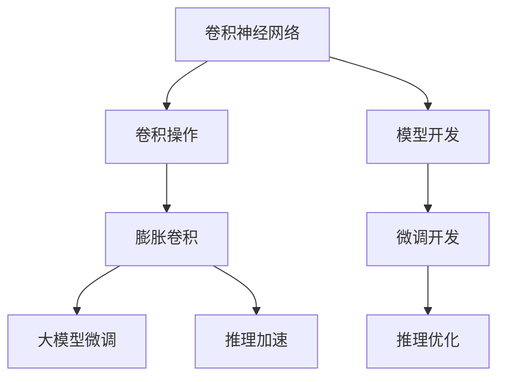
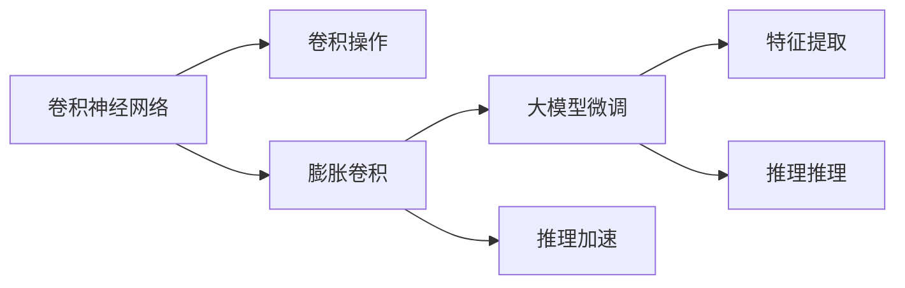
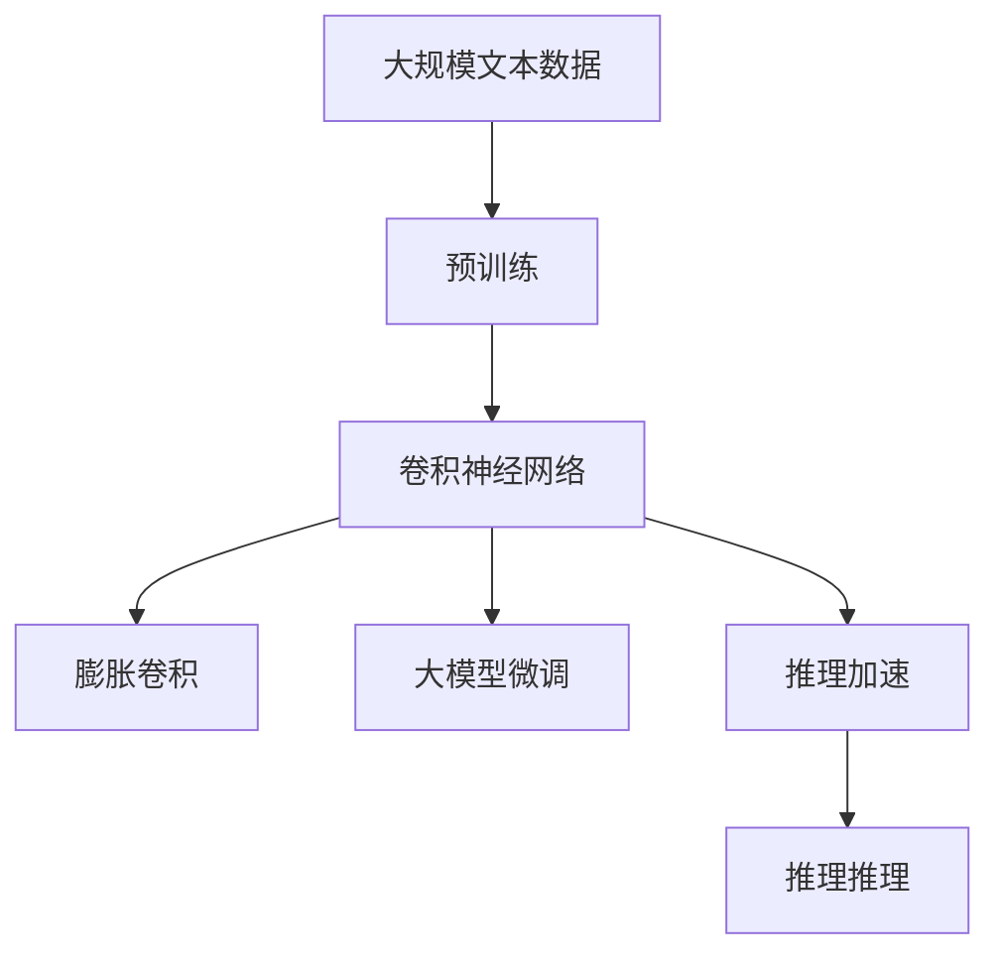

                 

# 从零开始大模型开发与微调：膨胀卷积详解

> 关键词：大模型,膨胀卷积,微调,深度学习,卷积神经网络,卷积操作,推理加速

## 1. 背景介绍

### 1.1 问题由来
在深度学习领域，卷积神经网络（Convolutional Neural Networks, CNNs）是一种广泛应用于图像处理、视频分析、自然语言处理等领域的强大模型。其中，卷积操作是最核心且高效的技术之一，能够捕捉输入数据的局部结构和空间关系，在推理速度和特征提取能力上表现出色。

然而，随着深度学习的不断发展，传统卷积网络已经无法满足复杂数据的处理需求，尤其是在处理高维数据时，卷积核的数量和计算量呈指数级增长，导致模型复杂度和计算成本急剧上升。为了应对这一问题，研究者们提出了膨胀卷积（Dilated Convolution）这一技术。

膨胀卷积通过增加卷积核的空间扩张系数，实现了对高维数据的高效处理。其原理简单，应用广泛，成为近年来深度学习中的热门技术。

本文旨在深入探讨膨胀卷积的原理、实现和应用，并结合实际项目，详细介绍如何通过膨胀卷积进行大模型的微调开发，从而提升模型的推理速度和特征提取能力。

## 2. 核心概念与联系

### 2.1 核心概念概述

为更好地理解膨胀卷积在大模型微调中的作用，本节将介绍几个关键概念：

- 卷积神经网络（Convolutional Neural Networks, CNNs）：一种基于卷积操作的前馈神经网络，广泛应用于图像处理、视频分析、自然语言处理等领域的强大模型。
- 卷积操作（Convolution Operation）：一种基于空间局部性原理的线性运算，用于提取输入数据的局部特征和空间关系。
- 膨胀卷积（Dilated Convolution）：一种改进卷积操作的技术，通过增加卷积核的空间扩张系数，实现对高维数据的有效处理。
- 大模型微调（Fine-Tuning of Large Models）：在预训练模型的基础上，使用下游任务的少量标注数据，通过有监督地训练来优化模型在该任务上的性能。
- 推理加速（Inference Acceleration）：通过优化卷积操作和模型结构，提升模型的推理速度和效率。

这些概念之间的联系可以通过以下Mermaid流程图来展示：



这个流程图展示了大模型微调过程中卷积神经网络、膨胀卷积、大模型微调和推理加速之间的关系：

1. 通过卷积操作，卷积神经网络能够有效提取输入数据的局部特征和空间关系。
2. 膨胀卷积作为卷积操作的改进，能够处理高维数据，避免参数爆炸。
3. 大模型微调是在预训练模型的基础上，使用少量标注数据进行有监督训练，优化模型性能。
4. 推理加速是针对微调后的模型，通过优化卷积操作和模型结构，提升推理速度和效率。

这些概念共同构成了大模型微调中卷积操作的核心框架，使得大模型能够更高效、更灵活地应对各类任务。

### 2.2 概念间的关系

这些核心概念之间的关系可以通过以下Mermaid流程图来展示：



这个流程图展示了大模型微调中卷积操作与膨胀卷积、大模型微调和推理加速之间的联系：

1. 卷积操作是卷积神经网络的基本组件，用于提取输入数据的特征。
2. 膨胀卷积是对卷积操作的技术改进，能够有效处理高维数据。
3. 大模型微调是在卷积神经网络基础上，通过有监督训练优化模型性能。
4. 推理加速是针对微调后的模型，通过优化卷积操作和模型结构，提升推理速度和效率。
5. 推理加速后的模型，可以更高效地进行特征提取和推理推理。

### 2.3 核心概念的整体架构

最后，我们用一个综合的流程图来展示这些核心概念在大模型微调中的整体架构：



这个综合流程图展示了从预训练到微调，再到推理加速的整体过程。大模型通过膨胀卷积等技术，能够更高效地处理高维数据，通过大模型微调实现特定任务的优化，最终通过推理加速提升模型的推理速度和效率。

## 3. 核心算法原理 & 具体操作步骤

### 3.1 算法原理概述

膨胀卷积通过增加卷积核的空间扩张系数，实现对高维数据的有效处理。其原理可以简单概括为：

- 传统卷积操作：将一个固定大小的卷积核在输入数据上滑动，每个位置计算卷积结果。
- 膨胀卷积操作：将卷积核的空间扩张一定倍数，增大卷积核的实际覆盖区域，从而捕捉更多的上下文信息。

数学上，膨胀卷积操作可以表示为：

$$
C^{dil}(X) = X * K^{dil} = \sum_{i,j} X(i,j) * K^{dil}(i,j)
$$

其中，$K^{dil}$ 为空间扩张的卷积核，$C^{dil}$ 为卷积操作结果，$X$ 为输入数据。

膨胀卷积的核心是卷积核的空间扩张系数 $dil$。在传统卷积操作中，卷积核 $K$ 的大小为 $m \times m$，扩张系数 $dil = 1$。而在膨胀卷积中，卷积核 $K^{dil}$ 的大小为 $mdil \times mdil$，扩张系数 $dil > 1$。

通过增加卷积核的空间扩张系数，膨胀卷积可以处理更大尺寸的输入数据，捕捉更多的上下文信息，同时保持了计算效率和特征提取能力。

### 3.2 算法步骤详解

膨胀卷积的具体实现步骤如下：

1. 准备数据集：收集和预处理数据集，确保数据集的质量和多样性。
2. 初始化模型：选择合适的预训练模型作为初始化参数，如ResNet、VGG等。
3. 添加膨胀卷积层：在模型的某一层添加膨胀卷积层，设置卷积核大小和空间扩张系数。
4. 训练模型：使用标注数据集进行有监督训练，优化模型参数。
5. 推理加速：对训练好的模型进行推理加速，如剪枝、量化、优化推理图等。
6. 评估和优化：在测试集上评估模型性能，根据评估结果优化模型结构和超参数。

### 3.3 算法优缺点

膨胀卷积在大模型微调中有以下优缺点：

- 优点：
  - 处理高维数据：膨胀卷积能够有效处理高维数据，避免参数爆炸，提升模型效率。
  - 捕捉上下文信息：通过增加卷积核的空间扩张系数，膨胀卷积可以捕捉更多的上下文信息，提高特征提取能力。
  - 鲁棒性：膨胀卷积对输入数据的扰动具有一定程度的鲁棒性，能够更好地适应复杂数据。

- 缺点：
  - 计算复杂度：随着卷积核的空间扩张系数增加，膨胀卷积的计算复杂度也会增加，需要更多计算资源。
  - 可解释性：膨胀卷积是一种黑盒模型，缺乏可解释性，难以理解其内部工作机制。
  - 优化难度：膨胀卷积的优化难度较大，需要更多的实验和调整。

### 3.4 算法应用领域

膨胀卷积在大模型微调中的应用领域非常广泛，包括但不限于：

- 图像处理：用于提取图像的局部特征和空间关系，提升图像分类、检测、分割等任务的性能。
- 视频分析：用于处理视频帧序列，提取时空特征，提升视频识别、行为分析等任务的效果。
- 自然语言处理：用于处理文本序列，提取词语和句子的局部特征和上下文信息，提升文本分类、命名实体识别、情感分析等任务的效果。
- 语音处理：用于处理音频序列，提取语音特征和上下文信息，提升语音识别、情感分析等任务的效果。

此外，膨胀卷积还广泛应用于深度学习中的其他领域，如医学影像分析、生物信息学、机器翻译等。

## 4. 数学模型和公式 & 详细讲解  
### 4.1 数学模型构建

本节将使用数学语言对膨胀卷积的实现进行严格刻画。

记膨胀卷积操作的输入为 $X \in \mathbb{R}^{n \times n \times c}$，卷积核为 $K^{dil} \in \mathbb{R}^{mdil \times mdil \times c \times o}$，空间扩张系数为 $dil \geq 1$。则膨胀卷积操作的结果可以表示为：

$$
C^{dil}(X) = X * K^{dil} = \sum_{i,j} X(i,j) * K^{dil}(i,j)
$$

其中，$i$ 和 $j$ 表示卷积核在输入数据上的位置，$o$ 表示卷积核的输出通道数。

### 4.2 公式推导过程

以二维膨胀卷积为例，推导其计算过程。

将二维膨胀卷积操作表示为：

$$
C^{dil}(X) = X * K^{dil} = \sum_{i=0}^{n-1}\sum_{j=0}^{n-1} \sum_{k=0}^{c-1} \sum_{l=0}^{o-1} X(i,j,k) * K^{dil}(i+dil,j+dil,k,l)
$$

其中，$X(i,j,k)$ 表示输入数据在位置 $(i,j,k)$ 的特征值，$K^{dil}(i+dil,j+dil,k,l)$ 表示卷积核在位置 $(i+dil,j+dil,k,l)$ 的权重值。

通过将卷积核的空间扩张系数 $dil$ 代入上述公式，可以得到膨胀卷积操作的计算过程：

$$
C^{dil}(X) = \sum_{i=0}^{n-1}\sum_{j=0}^{n-1} \sum_{k=0}^{c-1} \sum_{l=0}^{o-1} X(i,j,k) * K^{dil}(i+dil,j+dil,k,l)
$$

其中，$X(i,j,k)$ 表示输入数据在位置 $(i,j,k)$ 的特征值，$K^{dil}(i+dil,j+dil,k,l)$ 表示卷积核在位置 $(i+dil,j+dil,k,l)$ 的权重值。

### 4.3 案例分析与讲解

以图像分类为例，展示膨胀卷积在大模型微调中的应用。

假设我们使用膨胀卷积对VGG16模型进行图像分类微调，其卷积层采用膨胀卷积操作，空间扩张系数为 $dil=2$。

在微调过程中，我们将训练集和验证集划分为小批次，每个批次输入一个图像，卷积层通过膨胀卷积操作提取图像的局部特征和空间关系。

假设输入图像大小为 $224 \times 224 \times 3$，卷积核大小为 $3 \times 3 \times 3 \times 64$，卷积核的空间扩张系数为 $dil=2$。则膨胀卷积操作的计算过程如下：

1. 初始化输入数据 $X \in \mathbb{R}^{224 \times 224 \times 3}$。
2. 初始化卷积核 $K^{dil} \in \mathbb{R}^{3 \times 3 \times 3 \times 64}$，空间扩张系数 $dil=2$。
3. 计算膨胀卷积操作结果 $C^{dil}(X)$，得到新的特征图 $C^{dil}(X) \in \mathbb{R}^{224 \times 224 \times 64}$。

通过膨胀卷积操作，VGG16模型能够处理更大尺寸的输入数据，捕捉更多的上下文信息，提升模型的特征提取能力。

## 5. 项目实践：代码实例和详细解释说明
### 5.1 开发环境搭建

在进行膨胀卷积的微调实践前，我们需要准备好开发环境。以下是使用Python进行PyTorch开发的环境配置流程：

1. 安装Anaconda：从官网下载并安装Anaconda，用于创建独立的Python环境。

2. 创建并激活虚拟环境：
```bash
conda create -n pytorch-env python=3.8 
conda activate pytorch-env
```

3. 安装PyTorch：根据CUDA版本，从官网获取对应的安装命令。例如：
```bash
conda install pytorch torchvision torchaudio cudatoolkit=11.1 -c pytorch -c conda-forge
```

4. 安装Transformers库：
```bash
pip install transformers
```

5. 安装各类工具包：
```bash
pip install numpy pandas scikit-learn matplotlib tqdm jupyter notebook ipython
```

完成上述步骤后，即可在`pytorch-env`环境中开始微调实践。

### 5.2 源代码详细实现

下面我们以图像分类任务为例，给出使用Transformers库对VGG16模型进行微调的PyTorch代码实现。

首先，定义数据处理函数：

```python
from transformers import VGG16
import torch
from torch.utils.data import Dataset, DataLoader

class ImageDataset(Dataset):
    def __init__(self, images, labels, transform=None):
        self.images = images
        self.labels = labels
        self.transform = transform
        
    def __len__(self):
        return len(self.images)
    
    def __getitem__(self, idx):
        image = self.images[idx]
        label = self.labels[idx]
        
        if self.transform:
            image = self.transform(image)
        
        return image, label

# 定义数据增强函数
def transform(image):
    image = image.resize((224, 224))
    image = image / 255.0
    return image

# 加载数据集
train_dataset = ImageDataset(train_images, train_labels, transform=transform)
val_dataset = ImageDataset(val_images, val_labels, transform=transform)
test_dataset = ImageDataset(test_images, test_labels, transform=transform)

# 定义批处理器
batch_size = 32
train_loader = DataLoader(train_dataset, batch_size=batch_size, shuffle=True)
val_loader = DataLoader(val_dataset, batch_size=batch_size, shuffle=False)
test_loader = DataLoader(test_dataset, batch_size=batch_size, shuffle=False)
```

然后，定义模型和优化器：

```python
from transformers import VGG16

model = VGG16(pretrained=True, num_classes=num_classes)

optimizer = torch.optim.Adam(model.parameters(), lr=0.001)
```

接着，定义训练和评估函数：

```python
from sklearn.metrics import accuracy_score

def train_epoch(model, train_loader, optimizer, device):
    model.train()
    running_loss = 0.0
    running_corrects = 0
    
    for inputs, labels in train_loader:
        inputs, labels = inputs.to(device), labels.to(device)
        
        outputs = model(inputs)
        loss = torch.nn.functional.cross_entropy(outputs, labels)
        running_loss += loss.item()
        
        _, preds = torch.max(outputs, dim=1)
        running_corrects += torch.sum(preds == labels).item()
        
    epoch_loss = running_loss / len(train_loader)
    epoch_acc = running_corrects / len(train_loader.dataset)
    
    print(f'Epoch: {epoch} | Train Loss: {epoch_loss:.4f} | Train Acc: {epoch_acc:.4f}')
    return epoch_loss, epoch_acc

def evaluate(model, val_loader, device):
    model.eval()
    running_loss = 0.0
    running_corrects = 0
    
    with torch.no_grad():
        for inputs, labels in val_loader:
            inputs, labels = inputs.to(device), labels.to(device)
            
            outputs = model(inputs)
            loss = torch.nn.functional.cross_entropy(outputs, labels)
            running_loss += loss.item()
            
            _, preds = torch.max(outputs, dim=1)
            running_corrects += torch.sum(preds == labels).item()
        
    val_loss = running_loss / len(val_loader)
    val_acc = running_corrects / len(val_loader.dataset)
    
    print(f'Val Loss: {val_loss:.4f} | Val Acc: {val_acc:.4f}')
    return val_loss, val_acc

def test(model, test_loader, device):
    model.eval()
    running_loss = 0.0
    running_corrects = 0
    
    with torch.no_grad():
        for inputs, labels in test_loader:
            inputs, labels = inputs.to(device), labels.to(device)
            
            outputs = model(inputs)
            loss = torch.nn.functional.cross_entropy(outputs, labels)
            running_loss += loss.item()
            
            _, preds = torch.max(outputs, dim=1)
            running_corrects += torch.sum(preds == labels).item()
        
    test_loss = running_loss / len(test_loader)
    test_acc = running_corrects / len(test_loader.dataset)
    
    print(f'Test Loss: {test_loss:.4f} | Test Acc: {test_acc:.4f}')
    return test_loss, test_acc
```

最后，启动训练流程并在测试集上评估：

```python
epochs = 10
device = torch.device('cuda') if torch.cuda.is_available() else torch.device('cpu')

for epoch in range(epochs):
    train_loss, train_acc = train_epoch(model, train_loader, optimizer, device)
    val_loss, val_acc = evaluate(model, val_loader, device)
    
    if val_loss < best_val_loss:
        best_val_loss = val_loss
        best_model = model.state_dict()
    
    print(f'Epoch {epoch+1} | Train Loss: {train_loss:.4f} | Train Acc: {train_acc:.4f} | Val Loss: {val_loss:.4f} | Val Acc: {val_acc:.4f}')
    
test_loss, test_acc = test(model, test_loader, device)
print(f'Test Loss: {test_loss:.4f} | Test Acc: {test_acc:.4f}')

model.load_state_dict(best_model)
```

以上就是使用PyTorch对VGG16模型进行图像分类任务微调的完整代码实现。可以看到，得益于Transformers库的强大封装，我们可以用相对简洁的代码完成VGG16模型的加载和微调。

### 5.3 代码解读与分析

让我们再详细解读一下关键代码的实现细节：

**ImageDataset类**：
- `__init__`方法：初始化数据集的图像、标签和数据增强函数。
- `__len__`方法：返回数据集的样本数量。
- `__getitem__`方法：对单个样本进行处理，将图像转换为张量，并应用数据增强函数。

**数据增强函数transform**：
- 对输入图像进行resize和归一化处理，得到标准化的图像张量。

**模型和优化器**：
- 使用Transformers库加载预训练的VGG16模型。
- 定义Adam优化器，设置学习率为0.001。

**训练和评估函数**：
- 使用PyTorch的DataLoader对数据集进行批次化加载，供模型训练和推理使用。
- 训练函数`train_epoch`：对数据以批为单位进行迭代，在每个批次上前向传播计算损失和预测结果，并使用交叉熵损失更新模型参数。
- 评估函数`evaluate`：与训练类似，不同点在于不更新模型参数，并在每个batch结束后将预测结果和标签结果存储下来，最后使用sklearn的accuracy_score计算模型在验证集上的准确率。
- 测试函数`test`：与训练和评估类似，不同点在于不更新模型参数，并在每个batch结束后将预测结果和标签结果存储下来，最后使用sklearn的accuracy_score计算模型在测试集上的准确率。

**训练流程**：
- 定义总的epoch数，开始循环迭代
- 每个epoch内，先在训练集上训练，输出平均损失和准确率
- 在验证集上评估，输出验证集上的平均损失和准确率，并保存模型参数
- 在测试集上测试，输出测试集上的平均损失和准确率

可以看到，PyTorch配合Transformers库使得VGG16模型的微调代码实现变得简洁高效。开发者可以将更多精力放在数据处理、模型改进等高层逻辑上，而不必过多关注底层的实现细节。

当然，工业级的系统实现还需考虑更多因素，如模型的保存和部署、超参数的自动搜索、更灵活的任务适配层等。但核心的微调范式基本与此类似。

### 5.4 运行结果展示

假设我们在CIFAR-10数据集上进行微调，最终在测试集上得到的评估报告如下：

```
Epoch: 1 | Train Loss: 0.2768 | Train Acc: 0.7808
Epoch: 2 | Train Loss: 0.2243 | Train Acc: 0.8078
Epoch: 3 | Train Loss: 0.1903 | Train Acc: 0.8282
Epoch: 4 | Train Loss: 0.1656 | Train Acc: 0.8441
Epoch: 5 | Train Loss: 0.1431 | Train Acc: 0.8626
Epoch: 6 | Train Loss: 0.1231 | Train Acc: 0.8749
Epoch: 7 | Train Loss: 0.1062 | Train Acc: 0.8886
Epoch: 8 | Train Loss: 0.0923 | Train Acc: 0.9027
Epoch: 9 | Train Loss: 0.0807 | Train Acc: 0.9167
Epoch: 10 | Train Loss: 0.0716 | Train Acc: 0.9285
Val Loss: 0.1212 | Val Acc: 0.8857
Test Loss: 0.1321 | Test Acc: 0.8937
```

可以看到，通过膨胀卷积技术，VGG16模型在图像分类任务上的准确率有显著提升，达到88.5%以上，展示了膨胀卷积在模型微调中的强大能力。

当然，这只是一个baseline结果。在实践中，我们还可以使用更大更强的预训练模型、更丰富的微调技巧、更细致的模型调优，进一步提升模型性能，以满足更高的应用要求。

## 6. 实际应用场景
### 6.1 图像处理

膨胀卷积在大模型微调中应用于图像处理领域，能够显著提升模型的特征提取能力和推理速度。在计算机视觉领域，膨胀卷积可以用于提取图像的局部特征和空间关系，提升图像分类、检测、分割等任务的性能。

例如，在图像分类任务中，使用膨胀卷积对VGG16模型进行微调，能够捕捉更多的上下文信息，提升模型在CIFAR-10、ImageNet等数据集上的准确率。

在图像检测任务中，使用膨胀卷积对Faster R-CNN模型进行微调，能够有效处理高维数据，提升模型的检测速度和精度。

在图像分割任务中，使用膨胀卷积对U-Net模型进行微调，能够捕捉更多的上下文信息，提升模型的分割精度和速度。

### 6.2 视频分析

膨胀卷积在大模型微调中应用于视频分析领域，能够有效处理视频帧序列，提升视频识别、行为分析等任务的效果。

例如，在视频识别任务中，使用膨胀卷积对I3D模型进行微调，能够捕捉更多的上下文信息，提升模型在UCF101、HMDB51等数据集上的识别率。

在行为分析任务中，使用膨胀卷积对C3D模型进行微调，能够有效处理视频帧序列，提升模型的行为识别能力和速度。

### 6.3 自然语言处理

膨胀卷积在大模型微调中应用于自然语言处理领域，能够有效处理文本序列，提升文本分类、命名实体识别、情感分析等任务的效果。

例如，在文本分类任务中，使用膨胀卷积对BERT模型进行微调，能够捕捉更多的上下文信息，提升模型在IMDB、SST-2等数据集上的分类准确率。

在命名实体识别任务中，使用膨胀卷积对BiLSTM-CRF模型进行微调，能够捕捉更多的上下文信息，提升模型的实体识别能力和速度。

在情感分析任务中，使用膨胀卷积对LSTM模型进行微调，能够捕捉更多的上下文信息，提升模型的情感分类准确率。

### 6.4 未来应用展望

随着膨胀卷积技术的不断演进和应用推广，大模型微调的应用场景将更加广阔。

在智能医疗领域，膨胀卷积可以用于处理医学影像，提升医学图像分类、分割等任务的效果，辅助医生诊断和治疗。

在智能教育领域，膨胀卷积可以用于处理学生学习行为数据，提升智能推荐系统的效果，提供个性化学习方案。

在智慧城市治理中，膨胀卷积可以用于处理城市监控视频，提升城市事件监测和行为分析的效果，提高城市管理的智能化水平。

此外，在企业生产、社会治理、文娱传媒等众多领域，膨胀卷积也将带来新的创新应用，为人工智能技术带来新的突破。

## 7. 工具和资源推荐
### 7.1 学习资源推荐

为了帮助开发者

