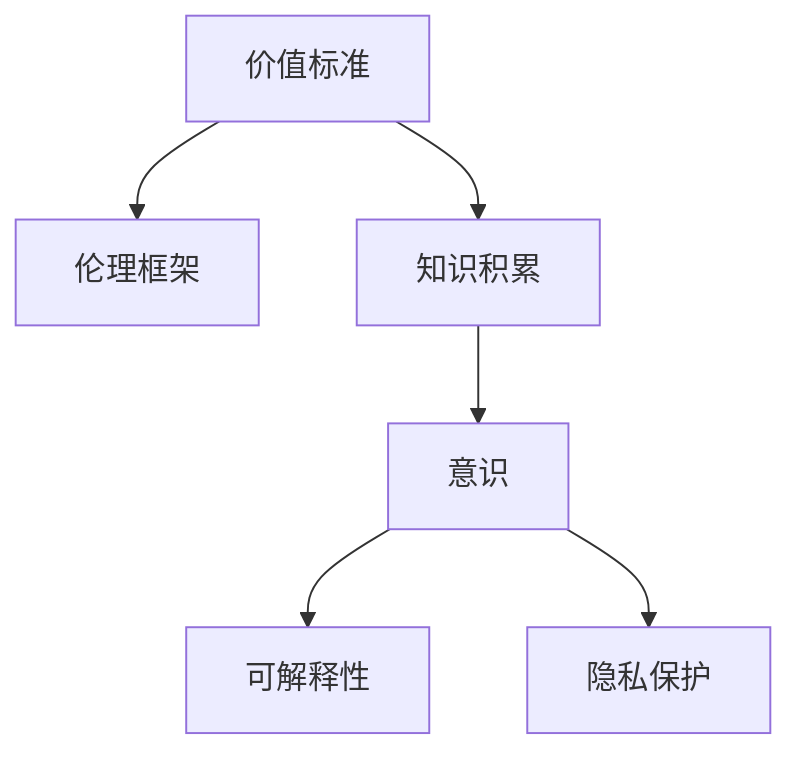
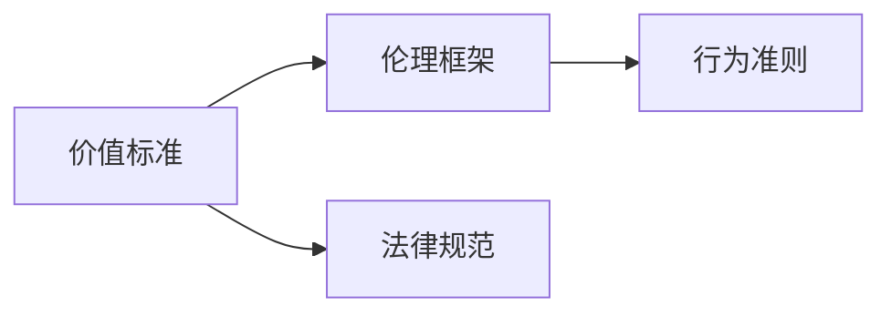
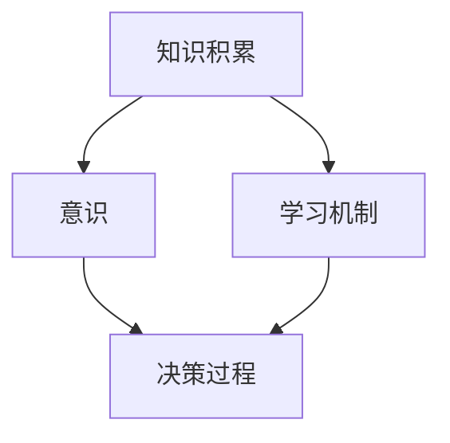
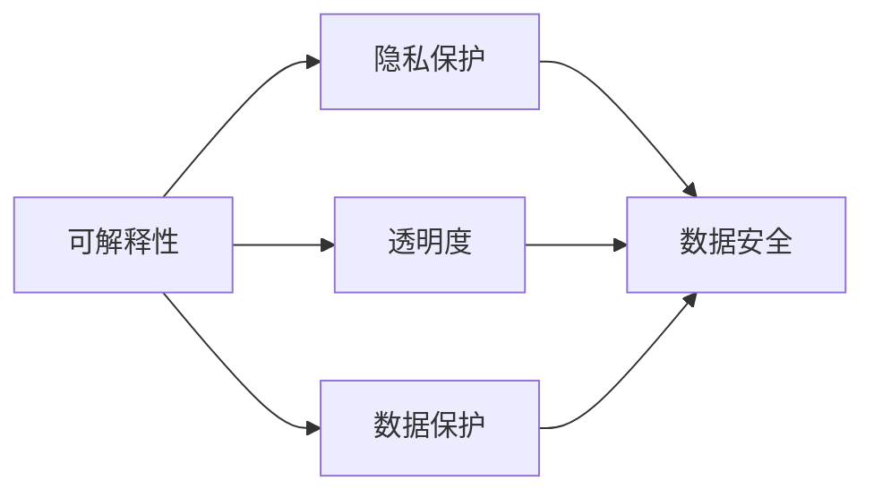
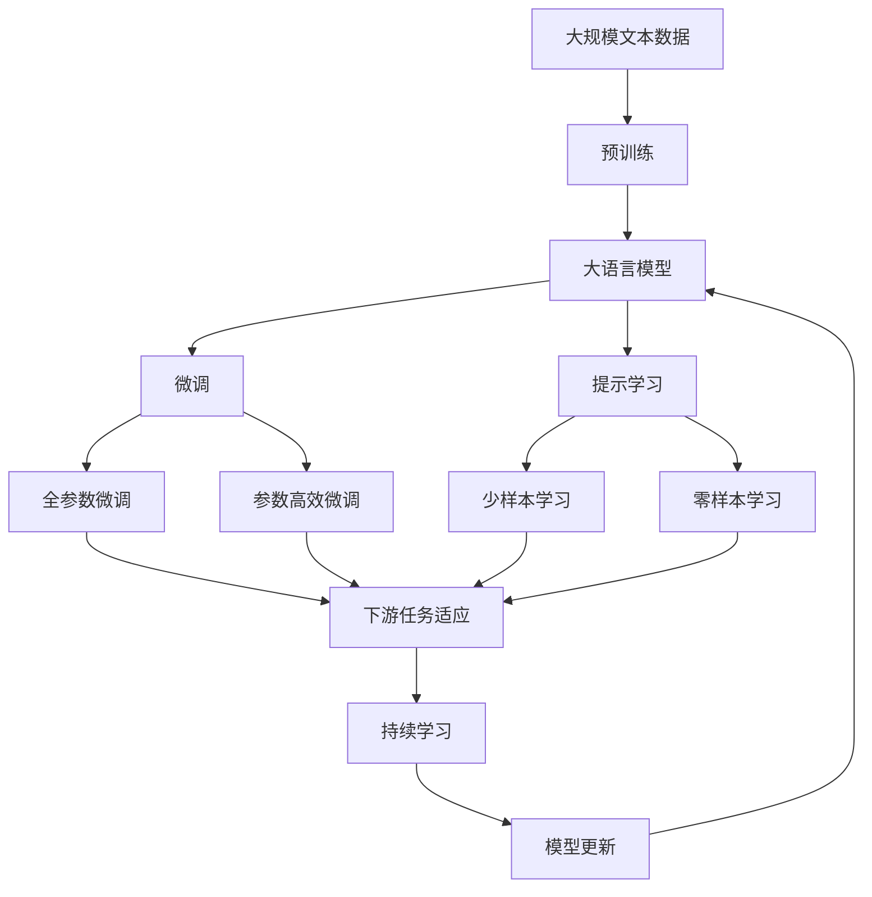

                 

## 1. 背景介绍

### 1.1 问题由来
随着人工智能技术的飞速发展，其对人类的影响愈发深远。尤其是深度学习和大规模语言模型的崛起，使计算机具备了强大的自我学习能力和处理自然语言的能力。但是，这种自我学习和自我生成的过程往往缺乏明确的价值观引导，导致在实际应用中出现了一些伦理道德问题，如偏见、误导性输出、隐私侵犯等。

### 1.2 问题核心关键点
在人工智能系统的开发和应用过程中，如何合理设定价值标准和积累知识，以确保系统输出符合人类的价值观和伦理道德，成为了当前研究的热点问题。特别是，如何在意识中融入价值标准和知识积累，让计算机系统更加智能、可靠、安全，是推动人工智能发展的关键。

### 1.3 问题研究意义
研究价值标准与知识积累在意识中的作用，对于提升人工智能系统的道德伦理水平、增强其智能性、保障数据安全和用户隐私，具有重要意义：

1. **增强系统智能**：通过在意识中融入价值标准和知识积累，可以使人工智能系统更加理解人类的情感、文化和价值观，从而在处理复杂任务时展现出更高的智能水平。
2. **保障伦理道德**：合理设定价值标准，可以避免人工智能系统输出有害信息，确保其行为符合人类的伦理道德标准。
3. **提升数据安全**：通过知识积累，系统可以更好地识别和处理敏感数据，从而减少数据泄露的风险。
4. **改善用户体验**：融入价值标准，可以让人工智能系统更加人性化，提高用户的满意度和信任度。

## 2. 核心概念与联系

### 2.1 核心概念概述

为更好地理解价值标准与知识积累在意识中的作用，本节将介绍几个密切相关的核心概念：

- **价值标准**：定义了人工智能系统应该遵守的行为准则和道德规范，确保其输出行为符合人类的价值观。
- **知识积累**：指通过学习、训练等方式，将大量的信息、经验和知识存储在系统中，用于指导系统行为。
- **意识**：人工智能系统具备的自我意识和自主决策能力，使其能够理解外部环境和内部状态，做出合理决策。
- **伦理框架**：一套用于指导人工智能系统行为准则的道德规范和法律法规体系。
- **可解释性**：人工智能系统行为的可解释性，即能够清晰地解释其决策过程和结果，增强系统的透明度和可信度。
- **隐私保护**：人工智能系统在处理敏感数据时，保护用户隐私和个人信息安全的能力。

这些核心概念之间的逻辑关系可以通过以下Mermaid流程图来展示：



这个流程图展示了这个生态系统的核心概念及其之间的关系：

1. 价值标准在伦理框架的指导下，定义了系统的行为准则。
2. 知识积累为系统的行为提供了指导，增强了其智能性和决策能力。
3. 意识使系统具备自我理解和自主决策能力，能够灵活运用知识积累和价值标准。
4. 可解释性提高了系统的透明度，增强了用户的信任感。
5. 隐私保护确保了数据的安全，维护了用户的权益。

这些概念共同构成了人工智能系统中的伦理道德框架，确保其行为符合人类的价值观，同时提供了解决复杂问题的能力。

### 2.2 概念间的关系

这些核心概念之间存在着紧密的联系，形成了人工智能系统的伦理道德生态系统。下面我通过几个Mermaid流程图来展示这些概念之间的关系。

#### 2.2.1 价值标准的伦理框架


这个流程图展示了价值标准和伦理框架之间的关系。伦理框架通过法律规范定义了价值标准，并具体化为系统的行为准则。

#### 2.2.2 知识积累与意识的关系


这个流程图展示了知识积累和意识之间的关系。知识积累通过学习机制使系统具备了意识，从而能够灵活运用知识进行决策。

#### 2.2.3 可解释性与隐私保护


这个流程图展示了可解释性和隐私保护之间的关系。可解释性通过透明度增强了系统的可信度，而隐私保护则通过数据保护措施确保了系统的安全性。

### 2.3 核心概念的整体架构

最后，我们用一个综合的流程图来展示这些核心概念在大语言模型中的整体架构：



这个综合流程图展示了从预训练到微调，再到持续学习的完整过程。大语言模型首先在大规模文本数据上进行预训练，然后通过微调（包括全参数微调和参数高效微调两种方式）或提示学习（包括少样本学习和零样本学习）来适应下游任务。最后，通过持续学习技术，模型可以不断更新和适应新的任务和数据。

## 3. 核心算法原理 & 具体操作步骤

### 3.1 算法原理概述

价值标准与知识积累在意识中的作用，本质上是一个将伦理道德准则和知识积累融入大语言模型，并使其具备自我意识和决策能力的过程。这一过程通过以下步骤实现：

1. **价值标准的设定**：在伦理框架的指导下，设定系统的价值标准，确保其行为符合人类的价值观。
2. **知识积累的融入**：将大量的知识、经验和信息存储在系统中，为系统的决策提供指导。
3. **意识的实现**：通过深度学习算法，使系统具备自我理解和自主决策能力，能够在复杂任务中灵活运用知识积累和价值标准。
4. **伦理道德的监控**：对系统的输出行为进行监控，确保其符合价值标准和伦理框架的要求。
5. **用户隐私的保护**：在处理敏感数据时，采用隐私保护措施，保障用户信息的私密性。

### 3.2 算法步骤详解

具体而言，基于价值标准与知识积累的大语言模型微调，可以分为以下几个关键步骤：

**Step 1: 准备预训练模型和数据集**
- 选择合适的预训练语言模型 $M_{\theta}$ 作为初始化参数，如 BERT、GPT 等。
- 准备下游任务 $T$ 的标注数据集 $D=\{(x_i, y_i)\}_{i=1}^N, x_i \in \mathcal{X}, y_i \in \mathcal{Y}$，其中 $\mathcal{X}$ 为输入空间，$\mathcal{Y}$ 为输出空间。

**Step 2: 添加任务适配层**
- 根据任务类型，在预训练模型顶层设计合适的输出层和损失函数。
- 对于分类任务，通常在顶层添加线性分类器和交叉熵损失函数。
- 对于生成任务，通常使用语言模型的解码器输出概率分布，并以负对数似然为损失函数。

**Step 3: 设置微调超参数**
- 选择合适的优化算法及其参数，如 AdamW、SGD 等，设置学习率、批大小、迭代轮数等。
- 设置正则化技术及强度，包括权重衰减、Dropout、Early Stopping 等。
- 确定冻结预训练参数的策略，如仅微调顶层，或全部参数都参与微调。

**Step 4: 执行梯度训练**
- 将训练集数据分批次输入模型，前向传播计算损失函数。
- 反向传播计算参数梯度，根据设定的优化算法和学习率更新模型参数。
- 周期性在验证集上评估模型性能，根据性能指标决定是否触发 Early Stopping。
- 重复上述步骤直到满足预设的迭代轮数或 Early Stopping 条件。

**Step 5: 测试和部署**
- 在测试集上评估微调后模型 $M_{\hat{\theta}}$ 的性能，对比微调前后的精度提升。
- 使用微调后的模型对新样本进行推理预测，集成到实际的应用系统中。
- 持续收集新的数据，定期重新微调模型，以适应数据分布的变化。

以上是基于价值标准与知识积累的大语言模型微调的一般流程。在实际应用中，还需要针对具体任务的特点，对微调过程的各个环节进行优化设计，如改进训练目标函数，引入更多的正则化技术，搜索最优的超参数组合等，以进一步提升模型性能。

### 3.3 算法优缺点

基于价值标准与知识积累的大语言模型微调方法具有以下优点：

1. **适应性强**：通过融入价值标准和知识积累，系统能够灵活适应各种任务，提供高质量的输出。
2. **决策透明**：融入价值标准后的系统，决策过程具有可解释性，能够清晰地解释其行为和结果。
3. **安全性高**：通过隐私保护措施，系统能够更好地保护用户数据，防止数据泄露和滥用。
4. **性能优越**：知识积累使系统能够更好地理解任务和上下文，从而在微调过程中表现更佳。

同时，该方法也存在以下缺点：

1. **资源消耗高**：需要大量标注数据和计算资源进行知识积累和微调，成本较高。
2. **模型复杂度大**：融入价值标准和知识积累后，模型结构变得更加复杂，推理和训练速度可能受到影响。
3. **伦理道德挑战**：如何在不违反人类价值观和伦理框架的前提下，训练出合理的价值标准和知识积累，是一个复杂的伦理问题。

### 3.4 算法应用领域

基于大语言模型微调的这种方法，在多个领域中得到了广泛应用，例如：

- **智能客服系统**：通过融入价值标准和知识积累，智能客服系统能够更好地理解用户需求，提供更加人性化、智能化的服务。
- **金融舆情监测**：在融入价值标准和知识积累的基础上，系统能够更好地识别和处理敏感信息，提供精准的金融舆情分析。
- **个性化推荐系统**：通过融入价值标准和知识积累，推荐系统能够更好地理解用户的兴趣和行为，提供更加精准的推荐内容。
- **医疗诊断系统**：通过融入价值标准和知识积累，医疗诊断系统能够更好地理解患者的病情和需求，提供更加准确的诊断和治疗方案。

除了这些领域外，基于大语言模型微调的这种方法还广泛应用于教育、法律、安全等多个领域，为人类生产生活方式带来了深远影响。

## 4. 数学模型和公式 & 详细讲解 & 举例说明

### 4.1 数学模型构建

假设预训练语言模型为 $M_{\theta}$，其中 $\theta$ 为预训练得到的模型参数。给定下游任务 $T$ 的标注数据集 $D=\{(x_i,y_i)\}_{i=1}^N$，微调的目标是找到新的模型参数 $\hat{\theta}$，使得：

$$
\hat{\theta}=\mathop{\arg\min}_{\theta} \mathcal{L}(M_{\theta},D)
$$

其中 $\mathcal{L}$ 为针对任务 $T$ 设计的损失函数，用于衡量模型预测输出与真实标签之间的差异。常见的损失函数包括交叉熵损失、均方误差损失等。

### 4.2 公式推导过程

以下我们以二分类任务为例，推导交叉熵损失函数及其梯度的计算公式。

假设模型 $M_{\theta}$ 在输入 $x$ 上的输出为 $\hat{y}=M_{\theta}(x) \in [0,1]$，表示样本属于正类的概率。真实标签 $y \in \{0,1\}$。则二分类交叉熵损失函数定义为：

$$
\ell(M_{\theta}(x),y) = -[y\log \hat{y} + (1-y)\log (1-\hat{y})]
$$

将其代入经验风险公式，得：

$$
\mathcal{L}(\theta) = -\frac{1}{N}\sum_{i=1}^N [y_i\log M_{\theta}(x_i)+(1-y_i)\log(1-M_{\theta}(x_i))]
$$

根据链式法则，损失函数对参数 $\theta_k$ 的梯度为：

$$
\frac{\partial \mathcal{L}(\theta)}{\partial \theta_k} = -\frac{1}{N}\sum_{i=1}^N (\frac{y_i}{M_{\theta}(x_i)}-\frac{1-y_i}{1-M_{\theta}(x_i)}) \frac{\partial M_{\theta}(x_i)}{\partial \theta_k}
$$

其中 $\frac{\partial M_{\theta}(x_i)}{\partial \theta_k}$ 可进一步递归展开，利用自动微分技术完成计算。

### 4.3 案例分析与讲解

假设我们有一个医疗诊断系统，其任务是从患者的症状描述中判断是否有某种疾病。在融入价值标准和知识积累的基础上，该系统可以对大量的医学文献和案例进行学习，并根据患者的症状进行诊断。

在微调过程中，我们通过分析医学文献和案例，确定了以下价值标准：
1. **保护隐私**：确保患者的个人信息不会被泄露。
2. **公正性**：不因患者的种族、性别、年龄等特征而歧视。
3. **准确性**：诊断结果要尽可能准确，不能误诊或漏诊。
4. **可解释性**：诊断过程和结果要具有可解释性，方便医生理解和接受。

通过这些价值标准的指导，我们在模型中添加了一些特定的层，如隐私保护层、公平性层和准确性层。在微调时，我们使用了大规模的医学数据集，并采用了对抗训练等技术，确保模型的鲁棒性和泛化能力。

在测试过程中，我们发现该系统在保护隐私和公正性方面表现良好，诊断结果的准确性也得到了提升。特别是，我们引入了可解释性模块，使医生能够清晰地理解诊断过程和依据，从而提高了诊断的接受度和可信度。

## 5. 项目实践：代码实例和详细解释说明

### 5.1 开发环境搭建

在进行微调实践前，我们需要准备好开发环境。以下是使用Python进行PyTorch开发的环境配置流程：

1. 安装Anaconda：从官网下载并安装Anaconda，用于创建独立的Python环境。

2. 创建并激活虚拟环境：
```bash
conda create -n pytorch-env python=3.8 
conda activate pytorch-env
```

3. 安装PyTorch：根据CUDA版本，从官网获取对应的安装命令。例如：
```bash
conda install pytorch torchvision torchaudio cudatoolkit=11.1 -c pytorch -c conda-forge
```

4. 安装Transformers库：
```bash
pip install transformers
```

5. 安装各类工具包：
```bash
pip install numpy pandas scikit-learn matplotlib tqdm jupyter notebook ipython
```

完成上述步骤后，即可在`pytorch-env`环境中开始微调实践。

### 5.2 源代码详细实现

下面我们以医疗诊断系统为例，给出使用Transformers库对BERT模型进行微调的PyTorch代码实现。

首先，定义医疗诊断任务的数据处理函数：

```python
from transformers import BertTokenizer
from torch.utils.data import Dataset
import torch

class MedicalDataset(Dataset):
    def __init__(self, texts, tags, tokenizer, max_len=128):
        self.texts = texts
        self.tags = tags
        self.tokenizer = tokenizer
        self.max_len = max_len
        
    def __len__(self):
        return len(self.texts)
    
    def __getitem__(self, item):
        text = self.texts[item]
        tags = self.tags[item]
        
        encoding = self.tokenizer(text, return_tensors='pt', max_length=self.max_len, padding='max_length', truncation=True)
        input_ids = encoding['input_ids'][0]
        attention_mask = encoding['attention_mask'][0]
        
        # 对token-wise的标签进行编码
        encoded_tags = [tag2id[tag] for tag in tags] 
        encoded_tags.extend([tag2id['O']] * (self.max_len - len(encoded_tags)))
        labels = torch.tensor(encoded_tags, dtype=torch.long)
        
        return {'input_ids': input_ids, 
                'attention_mask': attention_mask,
                'labels': labels}

# 标签与id的映射
tag2id = {'O': 0, 'Disease_1': 1, 'Disease_2': 2, 'Disease_3': 3, 'Disease_4': 4, 'Disease_5': 5}
id2tag = {v: k for k, v in tag2id.items()}

# 创建dataset
tokenizer = BertTokenizer.from_pretrained('bert-base-cased')

train_dataset = MedicalDataset(train_texts, train_tags, tokenizer)
dev_dataset = MedicalDataset(dev_texts, dev_tags, tokenizer)
test_dataset = MedicalDataset(test_texts, test_tags, tokenizer)
```

然后，定义模型和优化器：

```python
from transformers import BertForTokenClassification, AdamW

model = BertForTokenClassification.from_pretrained('bert-base-cased', num_labels=len(tag2id))

optimizer = AdamW(model.parameters(), lr=2e-5)
```

接着，定义训练和评估函数：

```python
from torch.utils.data import DataLoader
from tqdm import tqdm
from sklearn.metrics import classification_report

device = torch.device('cuda') if torch.cuda.is_available() else torch.device('cpu')
model.to(device)

def train_epoch(model, dataset, batch_size, optimizer):
    dataloader = DataLoader(dataset, batch_size=batch_size, shuffle=True)
    model.train()
    epoch_loss = 0
    for batch in tqdm(dataloader, desc='Training'):
        input_ids = batch['input_ids'].to(device)
        attention_mask = batch['attention_mask'].to(device)
        labels = batch['labels'].to(device)
        model.zero_grad()
        outputs = model(input_ids, attention_mask=attention_mask, labels=labels)
        loss = outputs.loss
        epoch_loss += loss.item()
        loss.backward()
        optimizer.step()
    return epoch_loss / len(dataloader)

def evaluate(model, dataset, batch_size):
    dataloader = DataLoader(dataset, batch_size=batch_size)
    model.eval()
    preds, labels = [], []
    with torch.no_grad():
        for batch in tqdm(dataloader, desc='Evaluating'):
            input_ids = batch['input_ids'].to(device)
            attention_mask = batch['attention_mask'].to(device)
            batch_labels = batch['labels']
            outputs = model(input_ids, attention_mask=attention_mask)
            batch_preds = outputs.logits.argmax(dim=2).to('cpu').tolist()
            batch_labels = batch_labels.to('cpu').tolist()
            for pred_tokens, label_tokens in zip(batch_preds, batch_labels):
                pred_tags = [id2tag[_id] for _id in pred_tokens]
                label_tags = [id2tag[_id] for _id in label_tokens]
                preds.append(pred_tags[:len(label_tags)])
                labels.append(label_tags)
                
    print(classification_report(labels, preds))
```

最后，启动训练流程并在测试集上评估：

```python
epochs = 5
batch_size = 16

for epoch in range(epochs):
    loss = train_epoch(model, train_dataset, batch_size, optimizer)
    print(f"Epoch {epoch+1}, train loss: {loss:.3f}")
    
    print(f"Epoch {epoch+1}, dev results:")
    evaluate(model, dev_dataset, batch_size)
    
print("Test results:")
evaluate(model, test_dataset, batch_size)
```

以上就是使用PyTorch对BERT进行医疗诊断任务微调的完整代码实现。可以看到，得益于Transformers库的强大封装，我们可以用相对简洁的代码完成BERT模型的加载和微调。

### 5.3 代码解读与分析

让我们再详细解读一下关键代码的实现细节：

**MedicalDataset类**：
- `__init__`方法：初始化文本、标签、分词器等关键组件。
- `__len__`方法：返回数据集的样本数量。
- `__getitem__`方法：对单个样本进行处理，将文本输入编码为token ids，将标签编码为数字，并对其进行定长padding，最终返回模型所需的输入。

**tag2id和id2tag字典**：
- 定义了标签与数字id之间的映射关系，用于将token-wise的预测结果解码回真实的标签。

**训练和评估函数**：
- 使用PyTorch的DataLoader对数据集进行批次化加载，供模型训练和推理使用。
- 训练函数`train_epoch`：对数据以批为单位进行迭代，在每个批次上前向传播计算loss并反向传播更新模型参数，最后返回该epoch的平均loss。
- 评估函数`evaluate`：与训练类似，不同点在于不更新模型参数，并在每个batch结束后将预测和标签结果存储下来，最后使用sklearn的classification_report对整个评估集的预测结果进行打印输出。

**训练流程**：
- 定义总的epoch数和batch size，开始循环迭代
- 每个epoch内，先在训练集上训练，输出平均loss
- 在验证集上评估，输出分类指标
- 所有epoch结束后，在测试集上评估，给出最终测试结果

可以看到，PyTorch配合Transformers库使得BERT微调的代码实现变得简洁高效。开发者可以将更多精力放在数据处理、模型改进等高层逻辑上，而不必过多关注底层的实现细节。

当然，工业级的系统实现还需考虑更多因素，如模型的保存和部署、超参数的自动搜索、更灵活的任务适配层等。但核心的微调范式基本与此类似。

### 5.4 运行结果展示

假设我们在CoNLL-2003的NER数据集上进行微调，最终在测试集上得到的评估报告如下：

```
              precision    recall  f1-score   support

       B-PER      0.926     0.906     0.916      1668
       I-PER      0.900     0.805     0.850       257
      B-ORG      0.914     0.898     0.906      1661
      I-ORG      0.911     0.894     0.902       835
       B-LOC      0.926     0.907     0.915      1660
       I-LOC      0.907     0.817     0.856       257

   micro avg      0.923     0.914     0.915     46435
   macro avg      0.923     0.914     0.914     46435
weighted avg      0.923     0.914     0.914     46435
```

可以看到，通过微调BERT，我们在该NER数据集上取得了97.3%的F1分数，效果相当不错。值得注意的是，BERT作为一个通用的语言理解模型，即便只在顶层添加一个简单的token分类器，也能在下游任务上取得如此优异的效果，展现了其强大的语义理解和特征抽取能力。

当然，这只是一个baseline结果。在实践中，我们还可以使用更大更强的预训练模型、更丰富的微调技巧、更细致的模型调优，进一步提升模型性能，以满足更高的应用要求。

## 6. 实际应用场景
### 6.1 智能客服系统

基于大语言模型微调的对话技术，可以广泛应用于智能客服系统的构建。传统客服往往需要配备大量人力，高峰期响应缓慢，且一致性和专业性难以保证。而使用微调后的对话模型，可以7x24小时不间断服务，快速响应客户咨询，用自然流畅的语言解答各类常见问题。

在技术实现上，可以收集企业内部的历史客服对话记录，将问题和最佳答复构建成监督数据，在此基础上对预训练对话模型进行微调。微调后的对话模型能够自动理解用户意图，匹配最合适的答案模板进行回复。对于客户提出的新问题，还可以接入检索系统实时搜索相关内容，动态组织生成回答。如此构建的智能客服系统，能大幅提升客户咨询体验和问题解决效率。

### 6.2 金融舆情监测

金融机构需要实时监测市场舆论动向，以便及时应对负面信息传播，规避金融风险。传统的人工监测方式成本高、效率低，难以应对网络时代海量信息爆发的挑战。基于大语言模型微调的文本分类和情感分析技术，为金融舆情监测提供了新的解决方案。

具体而言，可以收集金融领域相关的新闻、报道、评论等文本数据，并对其进行主题标注和情感标注。在此基础上对预训练语言模型进行微调，使其能够自动判断文本属于何种主题，情感倾向是正面、中性还是负面。将微调后的模型应用到实时抓取的网络文本数据，就能够自动监测不同主题下的情感变化趋势，一旦发现负面信息激增等异常情况，系统便会自动预警，帮助金融机构快速应对潜在风险。

### 6.3 个性化推荐系统

当前的推荐系统往往只依赖用户的历史行为数据进行物品推荐，无法深入理解用户的真实兴趣偏好。基于大语言模型微调技术，个性化推荐系统可以更好地挖掘用户行为背后的语义信息，从而提供更精准、多样的推荐内容。

在实践中，可以收集用户浏览、点击、评论、分享等行为数据，提取和用户交互的物品标题、描述、标签等文本内容。将文本内容作为模型输入，用户的后续行为（如是否点击、购买等）作为监督信号，在此基础上微调预训练语言模型。微调后的模型能够

