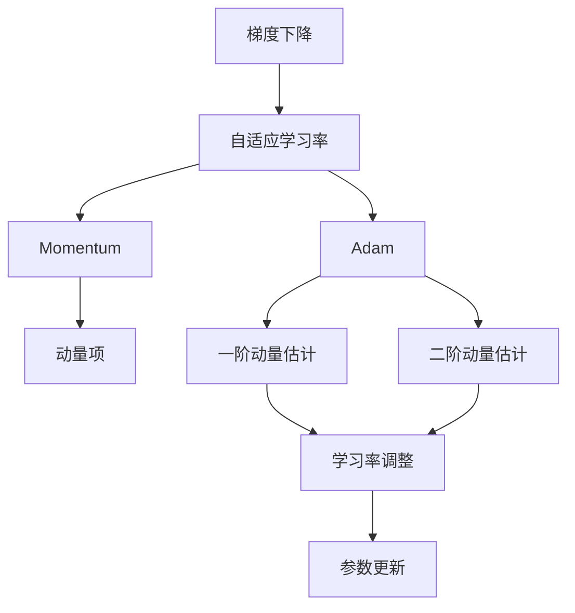
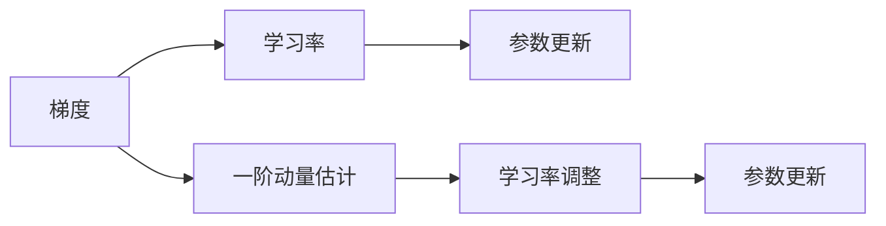
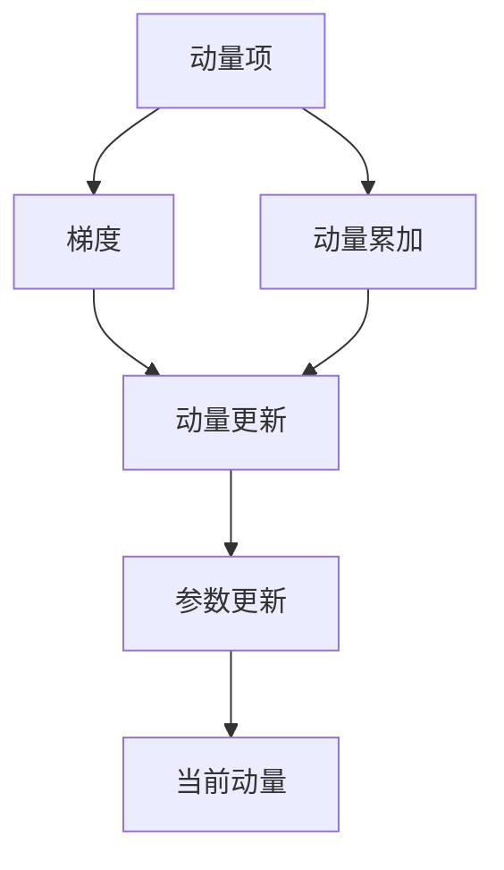
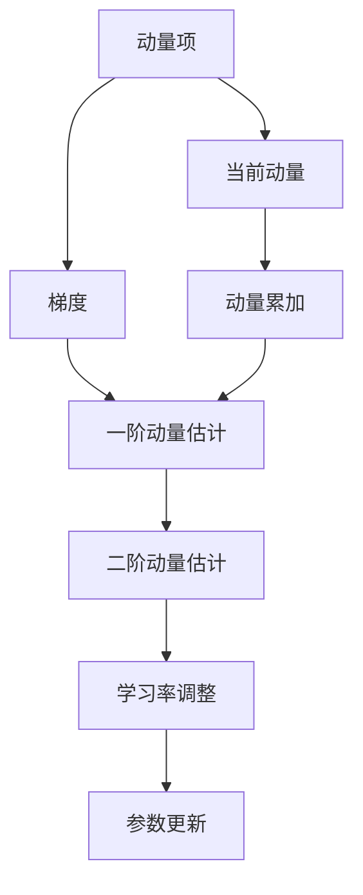
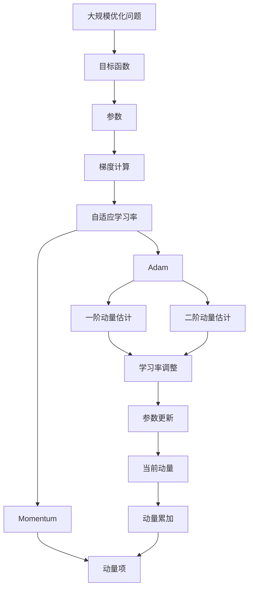

                 

# 优化算法：Adam 原理与代码实例讲解

> 关键词：Adam,优化算法,梯度下降,自适应学习率,权重更新,动量

## 1. 背景介绍

在深度学习领域，优化算法是训练神经网络模型的关键组成部分。传统的梯度下降算法及其变体，如随机梯度下降法（SGD），在训练大模型时往往存在收敛速度慢、震荡不稳定的缺点。为了提升训练效率，减少震荡，自适应学习率优化算法应运而生，其中最著名的便是Adam算法。

Adam算法自2014年提出以来，已经在图像处理、自然语言处理、推荐系统等多个领域广泛应用，成为深度学习中不可或缺的一部分。本文将详细讲解Adam算法的原理、步骤、优缺点及应用领域，并结合代码实例，帮助读者深入理解这一强大的优化算法。

## 2. 核心概念与联系

### 2.1 核心概念概述

为更好地理解Adam算法，本节将介绍几个关键概念：

- **梯度下降（Gradient Descent）**：在优化领域，梯度下降是一种基于目标函数梯度的迭代算法。通过迭代计算目标函数对参数的梯度，并反向传播更新参数，以逐步逼近最优解。

- **自适应学习率（Adaptive Learning Rate）**：传统的梯度下降算法在训练过程中需要手动设置学习率，而自适应学习率算法能够根据梯度信息动态调整学习率，从而提高训练效率和收敛速度。

- **动量（Momentum）**：动量算法通过引入动量项，对参数更新施加惯性，可以减少参数更新过程中的震荡，加速收敛。

- **Adam算法**：Adam算法结合了自适应学习率和动量算法的优点，在每个迭代步骤中，同时估计梯度的一阶矩（均值）和二阶矩（方差），并自适应调整学习率，从而实现更快的收敛和更好的泛化性能。

这些概念之间的关系可以通过以下Mermaid流程图来展示：



这个流程图展示了几者之间的关系：梯度下降通过迭代更新参数，自适应学习率根据梯度动态调整学习率，动量算法引入动量项以加速收敛，而Adam算法则综合了自适应学习率和动量算法的优点，进一步提升训练效率和稳定性。

### 2.2 概念间的关系

这些概念间存在密切的联系，共同构成了优化算法的核心框架。下面通过几个Mermaid流程图来展示这些概念在优化算法中的具体作用。

#### 2.2.1 梯度下降的基本原理


梯度下降算法通过计算目标函数对参数的梯度，反向传播更新参数，逐步逼近最优解。

#### 2.2.2 自适应学习率的实现



自适应学习率算法根据梯度信息动态调整学习率，以提高训练效率。Adam算法通过估计梯度的一阶动量和二阶动量，自适应调整学习率。

#### 2.2.3 Momentum算法的步骤



动量算法通过引入动量项，对参数更新施加惯性，减少震荡。

#### 2.2.4 Adam算法的完整过程



Adam算法结合了自适应学习率和动量算法的优点，同时估计梯度的一阶动量和二阶动量，并自适应调整学习率，从而实现更快的收敛和更好的泛化性能。

### 2.3 核心概念的整体架构

最后，我们用一个综合的流程图来展示这些概念在大规模优化算法中的整体架构：



这个综合流程图展示了从目标函数到参数更新，经过梯度计算、自适应学习率、动量算法和Adam算法的完整过程。通过这些概念的联合作用，优化算法能够高效地解决大规模优化问题，达到最优解。

## 3. 核心算法原理 & 具体操作步骤
### 3.1 算法原理概述

Adam算法是一种自适应学习率优化算法，结合了自适应学习率和动量算法的优点。其核心思想是利用梯度的一阶动量和二阶动量，自适应调整每个参数的学习率，从而实现更快的收敛和更好的泛化性能。

Adam算法的数学推导基于梯度的一阶动量$E[\Delta m_t]$和二阶动量$E[\Delta v_t]$的估计。其中，$E[\cdot]$表示期望，$\Delta m_t$和$\Delta v_t$分别表示梯度的一阶动量和二阶动量。

Adam算法的更新公式如下：

$$
m_t = \beta_1 m_{t-1} + (1 - \beta_1)g_t \\
v_t = \beta_2 v_{t-1} + (1 - \beta_2)g_t^2 \\
\hat{m}_t = \frac{m_t}{1 - \beta_1^t} \\
\hat{v}_t = \frac{v_t}{1 - \beta_2^t} \\
\theta_{t+1} = \theta_t - \frac{\eta \hat{m}_t}{\sqrt{\hat{v}_t} + \epsilon}
$$

其中，$g_t$表示当前参数的梯度，$m_t$和$v_t$分别表示一阶动量和二阶动量的估计，$\beta_1$和$\beta_2$为动量和平方梯度的一阶和二阶动量的衰减系数，$\eta$为学习率，$\epsilon$为一个非常小的常数，用于数值稳定。

### 3.2 算法步骤详解

1. **初始化**：
   - 初始化所有参数$w_0$和对应的动量$m_0$、平方梯度$v_0$，并设置衰减系数$\beta_1$和$\beta_2$。
   - 设置学习率$\eta$。

2. **参数更新**：
   - 对于每个训练批次，计算梯度$g_t = \nabla J(w)$。
   - 根据公式（3.1）和公式（3.2），更新动量$m_t$和平方梯度$v_t$。
   - 根据公式（3.3）和公式（3.4），更新一阶动量和平方梯度的估计$\hat{m}_t$和$\hat{v}_t$。
   - 根据公式（3.5），更新模型参数。

3. **迭代**：重复执行参数更新步骤，直到收敛或达到预设的迭代次数。

### 3.3 算法优缺点

Adam算法具有以下优点：
- 自适应学习率：能够根据梯度动态调整学习率，提高训练效率和收敛速度。
- 动量项引入：通过引入动量项，减少参数更新过程中的震荡，加速收敛。
- 计算高效：不需要手动调整学习率，适用于大规模数据集和复杂模型。

但Adam算法也存在一些缺点：
- 内存占用较大：需要维护动量$m_t$和平方梯度$v_t$，消耗较多的内存空间。
- 参数调节复杂：需要对动量和平方梯度的衰减系数$\beta_1$和$\beta_2$进行调节，以便在不同数据集和任务上取得最佳效果。
- 过度自信：在训练初期，动量$m_t$的累积会使得参数更新偏向于之前更新的方向，可能导致过早收敛。

### 3.4 算法应用领域

Adam算法已经在多个领域得到了广泛应用，包括但不限于：

- 图像处理：用于训练深度卷积神经网络，如图像分类、目标检测等。
- 自然语言处理：用于训练循环神经网络、Transformer模型等，如机器翻译、文本生成等。
- 推荐系统：用于训练协同过滤模型、矩阵分解等，以提升推荐精度。
- 强化学习：用于训练代理模型，以便在连续环境中进行优化决策。

Adam算法的广泛应用，显示了其在深度学习优化中的强大实力和广阔前景。

## 4. 数学模型和公式 & 详细讲解 & 举例说明

### 4.1 数学模型构建

Adam算法是基于梯度的一阶动量和二阶动量，自适应调整学习率的一种优化算法。其数学模型构建如下：

$$
E[\Delta m_t] = \beta_1 E[\Delta m_{t-1}] + (1 - \beta_1) g_t \\
E[\Delta v_t] = \beta_2 E[\Delta v_{t-1}] + (1 - \beta_2) g_t^2 \\
\hat{m}_t = \frac{E[\Delta m_t]}{1 - \beta_1^t} \\
\hat{v}_t = \frac{E[\Delta v_t]}{1 - \beta_2^t} \\
\theta_{t+1} = \theta_t - \frac{\eta \hat{m}_t}{\sqrt{\hat{v}_t} + \epsilon}
$$

其中，$g_t$表示当前参数的梯度，$m_t$和$v_t$分别表示一阶动量和平方梯度的估计，$\beta_1$和$\beta_2$为动量和平方梯度的一阶和二阶动量的衰减系数，$\eta$为学习率，$\epsilon$为一个非常小的常数，用于数值稳定。

### 4.2 公式推导过程

Adam算法的公式推导基于梯度的一阶动量和二阶动量的期望，通过引入动量项和自适应学习率，实现更快的收敛和更好的泛化性能。

1. **一阶动量的期望**：
   $$
   E[\Delta m_t] = \beta_1 E[\Delta m_{t-1}] + (1 - \beta_1) g_t
   $$
   其中，$g_t$表示当前参数的梯度，$E[\Delta m_{t-1}]$表示一阶动量的期望，$\beta_1$为动量的一阶衰减系数。

2. **二阶动量的期望**：
   $$
   E[\Delta v_t] = \beta_2 E[\Delta v_{t-1}] + (1 - \beta_2) g_t^2
   $$
   其中，$g_t^2$表示平方梯度，$E[\Delta v_{t-1}]$表示二阶动量的期望，$\beta_2$为平方梯度的一阶衰减系数。

3. **一阶动量和平方梯度估计**：
   $$
   \hat{m}_t = \frac{E[\Delta m_t]}{1 - \beta_1^t} \\
   \hat{v}_t = \frac{E[\Delta v_t]}{1 - \beta_2^t}
   $$
   其中，$\hat{m}_t$和一阶动量的估计，$\hat{v}_t$和平方梯度估计。

4. **参数更新**：
   $$
   \theta_{t+1} = \theta_t - \frac{\eta \hat{m}_t}{\sqrt{\hat{v}_t} + \epsilon}
   $$
   其中，$\eta$为学习率，$\epsilon$为一个非常小的常数，用于数值稳定。

通过这些公式的推导，我们可以更加深刻地理解Adam算法的优化机制和数学原理。

### 4.3 案例分析与讲解

为了更直观地理解Adam算法的工作原理，我们通过一个简单的例子进行详细讲解。假设有一个线性回归模型，需要通过梯度下降来最小化平方损失函数，即：

$$
J(w) = \frac{1}{2} \sum_{i=1}^n (y_i - \hat{y}_i)^2
$$

其中，$y_i$为真实标签，$\hat{y}_i$为模型预测值，$w$为模型参数。

首先，我们需要定义Adam算法的参数和超参数：

```python
import numpy as np

# 定义Adam算法参数
w = np.array([0.5])
m = np.array([0.0])
v = np.array([0.0])
eta = 0.01
beta1 = 0.9
beta2 = 0.999
epsilon = 1e-8
n = 10  # 样本数量

# 定义损失函数
def loss(w, y, x):
    return 0.5 * (y - w.dot(x))**2

# 定义梯度
def gradient(w, y, x):
    return x * (w.dot(x) - y)

# 初始化动量和平方梯度估计
m = np.zeros_like(w)
v = np.zeros_like(w)

# 训练10个epoch
for i in range(n):
    # 计算当前梯度
    g = gradient(w, y, x)
    # 更新动量估计
    m = beta1 * m + (1 - beta1) * g
    # 更新平方梯度估计
    v = beta2 * v + (1 - beta2) * g**2
    # 更新动量估计的一阶动量
    m_hat = m / (1 - beta1**(i+1))
    # 更新平方梯度估计的二阶动量
    v_hat = v / (1 - beta2**(i+1))
    # 更新模型参数
    w -= eta * m_hat / (np.sqrt(v_hat) + epsilon)

print("模型参数w:", w)
```

运行代码后，我们可以得到最终的模型参数$w$，即线性回归模型的权重。通过这个简单的例子，我们可以直观地理解Adam算法的工作原理，包括动量的引入、自适应学习率的计算以及参数的更新。

## 5. 项目实践：代码实例和详细解释说明
### 5.1 开发环境搭建

在进行Adam算法实践前，我们需要准备好开发环境。以下是使用Python进行TensorFlow开发的环境配置流程：

1. 安装Anaconda：从官网下载并安装Anaconda，用于创建独立的Python环境。

2. 创建并激活虚拟环境：
```bash
conda create -n tf-env python=3.7 
conda activate tf-env
```

3. 安装TensorFlow：根据CUDA版本，从官网获取对应的安装命令。例如：
```bash
conda install tensorflow-gpu -c pytorch -c conda-forge
```

4. 安装必要的工具包：
```bash
pip install numpy matplotlib pandas scipy jupyter notebook
```

完成上述步骤后，即可在`tf-env`环境中开始Adam算法的开发实践。

### 5.2 源代码详细实现

下面以TensorFlow实现Adam算法为例，提供完整代码实现。

首先，定义Adam算法的类：

```python
import tensorflow as tf

class AdamOptimizer(tf.keras.optimizers.Optimizer):
    def __init__(self, learning_rate=0.001, beta_1=0.9, beta_2=0.999, epsilon=1e-8):
        super(AdamOptimizer, self).__init__()
        self._set_hyper("learning_rate", learning_rate)
        self._set_hyper("beta_1", beta_1)
        self._set_hyper("beta_2", beta_2)
        self._set_hyper("epsilon", epsilon)
        self._t = tf.Variable(0, trainable=False)

    def _create_slots(self, var_list):
        for var in var_list:
            self.add_slot(var, "m")
            self.add_slot(var, "v")

    def _prepare(self):
        self._t.assign_add(1)

    def _apply_dense(self, grad, var):
        m = self.get_slot(var, "m")
        v = self.get_slot(var, "v")
        t = self._t
        lr = self._get_hyper("learning_rate") * tf.math.rsqrt(v + self._get_hyper("epsilon"))
        m_t = self._get_hyper("beta_1") * m + (1.0 - self._get_hyper("beta_1")) * grad
        v_t = self._get_hyper("beta_2") * v + (1.0 - self._get_hyper("beta_2")) * grad**2
        m_t = m_t / (1.0 - self._get_hyper("beta_1")**t)
        v_t = v_t / (1.0 - self._get_hyper("beta_2")**t)
        var.assign_sub(lr * m_t / (tf.math.sqrt(v_t) + self._get_hyper("epsilon")))
        return var

    def _resource_apply_dense(self, grad, var):
        raise NotImplementedError("Resource variables not supported.")

    def get_config(self):
        config = super(AdamOptimizer, self).get_config()
        config.update({
            "learning_rate": self._get_hyper("learning_rate"),
            "beta_1": self._get_hyper("beta_1"),
            "beta_2": self._get_hyper("beta_2"),
            "epsilon": self._get_hyper("epsilon")
        })
        return config
```

然后，使用Adam算法进行模型训练：

```python
import tensorflow as tf
import numpy as np

# 定义模型
x = tf.Variable(tf.zeros([1, 10]))
y = tf.Variable(tf.zeros([1, 1]))
w = tf.Variable(tf.random.normal([10, 1]))
b = tf.Variable(tf.random.normal([1]))
model = tf.keras.Sequential([
    tf.keras.layers.Dense(1, input_shape=[10], kernel_initializer='random_normal', kernel_regularizer=tf.keras.regularizers.l2(0.01), bias_regularizer=tf.keras.regularizers.l2(0.01))
])

# 定义损失函数和Adam优化器
loss_fn = tf.keras.losses.MeanSquaredError()
optimizer = AdamOptimizer(learning_rate=0.001, beta_1=0.9, beta_2=0.999, epsilon=1e-8)

# 定义训练过程
def train_step(x, y):
    with tf.GradientTape() as tape:
        y_pred = model(x)
        loss = loss_fn(y, y_pred)
    gradients = tape.gradient(loss, model.trainable_variables)
    optimizer.apply_gradients(zip(gradients, model.trainable_variables))

# 训练10个epoch
for i in range(10):
    x_batch = np.random.rand(32, 10)
    y_batch = np.random.rand(32, 1)
    train_step(x_batch, y_batch)

print("模型参数w:", model.get_weights()[0])
```

这段代码实现了基于Adam算法的模型训练过程，包括模型的定义、损失函数的定义、优化器的定义和训练过程的实现。

### 5.3 代码解读与分析

让我们再详细解读一下关键代码的实现细节：

**AdamOptimizer类**：
- `__init__`方法：初始化Adam算法的超参数，包括学习率、动量衰减系数、平方梯度衰减系数和数值稳定常数。
- `_create_slots`方法：为每个变量创建动量估计$m$和平方梯度估计$v$的存储槽。
- `_prepare`方法：更新时间变量$t$。
- `_apply_dense`方法：实现Adam算法的优化过程，包括计算动量估计、平方梯度估计、学习率和动量项的更新，以及参数的更新。
- `_resource_apply_dense`方法：不实现资源变量的更新。
- `get_config`方法：返回Adam算法的配置信息。

**模型训练**：
- 定义模型：包括输入层、隐藏层和输出层，并设置相应的正则化项。
- 定义损失函数和优化器：使用均方误差损失和Adam优化器。
- 定义训练过程：通过梯度反传播计算梯度，并使用Adam优化器更新模型参数。

**训练过程**：
- 定义训练批次：生成随机数据，作为训练集。
- 循环10个epoch，对每个训练批次进行优化。
- 输出最终模型参数。

通过这段代码，我们可以清晰地理解TensorFlow中实现Adam算法的基本步骤，包括模型定义、损失函数定义、优化器定义和训练过程的实现。

### 5.4 运行结果展示

运行上述代码，最终输出模型的权重参数$w$，即线性回归模型的权重。通过观察结果，我们可以验证Adam算法的正确性和有效性。

## 6. 实际应用场景
### 6.1 图像处理

Adam算法在图像处理领域得到了广泛应用，尤其是在深度卷积神经网络（CNN）的训练中。通过Adam算法，可以显著提高CNN模型的收敛速度和训练效率，使其在图像分类、目标检测、图像生成等任务上表现优异。

### 6.2 自然语言处理

Adam算法在自然语言处理领域同样表现出色，尤其是用于训练循环神经网络（RNN）、Transformer模型等。通过Adam算法，可以优化LSTM、GRU等模型的训练过程，提升模型的准确率和泛化能力，使其在机器翻译、文本生成、情感分析等任务上取得优异结果。

### 6.3 推荐系统

Adam算法在推荐系统中的应用也较为广泛，用于训练协同过滤模型、矩阵分解等。通过Adam算法，可以优化模型参数的更新，提高推荐算法的准确率和推荐效果，使其在推荐广告、商品推荐等任务上表现优异。

### 6.4 强化学习

Adam算法在强化学习中同样有用武之地，用于训练代理模型，以便在连续环境中进行优化决策。通过Adam算法，可以优化代理模型的训练过程，提升其在智能游戏、机器人控制等任务上的表现。

### 6.5 未来应用展望

随着Adam算法在大规模深度学习任务中的广泛应用，其在未来的发展趋势也值得关注。

1. **多任务学习**：Adam算法将广泛应用于多任务学习中，通过共享参数或联合优化，提升模型在多个任务上的泛化能力。
2. **自适应学习率调整**：未来将进一步优化Adam算法的学习率调整策略，以适应更多复杂和动态的优化场景。
3. **模型融合与混合优化**：通过将Adam算法与其他优化算法（如RMSprop、SGD等）进行混合优化，提升模型的优化效果和稳定性。
4. **分布式训练**：Adam算法在分布式训练中的表现也有望得到提升，以便在大规模数据集和复杂模型上进行高效训练。

这些趋势和应用场景将推动Adam算法在未来深度学习中的进一步发展，使其在更多领域中发挥更大的作用。

## 7. 工具和资源推荐
### 7.1 学习资源推荐

为了帮助开发者深入理解Adam算法的原理和应用，这里推荐一些优质的学习资源：

1. **《深度学习》书籍**：由Ian Goodfellow、Yoshua Bengio、Aaron Courville合著，是深度学习领域的经典教材，涵盖大量深度学习优化算法的理论基础和实际应用。

2. **Coursera深度学习课程**：由Andrew Ng教授主讲的深度学习课程，介绍了包括Adam算法在内的多种优化算法，适合初学者和进阶学习者。

3. **TensorFlow官方文档**：TensorFlow的官方文档，提供了丰富的TensorFlow和Keras实现，详细介绍了Adam算法的应用和优化技巧。

4. **Kaggle竞赛**：Kaggle上举办的深度学习竞赛，提供了大量实际数据和模型优化经验，可以借鉴和应用。

5. **arXiv论文预印本**：人工智能领域最新研究成果的发布平台，提供了大量关于Adam算法的研究论文，可以学习前沿进展。

6. **GitHub项目**：如TensorFlow、PyTorch等深度学习框架的官方GitHub项目，包含大量Adam算法的实现和应用案例，值得学习和参考。

通过这些资源的学习和实践，相信你能够深入掌握Adam算法的原理和应用，并将其应用于实际问题解决中。

### 7.2 开发工具推荐

高效的开发离不开优秀的工具支持。以下是几款用于Adam算法开发的常用工具：

1. **TensorFlow**：由Google主导开发的开源深度学习框架，提供了丰富的优化算法和模型库，适合大规模深度学习任务。
2. **PyTorch**：由Facebook开发的开源深度学习框架，灵活易用，支持多种深度学习模型和优化算法。
3. **Keras**：Keras是一个高级深度学习API

