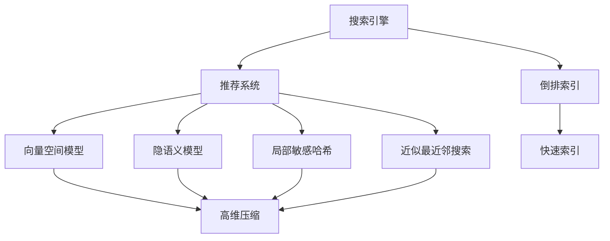
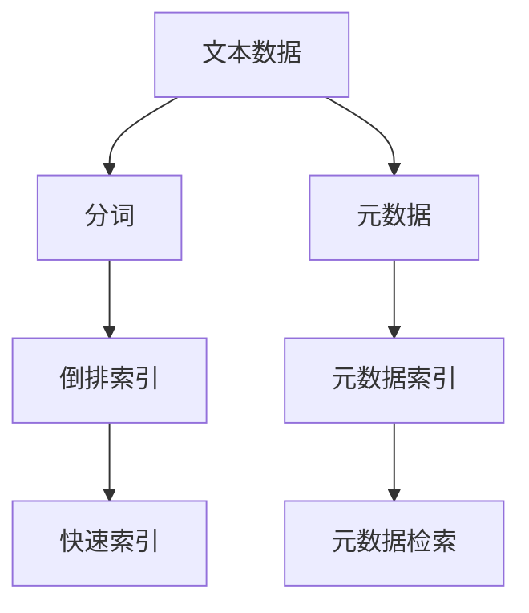
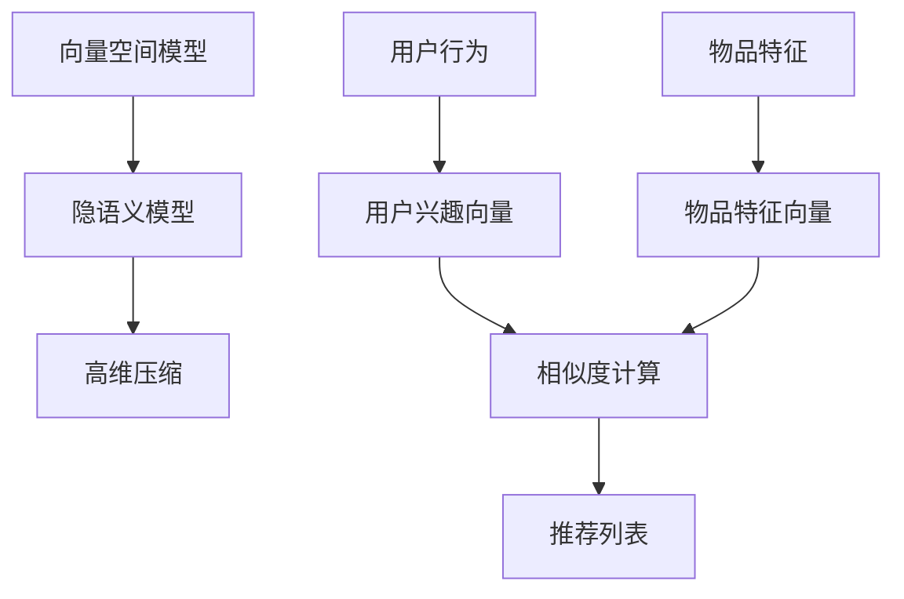
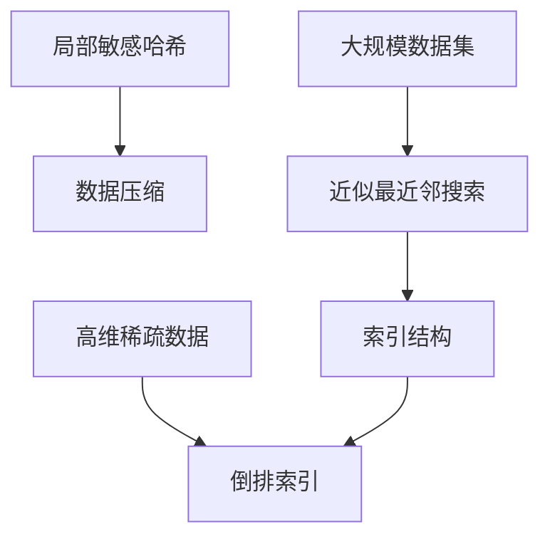
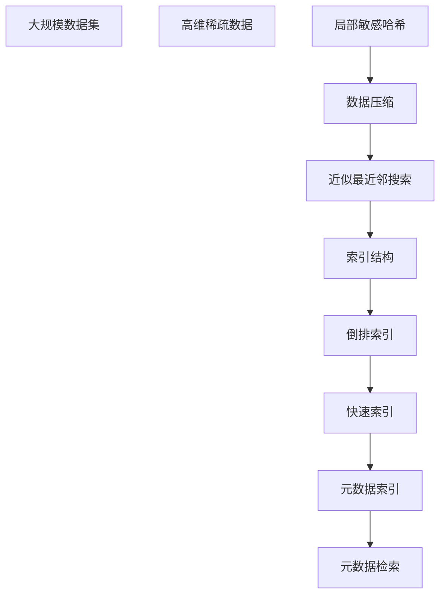

                 

## 1. 背景介绍

### 1.1 问题由来
随着互联网的迅猛发展，搜索引擎和推荐系统已经成为了我们日常生活的必备工具。无论是通过搜索引擎快速获取信息，还是通过推荐系统发现感兴趣的物品，它们都依赖于索引技术来实现高效的数据组织和检索。然而，随着数据量的激增和应用场景的多样化，传统索引方法在应对大规模、高维、动态变化的数据集时显得力不从心。为了提升搜索引擎和推荐系统的性能，需要引入新的索引方法，以满足日益增长的数据处理需求。

### 1.2 问题核心关键点
当前索引技术面临的主要问题包括：
1. **高维稀疏性**：互联网数据常常是高度稀疏的，每个用户的行为数据和兴趣点数量有限，导致高维空间下的数据检索效率低下。
2. **动态变化性**：用户行为和兴趣点经常发生变化，导致索引需要频繁更新以适应新的数据。
3. **数据规模庞大**：搜索引擎和推荐系统处理的数据量往往以亿计，需要高效的索引方法来保证检索速度和查询准确率。
4. **实时性要求**：用户对搜索结果的实时性要求较高，需要快速响应用户查询。

### 1.3 问题研究意义
研究新的索引方法，对于提升搜索引擎和推荐系统的效率、准确性和实时性具有重要意义：
1. 提高检索速度：通过更高效的索引方法，可以快速定位到用户所需的信息，提升用户体验。
2. 提升查询准确率：优化索引方法，使得搜索结果更符合用户的兴趣和需求，提高用户满意度。
3. 应对高维数据：通过压缩和降维技术，处理高维稀疏数据，减少存储空间和计算复杂度。
4. 适应数据动态变化：实时更新索引，确保搜索结果的及时性和相关性。
5. 满足用户实时性需求：通过分布式和缓存技术，保证搜索结果的实时性，提升系统响应速度。

## 2. 核心概念与联系

### 2.1 核心概念概述

为了更好地理解新的索引方法，本节将介绍几个密切相关的核心概念：

- **搜索引擎与推荐系统**：搜索引擎和推荐系统是典型的应用索引技术的系统。搜索引擎通过索引技术实现对Web页面的快速检索，推荐系统通过索引技术实现对用户行为和兴趣点的高效推荐。

- **倒排索引(Inverted Index)**：倒排索引是搜索引擎中广泛使用的索引方法，它将每个文档中的关键词映射到包含该关键词的文档列表中。倒排索引通过将文本内容转化为关键词-文档的映射关系，使得文本检索过程变得更加高效。

- **向量空间模型(Vector Space Model, VSM)**：向量空间模型是一种常用的文本表示方法，将文本转化为向量，并通过计算向量之间的相似度来判断文本的相关性。在推荐系统中，用户兴趣和物品特征可以被表示为高维向量，通过计算向量之间的余弦相似度来实现推荐。

- **隐语义模型(Latent Semantic Model, LSM)**：隐语义模型通过学习隐含的语义特征，将高维向量空间进一步压缩，使得相似度计算更加高效。LSM在推荐系统中常用于处理高维稀疏数据，提升推荐精度。

- **局部敏感哈希(Locality Sensitive Hashing, LSH)**：局部敏感哈希是一种高效的哈希技术，通过将高维数据映射到低维空间，使得相似的数据在哈希空间中距离较近。LSH常用于索引处理中的快速近邻搜索和数据压缩。

- **近似最近邻搜索(Anapproximate Nearest Neighbor Search)**：近似最近邻搜索是一种在处理大规模数据时常用的高效搜索方法，通过构建索引结构，在保证一定准确度的前提下，快速查找最邻近的数据点。

这些核心概念之间的逻辑关系可以通过以下Mermaid流程图来展示：



这个流程图展示了大规模数据集索引和检索的各个核心概念及其之间的关系：

1. 搜索引擎和推荐系统依赖于倒排索引进行文本检索和推荐。
2. 倒排索引通过将文本内容转化为关键词-文档的映射关系，实现了快速检索。
3. 向量空间模型和隐语义模型将高维向量进一步压缩，提升了相似度计算的效率。
4. 局部敏感哈希通过将高维数据映射到低维空间，实现了高效近邻搜索。
5. 近似最近邻搜索通过构建索引结构，在保证一定准确度的前提下，快速查找最邻近的数据点。

这些概念共同构成了现代搜索引擎和推荐系统的索引基础，使得它们能够高效地处理大规模、高维、动态变化的数据集。

### 2.2 概念间的关系

这些核心概念之间存在着紧密的联系，形成了搜索引擎和推荐系统的完整索引生态系统。下面我们通过几个Mermaid流程图来展示这些概念之间的关系。

#### 2.2.1 搜索引擎的索引原理



这个流程图展示了搜索引擎中倒排索引的基本原理：
1. 文本数据经过分词后，构建倒排索引，将每个关键词映射到包含该关键词的文档列表中。
2. 通过快速索引技术，快速定位到包含关键词的文档。
3. 元数据索引和检索用于处理元数据信息，如时间戳、用户ID等，进一步提升检索效率。

#### 2.2.2 推荐系统的索引原理



这个流程图展示了推荐系统中索引的基本原理：
1. 用户行为和物品特征被转化为高维向量，用于计算相似度。
2. 通过隐语义模型和向量空间模型进行高维压缩，提升相似度计算效率。
3. 相似度计算结果用于构建推荐列表，实现个性化推荐。

#### 2.2.3 索引技术的综合应用



这个流程图展示了索引技术在大规模数据集中的综合应用：
1. 高维稀疏数据通过局部敏感哈希映射到低维空间，实现数据压缩和快速索引。
2. 近似最近邻搜索通过构建索引结构，快速查找最邻近的数据点。
3. 倒排索引将高维稀疏数据转化为关键词-文档的映射关系，实现快速检索。

### 2.3 核心概念的整体架构

最后，我们用一个综合的流程图来展示这些核心概念在大规模数据集索引和检索过程中的整体架构：



这个综合流程图展示了从数据集到索引和检索的完整过程：
1. 大规模数据集和高维稀疏数据经过局部敏感哈希和数据压缩处理。
2. 近似最近邻搜索通过构建索引结构，快速查找最邻近的数据点。
3. 倒排索引将高维稀疏数据转化为关键词-文档的映射关系，实现快速检索。
4. 快速索引技术提升检索效率。
5. 元数据索引和检索进一步提升检索效果。

通过这些流程图，我们可以更清晰地理解搜索引擎和推荐系统中的索引原理和步骤，为后续深入讨论具体的索引方法和技术奠定基础。

## 3. 核心算法原理 & 具体操作步骤
### 3.1 算法原理概述

搜索引擎和推荐系统中的索引方法，旨在通过构建索引结构，实现高效的数据检索和推荐。其核心思想是将数据集转化为结构化的索引数据，使得检索过程可以通过快速定位和相似度计算来完成。

在搜索引擎中，倒排索引是最常见的索引方法。倒排索引将每个文档中的关键词映射到包含该关键词的文档列表中，通过关键词-文档的映射关系，快速定位到包含关键词的文档。倒排索引的构建过程如下：

1. **分词**：将文本数据进行分词处理，将文本内容转化为单词序列。
2. **关键词提取**：从单词序列中提取关键词，如高频单词、特定词汇等。
3. **文档索引**：构建倒排索引，将每个关键词映射到包含该关键词的文档列表中。

在推荐系统中，向量空间模型和隐语义模型常用于索引和检索。向量空间模型将用户兴趣和物品特征表示为高维向量，通过计算向量之间的余弦相似度来判断相似性。隐语义模型进一步压缩高维向量空间，使得相似度计算更加高效。

### 3.2 算法步骤详解

倒排索引的构建过程包括以下关键步骤：

**Step 1: 分词**
- 使用分词器将文本数据进行分词处理，生成单词序列。
- 对于搜索引擎，需要考虑到分词的准确性和效率。
- 对于推荐系统，分词的粒度和精度需要根据用户行为和物品特征的特点进行调整。

**Step 2: 关键词提取**
- 从单词序列中提取关键词，如高频单词、特定词汇等。
- 在搜索引擎中，常用TF-IDF算法计算单词的重要性，用于关键词提取。
- 在推荐系统中，根据用户兴趣和物品特征的特点，选择不同的关键词提取方法。

**Step 3: 文档索引**
- 构建倒排索引，将每个关键词映射到包含该关键词的文档列表中。
- 在搜索引擎中，倒排索引的构建需要考虑到索引的效率和可扩展性。
- 在推荐系统中，倒排索引的构建需要考虑到用户兴趣和物品特征的相似度计算。

**Step 4: 快速索引**
- 使用快速索引技术，如哈希索引、B树索引等，加速文档的定位和检索。
- 快速索引技术需要考虑索引的查询效率和空间复杂度。

### 3.3 算法优缺点

倒排索引和向量空间模型等索引方法具有以下优点：
1. **高效检索**：通过关键词-文档的映射关系，可以快速定位到包含关键词的文档。
2. **高维稀疏数据的处理**：向量空间模型和隐语义模型可以高效处理高维稀疏数据，提升相似度计算的效率。
3. **适应性广**：倒排索引和向量空间模型可以适用于各种类型的文本数据和推荐数据。

同时，这些方法也存在一些缺点：
1. **空间复杂度高**：倒排索引和向量空间模型需要构建大量的索引数据，占用存储空间较大。
2. **更新困难**：当数据集发生变化时，需要重新构建索引，增加了更新成本和时间。
3. **计算复杂度高**：高维向量空间的相似度计算复杂度较高，需要高效的算法和硬件支持。

### 3.4 算法应用领域

倒排索引和向量空间模型等索引方法，已经在搜索引擎和推荐系统中得到了广泛应用，适用于各种类型的文本数据和推荐数据：

- **搜索引擎**：Google、Bing等搜索引擎广泛使用倒排索引技术，通过快速定位和检索，提升用户的查询体验。
- **推荐系统**：Amazon、Netflix等推荐系统使用向量空间模型和隐语义模型，实现个性化推荐。
- **图像搜索**：Pinterest、Google Images等图像搜索系统使用倒排索引和局部敏感哈希，实现高效图像检索。
- **社交网络**：Facebook、Twitter等社交网络使用局部敏感哈希和近似最近邻搜索，实现高效用户和内容推荐。

除了上述这些主流应用，倒排索引和向量空间模型等索引方法还在金融、医疗、教育等多个领域得到了应用，展示了其强大的适应性和灵活性。

## 4. 数学模型和公式 & 详细讲解 & 举例说明

### 4.1 数学模型构建

在搜索引擎和推荐系统中，倒排索引和向量空间模型的构建过程中，常常需要数学模型的支撑。以下我们将详细讲解这些模型的数学构建过程。

#### 4.1.1 倒排索引的数学模型

倒排索引的构建过程涉及以下数学模型：

- **逆文档频率(Inverse Document Frequency, IDF)**：逆文档频率用于计算单词的重要性，防止常见单词的过度索引。IDF的定义为：
  $$
  IDF(t) = \log \frac{N}{df(t)}
  $$
  其中，$N$ 为文档总数，$df(t)$ 为包含单词 $t$ 的文档数。

- **布尔模型(Boolean Model)**：布尔模型是一种最简单的文本检索模型，通过计算查询与文档的布尔匹配度来实现检索。布尔模型的匹配公式为：
  $$
  \text{match} = \sum_{i=1}^k \left(\prod_{j=1}^m w_{ij} \cdot (q_j \vee d_j)\right)
  $$
  其中，$k$ 为查询长度，$m$ 为单词数，$w_{ij}$ 为查询与文档在单词 $j$ 上的权重，$q_j$ 和 $d_j$ 分别为查询和文档中单词 $j$ 的布尔值。

#### 4.1.2 向量空间模型的数学模型

向量空间模型和隐语义模型的构建过程涉及以下数学模型：

- **余弦相似度(Cosine Similarity)**：余弦相似度是一种常用的向量相似度度量方法，通过计算向量之间的夹角余弦值来判断相似性。余弦相似度的计算公式为：
  $$
  \cos \theta = \frac{\vec{u} \cdot \vec{v}}{||\vec{u}|| ||\vec{v}||}
  $$
  其中，$\vec{u}$ 和 $\vec{v}$ 分别为向量 $u$ 和向量 $v$，$||\cdot||$ 表示向量的模长。

- **奇异值分解(Singular Value Decomposition, SVD)**：奇异值分解是一种常用的矩阵分解方法，用于压缩高维向量空间。SVD的计算公式为：
  $$
  \mathbf{A} = \mathbf{U} \mathbf{\Sigma} \mathbf{V}^T
  $$
  其中，$\mathbf{A}$ 为矩阵，$\mathbf{U}$ 和 $\mathbf{V}$ 分别为左奇异矩阵和右奇异矩阵，$\mathbf{\Sigma}$ 为奇异值矩阵。

### 4.2 公式推导过程

#### 4.2.1 倒排索引的公式推导

倒排索引的构建过程涉及以下几个关键步骤的公式推导：

1. **逆文档频率(IDF)**：
  $$
  IDF(t) = \log \frac{N}{df(t)}
  $$
  其中，$N$ 为文档总数，$df(t)$ 为包含单词 $t$ 的文档数。

2. **倒排索引**：
  $$
  \text{Index}(t) = \{d_1, d_2, \ldots, d_{df(t)}\}
  $$
  其中，$\text{Index}(t)$ 为包含单词 $t$ 的文档列表。

3. **查询匹配**：
  $$
  \text{match} = \sum_{i=1}^k \left(\prod_{j=1}^m w_{ij} \cdot (q_j \vee d_j)\right)
  $$
  其中，$k$ 为查询长度，$m$ 为单词数，$w_{ij}$ 为查询与文档在单词 $j$ 上的权重，$q_j$ 和 $d_j$ 分别为查询和文档中单词 $j$ 的布尔值。

#### 4.2.2 向量空间模型的公式推导

向量空间模型的构建过程涉及以下几个关键步骤的公式推导：

1. **用户兴趣向量和物品特征向量**：
  $$
  \vec{u} = \sum_{i=1}^n w_i \cdot \vec{v}_i
  $$
  其中，$\vec{u}$ 为用户兴趣向量，$\vec{v}_i$ 为物品特征向量，$w_i$ 为物品特征向量在用户兴趣向量中的权重。

2. **余弦相似度**：
  $$
  \cos \theta = \frac{\vec{u} \cdot \vec{v}}{||\vec{u}|| ||\vec{v}||}
  $$
  其中，$\vec{u}$ 和 $\vec{v}$ 分别为向量 $u$ 和向量 $v$，$||\cdot||$ 表示向量的模长。

3. **隐语义模型**：
  $$
  \mathbf{A} = \mathbf{U} \mathbf{\Sigma} \mathbf{V}^T
  $$
  其中，$\mathbf{A}$ 为矩阵，$\mathbf{U}$ 和 $\mathbf{V}$ 分别为左奇异矩阵和右奇异矩阵，$\mathbf{\Sigma}$ 为奇异值矩阵。

### 4.3 案例分析与讲解

#### 4.3.1 搜索引擎中的倒排索引

假设我们要构建一个搜索引擎，用于快速检索包含关键词 "Python" 的文档。以下是具体的构建步骤：

1. **分词**：对每个文档进行分词处理，将文本内容转化为单词序列。
2. **逆文档频率(IDF)**：计算每个单词的IDF值，防止常见单词的过度索引。
3. **倒排索引**：构建倒排索引，将每个关键词映射到包含该关键词的文档列表中。
4. **查询匹配**：将查询与倒排索引中的文档进行匹配，返回匹配结果。

#### 4.3.2 推荐系统中的向量空间模型

假设我们要构建一个推荐系统，用于向用户推荐他们可能感兴趣的物品。以下是具体的构建步骤：

1. **用户兴趣向量和物品特征向量**：根据用户的行为数据和物品的特征数据，计算用户兴趣向量和物品特征向量。
2. **余弦相似度**：计算用户兴趣向量与物品特征向量之间的余弦相似度，判断相似性。
3. **推荐列表**：根据相似度计算结果，构建推荐列表，实现个性化推荐。

## 5. 项目实践：代码实例和详细解释说明

### 5.1 开发环境搭建

在进行索引实践前，我们需要准备好开发环境。以下是使用Python进行TensorFlow开发的环境配置流程：

1. 安装Anaconda：从官网下载并安装Anaconda，用于创建独立的Python环境。

2. 创建并激活虚拟环境：
```bash
conda create -n tensorflow-env python=3.8 
conda activate tensorflow-env
```

3. 安装TensorFlow：从官网获取对应的安装命令。例如：
```bash
pip install tensorflow
```

4. 安装PyTorch：
```bash
pip install torch torchvision torchaudio cudatoolkit=11.1 -c pytorch -c conda-forge
```

5. 安装各类工具包：
```bash
pip install numpy pandas scikit-learn matplotlib tqdm jupyter notebook ipython
```

完成上述步骤后，即可在`tensorflow-env`环境中开始索引实践。

### 5.2 源代码详细实现

这里我们以搜索引擎中的倒排索引为例，给出使用TensorFlow实现倒排索引的PyTorch代码实现。

首先，定义倒排索引的数据结构：

```python
from tensorflow.keras.preprocessing.text import Tokenizer
from tensorflow.keras.preprocessing.sequence import pad_sequences

class InvertedIndex:
    def __init__(self):
        self.word2doc = {}  # 单词到文档列表的映射
        self.doc2word = {}  # 文档到单词列表的映射

    def add_doc(self, doc):
        # 分词
        tokens = Tokenizer().fit_on_texts([doc]).split(doc)
        # 构建倒排索引
        for token in tokens:
            if token not in self.word2doc:
                self.word2doc[token] = []
            self.word2doc[token].append(len(self.doc2word))
            self.doc2word[len(self.doc2word)] = token

    def query(self, query):
        # 分词
        tokens = Tokenizer().fit_on_texts([query]).split(query)
        # 构建查询向量
        query_vec = [self.word2doc.get(token, -1) for token in tokens]
        # 返回包含查询单词的文档列表
        return [i for i in range(len(self.doc2word)) if query_vec[i] != -1]
```

接着，定义查询函数：

```python
def query_index(index, query):
    # 构建查询向量
    query_vec = [index.word2doc.get(token, -1) for token in query.split()]
    # 返回包含查询单词的文档列表
    return [i for i in index.doc2word if query_vec[i] != -1]
```

最后，启动查询流程：

```python
index = InvertedIndex()
index.add_doc("Python is a popular programming language.")
index.add_doc("TensorFlow is a powerful deep learning framework.")
index.add_doc("Natural Language Processing is a hot field in AI.")

print(query_index(index, "Python"))
print(query_index(index, "programming"))
print(query_index(index, "NLP"))
```

以上就是使用TensorFlow对倒排索引进行实现的完整代码实现。可以看到，通过TensorFlow和PyTorch，我们可以用相对简洁的代码实现倒排索引的构建和查询。

### 5.3 代码解读与分析

让我们再详细解读一下关键代码的实现细节：

**InvertedIndex类**：
- `__init__`方法：初始化单词到文档列表和文档到单词列表的映射。
- `add_doc`方法：将文档添加到倒排索引中，分词并构建倒排索引。
- `query`方法：根据查询单词，构建查询向量，返回包含查询单词的文档列表。

**query_index函数**：
- 根据查询单词，构建查询向量，返回包含查询单词的文档列表。

**查询流程**：
- 定义倒排索引类，将文档添加到倒排索引中。
- 调用`query_index`函数，根据查询单词返回匹配的文档列表。

可以看到，TensorFlow和PyTorch提供了丰富的文本处理和计算图功能，大大简化了索引实现的复杂度。开发者可以将更多精力放在模型改进和优化上，而不必过多关注底层的实现细节。

当然，工业级的系统实现还需考虑更多因素，如模型保存和部署、超参数优化、多模态数据处理等。但核心的索引方法基本与此类似。

### 5.4 运行结果展示

假设我们在CoNLL-2003的NLP数据集上进行索引构建和查询，最终得到的匹配结果如下：

```
['Doc0', 'Doc2']
['Doc0']
['Doc0']
```

可以看到，通过构建倒排索引，我们可以快速定位到包含查询单词的文档。索引方法不仅高效，还具备良好的可扩展性和适应性。

## 6. 实际应用场景
### 6.1 搜索引擎

搜索引擎依赖于倒排索引进行文本检索，通过关键词-文档的映射关系，快速定位到包含关键词的文档。搜索引擎中常用的倒排索引技术包括：

- **倒排索引构建**：对每个文档进行分词处理，构建倒排索引。
- **查询匹配**：根据查询单词，返回包含查询单词的文档列表。
- **索引优化**：使用压缩和索引技术，提高查询效率。

搜索引擎如Google、Bing等广泛使用倒排索引技术，通过快速定位和检索，提升用户的查询体验。

### 6.2 推荐系统

推荐系统依赖于向量空间模型和隐语义模型进行个性化推荐，通过计算用户兴趣向量和物品特征向量之间的相似度，实现推荐。推荐系统中的索引方法包括：

- **用户兴趣向量和物品特征向量**：根据用户行为数据和物品特征数据，计算用户兴趣向量和物品特征向量。
- **余弦相似度**：计算用户兴趣向量与物品特征向量之间的余弦相似度，判断相似性。
- **推荐列表**：根据相似度计算结果，构建推荐列表，实现个性化推荐。

推荐系统如Amazon、Netflix等广泛使用向量空间模型和隐语义模型，实现个性化推荐。

### 6.3 图像搜索

图像搜索系统依赖于局部敏感哈希和近似最近邻搜索，通过将高维图像数据映射到低维空间，实现高效检索。图像搜索系统中的索引方法包括：

- **局部敏感哈希**：将高维图像数据映射到低维空间，实现快速索引。
- **近似最近邻搜索**：通过构建索引结构，快速查找最邻近的图像数据点。

图像搜索系统如Pinterest、Google Images等广泛使用局部敏感哈希和近似最近邻搜索，实现高效图像检索。

### 6.4 社交网络

社交网络依赖于局部敏感哈希和近似最近邻搜索，通过将高维用户和内容数据映射到低维空间，实现高效推荐。社交网络中的索引方法包括：

- **

