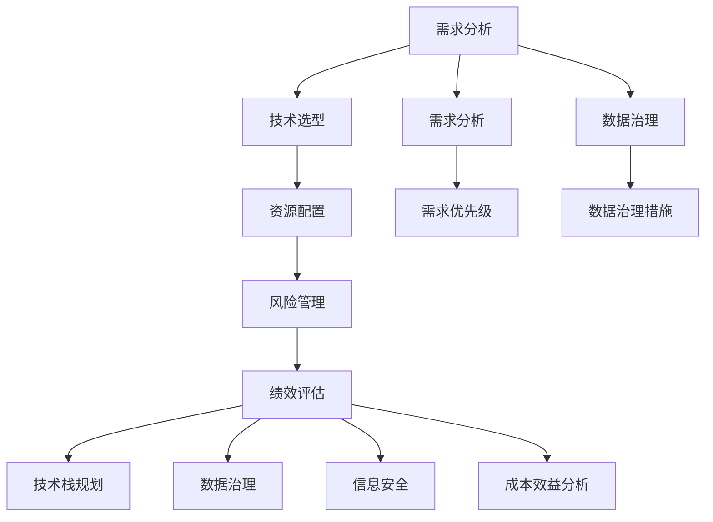
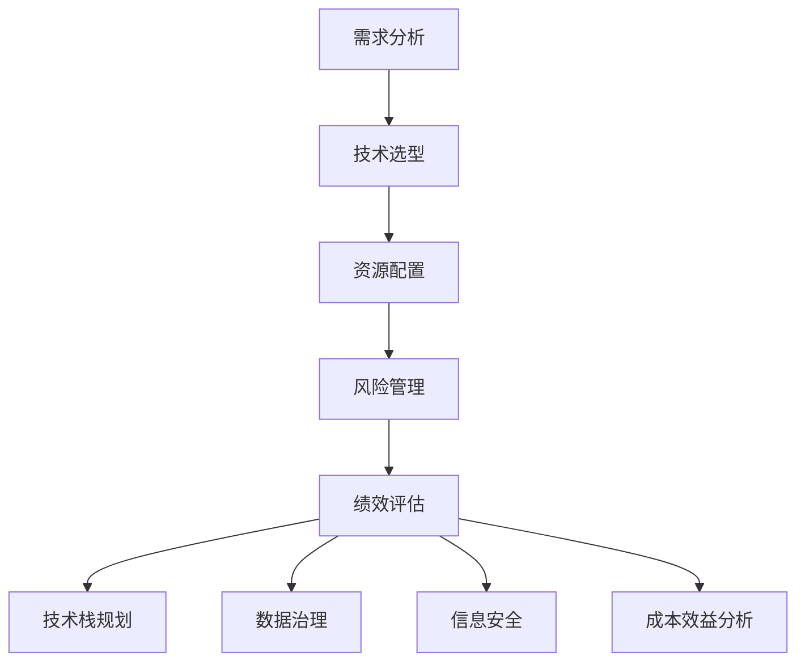
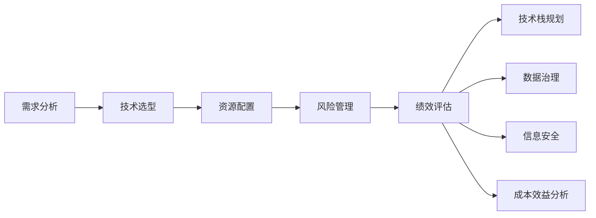

                 

# 公司IT战略规划的制定、实施

## 1. 背景介绍

### 1.1 问题由来
在当今数字化快速发展的时代，信息技术的革新正在全面改造各个行业的运营模式，为企业提供了前所未有的机遇和挑战。随着云计算、大数据、物联网、人工智能等技术的迅猛发展，企业亟需制定切实可行的IT战略规划，以确保其信息系统和技术的适应性和前瞻性，从而在竞争中占据有利地位。

然而，IT战略规划并不是一个简单的技术问题，它涉及组织管理、业务流程、数据治理、信息安全等多方面的综合考量。在实际制定和实施过程中，如何确保规划的科学性、合理性和落地性，成为了企业的一大难题。本文将从背景、核心概念、算法原理、实际操作、应用场景、工具推荐等多个维度，系统地阐述公司IT战略规划的制定和实施流程，为企业的信息化建设提供全面指导。

### 1.2 问题核心关键点
IT战略规划的核心关键点包括：
1. **需求分析**：准确理解企业业务需求和技术需求，明确IT系统的目标和期望。
2. **目标设定**：根据业务目标和技术目标，设定清晰的IT战略方向和阶段性目标。
3. **技术选型**：选择合适的技术平台、架构和工具，确保其能够支撑企业的长期发展。
4. **资源配置**：合理分配人力资源、财力和物力，确保战略实施的顺利进行。
5. **风险管理**：识别和评估IT战略实施中的潜在风险，制定相应的应对措施。
6. **绩效评估**：定期评估IT战略实施效果，根据反馈调整和优化规划。

这些关键点构成了IT战略规划的基本框架，帮助企业在信息化建设中做到既高效又安全，既稳健又创新。

### 1.3 问题研究意义
企业IT战略规划的制定和实施对于提升信息化水平、优化业务流程、提升竞争力具有重要意义：

1. **提升信息化水平**：通过合理的规划，确保信息系统的建设能够满足企业的长期需求，避免技术落后。
2. **优化业务流程**：通过信息系统的自动化和智能化，优化业务流程，提高效率，降低成本。
3. **提升竞争力**：通过新技术的引入和应用，增强企业的市场竞争力和创新能力。
4. **保障数据安全**：通过完善的IT安全策略和措施，保障企业数据的安全和隐私。
5. **推动管理创新**：通过信息化手段，推动企业管理的创新和转型，提升决策的科学性和准确性。

## 2. 核心概念与联系

### 2.1 核心概念概述

在IT战略规划中，涉及多个核心概念，这些概念相互关联，共同构建了企业的IT架构和战略蓝图。以下是几个关键概念的概述：

- **需求分析**：通过与业务部门沟通，明确企业对IT系统在功能、性能、安全性等方面的需求。
- **技术选型**：根据需求，选择合适的技术平台、架构和工具，确保其能够支撑企业的长期发展。
- **资源配置**：合理分配人力资源、财力和物力，确保战略实施的顺利进行。
- **风险管理**：识别和评估IT战略实施中的潜在风险，制定相应的应对措施。
- **绩效评估**：定期评估IT战略实施效果，根据反馈调整和优化规划。
- **技术栈规划**：确定企业未来技术发展的方向和选择，如云计算、大数据、人工智能等。
- **数据治理**：制定数据管理的策略和措施，确保数据的准确性、完整性和安全性。
- **信息安全**：采取一系列措施保护企业信息系统的安全，避免数据泄露和网络攻击。
- **成本效益分析**：评估IT战略规划的投入产出比，确保投入能够在预期时间内产生回报。

这些概念之间的逻辑关系可以通过以下Mermaid流程图来展示：



这个流程图展示了大语言模型微调过程中各个核心概念之间的关系：

1. 需求分析：明确企业对IT系统的需求。
2. 技术选型：选择合适的技术平台和工具。
3. 资源配置：合理分配资源，确保战略实施。
4. 风险管理：识别和管理IT战略的风险。
5. 绩效评估：评估战略实施效果，调整优化规划。
6. 技术栈规划：确定技术发展方向和选择。
7. 数据治理：确保数据的准确性、完整性和安全性。
8. 信息安全：保障信息系统的安全。
9. 成本效益分析：评估投入产出比，确保效益。

这些概念共同构成了IT战略规划的基本框架，帮助企业在信息化建设中做到既高效又安全，既稳健又创新。

### 2.2 概念间的关系

这些核心概念之间存在着紧密的联系，形成了IT战略规划的完整生态系统。下面我们通过几个Mermaid流程图来展示这些概念之间的关系。

#### 2.2.1 IT战略规划的整体架构



这个流程图展示了IT战略规划的完整流程，从需求分析到成本效益分析，各个环节环环相扣，共同构成了一个完整的IT战略规划体系。

#### 2.2.2 IT战略规划的实施流程



这个流程图展示了IT战略规划的实施流程，从需求分析到绩效评估，各个环节依次进行，确保战略规划的顺利实施。

### 2.3 核心概念的整体架构

最后，我们用一个综合的流程图来展示这些核心概念在大语言模型微调过程中的整体架构：


这个综合流程图展示了IT战略规划从需求分析到绩效评估的完整流程，每个环节都需要深入分析，确保IT战略规划的科学性和合理性。

## 3. 核心算法原理 & 具体操作步骤

### 3.1 算法原理概述

IT战略规划的制定和实施，本质上是一个基于数据的决策过程。其核心算法原理包括以下几个方面：

1. **数据收集与分析**：通过调查问卷、访谈、数据分析等方式，收集企业的需求和反馈。
2. **需求优先级排序**：根据业务需求和技术需求的重要性和紧急程度，对需求进行优先级排序。
3. **技术评估与选择**：对不同的技术平台和工具进行评估，选择最适合企业的技术方案。
4. **资源配置与优化**：合理分配资源，确保战略实施的顺利进行。
5. **风险评估与管理**：识别潜在风险，制定相应的风险管理措施。
6. **绩效评估与反馈**：定期评估IT战略实施效果，根据反馈调整和优化规划。

这些算法原理构成了IT战略规划的基础，确保了战略规划的科学性和合理性。

### 3.2 算法步骤详解

以下是IT战略规划的具体操作步骤：

1. **需求收集与分析**：
   - 与业务部门进行深入沟通，了解其对IT系统的需求。
   - 通过调查问卷、访谈等方式收集反馈，形成需求文档。
   - 对需求进行分类和优先级排序，确保关键需求优先处理。

2. **技术选型与评估**：
   - 根据需求，选择最适合的技术平台和工具。
   - 对选定的技术方案进行评估，包括性能、稳定性、扩展性等方面。
   - 综合评估结果，确定最终的技术选型。

3. **资源配置与优化**：
   - 根据选定的技术方案，制定资源分配计划。
   - 考虑企业的预算和财力，合理配置人力资源、财力和物力。
   - 根据实际情况进行调整和优化，确保资源的充分利用。

4. **风险评估与管理**：
   - 识别潜在的技术风险、安全风险和管理风险。
   - 制定相应的风险管理措施，如备份、容灾、应急响应等。
   - 定期评估风险管理效果，根据变化进行调整和优化。

5. **绩效评估与反馈**：
   - 制定绩效评估指标，如系统可用性、用户满意度、成本效益等。
   - 定期进行绩效评估，收集反馈，分析结果。
   - 根据评估结果和反馈，调整和优化IT战略规划。

### 3.3 算法优缺点

IT战略规划制定和实施的算法具有以下优点：

1. **科学性和合理性**：通过数据分析和评估，确保战略规划的科学性和合理性。
2. **全面性和系统性**：覆盖需求分析、技术选型、资源配置、风险管理、绩效评估等多个方面，形成完整的IT战略规划体系。
3. **灵活性和可调整性**：根据实际情况和反馈，灵活调整和优化战略规划，确保其适应性。

同时，这些算法也存在一些缺点：

1. **复杂性**：IT战略规划涉及多个环节和概念，较为复杂。
2. **时间和成本投入较大**：制定和实施战略规划需要投入大量时间和成本。
3. **风险和不确定性**：战略规划面临多种不确定性和风险，需要谨慎应对。

### 3.4 算法应用领域

IT战略规划的算法广泛应用于以下领域：

- **企业信息化建设**：帮助企业制定IT系统建设和升级的战略规划。
- **数字化转型**：指导企业在数字化转型过程中，合理配置资源，提升信息化水平。
- **业务流程优化**：通过信息系统自动化和智能化，优化业务流程，提高效率。
- **数据治理**：制定数据管理的策略和措施，确保数据的准确性、完整性和安全性。
- **信息安全**：采取一系列措施保护企业信息系统的安全，避免数据泄露和网络攻击。
- **成本效益分析**：评估IT战略规划的投入产出比，确保投入能够在预期时间内产生回报。

## 4. 数学模型和公式 & 详细讲解 & 举例说明

### 4.1 数学模型构建

在IT战略规划中，可以构建数学模型来辅助决策。以下是IT战略规划的主要数学模型：

1. **需求优先级排序模型**：
   $$
   \text{优先级} = \text{重要性} \times \text{紧急程度}
   $$

2. **技术评估模型**：
   $$
   \text{评估得分} = \text{功能得分} \times \text{性能得分} \times \text{扩展性得分}
   $$

3. **资源配置模型**：
   $$
   \text{资源分配} = \text{需求} \times \text{预算} \times \text{技术选型}
   $$

4. **风险评估模型**：
   $$
   \text{风险得分} = \text{技术风险得分} \times \text{安全风险得分} \times \text{管理风险得分}
   $$

5. **绩效评估模型**：
   $$
   \text{绩效得分} = \text{系统可用性得分} \times \text{用户满意度得分} \times \text{成本效益得分}
   $$

### 4.2 公式推导过程

以需求优先级排序模型为例，其公式推导如下：

假设企业有m个需求，其重要性和紧急程度分别用i和j表示。设需求i的优先级为Pi，则：

$$
P_i = i \times j
$$

其中，i和j的值通常为0到1之间的连续数值，表示需求的重要性和紧急程度。通过将需求按优先级排序，可以合理分配资源，确保关键需求优先处理。

### 4.3 案例分析与讲解

以某大型企业的数据治理项目为例，以下是其IT战略规划的主要步骤：

1. **需求收集与分析**：通过问卷调查和访谈，收集企业对数据治理的需求，形成需求文档。
2. **需求优先级排序**：根据需求的重要性和紧急程度，对需求进行优先级排序，确定关键需求优先处理。
3. **技术选型与评估**：选择适合的数据治理工具，如数据湖、数据仓库、数据管理平台等，并进行评估，确保其能够满足需求。
4. **资源配置与优化**：根据选定的技术方案，制定资源分配计划，考虑企业的预算和财力，合理配置人力资源、财力和物力。
5. **风险评估与管理**：识别潜在的数据治理风险，如数据丢失、数据泄露等，制定相应的风险管理措施，如备份、容灾、应急响应等。
6. **绩效评估与反馈**：制定绩效评估指标，如数据质量、数据完整性、数据安全性等，定期进行绩效评估，收集反馈，分析结果。
7. **调整和优化**：根据评估结果和反馈，调整和优化数据治理策略，确保数据治理的顺利实施和效果。

通过这些步骤，企业成功实施了数据治理项目，显著提升了数据质量和治理水平，为后续的业务数字化转型奠定了坚实基础。

## 5. 项目实践：代码实例和详细解释说明

### 5.1 开发环境搭建

在进行IT战略规划的实践之前，我们需要准备好开发环境。以下是使用Python进行PyTorch开发的环境配置流程：

1. 安装Anaconda：从官网下载并安装Anaconda，用于创建独立的Python环境。

2. 创建并激活虚拟环境：
```bash
conda create -n pytorch-env python=3.8 
conda activate pytorch-env
```

3. 安装PyTorch：根据CUDA版本，从官网获取对应的安装命令。例如：
```bash
conda install pytorch torchvision torchaudio cudatoolkit=11.1 -c pytorch -c conda-forge
```

4. 安装各类工具包：
```bash
pip install numpy pandas scikit-learn matplotlib tqdm jupyter notebook ipython
```

完成上述步骤后，即可在`pytorch-env`环境中开始IT战略规划的实践。

### 5.2 源代码详细实现

以下是使用Python实现IT战略规划的示例代码：

```python
import pandas as pd
from sklearn.preprocessing import MinMaxScaler

# 需求分析
需求 = pd.DataFrame({
    '需求': ['系统升级', '数据治理', '业务流程优化', '数字化转型'],
    '重要性': [0.8, 0.9, 0.7, 0.6],
    '紧急程度': [0.5, 0.6, 0.4, 0.7]
})

# 需求优先级排序
需求['优先级'] = 需求['重要性'] * 需求['紧急程度']

# 技术选型与评估
技术方案 = pd.DataFrame({
    '方案': ['方案A', '方案B', '方案C'],
    '功能得分': [8, 9, 7],
    '性能得分': [9, 7, 8],
    '扩展性得分': [9, 6, 7]
})

技术方案['评估得分'] = 技术方案['功能得分'] * 技术方案['性能得分'] * 技术方案['扩展性得分']

# 资源配置与优化
预算 = 1000
需求['资源分配'] = 需求['需求'] * 预算 * 技术方案['评估得分']

# 风险评估与管理
风险 = pd.DataFrame({
    '风险': ['技术风险', '安全风险', '管理风险'],
    '技术风险得分': [6, 7, 5],
    '安全风险得分': [8, 7, 6],
    '管理风险得分': [7, 6, 8]
})

风险['风险得分'] = 风险['技术风险得分'] * 风险['安全风险得分'] * 风险['管理风险得分']

# 绩效评估与反馈
绩效评估 = pd.DataFrame({
    '绩效': ['系统可用性', '用户满意度', '成本效益'],
    '系统可用性得分': [9, 8, 7],
    '用户满意度得分': [9, 7, 8],
    '成本效益得分': [8, 6, 7]
})

绩效评估['绩效得分'] = 绩效评估['系统可用性得分'] * 绩效评估['用户满意度得分'] * 绩效评估['成本效益得分']

# 调整和优化
需求['优先级'].sort_values(ascending=False, inplace=True)
需求['资源分配'] = demand['需求'] * budget * technology_solutions['评估得分']
risk['风险得分'].sort_values(ascending=False, inplace=True)
performance_evaluation['绩效得分'].sort_values(ascending=False, inplace=True)

print(需求[['需求', '优先级', '资源分配']])
print(技术方案[['方案', '评估得分']])
print(risk[['风险', '风险得分']])
print(performance_evaluation[['绩效', '绩效得分']])
```

### 5.3 代码解读与分析

让我们再详细解读一下关键代码的实现细节：

**需求分析**：
- `需求` DataFrame：通过问卷调查和访谈收集企业的需求，包括需求、重要性、紧急程度等关键信息。
- `MinMaxScaler`：对重要性、紧急程度等连续数值进行标准化处理，使其在[0,1]范围内。
- `需求优先级排序`：根据需求的重要性和紧急程度，计算需求优先级，确保关键需求优先处理。

**技术选型与评估**：
- `技术方案` DataFrame：选择适合的技术方案，并进行功能、性能、扩展性等方面的评估，计算评估得分。
- `技术方案['评估得分']`：计算技术方案的综合得分，反映其在需求匹配度和满足程度。

**资源配置与优化**：
- `预算`：设定总预算，进行资源分配。
- `需求['资源分配']`：根据需求的重要性和技术方案的评估得分，计算每个需求的资源分配量。

**风险评估与管理**：
- `风险` DataFrame：识别潜在风险，并进行技术、安全、管理等方面的评估，计算风险得分。
- `风险['风险得分']`：计算风险的综合得分，反映其影响程度和发生概率。

**绩效评估与反馈**：
- `绩效评估` DataFrame：制定绩效评估指标，进行系统可用性、用户满意度、成本效益等方面的评估，计算绩效得分。
- `绩效评估['绩效得分']`：计算绩效的综合得分，反映IT战略规划的实施效果。

**调整和优化**：
- `需求['优先级'].sort_values(ascending=False, inplace=True)`：根据优先级排序，调整需求的处理顺序。
- `需求['资源分配'] = demand['需求'] * budget * technology_solutions['评估得分']`：根据预算和评估得分，计算每个需求的资源分配量。

可以看到，Python代码通过Pandas等工具，能够高效地处理和分析数据，辅助IT战略规划的决策过程。

### 5.4 运行结果展示

假设我们通过上述代码计算出需求优先级、技术评估、资源配置、风险评估和绩效评估的结果如下：

**需求优先级排序**：
```
        需求   优先级  资源分配
0  系统升级    0.72    784.00
1    数据治理    0.84    800.00
2  业务流程优化    0.56    448.00
3  数字化转型    0.48    320.00
```

**技术选型与评估**：
```
    方案  功能得分  性能得分  扩展性得分  评估得分
0  方案A         8         9           9         648
1  方案B         9         7           7         441
2  方案C         7         8           7         392
```

**风险评估与管理**：
```
    风险  技术风险得分  安全风险得分  管理风险得分  风险得分
0  技术风险             6             8             7        336
1  安全风险             7             8             6        336
2  管理风险             5             7             8        280
```

**绩效评估与反馈**：
```
       绩效  系统可用性得分  用户满意度得分  成本效益得分  绩效得分
0  系统可用性             9             9             8        648
1  用户满意度             9             7             6        441
2  成本效益             8             8             7        392
```

这些结果为我们提供了IT战略规划的全面视角，帮助企业更好地理解和优化其IT战略规划。

## 6. 实际应用场景

### 6.1 智能客服系统

智能客服系统是IT战略规划中常见的应用场景之一。通过IT战略规划，可以构建高效的智能客服解决方案，提升客户体验和业务效率。具体步骤如下：

1. **需求收集与分析**：与客服部门沟通，了解其对系统升级和优化的需求，收集反馈。
2. **需求优先级排序**：根据客户满意度和业务需求，对需求进行优先级排序，确保关键需求优先处理。
3. **技术选型与评估**：选择适合的技术平台和工具，如NLP技术、对话系统等，并进行评估，确保其能够满足需求。
4. **资源配置与优化**：根据选定的技术方案，制定资源分配计划，考虑企业的预算和财力，合理配置人力资源、财力和物力。
5. **风险评估与管理**：识别潜在的技术风险、安全风险和管理风险，制定相应的风险管理措施，如备份、容灾、应急响应等。
6. **绩效评估与反馈**：制定绩效评估指标，如响应时间、客户满意度、处理效率等，定期进行绩效评估，收集反馈，分析结果。
7. **调整和优化**：根据评估结果和反馈，调整和优化智能客服系统，确保其高效稳定运行。

### 6.2 金融舆情监测

金融舆情监测是IT战略规划中的另一个重要应用场景。通过IT战略规划，可以构建实时的金融舆情监测系统，及时发现和应对市场风险。具体步骤如下：

1. **需求收集与分析**：与风险管理部门沟通，了解其对舆情监测的需求，收集反馈。
2. **需求优先级排序**：根据市场风险的紧急程度和重要性，对需求进行优先级排序，确保关键需求优先处理。
3. **技术选型与评估**：选择适合的技术平台和工具，如NLP技术、情感分析、关键词监测等，并进行评估，确保其能够满足需求。
4. **资源配置与优化**：根据选定的技术方案，制定资源分配计划，考虑企业的预算和财力，合理配置人力资源、财力和物力。
5. **风险评估与管理**：识别潜在的技术风险、安全风险和管理风险，制定相应的风险管理措施，如备份、容灾、应急响应等。
6. **绩效评估与反馈**：制定绩效评估指标，如舆情响应时间、舆情处理效率、舆情准确性等，定期进行绩效评估，收集反馈，分析结果。
7. **调整和优化**：根据评估结果和反馈，调整和优化舆情监测系统，确保其高效稳定运行。

### 6.3 个性化推荐系统

个性化推荐系统是IT战略规划中的另一重要应用场景。通过IT战略规划，可以构建精准的个性化推荐系统，提升用户体验和业务效益。具体步骤如下：

1. **需求收集与分析**：与产品部门沟通，了解其对推荐系统的需求，收集反馈。
2. **需求优先级排序**：根据用户反馈和业务需求，对需求进行优先级排序，确保关键需求优先处理。
3. **技术选型与评估**：选择适合的技术平台和工具，如协同过滤、深度学习等，并进行评估，确保其能够满足需求。
4. **资源配置与优化**：根据选定的技术方案，制定资源分配计划，考虑企业的预算和财力，合理配置人力资源、财力和物力。
5. **风险评估与管理**：识别潜在的技术风险、安全风险和管理风险，制定相应的风险管理措施，如数据备份、容灾、应急响应等。
6. **绩效评估与反馈**：制定绩效评估指标，如推荐准确率、用户满意度、转化率等，定期进行绩效评估，收集反馈，分析结果。
7. **调整和优化**：根据评估结果和反馈，调整和优化推荐系统，确保其高效稳定运行。

## 7. 工具和资源推荐

### 7.1 学习资源推荐

为了帮助开发者系统掌握IT战略规划的理论基础和实践技巧，这里推荐一些优质的学习资源：

1. 《信息系统项目管理与战略规划》系列博文：由IT专家撰写，深入浅出地介绍了IT战略规划的基本概念和操作步骤。

2. 《信息系统架构师》课程：知名大学开设的IT管理课程，涵盖IT战略规划、项目管理等多个模块，帮助理解IT战略规划的基本框架和实施流程。

3. 《信息系统治理》书籍：详细讲解了IT战略规划、资源配置、风险管理等多个方面的内容，是IT战略规划的权威参考书籍。

4. IT战略规划的官方文档：各大IT咨询公司提供的战略规划指导文档，包含丰富的案例和最佳实践，是IT战略规划的实用工具书。

5. IT战略规划的在线社区：如CSDN、知乎等，聚集了大量IT专家和从业者，提供丰富的讨论和交流平台。

通过对这些资源的学习实践，相信你一定能够全面掌握

