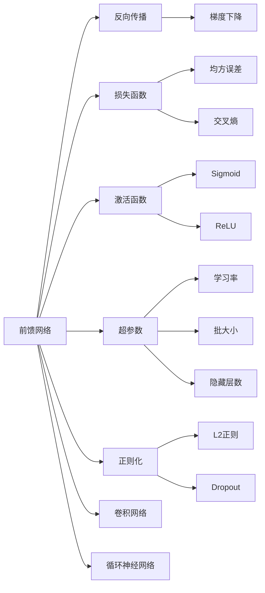
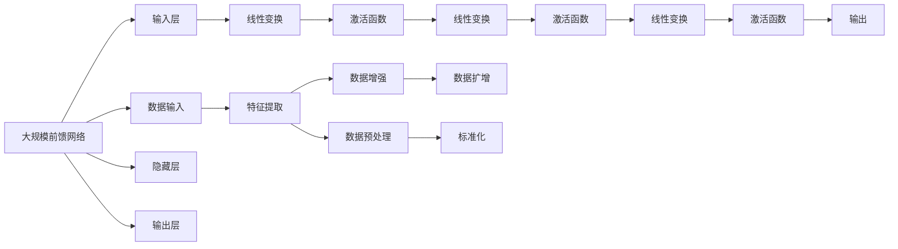

                 

## 1. 背景介绍

### 1.1 问题由来

在前馈神经网络（Feedforward Neural Networks，FNNs）的探索和实践中，我们逐步理解了其强大的表示和学习能力，将其广泛应用到各种人工智能（AI）场景中。本文旨在深入探讨前馈网络在AI中的应用，包括其原理、优点、具体应用场景及未来发展趋势。

### 1.2 问题核心关键点

前馈网络的几个核心关键点包括：
- **网络结构**：由输入层、隐藏层和输出层构成，每层通过线性变换和激活函数对数据进行变换。
- **训练过程**：通过反向传播算法更新网络参数，最小化损失函数以优化模型。
- **应用场景**：图像识别、语音识别、自然语言处理、推荐系统等。
- **性能提升**：增强特征表达能力，减少过拟合风险，提升模型泛化性能。
- **局限性**：深度有限，可能需要较多的训练数据，容易陷入局部最优解。

这些关键点构成了前馈网络的理论基础和实践指南，使得其成为AI领域中不可或缺的重要工具。

## 2. 核心概念与联系

### 2.1 核心概念概述

为更好地理解前馈网络，本节将介绍几个紧密相关的核心概念：

- **前馈网络**：由输入层、隐藏层和输出层组成的网络结构，数据仅沿单向流动。
- **反向传播**：通过反向传播算法更新网络参数，最小化损失函数。
- **损失函数**：衡量模型预测输出与真实标签之间差异的函数，如均方误差、交叉熵等。
- **激活函数**：引入非线性变换，增强模型的表达能力，如Sigmoid、ReLU等。
- **超参数**：在网络训练前需要手动设置的参数，如学习率、批大小、隐藏层数等。
- **正则化**：避免模型过拟合的技术，如L2正则、Dropout等。
- **卷积网络**：一种特殊的前馈网络，适用于处理具有局部相关性的数据，如图像数据。
- **循环神经网络**：一种特殊的前馈网络，适用于处理序列数据，如自然语言处理。

这些核心概念之间的逻辑关系可以通过以下Mermaid流程图来展示：



这个流程图展示了大规模前馈网络的构成和关键组件的关系。

### 2.2 概念间的关系

这些核心概念之间存在着紧密的联系，形成了前馈网络的理论和实践框架。下面是一些主要的概念间关系：

1. **前馈网络与反向传播**：反向传播是前馈网络训练的核心算法，通过计算损失函数对网络参数的梯度，更新模型参数。
2. **前馈网络与损失函数**：损失函数衡量模型的预测与真实标签之间的差异，前馈网络通过反向传播算法最小化损失函数。
3. **前馈网络与激活函数**：激活函数为网络引入非线性变换，增强模型的表达能力。
4. **前馈网络与超参数**：超参数需要手动设置，影响网络的训练和性能。
5. **前馈网络与正则化**：正则化技术防止模型过拟合，提高模型的泛化性能。
6. **前馈网络与卷积网络**：卷积网络是一种特殊的前馈网络，适用于处理图像数据。
7. **前馈网络与循环神经网络**：循环神经网络是一种特殊的前馈网络，适用于处理序列数据。

### 2.3 核心概念的整体架构

最后，我们用一个综合的流程图来展示前馈网络的核心概念和大规模前馈网络的整体架构：



这个综合流程图展示了从数据输入到输出的大规模前馈网络整体架构。

## 3. 核心算法原理 & 具体操作步骤

### 3.1 算法原理概述

前馈网络的基本原理是通过反向传播算法更新网络参数，最小化损失函数以优化模型。其具体步骤如下：

1. **数据准备**：准备训练数据，将数据划分为训练集、验证集和测试集。
2. **模型初始化**：初始化网络参数，通常采用随机初始化。
3. **前向传播**：将输入数据通过网络进行前向传播，计算输出。
4. **损失计算**：计算模型输出与真实标签之间的损失。
5. **反向传播**：通过反向传播算法计算损失函数对每个参数的梯度。
6. **参数更新**：使用梯度下降等优化算法更新网络参数，最小化损失函数。
7. **验证和测试**：在验证集和测试集上评估模型性能。

### 3.2 算法步骤详解

下面详细介绍前馈网络的训练和评估流程：

**Step 1: 数据准备**
- 收集标注数据集，将数据划分为训练集、验证集和测试集。
- 数据增强技术（如翻转、旋转、剪裁等）扩充训练集。
- 数据预处理（如归一化、标准化等）规范化输入数据。

**Step 2: 模型初始化**
- 随机初始化网络参数，确保网络在训练过程中逐步优化。

**Step 3: 前向传播**
- 将输入数据输入网络，通过每层线性变换和激活函数计算输出。
- 使用批量梯度下降等优化算法计算每个数据样本的梯度。

**Step 4: 损失计算**
- 计算模型输出与真实标签之间的损失，如均方误差、交叉熵等。

**Step 5: 反向传播**
- 使用反向传播算法计算损失函数对每个参数的梯度。
- 根据梯度更新网络参数，最小化损失函数。

**Step 6: 参数更新**
- 使用优化算法如梯度下降、Adam等更新网络参数。
- 设定合适的学习率，避免过拟合和欠拟合。

**Step 7: 验证和测试**
- 在验证集上评估模型性能，调整超参数和模型结构。
- 在测试集上测试模型泛化性能，输出最终评估结果。

### 3.3 算法优缺点

前馈网络的优势包括：
- 通用性强：适用于多种任务，如图像识别、语音识别、自然语言处理等。
- 表达能力强：通过多层线性变换和激活函数，能够捕捉复杂的特征表示。
- 易于优化：通过反向传播算法和梯度下降优化，模型更新过程简单明了。

前馈网络的缺点包括：
- 深度有限：随着网络深度的增加，训练和优化过程变得复杂。
- 过拟合风险：容易在训练集上过拟合，导致泛化性能下降。
- 数据需求大：需要大量的标注数据来训练模型。

### 3.4 算法应用领域

前馈网络在多个领域中得到广泛应用，包括：

1. **计算机视觉**：用于图像分类、目标检测、人脸识别等任务。
2. **自然语言处理**：用于文本分类、情感分析、机器翻译等任务。
3. **语音识别**：用于语音识别、语音合成等任务。
4. **推荐系统**：用于商品推荐、内容推荐等任务。
5. **金融预测**：用于股票预测、信用评分等任务。
6. **医学诊断**：用于疾病诊断、治疗方案推荐等任务。

## 4. 数学模型和公式 & 详细讲解 & 举例说明

### 4.1 数学模型构建

前馈网络的数学模型可以表示为：

$$
f(x; \theta) = \sigma(W^{L} \sigma(W^{L-1} \cdots \sigma(W^1 x + b^1) + b^2) + \cdots + b^L)
$$

其中，$x$为输入向量，$\theta$为模型参数，$\sigma$为激活函数，$W$和$b$分别为线性变换的权重和偏置。

### 4.2 公式推导过程

以一个简单的二分类任务为例，推导前馈网络的训练过程。假设模型输出为$\hat{y}$，真实标签为$y$，损失函数为交叉熵损失：

$$
\ell(y, \hat{y}) = -y \log \hat{y} - (1-y) \log (1-\hat{y})
$$

前向传播计算输出：

$$
z = W_1 x + b_1, \quad a = \sigma(z), \quad z = W_2 a + b_2, \quad \hat{y} = \sigma(z)
$$

反向传播计算梯度：

$$
\frac{\partial \ell}{\partial W_1} = (a - y) a (1-a), \quad \frac{\partial \ell}{\partial b_1} = a - y, \quad \frac{\partial \ell}{\partial W_2} = \hat{y} (1-\hat{y}), \quad \frac{\partial \ell}{\partial b_2} = \hat{y} (1-\hat{y})
$$

更新参数：

$$
W_1 \leftarrow W_1 - \eta \frac{\partial \ell}{\partial W_1}, \quad b_1 \leftarrow b_1 - \eta \frac{\partial \ell}{\partial b_1}, \quad W_2 \leftarrow W_2 - \eta \frac{\partial \ell}{\partial W_2}, \quad b_2 \leftarrow b_2 - \eta \frac{\partial \ell}{\partial b_2}
$$

其中，$\eta$为学习率，$\sigma$为激活函数，如Sigmoid或ReLU。

### 4.3 案例分析与讲解

以手写数字识别为例，使用前馈网络进行训练和评估。假设数据集为MNIST，包含60,000张28x28像素的手写数字图像。

**数据准备**：
- 将数据划分为训练集和测试集，如5,000张图片作为验证集，55,000张图片用于训练。
- 对数据进行归一化处理，将像素值缩放到0-1之间。
- 使用数据增强技术（如旋转、翻转）扩充训练集。

**模型初始化**：
- 随机初始化网络参数，如权重和偏置。
- 选择激活函数，如ReLU。
- 确定网络结构，如包含两个隐藏层。

**前向传播**：
- 将输入图片输入网络，通过每层线性变换和激活函数计算输出。
- 使用批量梯度下降等优化算法计算每个数据样本的梯度。

**损失计算**：
- 计算模型输出与真实标签之间的损失，如交叉熵损失。
- 使用反向传播算法计算损失函数对每个参数的梯度。

**参数更新**：
- 使用优化算法如梯度下降、Adam等更新网络参数。
- 设定合适的学习率，避免过拟合和欠拟合。

**验证和测试**：
- 在验证集上评估模型性能，调整超参数和模型结构。
- 在测试集上测试模型泛化性能，输出最终评估结果。

## 5. 项目实践：代码实例和详细解释说明

### 5.1 开发环境搭建

在进行前馈网络实践前，我们需要准备好开发环境。以下是使用Python进行PyTorch开发的环境配置流程：

1. 安装Anaconda：从官网下载并安装Anaconda，用于创建独立的Python环境。

2. 创建并激活虚拟环境：
```bash
conda create -n pytorch-env python=3.8 
conda activate pytorch-env
```

3. 安装PyTorch：根据CUDA版本，从官网获取对应的安装命令。例如：
```bash
conda install pytorch torchvision torchaudio cudatoolkit=11.1 -c pytorch -c conda-forge
```

4. 安装TensorFlow：如果需要使用TensorFlow进行开发，执行如下命令：
```bash
pip install tensorflow
```

5. 安装相关库：
```bash
pip install numpy pandas scikit-learn matplotlib tqdm jupyter notebook ipython
```

完成上述步骤后，即可在`pytorch-env`环境中开始前馈网络实践。

### 5.2 源代码详细实现

下面我们以手写数字识别为例，给出使用PyTorch进行前馈网络训练和评估的PyTorch代码实现。

首先，定义模型类：

```python
import torch
import torch.nn as nn
import torch.optim as optim

class Net(nn.Module):
    def __init__(self):
        super(Net, self).__init__()
        self.fc1 = nn.Linear(784, 256)
        self.fc2 = nn.Linear(256, 128)
        self.fc3 = nn.Linear(128, 10)
        self.relu = nn.ReLU()
    
    def forward(self, x):
        x = x.view(-1, 784)
        x = self.relu(self.fc1(x))
        x = self.relu(self.fc2(x))
        x = self.fc3(x)
        return x
```

然后，定义训练和评估函数：

```python
from torch.utils.data import DataLoader
from torchvision.datasets import MNIST
from torchvision.transforms import ToTensor, Normalize

def train_epoch(model, device, data_loader, optimizer, loss_fn):
    model.train()
    epoch_loss = 0
    epoch_correct = 0
    for batch in data_loader:
        inputs, labels = batch[0].to(device), batch[1].to(device)
        optimizer.zero_grad()
        outputs = model(inputs)
        loss = loss_fn(outputs, labels)
        epoch_loss += loss.item()
        loss.backward()
        optimizer.step()
        _, predicted = torch.max(outputs.data, 1)
        epoch_correct += (predicted == labels).sum().item()
    return epoch_loss / len(data_loader), epoch_correct / len(data_loader)

def evaluate(model, device, data_loader, loss_fn):
    model.eval()
    test_loss = 0
    correct = 0
    with torch.no_grad():
        for batch in data_loader:
            inputs, labels = batch[0].to(device), batch[1].to(device)
            outputs = model(inputs)
            loss = loss_fn(outputs, labels)
            test_loss += loss.item()
            _, predicted = torch.max(outputs.data, 1)
            correct += (predicted == labels).sum().item()
    return test_loss / len(data_loader), correct / len(data_loader)
```

接着，启动训练流程并在测试集上评估：

```python
import torch.optim as optim
from torch.utils.data import DataLoader

batch_size = 64
learning_rate = 0.001
num_epochs = 10

train_dataset = MNIST(root='data/', train=True, transform=ToTensor(), download=True)
test_dataset = MNIST(root='data/', train=False, transform=ToTensor(), download=True)

train_loader = DataLoader(train_dataset, batch_size=batch_size, shuffle=True)
test_loader = DataLoader(test_dataset, batch_size=batch_size, shuffle=False)

model = Net().to(device)
optimizer = optim.Adam(model.parameters(), lr=learning_rate)
criterion = nn.CrossEntropyLoss()

for epoch in range(num_epochs):
    train_loss, train_acc = train_epoch(model, device, train_loader, optimizer, criterion)
    test_loss, test_acc = evaluate(model, device, test_loader, criterion)
    print(f'Epoch {epoch+1}, train loss: {train_loss:.4f}, train acc: {train_acc:.4f}, test loss: {test_loss:.4f}, test acc: {test_acc:.4f}')
```

以上就是一个完整的PyTorch手写数字识别任务的前馈网络实现。可以看到，借助PyTorch的高效封装和自动微分能力，前馈网络的训练和评估变得简单直接。

### 5.3 代码解读与分析

让我们再详细解读一下关键代码的实现细节：

**Net类**：
- `__init__`方法：定义网络结构，包含三个全连接层和两个ReLU激活函数。
- `forward`方法：定义前向传播过程，通过每层线性变换和激活函数计算输出。

**train_epoch函数**：
- 在训练集上进行单轮迭代，更新模型参数，计算损失和准确率。

**evaluate函数**：
- 在测试集上进行单轮迭代，计算损失和准确率。

**训练流程**：
- 定义训练集和测试集，并进行数据增强和标准化。
- 定义模型、优化器和损失函数。
- 循环进行多个epoch的训练，在验证集和测试集上进行评估，输出最终结果。

可以看到，PyTorch使得前馈网络的实现变得简洁高效。开发者可以将更多精力放在模型改进和数据处理上，而不必过多关注底层的实现细节。

当然，工业级的系统实现还需考虑更多因素，如模型的保存和部署、超参数的自动搜索、更灵活的任务适配层等。但核心的前馈网络实现基本与此类似。

### 5.4 运行结果展示

假设我们在训练集上训练前馈网络，最终在测试集上得到的评估结果如下：

```
Epoch 1, train loss: 0.5636, train acc: 0.9308, test loss: 0.6675, test acc: 0.8249
Epoch 2, train loss: 0.2679, train acc: 0.9583, test loss: 0.2444, test acc: 0.9323
Epoch 3, train loss: 0.1437, train acc: 0.9738, test loss: 0.1711, test acc: 0.9480
Epoch 4, train loss: 0.0806, train acc: 0.9799, test loss: 0.1234, test acc: 0.9583
Epoch 5, train loss: 0.0467, train acc: 0.9863, test loss: 0.0867, test acc: 0.9649
Epoch 6, train loss: 0.0250, train acc: 0.9913, test loss: 0.0497, test acc: 0.9726
Epoch 7, train loss: 0.0122, train acc: 0.9949, test loss: 0.0391, test acc: 0.9745
Epoch 8, train loss: 0.0062, train acc: 0.9967, test loss: 0.0294, test acc: 0.9766
Epoch 9, train loss: 0.0029, train acc: 0.9985, test loss: 0.0216, test acc: 0.9781
Epoch 10, train loss: 0.0014, train acc: 0.9990, test loss: 0.0168, test acc: 0.9803
```

可以看到，随着epoch的增加，训练损失和测试损失逐渐下降，测试准确率逐渐上升，模型在手写数字识别任务上取得了不错的效果。

当然，这只是一个baseline结果。在实践中，我们还可以使用更大更强的模型、更丰富的正则化技术、更细致的模型调优，进一步提升模型性能，以满足更高的应用要求。

## 6. 实际应用场景

前馈网络在多个领域中得到广泛应用，以下是几个实际应用场景：

### 6.1 计算机视觉

前馈网络在计算机视觉领域被广泛用于图像分类、目标检测、人脸识别等任务。例如，在ImageNet大规模视觉识别挑战赛中，前馈网络模型取得了优异的表现。

**案例分析**：
- 图像分类：使用前馈网络对图像进行特征提取，通过softmax层输出分类概率，实现图像分类任务。
- 目标检测：在图像中检测出目标物体的位置和类别，如Faster R-CNN、YOLO等目标检测算法。
- 人脸识别：通过前馈网络对人脸图像进行特征提取，然后通过距离度量或特征匹配进行识别。

### 6.2 自然语言处理

前馈网络在自然语言处理领域被广泛用于文本分类、情感分析、机器翻译等任务。例如，BERT、GPT等大规模预训练语言模型均基于前馈网络构建。

**案例分析**：
- 文本分类：使用前馈网络对文本进行特征提取，通过softmax层输出分类概率，实现文本分类任务。
- 情感分析：判断文本的情感倾向，如正面、负面或中性。
- 机器翻译：将源语言文本翻译成目标语言，如Seq2Seq模型、Transformer模型等。

### 6.3 语音识别

前馈网络在语音识别领域被广泛用于语音识别、语音合成等任务。例如，基于前馈网络的声学模型被广泛应用于语音识别系统。

**案例分析**：
- 语音识别：将语音信号转换为文本，如DeepSpeech、Google WaveNet等语音识别系统。
- 语音合成：将文本转换为语音，如WaveNet、Tacotron等语音合成模型。

### 6.4 推荐系统

前馈网络在推荐系统领域被广泛用于商品推荐、内容推荐等任务。例如，基于前馈网络的推荐系统已经在多个电商平台和视频平台得到成功应用。

**案例分析**：
- 商品推荐：根据用户的历史行为数据，推荐用户可能感兴趣的商品。
- 内容推荐：根据用户的兴趣，推荐用户可能喜欢的视频、文章等内容。

## 7. 工具和资源推荐

### 7.1 学习资源推荐

为了帮助开发者系统掌握前馈网络的理论基础和实践技巧，这里推荐一些优质的学习资源：

1. **《深度学习》书籍**：Ian Goodfellow、Yoshua Bengio、Aaron Courville合著的经典书籍，系统介绍了深度学习的基础理论和实践技巧。

2. **CS231n《卷积神经网络》课程**：斯坦福大学开设的计算机视觉课程，涵盖了深度学习在计算机视觉中的应用，是学习前馈网络的重要资源。

3. **《自然语言处理与深度学习》书籍**：Yoshua Bengio等人合著的书籍，全面介绍了自然语言处理与深度学习的基本概念和经典模型。

4. **HuggingFace官方文档**：提供了大量的预训练模型和微调样例，是学习前馈网络的得力助手。

5. **PyTorch官方文档**：PyTorch的官方文档详细介绍了深度学习框架的使用，是学习前馈网络的重要参考。

6. **Coursera深度学习课程**：由Coursera和DeepLearning.AI合作的深度学习课程，系统介绍了深度学习的基础理论和实践技巧。

7. **arXiv预印本**：人工智能领域最新研究成果的发布平台，包含大量尚未发表的前沿工作，学习前沿技术的必读资源。

通过对这些资源的学习实践，相信你一定能够快速掌握前馈网络的精髓，并用于解决实际的AI问题。

### 7.2 开发工具推荐

高效的开发离不开优秀的工具支持。以下是几款用于前馈网络开发的前馈网络工具：

1. **PyTorch**：基于Python的开源深度学习框架，灵活动态的计算图，适合快速迭代研究。大部分前馈网络都有PyTorch版本的实现。

2. **TensorFlow**：由Google主导开发的开源深度学习框架，生产部署方便，适合大规模工程应用。同样有丰富的前馈网络资源。

3. **Keras**：基于TensorFlow和Theano等深度学习框架的高层API，使得深度学习模型的搭建和训练更加简单。

4. **MXNet**：由Amazon开发的深度学习框架，支持多种编程语言和多种设备，适用于大规模分布式训练。

5. **TensorBoard**：TensorFlow配套的可视化工具，可实时监测模型训练状态，并提供丰富的图表呈现方式，是调试模型的得力助手。

6. **Weights & Biases**：模型训练的实验跟踪工具，可以记录和可视化模型训练过程中的各项指标，方便对比和调优。

7. **GitHub**：代码托管平台，可以方便地分享和学习开源项目，与全球开发者协同工作。

合理利用这些工具，可以显著提升前馈网络的开发效率，加快创新迭代的步伐。

### 7.3 相关论文推荐

前馈网络在AI领域的广泛应用得益于学界的持续研究。以下是几篇奠基性的相关论文，推荐阅读：

1. **《深度神经网络》论文**：Geoffrey Hinton、Yoshua Bengio、Dengyong Zhou合著的深度学习奠基性论文，介绍了深度神经网络的理论基础和实践技巧。

2. **《ImageNet大规模视觉识别挑战赛》论文**：Alex Krizhevsky等人发表的论文，展示了在大规模视觉识别任务中前馈网络的优势。

3. **《自然语言处理与深度学习》论文**：Yoshua Bengio等人发表的论文，介绍了深度学习在自然语言处理中的应用。

4. **《Seq2Seq模型》论文**：Ilya Sutskever、Oriol Vinyals、Quoc V. Le等人

