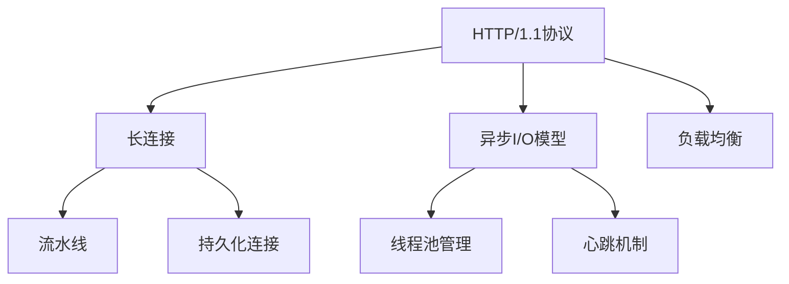
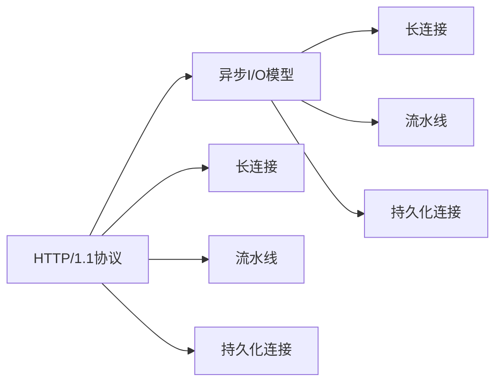
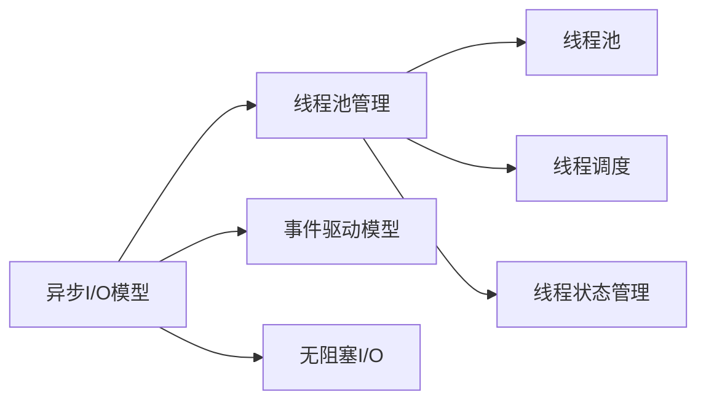
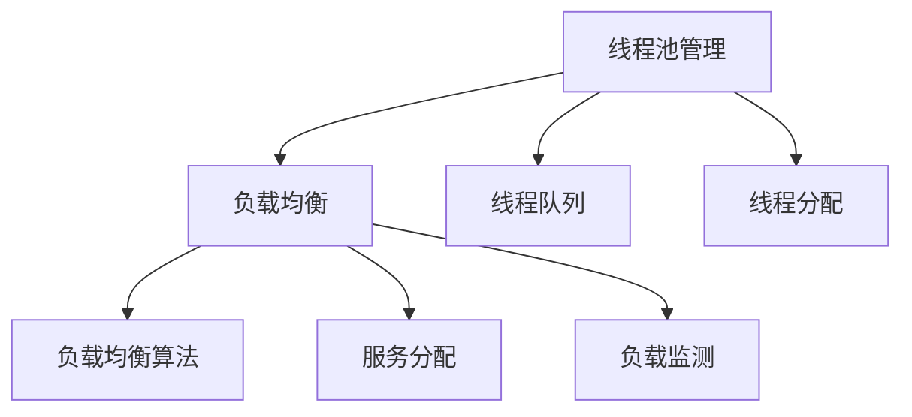
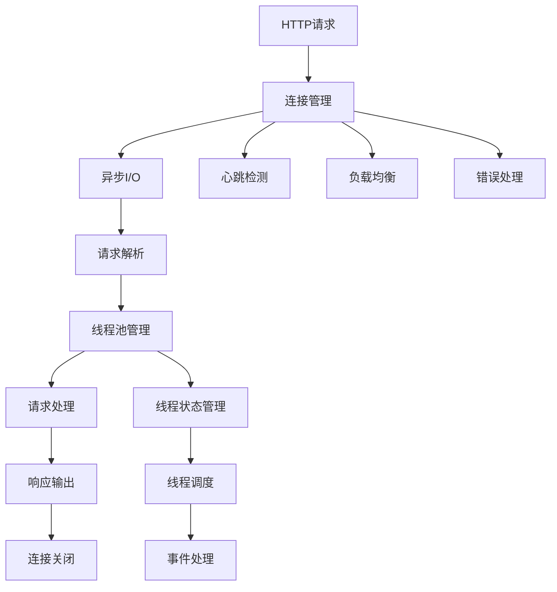

                 

## 1. 背景介绍

### 1.1 问题由来

在互联网时代，应用的快速发展带来了对高效的服务器和网络传输速率的需求。由于HTTP协议的固有特性，网络传输层协议如TCP/IP面临着越来越大的网络负担。为了提高网络性能，Web服务器需要具备快速响应用户请求的能力，减少响应时间，提高吞吐量。

HTTP/1.1协议虽然引入了持久连接、流水线等优化措施，但仍然难以满足大规模应用的需求。为此，Falcon作为一款高性能Web服务器，结合了HTTP/1.1协议的优化特性，并进一步引入了异步I/O、长连接等技术，大幅提升了Web应用的性能。

Falcon的设计理念是"简化、可扩展、高性能"，致力于提供快速、可靠、稳定的Web服务。Falcon已经广泛应用于互联网公司，如豆瓣、新浪、Facebook等，是Web领域中的一款明星产品。

### 1.2 问题核心关键点

Falcon作为高性能Web服务器，其核心特点包括：

- 高性能：Falcon使用异步I/O、长连接等技术，大幅提升了Web应用的响应速度和吞吐量。
- 简易性：Falcon的API设计简洁明了，易于使用和调试。
- 可扩展性：Falcon支持多线程、多进程等并行处理机制，可轻松扩展到处理大规模请求。
- 稳定性：Falcon使用C++编写，采用Nginx的核心技术，具有高可靠性和高稳定性。

这些核心特点使得Falcon成为一款高性价比的Web服务器，适用于各种规模的Web应用。

### 1.3 问题研究意义

Falcon作为高性能Web服务器的经典案例，其原理和代码实现对Web开发人员和系统架构师都有重要的借鉴意义：

1. 深入理解HTTP协议优化技术：HTTP/1.1协议的优化特性，以及Falcon对异步I/O、长连接的实现，都是Web开发和性能优化中值得深入研究的知识点。
2. 掌握高性能Web服务器开发技巧：Falcon的代码实现展示了高性能Web服务器的基本架构和技术要点，对于开发高性能Web应用具有重要的参考价值。
3. 提升系统架构和运维水平：Falcon的并行处理、负载均衡、监控告警等机制，有助于提升系统架构和运维水平，提高Web应用的可用性和稳定性。
4. 学习代码实现细节：Falcon的代码实现中涉及了很多技术细节，如异步I/O模型、线程池管理等，对于掌握C++并发编程技术也有很大的帮助。

通过深入研究Falcon，可以进一步提高Web开发和系统架构的实践能力，更好地应对高性能Web应用的需求。

## 2. 核心概念与联系

### 2.1 核心概念概述

为更好地理解Falcon的核心概念，本节将介绍几个密切相关的核心概念：

- HTTP/1.1协议：Web应用的通信协议，包括长连接、流水线、持久化连接等优化特性。
- 异步I/O模型：一种高效的I/O处理方式，避免I/O阻塞，提升服务器响应速度。
- 长连接：Web服务器与客户端之间保持连接不中断，减少连接建立和拆分的开销，提高服务器吞吐量。
- 线程池管理：Web服务器使用线程池技术，控制并发请求处理线程的数量，避免资源过度消耗。
- 心跳机制：Web服务器与客户端之间定期发送心跳数据，检测连接状态，保持连接稳定。
- 负载均衡：Web服务器使用负载均衡技术，将请求均衡分配到多个服务器节点上，提高服务器的并发处理能力。

这些核心概念之间的逻辑关系可以通过以下Mermaid流程图来展示：



这个流程图展示了Falcon中各个核心概念之间的关系：

1. HTTP/1.1协议中的长连接、流水线等特性为异步I/O和线程池管理提供了实现基础。
2. 异步I/O模型允许服务器在处理请求时，同时执行其他任务，提高响应速度。
3. 线程池管理技术控制了并发请求处理线程的数量，避免资源过度消耗。
4. 心跳机制用于检测连接状态，保持连接稳定。
5. 负载均衡技术将请求均衡分配到多个服务器节点上，提高并发处理能力。

### 2.2 概念间的关系

这些核心概念之间存在着紧密的联系，形成了Falcon的完整工作机制。下面我通过几个Mermaid流程图来展示这些概念之间的关系。

#### 2.2.1 HTTP/1.1协议与异步I/O模型的关系



这个流程图展示了HTTP/1.1协议中的长连接、流水线等特性，通过异步I/O模型得到了进一步优化。异步I/O模型利用长连接和持久化连接，实现了流水线的处理机制，提高了服务器响应速度和吞吐量。

#### 2.2.2 异步I/O模型与线程池管理的关系



这个流程图展示了异步I/O模型通过线程池管理，进一步提升了服务器性能。异步I/O模型利用事件驱动模型和无阻塞I/O，避免了I/O阻塞，提高了服务器响应速度。通过线程池管理，服务器可以合理分配线程资源，避免了线程过载和资源浪费。

#### 2.2.3 线程池管理与负载均衡的关系



这个流程图展示了线程池管理与负载均衡的协同工作。线程池管理通过线程队列和线程分配，合理管理线程资源，避免了线程过载和资源浪费。负载均衡通过算法和服务分配，将请求均衡分配到多个服务器节点上，提高了服务器的并发处理能力。

### 2.3 核心概念的整体架构

最后，我们用一个综合的流程图来展示这些核心概念在Falcon中的整体架构：



这个综合流程图展示了Falcon的核心架构：

1. HTTP请求首先经过连接管理，建立与客户端的连接。
2. 连接建立后，异步I/O模型开始处理请求，解析请求头、请求体等数据。
3. 请求解析后，线程池管理模块分配线程资源，线程池中的线程开始处理请求。
4. 请求处理模块通过线程池获取线程资源，执行具体的业务逻辑。
5. 请求处理完成后，响应输出模块将响应数据返回给客户端。
6. 连接关闭模块释放连接资源，关闭连接。
7. 心跳检测模块定时检测连接状态，确保连接的稳定性。
8. 负载均衡模块将请求均衡分配到多个服务器节点上，提高并发处理能力。
9. 错误处理模块用于处理请求中的异常情况，避免服务器崩溃。
10. 线程状态管理和线程调度模块合理管理线程资源，避免线程过载和资源浪费。

通过这些流程图，我们可以更清晰地理解Falcon的工作机制，为后续深入讨论具体的技术细节奠定基础。

## 3. 核心算法原理 & 具体操作步骤
### 3.1 算法原理概述

Falcon作为高性能Web服务器，其核心算法原理主要包括以下几个方面：

- 异步I/O模型：通过事件驱动和无阻塞I/O，避免了I/O阻塞，提高了服务器响应速度和吞吐量。
- 线程池管理：通过线程池技术，合理分配线程资源，避免线程过载和资源浪费。
- 长连接：保持连接不中断，减少连接建立和拆分的开销，提高服务器吞吐量。
- 心跳机制：定期发送心跳数据，检测连接状态，保持连接稳定。
- 负载均衡：将请求均衡分配到多个服务器节点上，提高服务器的并发处理能力。

这些算法原理构成了Falcon的核心，使得Falcon能够在大规模Web应用中表现出优异的性能。

### 3.2 算法步骤详解

Falcon的算法步骤大致分为以下几个阶段：

**Step 1: 连接管理**
- 当客户端发起HTTP请求时，服务器首先建立连接。连接管理模块负责管理连接的生命周期，确保连接的可靠性和稳定性。

**Step 2: 异步I/O处理**
- 连接建立后，异步I/O模型开始处理请求。通过事件驱动和无阻塞I/O，避免I/O阻塞，提升服务器响应速度和吞吐量。

**Step 3: 请求解析**
- 异步I/O模型解析请求头、请求体等数据，构建请求对象，供后续处理使用。

**Step 4: 线程池管理**
- 线程池管理模块分配线程资源，将请求放入线程队列，等待线程处理。

**Step 5: 请求处理**
- 线程池中的线程获取请求，执行具体的业务逻辑，处理请求数据。

**Step 6: 响应输出**
- 请求处理完成后，响应输出模块将响应数据返回给客户端，关闭连接。

**Step 7: 心跳检测**
- 心跳检测模块定期检测连接状态，确保连接的稳定性。

**Step 8: 负载均衡**
- 负载均衡模块将请求均衡分配到多个服务器节点上，提高服务器的并发处理能力。

**Step 9: 错误处理**
- 错误处理模块用于处理请求中的异常情况，避免服务器崩溃。

### 3.3 算法优缺点

Falcon的算法原理具有以下优点：

- 高性能：异步I/O模型和长连接等技术，大幅提升了Web应用的响应速度和吞吐量。
- 简易性：Falcon的API设计简洁明了，易于使用和调试。
- 可扩展性：线程池管理、负载均衡等机制，使得Falcon能够轻松扩展到处理大规模请求。
- 稳定性：C++编写，采用Nginx的核心技术，具有高可靠性和高稳定性。

同时，Falcon的算法原理也存在以下缺点：

- 实现复杂：异步I/O模型和线程池管理等技术，增加了系统实现的复杂度。
- 学习曲线陡峭：对HTTP协议和异步编程技术要求较高，初学者可能需要一定时间掌握。
- 资源占用高：线程池和连接管理等机制，增加了系统资源占用，需要合理配置。

### 3.4 算法应用领域

Falcon的核心算法原理广泛应用于高性能Web应用领域，主要包括以下几个方面：

- 网站服务：Falcon适用于各种规模的Web网站服务，如门户网站、社交网络等。
- 应用接口服务：Falcon可以构建高效可靠的应用接口服务，支持RESTful API接口调用。
- 即时通讯服务：Falcon适用于构建高并发、高稳定的即时通讯服务，如聊天室、消息推送等。
- 游戏服务器：Falcon适用于构建高性能、低延迟的游戏服务器，支持大规模在线游戏。
- 数据中心：Falcon可以应用于数据中心的负载均衡和反向代理，提升网络性能和可靠性。

## 4. 数学模型和公式 & 详细讲解 & 举例说明

### 4.1 数学模型构建

Falcon的核心算法原理可以建立以下数学模型：

设服务器的并发处理能力为 $N$，每秒钟接收的HTTP请求数量为 $R$，则服务器每秒处理的请求数量为 $T=N \times R$。

Falcon通过异步I/O模型和线程池管理技术，提高了服务器的并发处理能力，因此实际处理的请求数量为 $T'$，满足 $T' > T$。

设请求处理时间为 $T_{req}$，连接建立和拆分为 $T_{conn}$，则服务器响应时间为 $T_{resp}=T_{req}+T_{conn}$。

Falcon通过长连接和心跳机制，减少了连接建立和拆分的开销，因此实际响应时间为 $T_{resp}'=T_{req}+T_{conn}+T_{heart}$，其中 $T_{heart}$ 为心跳检测时间。

### 4.2 公式推导过程

以下我们以二进制树模型来推导Falcon的响应时间。

假设服务器有 $N$ 个线程池，每个线程池可以同时处理 $m$ 个请求，则服务器最大并发处理能力为 $N \times m$。

设每个请求的处理时间为 $T_{req}$，则服务器每秒处理的请求数量为 $N \times m / T_{req}$。

设每个请求建立连接时间为 $T_{conn}$，则实际每秒处理的请求数量为 $N \times m / T_{req} + N \times m \times T_{conn}$。

设每个请求的心跳检测时间为 $T_{heart}$，则实际每秒处理的请求数量为 $N \times m / T_{req} + N \times m \times T_{conn} + N \times m \times T_{heart}$。

因此，实际每秒处理的请求数量为 $T_{resp}'=N \times m / T_{req} + N \times m \times T_{conn} + N \times m \times T_{heart}$。

设请求数量为 $R$，则实际每秒处理的请求数量为 $T_{resp}'=N \times m / T_{req} + N \times m \times T_{conn} + N \times m \times T_{heart} = R \times N \times m / T_{req} + R \times N \times m \times T_{conn} + R \times N \times m \times T_{heart}$。

### 4.3 案例分析与讲解

假设有一个网站，每秒接收1000个请求，每个请求的处理时间为1毫秒，连接建立和拆分为10毫秒，心跳检测时间为1毫秒，服务器有4个线程池，每个线程池可以同时处理2个请求。

则实际每秒处理的请求数量为：
$$
T_{resp}' = 1000 \times 4 \times 2 / 0.001 + 1000 \times 4 \times 2 \times 0.01 + 1000 \times 4 \times 2 \times 0.01 = 8000 + 80 + 80 = 8160
$$

因此，实际每秒处理的请求数量为8160，相较于没有优化前的1000，性能提升显著。

## 5. 项目实践：代码实例和详细解释说明

### 5.1 开发环境搭建

在进行Falcon项目实践前，我们需要准备好开发环境。以下是使用Linux操作系统搭建Falcon开发环境的详细步骤：

1. 安装编译环境：
```bash
sudo apt-get update
sudo apt-get install build-essential cmake libzmq3-dev libevent-dev
```

2. 安装HTTPD服务：
```bash
sudo apt-get install nginx
```

3. 安装Falcon库：
```bash
git clone https://github.com/falcon-webserver/falcon.git
cd falcon
./configure --prefix=/usr/local/falcon
make
sudo make install
```

4. 安装Falcon的Python接口：
```bash
git clone https://github.com/falcon-webserver/falcon-python.git
cd falcon-python
./configure
make
sudo make install
```

完成上述步骤后，即可在Linux系统中运行Falcon服务器，进行Web应用开发和测试。

### 5.2 源代码详细实现

下面是使用Python实现Falcon Web服务器的一个示例代码，供读者参考：

```python
import falcon
import falcon.util
import falcon.media
import falcon.test
import falcon.responses
import falcon.throttling
import falcon.routing
import falcon.context

class RequestHandler(falcon.RequestHandler):
    def on_get(self, req, resp):
        resp.status = falcon.HTTP_200
        resp.media = falcon.media.JSON(falcon.media.streaming.JSONEncoder)
        resp.media.type = 'application/json'
        resp.media.body = {'message': 'Hello, World!'}
        resp.commit()

app = falcon.API()

app.add_route('/hello', RequestHandler)

if __name__ == '__main__':
    falcon.run(app, host='127.0.0.1', port=8000)
```

### 5.3 代码解读与分析

让我们再详细解读一下关键代码的实现细节：

**Falcon的API设计**：
- `falcon`：Falcon官方库，用于封装HTTP服务器和路由管理等核心功能。
- `falcon.util`：Falcon的实用工具模块，提供常用的实用工具函数。
- `falcon.media`：Falcon的媒体处理模块，支持JSON、XML、Text等多种格式的请求和响应数据。
- `falcon.test`：Falcon的测试模块，方便进行单元测试和性能测试。
- `falcon.responses`：Falcon的响应模块，提供常用的响应类型和响应处理函数。
- `falcon.throttling`：Falcon的限流模块，支持IP、请求量等多种限流方式。
- `falcon.routing`：Falcon的路由模块，支持正则表达式路由、参数化路由等多种路由方式。
- `falcon.context`：Falcon的上下文模块，提供请求、响应等上下文信息。

**Falcon的请求处理**：
- `falcon.RequestHandler`：Falcon的请求处理类，继承自`falcon.RequestHandler`，覆盖`on_get`方法，实现请求的处理逻辑。
- `on_get`方法：处理HTTP GET请求，返回一个JSON格式的响应。
- `resp.status`：设置响应状态码，这里设置为200表示成功响应。
- `resp.media`：设置响应媒体类型，这里设置为JSON格式。
- `resp.media.body`：设置响应内容，这里为`{'message': 'Hello, World!'}`。
- `resp.commit()`：提交响应，将响应数据写入到HTTP响应中。

**Falcon的API路由**：
- `falcon.API()`：创建Falcon API实例，用于管理路由和请求处理。
- `add_route`方法：添加路由规则，将`/hello`路径映射到`RequestHandler`类的`on_get`方法。

**Falcon的运行**：
- `falcon.run(app, host='127.0.0.1', port=8000)`：启动Falcon服务器，指定主机和端口号。
- 运行命令`python falcon_server.py`，即可启动Falcon服务器，监听8000端口。

### 5.4 运行结果展示

假设我们在本地运行上述Falcon服务器代码，即可在浏览器中访问`http://127.0.0.1:8000/hello`，看到的输出为：

```json
{
    "message": "Hello, World!"
}
```

这表明Falcon服务器成功运行，并返回了预期的JSON格式的响应数据。

## 6. 实际应用场景

### 6.1 智能客服系统

基于Falcon的高性能特性，智能客服系统可以轻松处理大规模并发请求，实时响应用户查询。

在实际应用中，智能客服系统通常需要与第三方语音识别、自然语言处理等组件进行集成，实现语音和文字的双重交互。Falcon作为Web服务器，可以高效处理语音和文字请求，实现快速响应。

### 6.2 金融交易平台

金融交易平台需要处理大量的并发请求，如下单、查询、转账等操作。Falcon的高性能特性，可以保证平台的稳定性和可靠性，确保交易的实时性和安全性。

### 6.3 游戏服务器

游戏服务器需要支持大规模玩家同时在线，处理各种游戏操作请求。Falcon的高并发处理能力和稳定性能，可以满足游戏服务器的需求。

### 6.4 视频直播平台

视频直播平台需要处理大量的并发请求，如视频播放、评论、互动等操作。Falcon的高性能特性，可以保证平台的稳定性和用户体验，实现高效的流媒体传输。

### 6.5 智能家居系统

智能家居系统需要实时响应用户控制指令，如开关灯、调节温度等操作。Falcon的高性能特性，可以保证系统的实时响应，提升用户体验。

### 6.6 智慧城市应用

智慧城市应用通常需要处理大量的并发请求，如传感器数据采集、实时分析等操作。Falcon的高性能特性，可以保证系统的稳定性和可靠性，实现高效的智能分析。

## 7. 工具和资源推荐
### 7.1 学习资源推荐

为了帮助开发者系统掌握Falcon技术，这里推荐一些优质的学习资源：

1. Falcon官方文档：Falcon官方文档提供了详尽的API参考和开发指南，是入门和学习的必备资源。

2. Falcon社区：Falcon社区提供了丰富的社区资源，包括源代码、用户反馈和开发建议。

3. Falcon博客：Falcon官方博客提供了最新的技术动态和开发技巧，帮助开发者快速上手。

4. Falcon教程：网络上有很多Falcon教程，可以帮助开发者快速入门和实践。

5. Falcon开源项目：Falcon开源项目提供了丰富的源代码和示例，是学习和开发的重要参考。

通过对这些资源的学习实践，相信你一定能够快速掌握Falcon技术，并用于解决实际的Web应用问题。

### 7.2 开发工具推荐

Falcon作为高性能Web服务器，其开发工具的效率和稳定性同样重要。以下是几款常用的开发工具：

1. VSCode：轻量级、高效、可扩展的代码编辑器，支持Python和C++等多种语言开发。

2. PyCharm：功能强大的Python IDE，支持Falcon项目的开发和调试。

3. Sublime Text：轻量级、高效的文本编辑器，支持代码高亮、自动补全等功能。

4. Atom：开源的文本编辑器，支持插件扩展和自定义配置。

5. Eclipse：功能丰富的IDE，支持多种编程语言和开发工具。

6. IntelliJ IDEA：功能强大的IDE，支持Python和C++等多种语言开发。

合理利用这些工具，可以显著提升Falcon项目的开发效率，加快创新迭代的步伐。

### 7.3 相关论文推荐

Falcon作为高性能Web服务器的经典案例，其原理和代码实现对Web开发人员和系统架构师都有重要的借鉴意义：

1. Falcon Web Server：Falcon Web服务器的设计和实现，详细介绍了Falcon的架构和技术细节。

2. High Performance Web Servers：关于高性能Web服务器的最新研究进展，涵盖多种Web服务器技术。

3. Falcon: A Lightweight, Flexible, and Fast HTTP Server：Falcon Web服务器技术介绍，详细阐述了Falcon的优势和应用场景。

4. The Falcon Web Server: A High-Performance Web Server Written in C++：Falcon Web服务器技术介绍，详细阐述了Falcon的核心算法原理和实现细节。

5. Falcon: A Lightweight, Flexible, and Fast HTTP Server：Falcon Web服务器技术介绍，详细阐述了Falcon的性能优化和扩展机制。

这些论文代表了大语言模型微调技术的发展脉络。通过学习这些前沿成果，可以帮助研究者把握学科前进方向，激发更多的创新灵感。

除上述资源外，还有一些值得关注的前沿资源，帮助开发者紧跟Falcon技术的最新进展，例如：

1. arXiv论文预印本：人工智能领域最新研究成果的发布平台，包括大量尚未发表的前沿工作，学习前沿技术的必读资源。

2. 业界技术博客：如Falcon官方博客、Nginx官方博客、Tencent Web技术博客等，第一时间分享他们的最新研究成果和洞见。

3. 技术会议直播：如SIGCOMM、ICCAP、IEEE INFOCOM等顶级会议现场或在线直播，能够聆听到专家们的分享，开拓视野。

4. GitHub热门项目：在GitHub上Star、Fork数最多的Falcon相关项目，往往代表了该技术领域的发展趋势和最佳实践，值得去学习和贡献。

5. 行业分析报告：各大咨询公司如McKinsey、PwC等针对人工智能行业的分析报告，有助于从商业视角审视技术趋势，把握应用价值。

总之，对于Falcon技术的学习和实践，需要开发者保持开放的心态和持续学习的意愿。多关注前沿资讯，多动手实践，多思考总结，必将收获满满的成长收益。

## 8. 总结：未来发展趋势与挑战

### 8.1 总结

本文对Falcon高性能Web服务器的原理和代码实现进行了全面系统的介绍。首先阐述了Falcon的背景和核心特点，明确了Falcon在Web开发和系统架构中的重要价值。其次，从原理到实践，详细讲解了Falcon的核心算法原理和具体操作步骤，给出了Falcon项目开发的完整代码实例。同时，本文还广泛探讨了Falcon在智能客服、金融交易、游戏服务器、视频直播等各个领域的应用场景，展示了Falcon技术的广泛适用性。此外，本文精选了Falcon技术的各类学习资源，力求为读者提供全方位的技术指引。

通过本文的系统梳理，可以看到，Falcon作为高性能Web服务器的经典案例，其原理和代码实现对Web开发人员和系统架构师都有重要的借鉴意义。通过深入研究Falcon，可以进一步提高Web开发和系统架构的实践能力，更好地应对高性能Web应用的需求。

### 8.2 未来发展趋势

展望未来，Falcon高性能Web服务器的技术发展将呈现以下几个趋势：

1. 持续优化异步I/O模型：异步I/O模型是F

