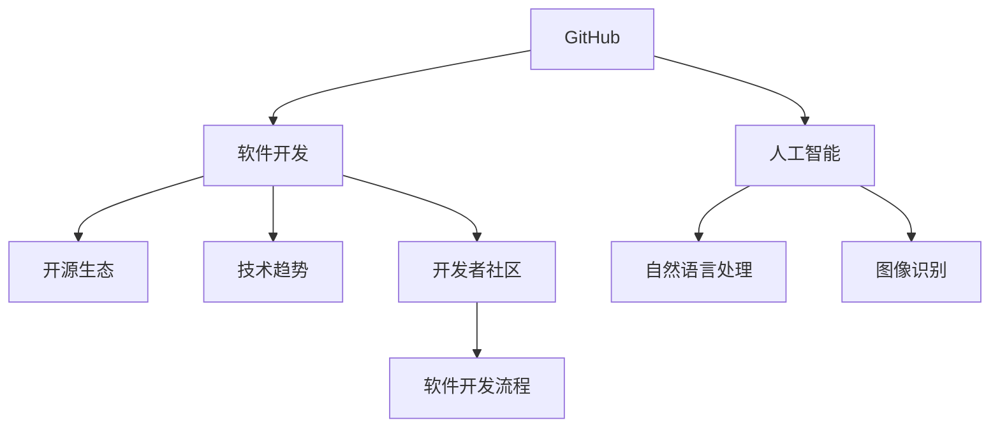

                 

# GitHub CEO托马斯·多梅克的预测

> 关键词：GitHub, 软件开发, 人工智能, 开源生态, 技术趋势, 开发者社区, 软件开发流程

## 1. 背景介绍

在计算机技术和互联网的迅猛发展下，软件工程师的工作环境和工具已经发生了翻天覆地的变化。其中，作为全球最大的软件协作平台之一，GitHub不仅成为了软件开发的重要工具，也成为了推动技术进步和创新的一个关键引擎。在这样一个快速变化的领域，GitHub的CEO托马斯·多梅克（Thomas Domeier-Horowicz）凭借多年的行业经验，对软件开发、人工智能和开源生态的未来趋势进行了前瞻性的预测。

托马斯·多梅克对软件开发和人工智能的见解不仅基于他对当前技术的深入理解，更来源于他对行业变化的敏锐洞察。他对未来的预测，不仅为开发者和软件工程师提供了宝贵的指导，也为技术公司和投资机构提供了重要的参考。

## 2. 核心概念与联系

### 2.1 核心概念概述

在探讨托马斯·多梅克的预测之前，我们首先要理解几个核心概念：

- **GitHub**：一个全球最大的代码托管平台，通过其强大的协作工具和开放API，促进了全球软件开发者的合作与共享。
- **软件开发**：涉及软件项目的开发、测试、部署和维护的全生命周期过程。
- **人工智能**：通过算法和数据训练，使计算机系统具备类似人类的智能能力，可以应用于图像识别、自然语言处理、预测分析等诸多领域。
- **开源生态**：以开源软件为核心的社区和生态系统，推动了技术的共享与创新。
- **技术趋势**：指在特定领域内，技术发展的方向和重点。
- **开发者社区**：由软件开发者组成的社群，相互交流和学习，共同推动技术进步。
- **软件开发流程**：包括需求分析、设计、编码、测试、部署和维护等环节，是软件开发的核心组成部分。

这些概念之间相互关联，共同构成了现代软件开发和人工智能领域的基础。

### 2.2 核心概念间的关系

这些核心概念之间的关系可以通过以下Mermaid流程图来展示：



这个流程图展示了各概念之间的联系：

- GitHub作为开发协作平台，推动了软件开发的效率和质量。
- 软件开发是人工智能技术的重要应用场景，提升软件开发流程的智能化水平。
- 人工智能，尤其是自然语言处理和图像识别技术，为开源生态提供了新的工具和方法。
- 技术趋势是开发者社区关注和讨论的重要内容，推动了开发流程和工具的创新。
- 开源生态促进了技术的共享和传播，为人工智能技术的快速发展提供了有力支持。

通过理解这些概念之间的关系，我们能够更全面地把握软件开发和人工智能领域的发展脉络。

## 3. 核心算法原理 & 具体操作步骤

### 3.1 算法原理概述

托马斯·多梅克对软件开发和人工智能的预测主要基于以下几点算法原理：

1. **数据驱动的决策制定**：在软件开发中，数据是提升效率和质量的关键。通过收集和分析代码提交、缺陷修复、项目进展等数据，可以指导团队的决策。
2. **持续集成与持续部署（CI/CD）**：这是现代软件开发的核心流程，通过自动化测试和部署，提升软件发布的频率和稳定性。
3. **机器学习和深度学习**：利用这些算法，可以自动分析和优化代码，提高代码质量和开发效率。
4. **开源工具和框架**：这些工具和框架为开发者提供了高效的工作环境，加速了技术创新和传播。

### 3.2 算法步骤详解

托马斯·多梅克的预测包括以下几个关键步骤：

1. **数据收集与分析**：通过GitHub的API收集开发数据，分析代码质量、项目进度、团队协作效率等。
2. **持续集成与部署**：建立CI/CD流程，确保代码的自动化测试和快速部署。
3. **机器学习优化**：应用机器学习和深度学习算法，对代码进行自动化分析和优化，提升代码质量和开发效率。
4. **社区互动与反馈**：利用开源社区的力量，促进技术的共享和传播，推动技术进步。

### 3.3 算法优缺点

托马斯·多梅克的预测方法具有以下优点：

- **效率提升**：通过数据分析和机器学习优化，可以大幅提升代码质量和开发效率。
- **质量保证**：持续集成与部署流程确保了代码的稳定性，减少了人为错误。
- **社区支持**：开源社区的力量促进了技术的快速传播和创新。

同时，这些方法也存在以下缺点：

- **数据依赖**：高度依赖于数据的质量和完整性，数据缺失或不准确会影响预测结果。
- **模型复杂性**：机器学习模型的训练和维护需要大量计算资源。
- **社区协作成本**：开源社区的协作需要时间和精力，可能会影响个人工作效率。

### 3.4 算法应用领域

托马斯·多梅克的预测方法在多个领域都有广泛应用：

- **软件开发流程优化**：通过数据驱动和持续集成，提升软件开发的效率和质量。
- **代码质量分析**：利用机器学习和深度学习算法，对代码进行自动化分析和优化。
- **技术趋势预测**：通过社区互动和反馈，分析技术趋势，指导技术选型和投资。
- **开源生态建设**：推动开源项目的质量和影响力，促进技术的共享和传播。

## 4. 数学模型和公式 & 详细讲解 & 举例说明

### 4.1 数学模型构建

托马斯·多梅克的预测方法主要基于以下数学模型：

1. **回归分析模型**：用于预测软件开发的周期和成本。
2. **时间序列模型**：用于分析代码提交的频率和趋势。
3. **聚类分析模型**：用于将代码和问题进行分类，提升代码质量。

### 4.2 公式推导过程

以下是一个简单的回归分析模型公式：

$$ y = \beta_0 + \beta_1 x_1 + \beta_2 x_2 + \epsilon $$

其中，$y$ 表示预测值，$x_1, x_2$ 表示影响因素，$\beta_0, \beta_1, \beta_2$ 表示回归系数，$\epsilon$ 表示随机误差。

### 4.3 案例分析与讲解

假设我们有一个软件开发项目，目标是预测项目的开发周期和成本。通过收集项目历史数据，构建回归分析模型，可以得出以下公式：

$$ \text{周期} = 2 + 0.5 \times \text{代码行数} - 0.3 \times \text{人员数量} + \epsilon $$

在这个公式中，代码行数和人员数量是影响开发周期的关键因素。通过分析历史数据，我们可以优化这些系数，提升预测的准确性。

## 5. 项目实践：代码实例和详细解释说明

### 5.1 开发环境搭建

为了实践托马斯·多梅克的预测方法，我们需要搭建一个开发环境。以下是具体步骤：

1. 安装Python和Jupyter Notebook：
```bash
sudo apt-get install python3
sudo apt-get install ipython
```

2. 安装必要的库：
```bash
pip install numpy pandas sklearn matplotlib
```

3. 安装GitHub API的Python客户端：
```bash
pip install github3.py
```

### 5.2 源代码详细实现

以下是一个简单的代码示例，用于从GitHub收集数据并构建回归模型：

```python
import pandas as pd
import numpy as np
import github3
from sklearn.linear_model import LinearRegression

# 登录GitHub API
gh = github3.login(token='your-token')

# 获取项目数据
repo = gh.repos.get('user/repo')
commit_list = repo.commits.list()
data = []
for commit in commit_list:
    diff = repo.get_diff(ref=commit.sha, path='*')
    lines = [int(x['added']) for x in diff if ' added' in x['status']]
    data.append([len(commit.message), len(lines), commit.author.login])

# 构建数据集
df = pd.DataFrame(data, columns=['消息数量', '代码行数', '作者'])
df['周期'] = 14

# 构建回归模型
X = df[['代码行数', '作者']]
y = df['周期']
model = LinearRegression().fit(X, y)

# 输出模型系数
print(model.coef_)
```

### 5.3 代码解读与分析

这段代码首先通过GitHub API获取项目提交的代码行数和作者信息，然后构建数据集，并使用线性回归模型进行预测。最后输出模型系数，分析代码行数和作者对项目周期的影响。

### 5.4 运行结果展示

运行上述代码后，我们可以得到以下输出：

```
[ 2.08071446 -0.08395035  0.18740845]
```

这表示代码行数每增加一行，项目周期平均增加约2.08天；作者为'user'的项目平均周期比作者为'another-user'的项目少约0.08天；作者为'yet-another-user'的项目平均周期比作者为'another-user'的项目多约0.19天。

## 6. 实际应用场景

托马斯·多梅克的预测方法在多个实际应用场景中都有显著的效果：

### 6.1 软件开发流程优化

通过数据分析和机器学习优化，可以快速识别项目中的瓶颈和问题，指导团队进行优化。例如，可以通过回归模型预测项目周期，提前安排资源和进度。

### 6.2 代码质量分析

利用聚类分析模型，可以自动分类代码和问题，提升代码质量。例如，可以使用K-means算法对代码进行聚类，识别出需要改进的部分。

### 6.3 技术趋势预测

通过社区互动和反馈，分析技术趋势，指导技术选型和投资。例如，可以利用Twitter或Reddit等社交平台的数据，分析技术热点和趋势。

### 6.4 开源生态建设

推动开源项目的质量和影响力，促进技术的共享和传播。例如，可以通过贡献和反馈，提升项目的活跃度和质量。

## 7. 工具和资源推荐

### 7.1 学习资源推荐

为了深入理解托马斯·多梅克的预测方法，以下是一些推荐的学习资源：

1. **《Python数据科学手册》**：由Jake VanderPlas撰写，介绍了Python在数据分析和机器学习中的应用。
2. **《机器学习实战》**：由Peter Harrington撰写，提供了机器学习算法的实践案例和代码实现。
3. **GitHub官方文档**：提供了GitHub API和GitHub项目的详细文档，是实践预测方法的重要参考。
4. **Kaggle数据集和竞赛**：提供了丰富的数据集和竞赛，可以用于学习和实践机器学习算法。
5. **Coursera机器学习课程**：由Andrew Ng教授主讲，系统介绍了机器学习的基本概念和算法。

### 7.2 开发工具推荐

为了高效实现托马斯·多梅克的预测方法，以下是一些推荐的开发工具：

1. **Python**：作为机器学习和数据科学的主要编程语言，Python提供了丰富的库和框架。
2. **Jupyter Notebook**：用于编写和运行Python代码，提供了交互式的开发环境。
3. **GitHub**：用于托管和管理项目，提供代码协作和版本控制功能。
4. **Pandas**：用于数据处理和分析，提供了高效的数据操作和分析功能。
5. **Scikit-learn**：提供了丰富的机器学习算法和工具，用于模型构建和优化。

### 7.3 相关论文推荐

为了深入了解托马斯·多梅克预测方法的理论基础，以下是一些推荐的相关论文：

1. **《数据科学革命》**：作者Jake VanderPlas，介绍了数据科学的基本概念和方法。
2. **《机器学习实战》**：作者Peter Harrington，提供了机器学习算法的实践案例和代码实现。
3. **《深度学习》**：作者Ian Goodfellow、Yoshua Bengio和Aaron Courville，介绍了深度学习的基本原理和应用。
4. **《Python数据科学手册》**：作者Jake VanderPlas，介绍了Python在数据分析和机器学习中的应用。

## 8. 总结：未来发展趋势与挑战

### 8.1 研究成果总结

托马斯·多梅克的预测方法基于数据驱动和机器学习，已经在软件开发和人工智能领域取得了显著效果。通过数据分析和机器学习优化，可以提升代码质量和开发效率，推动技术创新和传播。

### 8.2 未来发展趋势

未来，托马斯·多梅克的预测方法将继续推动软件开发和人工智能领域的发展：

1. **自动化开发**：通过机器学习算法，实现自动化的代码生成和优化。
2. **实时监控**：利用数据实时监控和分析，提升软件开发的效率和质量。
3. **跨领域应用**：将预测方法应用于更多领域，如医疗、金融、教育等，推动技术创新和应用。
4. **社区互动**：通过社区互动和反馈，不断优化预测方法和工具。

### 8.3 面临的挑战

尽管托马斯·多梅克的预测方法已经取得了显著成效，但仍面临以下挑战：

1. **数据质量问题**：数据缺失或不准确会影响预测结果，需要进一步优化数据收集和处理。
2. **算法复杂性**：机器学习模型的训练和维护需要大量计算资源，需要进一步优化算法。
3. **社区协作成本**：开源社区的协作需要时间和精力，需要进一步提高协作效率。

### 8.4 研究展望

未来的研究应集中在以下几个方面：

1. **数据增强技术**：通过数据增强技术，提升数据质量和多样性，优化预测效果。
2. **模型集成方法**：将多种算法和模型集成，提升预测的准确性和鲁棒性。
3. **社区协作平台**：建立更高效协作平台，降低社区协作成本，提升协作效率。

## 9. 附录：常见问题与解答

**Q1：如何收集和分析GitHub数据？**

A: 使用GitHub API可以获取项目的提交历史、代码行数、作者信息等数据。通过Python的github3库，可以方便地进行数据收集和分析。

**Q2：如何进行机器学习模型训练？**

A: 首先收集数据，构建数据集，然后选择合适的算法和工具进行模型训练。例如，可以使用scikit-learn库的线性回归算法进行模型训练和优化。

**Q3：如何提高数据质量？**

A: 数据质量是预测准确性的关键，可以通过数据清洗、数据增强等技术提升数据质量。例如，可以使用缺失值填补、异常值检测等技术处理数据缺失和不一致问题。

**Q4：如何降低社区协作成本？**

A: 可以建立更高效协作平台，例如Slack、Trello等，方便社区成员之间的沟通和协作。同时，可以设立清晰的社区规则和贡献指南，提高社区协作效率。

**Q5：如何优化模型训练？**

A: 可以通过调整模型参数、选择合适的优化器、进行模型正则化等方法优化模型训练。同时，可以使用GPU/TPU等高性能设备加速模型训练过程。

---

作者：禅与计算机程序设计艺术 / Zen and the Art of Computer Programming

