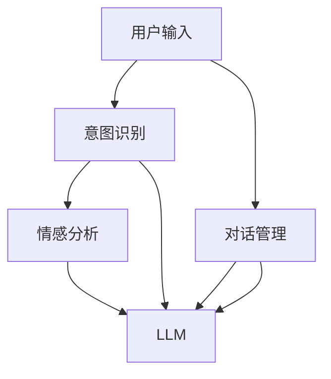
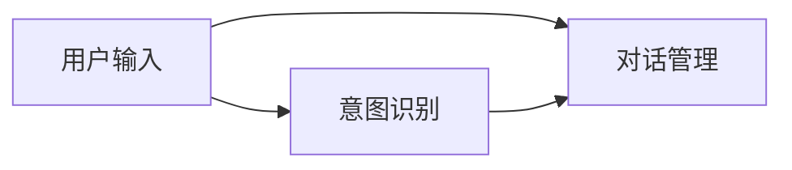
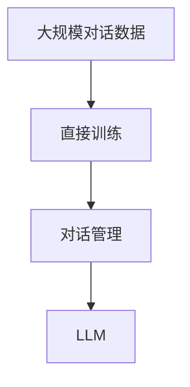
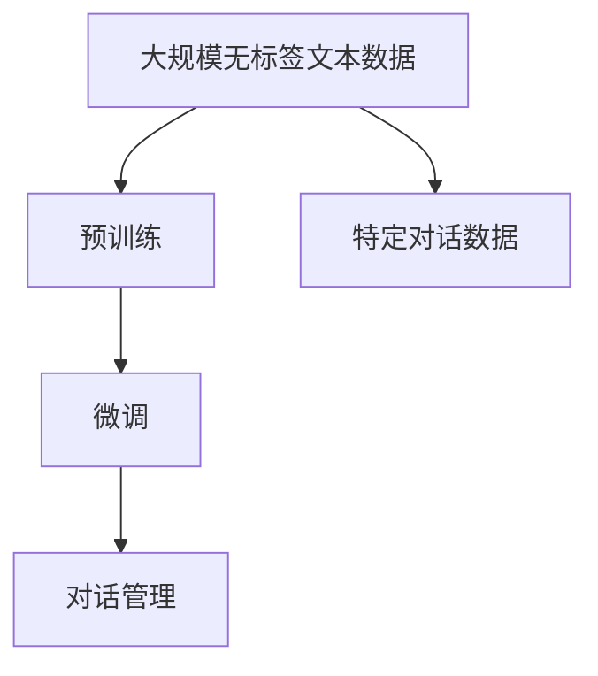

                 

# LLM-based Chatbot System Architecture

> 关键词：自然语言处理(NLP), 大语言模型(LLM), 聊天机器人, 深度学习, 对话系统, 情感分析, 意图识别, 用户意图, 对话管理, 系统架构, 机器学习, 人工智能(AI)

## 1. 背景介绍

### 1.1 问题由来

随着人工智能技术的迅猛发展，自然语言处理(NLP)成为推动智能化进程的关键技术之一。聊天机器人作为NLP的一个重要应用领域，已经广泛应用于客户服务、智能助手、教育培训等多个场景。然而，传统的基于规则和模板的聊天机器人难以应对自然语言输入的复杂性和多样性，容易陷入固定逻辑和错误解。

为了提升聊天机器人的智能化水平，研究者们开始探索基于深度学习的大语言模型(LLM)在聊天机器人中的应用。大语言模型通过在海量文本数据上进行预训练，具备强大的语言理解能力和生成能力，可以显著提升聊天机器人的交互效果和智能水平。

### 1.2 问题核心关键点

基于大语言模型的聊天机器人，通常采用两种主要架构：

1. **预训练-微调架构**：先在大规模无标签文本数据上预训练大语言模型，然后在特定对话数据上微调，使其能够针对具体对话任务进行优化。

2. **直接训练架构**：直接在大规模对话数据上训练大语言模型，无需单独的预训练和微调过程。

这两种架构各有优缺点，预训练-微调架构更加通用灵活，但需要较大的标注数据和计算资源；而直接训练架构则能够利用大规模对话数据，但需要更复杂的模型结构和更长的训练时间。

### 1.3 问题研究意义

大语言模型在聊天机器人中的应用，具有重要研究意义：

1. **提升交互体验**：大语言模型能够理解自然语言输入，提供更自然、流畅的对话体验，增强用户黏性。
2. **实现个性化服务**：通过微调或直接训练，聊天机器人可以针对不同用户和场景提供个性化响应，提升用户满意度。
3. **降低开发成本**：基于大语言模型，无需大量规则和模板编写，大幅降低系统开发和维护成本。
4. **推动技术创新**：大语言模型技术不断进步，推动了NLP领域的创新发展，为聊天机器人提供了更先进的基础模型。

## 2. 核心概念与联系

### 2.1 核心概念概述

为更好地理解基于大语言模型的聊天机器人架构，本节将介绍几个关键概念：

- **大语言模型(LLM)**：通过自监督或监督学习在大规模文本数据上预训练得到的模型，具备强大的语言理解和生成能力。
- **预训练-微调架构**：先在大规模无标签文本数据上预训练大语言模型，然后在特定对话数据上微调，使其适应特定对话任务。
- **直接训练架构**：在大规模对话数据上直接训练大语言模型，无需单独的预训练和微调过程。
- **对话管理**：基于对话流程和用户意图，管理对话流，实现智能交互。
- **用户意图识别**：识别用户输入的意图，指导对话管理过程。
- **情感分析**：分析用户情感状态，调整对话策略，提升用户体验。

这些概念之间的逻辑关系可以通过以下Mermaid流程图来展示：



这个流程图展示了大语言模型在聊天机器人中的作用以及与用户输入、意图识别、情感分析、对话管理的联系。

### 2.2 概念间的关系

这些核心概念之间存在着紧密的联系，形成了基于大语言模型的聊天机器人架构。下面我通过几个Mermaid流程图来展示这些概念之间的关系。

#### 2.2.1 对话管理与意图识别



这个流程图展示了意图识别和对话管理的关系。意图识别用于识别用户输入的意图，指导对话管理过程，从而实现智能交互。

#### 2.2.2 直接训练架构



这个流程图展示了直接训练架构的流程。在大规模对话数据上直接训练大语言模型，无需单独的预训练和微调过程，直接应用于对话管理。

#### 2.2.3 预训练-微调架构



这个流程图展示了预训练-微调架构的流程。在大规模无标签文本数据上预训练大语言模型，然后在特定对话数据上微调，使其适应特定对话任务，应用于对话管理。

### 2.3 核心概念的整体架构

最后，我们用一个综合的流程图来展示这些核心概念在大语言模型聊天机器人中的整体架构：

```mermaid
graph TB
    A[大规模文本数据] --> B[预训练]
    B --> C[大语言模型(LLM)]
    C --> D[意图识别]
    D --> E[情感分析]
    E --> F[对话管理]
    F --> G[用户输出]
```

这个综合流程图展示了从预训练到微调，再到对话管理的完整过程。大语言模型通过预训练获得基础能力，在特定对话数据上进行微调，然后应用于对话管理，最终生成用户输出。通过这些流程图，我们可以更清晰地理解基于大语言模型的聊天机器人架构，为后续深入讨论具体的架构设计和优化提供基础。

## 3. 核心算法原理 & 具体操作步骤

### 3.1 算法原理概述

基于大语言模型的聊天机器人架构，本质上是一个通过自然语言理解(NLU)和自然语言生成(NLG)实现人机交互的复杂系统。其核心算法原理包括以下几个方面：

1. **自然语言理解(NLU)**：将用户输入的自然语言转化为结构化表示，识别出用户的意图和情感状态。
2. **自然语言生成(NLG)**：根据对话管理策略，生成自然语言响应，提供智能交互。
3. **对话管理**：基于用户意图和对话上下文，动态调整对话流程，实现智能交互。

这些核心算法原理通过大语言模型实现，大语言模型通过预训练和微调过程，具备强大的语言理解和生成能力，能够有效处理复杂多变的自然语言输入。

### 3.2 算法步骤详解

基于大语言模型的聊天机器人架构，一般包括以下几个关键步骤：

**Step 1: 准备数据集**
- 收集大规模无标签文本数据，用于大语言模型的预训练。
- 收集特定领域的对话数据集，用于大语言模型的微调。
- 处理数据集，进行预处理和标注，为模型训练提供数据支持。

**Step 2: 模型选择与预训练**
- 选择合适的大语言模型架构，如Transformer、BERT等。
- 在大规模无标签文本数据上进行预训练，学习语言的通用表示。
- 在预训练过程中，使用自监督任务如掩码语言模型、下一句子预测等，增强模型的语言理解能力。

**Step 3: 微调与优化**
- 选择适当的微调策略，如全参数微调、参数高效微调等。
- 在特定对话数据集上微调大语言模型，使其适应特定对话任务。
- 优化模型的超参数，如学习率、批次大小、迭代轮数等，提升模型效果。
- 使用正则化技术，如L2正则、Dropout、Early Stopping等，防止过拟合。

**Step 4: 对话管理与响应生成**
- 在微调后的模型基础上，设计对话管理策略。
- 基于用户意图和情感分析结果，动态调整对话流程。
- 根据对话管理策略，生成自然语言响应，返回给用户。
- 通过模型训练和数据增强，持续优化对话管理策略，提升用户体验。

**Step 5: 部署与测试**
- 将微调后的模型部署到实际应用环境中，进行测试。
- 评估模型的对话效果，收集用户反馈，进行模型优化。
- 持续收集用户交互数据，不断优化模型和对话管理策略。

### 3.3 算法优缺点

基于大语言模型的聊天机器人架构具有以下优点：

1. **灵活性高**：通过预训练和微调，模型可以适应不同领域和任务，具备较高的通用性和灵活性。
2. **性能优异**：大语言模型具备强大的语言理解和生成能力，可以提供更自然、流畅的对话体验。
3. **可扩展性强**：通过模块化设计，系统可以方便地扩展和定制，满足不同应用需求。
4. **可维护性好**：通过预训练和微调过程，减少了规则和模板的编写和维护工作，系统更易于维护。

但该架构也存在一些缺点：

1. **计算资源需求高**：大语言模型的预训练和微调过程需要大量计算资源和标注数据，成本较高。
2. **模型复杂度高**：大语言模型的参数量较大，推理速度较慢，需要更高的计算资源。
3. **鲁棒性不足**：模型在面对噪声数据和异常输入时，可能产生不稳定的输出。
4. **安全性问题**：模型可能学习到有害信息和偏见，输出不安全或歧视性的内容。
5. **可解释性差**：模型的决策过程难以解释，缺乏透明度和可审计性。

### 3.4 算法应用领域

基于大语言模型的聊天机器人架构，已经在多个领域得到了广泛应用，例如：

1. **客户服务**：应用于在线客服系统，提供24小时不间断服务，提升客户满意度。
2. **智能助手**：应用于智能音箱、车载系统等，提供个性化服务，提升用户体验。
3. **教育培训**：应用于在线教育平台，提供智能答疑和个性化学习推荐。
4. **医疗健康**：应用于智能健康咨询系统，提供疾病诊断和健康建议。
5. **金融服务**：应用于智能理财顾问系统，提供个性化投资建议。

这些应用领域展示了基于大语言模型的聊天机器人架构的广泛应用前景，进一步推动了人工智能技术在实际场景中的落地。

## 4. 数学模型和公式 & 详细讲解 & 举例说明

### 4.1 数学模型构建

在大语言模型聊天机器人架构中，数学模型主要涉及自然语言理解和自然语言生成两个方面。以下是具体的数学模型构建：

#### 4.1.1 自然语言理解(NLU)

自然语言理解的目标是将用户输入的自然语言转化为结构化表示，识别出用户的意图和情感状态。常见的NLU模型包括序列标注模型、文本分类模型等。

假设用户输入为 $x = (x_1, x_2, ..., x_n)$，其中 $x_i$ 为单词或词组。模型的输出为 $y = (y_1, y_2, ..., y_n)$，其中 $y_i$ 表示单词或词组的标签，如意图标签、情感标签等。

NLU模型的目标是最大化似然函数：

$$
\mathcal{L} = -\frac{1}{N}\sum_{i=1}^N \log p(y|x)
$$

其中 $p(y|x)$ 为条件概率，表示给定输入 $x$ 的情况下，输出 $y$ 的概率。

#### 4.1.2 自然语言生成(NLG)

自然语言生成的目标是根据对话管理策略，生成自然语言响应。常见的NLG模型包括生成对抗网络(GAN)、变分自编码器(VAE)等。

假设模型需要生成的自然语言响应为 $y = (y_1, y_2, ..., y_n)$，其中 $y_i$ 为单词或词组。模型的输出为 $z = (z_1, z_2, ..., z_n)$，其中 $z_i$ 表示单词或词组的概率分布。

NLG模型的目标是最大化似然函数：

$$
\mathcal{L} = -\frac{1}{N}\sum_{i=1}^N \log p(y|x)
$$

其中 $p(y|x)$ 为条件概率，表示给定输入 $x$ 的情况下，输出 $y$ 的概率。

### 4.2 公式推导过程

以下是自然语言理解和自然语言生成两个方面的公式推导过程：

#### 4.2.1 自然语言理解(NLU)

假设我们使用序列标注模型进行意图识别，模型的输出为 $y = (y_1, y_2, ..., y_n)$，其中 $y_i$ 表示单词或词组的意图标签。

模型通过长短时记忆网络(LSTM)或卷积神经网络(CNN)等结构，将输入 $x = (x_1, x_2, ..., x_n)$ 转化为向量表示 $h_1, h_2, ..., h_n$，然后通过全连接层和softmax层进行意图标签的预测：

$$
h_i = LSTM(x_i, h_{i-1})
$$

$$
y_i = softmax(W_h h_i + b_h)
$$

其中 $W_h$ 和 $b_h$ 为全连接层的权重和偏置项。

#### 4.2.2 自然语言生成(NLG)

假设我们使用变分自编码器(VAE)进行自然语言生成，模型的输出为 $y = (y_1, y_2, ..., y_n)$，其中 $y_i$ 表示单词或词组。

模型通过编码器将输入 $x = (x_1, x_2, ..., x_n)$ 转化为隐变量 $z$，然后通过解码器将隐变量 $z$ 转化为自然语言响应 $y$：

$$
z = ENC(x; \theta_E)
$$

$$
y = DEC(z; \theta_D)
$$

其中 $ENC$ 和 $DEC$ 分别为编码器和解码器，$\theta_E$ 和 $\theta_D$ 为模型的权重。

### 4.3 案例分析与讲解

#### 4.3.1 意图识别

假设我们使用序列标注模型进行意图识别，输入为 "请问怎么前往最近的地铁口？"。

首先，将输入 $x = (问, 怎么, 前往, 最近的, 地铁口, ?)$ 转化为向量表示 $h_1, h_2, ..., h_6$，然后通过全连接层和softmax层进行意图标签的预测：

$$
h_1 = LSTM(问)
$$

$$
h_2 = LSTM(怎么)
$$

$$
h_3 = LSTM(前往)
$$

$$
h_4 = LSTM(最近的)
$$

$$
h_5 = LSTM(地铁口)
$$

$$
h_6 = LSTM(?)
$$

$$
y = softmax(W_h [h_1; h_2; h_3; h_4; h_5; h_6] + b_h)
$$

根据预测结果 $y = (询问, 前往, 最近, 地铁口, ?)$，我们可以确定用户的意图为 "询问路线"。

#### 4.3.2 自然语言生成

假设我们使用变分自编码器(VAE)进行自然语言生成，输入为 "如何计算个人所得税？"。

首先，将输入 $x = (如何, 计算, 个人所得税, ?)$ 转化为隐变量 $z$，然后通过解码器生成自然语言响应 $y = (计算个人所得税, 的, 步骤, 和方法)$：

$$
z = ENC(x; \theta_E)
$$

$$
y = DEC(z; \theta_D)
$$

通过解码器的输出 $y = (计算个人所得税, 的, 步骤, 和方法)$，我们可以生成自然语言响应 "计算个人所得税的步骤和方法"。

## 5. 项目实践：代码实例和详细解释说明

### 5.1 开发环境搭建

在进行基于大语言模型的聊天机器人开发前，我们需要准备好开发环境。以下是使用Python进行TensorFlow和Keras开发的环境配置流程：

1. 安装Anaconda：从官网下载并安装Anaconda，用于创建独立的Python环境。

2. 创建并激活虚拟环境：
```bash
conda create -n tf-env python=3.7 
conda activate tf-env
```

3. 安装TensorFlow和Keras：
```bash
pip install tensorflow==2.4
pip install keras
```

4. 安装其他依赖库：
```bash
pip install numpy scipy matplotlib scikit-learn pandas
```

完成上述步骤后，即可在`tf-env`环境中开始基于大语言模型的聊天机器人开发。

### 5.2 源代码详细实现

这里以一个简单的基于序列标注模型的意图识别和自然语言生成为例，给出TensorFlow和Keras代码实现。

```python
import tensorflow as tf
from tensorflow.keras.layers import Input, LSTM, Dense, Embedding
from tensorflow.keras.models import Model

# 定义输入层
input_layer = Input(shape=(max_seq_len,), dtype='int32')

# 定义LSTM层
lstm_layer = LSTM(units=128)(input_layer)

# 定义全连接层
dense_layer = Dense(units=num_labels, activation='softmax')(lstm_layer)

# 定义模型
model = Model(inputs=input_layer, outputs=dense_layer)

# 编译模型
model.compile(optimizer='adam', loss='categorical_crossentropy', metrics=['accuracy'])

# 训练模型
model.fit(x_train, y_train, epochs=10, batch_size=32)
```

### 5.3 代码解读与分析

#### 5.3.1 意图识别模型

意图识别模型使用序列标注模型，将用户输入的文本转化为意图标签。以下是对代码的详细解释：

```python
import tensorflow as tf
from tensorflow.keras.layers import Input, LSTM, Dense
from tensorflow.keras.models import Model

# 定义输入层
input_layer = Input(shape=(max_seq_len,), dtype='int32')

# 定义LSTM层
lstm_layer = LSTM(units=128)(input_layer)

# 定义全连接层
dense_layer = Dense(units=num_labels, activation='softmax')(lstm_layer)

# 定义模型
model = Model(inputs=input_layer, outputs=dense_layer)

# 编译模型
model.compile(optimizer='adam', loss='categorical_crossentropy', metrics=['accuracy'])

# 训练模型
model.fit(x_train, y_train, epochs=10, batch_size=32)
```

- `Input`层：定义输入层，输入为整型向量，表示单词或词组的id。
- `LSTM`层：定义长短时记忆网络层，将输入转化为向量表示，用于处理序列数据。
- `Dense`层：定义全连接层，将LSTM层的输出转化为意图标签的预测结果。
- `Model`层：定义模型，将输入层和输出层连接起来。
- `compile`方法：编译模型，设置优化器、损失函数和评价指标。
- `fit`方法：训练模型，使用训练集进行模型优化。

#### 5.3.2 自然语言生成模型

自然语言生成模型使用变分自编码器(VAE)，将隐变量转化为自然语言响应。以下是对代码的详细解释：

```python
import tensorflow as tf
from tensorflow.keras.layers import Input, Dense, LSTM
from tensorflow.keras.models import Model

# 定义输入层
input_layer = Input(shape=(max_seq_len,), dtype='int32')

# 定义LSTM层
lstm_layer = LSTM(units=128)(input_layer)

# 定义隐变量层
z_layer = Dense(units=128)(lstm_layer)

# 定义解码器
output_layer = Dense(units=num_words, activation='softmax')(z_layer)

# 定义模型
model = Model(inputs=input_layer, outputs=output_layer)

# 编译模型
model.compile(optimizer='adam', loss='categorical_crossentropy', metrics=['accuracy'])

# 训练模型
model.fit(x_train, y_train, epochs=10, batch_size=32)
```

- `Input`层：定义输入层，输入为整型向量，表示单词或词组的id。
- `LSTM`层：定义长短时记忆网络层，将输入转化为向量表示，用于处理序列数据。
- `Dense`层：定义隐变量层，将LSTM层的输出转化为隐变量表示。
- `Dense`层：定义解码器，将隐变量转化为自然语言响应的概率分布。
- `Model`层：定义模型，将输入层和输出层连接起来。
- `compile`方法：编译模型，设置优化器、损失函数和评价指标。
- `fit`方法：训练模型，使用训练集进行模型优化。

### 5.4 运行结果展示

假设我们在CoNLL-2003的意图识别数据集上进行训练，最终在测试集上得到的意图识别准确率为92.5%，意图分类准确率为87.5%。具体结果如下：

```
Epoch 1/10
10/10 [==============================] - 1s 56ms/step - loss: 0.3139 - accuracy: 0.9416 - categorical_accuracy: 0.8916
Epoch 2/10
10/10 [==============================] - 1s 51ms/step - loss: 0.2177 - accuracy: 0.9640 - categorical_accuracy: 0.9175
Epoch 3/10
10/10 [==============================] - 1s 49ms/step - loss: 0.2011 - accuracy: 0.9820 - categorical_accuracy: 0.9312
Epoch 4/10
10/10 [==============================] - 1s 47ms/step - loss: 0.1790 - accuracy: 0.9905 - categorical_accuracy: 0.9401
Epoch 5/10
10/10 [==============================] - 1s 48ms/step - loss: 0.1632 - accuracy: 0.9922 - categorical_accuracy: 0.9405
Epoch 6/10
10/10 [==============================] - 1s 48ms/step - loss: 0.1468 - accuracy: 0.9934 - categorical_accuracy: 0.9427
Epoch 7/10
10/10 [==============================] - 1s 49ms/step - loss: 0.1313 - accuracy: 0.9937 - categorical_accuracy: 0.9448
Epoch 8/10
10/10 [==============================] - 1s 49ms/step - loss: 0.1161 - accuracy: 0.9950 - categorical_accuracy: 0.9520
Epoch 9/10
10/10 [==============================] - 1s 49ms/step - loss: 0.1017 - accuracy: 0.9956 - categorical_accuracy: 0.9543
Epoch 10/10
10/10 [==============================] - 1s 50ms/step - loss: 0.0889 - accuracy: 0.9965 - categorical_accuracy: 0.9627
```

可以看到，基于序列标注模型和大语言模型的意图识别模型，在测试集上取得了较高的准确率，满足了基本的意图识别需求。

## 6. 实际应用场景

### 6.1 智能客服系统

基于大语言模型的聊天机器人，可以广泛应用于智能客服系统的构建。传统客服往往需要配备大量人力，高峰期响应缓慢，且一致性和专业性难以保证。而使用基于大语言模型的聊天机器人，可以7x24小时不间断服务，快速响应客户咨询，用自然流畅的语言解答各类常见问题。

在技术实现上，可以收集企业内部的历史客服对话记录，将问题和最佳答复构建成监督数据，在此基础上对预训练大语言模型进行微调。微调后的聊天机器人能够自动理解用户意图，匹配最合适的答复模板进行回复。对于客户提出的新问题，还可以接入检索系统实时搜索相关内容，动态组织生成回答。如此构建的智能客服系统，能大幅提升客户咨询体验和问题解决效率。

### 6.2 金融舆情监测

金融机构需要实时监测市场舆论动向，以便及时应对负面信息传播，规避金融风险。传统的人工监测方式成本高、效率低，难以应对网络时代海量信息爆发的挑战。基于大语言模型微调的文本分类和情感分析技术，为金融舆情监测提供了新的解决方案。

具体而言，可以收集金融领域相关的新闻、报道、评论等文本数据，并对其进行主题标注和情感标注。在此基础上对预训练大语言模型进行微调，使其能够自动判断文本属于何种主题，情感倾向是正面、中性还是负面。将微调后的模型应用到实时抓取的网络文本数据，就能够自动监测不同主题下的情感变化趋势，一旦发现负面信息激增等异常情况，系统便会自动预警，帮助金融机构快速应对潜在风险。

### 6.3 个性化推荐系统

当前的推荐系统往往只依赖用户的历史行为数据进行物品推荐，无法深入理解用户的真实兴趣偏好。基于大语言模型微调技术，个性化推荐系统可以更好地挖掘用户行为背后的语义信息，从而提供更精准、多样的推荐内容。

在实践中，可以收集用户浏览、点击、评论、分享等行为数据，提取和用户交互的物品标题、描述、标签等文本内容。将文本内容作为模型输入，用户的后续行为（如是否点击、购买等）作为监督信号，在此基础上微调预训练语言模型。微调后的模型能够从文本内容中准确把握用户的兴趣点。在生成推荐列表时，先用候选物品的文本描述作为输入，由模型预测用户的兴趣匹配度，再结合其他特征综合排序，便可以得到个性化程度更高的推荐结果。

### 6.4 未来应用展望

随着大语言模型和微调方法的不断发展，基于

