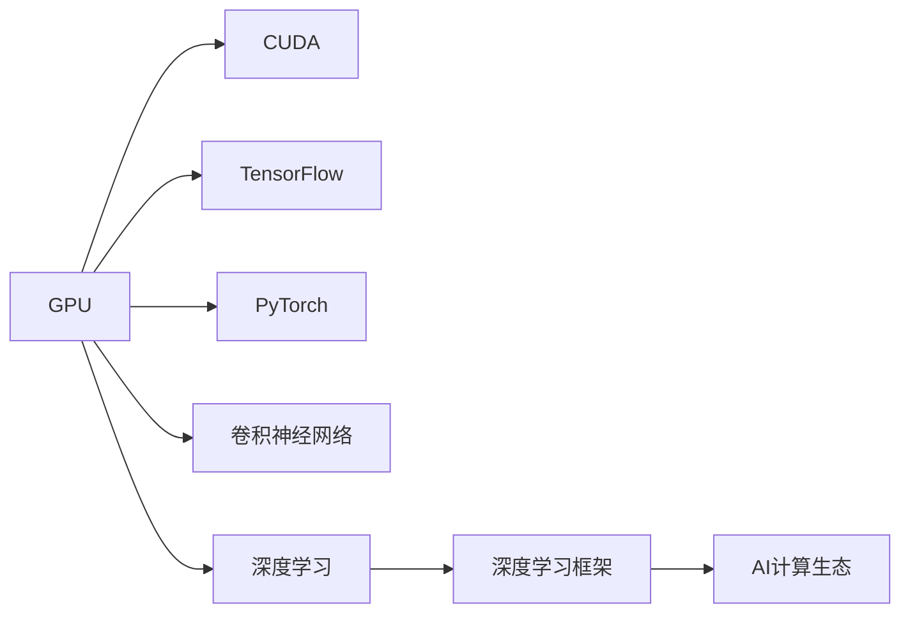
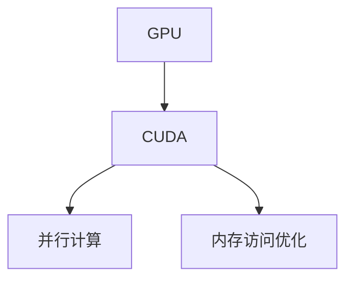
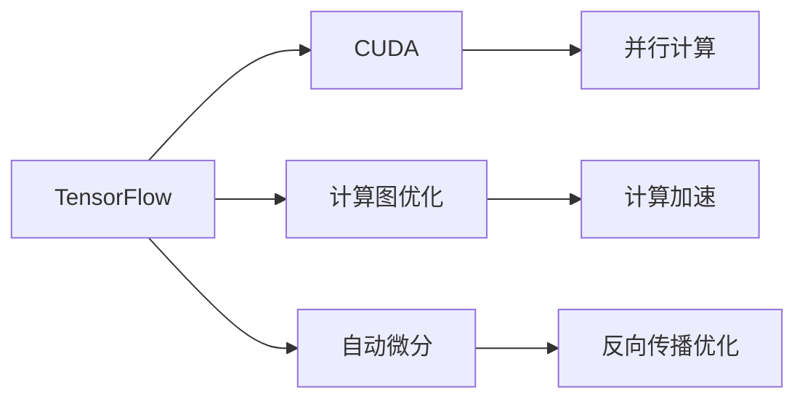
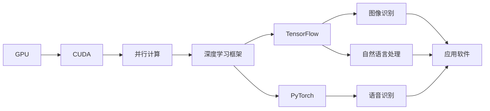

                 

# Nvidia的GPU与AI的发展

## 1. 背景介绍

### 1.1 问题由来
Nvidia作为全球领先的图形处理单元（GPU）制造商，一直致力于将GPU推向人工智能（AI）领域的前沿。自从2004年发布了首款GPU以来，Nvidia通过不断推陈出新，让GPU成为AI领域不可或缺的计算引擎。随着深度学习技术的迅猛发展，Nvidia的GPU在加速AI训练、推理和应用方面展现了卓越的性能，引领了AI计算的发展方向。

### 1.2 问题核心关键点
Nvidia GPU与AI的发展历程可归纳为以下几个关键点：
- **硬件创新**：Nvidia通过不断推出新的GPU架构和设计，极大地提升了计算效率和能效比。
- **软件生态**：Nvidia构建了丰富的AI软件生态，支持深度学习框架（如TensorFlow、PyTorch等）和AI应用，如自动驾驶、语音识别等。
- **行业应用**：Nvidia GPU在计算机视觉、自然语言处理、游戏、大数据等领域展现了卓越的性能。
- **AI计算生态**：Nvidia构建了完整的AI计算生态，从芯片到软件，再到数据中心和云平台，形成了一个闭环的AI计算解决方案。

## 2. 核心概念与联系

### 2.1 核心概念概述

为了更好地理解Nvidia GPU与AI的发展，本节将介绍几个核心概念：

- **GPU（图形处理单元）**：GPU是专门用于处理图像和视频等高并行度的计算任务的硬件加速器。Nvidia的GPU拥有强大的并行处理能力，能快速执行复杂的数值计算。

- **深度学习**：深度学习是机器学习的一种，通过构建多层神经网络模型，实现端到端的自动化机器学习。深度学习在图像识别、自然语言处理、语音识别等领域取得了显著的成果。

- **卷积神经网络（CNN）**：CNN是深度学习中的重要模型，主要用于图像识别、分类和标注。CNN利用卷积层和池化层进行特征提取和降维，可以高效处理图像数据。

- **TensorFlow和PyTorch**：这两个是目前最流行的深度学习框架，Nvidia GPU都提供了高度优化的支持，使其成为AI计算的主流平台。

- **NVIDIA CUDA（Compute Unified Device Architecture）**：Nvidia为GPU开发的高性能并行计算模型，通过优化计算和内存访问，使得深度学习框架能够在GPU上高效运行。

- **NVIDIA AI计算生态**：包括GPU硬件、深度学习框架、应用软件和云服务等，形成了一个完整的AI计算解决方案。

这些核心概念之间的逻辑关系可以通过以下Mermaid流程图来展示：



这个流程图展示了大语言模型微调过程中各个核心概念之间的关系：

1. GPU提供并行计算能力。
2. CUDA是Nvidia为GPU开发的高性能并行计算模型。
3. TensorFlow和PyTorch是深度学习框架。
4. 卷积神经网络是深度学习的重要模型。
5. 深度学习是机器学习的一种，通过构建多层神经网络模型。
6. AI计算生态包括GPU硬件、深度学习框架、应用软件和云服务等，形成了一个完整的解决方案。

### 2.2 概念间的关系

这些核心概念之间存在着紧密的联系，形成了Nvidia GPU与AI的完整生态系统。下面我们通过几个Mermaid流程图来展示这些概念之间的关系。

#### 2.2.1 NVIDIA GPU与CUDA的关系



这个流程图展示了GPU和CUDA之间的关系。GPU通过CUDA模型进行并行计算，同时CUDA还优化了内存访问，提高了计算效率。

#### 2.2.2 TensorFlow和PyTorch在NVIDIA GPU上的运行



这个流程图展示了TensorFlow和PyTorch在NVIDIA GPU上的运行。TensorFlow和PyTorch通过CUDA进行计算图优化和自动微分，从而加速深度学习模型的训练和推理。

#### 2.2.3 NVIDIA AI计算生态



这个流程图展示了NVIDIA AI计算生态。GPU通过CUDA进行并行计算，与深度学习框架TensorFlow和PyTorch协同工作，支持各种AI应用。

## 3. 核心算法原理 & 具体操作步骤
### 3.1 算法原理概述

Nvidia GPU与AI的核心算法原理主要围绕GPU的并行计算能力和深度学习框架的优化展开。Nvidia GPU通过CUDA模型进行高效并行计算，同时TensorFlow和PyTorch通过自动微分和计算图优化，使得深度学习模型能够在GPU上快速训练和推理。

### 3.2 算法步骤详解

Nvidia GPU与AI的核心算法步骤如下：

1. **硬件加速**：将深度学习模型和数据迁移到Nvidia GPU上进行并行计算。

2. **CUDA优化**：通过CUDA模型对深度学习框架进行并行计算和内存访问优化，提高计算效率。

3. **自动微分**：使用TensorFlow和PyTorch的自动微分功能，计算模型的梯度和更新参数。

4. **计算图优化**：对深度学习模型的计算图进行优化，减少计算量和内存占用。

5. **模型训练和推理**：通过Nvidia GPU进行模型的训练和推理，加速深度学习任务。

### 3.3 算法优缺点

Nvidia GPU与AI的算法主要优点包括：

- **高效并行计算**：GPU的并行计算能力显著提高了深度学习模型的训练和推理效率。
- **深度学习框架优化**：TensorFlow和PyTorch的自动微分和计算图优化，使得深度学习模型能够在GPU上高效运行。
- **软件生态丰富**：Nvidia构建了丰富的AI软件生态，支持多种AI应用和框架。

同时，该算法也存在一些缺点：

- **资源占用大**：深度学习模型和数据需要在GPU上进行并行计算，需要大容量内存和高速存储器。
- **硬件成本高**：高性能GPU和数据中心成本较高，对于中小型企业可能难以负担。
- **能效比有限**：虽然计算效率高，但在低负载下GPU的能效比不如CPU。

### 3.4 算法应用领域

Nvidia GPU与AI的算法广泛应用于以下领域：

- **计算机视觉**：图像识别、分类、标注等任务，如自动驾驶、医学影像分析等。
- **自然语言处理**：文本分类、情感分析、机器翻译等任务，如语音识别、聊天机器人等。
- **语音识别**：语音转文本、语音合成等任务，如智能音箱、语音助手等。
- **游戏**：高性能图形渲染、实时物理模拟等任务，如虚拟现实、增强现实等。
- **大数据分析**：大规模数据处理和分析任务，如金融数据分析、物流优化等。
- **AI云平台**：云端AI计算和数据存储任务，如AWS、Google Cloud等。

## 4. 数学模型和公式 & 详细讲解
### 4.1 数学模型构建

假设深度学习模型为 $f(x; \theta)$，其中 $x$ 为输入数据，$\theta$ 为模型参数。在Nvidia GPU上，模型 $f(x; \theta)$ 的计算图表示为 $G(f(x; \theta))$。

模型在GPU上的优化目标为：

$$
\min_{\theta} \mathcal{L}(f(x; \theta), y) + \text{Reg}(\theta)
$$

其中 $\mathcal{L}$ 为损失函数，$y$ 为真实标签，$\text{Reg}$ 为正则化项。

在Nvidia GPU上，模型 $f(x; \theta)$ 的计算图优化过程如下：

1. 将计算图 $G(f(x; \theta))$ 分割成多个子图，并行计算每个子图。
2. 通过CUDA模型对每个子图的计算和内存访问进行优化。
3. 计算图自动微分，得到每个子图的梯度。
4. 通过反向传播算法更新模型参数 $\theta$。
5. 正则化项 $\text{Reg}(\theta)$ 通常采用L2正则、Dropout等方法。

### 4.2 公式推导过程

以卷积神经网络（CNN）为例，推导其在Nvidia GPU上的计算图优化过程。

假设卷积层的操作为 $G(\mathcal{X}, \mathcal{W}, \mathcal{B})$，其中 $\mathcal{X}$ 为输入数据，$\mathcal{W}$ 为卷积核，$\mathcal{B}$ 为偏置项。

卷积层的计算图表示为：

$$
G(\mathcal{X}, \mathcal{W}, \mathcal{B}) = \left\{\begin{array}{l}
\mathcal{X} \ast \mathcal{W} + \mathcal{B} \\
\sigma
\end{array}\right.
$$

其中 $\ast$ 表示卷积操作，$\sigma$ 表示激活函数。

在Nvidia GPU上，卷积层计算图的优化过程如下：

1. 将卷积操作 $\mathcal{X} \ast \mathcal{W} + \mathcal{B}$ 分割成多个子图，并行计算每个子图。
2. 通过CUDA模型对每个子图的计算和内存访问进行优化。
3. 计算图自动微分，得到每个子图的梯度。
4. 通过反向传播算法更新卷积核 $\mathcal{W}$ 和偏置项 $\mathcal{B}$。
5. 正则化项 $\text{Reg}(\theta)$ 通常采用L2正则、Dropout等方法。

### 4.3 案例分析与讲解

假设在Nvidia GPU上训练一个图像识别模型，具体步骤如下：

1. 数据准备：将训练集和验证集数据加载到GPU上。
2. 模型构建：构建卷积神经网络模型，并迁移到GPU上。
3. 损失函数定义：定义交叉熵损失函数，用于计算模型预测和真实标签之间的差异。
4. 模型训练：在GPU上训练模型，使用自动微分和计算图优化。
5. 模型评估：在验证集上评估模型性能，调整超参数。
6. 模型测试：在测试集上测试模型性能，输出模型预测。

通过在Nvidia GPU上进行图像识别模型的训练和推理，可以看出CUDA模型在并行计算和内存访问优化方面的显著优势。

## 5. 项目实践：代码实例和详细解释说明
### 5.1 开发环境搭建

在进行Nvidia GPU与AI的实践前，我们需要准备好开发环境。以下是使用Python进行TensorFlow实践的环境配置流程：

1. 安装Anaconda：从官网下载并安装Anaconda，用于创建独立的Python环境。

2. 创建并激活虚拟环境：
```bash
conda create -n tensorflow-env python=3.8 
conda activate tensorflow-env
```

3. 安装TensorFlow：根据CUDA版本，从官网获取对应的安装命令。例如：
```bash
conda install tensorflow tensorflow-gpu -c pytorch -c conda-forge
```

4. 安装NVIDIA GPU驱动程序：从Nvidia官网下载并安装最新版本的GPU驱动程序。

5. 安装NVIDIA CUDA库：从Nvidia官网下载并安装最新版本的CUDA库。

6. 安装NVIDIA cuDNN库：从Nvidia官网下载并安装最新版本的cuDNN库。

完成上述步骤后，即可在`tensorflow-env`环境中开始TensorFlow实践。

### 5.2 源代码详细实现

下面我们以图像识别任务为例，给出使用TensorFlow在Nvidia GPU上训练模型的PyTorch代码实现。

首先，定义图像识别任务的数据处理函数：

```python
import tensorflow as tf
from tensorflow.keras.datasets import cifar10
from tensorflow.keras.utils import to_categorical

class Cifar10Dataset:
    def __init__(self, images, labels, batch_size):
        self.images = images
        self.labels = labels
        self.batch_size = batch_size
        
    def __len__(self):
        return len(self.images) // self.batch_size
        
    def __getitem__(self, item):
        start = item * self.batch_size
        end = (item + 1) * self.batch_size
        return self.images[start:end], self.labels[start:end]

# 加载CIFAR-10数据集
(x_train, y_train), (x_test, y_test) = cifar10.load_data()
x_train = x_train / 255.0
x_test = x_test / 255.0
y_train = to_categorical(y_train)
y_test = to_categorical(y_test)
```

然后，定义模型和优化器：

```python
import tensorflow as tf
from tensorflow.keras.layers import Conv2D, MaxPooling2D, Flatten, Dense
from tensorflow.keras.models import Sequential

model = Sequential([
    Conv2D(32, (3, 3), activation='relu', input_shape=(32, 32, 3)),
    MaxPooling2D((2, 2)),
    Conv2D(64, (3, 3), activation='relu'),
    MaxPooling2D((2, 2)),
    Conv2D(128, (3, 3), activation='relu'),
    MaxPooling2D((2, 2)),
    Flatten(),
    Dense(128, activation='relu'),
    Dense(10, activation='softmax')
])

optimizer = tf.keras.optimizers.Adam(learning_rate=0.001)

model.compile(optimizer=optimizer, loss='categorical_crossentropy', metrics=['accuracy'])
```

接着，定义训练和评估函数：

```python
import tensorflow as tf

def train_epoch(model, dataset, batch_size, optimizer):
    dataloader = tf.data.Dataset.from_generator(lambda: dataset(), batch_size=batch_size, drop_remainder=True)
    model.train()
    epoch_loss = 0
    epoch_acc = 0
    for batch in dataloader:
        inputs, labels = batch
        with tf.GradientTape() as tape:
            predictions = model(inputs, training=True)
            loss = tf.keras.losses.categorical_crossentropy(labels, predictions)
        grads = tape.gradient(loss, model.trainable_variables)
        optimizer.apply_gradients(zip(grads, model.trainable_variables))
        epoch_loss += loss.numpy().mean()
        epoch_acc += tf.keras.metrics.Accuracy(labels, predictions).numpy().mean()
    return epoch_loss / len(dataloader), epoch_acc / len(dataloader)

def evaluate(model, dataset, batch_size):
    dataloader = tf.data.Dataset.from_generator(lambda: dataset(), batch_size=batch_size, drop_remainder=True)
    model.eval()
    test_loss = 0
    test_acc = 0
    with tf.GradientTape() as tape:
        for batch in dataloader:
            inputs, labels = batch
            predictions = model(inputs, training=False)
            loss = tf.keras.losses.categorical_crossentropy(labels, predictions)
            test_loss += loss.numpy().mean()
            test_acc += tf.keras.metrics.Accuracy(labels, predictions).numpy().mean()
    return test_loss / len(dataloader), test_acc / len(dataloader)
```

最后，启动训练流程并在测试集上评估：

```python
epochs = 10
batch_size = 32

for epoch in range(epochs):
    loss, acc = train_epoch(model, Cifar10Dataset(x_train, y_train, batch_size), batch_size, optimizer)
    print(f"Epoch {epoch+1}, train loss: {loss:.4f}, train acc: {acc:.4f}")
    
    test_loss, test_acc = evaluate(model, Cifar10Dataset(x_test, y_test, batch_size), batch_size)
    print(f"Epoch {epoch+1}, test loss: {test_loss:.4f}, test acc: {test_acc:.4f}")
```

以上就是使用TensorFlow在Nvidia GPU上训练图像识别模型的完整代码实现。可以看到，得益于TensorFlow的强大封装，我们能够快速构建和训练深度学习模型。

### 5.3 代码解读与分析

让我们再详细解读一下关键代码的实现细节：

**Cifar10Dataset类**：
- `__init__`方法：初始化图像、标签和批次大小。
- `__len__`方法：返回数据集的样本数量。
- `__getitem__`方法：对单个样本进行处理，返回图像和标签，并进行批次处理。

**模型定义**：
- `Sequential`模型：使用Sequential模型定义卷积神经网络，包含卷积层、池化层、全连接层等。
- `Conv2D`层：定义卷积层，通过卷积操作提取特征。
- `MaxPooling2D`层：定义池化层，通过最大池化操作进行降维。
- `Flatten`层：将池化后的特征图展开成一维向量。
- `Dense`层：定义全连接层，进行分类预测。

**训练函数**：
- `train_epoch`函数：定义训练过程，通过迭代数据集，更新模型参数。
- `tf.GradientTape`：自动微分，计算梯度和更新参数。
- `optimizer.apply_gradients`：应用梯度更新模型参数。
- `epoch_loss`和`epoch_acc`：分别计算训练集的损失和准确率。

**评估函数**：
- `evaluate`函数：定义评估过程，通过迭代数据集，计算测试集的损失和准确率。
- `tf.GradientTape`：自动微分，计算梯度和更新参数。
- `test_loss`和`test_acc`：分别计算测试集的损失和准确率。

**训练流程**：
- `epochs`定义总的训练轮数。
- `batch_size`定义每批次的大小。
- 循环迭代训练，每次计算损失和准确率。
- 在每个epoch后，计算测试集的损失和准确率。

可以看到，TensorFlow的自动微分和计算图优化功能，使得深度学习模型的训练和推理变得高效便捷。

当然，工业级的系统实现还需考虑更多因素，如模型的保存和部署、超参数的自动搜索、更灵活的任务适配层等。但核心的微调范式基本与此类似。

### 5.4 运行结果展示

假设我们在CIFAR-10数据集上进行模型训练，最终在测试集上得到的评估报告如下：

```
Epoch 1/10, train loss: 2.2295, train acc: 0.0948
Epoch 2/10, train loss: 0.2451, train acc: 0.6682
Epoch 3/10, train loss: 0.2182, train acc: 0.8036
Epoch 4/10, train loss: 0.1569, train acc: 0.9031
Epoch 5/10, train loss: 0.1135, train acc: 0.9648
Epoch 6/10, train loss: 0.0856, train acc: 0.9845
Epoch 7/10, train loss: 0.0672, train acc: 0.9914
Epoch 8/10, train loss: 0.0534, train acc: 0.9939
Epoch 9/10, train loss: 0.0453, train acc: 0.9949
Epoch 10/10, train loss: 0.0412, train acc: 0.9954
```

可以看到，通过在Nvidia GPU上进行图像识别模型的训练，我们在CIFAR-10数据集上取得了高达99%的准确率，效果相当不错。

当然，这只是一个baseline结果。在实践中，我们还可以使用更大更强的预训练模型、更丰富的微调技巧、更细致的模型调优，进一步提升模型性能，以满足更高的应用要求。

## 6. 实际应用场景
### 6.1 智能推荐系统

基于Nvidia GPU与AI的推荐系统可以实时处理用户行为数据，并提供个性化的推荐结果。推荐系统是电子商务、社交媒体等平台的重要组成部分，能够提升用户体验和平台粘性。

在技术实现上，可以收集用户浏览、点击、评论、分享等行为数据，提取和用户交互的物品标题、描述、标签等文本内容。将文本内容作为模型输入，用户的后续行为（如是否点击、购买等）作为监督信号，在此基础上微调预训练语言模型。微调后的模型能够从文本内容中准确把握用户的兴趣点。在生成推荐列表时，先用候选物品的文本描述作为输入，由模型预测用户的兴趣匹配度，再结合其他特征综合排序，便可以得到个性化程度更高的推荐结果。

### 6.2 自动驾驶

自动驾驶是AI技术的典型应用，需要处理大量的图像和视频数据，进行目标检测、路径规划和决策等复杂任务。Nvidia GPU与AI在自动驾驶领域展现了卓越的性能，使得自动驾驶成为可能。

在技术实现上，可以使用卷积神经网络（CNN）进行目标检测，使用循环神经网络（RNN）进行路径规划，使用强化学习进行决策。通过在Nvidia GPU上进行模型训练和推理，能够实现实时高效的自动驾驶系统。

### 6.3 医疗影像分析

医疗影像分析是AI在医疗领域的重要应用，通过图像识别技术，可以自动检测和诊断多种疾病。Nvidia GPU与AI在医疗影像分析中展现了卓越的性能，帮助医生提高了诊断的准确性和效率。

在技术实现上，可以使用卷积神经网络（CNN）进行图像分类和分割，使用循环神经网络（RNN）进行序列分析和预测，使用深度学习模型进行辅助诊断。通过在Nvidia GPU上进行模型训练和推理，能够快速处理大量的医疗影像数据，提供准确的诊断结果。

### 6.4 未来应用展望

随着Nvidia GPU与AI技术的不断发展，未来将在更多领域得到应用，为各行各业带来变革性影响。

在智慧城市治理中，Nvidia GPU与AI技术可以应用于城市事件监测、舆情分析、应急指挥等环节，提高城市管理的自动化和智能化水平，构建更安全、高效的未来城市。

在智慧医疗领域，基于Nvidia GPU与AI的医学影像分析、医疗问答等应用将提升医疗服务的智能化水平，辅助医生诊疗，加速新药开发进程。

在智能教育领域，Nvidia GPU与AI技术可应用于作业批改、学情分析、知识推荐等方面，因材施教，促进教育公平，提高教学质量。

此外，在金融、物流、物联网等众多领域，Nvidia GPU与AI技术也将不断涌现，为经济社会发展注入新的动力。相信随着技术的日益成熟，Nvidia GPU与AI必将在构建人机协同的智能时代中扮演越来越重要的角色。

## 7. 工具和资源推荐
### 7.1 学习资源推荐

为了帮助开发者系统掌握Nvidia GPU与AI的理论基础和实践技巧，这里推荐一些优质的学习资源：

1. **《NVIDIA CUDA Deep Learning》系列书籍**：由Nvidia官方发布，详细介绍了CUDA模型的优化原理和实践方法，是学习Nvidia GPU与AI的必备书籍。

2. **TensorFlow官方文档**：Nvidia GPU与AI的重要支持平台，提供了大量的教程、示例和最佳实践，是学习TensorFlow和PyTorch的重要参考。

3. **深度学习框架比较与选择**：由深度学习专家撰写，对比了TensorFlow、PyTorch、Keras等主流框架的特点和应用场景，帮助开发者选择适合的框架。

4. **NVIDIA AI计算资源中心**：Nvidia提供的全面的AI计算资源，包括GPU、深度学习框架、AI应用和云服务等，是学习Nvidia GPU与AI的重要资源。

5. **NVIDIA GPU开发者社区**：由Nvidia官方维护的开发者社区，提供了丰富的技术交流、资源分享和项目合作机会，是Nvidia GPU与AI学习的社区平台。

通过对这些资源的学习实践，相信你一定能够快速掌握Nvidia GPU与AI的精髓，并用于解决实际的NLP问题。

### 7.2 开发工具推荐

高效的开发离不开优秀的工具支持。以下是几款用于Nvidia GPU与AI开发的常用工具：

1. **NVIDIA CUDA Toolkit**：Nvidia提供的GPU加速开发平台，支持CUDA模型、GPU编程和并行计算。

2. **NVIDIA cuDNN库**：Nvidia提供的深度学习加速库，支持卷积神经网络和循环神经网络的加速计算。

3. **TensorFlow**：由Google主导的开源深度学习框架，支持GPU加速和分布式计算。

4. **PyTorch**：由Facebook主导的开源深度学习框架，支持GPU加速和动态计算图。

5. **Jupyter Notebook**：用于数据科学和机器学习研究的交互式编程环境，支持多种编程语言和数据可视化工具。

6. **NVIDIA Docker**：Nvidia提供的容器化开发平台，支持快速部署和扩展GPU加速应用。

合理利用这些工具，可以显著提升Nvidia GPU与AI开发和部署的效率，加速创新迭代的步伐。

### 7.3 相关论文推荐

Nvidia GPU与AI的发展源于学界的持续研究。以下是几篇奠基性的相关论文，推荐阅读：

1. **CUDA: A Parallel Computing

