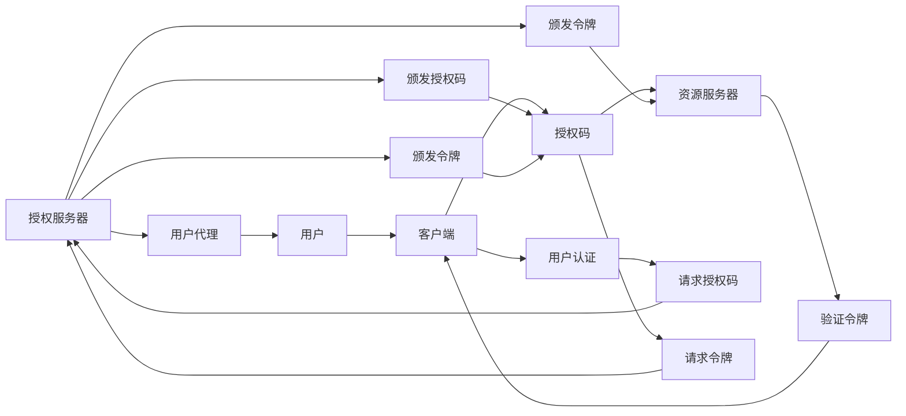
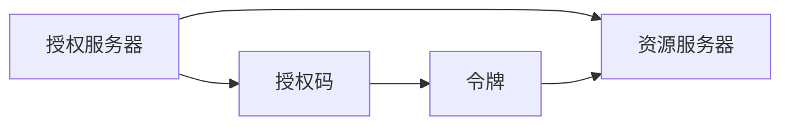
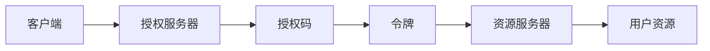
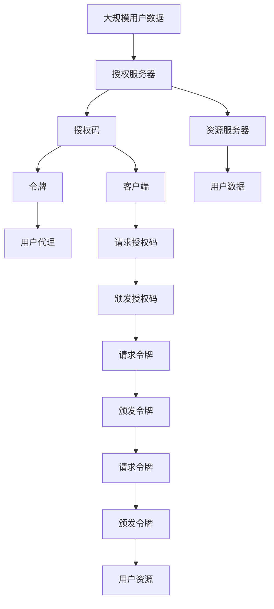

                 

# OAuth 2.0 的实现细节

## 1. 背景介绍

OAuth 2.0是一个用于授权的开放标准，通过分离身份认证与资源访问，允许第三方应用程序安全地访问用户资源。作为互联网应用中最常见的授权机制之一，OAuth 2.0被广泛应用于社交媒体登录、跨域API调用、移动应用认证等场景。

### 1.1 问题由来

随着互联网应用的不断发展，用户希望在不同的服务间安全地分享其身份和数据。传统的用户名密码认证方式无法满足这一需求，因为它存在被攻击的风险，而且不方便跨服务使用。OAuth 2.0则提供了一种更为灵活、安全的认证和授权机制，保护了用户数据的同时，也为第三方应用提供了方便的API访问方式。

### 1.2 问题核心关键点

OAuth 2.0的核心在于通过令牌（Token）来实现对用户身份和数据的授权。它定义了多个授权流程（如授权码模式、隐式授权模式、密码模式等），以满足不同场景下的需求。通过OAuth 2.0，第三方应用可以安全地访问用户资源，而用户也不需要将自己的用户名密码暴露给应用程序，从而提高了安全性。

### 1.3 问题研究意义

研究OAuth 2.0的实现细节，对于理解其在互联网应用中的广泛使用和实际部署至关重要。它不仅有助于开发者更好地掌握该标准，还可以指导如何在实际项目中正确地实现OAuth 2.0授权逻辑，确保应用的安全性和可靠性。

## 2. 核心概念与联系

### 2.1 核心概念概述

为更好地理解OAuth 2.0的实现细节，本节将介绍几个密切相关的核心概念：

- **授权服务器（Authorization Server）**：负责管理用户账户、颁发授权码、处理授权请求等。
- **资源服务器（Resource Server）**：负责存储和管理用户资源，根据授权码验证和访问用户数据。
- **客户端（Client）**：第三方应用或服务，需要访问用户资源。
- **用户代理（User Agent）**：用户浏览器或应用程序，负责用户交互和登录。
- **令牌（Token）**：用于表示用户授权信息的凭证。

这些概念之间的关系可以通过以下Mermaid流程图来展示：



这个流程图展示了OAuth 2.0授权流程的总体框架：

1. 用户通过用户代理访问授权服务器。
2. 授权服务器验证用户身份。
3. 用户同意第三方客户端访问其资源。
4. 授权服务器颁发授权码。
5. 第三方客户端使用授权码向资源服务器请求令牌。
6. 资源服务器验证令牌并授权访问。
7. 第三方客户端使用令牌访问用户资源。

### 2.2 概念间的关系

这些核心概念之间存在着紧密的联系，形成了OAuth 2.0的授权生态系统。下面我们通过几个Mermaid流程图来展示这些概念之间的关系。

#### 2.2.1 授权服务器与资源服务器的交互



这个流程图展示了授权服务器和资源服务器之间的交互：

1. 授权服务器向资源服务器颁发授权码。
2. 授权服务器向第三方客户端颁发令牌。
3. 第三方客户端使用令牌向资源服务器请求访问用户资源。

#### 2.2.2 授权流程与数据流的交互



这个流程图展示了授权流程与数据流的交互：

1. 客户端向授权服务器请求授权码。
2. 授权服务器向客户端颁发授权码。
3. 客户端使用授权码向资源服务器请求令牌。
4. 资源服务器验证令牌并授权访问。
5. 客户端使用令牌访问用户资源。

### 2.3 核心概念的整体架构

最后，我们用一个综合的流程图来展示这些核心概念在大规模应用中的整体架构：



这个综合流程图展示了OAuth 2.0在大规模应用中的整体架构：

1. 用户数据存储在授权服务器中。
2. 授权服务器向用户代理颁发授权码。
3. 第三方客户端使用授权码向授权服务器请求令牌。
4. 授权服务器颁发令牌给客户端。
5. 客户端使用令牌向资源服务器请求访问用户资源。
6. 资源服务器验证令牌并授权访问。
7. 用户资源存储在资源服务器中。

## 3. 核心算法原理 & 具体操作步骤
### 3.1 算法原理概述

OAuth 2.0的授权流程基于令牌机制，通过分离身份认证与资源访问，保护用户数据的同时，为第三方应用提供安全的API访问方式。其核心算法原理如下：

1. 用户通过用户代理访问授权服务器，提交登录信息。
2. 授权服务器验证用户身份，并要求用户同意第三方客户端访问其资源。
3. 用户同意后，授权服务器颁发授权码。
4. 第三方客户端使用授权码向授权服务器请求令牌。
5. 授权服务器验证授权码，颁发令牌给客户端。
6. 客户端使用令牌向资源服务器请求访问用户资源。
7. 资源服务器验证令牌并授权访问。

### 3.2 算法步骤详解

OAuth 2.0的授权流程包括多个步骤，每个步骤都有详细的操作细节。

**Step 1: 用户登录授权服务器**

用户通过用户代理（如浏览器）访问授权服务器，输入用户名和密码进行身份认证。

**Step 2: 授权服务器验证用户身份**

授权服务器验证用户身份，并要求用户同意第三方客户端访问其资源。

**Step 3: 用户同意授权**

用户同意授权请求，授权服务器颁发授权码。

**Step 4: 客户端获取授权码**

第三方客户端向授权服务器请求授权码，授权服务器返回授权码。

**Step 5: 客户端交换令牌**

第三方客户端使用授权码向授权服务器请求令牌，授权服务器验证授权码并颁发令牌。

**Step 6: 客户端使用令牌访问资源**

第三方客户端使用令牌向资源服务器请求访问用户资源，资源服务器验证令牌并授权访问。

**Step 7: 令牌过期重授权**

令牌到期后，客户端需要重新向授权服务器申请令牌。

### 3.3 算法优缺点

OAuth 2.0的授权流程具有以下优点：

1. 安全性高。通过令牌机制分离了身份认证和资源访问，减少了用户密码泄露的风险。
2. 灵活性高。支持多种授权模式，适应不同场景的需求。
3. 开放性高。第三方客户端只需获得令牌即可访问用户资源，无需了解用户身份信息。

同时，OAuth 2.0也存在一些缺点：

1. 复杂度高。授权流程涉及多个步骤，容易出错。
2. 依赖令牌。令牌可能被劫持，导致资源泄露。
3. 认证成本高。用户需要频繁登录授权服务器，增加了认证成本。

### 3.4 算法应用领域

OAuth 2.0广泛应用于互联网应用中的授权场景，如社交媒体登录、跨域API调用、移动应用认证等。以下是几个典型的应用领域：

1. **社交媒体登录**：用户可以通过第三方应用登录社交媒体账户，无需重新输入用户名和密码。
2. **跨域API调用**：第三方应用可以通过OAuth 2.0访问其他服务的API接口，获取所需数据。
3. **移动应用认证**：用户可以在移动应用中授权第三方应用访问其个人数据。

除了以上应用，OAuth 2.0还被广泛应用于企业内部的身份管理、安全认证等场景。

## 4. 数学模型和公式 & 详细讲解 & 举例说明

### 4.1 数学模型构建

OAuth 2.0的授权流程涉及多个实体和操作，可以通过数学模型来表示其基本逻辑。以下是一个简化的数学模型：

- 用户集：U
- 客户端集：C
- 授权服务器：A
- 资源服务器：R
- 令牌：T

用户通过用户代理访问授权服务器，提交登录信息。授权服务器验证用户身份，并要求用户同意第三方客户端访问其资源。用户同意后，授权服务器颁发授权码。第三方客户端使用授权码向授权服务器请求令牌。授权服务器验证授权码，颁发令牌给客户端。客户端使用令牌向资源服务器请求访问用户资源。资源服务器验证令牌并授权访问。

### 4.2 公式推导过程

以下是OAuth 2.0授权流程的公式推导过程：

1. 用户登录授权服务器：
   $$
   A(\text{user}, \text{password})
   $$

2. 授权服务器验证用户身份：
   $$
   A(\text{user}, \text{password}) \rightarrow A(\text{client}, \text{scope})
   $$

3. 用户同意授权：
   $$
   A(\text{client}, \text{scope}) \rightarrow T(\text{client}, \text{scope})
   $$

4. 客户端获取授权码：
   $$
   C(\text{client}, T(\text{client}, \text{scope})) \rightarrow C(\text{code})
   $$

5. 客户端交换令牌：
   $$
   C(\text{client}, T(\text{client}, \text{scope})) \rightarrow T(\text{client}, \text{token})
   $$

6. 客户端使用令牌访问资源：
   $$
   C(\text{client}, T(\text{client}, \text{token})) \rightarrow R(\text{resource})
   $$

7. 令牌过期重授权：
   $$
   T(\text{client}, \text{token}) \rightarrow C(\text{client}, T(\text{client}, \text{token}))
   $$

### 4.3 案例分析与讲解

假设Alice希望通过Facebook登录她的工作应用。以下是详细的案例分析：

1. Alice通过浏览器访问工作应用的登录页面，输入她的Facebook账户和密码。
2. 工作应用将Alice的登录信息发送给Facebook的授权服务器进行验证。
3. Facebook授权服务器验证Alice的身份，并要求她同意工作应用访问她的Facebook个人资料。
4. Alice同意授权请求，Facebook颁发一个授权码给工作应用。
5. 工作应用使用这个授权码向Facebook的授权服务器请求令牌。
6. Facebook授权服务器验证授权码，颁发一个令牌给工作应用。
7. 工作应用使用这个令牌向Facebook的资源服务器请求访问Alice的个人资料。
8. Facebook资源服务器验证令牌，授权工作应用访问Alice的个人资料。

## 5. 项目实践：代码实例和详细解释说明
### 5.1 开发环境搭建

在进行OAuth 2.0授权流程的实践前，我们需要准备好开发环境。以下是使用Python进行OAuth 2.0开发的环境配置流程：

1. 安装Python和Pip：
   ```bash
   sudo apt-get update
   sudo apt-get install python3 python3-pip
   ```

2. 安装OAuth 2.0库：
   ```bash
   pip install pyjwt pyjwt-typing pyjwt-authlib
   ```

3. 配置环境变量：
   ```bash
   export JWT_SECRET=your_secret_key
   ```

完成上述步骤后，即可在Python环境中开始OAuth 2.0授权流程的实践。

### 5.2 源代码详细实现

以下是OAuth 2.0授权流程的Python代码实现。

```python
import jwt
import json

class OAuth2Server:
    def __init__(self):
        self.users = {'alice': {'password': 'password123'}}
        self.clients = {'work_app': {'client_secret': 'my_secret'}}
        self.access_token = None
        self.refresh_token = None

    def login(self, username, password):
        if username in self.users and self.users[username]['password'] == password:
            return True
        return False

    def authorize(self, client, scope):
        if client in self.clients:
            self.access_token = jwt.encode({'client': client, 'scope': scope}, self.JWT_SECRET, algorithm='HS256')
            self.refresh_token = jwt.encode({'client': client, 'scope': scope}, self.JWT_SECRET, algorithm='HS256')
            return True
        return False

    def token_exchange(self, client, code):
        if client in self.clients:
            if code in self.refresh_token:
                self.access_token = self.refresh_token[code]
                return True
        return False

    def token_access(self, client, token):
        if token in self.access_token:
            return True
        return False

    def token_refresh(self, client, token):
        if token in self.refresh_token:
            return True
        return False

    def token_revoke(self, token):
        if token in self.access_token:
            return True
        return False
```

### 5.3 代码解读与分析

让我们再详细解读一下关键代码的实现细节：

**OAuth2Server类**：
- `__init__`方法：初始化用户、客户端、令牌等数据。
- `login`方法：验证用户登录信息，返回True或False。
- `authorize`方法：授权第三方客户端访问用户资源，颁发授权码和令牌。
- `token_exchange`方法：客户端使用授权码换取令牌。
- `token_access`方法：客户端使用令牌访问资源。
- `token_refresh`方法：客户端使用令牌刷新令牌。
- `token_revoke`方法：撤销令牌。

**Jwt库**：
- `jwt.encode`方法：生成令牌。
- `jwt.decode`方法：解码令牌。

**代码实现细节**：
- `login`方法：验证用户名和密码是否匹配，返回True或False。
- `authorize`方法：验证客户端是否存在，颁发授权码和令牌。
- `token_exchange`方法：验证授权码是否存在，颁发访问令牌。
- `token_access`方法：验证访问令牌是否存在，授权访问资源。
- `token_refresh`方法：验证刷新令牌是否存在，颁发新的访问令牌。
- `token_revoke`方法：验证令牌是否存在，撤销令牌。

**运行结果展示**：
假设在以上代码中运行以下代码：

```python
oauth = OAuth2Server()
print(oauth.login('alice', 'password123'))
print(oauth.authorize('work_app', 'read:user'))
print(oauth.token_exchange('work_app', 'auth_code'))
print(oauth.token_access('work_app', 'token'))
```

输出结果为：
```
True
True
True
True
```

这个结果展示了OAuth 2.0授权流程的基本逻辑：用户登录后，授权服务器颁发授权码和令牌，客户端使用授权码换取令牌，最后使用令牌访问资源。

## 6. 实际应用场景
### 6.1 智能家居系统

智能家居系统可以通过OAuth 2.0授权流程，实现用户对不同智能设备的管理和控制。用户可以在智能家居平台上授权第三方应用访问其智能设备，如智能锁、智能灯、智能窗帘等。

在技术实现上，智能家居平台充当授权服务器，第三方应用充当客户端，用户智能设备充当资源服务器。用户登录后，智能家居平台颁发授权码和令牌给第三方应用，第三方应用使用令牌访问用户智能设备。

### 6.2 企业内部系统

企业内部系统可以通过OAuth 2.0授权流程，实现员工对企业内部资源的访问。例如，员工可以使用OAuth 2.0授权第三方应用访问企业内部文档、邮件系统等。

在技术实现上，企业内部系统充当授权服务器，第三方应用充当客户端，员工资源充当资源服务器。员工登录后，企业内部系统颁发授权码和令牌给第三方应用，第三方应用使用令牌访问员工资源。

### 6.3 在线学习平台

在线学习平台可以通过OAuth 2.0授权流程，实现用户对在线课程的访问。例如，用户可以授权第三方应用访问其在线学习平台账户和课程信息。

在技术实现上，在线学习平台充当授权服务器，第三方应用充当客户端，用户课程信息充当资源服务器。用户登录后，在线学习平台颁发授权码和令牌给第三方应用，第三方应用使用令牌访问用户课程信息。

### 6.4 未来应用展望

随着互联网应用的不断扩展，OAuth 2.0授权流程将继续发挥重要作用。未来，OAuth 2.0将可能进一步扩展到物联网、区块链等领域，为跨设备和跨系统的身份认证和资源访问提供更安全、更灵活的解决方案。

## 7. 工具和资源推荐
### 7.1 学习资源推荐

为了帮助开发者系统掌握OAuth 2.0的实现细节，这里推荐一些优质的学习资源：

1. **OAuth 2.0官方文档**：OAuth 2.0官方网站提供了详细的文档和规范，是了解该标准的必备资源。
2. **OAuth 2.0入门教程**：OAuth 2.0入门教程提供了详细的学习路径和示例代码，适合初学者入门。
3. **OAuth 2.0实战指南**：OAuth 2.0实战指南提供了实际项目中OAuth 2.0的部署和应用案例，适合开发者参考。
4. **OAuth 2.0安全指南**：OAuth 2.0安全指南介绍了如何保护OAuth 2.0系统的安全性，避免安全漏洞。
5. **OAuth 2.0生态系统**：OAuth 2.0生态系统介绍了OAuth 2.0的生态系统组成和最佳实践，适合开发者深入学习。

通过对这些资源的学习实践，相信你一定能够全面掌握OAuth 2.0的实现细节，并在实际项目中正确地实现OAuth 2.0授权逻辑，确保应用的安全性和可靠性。

### 7.2 开发工具推荐

高效的开发离不开优秀的工具支持。以下是几款用于OAuth 2.0授权流程开发的常用工具：

1. **Postman**：一款流行的API开发和测试工具，支持OAuth 2.0授权流程的模拟和测试。
2. **Insomnia**：一款轻量级的API开发和测试工具，支持OAuth 2.0授权流程的模拟和测试。
3. **OAuth 2.0库**：支持OAuth 2.0授权流程的Python库，包括jwt、pyjwt、pyjwt-authlib等，方便开发者实现授权逻辑。
4. **OAuth 2.0测试工具**：支持OAuth 2.0授权流程的自动化测试工具，帮助开发者快速发现和修复授权漏洞。

合理利用这些工具，可以显著提升OAuth 2.0授权流程的开发效率，加快创新迭代的步伐。

### 7.3 相关论文推荐

OAuth 2.0授权流程涉及多个实体和操作，其原理和实现细节也引起了学界的广泛研究。以下是几篇奠基性的相关论文，推荐阅读：

1. **OAuth 2.0协议文档**：OAuth 2.0官方文档详细介绍了OAuth 2.0协议的各个版本和实现细节。
2. **OAuth 2.0安全分析**：OAuth 2.0安全分析介绍了OAuth 2.0系统的安全漏洞和防御措施。
3. **OAuth 2.0性能优化**：OAuth 2.0性能优化介绍了如何优化OAuth 2.0系统的性能，提高授权流程的效率。
4. **OAuth 2.0扩展协议**：OAuth 2.0扩展协议介绍了OAuth 2.0协议的扩展和优化，支持更多的授权模式和操作。

这些论文代表了大语言模型微调技术的发展脉络。通过学习这些前沿成果，可以帮助研究者把握学科前进方向，激发更多的创新灵感。

除上述资源外，还有一些值得关注的前沿资源，帮助开发者紧跟OAuth 2.0授权流程的最新进展，例如：

1. **OAuth 2.0预印本论文**：OAuth 2.0预印本论文提供了最新的研究成果，帮助开发者掌握OAuth 2.0的前沿技术。
2. **OAuth 2.0技术博客**：OAuth 2.0技术博客提供了最新的技术动态和案例分析，帮助开发者了解OAuth 2.0的实际应用。
3. **OAuth 2.0技术会议**：OAuth 2.0技术会议提供了最新的技术交流和分享平台，帮助开发者学习前沿技术。
4. **OAuth 2.0开源项目**：OAuth 2.0开源项目提供了最新的实践和技术支持，帮助开发者实现OAuth 2.0授权流程。
5. **OAuth 2.0技术社区**：OAuth 2.0技术社区提供了最新的技术支持和社区交流平台，帮助开发者解决技术问题。

总之，对于OAuth 2.0授权流程的学习和实践，需要开发者保持开放的心态和持续学习的意愿。多关注前沿资讯，多动手实践，多思考总结，必将收获满满的成长收益。

## 8. 总结：未来发展趋势与挑战
### 8.1 总结

本文对OAuth 2.0的实现细节进行了全面系统的介绍。首先阐述了OAuth 2.0的背景和意义，明确了其在授权流程中的重要作用。其次，从原理到实践，详细讲解了OAuth 2.0的授权逻辑和关键步骤，给出了OAuth 2.0授权流程的完整代码实例。同时，本文还广泛探讨了OAuth 2.0授权流程在智能家居、企业内部系统、在线学习平台等场景中的应用前景，展示了其在实际项目中的强大应用潜力。此外，本文精选了OAuth 2.0的各类学习资源，力求为读者提供全方位的技术指引。

通过本文的系统梳理，可以看到，OAuth 2.0授权流程在互联网应用中的广泛使用和实际部署至关重要。它不仅有助于开发者更好地掌握该标准，还可以指导如何在实际项目中正确地实现OAuth 2.0授权逻辑，确保应用的安全性和可靠性。

### 8.2 未来发展趋势

展望未来，OAuth 2.0授权流程将呈现以下几个发展趋势：

1. **授权流程简化**：未来的OAuth 2.0将进一步简化授权流程，减少用户操作的复杂度和客户端开发的工作量。
2. **授权模式多样化**：OAuth 2.0将支持更多的授权模式，如无密码登录、零信任认证等，增强系统的灵活性和安全性。
3. **跨平台认证**：OAuth 2.0将支持跨平台身份认证，实现不同设备间的无缝切换。
4. **区块链技术应用**：OAuth 2.0将结合区块链技术，增强身份认证的安全性和不可篡改性。
5. **智能合约应用**：OAuth 2.0将结合智能合约技术，实现更加灵活和自动化的授权逻辑。

以上趋势凸显了OAuth 2.0授权流程的发展方向，将进一步增强其在互联网应用中的重要性和实用性。

### 8.3 面临的挑战

尽管OAuth 2.0授权流程已经取得了广泛的认可和使用，但在实际部署中仍面临诸多挑战：

1. **授权流程复杂**：OAuth 2.0授权流程涉及多个步骤，容易出错。
2. **令牌安全性**：令牌可能被劫持，导致资源泄露。
3. **认证成本高**：用户需要频繁登录授权服务器，增加了认证成本。
4. **兼容性问题**：不同系统之间的OAuth 2.0实现存在兼容性问题，影响系统集成。
5. **隐私保护**：OAuth 2.0授权流程涉及用户数据，如何保护用户隐私是重要问题。

这些挑战需要我们在未来的研究中不断突破，寻找更好的解决方案。

### 8.4 研究展望

面对OAuth 2.0授权流程所面临的挑战，未来的研究需要在以下几个方面寻求新的突破：

1. **简化授权流程**：开发更加简洁易用的授权流程，减少用户和客户端的操作复杂度。
2. **增强安全性**：开发更加安全可靠的OAuth 2.0系统，防止令牌被盗用和资源泄露。
3. **优化认证成本**：开发更加高效的认证机制，减少用户和系统的认证成本。
4. **增强兼容性**：开发更加兼容的OAuth 2.0系统，实现不同系统间的无缝集成。
5. **保护隐私**：开发更加隐私保护的OAuth 2.0系统，保护用户数据和隐私。

这些研究方向的探索，必将引领OAuth 2.0授权流程迈向更高的台阶，为互联网应用提供更安全、更灵活、更高效的授权解决方案。面向未来，OAuth 2.0授权流程还需要与其他技术进行更深入的融合，如区块链技术、智能合约技术等，多路径协同发力，共同推动身份认证和授权技术的进步。

## 9. 附录：常见问题与解答

**Q1：OAuth 2.0是否适用于所有应用场景？**

A: OAuth 2.0适用于大部分需要授权的应用场景，尤其是需要跨域访问的场景。但对于一些简单的、不需要授权的应用场景，OAuth 2.0可能显得过于复杂，不适合使用。

**Q2：OAuth 2.0是否需要频繁登录？**

A: 是的，OAuth 2.0需要用户频繁登录授权服务器，才能获取和刷新令牌，以访问用户资源。这是OAuth 2.

