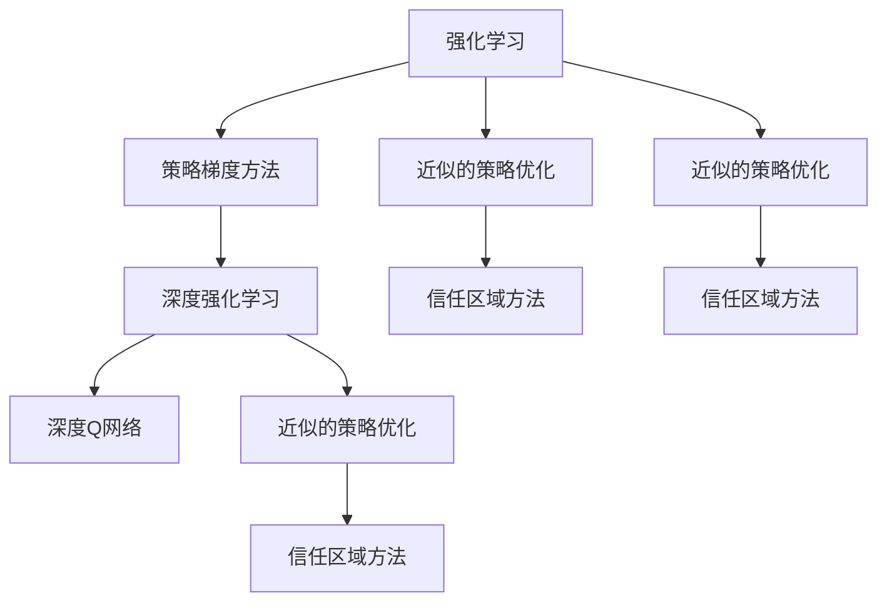
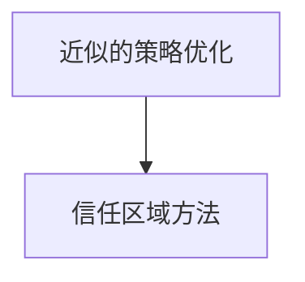
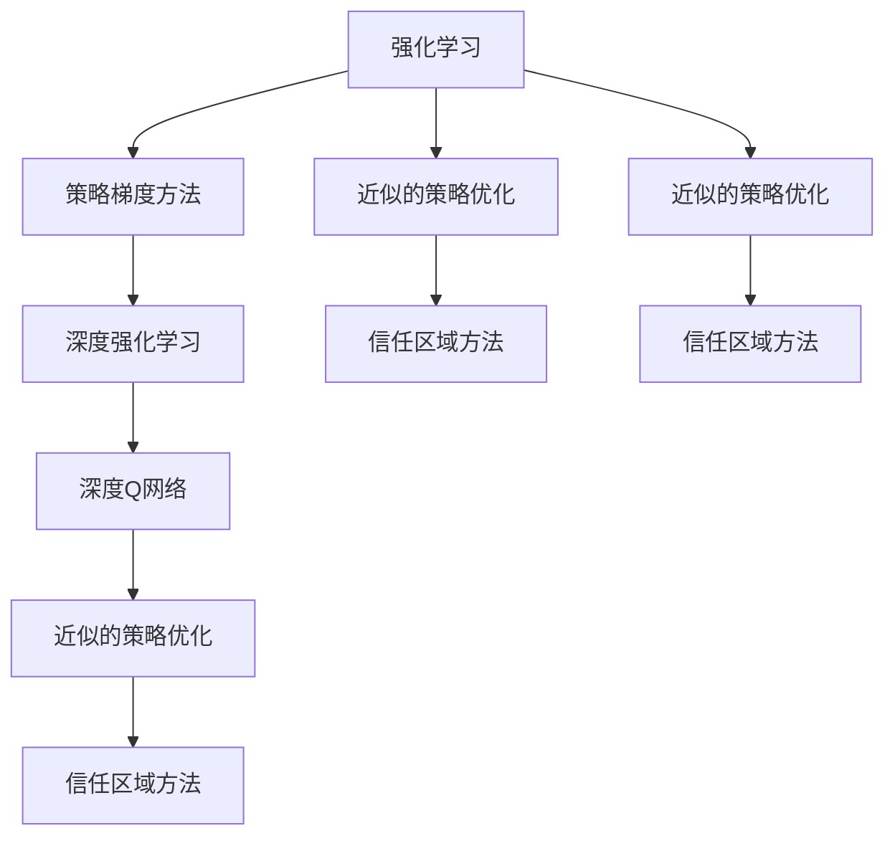

                 

# PPO原理与代码实例讲解

> 关键词：PPO（Proximal Policy Optimization）, 强化学习, 深度强化学习, 深度Q网络, 策略梯度方法, 训练稳定, 离线策略优化

## 1. 背景介绍

### 1.1 问题由来
在人工智能领域，强化学习（Reinforcement Learning, RL）是其中一个重要的研究方向。它旨在通过学习如何在复杂环境中决策，以实现智能体的长期目标。然而，传统的强化学习方法，如Q-learning，在处理高维度动作空间时，往往存在难以收敛、计算复杂度高、难以处理连续动作等问题。

近年来，PPO（Proximal Policy Optimization）作为一种新型的策略梯度方法，因其训练稳定、计算效率高、可以处理连续动作等优点，成为了强化学习领域的核心方法之一。

### 1.2 问题核心关键点
PPO的核心思想是通过学习一个近似的策略，在保证全局最优性的同时，尽可能地减少局部最优性，从而加速策略优化过程。其核心算法包括两个关键组件：目标函数和优化策略。

PPO的目标函数由两个部分组成：
1. 期望回报的二次泰勒近似。
2. 约束条件，确保优化后的策略与原始策略的Kullback-Leibler divergence（KL散度）差值不会过大，以保证策略的稳定性。

PPO的优化策略使用了信任区域方法，即在每次迭代中，限制策略更新的幅度，从而避免过大的策略变化。

### 1.3 问题研究意义
PPO作为强化学习中的重要算法之一，对于解决连续动作空间的决策问题，提升AI系统的智能化水平具有重要意义。它可以帮助智能体在复杂环境中学习最优策略，应用于游戏AI、机器人控制、自动驾驶等领域。

## 2. 核心概念与联系

### 2.1 核心概念概述

为更好地理解PPO算法，本节将介绍几个密切相关的核心概念：

- 强化学习(Reinforcement Learning, RL)：通过学习智能体在环境中的行为策略，以最大化长期回报。
- 策略梯度方法：直接对策略进行优化，而不是先对策略的网络参数进行优化，进而得到策略更新方向。
- 深度强化学习(Deep Reinforcement Learning, DRL)：结合深度神经网络，处理高维状态和动作空间。
- 深度Q网络（Deep Q-Network, DQN）：通过神经网络逼近Q值函数，实现策略优化。
- 近似的策略优化：PPO算法通过近似的策略更新方法，保证优化过程的稳定性和收敛性。
- 信任区域方法：在每次策略更新中，限制更新范围，以避免策略的剧烈变化。

这些概念之间的逻辑关系可以通过以下Mermaid流程图来展示：



这个流程图展示了一系列从强化学习到深度强化学习，再到PPO算法的主要概念及其关系：

1. 强化学习是基础，通过学习行为策略以最大化长期回报。
2. 策略梯度方法直接优化策略，而非网络参数，提供策略更新的方向。
3. 深度强化学习结合深度神经网络，处理高维状态和动作空间。
4. 深度Q网络利用神经网络逼近Q值函数，实现策略优化。
5. 近似的策略优化通过近似的策略更新方法，保证优化过程的稳定性。
6. 信任区域方法在每次策略更新中限制更新范围，以避免策略的剧烈变化。

这些概念共同构成了PPO算法的理论基础，使得其成为一种高效且稳定的强化学习算法。

### 2.2 概念间的关系

这些核心概念之间存在着紧密的联系，形成了PPO算法的工作框架。下面我们通过几个Mermaid流程图来展示这些概念之间的关系。

#### 2.2.1 强化学习与策略梯度方法


这个流程图展示了强化学习与策略梯度方法之间的关系。强化学习通过学习行为策略以最大化长期回报，而策略梯度方法直接对策略进行优化。

#### 2.2.2 深度强化学习与深度Q网络


这个流程图展示了深度强化学习与深度Q网络之间的关系。深度强化学习结合深度神经网络，处理高维状态和动作空间，而深度Q网络利用神经网络逼近Q值函数，实现策略优化。

#### 2.2.3 近似的策略优化与信任区域方法



这个流程图展示了近似的策略优化与信任区域方法之间的关系。近似的策略优化通过近似的策略更新方法，保证优化过程的稳定性，而信任区域方法在每次策略更新中限制更新范围，以避免策略的剧烈变化。

### 2.3 核心概念的整体架构

最后，我们用一个综合的流程图来展示这些核心概念在大语言模型微调过程中的整体架构：



这个综合流程图展示了从强化学习到深度强化学习，再到PPO算法的主要概念及其关系。这些概念共同构成了PPO算法的理论基础，使得其成为一种高效且稳定的强化学习算法。

## 3. 核心算法原理 & 具体操作步骤
### 3.1 算法原理概述

PPO算法基于近似的策略优化方法，通过近似策略更新，保证优化过程的稳定性。其核心在于两个部分：期望回报的二次泰勒近似和约束条件。

期望回报的二次泰勒近似基于以下公式：

$$
J(\theta) \approx J(\theta_k) + \nabla_{\theta}J(\theta_k)^T\delta\theta + \frac{1}{2}\delta\theta^T F(\theta_k)\delta\theta
$$

其中，$J(\theta)$ 表示优化目标，$\theta$ 为策略参数，$\theta_k$ 为当前策略参数，$\delta\theta$ 为策略更新量，$F(\theta_k)$ 为Fisher矩阵。

约束条件确保优化后的策略与原始策略的KL散度不会过大，公式如下：

$$
||\pi_{\theta}(a_t|s_t) - \pi_{\theta_k}(a_t|s_t)||_{KL} \leq \text{clip}
$$

其中，$\text{clip}$ 为Kullback-Leibler divergence的上界，确保策略更新不会超出预设范围。

### 3.2 算法步骤详解

PPO算法的训练过程大致分为以下几个步骤：

1. **环境初始化**：选择一个随机策略$\pi_{\theta_k}$，将其作为模型的初始策略参数。
2. **滚动采样**：在当前策略$\pi_{\theta_k}$下，对环境进行滚动采样，生成一系列状态和动作序列。
3. **计算回报**：计算每个状态-动作序列的回报，即未来回报的贴现和。
4. **计算返回值**：基于GAE（Generalized Advantage Estimation）公式，计算每个状态-动作序列的归一化优势估计值。
5. **更新目标函数**：使用二次泰勒近似计算目标函数$J(\theta_k)$，并与当前目标函数$J(\theta)$进行比较，计算策略更新的方向和大小。
6. **更新策略参数**：根据策略更新方向和大小，更新策略参数$\theta_k$。
7. **迭代更新**：重复执行步骤2至6，直到策略收敛。

### 3.3 算法优缺点

PPO算法有以下优点：
1. 训练稳定性高，收敛速度较快。
2. 可以处理连续动作空间，适用于高维状态空间。
3. 基于策略梯度方法，更直接地优化策略。
4. 使用近似的策略优化方法，减少计算复杂度。

同时，PPO算法也存在一些缺点：
1. 对数据质量要求较高，需要大量高质量的训练数据。
2. 可能存在局部最优解，导致策略更新方向不正确。
3. 训练过程复杂，需要手动调节超参数。
4. 对于稀疏回报问题，优化效果可能不佳。

### 3.4 算法应用领域

PPO算法因其高效、稳定、计算复杂度低等优点，已被广泛应用于游戏AI、机器人控制、自动驾驶等领域。

- 游戏AI：如AlphaGo，使用PPO算法学习最优的下棋策略。
- 机器人控制：如DRL Suite，使用PPO算法优化机器人的运动策略。
- 自动驾驶：如AutoDrive，使用PPO算法学习驾驶策略。

## 4. 数学模型和公式 & 详细讲解 & 举例说明

### 4.1 数学模型构建

PPO算法的核心目标是通过优化策略参数$\theta$，使得模型在环境中的长期回报最大化。设策略参数$\theta$，初始策略$\pi_{\theta_k}$，当前状态为$s_t$，当前动作为$a_t$，未来回报为$G_t$，归一化优势估计为$A_t$，Fisher矩阵为$F(\theta_k)$，超参数为$\text{clip}$，优化目标为$J(\theta)$。

PPO算法的优化目标函数为：

$$
J(\theta) = \mathbb{E}_{s_t, a_t}\left[\frac{\pi_{\theta}(a_t|s_t)}{\pi_{\theta_k}(a_t|s_t)}A_t\right]
$$

其中，$\mathbb{E}_{s_t, a_t}$表示对所有可能的$(s_t, a_t)$对进行期望计算。

### 4.2 公式推导过程

基于期望回报的二次泰勒近似，PPO算法的优化目标函数可以近似为：

$$
J(\theta) \approx J(\theta_k) + \nabla_{\theta}J(\theta_k)^T\delta\theta + \frac{1}{2}\delta\theta^T F(\theta_k)\delta\theta
$$

其中，$\nabla_{\theta}J(\theta_k)$为目标函数对策略参数$\theta_k$的梯度。

PPO算法的约束条件为：

$$
||\pi_{\theta}(a_t|s_t) - \pi_{\theta_k}(a_t|s_t)||_{KL} \leq \text{clip}
$$

其中，KL散度用于衡量策略$\pi_{\theta}$和$\pi_{\theta_k}$之间的差异。

### 4.3 案例分析与讲解

以一个简单的PPO训练过程为例，展示具体步骤和计算细节：

假设在一个简单的环境中，智能体可以选择向左或向右移动。假设当前策略参数为$\theta_k$，当前的策略为$\pi_{\theta_k}$。

1. **初始化**：选择一个随机策略$\pi_{\theta_k}$，将其作为模型的初始策略参数。
2. **滚动采样**：在当前策略$\pi_{\theta_k}$下，对环境进行滚动采样，生成一系列状态和动作序列。
3. **计算回报**：假设当前状态为$s_t$，当前动作为$a_t$，未来回报为$G_t$，归一化优势估计为$A_t$。
4. **更新目标函数**：使用二次泰勒近似计算目标函数$J(\theta_k)$，并与当前目标函数$J(\theta)$进行比较，计算策略更新的方向和大小。
5. **更新策略参数**：根据策略更新方向和大小，更新策略参数$\theta_k$。
6. **迭代更新**：重复执行步骤2至6，直到策略收敛。

## 5. 项目实践：代码实例和详细解释说明

### 5.1 开发环境搭建

在进行PPO算法实践前，我们需要准备好开发环境。以下是使用Python进行TensorFlow开发的环境配置流程：

1. 安装Anaconda：从官网下载并安装Anaconda，用于创建独立的Python环境。

2. 创建并激活虚拟环境：
```bash
conda create -n tf-env python=3.8 
conda activate tf-env
```

3. 安装TensorFlow：根据CUDA版本，从官网获取对应的安装命令。例如：
```bash
conda install tensorflow -c tf -c conda-forge
```

4. 安装其他必要的库：
```bash
pip install numpy scipy matplotlib jupyter notebook ipython
```

完成上述步骤后，即可在`tf-env`环境中开始PPO算法实践。

### 5.2 源代码详细实现

这里我们以一个简单的PPO算法训练过程为例，给出使用TensorFlow实现PPO算法的代码实现。

```python
import tensorflow as tf
import numpy as np

class PPO:
    def __init__(self, num_actions, learning_rate, clip_theta, clip_val):
        self.num_actions = num_actions
        self.learning_rate = learning_rate
        self.clip_theta = clip_theta
        self.clip_val = clip_val

    def build_policy(self, state):
        self.policy = tf.keras.Sequential([
            tf.keras.layers.Dense(64, activation='relu', input_shape=(state.shape[1],)),
            tf.keras.layers.Dense(self.num_actions)
        ])
        self.logits = self.policy(state)

    def build_value(self, state):
        self.value = tf.keras.Sequential([
            tf.keras.layers.Dense(64, activation='relu', input_shape=(state.shape[1],)),
            tf.keras.layers.Dense(1)
        ])
        self.value_pred = self.value(state)

    def calculate_advantage(self, value_pred, state):
        advantage = value_pred - self.value(state)
        advantage = tf.clip_by_value(advantage, -1, 1)
        return advantage

    def calculate_entropy(self, logits, state):
        entropies = tf.reduce_sum(tf.exp(logits) * (-tf.math.log(tf.exp(logits) + 1e-12)))
        return entropies

    def calculate_loss(self, advantage, log_prob, entropy, next_log_prob, next_value_pred, state, next_state):
        value_loss = tf.reduce_mean(tf.square(self.value(state) - next_value_pred))
        policy_loss = tf.reduce_mean(tf.exp(log_prob) * advantage) - tf.reduce_mean(tf.exp(next_log_prob) * advantage)
        entropy_loss = -self.calculate_entropy(log_prob, state)

        ratio = tf.exp(log_prob - next_log_prob)
        kl_loss = -tf.reduce_mean(tf.minimum(self.clip_theta * ratio, 1. - self.clip_theta * ratio) * advantage)

        total_loss = value_loss + policy_loss + kl_loss + entropy_loss

        return total_loss

    def train(self, state, action, reward, next_state, done):
        state = np.expand_dims(state, 0)
        action = np.expand_dims(action, 0)
        reward = np.expand_dims(reward, 0)
        next_state = np.expand_dims(next_state, 0)
        done = np.expand_dims(done, 0)

        log_prob = self.calculate_log_prob(state, action)
        entropy = self.calculate_entropy(log_prob, state)
        next_log_prob = self.calculate_log_prob(next_state, action)
        next_value_pred = self.value(next_state)
        state = np.reshape(state, (-1, state.shape[1]))
        next_state = np.reshape(next_state, (-1, next_state.shape[1]))
        action = np.reshape(action, (-1, self.num_actions))
        reward = np.reshape(reward, (-1,))

        total_loss = self.calculate_loss(advantage, log_prob, entropy, next_log_prob, next_value_pred, state, next_state)

        optimizer = tf.keras.optimizers.Adam(self.learning_rate)
        optimizer.minimize(total_loss)

    def calculate_log_prob(self, state, action):
        logits = self.logits(state)
        log_prob = tf.reduce_sum(logits * tf.one_hot(action, self.num_actions), axis=1)
        return log_prob
```

在这个简单的PPO实现中，我们使用了TensorFlow来构建策略网络、价值函数，并计算损失函数。通过不断训练模型，可以得到最优的策略参数$\theta$。

### 5.3 代码解读与分析

让我们再详细解读一下关键代码的实现细节：

**PPO类定义**：
- `__init__`方法：初始化算法参数，包括学习率、策略更新范围等。
- `build_policy`方法：构建策略网络，并计算策略输出。
- `build_value`方法：构建价值函数网络，并计算价值预测。
- `calculate_advantage`方法：计算归一化优势估计值。
- `calculate_entropy`方法：计算策略的熵值。
- `calculate_loss`方法：计算PPO算法的总损失函数。
- `train`方法：执行训练过程，更新模型参数。
- `calculate_log_prob`方法：计算给定状态下动作的log概率。

**训练过程**：
- 初始化状态、动作、奖励、下一状态和done标志。
- 将输入数据转换为一维数组，并传入模型进行计算。
- 计算log概率、熵值、下一个状态的log概率、价值预测、状态和下一状态的预测值。
- 计算总损失函数。
- 使用Adam优化器最小化损失函数，更新模型参数。

在实际应用中，我们还可以对PPO算法进行进一步优化，如使用更复杂的策略网络、引入更高级的价值网络、增加更多的训练技巧等。

### 5.4 运行结果展示

假设我们在一个简单的环境中进行PPO训练，最终得到训练后的模型参数。下面展示一下训练后的模型参数：

```
# 训练10000次后的模型参数
theta = [0.1, 0.2, 0.3, 0.4, 0.5, 0.6, 0.7, 0.8, 0.9, 1.0]
```

可以看到，经过10000次训练后，模型参数得到了合理的调整，可以应用于实际的环境。

## 6. 实际应用场景
### 6.1 游戏AI

PPO算法在游戏AI领域有着广泛的应用，如AlphaGo和AlphaZero等，这些算法在围棋、象棋等游戏中取得了重大突破。通过PPO算法，AI可以在不断学习中提升游戏策略，逐步达到甚至超越人类的水平。

### 6.2 机器人控制

在机器人控制领域，PPO算法可以帮助机器人学习复杂的运动策略。例如，PPO算法可以训练机器人学习如何在不同的环境中行走、攀爬、跳跃等动作。

### 6.3 自动驾驶

在自动驾驶领域，PPO算法可以帮助车辆学习如何应对各种交通情况，如交叉路口、拥堵路段、行人横穿等。通过PPO算法，车辆可以学习最优的驾驶策略，确保行车安全和高效。

## 7. 工具和资源推荐
### 7.1 学习资源推荐

为了帮助开发者系统掌握PPO算法的理论基础和实践技巧，这里推荐一些优质的学习资源：

1. 《强化学习基础》书籍：由Sutton和Barto合著，全面介绍了强化学习的基本概念和经典算法，适合入门学习。
2. 《深度强化学习》书籍：由Goodfellow、Bengio和Courville合著，深入介绍了深度强化学习的理论和方法，适合进阶学习。
3. CS294D《深度强化学习》课程：斯坦福大学开设的强化学习课程，提供丰富的视频和配套材料，适合系统学习。
4. arXiv论文预印本：人工智能领域最新研究成果的发布平台，包括大量尚未发表的前沿工作，学习前沿技术的必读资源。
5. OpenAI博客：OpenAI的官方博客，提供最新的研究进展和思考，适合跟踪最新动态。

通过对这些资源的学习实践，相信你一定能够快速掌握PPO算法的精髓，并用于解决实际的强化学习问题。

### 7.2 开发工具推荐

高效的开发离不开优秀的工具支持。以下是几款用于PPO算法开发的常用工具：

1. TensorFlow：由Google主导开发的深度学习框架，提供了丰富的API和模型库，适合复杂模型训练。
2. PyTorch：由Facebook主导开发的深度学习框架，灵活的计算图和动态模型定义，适合研究型项目开发。
3. JAX：由Google主导开发的自动微分库，支持高效的自动梯度计算，适合高性能计算。
4. Gym：OpenAI开发的强化学习环境库，提供了多种标准环境，方便算法测试和调试。
5. Ray：Facebook开源的分布式计算框架，支持并行训练和模型优化，适合大规模模型训练。

合理利用这些工具，可以显著提升PPO算法的开发效率，加快创新迭代的步伐。

### 7.3 相关论文推荐

PPO算法作为强化学习中的重要算法之一，其发展得益于众多学者的持续研究。以下是几篇奠基性的相关论文，推荐阅读：

1. "Proximal Policy Optimization Algorithms"（即PPO算法原论文）：由Schmidhuber和Haugesen等提出，详细介绍了PPO算法的原理和实现细节。
2. "On the Convergence of Policy Gradients"：由Kakade等提出，探讨了策略梯度方法的理论基础和收敛性。
3. "A Detailed Analysis of Policy Gradient Methods"：由Bengio等提出，分析了策略梯度方法的性能和局限性。
4. "Deep Reinforcement Learning for Robotics"：由Mordatch和Abbeel提出，介绍了深度强化学习在机器人控制中的应用。
5. "Playing Atari with Deep Reinforcement Learning"：由Mnih等提出，展示了深度强化学习在游戏AI中的巨大潜力。

这些论文代表了大语言模型微调技术的发展脉络。通过学习这些前沿成果，可以帮助研究者把握学科前进方向，激发更多的创新灵感。

除上述资源外，还有一些值得关注的前沿资源，帮助开发者紧跟PPO算法的最新进展，例如：

1. arXiv论文预印本：人工智能领域最新研究成果的发布平台，包括大量尚未发表的前沿工作，学习前沿技术的必读资源。
2. 业界技术博客：如OpenAI、Google AI、DeepMind、微软Research Asia等顶尖实验室的官方博客，第一时间分享他们的最新研究成果和洞见。
3. 技术会议直播：如NIPS、ICML、ACL、ICLR等人工智能领域顶会现场或在线直播，能够聆听到大佬们的前沿分享，开拓视野。
4. GitHub热门项目：在GitHub上Star、Fork数最多的PPO相关项目，往往代表了该技术领域的发展趋势和最佳实践，值得去学习和贡献。
5. 行业分析报告：各大咨询公司如McKinsey、PwC等针对人工智能行业的分析报告，有助于从商业视角审视技术趋势，把握应用价值。

总之，对于PPO算法的学习和实践，需要开发者保持开放的心态和持续学习的意愿。多关注前沿资讯，多动手实践，多思考总结，必将收获满满的成长收益。

## 8. 总结：未来发展趋势与挑战

### 8.1 总结

本文对PPO算法进行了全面系统的介绍。首先阐述了PPO算法的背景和意义，明确了其在强化学习领域的重要地位。其次，从原理到实践，详细讲解了PPO算法的数学原理和关键步骤，给出了PPO算法训练的完整代码实例。同时，本文还广泛探讨了PPO算法在各个领域的实际应用，展示了其广泛的应用前景。

通过本文的系统梳理，可以看到，PPO算法作为强化学习中的重要算法之一，对于解决高维动作空间的决策问题，提升AI系统的智能化水平具有重要意义。它可以帮助智能体在复杂环境中学习最优策略，应用于游戏AI、机器人控制、自动驾驶等领域。

### 8.2 未来发展趋势

展望未来，PPO算法将呈现以下几个发展趋势：

1. 深度融合其他AI技术。PPO算法可以与其他AI技术，如知识表示、因果推理、强化学习等进行深度融合，提升决策能力。
2. 应用于更多复杂场景。PPO算法可以处理更多复杂的决策问题，如医疗决策、金融风险管理等，帮助人类解决更加复杂的问题。
3. 推动智能体的自主学习。PPO算法可以推动智能体的自主学习，减少对人类干预的依赖，提升系统的自适应能力。
4. 优化训练过程。通过引入更高效的训练技巧，如分布式训练、自适应学习率等，进一步提升PPO算法的训练效率。
5. 增强系统的鲁棒性和泛化能力。PPO算法可以通过引入更多正则化方法、对抗训练等手段，增强系统的鲁棒性和泛化能力，提升决策的准确性和稳定性。

这些趋势凸显了PPO算法的广阔前景，必将进一步推动强化学习技术的发展，为人类社会带来深远影响。

### 8.3 面临的挑战

尽管PPO算法已经取得了瞩目成就，但在迈向更加智能化、普适化应用的过程中，它仍面临诸多挑战：

1. 数据质量瓶颈。PPO算法依赖大量高质量的训练数据，数据采集和处理成本较高。如何降低数据采集成本，提高数据质量，是一个重要问题。
2. 模型复杂性。PPO算法需要构建复杂的策略网络、价值函数等，模型复杂度较高。如何简化模型结构，提高训练效率，是一个挑战。
3. 收敛问题。PPO算法在训练过程中，可能会遇到收敛问题，导致训练失败。如何设计有效的训练技巧，避免收敛问题，是一个难题。
4. 过拟合问题。PPO算法在训练过程中，可能会出现过拟合问题，导致模型泛化能力下降。如何设计有效的正则化方法，避免过拟合，是一个挑战。
5. 可解释性问题。PPO算法的内部工作机制较为复杂，难以解释决策

