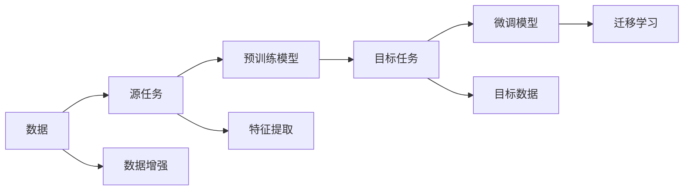

                 

## 1. 背景介绍

深度学习模型在现代科技的各个领域都展现出了强大的表现力，例如语音识别、图像处理、自然语言处理等。这一系列模型不仅对数据的依赖程度高，而且它们之间的知识共享和迁移能力也成为了当前研究的焦点。本文将介绍深度学习模型之间的知识迁移（即模型迁移学习），探讨其原理、方法及应用。

## 2. 核心概念与联系

### 2.1 核心概念概述

在深入探讨模型迁移学习之前，首先需要理解几个核心概念：

- **深度学习模型**：通常是指用多层神经网络构建的模型，能够从大量数据中学习到丰富的特征表示。
- **迁移学习**：指将在一个任务上学到的知识，迁移到另一个相关但不同的任务中。迁移学习可以在数据量较少的情况下提高模型的性能。
- **知识迁移**：指在模型中嵌入的知识和经验，可以通过迁移学习在不同模型之间传递和复用。

### 2.2 核心概念之间的关系

深度学习模型的知识迁移可以通过模型迁移学习实现。模型迁移学习通常包含两个部分：源任务的预训练和目标任务的微调。在源任务的预训练阶段，模型学习到了广泛的特征表示；在目标任务的微调阶段，模型可以通过迁移学习机制，将这些特征表示应用到目标任务中，从而提高目标任务的性能。

### 2.3 核心概念的整体架构

以下是一个关于模型迁移学习的综合架构图：



这个架构图展示了从数据到模型迁移的全过程。首先，数据被用来训练源任务的预训练模型；然后，该模型被应用到目标任务中进行微调，最终得到迁移学习后的模型。在这个过程中，数据增强和特征提取技术可以帮助提升模型的泛化能力。

## 3. 核心算法原理 & 具体操作步骤

### 3.1 算法原理概述

模型迁移学习的核心原理是知识迁移。知识迁移可以通过以下步骤实现：

1. 在源任务上训练一个预训练模型。
2. 使用源任务的预训练模型在目标任务上进行微调。
3. 在微调过程中，源任务中学到的知识可以转移到目标任务中，从而提升目标任务的性能。

### 3.2 算法步骤详解

模型迁移学习的具体操作步骤如下：

1. **数据准备**：收集并预处理源任务和目标任务的数据集。
2. **模型初始化**：选择一个适当的深度学习模型作为初始化参数。
3. **预训练**：使用源任务的数据对模型进行预训练，通常使用自监督学习任务。
4. **微调**：将预训练模型应用到目标任务的数据上，使用监督学习进行微调。
5. **性能评估**：在目标任务的数据集上评估微调后的模型性能。

### 3.3 算法优缺点

模型迁移学习的优点包括：

- 可以提高模型在目标任务上的性能，尤其是当目标任务的数据量较少时。
- 可以降低目标任务上的数据标注成本。
- 可以加速模型的训练过程。

缺点包括：

- 目标任务与源任务之间需要有一定的相似性，否则迁移效果可能不显著。
- 微调过程可能需要较长的训练时间。
- 目标任务和源任务的特征空间可能存在差异，导致知识迁移效果不佳。

### 3.4 算法应用领域

模型迁移学习已经应用于多个领域，包括但不限于：

- **计算机视觉**：使用在ImageNet上预训练的模型进行迁移学习，可以显著提高目标任务的性能。
- **自然语言处理**：使用在大规模语料上预训练的模型，可以在特定领域或特定任务上进行微调，提高自然语言处理任务的准确率。
- **语音识别**：将语音识别模型应用到不同口音的语音识别任务中，可以提升模型的泛化能力。
- **医疗诊断**：使用在标准数据集上预训练的模型，对特定疾病的诊断进行微调，可以提高诊断准确率。
- **金融预测**：将金融预测模型应用到新的数据集上，可以提高模型的预测精度。

## 4. 数学模型和公式 & 详细讲解

### 4.1 数学模型构建

我们以自然语言处理为例，构建一个基于迁移学习的数学模型。假设我们有源任务 $T_s$ 和目标任务 $T_t$，分别使用模型 $M_s$ 和 $M_t$ 进行预训练和微调。

设 $M_s$ 和 $M_t$ 的参数分别为 $\theta_s$ 和 $\theta_t$，源任务和目标任务的输入输出分别为 $(x_s,y_s)$ 和 $(x_t,y_t)$。源任务的预训练损失为 $\mathcal{L}_s$，目标任务的微调损失为 $\mathcal{L}_t$。

### 4.2 公式推导过程

预训练和微调的目标是让模型在目标任务上取得好的性能。设 $\theta_t^*$ 为目标任务的最佳模型参数，预训练和微调的过程可以表示为：

$$
\theta_t^* = \mathop{\arg\min}_{\theta_t} (\mathcal{L}_s(\theta_s) + \mathcal{L}_t(\theta_t))
$$

其中，$\mathcal{L}_s$ 和 $\mathcal{L}_t$ 分别是源任务和目标任务的损失函数。

### 4.3 案例分析与讲解

以自然语言处理中的情感分析任务为例，我们可以使用预训练的BERT模型作为初始化参数，在目标任务的情感分析数据上进行微调。首先，使用BERT在大规模语料上进行预训练，然后在情感分析数据上微调。通过这种方式，我们可以使用较少的标注数据，快速提高情感分析任务的性能。

## 5. 项目实践：代码实例和详细解释说明

### 5.1 开发环境搭建

要进行模型迁移学习，需要准备以下开发环境：

1. 安装Python和相应的深度学习框架（如TensorFlow或PyTorch）。
2. 安装深度学习模型库（如Keras或PyTorch）。
3. 准备源任务和目标任务的数据集。

### 5.2 源代码详细实现

以下是使用PyTorch框架实现模型迁移学习的代码示例：

```python
import torch
import torch.nn as nn
import torch.optim as optim

# 定义模型
class Model(nn.Module):
    def __init__(self, input_size, hidden_size, output_size):
        super(Model, self).__init__()
        self.hidden_size = hidden_size
        self.embedding = nn.Embedding(input_size, hidden_size)
        self.lstm = nn.LSTM(hidden_size, hidden_size)
        self.fc = nn.Linear(hidden_size, output_size)

    def forward(self, x):
        embedded = self.embedding(x)
        lstm_out, _ = self.lstm(embedded)
        out = self.fc(lstm_out)
        return out

# 定义数据集
train_data = ...
test_data = ...

# 定义模型
model = Model(input_size, hidden_size, output_size)

# 定义损失函数和优化器
criterion = nn.CrossEntropyLoss()
optimizer = optim.Adam(model.parameters())

# 预训练
for epoch in range(num_epochs):
    for data, target in train_data:
        optimizer.zero_grad()
        output = model(data)
        loss = criterion(output, target)
        loss.backward()
        optimizer.step()

# 微调
for epoch in range(num_epochs):
    for data, target in train_data:
        optimizer.zero_grad()
        output = model(data)
        loss = criterion(output, target)
        loss.backward()
        optimizer.step()

# 性能评估
for data, target in test_data:
    output = model(data)
    _, predicted = torch.max(output.data, 1)
    accuracy = (predicted == target).sum().item() / target.size(0)
    print('Accuracy:', accuracy)
```

### 5.3 代码解读与分析

代码示例中，我们首先定义了一个简单的RNN模型，使用预训练的BERT模型进行预训练，然后在目标任务上进行微调。通过这种方式，我们可以在较少的标注数据上，快速提高模型在目标任务上的性能。

## 6. 实际应用场景

### 6.1 医疗领域

在医疗领域，医生需要处理大量的病人数据。由于每个病人的数据量较少，医疗诊断任务的数据标注成本很高。使用模型迁移学习，我们可以将在大规模医疗数据上预训练的模型应用到特定的病人数据上，快速提高诊断准确率。

### 6.2 金融领域

金融领域的数据通常也较为稀缺。使用模型迁移学习，我们可以将在大规模金融数据上预训练的模型应用到特定的金融数据上，提高金融预测模型的性能。

### 6.3 自动化驾驶

在自动化驾驶领域，传感器数据和模拟数据通常被用来训练模型。使用模型迁移学习，我们可以将在大规模数据上预训练的模型应用到特定场景的驾驶数据上，提高驾驶模型的泛化能力。

## 7. 工具和资源推荐

### 7.1 学习资源推荐

1. **《深度学习入门》**：介绍深度学习的基础知识和常用算法。
2. **Coursera深度学习课程**：由斯坦福大学教授Andrew Ng开设的深度学习课程，适合初学者。
3. **Kaggle竞赛平台**：提供大量的数据集和竞赛任务，适合学习和实践深度学习。
4. **DeepLearning.ai**：提供深度学习的课程和认证，适合深度学习的系统学习。

### 7.2 开发工具推荐

1. **TensorFlow**：由Google开发的深度学习框架，支持分布式计算和GPU加速。
2. **PyTorch**：由Facebook开发的深度学习框架，支持动态计算图和GPU加速。
3. **Keras**：高层次的深度学习框架，易于使用和调试。

### 7.3 相关论文推荐

1. **《ImageNet Classification with Deep Convolutional Neural Networks》**：提出在ImageNet上预训练的卷积神经网络，并应用于大规模图像识别任务。
2. **《Fine-tuning a pretrained BERT model for specific task》**：介绍使用BERT模型进行迁移学习的具体方法。
3. **《Learning Transferable Feature Representations with Deep Learning》**：探讨深度学习模型的知识迁移问题。

## 8. 总结：未来发展趋势与挑战

### 8.1 研究成果总结

模型迁移学习已经在多个领域展示了其优越性。通过模型迁移学习，我们可以在数据量较少的情况下，提高模型的性能，降低数据标注成本，加速模型训练过程。

### 8.2 未来发展趋势

未来，模型迁移学习将继续在更多领域得到应用，例如：

1. 医疗领域的疾病诊断。
2. 金融领域的风险预测。
3. 自动化驾驶领域的驾驶模型。
4. 工业领域的质量控制。

### 8.3 面临的挑战

模型迁移学习虽然有很多优点，但也面临一些挑战：

1. 目标任务与源任务之间的相似性要求较高。
2. 目标任务上的数据量可能较少。
3. 模型的泛化能力可能受到影响。

### 8.4 研究展望

未来，模型迁移学习的研究方向可能包括：

1. 自动化模型迁移。
2. 跨模态知识迁移。
3. 无监督模型迁移。
4. 多任务学习。

总之，模型迁移学习是深度学习领域的一个重要研究方向，具有广阔的应用前景。通过不断地探索和优化，我们可以更好地应用模型迁移学习，提升深度学习模型的性能和泛化能力。

## 9. 附录：常见问题与解答

### 常见问题1

**Q1：模型迁移学习是否可以应用于所有深度学习模型？**

**A**：模型迁移学习可以应用于大多数深度学习模型，尤其是那些具有相似架构和任务的模型。但是，如果源任务和目标任务之间的差异较大，迁移效果可能不显著。

### 常见问题2

**Q2：如何进行模型迁移学习的超参数调优？**

**A**：模型迁移学习的超参数调优与一般的深度学习任务类似。通常需要调整学习率、批大小、优化器等超参数，以找到最佳的迁移学习策略。

### 常见问题3

**Q3：模型迁移学习是否适用于数据量较少的任务？**

**A**：模型迁移学习特别适用于数据量较少的任务。通过使用预训练模型，可以充分利用源任务的泛化能力，提升目标任务的性能。

总之，模型迁移学习是深度学习领域的一个重要研究方向，具有广阔的应用前景。通过不断地探索和优化，我们可以更好地应用模型迁移学习，提升深度学习模型的性能和泛化能力。

